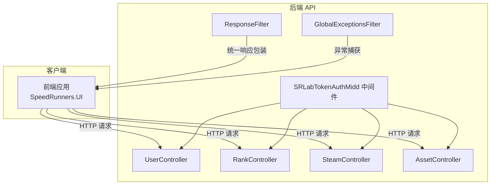
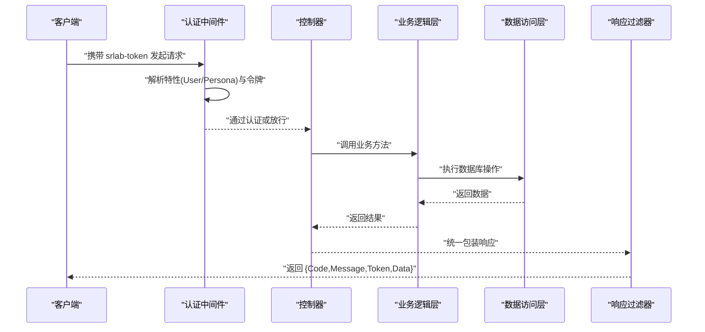
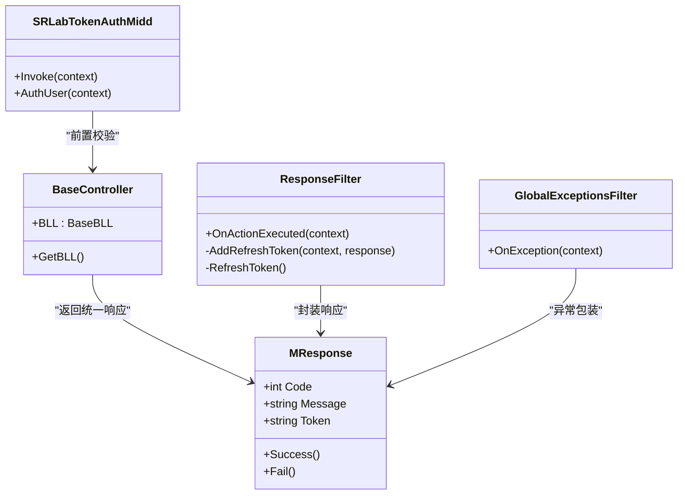

# API 接口参考

<cite>
**本文引用的文件**
- [SpeedRunners.API/SpeedRunners/Controllers/UserController.cs](file://SpeedRunners.API/SpeedRunners/Controllers/UserController.cs)
- [SpeedRunners.API/SpeedRunners/Controllers/RankController.cs](file://SpeedRunners.API/SpeedRunners/Controllers/RankController.cs)
- [SpeedRunners.API/SpeedRunners/Controllers/SteamController.cs](file://SpeedRunners.API/SpeedRunners/Controllers/SteamController.cs)
- [SpeedRunners.API/SpeedRunners/Controllers/AssetController.cs](file://SpeedRunners.API/SpeedRunners/Controllers/AssetController.cs)
- [SpeedRunners.API/SpeedRunners/Controllers/BaseController.cs](file://SpeedRunners.API/SpeedRunners/Controllers/BaseController.cs)
- [SpeedRunners.API/SpeedRunners/Middleware/SRLabTokenAuthMidd.cs](file://SpeedRunners.API/SpeedRunners/Middleware/SRLabTokenAuthMidd.cs)
- [SpeedRunners.API/SpeedRunners/Filter/GlobalExceptionsFilter.cs](file://SpeedRunners.API/SpeedRunners/Filter/GlobalExceptionsFilter.cs)
- [SpeedRunners.API/SpeedRunners/Filter/ResponseFilter.cs](file://SpeedRunners.API/SpeedRunners/Filter/ResponseFilter.cs)
- [SpeedRunners.API/SpeedRunners.Model/MResponse.cs](file://SpeedRunners.API/SpeedRunners.Model/MResponse.cs)
- [SpeedRunners.API/SpeedRunners.Model/UserAttribute.cs](file://SpeedRunners.API/SpeedRunners.Model/UserAttribute.cs)
- [SpeedRunners.API/SpeedRunners.Model/Rank/MRankInfo.cs](file://SpeedRunners.API/SpeedRunners.Model/Rank/MRankInfo.cs)
- [SpeedRunners.API/SpeedRunners.Model/Asset/MMod.cs](file://SpeedRunners.API/SpeedRunners.Model/Asset/MMod.cs)
- [SpeedRunners.API/SpeedRunners.Model/Steam/MSearchPlayerResult.cs](file://SpeedRunners.API/SpeedRunners.Model/Steam/MSearchPlayerResult.cs)
- [SpeedRunners.API/SpeedRunners/Program.cs](file://SpeedRunners.API/SpeedRunners/Program.cs)
- [SpeedRunners.API/SpeedRunners/Startup.cs](file://SpeedRunners.API/SpeedRunners/Startup.cs)
- [SpeedRunners.API/SpeedRunners/appsettings.json](file://SpeedRunners.API/SpeedRunners/appsettings.json)
- [SpeedRunners.UI/src/api/user.js](file://SpeedRunners.UI/src/api/user.js)
- [SpeedRunners.UI/src/api/rank.js](file://SpeedRunners.UI/src/api/rank.js)
- [SpeedRunners.UI/src/api/steam.js](file://SpeedRunners.UI/src/api/steam.js)
- [SpeedRunners.UI/src/api/asset.js](file://SpeedRunners.UI/src/api/asset.js)
- [SpeedRunners.UI/src/utils/request.js](file://SpeedRunners.UI/src/utils/request.js)
</cite>

## 目录
1. [简介](#简介)
2. [项目结构](#项目结构)
3. [核心组件](#核心组件)
4. [架构总览](#架构总览)
5. [详细组件分析](#详细组件分析)
6. [依赖关系分析](#依赖关系分析)
7. [性能与安全](#性能与安全)
8. [故障排查指南](#故障排查指南)
9. [结论](#结论)
10. [附录](#附录)

## 简介
本文件为 SpeedRunnersLab 的完整 API 接口参考，覆盖用户管理、排名统计、MOD 管理、Steam 集成等模块。内容包括：
- 所有 RESTful 接口的 HTTP 方法、URL 模式、请求参数、响应格式与错误码
- 认证授权要求、请求头设置与数据验证规则
- 常见使用场景的请求/响应示例（以路径代替代码）
- API 版本控制、速率限制与安全建议
- 前端 JavaScript SDK 的使用方法与集成示例

## 项目结构
后端基于 ASP.NET Core，控制器位于 SpeedRunners.API/SpeedRunners/Controllers 下，统一通过 BaseController 注入 BLL 层；认证中间件与全局过滤器在 Middleware 与 Filter 目录中；模型定义位于 SpeedRunners.Model。

图表来源
- [SpeedRunners.API/SpeedRunners/Controllers/UserController.cs](file://SpeedRunners.API/SpeedRunners/Controllers/UserController.cs#L1-L58)
- [SpeedRunners.API/SpeedRunners/Controllers/RankController.cs](file://SpeedRunners.API/SpeedRunners/Controllers/RankController.cs#L1-L48)
- [SpeedRunners.API/SpeedRunners/Controllers/SteamController.cs](file://SpeedRunners.API/SpeedRunners/Controllers/SteamController.cs#L1-L28)
- [SpeedRunners.API/SpeedRunners/Controllers/AssetController.cs](file://SpeedRunners.API/SpeedRunners/Controllers/AssetController.cs#L1-L48)
- [SpeedRunners.API/SpeedRunners/Middleware/SRLabTokenAuthMidd.cs](file://SpeedRunners.API/SpeedRunners/Middleware/SRLabTokenAuthMidd.cs#L1-L123)
- [SpeedRunners.API/SpeedRunners/Filter/ResponseFilter.cs](file://SpeedRunners.API/SpeedRunners/Filter/ResponseFilter.cs#L1-L114)
- [SpeedRunners.API/SpeedRunners/Filter/GlobalExceptionsFilter.cs](file://SpeedRunners.API/SpeedRunners/Filter/GlobalExceptionsFilter.cs#L1-L54)

章节来源
- [SpeedRunners.API/SpeedRunners/Controllers/BaseController.cs](file://SpeedRunners.API/SpeedRunners/Controllers/BaseController.cs#L1-L26)
- [SpeedRunners.API/SpeedRunners/Startup.cs](file://SpeedRunners.API/SpeedRunners/Startup.cs)

## 核心组件
- 控制器层：按模块划分，统一继承 BaseController，自动注入当前用户上下文与本地化资源。
- 中间件层：SRLabTokenAuthMidd 实现基于 srlab-token 的认证与授权判定。
- 过滤器层：ResponseFilter 统一响应包装与 Token 刷新；GlobalExceptionsFilter 捕获生产环境异常并记录日志。
- 模型层：MResponse 统一响应结构；各业务模型如 MRankInfo、MMod、MSearchPlayerResult 定义数据结构。

章节来源
- [SpeedRunners.API/SpeedRunners/Controllers/BaseController.cs](file://SpeedRunners.API/SpeedRunners/Controllers/BaseController.cs#L1-L26)
- [SpeedRunners.API/SpeedRunners/Middleware/SRLabTokenAuthMidd.cs](file://SpeedRunners.API/SpeedRunners/Middleware/SRLabTokenAuthMidd.cs#L1-L123)
- [SpeedRunners.API/SpeedRunners/Filter/ResponseFilter.cs](file://SpeedRunners.API/SpeedRunners/Filter/ResponseFilter.cs#L1-L114)
- [SpeedRunners.API/SpeedRunners/Filter/GlobalExceptionsFilter.cs](file://SpeedRunners.API/SpeedRunners/Filter/GlobalExceptionsFilter.cs#L1-L54)
- [SpeedRunners.API/SpeedRunners.Model/MResponse.cs](file://SpeedRunners.API/SpeedRunners.Model/MResponse.cs#L1-L42)

## 架构总览
下图展示了从客户端到控制器、中间件与过滤器的整体调用链路。

图表来源
- [SpeedRunners.API/SpeedRunners/Middleware/SRLabTokenAuthMidd.cs](file://SpeedRunners.API/SpeedRunners/Middleware/SRLabTokenAuthMidd.cs#L31-L101)
- [SpeedRunners.API/SpeedRunners/Filter/ResponseFilter.cs](file://SpeedRunners.API/SpeedRunners/Filter/ResponseFilter.cs#L24-L111)
- [SpeedRunners.API/SpeedRunners/Controllers/BaseController.cs](file://SpeedRunners.API/SpeedRunners/Controllers/BaseController.cs#L14-L23)

## 详细组件分析

### 认证与授权
- 请求头
  - srlab-token：用于标识登录态与权限校验
- 权限特性
  - UserAttribute：仅登录用户可访问
  - PersonaAttribute：匿名也可访问（由中间件判定）
- 中间件行为
  - 若接口标注 User 且缺少有效令牌，返回统一失败响应
  - 成功认证后将当前用户信息注入服务容器，供后续业务使用
- 响应刷新
  - ResponseFilter 在每次响应时根据配置刷新 Token 并回传

章节来源
- [SpeedRunners.API/SpeedRunners/Middleware/SRLabTokenAuthMidd.cs](file://SpeedRunners.API/SpeedRunners/Middleware/SRLabTokenAuthMidd.cs#L54-L101)
- [SpeedRunners.API/SpeedRunners/Filter/ResponseFilter.cs](file://SpeedRunners.API/SpeedRunners/Filter/ResponseFilter.cs#L57-L111)
- [SpeedRunners.API/SpeedRunners.Model/UserAttribute.cs](file://SpeedRunners.API/SpeedRunners.Model/UserAttribute.cs#L1-L13)

### 用户管理模块
- 路由前缀：/api/User
- 常用请求头：srlab-token（部分接口）
- 接口列表
  - GET /GetInfo
    - 功能：获取当前用户基础信息
    - 权限：User
    - 响应：MResponse 包裹 MRankInfo
  - GET /GetPrivacySettings
    - 功能：获取隐私设置
    - 权限：User
    - 响应：MResponse 包裹 MPrivacySettings
  - POST /SetState
    - 功能：设置状态
    - 权限：User
    - 请求体：包含 value 字段（整数）
    - 响应：MResponse
  - POST /SetRankType
    - 功能：设置排行类型
    - 权限：User
    - 请求体：包含 value 字段（整数）
    - 响应：MResponse
  - POST /SetShowWeekPlayTime
    - 功能：设置是否显示周游玩时长
    - 权限：User
    - 请求体：包含 value 字段（整数）
    - 响应：MResponse
  - POST /SetRequestRankData
    - 功能：设置是否允许请求排行数据
    - 权限：User
    - 请求体：包含 value 字段（整数）
    - 响应：MResponse
  - POST /SetShowAddScore
    - 功能：设置是否显示加分
    - 权限：User
    - 请求体：包含 value 字段（整数）
    - 响应：MResponse
  - POST /Login
    - 功能：登录（用户名密码）
    - 权限：匿名
    - 请求体：包含 query 字段（字符串）
    - 响应：MResponse（含新 Token）
  - GET /LogoutOther/{tokenID}
    - 功能：登出其他设备令牌
    - 权限：User
    - 响应：MResponse
  - GET /LogoutLocal
    - 功能：登出当前设备
    - 权限：User
    - 响应：MResponse

请求示例（路径）
- POST /api/User/Login
  - 请求头：Content-Type: application/json
  - 请求体：{"query":"..."}
  - 参考实现：[SpeedRunners.API/SpeedRunners/Controllers/UserController.cs](file://SpeedRunners.API/SpeedRunners/Controllers/UserController.cs#L43-L47)

响应示例（路径）
- 成功：{"Code":666,"Message":"成功","Token":"...","Data":{...}}
- 失败：{"Code":-1,"Message":"...","Token":null}
- 参考模型：[SpeedRunners.API/SpeedRunners.Model/MResponse.cs](file://SpeedRunners.API/SpeedRunners.Model/MResponse.cs#L1-L42)

章节来源
- [SpeedRunners.API/SpeedRunners/Controllers/UserController.cs](file://SpeedRunners.API/SpeedRunners/Controllers/UserController.cs#L1-L58)

### 排名统计模块
- 路由前缀：/api/Rank
- 接口列表
  - GET /GetRankList
    - 功能：获取排行榜列表
    - 权限：Persona
    - 响应：MResponse 包裹 MRankInfo 列表
  - GET /GetAddedChart
    - 功能：获取新增人数图表数据
    - 权限：匿名
    - 响应：MResponse 包裹 MRankInfo 列表
  - GET /GetHourChart
    - 功能：获取小时维度图表数据
    - 权限：Persona
    - 响应：MResponse 包裹 MRankInfo 列表
  - GET /AsyncSRData
    - 功能：异步拉取 SR 数据
    - 权限：User
    - 响应：MResponse
  - GET /InitUserData
    - 功能：初始化用户数据
    - 权限：User
    - 响应：MResponse
  - GET /GetPlaySRList
    - 功能：获取游玩 SR 的玩家列表
    - 权限：Persona
    - 响应：MResponse 包裹 MRankInfo 列表
  - GET /UpdateParticipate/{participate}
    - 功能：更新参与状态
    - 权限：User
    - 响应：布尔值
  - GET /GetSponsor
    - 功能：获取赞助商列表
    - 权限：匿名
    - 响应：MResponse 包裹 MSponsor 列表
  - GET /GetParticipateList
    - 功能：获取参与名单
    - 权限：匿名
    - 响应：MResponse 包裹 MParticipateList 列表

请求示例（路径）
- GET /api/Rank/GetRankList
  - 权限：Persona
  - 参考实现：[SpeedRunners.API/SpeedRunners/Controllers/RankController.cs](file://SpeedRunners.API/SpeedRunners/Controllers/RankController.cs#L17-L17)

响应示例（路径）
- 成功：{"Code":666,"Message":"成功","Token":"...","Data":[{...},{...}]}
- 参考模型：[SpeedRunners.API/SpeedRunners.Model/MResponse.cs](file://SpeedRunners.API/SpeedRunners.Model/MResponse.cs#L1-L42)

章节来源
- [SpeedRunners.API/SpeedRunners/Controllers/RankController.cs](file://SpeedRunners.API/SpeedRunners/Controllers/RankController.cs#L1-L48)
- [SpeedRunners.API/SpeedRunners.Model/Rank/MRankInfo.cs](file://SpeedRunners.API/SpeedRunners.Model/Rank/MRankInfo.cs)

### MOD 管理模块
- 路由前缀：/api/Asset
- 接口列表
  - GET /GetUploadToken
    - 功能：获取上传凭证
    - 权限：User
    - 响应：MResponse 包裹字符串数组
  - POST /GetDownloadUrl
    - 功能：生成下载链接
    - 权限：User
    - 请求体：包含 fileName 字段（字符串）
    - 响应：MResponse 包裹字符串
  - POST /DeleteMod
    - 功能：删除 MOD
    - 权限：User
    - 请求体：MDeleteMod 对象
    - 响应：MResponse
  - POST /GetModList
    - 功能：分页查询 MOD 列表
    - 权限：Persona
    - 请求体：MModPageParam 对象
    - 响应：MResponse 包裹 MPageResult<MModOut>
  - GET /GetMod/{modID}
    - 功能：获取单个 MOD 详情
    - 权限：Persona
    - 响应：MResponse 包裹 MModOut
  - POST /AddMod
    - 功能：新增 MOD
    - 权限：User
    - 请求体：MMod 对象
    - 响应：MResponse
  - GET /OperateModStar/{modID}/{star}
    - 功能：点赞/取消点赞 MOD
    - 权限：User
    - 响应：MResponse
  - GET /GetAfdianSponsor
    - 功能：获取爱发电赞助信息
    - 权限：匿名
    - 响应：MResponse

请求示例（路径）
- POST /api/Asset/AddMod
  - 权限：User
  - 请求体：MMod 对象
  - 参考实现：[SpeedRunners.API/SpeedRunners/Controllers/AssetController.cs](file://SpeedRunners.API/SpeedRunners/Controllers/AssetController.cs#L38-L38)

响应示例（路径）
- 成功：{"Code":666,"Message":"成功","Token":"...","Data":{...}}
- 参考模型：[SpeedRunners.API/SpeedRunners.Model/MResponse.cs](file://SpeedRunners.API/SpeedRunners.Model/MResponse.cs#L1-L42)

章节来源
- [SpeedRunners.API/SpeedRunners/Controllers/AssetController.cs](file://SpeedRunners.API/SpeedRunners/Controllers/AssetController.cs#L1-L48)
- [SpeedRunners.API/SpeedRunners.Model/Asset/MMod.cs](file://SpeedRunners.API/SpeedRunners.Model/Asset/MMod.cs)

### Steam 集成模块
- 路由前缀：/api/Steam
- 接口列表
  - GET /SearchPlayer/{keyWords}
    - 功能：关键词搜索玩家
    - 权限：匿名
    - 响应：MResponse 包裹 MSearchPlayerResult
  - GET /GetPlayerList/{userName}/{sessionID}/{pageNo}
    - 功能：分页获取玩家列表
    - 权限：匿名
    - 响应：MResponse 包裹 MSearchPlayerResult
  - GET /SearchPlayerByUrl/{url}
    - 功能：通过 URL 搜索玩家
    - 权限：匿名
    - 响应：MResponse 包裹 MSearchPlayerResult
  - GET /SearchPlayerBySteamID64/{steamID64}
    - 功能：通过 SteamID64 搜索玩家
    - 权限：匿名
    - 响应：MResponse 包裹 MSearchPlayerResult
  - GET /GetOnlineCount
    - 功能：获取在线人数
    - 权限：匿名
    - 响应：MResponse 包裹 uint

请求示例（路径）
- GET /api/Steam/SearchPlayer/abc
  - 权限：匿名
  - 参考实现：[SpeedRunners.API/SpeedRunners/Controllers/SteamController.cs](file://SpeedRunners.API/SpeedRunners/Controllers/SteamController.cs#L13-L13)

响应示例（路径）
- 成功：{"Code":666,"Message":"成功","Token":"...","Data":{...}}
- 参考模型：[SpeedRunners.API/SpeedRunners.Model/MResponse.cs](file://SpeedRunners.API/SpeedRunners.Model/MResponse.cs#L1-L42)

章节来源
- [SpeedRunners.API/SpeedRunners/Controllers/SteamController.cs](file://SpeedRunners.API/SpeedRunners/Controllers/SteamController.cs#L1-L28)
- [SpeedRunners.API/SpeedRunners.Model/Steam/MSearchPlayerResult.cs](file://SpeedRunners.API/SpeedRunners.Model/Steam/MSearchPlayerResult.cs)

### 统一响应与错误码
- 成功：Code=666，Message="成功"
- 失败：默认 Code=-1，Message 为错误描述
- Token：成功时可能返回新 Token，失败时为 null
- 参考模型：[SpeedRunners.API/SpeedRunners.Model/MResponse.cs](file://SpeedRunners.API/SpeedRunners.Model/MResponse.cs#L1-L42)

章节来源
- [SpeedRunners.API/SpeedRunners.Model/MResponse.cs](file://SpeedRunners.API/SpeedRunners.Model/MResponse.cs#L1-L42)

## 依赖关系分析
- 控制器依赖 BaseController 注入具体 BLL
- 中间件依赖 UserBLL 校验令牌并写入当前用户上下文
- 过滤器依赖 MUser 与 UserBLL 进行 Token 刷新与响应包装
- 模型层提供统一响应结构与业务数据模型

图表来源
- [SpeedRunners.API/SpeedRunners/Controllers/BaseController.cs](file://SpeedRunners.API/SpeedRunners/Controllers/BaseController.cs#L10-L23)
- [SpeedRunners.API/SpeedRunners/Middleware/SRLabTokenAuthMidd.cs](file://SpeedRunners.API/SpeedRunners/Middleware/SRLabTokenAuthMidd.cs#L31-L101)
- [SpeedRunners.API/SpeedRunners/Filter/ResponseFilter.cs](file://SpeedRunners.API/SpeedRunners/Filter/ResponseFilter.cs#L24-L111)
- [SpeedRunners.API/SpeedRunners/Filter/GlobalExceptionsFilter.cs](file://SpeedRunners.API/SpeedRunners/Filter/GlobalExceptionsFilter.cs#L31-L50)
- [SpeedRunners.API/SpeedRunners.Model/MResponse.cs](file://SpeedRunners.API/SpeedRunners.Model/MResponse.cs#L3-L27)

## 性能与安全
- 性能
  - 控制器通过延迟注入 BLL，避免重复实例化
  - 响应统一包装减少前后端适配成本
- 安全
  - 使用 srlab-token 进行会话识别与权限控制
  - 中间件对 User 接口缺失令牌直接拒绝
  - 生产环境异常统一包装并记录日志
- 速率限制
  - 当前仓库未发现显式的速率限制实现，建议在网关或中间件层增加限流策略

章节来源
- [SpeedRunners.API/SpeedRunners/Controllers/BaseController.cs](file://SpeedRunners.API/SpeedRunners/Controllers/BaseController.cs#L14-L23)
- [SpeedRunners.API/SpeedRunners/Middleware/SRLabTokenAuthMidd.cs](file://SpeedRunners.API/SpeedRunners/Middleware/SRLabTokenAuthMidd.cs#L66-L91)
- [SpeedRunners.API/SpeedRunners/Filter/GlobalExceptionsFilter.cs](file://SpeedRunners.API/SpeedRunners/Filter/GlobalExceptionsFilter.cs#L31-L50)

## 故障排查指南
- 常见错误
  - 未登录访问 User 接口：返回 Code=-1，Message 为未登录提示
  - 参数缺失或格式错误：由模型绑定与业务逻辑处理，最终统一返回 MResponse
  - 生产环境异常：返回固定提示并记录日志
- 排查步骤
  - 确认请求头是否包含有效的 srlab-token
  - 检查接口权限特性（User/Persona）与实际访问方式
  - 查看响应中的 Code 与 Message，必要时查看服务端日志

章节来源
- [SpeedRunners.API/SpeedRunners/Middleware/SRLabTokenAuthMidd.cs](file://SpeedRunners.API/SpeedRunners/Middleware/SRLabTokenAuthMidd.cs#L42-L46)
- [SpeedRunners.API/SpeedRunners/Filter/GlobalExceptionsFilter.cs](file://SpeedRunners.API/SpeedRunners/Filter/GlobalExceptionsFilter.cs#L35-L49)

## 结论
本接口参考文档梳理了 SpeedRunnersLab 的核心 API，明确了认证授权、统一响应、异常处理与数据模型。建议在生产环境中补充速率限制与更细粒度的鉴权策略，并持续完善前端 SDK 与文档示例。

## 附录

### 前端 JavaScript SDK 使用与集成
- 基础封装
  - request.js：封装 axios 实例，自动附加 srlab-token 与 Content-Type
  - 参考路径：[SpeedRunners.UI/src/utils/request.js](file://SpeedRunners.UI/src/utils/request.js)
- 模块化 API
  - user.js：用户相关接口封装
    - 参考路径：[SpeedRunners.UI/src/api/user.js](file://SpeedRunners.UI/src/api/user.js)
  - rank.js：排名统计接口封装
    - 参考路径：[SpeedRunners.UI/src/api/rank.js](file://SpeedRunners.UI/src/api/rank.js)
  - steam.js：Steam 集成接口封装
    - 参考路径：[SpeedRunners.UI/src/api/steam.js](file://SpeedRunners.UI/src/api/steam.js)
  - asset.js：MOD 管理接口封装
    - 参考路径：[SpeedRunners.UI/src/api/asset.js](file://SpeedRunners.UI/src/api/asset.js)
- 使用流程
  - 登录后保存 srlab-token
  - 调用对应模块方法，SDK 自动处理统一响应与 Token 刷新
  - 错误处理：根据 Code 与 Message 进行提示或重定向

章节来源
- [SpeedRunners.UI/src/utils/request.js](file://SpeedRunners.UI/src/utils/request.js)
- [SpeedRunners.UI/src/api/user.js](file://SpeedRunners.UI/src/api/user.js)
- [SpeedRunners.UI/src/api/rank.js](file://SpeedRunners.UI/src/api/rank.js)
- [SpeedRunners.UI/src/api/steam.js](file://SpeedRunners.UI/src/api/steam.js)
- [SpeedRunners.UI/src/api/asset.js](file://SpeedRunners.UI/src/api/asset.js)