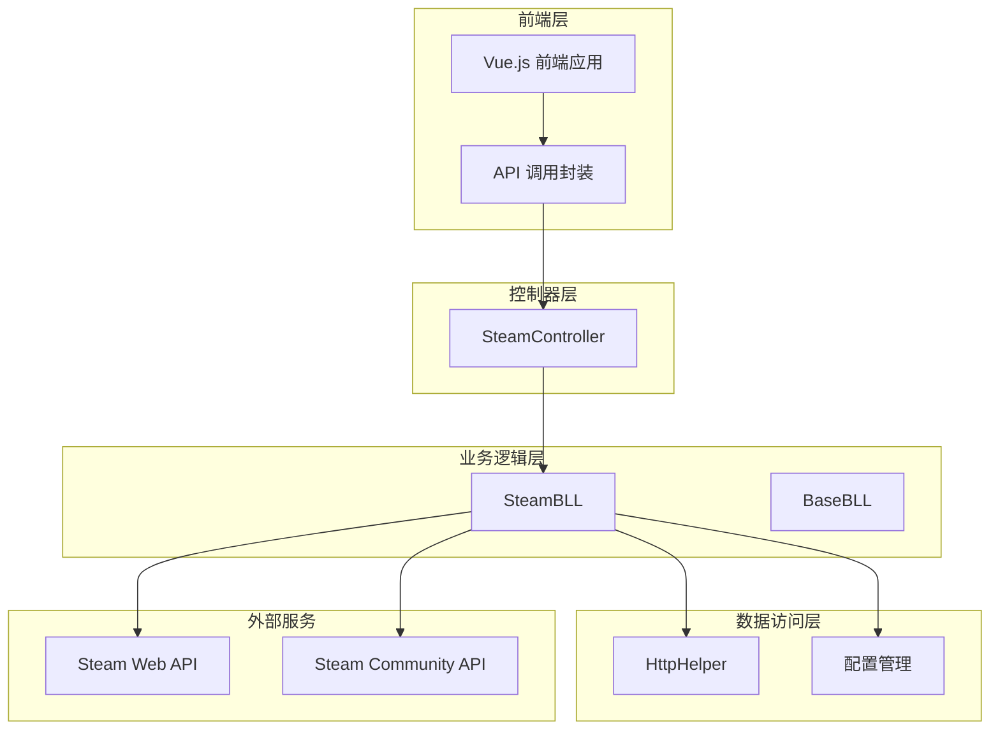
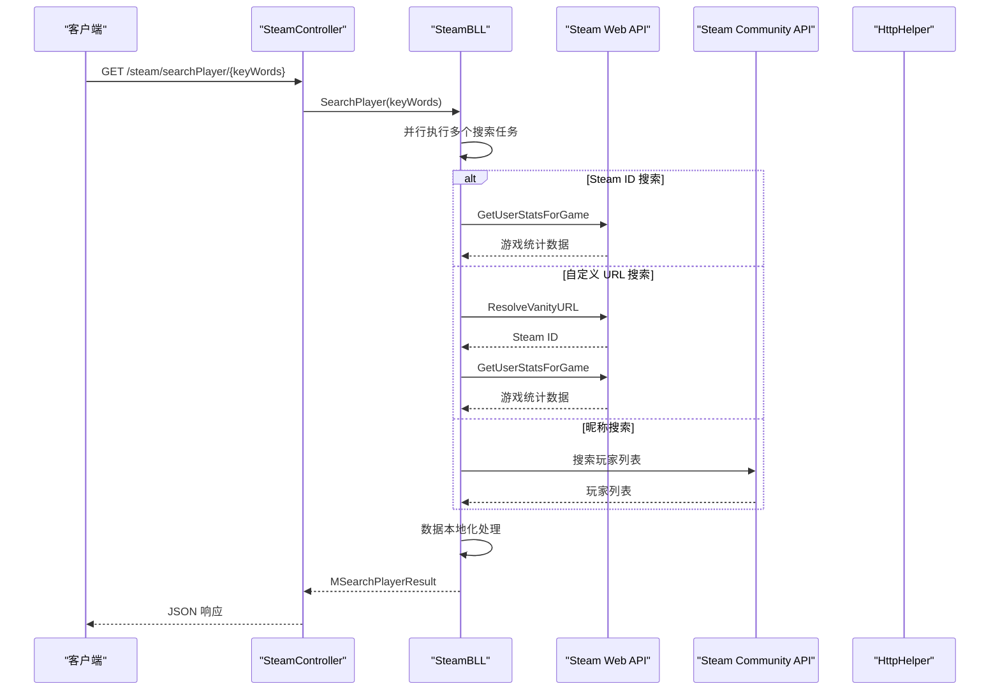
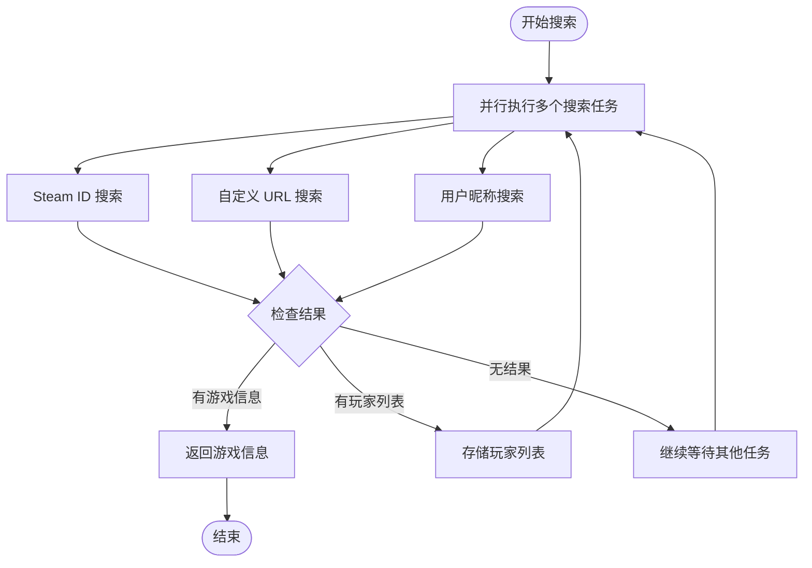
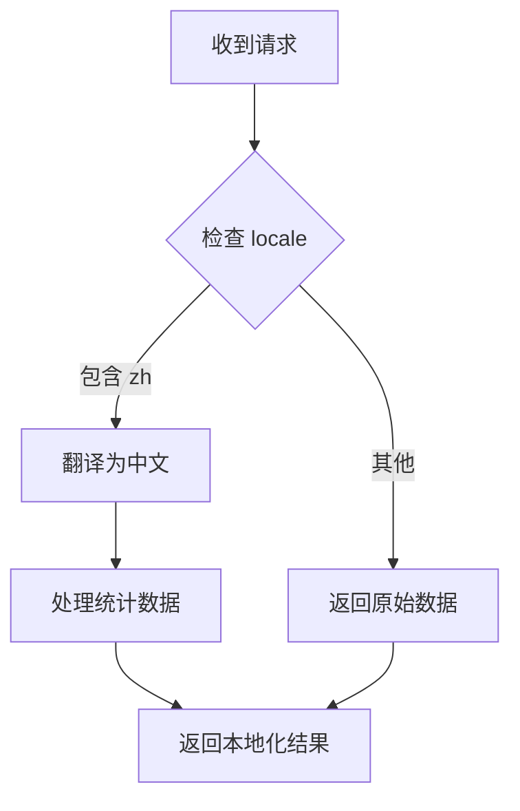
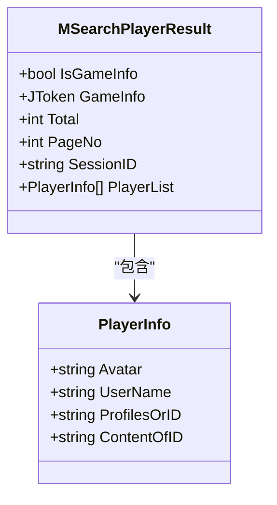
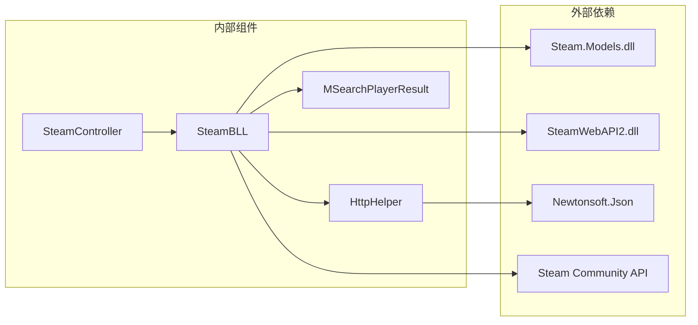

# Steam 集成 API

<cite>
**本文档引用的文件**
- [SteamController.cs](file://SpeedRunners.API/SpeedRunners/Controllers/SteamController.cs)
- [SteamBLL.cs](file://SpeedRunners.API/SpeedRunners.BLL/SteamBLL.cs)
- [MSearchPlayerResult.cs](file://SpeedRunners.API/SpeedRunners.Model/Steam/MSearchPlayerResult.cs)
- [steam.js](file://SpeedRunners.UI/src/api/steam.js)
- [index.vue](file://SpeedRunners.UI/src/views/searchPlayer/index.vue)
- [HttpHelper.cs](file://SpeedRunners.API/SpeedRunners.Utils/HttpHelper.cs)
- [Startup.cs](file://SpeedRunners.API/SpeedRunners/Startup.cs)
- [appsettings.json](file://SpeedRunners.API/SpeedRunners/SpeedRunners/appsettings.json)
- [BaseBLL.cs](file://SpeedRunners.API/SpeedRunners.Utils/BaseBLL.cs)
- [Task.cs](file://SpeedRunners.Scheduler/Task.cs)
</cite>

## 目录
1. [简介](#简介)
2. [项目结构](#项目结构)
3. [核心组件](#核心组件)
4. [架构概览](#架构概览)
5. [详细组件分析](#详细组件分析)
6. [依赖关系分析](#依赖关系分析)
7. [性能考虑](#性能考虑)
8. [故障排除指南](#故障排除指南)
9. [结论](#结论)
10. [附录](#附录)

## 简介

SpeedRunnersLab 项目中的 Steam 集成模块提供了完整的 Steam API 集成解决方案，支持玩家搜索、游戏信息查询、在线状态获取等功能。该模块基于 ASP.NET Core 构建，集成了 Steam Web API 和 Steam Community API，为 SpeedRunners 游戏提供专业的玩家数据分析和统计功能。

本模块的主要特性包括：
- 多种玩家搜索方式（Steam ID、自定义 URL、昵称）
- 游戏信息查询和本地化处理
- 在线玩家数量统计
- 玩家列表分页和筛选
- 数据缓存和更新策略
- 错误处理和重试机制

## 项目结构

Steam 集成模块采用分层架构设计，主要包含以下层次：

**图表来源**
- [SteamController.cs](file://SpeedRunners.API/SpeedRunners/Controllers/SteamController.cs#L1-L28)
- [SteamBLL.cs](file://SpeedRunners.API/SpeedRunners.BLL/SteamBLL.cs#L1-L448)
- [HttpHelper.cs](file://SpeedRunners.API/SpeedRunners.Utils/HttpHelper.cs#L1-L146)

**章节来源**
- [SteamController.cs](file://SpeedRunners.API/SpeedRunners/Controllers/SteamController.cs#L1-L28)
- [SteamBLL.cs](file://SpeedRunners.API/SpeedRunners.BLL/SteamBLL.cs#L1-L448)
- [Startup.cs](file://SpeedRunners.API/SpeedRunners/Startup.cs#L1-L87)

## 核心组件

### 控制器层

SteamController 提供了 RESTful API 接口，负责接收前端请求并调用业务逻辑层。

### 业务逻辑层

SteamBLL 是核心业务组件，实现了所有 Steam API 集成功能，包括：
- 玩家搜索和验证
- 游戏信息查询
- 在线状态统计
- 数据本地化处理

### 数据模型

MSearchPlayerResult 定义了统一的响应数据结构，支持两种模式：
- 游戏信息模式：返回玩家的游戏统计数据
- 玩家列表模式：返回匹配的玩家列表

**章节来源**
- [SteamController.cs](file://SpeedRunners.API/SpeedRunners/Controllers/SteamController.cs#L10-L26)
- [SteamBLL.cs](file://SpeedRunners.API/SpeedRunners.BLL/SteamBLL.cs#L18-L448)
- [MSearchPlayerResult.cs](file://SpeedRunners.API/SpeedRunners.Model/Steam/MSearchPlayerResult.cs#L6-L37)

## 架构概览

Steam 集成模块采用分层架构，确保了良好的可维护性和扩展性：

**图表来源**
- [SteamController.cs](file://SpeedRunners.API/SpeedRunners/Controllers/SteamController.cs#L12-L25)
- [SteamBLL.cs](file://SpeedRunners.API/SpeedRunners.BLL/SteamBLL.cs#L113-L135)

**章节来源**
- [SteamController.cs](file://SpeedRunners.API/SpeedRunners/Controllers/SteamController.cs#L1-L28)
- [SteamBLL.cs](file://SpeedRunners.API/SpeedRunners.BLL/SteamBLL.cs#L28-L448)

## 详细组件分析

### SteamController 分析

SteamController 提供了六个主要的 API 接口：

#### 玩家搜索接口
- **路径**: `GET /api/steam/searchPlayer/{keyWords}`
- **功能**: 支持多种输入格式的玩家搜索
- **参数**: keyWords（支持 Steam ID、自定义 URL 或昵称）

#### 玩家列表接口
- **路径**: `GET /api/steam/getPlayerList/{userName}/{sessionID}/{pageNo}`
- **功能**: 获取 Steam 社区中的玩家列表
- **参数**: 用户名、会话 ID、页码

#### URL 搜索接口
- **路径**: `GET /api/steam/searchPlayerByUrl/{url}`
- **功能**: 通过自定义 URL 查询玩家信息
- **参数**: Steam 自定义 URL

#### Steam ID 搜索接口
- **路径**: `GET /api/steam/searchPlayerBySteamID64/{steamID64}`
- **功能**: 通过 64 位 Steam ID 查询玩家信息
- **参数**: Steam ID

#### 在线统计接口
- **路径**: `GET /api/steam/getOnlineCount`
- **功能**: 获取当前在线玩家数量
- **返回**: uint 类型的在线人数

**章节来源**
- [SteamController.cs](file://SpeedRunners.API/SpeedRunners/Controllers/SteamController.cs#L12-L26)

### SteamBLL 业务逻辑分析

SteamBLL 实现了复杂的多源数据查询和处理逻辑：

#### 并行搜索机制

**图表来源**
- [SteamBLL.cs](file://SpeedRunners.API/SpeedRunners.BLL/SteamBLL.cs#L113-L135)

#### 数据本地化处理
系统支持中英文双语显示，通过检测请求头中的 locale 字段来决定语言：

**图表来源**
- [SteamBLL.cs](file://SpeedRunners.API/SpeedRunners.BLL/SteamBLL.cs#L231-L236)

#### 游戏统计本地化映射
系统对 SpeedRunners 游戏的统计数据进行了中文本地化处理，包括武器使用统计、游戏胜负统计、角色选择统计等。

**章节来源**
- [SteamBLL.cs](file://SpeedRunners.API/SpeedRunners.BLL/SteamBLL.cs#L113-L448)

### 数据模型分析

MSearchPlayerResult 提供了统一的数据结构：

**图表来源**
- [MSearchPlayerResult.cs](file://SpeedRunners.API/SpeedRunners.Model/Steam/MSearchPlayerResult.cs#L6-L37)

**章节来源**
- [MSearchPlayerResult.cs](file://SpeedRunners.API/SpeedRunners.Model/Steam/MSearchPlayerResult.cs#L1-L38)

### 前端集成分析

前端通过 Vue.js 实现了完整的 Steam 集成界面：

#### API 调用封装
前端提供了专门的 API 封装模块，支持：
- 玩家搜索
- 玩家列表获取
- URL 搜索
- Steam ID 搜索
- 在线统计

#### 用户界面实现
搜索页面实现了完整的用户交互流程：
- 支持多种输入格式
- 实时搜索结果显示
- 玩家列表分页加载
- 数据本地化显示

**章节来源**
- [steam.js](file://SpeedRunners.UI/src/api/steam.js#L1-L36)
- [index.vue](file://SpeedRunners.UI/src/views/searchPlayer/index.vue#L1-L169)

## 依赖关系分析

**图表来源**
- [SteamBLL.cs](file://SpeedRunners.API/SpeedRunners.BLL/SteamBLL.cs#L6-L8)
- [HttpHelper.cs](file://SpeedRunners.API/SpeedRunners.Utils/HttpHelper.cs#L1-L146)

**章节来源**
- [SteamBLL.cs](file://SpeedRunners.API/SpeedRunners.BLL/SteamBLL.cs#L1-L448)
- [HttpHelper.cs](file://SpeedRunners.API/SpeedRunners.Utils/HttpHelper.cs#L1-L146)

## 性能考虑

### 并行处理优化
SteamBLL 实现了多任务并行处理，通过 `Task.WhenAny` 机制优先返回第一个成功的搜索结果，提高了响应速度。

### 缓存策略
虽然代码中没有显式的缓存实现，但可以通过以下方式优化：
- 对频繁查询的玩家信息进行内存缓存
- 实现 TTL（Time To Live）机制
- 使用分布式缓存（如 Redis）

### 连接池管理
HttpHelper 使用了连接池管理，设置了合理的超时时间和代理配置。

### 错误处理
系统实现了多层次的错误处理机制：
- 异常捕获和日志记录
- 超时处理
- 代理回退机制

## 故障排除指南

### 常见问题及解决方案

#### Steam API 密钥问题
- **症状**: API 调用失败，返回认证错误
- **解决方案**: 检查 `appsettings.json` 中的 ApiKey 配置

#### 网络连接问题
- **症状**: 请求超时或连接失败
- **解决方案**: 检查代理设置，确认网络连通性

#### 数据解析错误
- **症状**: JSON 解析失败
- **解决方案**: 添加数据验证和异常处理

#### 本地化问题
- **症状**: 数据未正确本地化
- **解决方案**: 检查请求头中的 locale 字段

**章节来源**
- [appsettings.json](file://SpeedRunners.API/SpeedRunners/SpeedRunners/appsettings.json#L1-L20)
- [HttpHelper.cs](file://SpeedRunners.API/SpeedRunners.Utils/HttpHelper.cs#L28-L34)

## 结论

SpeedRunnersLab 的 Steam 集成模块是一个功能完整、架构清晰的 API 集成解决方案。它成功地整合了 Steam Web API 和 Steam Community API，为 SpeedRunners 游戏提供了专业的玩家数据分析功能。

模块的主要优势包括：
- 多种搜索方式支持
- 完善的错误处理机制
- 数据本地化处理
- 响应式前端界面
- 可扩展的架构设计

建议的改进方向：
- 实现数据缓存机制
- 添加 API 限流控制
- 增强监控和日志功能
- 优化性能和并发处理

## 附录

### API 接口规范

#### 玩家搜索
- **方法**: GET
- **路径**: `/api/steam/searchPlayer/{keyWords}`
- **参数**: keyWords（Steam ID、自定义 URL 或昵称）
- **响应**: MSearchPlayerResult

#### 玩家列表
- **方法**: GET
- **路径**: `/api/steam/getPlayerList/{userName}/{sessionID}/{pageNo}`
- **参数**: 用户名、会话 ID、页码
- **响应**: MSearchPlayerResult

#### URL 搜索
- **方法**: GET
- **路径**: `/api/steam/searchPlayerByUrl/{url}`
- **参数**: Steam 自定义 URL
- **响应**: MSearchPlayerResult

#### Steam ID 搜索
- **方法**: GET
- **路径**: `/api/steam/searchPlayerBySteamID64/{steamID64}`
- **参数**: Steam ID
- **响应**: MSearchPlayerResult

#### 在线统计
- **方法**: GET
- **路径**: `/api/steam/getOnlineCount`
- **响应**: 在线玩家数量（uint）

### 配置说明

#### 应用程序配置
- **ApiKey**: Steam Web API 访问密钥
- **Proxy.Enable**: 是否启用代理
- **Proxy.Address**: 代理服务器地址

#### 本地化配置
- **locale**: 请求头中的语言标识
- **支持语言**: 中文（zh）、英文（en）

### 第三方服务集成

#### Steam Web API
- **基础 URL**: https://api.steampowered.com
- **应用程序 ID**: 207140（SpeedRunners）
- **认证方式**: API Key

#### Steam Community API
- **基础 URL**: https://steamcommunity.com
- **认证方式**: Cookie 会话
- **功能**: 玩家搜索、用户列表获取