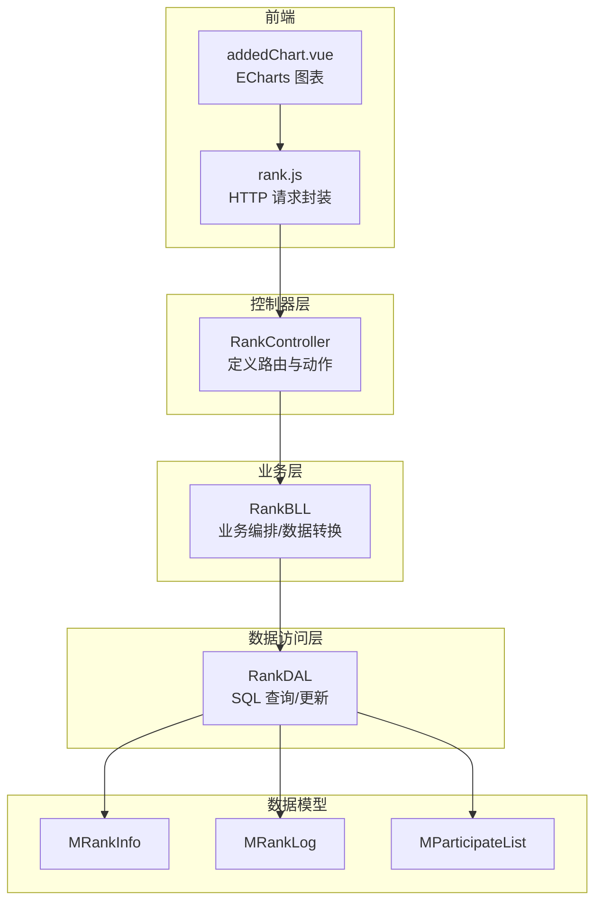
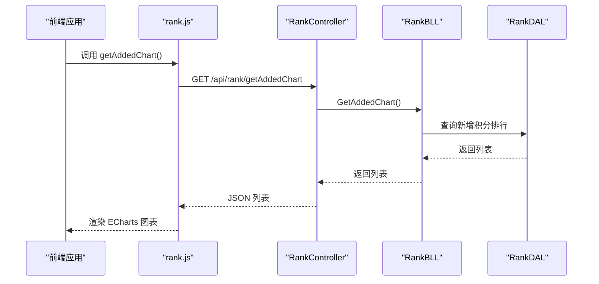
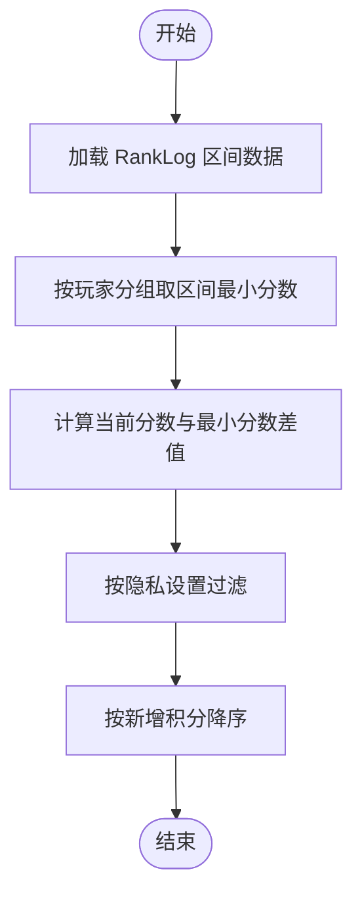
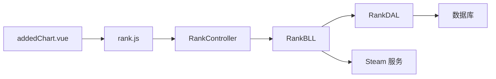

# 排名统计 API

<cite>
**本文引用的文件**
- [RankController.cs](file://SpeedRunners.API/SpeedRunners/Controllers/RankController.cs)
- [RankBLL.cs](file://SpeedRunners.API/SpeedRunners.BLL/RankBLL.cs)
- [RankDAL.cs](file://SpeedRunners.API/SpeedRunners.DAL/RankDAL.cs)
- [MRankInfo.cs](file://SpeedRunners.API/SpeedRunners.Model/Rank/MRankInfo.cs)
- [MRankLog.cs](file://SpeedRunners.API/SpeedRunners.Model/Rank/MRankLog.cs)
- [MParticipateList.cs](file://SpeedRunners.API/SpeedRunners.Model/Rank/MParticipateList.cs)
- [MPageParam.cs](file://SpeedRunners.API/SpeedRunners.Model/MPageParam.cs)
- [MPageResult.cs](file://SpeedRunners.API/SpeedRunners.Model/MPageResult.cs)
- [BaseController.cs](file://SpeedRunners.API/SpeedRunners/Controllers/BaseController.cs)
- [rank.js](file://SpeedRunners.UI/src/api/rank.js)
- [addedChart.vue](file://SpeedRunners.UI/src/views/index/addedChart.vue)
- [privacySettings.vue](file://SpeedRunners.UI/src/views/other/privacySettings.vue)
- [tmdsr.sql](file://mysql-dump/tmdsr.sql)
</cite>

## 目录
1. [简介](#简介)
2. [项目结构](#项目结构)
3. [核心组件](#核心组件)
4. [架构总览](#架构总览)
5. [详细组件分析](#详细组件分析)
6. [依赖关系分析](#依赖关系分析)
7. [性能考虑](#性能考虑)
8. [故障排查指南](#故障排查指南)
9. [结论](#结论)
10. [附录](#附录)

## 简介
本文件为“排名统计模块”的完整 API 接口文档，覆盖玩家排名查询、历史记录获取、参与状态管理、实时/周榜/月榜等多维度数据接口，以及隐私设置对数据可见性的影响。文档同时说明排名算法、数据更新机制与缓存策略，并提供前端图表数据接口与可视化集成方案，最后给出性能优化与大数据量查询的最佳实践。

## 项目结构
- 控制器层：RankController 提供对外 API，路由形如 /api/rank/{action}
- 业务层：RankBLL 负责业务逻辑编排，调用 DAL 层并处理数据转换
- 数据访问层：RankDAL 执行 SQL 查询与写入，维护 RankInfo、RankLog、Sponsor 等表
- 模型层：MRankInfo、MRankLog、MParticipateList 定义数据结构
- 前端：UI 通过 rank.js 发起请求，addedChart.vue 使用 ECharts 展示“新增积分”排行榜

**图示来源**
- [RankController.cs](file://SpeedRunners.API/SpeedRunners/Controllers/RankController.cs#L11-L47)
- [RankBLL.cs](file://SpeedRunners.API/SpeedRunners.BLL/RankBLL.cs#L14-L210)
- [RankDAL.cs](file://SpeedRunners.API/SpeedRunners.DAL/RankDAL.cs#L11-L175)
- [MRankInfo.cs](file://SpeedRunners.API/SpeedRunners.Model/Rank/MRankInfo.cs#L5-L36)
- [MRankLog.cs](file://SpeedRunners.API/SpeedRunners.Model/Rank/MRankLog.cs#L5-L12)
- [MParticipateList.cs](file://SpeedRunners.API/SpeedRunners.Model/Rank/MParticipateList.cs#L7-L18)
- [rank.js](file://SpeedRunners.UI/src/api/rank.js#L1-L64)
- [addedChart.vue](file://SpeedRunners.UI/src/views/index/addedChart.vue#L102-L148)

**章节来源**
- [RankController.cs](file://SpeedRunners.API/SpeedRunners/Controllers/RankController.cs#L11-L47)
- [RankBLL.cs](file://SpeedRunners.API/SpeedRunners.BLL/RankBLL.cs#L14-L210)
- [RankDAL.cs](file://SpeedRunners.API/SpeedRunners.DAL/RankDAL.cs#L11-L175)
- [rank.js](file://SpeedRunners.UI/src/api/rank.js#L1-L64)

## 核心组件
- 控制器：提供统一的 /api/rank/{action} 路由，映射到具体业务动作
- 业务层：封装数据聚合、计算（如参与度评分）、隐私过滤、异步数据同步等
- 数据访问层：提供按维度查询（总榜、新增积分、周时长）、参与列表、赞助商列表等
- 模型层：定义排名信息、日志、参与列表等数据结构
- 前端：提供图表渲染与交互，支持分页与筛选

**章节来源**
- [RankController.cs](file://SpeedRunners.API/SpeedRunners/Controllers/RankController.cs#L11-L47)
- [RankBLL.cs](file://SpeedRunners.API/SpeedRunners.BLL/RankBLL.cs#L28-L207)
- [RankDAL.cs](file://SpeedRunners.API/SpeedRunners.DAL/RankDAL.cs#L32-L172)
- [MRankInfo.cs](file://SpeedRunners.API/SpeedRunners.Model/Rank/MRankInfo.cs#L5-L36)
- [MRankLog.cs](file://SpeedRunners.API/SpeedRunners.Model/Rank/MRankLog.cs#L5-L12)
- [MParticipateList.cs](file://SpeedRunners.API/SpeedRunners.Model/Rank/MParticipateList.cs#L7-L18)

## 架构总览
以下序列图展示一次典型“获取新增积分排行榜”的调用链路，体现从前端到控制器、业务层、数据层的协作。

**图示来源**
- [rank.js](file://SpeedRunners.UI/src/api/rank.js#L31-L36)
- [RankController.cs](file://SpeedRunners.API/SpeedRunners/Controllers/RankController.cs#L19-L20)
- [RankBLL.cs](file://SpeedRunners.API/SpeedRunners.BLL/RankBLL.cs#L78-L84)
- [RankDAL.cs](file://SpeedRunners.API/SpeedRunners.DAL/RankDAL.cs#L44-L81)

## 详细组件分析

### 接口清单与规范
- 获取总榜
  - 方法：GET
  - 路径：/api/rank/getRankList
  - 权限：公开
  - 返回：MRankInfo 列表（按 RankScore 降序）
  - 说明：仅返回已登记的正式榜单数据（RankType=1）

- 获取新增积分排行榜
  - 方法：GET
  - 路径：/api/rank/getAddedChart
  - 权限：公开
  - 返回：MRankInfo 列表（按新增积分降序）
  - 说明：基于 RankLog 的区间最小值与当前分数差值计算，过滤隐私设置

- 获取周时长排行榜
  - 方法：GET
  - 路径：/api/rank/getHourChart
  - 权限：公开
  - 返回：MRankInfo 列表（按周游玩时长降序）
  - 说明：过滤隐私设置，仅显示公开周时长

- 获取正在玩 SR 的玩家
  - 方法：GET
  - 路径：/api/rank/getPlaySRList
  - 权限：公开
  - 返回：MRankInfo 列表（按 RankScore 降序）
  - 说明：筛选特定游戏 ID 的玩家

- 异步同步 SR 基础数据
  - 方法：GET
  - 路径：/api/rank/asyncSRData
  - 权限：需登录
  - 返回：通用响应对象
  - 说明：从 Steam 获取分数与状态，写入 RankInfo 与 RankLog

- 初始化用户数据
  - 方法：GET
  - 路径：/api/rank/initUserData
  - 权限：需登录
  - 返回：void
  - 说明：首次初始化用户信息与日志，事务保证一致性

- 更新参与状态
  - 方法：GET
  - 路径：/api/rank/updateParticipate/{participate}
  - 权限：需登录
  - 参数：participate（布尔）
  - 返回：bool
  - 说明：更新当前用户的参与标记

- 获取参与玩家列表
  - 方法：GET
  - 路径：/api/rank/getParticipateList
  - 权限：公开
  - 返回：MParticipateList 列表（按自定义评分降序）
  - 说明：内部计算综合评分并排序

- 获取赞助商列表
  - 方法：GET
  - 路径：/api/rank/getSponsor
  - 权限：公开
  - 返回：MSponsor 列表（按金额降序）
  - 说明：固定匹配编号的赞助商

**章节来源**
- [RankController.cs](file://SpeedRunners.API/SpeedRunners/Controllers/RankController.cs#L15-L46)
- [rank.js](file://SpeedRunners.UI/src/api/rank.js#L3-L64)

### 数据模型与字段说明
- MRankInfo
  - 关键字段：PlatformID、RankID、PersonaName、AvatarS/M/L、State、GameID、RankLevel、RankType、RankCount、RankScore、OldRankScore、CreateTime、ModifyTime、WeekPlayTime、PlayTime、Participate
  - 用途：排名主表，承载玩家头像、状态、分数、时长、参与等信息

- MRankLog
  - 关键字段：PlatformID、RankScore、Date
  - 用途：记录每日分数快照，用于新增积分排行等统计

- MParticipateList
  - 关键字段：PlatformID、PersonaName、AvatarM、RankScore、WeekPlayTime、PlayTime、SxlScore
  - 用途：参与玩家列表，包含综合评分字段

**章节来源**
- [MRankInfo.cs](file://SpeedRunners.API/SpeedRunners.Model/Rank/MRankInfo.cs#L5-L36)
- [MRankLog.cs](file://SpeedRunners.API/SpeedRunners.Model/Rank/MRankLog.cs#L5-L12)
- [MParticipateList.cs](file://SpeedRunners.API/SpeedRunners.Model/Rank/MParticipateList.cs#L7-L18)

### 排名算法与数据更新机制
- 总榜与筛选
  - RankInfo 中 RankType=1 的记录构成正式总榜；RankType 其他值可能代表隐私或非正式状态
- 新增积分排行
  - 基于 RankLog 的时间窗口（固定天数区间），取每个玩家区间内最早分数与当前分数之差作为“新增积分”
  - 隐私过滤：仅展示允许公开“新增积分”的玩家
- 周时长排行
  - 基于 RankInfo.WeekPlayTime 字段，按周游玩时长降序
  - 隐私过滤：仅展示允许公开“周游玩时长”的玩家
- 参与玩家列表
  - 内部计算综合评分：结合周时长与 RankScore，再按综合分降序
- 数据更新
  - 异步同步：从 Steam 获取分数与状态，写入 RankInfo；若无历史记录则写入 RankLog
  - 初始化：首次注册用户时，若存在 SR 分数则补齐 RankInfo 与 RankLog，并开启事务保证一致性

**图示来源**
- [RankDAL.cs](file://SpeedRunners.API/SpeedRunners.DAL/RankDAL.cs#L44-L81)

**章节来源**
- [RankBLL.cs](file://SpeedRunners.API/SpeedRunners.BLL/RankBLL.cs#L78-L96)
- [RankDAL.cs](file://SpeedRunners.API/SpeedRunners.DAL/RankDAL.cs#L44-L92)

### 隐私设置与数据可见性
- 隐私字段（来自隐私设置页面）
  - publishState：发布状态
  - publishPlaytime：发布周游玩时长
  - allowGetRankScore：允许获取排名数据
  - publishAddScore：发布新增积分
  - publishTotalScore：发布总积分
- 影响范围
  - 新增积分排行：仅显示允许公开“新增积分”的玩家
  - 周时长排行：仅显示允许公开“周游玩时长”的玩家
  - 总榜/参与列表：受“允许获取排名数据”影响

**章节来源**
- [privacySettings.vue](file://SpeedRunners.UI/src/views/other/privacySettings.vue#L15-L95)
- [RankDAL.cs](file://SpeedRunners.API/SpeedRunners.DAL/RankDAL.cs#L74-L77)
- [RankDAL.cs](file://SpeedRunners.API/SpeedRunners.DAL/RankDAL.cs#L87-L89)

### 前端图表与可视化集成
- 图表数据接口
  - 新增积分排行：调用 getAddedChart()，返回 MRankInfo 列表
- ECharts 集成要点
  - dataset.source 绑定后端返回的列表
  - x 轴为“新增积分”，y 轴为“昵称”
  - 支持标签显示与颜色映射
- 参考实现
  - addedChart.vue 中的 ECharts 配置与数据绑定

**章节来源**
- [rank.js](file://SpeedRunners.UI/src/api/rank.js#L31-L36)
- [addedChart.vue](file://SpeedRunners.UI/src/views/index/addedChart.vue#L102-L148)

### 分页查询、排序规则与筛选条件
- 分页参数
  - MPageParam：PageNo、PageSize、Offset、Keywords、FuzzyKeywords
  - Offset 由 PageSize 与 PageNo 计算得出
- 分页结果
  - MPageResult：Total、List
- 当前实现中的分页与筛选
  - RankDAL 提供按 SteamID 过滤的全量查询（用于参与列表等场景）
  - 未见通用分页接口暴露至控制器；如需分页，请在前端或扩展控制器增加分页参数与排序字段

**章节来源**
- [MPageParam.cs](file://SpeedRunners.API/SpeedRunners.Model/MPageParam.cs#L3-L14)
- [MPageResult.cs](file://SpeedRunners.API/SpeedRunners.Model/MPageResult.cs#L7-L12)
- [RankDAL.cs](file://SpeedRunners.API/SpeedRunners.DAL/RankDAL.cs#L17-L25)

### 缓存策略
- 当前实现未发现显式缓存层
- 建议
  - 对高频查询（如总榜、周时长榜）引入 Redis 缓存，设置合理过期时间
  - 对新增积分排行可按天缓存，避免重复计算
  - 结合数据库索引与查询优化，降低热数据压力

[本节为通用建议，不直接分析具体文件]

## 依赖关系分析
- 控制器依赖业务层
- 业务层依赖数据访问层与外部 Steam 服务
- 数据访问层依赖数据库与隐私设置表
- 前端通过 API 封装调用控制器

**图示来源**
- [RankController.cs](file://SpeedRunners.API/SpeedRunners/Controllers/RankController.cs#L13-L47)
- [RankBLL.cs](file://SpeedRunners.API/SpeedRunners.BLL/RankBLL.cs#L16-L21)
- [RankDAL.cs](file://SpeedRunners.API/SpeedRunners.DAL/RankDAL.cs#L11-L175)
- [rank.js](file://SpeedRunners.UI/src/api/rank.js#L1-L64)

**章节来源**
- [BaseController.cs](file://SpeedRunners.API/SpeedRunners/Controllers/BaseController.cs#L10-L24)

## 性能考虑
- 数据库层面
  - 为 RankInfo 的 RankScore、WeekPlayTime、PlatformID 建立索引
  - 为 RankLog 的 PlatformID、Date 建立复合索引，加速新增积分排行计算
- 查询优化
  - 新增积分排行采用子查询与分组聚合，建议限制时间窗口与返回条数
  - 周时长排行与总榜排序字段建立索引
- 缓存与并发
  - 对热点榜单进行缓存，设置 TTL 与失效策略
  - 使用分布式锁或队列控制数据同步任务并发
- 前端优化
  - 图表懒加载与虚拟滚动，减少一次性渲染压力
  - 合理分页与无限滚动，避免大量数据传输

[本节为通用建议，不直接分析具体文件]

## 故障排查指南
- 新增积分排行为空
  - 检查隐私设置：是否允许公开“新增积分”
  - 检查 RankLog 是否存在对应日期记录
- 周时长排行异常
  - 检查隐私设置：是否允许公开“周游玩时长”
  - 检查 WeekPlayTime 字段是否正确更新
- 总榜不显示
  - 检查 RankType 是否为 1
  - 检查是否存在隐私权限导致隐藏
- 初始化失败
  - 确认用户是否已拥有 SR 游戏
  - 检查事务提交与异常处理
- 数据库结构
  - 参考 tmdsr.sql 中 RankLog 表结构与字段类型

**章节来源**
- [RankDAL.cs](file://SpeedRunners.API/SpeedRunners.DAL/RankDAL.cs#L74-L77)
- [RankDAL.cs](file://SpeedRunners.API/SpeedRunners.DAL/RankDAL.cs#L87-L89)
- [RankDAL.cs](file://SpeedRunners.API/SpeedRunners.DAL/RankDAL.cs#L121-L147)
- [tmdsr.sql](file://mysql-dump/tmdsr.sql#L442-L449)

## 结论
本模块提供了完善的排名统计能力，涵盖总榜、新增积分、周时长、参与列表与赞助商等多维数据，并通过隐私设置保障用户数据可见性。建议在现有基础上引入缓存与索引优化，完善分页与筛选能力，并持续监控与迭代性能表现。

## 附录

### 数据库表结构参考
- RankLog
  - 字段：NO、PlatformID、RankScore、Date
  - 用途：记录每日分数快照，支撑新增积分排行

**章节来源**
- [tmdsr.sql](file://mysql-dump/tmdsr.sql#L442-L449)