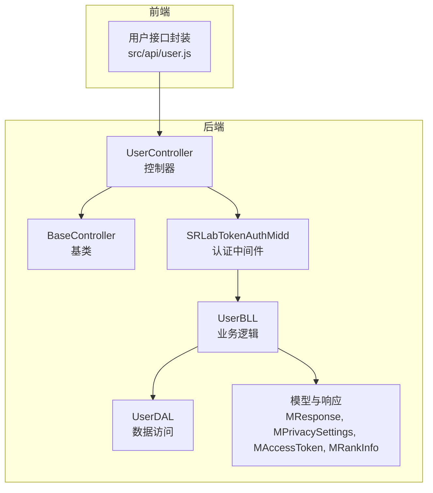
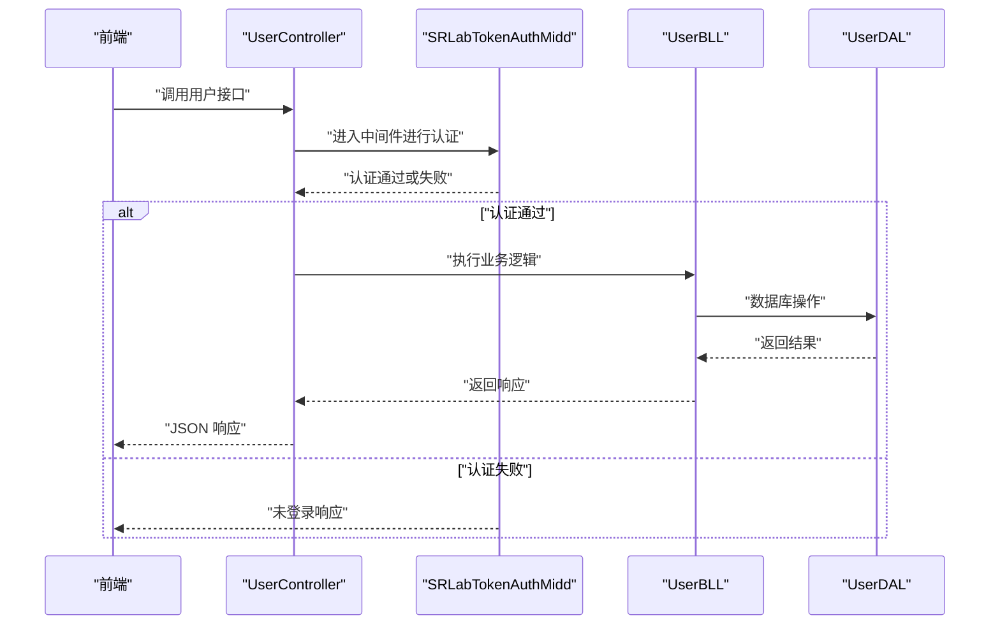
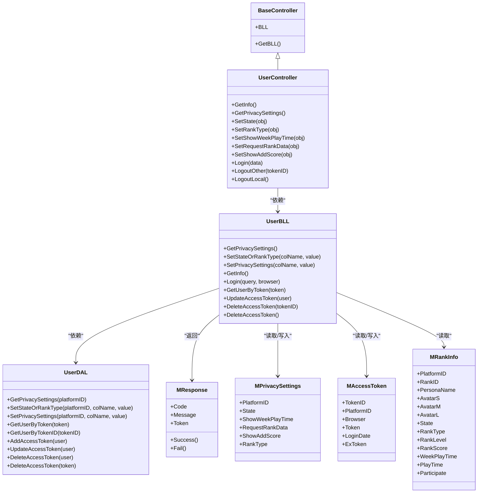

# 用户管理 API

<cite>
**本文引用的文件**
- [SpeedRunners.API/SpeedRunners/Controllers/UserController.cs](file://SpeedRunners.API/SpeedRunners/Controllers/UserController.cs)
- [SpeedRunners.API/SpeedRunners.BLL/UserBLL.cs](file://SpeedRunners.API/SpeedRunners.BLL/UserBLL.cs)
- [SpeedRunners.API/SpeedRunners.DAL/UserDAL.cs](file://SpeedRunners.API/SpeedRunners.DAL/UserDAL.cs)
- [SpeedRunners.API/SpeedRunners/Controllers/BaseController.cs](file://SpeedRunners.API/SpeedRunners/Controllers/BaseController.cs)
- [SpeedRunners.API/SpeedRunners/Middleware/SRLabTokenAuthMidd.cs](file://SpeedRunners.API/SpeedRunners/Middleware/SRLabTokenAuthMidd.cs)
- [SpeedRunners.API/SpeedRunners.Model/MResponse.cs](file://SpeedRunners.API/SpeedRunners.Model/MResponse.cs)
- [SpeedRunners.API/SpeedRunners.Model/User/MPrivacySettings.cs](file://SpeedRunners.API/SpeedRunners.Model/User/MPrivacySettings.cs)
- [SpeedRunners.API/SpeedRunners.Model/User/MAccessToken.cs](file://SpeedRunners.API/SpeedRunners.Model/User/MAccessToken.cs)
- [SpeedRunners.API/SpeedRunners.Model/Rank/MRankInfo.cs](file://SpeedRunners.API/SpeedRunners.Model/Rank/MRankInfo.cs)
- [SpeedRunners.API/SpeedRunners.Model/MUser.cs](file://SpeedRunners.API/SpeedRunners.Model/MUser.cs)
- [SpeedRunners.UI/src/api/user.js](file://SpeedRunners.UI/src/api/user.js)
</cite>

## 目录
1. [简介](#简介)
2. [项目结构](#项目结构)
3. [核心组件](#核心组件)
4. [架构总览](#架构总览)
5. [详细接口说明](#详细接口说明)
6. [依赖关系分析](#依赖关系分析)
7. [性能与安全考虑](#性能与安全考虑)
8. [故障排查指南](#故障排查指南)
9. [结论](#结论)
10. [附录](#附录)

## 简介
本文件为用户管理模块的完整 API 文档，覆盖用户登录、登出（本地与远程）、个人信息查询、隐私设置与状态/排名类型管理等接口。文档同时阐述认证流程、Token 管理机制、权限控制策略，并提供前后端对接示例与最佳实践。

## 项目结构
后端采用分层架构：控制器层负责路由与参数绑定；业务层封装业务逻辑；数据层负责数据库操作；中间件负责认证拦截；模型层定义数据结构与响应格式。前端通过统一的请求封装模块调用后端接口。

图表来源
- [SpeedRunners.API/SpeedRunners/Controllers/UserController.cs](file://SpeedRunners.API/SpeedRunners/Controllers/UserController.cs#L10-L56)
- [SpeedRunners.API/SpeedRunners/Controllers/BaseController.cs](file://SpeedRunners.API/SpeedRunners/Controllers/BaseController.cs#L10-L24)
- [SpeedRunners.API/SpeedRunners/Middleware/SRLabTokenAuthMidd.cs](file://SpeedRunners.API/SpeedRunners/Middleware/SRLabTokenAuthMidd.cs#L31-L101)
- [SpeedRunners.API/SpeedRunners.BLL/UserBLL.cs](file://SpeedRunners.API/SpeedRunners.BLL/UserBLL.cs#L16-L24)
- [SpeedRunners.API/SpeedRunners.DAL/UserDAL.cs](file://SpeedRunners.API/SpeedRunners.DAL/UserDAL.cs#L9-L11)
- [SpeedRunners.API/SpeedRunners.Model/MResponse.cs](file://SpeedRunners.API/SpeedRunners.Model/MResponse.cs#L3-L27)
- [SpeedRunners.API/SpeedRunners.Model/User/MPrivacySettings.cs](file://SpeedRunners.API/SpeedRunners.Model/User/MPrivacySettings.cs#L7-L21)
- [SpeedRunners.API/SpeedRunners.Model/User/MAccessToken.cs](file://SpeedRunners.API/SpeedRunners.Model/User/MAccessToken.cs#L7-L15)
- [SpeedRunners.API/SpeedRunners.Model/Rank/MRankInfo.cs](file://SpeedRunners.API/SpeedRunners.Model/Rank/MRankInfo.cs#L5-L34)

章节来源
- [SpeedRunners.API/SpeedRunners/Controllers/UserController.cs](file://SpeedRunners.API/SpeedRunners/Controllers/UserController.cs#L10-L56)
- [SpeedRunners.API/SpeedRunners/Controllers/BaseController.cs](file://SpeedRunners.API/SpeedRunners/Controllers/BaseController.cs#L10-L24)
- [SpeedRunners.API/SpeedRunners/Middleware/SRLabTokenAuthMidd.cs](file://SpeedRunners.API/SpeedRunners/Middleware/SRLabTokenAuthMidd.cs#L31-L101)

## 核心组件
- 控制器层
  - UserController：暴露用户相关接口，标注认证特性以启用中间件校验。
- 基类
  - BaseController：统一注入 BLL、本地化资源、当前用户上下文。
- 中间件
  - SRLabTokenAuthMidd：从请求头读取 srlab-token，校验并写入当前用户上下文。
- 业务层
  - UserBLL：实现登录、Token 查询/更新、删除、隐私设置与状态/排名类型更新。
- 数据层
  - UserDAL：封装数据库访问，包括隐私设置初始化、更新、Token 查询与删除。
- 模型与响应
  - MResponse：统一响应结构，含 Code、Message、Token。
  - MPrivacySettings：隐私设置模型。
  - MAccessToken：访问令牌模型。
  - MRankInfo：用户排行信息模型（含状态与排名类型）。

章节来源
- [SpeedRunners.API/SpeedRunners.BLL/UserBLL.cs](file://SpeedRunners.API/SpeedRunners.BLL/UserBLL.cs#L16-L24)
- [SpeedRunners.API/SpeedRunners.DAL/UserDAL.cs](file://SpeedRunners.API/SpeedRunners.DAL/UserDAL.cs#L9-L11)
- [SpeedRunners.API/SpeedRunners.Model/MResponse.cs](file://SpeedRunners.API/SpeedRunners.Model/MResponse.cs#L3-L27)
- [SpeedRunners.API/SpeedRunners.Model/User/MPrivacySettings.cs](file://SpeedRunners.API/SpeedRunners.Model/User/MPrivacySettings.cs#L7-L21)
- [SpeedRunners.API/SpeedRunners.Model/User/MAccessToken.cs](file://SpeedRunners.API/SpeedRunners.Model/User/MAccessToken.cs#L7-L15)
- [SpeedRunners.API/SpeedRunners.Model/Rank/MRankInfo.cs](file://SpeedRunners.API/SpeedRunners.Model/Rank/MRankInfo.cs#L5-L34)

## 架构总览
下图展示了用户相关请求在系统内的流转与职责分工。

图表来源
- [SpeedRunners.API/SpeedRunners/Controllers/UserController.cs](file://SpeedRunners.API/SpeedRunners/Controllers/UserController.cs#L10-L56)
- [SpeedRunners.API/SpeedRunners/Middleware/SRLabTokenAuthMidd.cs](file://SpeedRunners.API/SpeedRunners/Middleware/SRLabTokenAuthMidd.cs#L31-L101)
- [SpeedRunners.API/SpeedRunners.BLL/UserBLL.cs](file://SpeedRunners.API/SpeedRunners.BLL/UserBLL.cs#L55-L93)
- [SpeedRunners.API/SpeedRunners.DAL/UserDAL.cs](file://SpeedRunners.API/SpeedRunners.DAL/UserDAL.cs#L53-L82)

## 详细接口说明

### 认证与权限控制
- 请求头
  - srlab-token：用于携带访问令牌
- 认证规则
  - 非标注需认证特性的接口无需令牌
  - 标注需认证特性的接口若缺少令牌则返回“未登录”
  - 中间件会将当前用户上下文注入到服务容器，供后续业务使用

章节来源
- [SpeedRunners.API/SpeedRunners/Middleware/SRLabTokenAuthMidd.cs](file://SpeedRunners.API/SpeedRunners/Middleware/SRLabTokenAuthMidd.cs#L54-L101)
- [SpeedRunners.API/SpeedRunners/Controllers/BaseController.cs](file://SpeedRunners.API/SpeedRunners/Controllers/BaseController.cs#L14-L23)

### 登录
- 方法与路径
  - POST /api/user/Login
- 请求体
  - query：Steam OpenID 验证参数字符串
- 成功响应
  - Code：666
  - Message：成功提示
  - Token：新生成的访问令牌
- 失败响应
  - Code：-555 或 -1
  - Message：失败提示
- 错误码
  - -555：登录超时
  - -1：登录失败
- 示例
  - 请求：POST /api/user/Login，Body: { "query": "..." }
  - 响应：{ "Code": 666, "Message": "...", "Token": "..." }

章节来源
- [SpeedRunners.API/SpeedRunners/Controllers/UserController.cs](file://SpeedRunners.API/SpeedRunners/Controllers/UserController.cs#L42-L47)
- [SpeedRunners.API/SpeedRunners.BLL/UserBLL.cs](file://SpeedRunners.API/SpeedRunners.BLL/UserBLL.cs#L60-L93)
- [SpeedRunners.API/SpeedRunners.Model/MResponse.cs](file://SpeedRunners.API/SpeedRunners.Model/MResponse.cs#L11-L21)

### 登出（本地）
- 方法与路径
  - GET /api/user/LogoutLocal
- 行为
  - 删除当前会话的访问令牌，清空当前用户平台 ID
- 成功响应
  - Code：666
  - Message：成功提示
- 示例
  - 请求：GET /api/user/LogoutLocal
  - 响应：{ "Code": 666, "Message": "..." }

章节来源
- [SpeedRunners.API/SpeedRunners/Controllers/UserController.cs](file://SpeedRunners.API/SpeedRunners/Controllers/UserController.cs#L53-L55)
- [SpeedRunners.API/SpeedRunners.BLL/UserBLL.cs](file://SpeedRunners.API/SpeedRunners.BLL/UserBLL.cs#L143-L150)

### 登出（其他设备）
- 方法与路径
  - GET /api/user/LogoutOther/{tokenID}
- 参数
  - tokenID：要踢除的访问令牌 ID
- 权限校验
  - 仅允许删除属于自己的令牌
  - 仅允许删除登录时间早于当前用户的令牌（低权限保护）
- 成功响应
  - Code：666
  - Message：成功提示
- 失败响应
  - Code：-401 或 -1
  - Message：权限不足或无此令牌等提示
- 示例
  - 请求：GET /api/user/LogoutOther/123
  - 响应：{ "Code": 666, "Message": "..." }

章节来源
- [SpeedRunners.API/SpeedRunners/Controllers/UserController.cs](file://SpeedRunners.API/SpeedRunners/Controllers/UserController.cs#L49-L51)
- [SpeedRunners.API/SpeedRunners.BLL/UserBLL.cs](file://SpeedRunners.API/SpeedRunners.BLL/UserBLL.cs#L121-L141)
- [SpeedRunners.API/SpeedRunners.DAL/UserDAL.cs](file://SpeedRunners.API/SpeedRunners.DAL/UserDAL.cs#L58-L61)

### 获取个人信息
- 方法与路径
  - GET /api/user/GetInfo
- 返回
  - 用户排行信息（含状态、排名类型、昵称、头像等）
- 示例
  - 请求：GET /api/user/GetInfo
  - 响应：{ "Code": 666, "Message": "...", "Data": { ... } }

章节来源
- [SpeedRunners.API/SpeedRunners/Controllers/UserController.cs](file://SpeedRunners.API/SpeedRunners/Controllers/UserController.cs#L14-L16)
- [SpeedRunners.API/SpeedRunners.BLL/UserBLL.cs](file://SpeedRunners.API/SpeedRunners.BLL/UserBLL.cs#L55-L58)
- [SpeedRunners.API/SpeedRunners.Model/Rank/MRankInfo.cs](file://SpeedRunners.API/SpeedRunners.Model/Rank/MRankInfo.cs#L5-L34)

### 获取隐私设置
- 方法与路径
  - GET /api/user/GetPrivacySettings
- 返回
  - 隐私设置对象（包含状态开关、周游玩时长可见性、是否请求排行数据、加分可见性、排名类型等）
- 示例
  - 请求：GET /api/user/GetPrivacySettings
  - 响应：{ "Code": 666, "Message": "...", "Data": { ... } }

章节来源
- [SpeedRunners.API/SpeedRunners/Controllers/UserController.cs](file://SpeedRunners.API/SpeedRunners/Controllers/UserController.cs#L18-L20)
- [SpeedRunners.API/SpeedRunners.BLL/UserBLL.cs](file://SpeedRunners.API/SpeedRunners.BLL/UserBLL.cs#L26-L33)
- [SpeedRunners.API/SpeedRunners.DAL/UserDAL.cs](file://SpeedRunners.API/SpeedRunners.DAL/UserDAL.cs#L13-L35)
- [SpeedRunners.API/SpeedRunners.Model/User/MPrivacySettings.cs](file://SpeedRunners.API/SpeedRunners.Model/User/MPrivacySettings.cs#L7-L21)

### 设置状态（在线/离线/忙碌等）
- 方法与路径
  - POST /api/user/SetState
- 请求体
  - value：整数，对应状态枚举值
- 说明
  - 更新 RankInfo 中的 State 字段
- 示例
  - 请求：POST /api/user/SetState，Body: { "value": 0 }
  - 响应：{ "Code": 666, "Message": "..." }

章节来源
- [SpeedRunners.API/SpeedRunners/Controllers/UserController.cs](file://SpeedRunners.API/SpeedRunners/Controllers/UserController.cs#L22-L24)
- [SpeedRunners.API/SpeedRunners.BLL/UserBLL.cs](file://SpeedRunners.API/SpeedRunners.BLL/UserBLL.cs#L35-L41)
- [SpeedRunners.API/SpeedRunners.DAL/UserDAL.cs](file://SpeedRunners.API/SpeedRunners.DAL/UserDAL.cs#L37-L40)

### 设置排名类型（公开/隐私）
- 方法与路径
  - POST /api/user/SetRankType
- 请求体
  - value：整数，对应排名类型枚举值
- 说明
  - 更新 RankInfo 中的 RankType 字段
- 示例
  - 请求：POST /api/user/SetRankType，Body: { "value": 1 }
  - 响应：{ "Code": 666, "Message": "..." }

章节来源
- [SpeedRunners.API/SpeedRunners/Controllers/UserController.cs](file://SpeedRunners.API/SpeedRunners/Controllers/UserController.cs#L26-L28)
- [SpeedRunners.API/SpeedRunners.BLL/UserBLL.cs](file://SpeedRunners.API/SpeedRunners.BLL/UserBLL.cs#L35-L41)
- [SpeedRunners.API/SpeedRunners.DAL/UserDAL.cs](file://SpeedRunners.API/SpeedRunners.DAL/UserDAL.cs#L37-L40)

### 设置周游玩时长可见性
- 方法与路径
  - POST /api/user/SetShowWeekPlayTime
- 请求体
  - value：整数（0/1）
- 说明
  - 更新 PrivacySettings 中的 ShowWeekPlayTime 字段
- 示例
  - 请求：POST /api/user/SetShowWeekPlayTime，Body: { "value": 1 }
  - 响应：{ "Code": 666, "Message": "..." }

章节来源
- [SpeedRunners.API/SpeedRunners/Controllers/UserController.cs](file://SpeedRunners.API/SpeedRunners/Controllers/UserController.cs#L30-L32)
- [SpeedRunners.API/SpeedRunners.BLL/UserBLL.cs](file://SpeedRunners.API/SpeedRunners.BLL/UserBLL.cs#L43-L49)
- [SpeedRunners.API/SpeedRunners.DAL/UserDAL.cs](file://SpeedRunners.API/SpeedRunners.DAL/UserDAL.cs#L42-L51)

### 设置是否请求排行数据
- 方法与路径
  - POST /api/user/SetRequestRankData
- 请求体
  - value：整数（0/1）
- 说明
  - 更新 PrivacySettings 中的 RequestRankData 字段
  - 同步根据值更新 RankType（开启时 RankType=1，关闭时 RankType=2）
- 示例
  - 请求：POST /api/user/SetRequestRankData，Body: { "value": 1 }
  - 响应：{ "Code": 666, "Message": "..." }

章节来源
- [SpeedRunners.API/SpeedRunners/Controllers/UserController.cs](file://SpeedRunners.API/SpeedRunners/Controllers/UserController.cs#L34-L36)
- [SpeedRunners.API/SpeedRunners.BLL/UserBLL.cs](file://SpeedRunners.API/SpeedRunners.BLL/UserBLL.cs#L43-L49)
- [SpeedRunners.API/SpeedRunners.DAL/UserDAL.cs](file://SpeedRunners.API/SpeedRunners.DAL/UserDAL.cs#L42-L51)

### 设置加分可见性
- 方法与路径
  - POST /api/user/SetShowAddScore
- 请求体
  - value：整数（0/1）
- 说明
  - 更新 PrivacySettings 中的 ShowAddScore 字段
- 示例
  - 请求：POST /api/user/SetShowAddScore，Body: { "value": 1 }
  - 响应：{ "Code": 666, "Message": "..." }

章节来源
- [SpeedRunners.API/SpeedRunners/Controllers/UserController.cs](file://SpeedRunners.API/SpeedRunners/Controllers/UserController.cs#L38-L40)
- [SpeedRunners.API/SpeedRunners.BLL/UserBLL.cs](file://SpeedRunners.API/SpeedRunners.BLL/UserBLL.cs#L43-L49)
- [SpeedRunners.API/SpeedRunners.DAL/UserDAL.cs](file://SpeedRunners.API/SpeedRunners.DAL/UserDAL.cs#L42-L51)

### 前端 JavaScript SDK 调用方式
- 基础封装
  - 所有接口均通过统一的 request 工具发起
- 常见调用
  - 登录：login(query)
  - 获取个人信息：getInfo()
  - 获取隐私设置：getPrivacySettings()
  - 设置状态：setState(value)
  - 设置排名类型：setRankType(value)
  - 设置周游玩时长可见性：setShowWeekPlayTime(value)
  - 设置是否请求排行数据：setRequestRankData(value)
  - 设置加分可见性：setShowAddScore(value)
  - 登出（本地）：logoutLocal()
  - 登出（其他设备）：logoutOther(tokenID)

章节来源
- [SpeedRunners.UI/src/api/user.js](file://SpeedRunners.UI/src/api/user.js#L1-L77)

## 依赖关系分析

图表来源
- [SpeedRunners.API/SpeedRunners/Controllers/BaseController.cs](file://SpeedRunners.API/SpeedRunners/Controllers/BaseController.cs#L10-L24)
- [SpeedRunners.API/SpeedRunners/Controllers/UserController.cs](file://SpeedRunners.API/SpeedRunners/Controllers/UserController.cs#L12-L56)
- [SpeedRunners.API/SpeedRunners.BLL/UserBLL.cs](file://SpeedRunners.API/SpeedRunners.BLL/UserBLL.cs#L16-L24)
- [SpeedRunners.API/SpeedRunners.DAL/UserDAL.cs](file://SpeedRunners.API/SpeedRunners.DAL/UserDAL.cs#L9-L11)
- [SpeedRunners.API/SpeedRunners.Model/MResponse.cs](file://SpeedRunners.API/SpeedRunners.Model/MResponse.cs#L3-L27)
- [SpeedRunners.API/SpeedRunners.Model/User/MPrivacySettings.cs](file://SpeedRunners.API/SpeedRunners.Model/User/MPrivacySettings.cs#L7-L21)
- [SpeedRunners.API/SpeedRunners.Model/User/MAccessToken.cs](file://SpeedRunners.API/SpeedRunners.Model/User/MAccessToken.cs#L7-L15)
- [SpeedRunners.API/SpeedRunners.Model/Rank/MRankInfo.cs](file://SpeedRunners.API/SpeedRunners.Model/Rank/MRankInfo.cs#L5-L34)

## 性能与安全考虑
- 性能
  - 数据库访问集中在 DAL 层，建议对高频查询建立索引（如 PlatformID、TokenID）
  - 避免在中间件中重复解析令牌，已通过服务容器注入当前用户上下文
- 安全
  - 所有需要认证的接口必须携带 srlab-token
  - 登出（其他设备）接口具备权限校验，防止越权删除
  - 登录流程基于 Steam OpenID，验证通过后颁发令牌

[本节为通用建议，不直接分析具体文件]

## 故障排查指南
- 未登录
  - 现象：返回“未登录”提示
  - 排查：确认请求头是否包含 srlab-token，且令牌有效
- 登录失败
  - 现象：返回登录失败或超时
  - 排查：检查 query 参数是否符合 Steam OpenID 规范；网络是否可访问 Steam OpenID 服务
- 权限不足
  - 现象：删除其他设备令牌时报错
  - 排查：确认 tokenID 对应的令牌归属当前用户；仅能删除登录时间更早的令牌
- 隐私设置异常
  - 现象：设置后未生效
  - 排查：确认字段名与值范围正确；首次使用会自动初始化默认值

章节来源
- [SpeedRunners.API/SpeedRunners/Middleware/SRLabTokenAuthMidd.cs](file://SpeedRunners.API/SpeedRunners/Middleware/SRLabTokenAuthMidd.cs#L42-L46)
- [SpeedRunners.API/SpeedRunners.BLL/UserBLL.cs](file://SpeedRunners.API/SpeedRunners.BLL/UserBLL.cs#L121-L141)
- [SpeedRunners.API/SpeedRunners.BLL/UserBLL.cs](file://SpeedRunners.API/SpeedRunners.BLL/UserBLL.cs#L60-L93)
- [SpeedRunners.API/SpeedRunners.DAL/UserDAL.cs](file://SpeedRunners.API/SpeedRunners.DAL/UserDAL.cs#L13-L18)

## 结论
用户管理模块通过清晰的分层设计与严格的认证机制，提供了完整的登录、登出、信息查询与隐私设置能力。前端 SDK 封装了常用接口，便于快速集成。建议在生产环境中进一步完善日志审计、令牌刷新与限流策略。

[本节为总结性内容，不直接分析具体文件]

## 附录

### 响应格式规范
- 成功
  - Code：666
  - Message：成功消息
  - Data：业务数据（按接口而定）
  - Token：登录成功时返回
- 失败
  - Code：自定义负值
  - Message：失败消息
  - Data：可选

章节来源
- [SpeedRunners.API/SpeedRunners.Model/MResponse.cs](file://SpeedRunners.API/SpeedRunners.Model/MResponse.cs#L11-L21)

### 用户状态与排名类型语义
- 状态（State）
  - -1：隐私权限
  - 0：离线
  - 1：在线
  - 2：忙碌
  - 3：离开
  - 4：打盹
  - 5：想交易
  - 6：想玩游戏
- 排名类型（RankType）
  - 1：公开
  - 2：隐私

章节来源
- [SpeedRunners.API/SpeedRunners.Model/Rank/MRankInfo.cs](file://SpeedRunners.API/SpeedRunners.Model/Rank/MRankInfo.cs#L15-L25)
- [SpeedRunners.API/SpeedRunners.Model/User/MPrivacySettings.cs](file://SpeedRunners.API/SpeedRunners.Model/User/MPrivacySettings.cs#L17-L20)

### 常见场景示例

- 场景一：用户登录并获取个人信息
  - 步骤
    - 前端调用登录接口，携带 Steam OpenID query
    - 后端验证通过后返回 Token
    - 前端在后续请求头添加 srlab-token
    - 调用获取个人信息接口
  - 参考
    - [登录接口](file://SpeedRunners.API/SpeedRunners/Controllers/UserController.cs#L42-L47)
    - [获取个人信息接口](file://SpeedRunners.API/SpeedRunners/Controllers/UserController.cs#L14-L16)
    - [前端封装](file://SpeedRunners.UI/src/api/user.js#L10-L16)

- 场景二：修改隐私设置并同步排名类型
  - 步骤
    - 调用设置是否请求排行数据接口
    - 若开启，则 RankType 自动设为公开；若关闭，则 RankType 设为隐私
  - 参考
    - [设置是否请求排行数据接口](file://SpeedRunners.API/SpeedRunners/Controllers/UserController.cs#L34-L36)
    - [数据库更新逻辑](file://SpeedRunners.API/SpeedRunners.DAL/UserDAL.cs#L42-L51)

- 场景三：登出其他设备
  - 步骤
    - 调用登出其他设备接口，传入目标 tokenID
    - 后端校验归属与时间顺序，成功后删除对应令牌
  - 参考
    - [登出其他设备接口](file://SpeedRunners.API/SpeedRunners/Controllers/UserController.cs#L49-L51)
    - [权限校验与删除逻辑](file://SpeedRunners.API/SpeedRunners.BLL/UserBLL.cs#L121-L141)