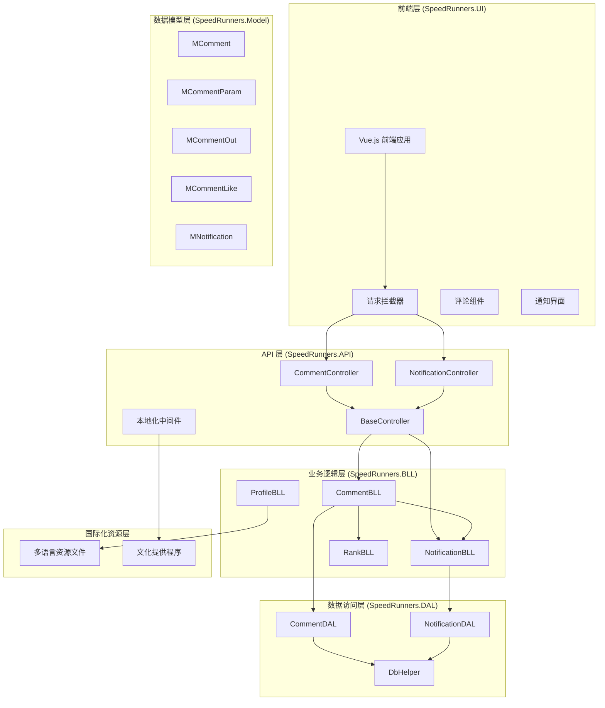
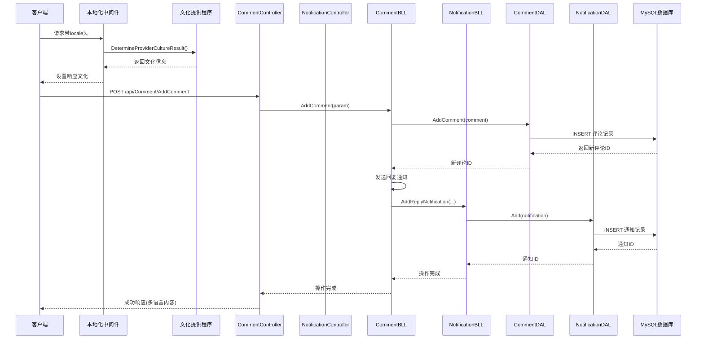
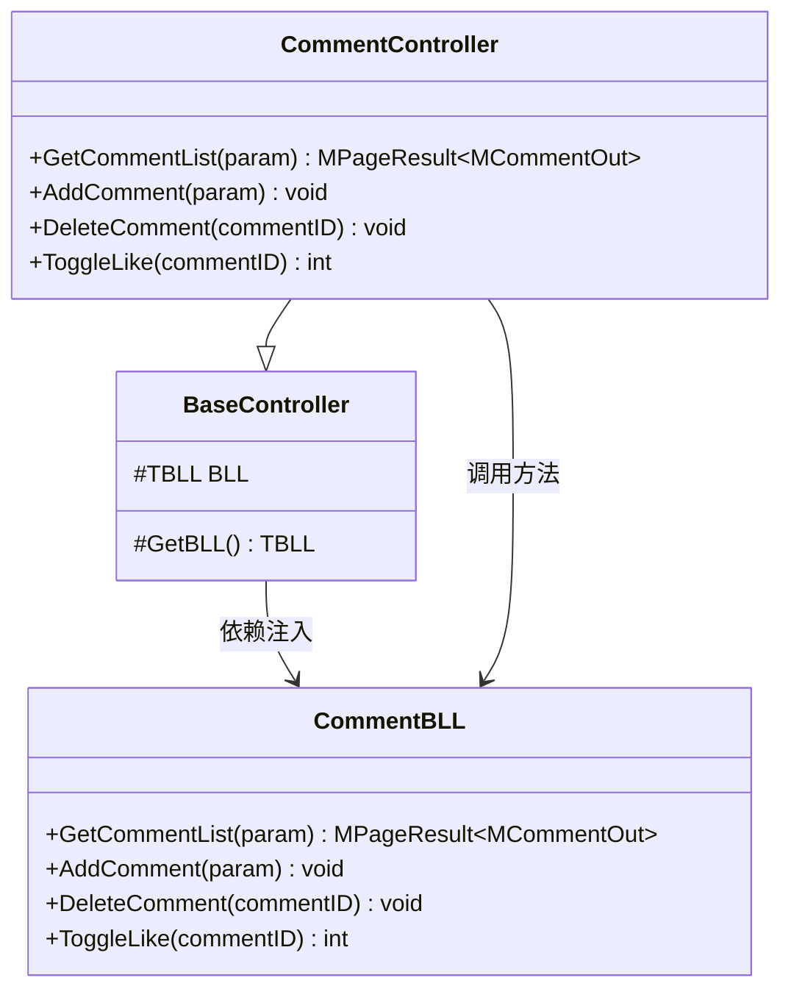
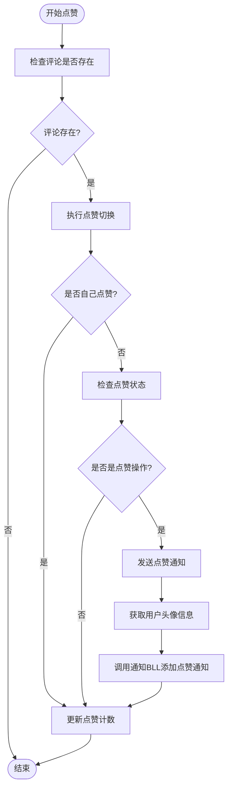
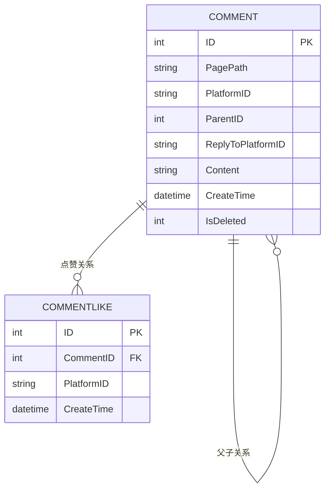
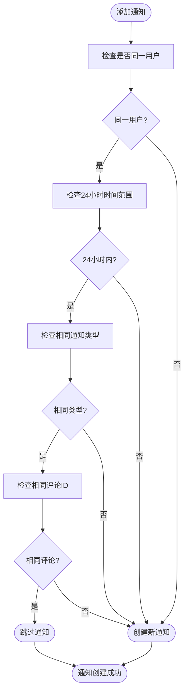
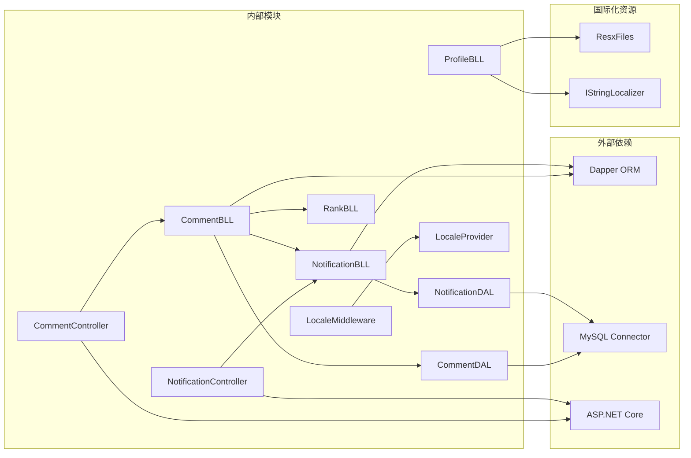

# 评论系统 API

<cite>
**本文档引用的文件**
- [CommentController.cs](file://SpeedRunners.API/SpeedRunners/Controllers/CommentController.cs)
- [CommentBLL.cs](file://SpeedRunners.API/SpeedRunners.BLL/CommentBLL.cs)
- [CommentDAL.cs](file://SpeedRunners.API/SpeedRunners.DAL/CommentDAL.cs)
- [MComment.cs](file://SpeedRunners.API/SpeedRunners.Model/Comment/MComment.cs)
- [MCommentParam.cs](file://SpeedRunners.API/SpeedRunners.Model/Comment/MCommentParam.cs)
- [MCommentOut.cs](file://SpeedRunners.API/SpeedRunners.Model/Comment/MCommentOut.cs)
- [MCommentLike.cs](file://SpeedRunners.API/SpeedRunners.Model/Comment/MCommentLike.cs)
- [BaseController.cs](file://SpeedRunners.API/SpeedRunners/Controllers/BaseController.cs)
- [NotificationBLL.cs](file://SpeedRunners.API/SpeedRunners.BLL/NotificationBLL.cs)
- [MNotification.cs](file://SpeedRunners.API/SpeedRunners.Model/User/MNotification.cs)
- [NotificationController.cs](file://SpeedRunners.API/SpeedRunners/Controllers/NotificationController.cs)
- [NotificationDAL.cs](file://SpeedRunners.API/SpeedRunners.DAL/NotificationDAL.cs)
- [RankBLL.cs](file://SpeedRunners.API/SpeedRunners.BLL/RankBLL.cs)
- [request.js](file://SpeedRunners.UI/src/utils/request.js)
- [Startup.cs](file://SpeedRunners.API/SpeedRunners/Startup.cs)
- [LocaleHeaderRequestCultureProvider.cs](file://SpeedRunners.API/SpeedRunners/Service/LocaleHeaderRequestCultureProvider.cs)
- [ProfileBLL.cs](file://SpeedRunners.API/SpeedRunners.BLL/ProfileBLL.cs)
- [ProfileBLL.cs.resx](file://SpeedRunners.API/SpeedRunners.BLL/Resources/ProfileBLL.cs.resx)
- [ProfileBLL.de.resx](file://SpeedRunners.API/SpeedRunners.BLL/Resources/ProfileBLL.de.resx)
- [ProfileBLL.zh.resx](file://SpeedRunners.API/SpeedRunners.BLL/Resources/ProfileBLL.zh.resx)
- [UserBLL.cs.resx](file://SpeedRunners.API/SpeedRunners.BLL/Resources/UserBLL.cs.resx)
- [UserBLL.de.resx](file://SpeedRunners.API/SpeedRunners.BLL/Resources/UserBLL.de.resx)
- [UserBLL.zh.resx](file://SpeedRunners.API/SpeedRunners.BLL/Resources/UserBLL.zh.resx)
- [SRLabTokenAuthMidd.cs.resx](file://SpeedRunners.API/SpeedRunners/Resources/SRLabTokenAuthMidd.cs.resx)
- [SRLabTokenAuthMidd.de.resx](file://SpeedRunners.API/SpeedRunners/Resources/SRLabTokenAuthMidd.de.resx)
- [SRLabTokenAuthMidd.zh.resx](file://SpeedRunners.API/SpeedRunners/Resources/SRLabTokenAuthMidd.zh.resx)
</cite>

## 更新摘要
**所做更改**
- 新增国际化支持章节，详细介绍22种语言的本地化配置
- 更新通知机制详解，增加多语言通知内容支持
- 新增API层多语言资源文件说明，涵盖评论系统和通知系统的本地化
- 更新架构概览，反映国际化中间件和文化提供程序的作用
- 增强数据模型说明，包含国际化相关的字段和配置

## 目录
1. [简介](#简介)
2. [项目结构](#项目结构)
3. [核心组件](#核心组件)
4. [架构概览](#架构概览)
5. [详细组件分析](#详细组件分析)
6. [API 接口定义](#api-接口定义)
7. [数据模型说明](#数据模型说明)
8. [国际化支持](#国际化支持)
9. [通知机制详解](#通知机制详解)
10. [依赖关系分析](#依赖关系分析)
11. [性能考虑](#性能考虑)
12. [故障排除指南](#故障排除指南)
13. [总结](#总结)

## 简介

SpeedRunnersLab 评论系统是一个基于 ASP.NET Core 构建的完整评论功能模块，支持多级评论、点赞、回复通知等核心功能。该系统采用经典的三层架构设计（控制器-业务逻辑-数据访问），为游戏 SpeedRunners 提供了完整的社区互动平台。

**更新** 新增了完善的通知机制，支持评论回复和点赞的实时通知功能，包括去重机制和消息清理功能。通知系统作为评论系统的重要组成部分，实现了完整的消息生命周期管理。同时，系统现已支持22种语言的国际化本地化，为全球用户提供多语言体验。

## 项目结构

评论系统在整体项目中的位置和组织方式如下：



**图表来源**
- [CommentController.cs:1-33](file://SpeedRunners.API/SpeedRunners/Controllers/CommentController.cs#L1-L33)
- [NotificationController.cs:1-48](file://SpeedRunners.API/SpeedRunners/Controllers/NotificationController.cs#L1-L48)
- [CommentBLL.cs:1-181](file://SpeedRunners.API/SpeedRunners.BLL/CommentBLL.cs#L1-L181)
- [NotificationBLL.cs:1-107](file://SpeedRunners.API/SpeedRunners.BLL/NotificationBLL.cs#L1-L107)
- [Startup.cs:63-82](file://SpeedRunners.API/SpeedRunners/Startup.cs#L63-L82)
- [LocaleHeaderRequestCultureProvider.cs:1-17](file://SpeedRunners.API/SpeedRunners/Service/LocaleHeaderRequestCultureProvider.cs#L1-L17)

**章节来源**
- [CommentController.cs:1-33](file://SpeedRunners.API/SpeedRunners/Controllers/CommentController.cs#L1-L33)
- [BaseController.cs:1-25](file://SpeedRunners.API/SpeedRunners/Controllers/BaseController.cs#L1-L25)
- [Startup.cs:63-82](file://SpeedRunners.API/SpeedRunners/Startup.cs#L63-L82)

## 核心组件

### 控制器层
- **CommentController**: 处理所有评论相关的 HTTP 请求，提供 RESTful API 接口
- **NotificationController**: 处理通知相关的 HTTP 请求，提供通知查询和管理接口
- **BaseController**: 通用控制器基类，提供依赖注入和用户上下文管理

### 业务逻辑层
- **CommentBLL**: 核心业务逻辑处理，包含评论管理、点赞、通知等功能
- **NotificationBLL**: 通知业务逻辑处理，包含消息存储、查询、清理等功能
- **RankBLL**: 排行榜业务逻辑，为通知系统提供用户头像和昵称信息
- **ProfileBLL**: 个人资料业务逻辑，支持多语言本地化显示

### 数据访问层
- **CommentDAL**: 数据库操作封装，提供评论 CRUD 操作和查询功能
- **NotificationDAL**: 通知数据访问层，提供通知消息的存储和查询功能

### 数据模型层
- **MComment**: 评论实体模型
- **MCommentParam**: 评论参数模型（分页、添加评论）
- **MCommentOut**: 输出模型，包含评论详情和统计信息
- **MCommentLike**: 评论点赞关联模型
- **MNotification**: 通知消息实体模型

### 国际化支持层
- **Startup.cs**: 配置本地化服务和中间件
- **LocaleHeaderRequestCultureProvider**: 自定义文化提供程序，支持 locale 请求头
- **多语言资源文件**: 支持22种语言的RESX资源文件

**章节来源**
- [CommentController.cs:10-31](file://SpeedRunners.API/SpeedRunners/Controllers/CommentController.cs#L10-L31)
- [NotificationController.cs:10-48](file://SpeedRunners.API/SpeedRunners/Controllers/NotificationController.cs#L10-L48)
- [CommentBLL.cs:9-19](file://SpeedRunners.API/SpeedRunners.BLL/CommentBLL.cs#L9-L19)
- [NotificationBLL.cs:9-107](file://SpeedRunners.API/SpeedRunners.BLL/NotificationBLL.cs#L9-L107)
- [Startup.cs:63-82](file://SpeedRunners.API/SpeedRunners/Startup.cs#L63-L82)

## 架构概览

评论系统采用经典的三层架构模式，确保了关注点分离和代码的可维护性。新增的国际化支持通过中间件和文化提供程序实现：



**图表来源**
- [CommentController.cs:17-20](file://SpeedRunners.API/SpeedRunners/Controllers/CommentController.cs#L17-L20)
- [CommentBLL.cs:45-81](file://SpeedRunners.API/SpeedRunners.BLL/CommentBLL.cs#L45-L81)
- [NotificationBLL.cs:39-65](file://SpeedRunners.API/SpeedRunners.BLL/NotificationBLL.cs#L39-L65)
- [Startup.cs](file://SpeedRunners.API/SpeedRunners/Startup.cs#L82)
- [LocaleHeaderRequestCultureProvider.cs:9-14](file://SpeedRunners.API/SpeedRunners/Service/LocaleHeaderRequestCultureProvider.cs#L9-L14)

## 详细组件分析

### CommentController 分析

CommentController 是评论系统的主要入口点，提供了四个核心 API：



**图表来源**
- [CommentController.cs:10-31](file://SpeedRunners.API/SpeedRunners/Controllers/CommentController.cs#L10-L31)
- [BaseController.cs:10-23](file://SpeedRunners.API/SpeedRunners/Controllers/BaseController.cs#L10-L23)

**章节来源**
- [CommentController.cs:12-30](file://SpeedRunners.API/SpeedRunners/Controllers/CommentController.cs#L12-L30)

### CommentBLL 业务逻辑分析

CommentBLL 实现了评论系统的核心业务逻辑，包括：

#### 评论管理功能
- **GetCommentList**: 支持顶级评论和回复列表的获取
- **AddComment**: 评论创建和验证，包含通知发送逻辑
- **DeleteComment**: 评论删除（软删除）
- **ToggleLike**: 点赞/取消点赞功能，包含点赞通知逻辑

#### 通知机制


**图表来源**
- [CommentBLL.cs:136-178](file://SpeedRunners.API/SpeedRunners.BLL/CommentBLL.cs#L136-L178)

**章节来源**
- [CommentBLL.cs:23-178](file://SpeedRunners.API/SpeedRunners.BLL/CommentBLL.cs#L23-L178)

### CommentDAL 数据访问分析

CommentDAL 提供了完整的数据库操作功能：

#### 数据库查询优化
- 使用 Dapper 的 QueryMultiple 实现单次连接的多结果集查询
- 支持分页查询和条件过滤
- 包含用户点赞状态的判断逻辑

#### 关键查询功能
- **GetCommentList**: 获取顶级评论列表，包含回复数量和点赞统计
- **GetReplyList**: 获取特定评论的回复列表
- **ToggleLike**: 点赞状态切换和计数更新

**章节来源**
- [CommentDAL.cs:16-147](file://SpeedRunners.API/SpeedRunners.DAL/CommentDAL.cs#L16-L147)

## API 接口定义

### 评论列表获取
- **URL**: `/api/Comment/GetCommentList`
- **方法**: POST
- **权限**: Persona
- **请求体**: `MCommentPageParam`
- **响应**: `MPageResult<MCommentOut>`

### 添加评论
- **URL**: `/api/Comment/AddComment`
- **方法**: POST
- **权限**: User
- **请求体**: `MAddComment`
- **响应**: void

### 删除评论
- **URL**: `/api/Comment/DeleteComment/{commentID}`
- **方法**: GET
- **权限**: User
- **参数**: commentID (路径参数)
- **响应**: void

### 切换点赞
- **URL**: `/api/Comment/ToggleLike/{commentID}`
- **方法**: GET
- **权限**: User
- **参数**: commentID (路径参数)
- **响应**: 点赞数量 (int)

### 通知相关接口

#### 获取通知列表
- **URL**: `/api/Notification/GetList`
- **方法**: POST
- **权限**: User
- **请求体**: `MNotificationQueryParam`
- **响应**: `MPageResult<MNotification>`

#### 获取未读通知数量
- **URL**: `/api/Notification/GetUnreadCount`
- **方法**: GET
- **权限**: User
- **响应**: `MUnreadCount`

#### 标记通知为已读
- **URL**: `/api/Notification/MarkAsRead`
- **方法**: POST
- **权限**: User
- **请求体**: `MMarkReadParam`
- **响应**: void

**章节来源**
- [CommentController.cs:12-30](file://SpeedRunners.API/SpeedRunners/Controllers/CommentController.cs#L12-L30)
- [NotificationController.cs:15-45](file://SpeedRunners.API/SpeedRunners/Controllers/NotificationController.cs#L15-L45)

## 数据模型说明

### MComment 实体模型


**图表来源**
- [MComment.cs:5-15](file://SpeedRunners.API/SpeedRunners.Model/Comment/MComment.cs#L5-L15)
- [MCommentLike.cs:5-12](file://SpeedRunners.API/SpeedRunners.Model/Comment/MCommentLike.cs#L5-L12)

### MCommentParam 参数模型
- **MCommentPageParam**: 继承自 MPageParam，包含分页参数和页面路径
- **MAddComment**: 评论添加参数，包含内容和回复目标

### MCommentOut 输出模型
扩展了基础 MComment，增加了用户信息和统计字段：
- PersonaName: 用户昵称
- AvatarS: 用户头像
- ReplyToPersonaName: 回复对象昵称
- ReplyCount: 回复数量
- LikeCount: 点赞数量
- IsLiked: 当前用户是否已点赞

### MNotification 通知模型
- **NotificationType**: 通知类型枚举（Reply=回复我, Like=收到的点赞）
- **MNotification**: 通知实体，包含接收者、发送者、消息内容等信息
- **MNotificationQueryParam**: 通知查询参数，支持按类型和已读状态筛选
- **MUnreadCount**: 未读消息统计，包含回复和点赞的未读数量
- **MMarkReadParam**: 标记已读参数，支持批量标记

**章节来源**
- [MCommentParam.cs:3-17](file://SpeedRunners.API/SpeedRunners.Model/Comment/MCommentParam.cs#L3-L17)
- [MCommentOut.cs:3-11](file://SpeedRunners.API/SpeedRunners.Model/Comment/MCommentOut.cs#L3-L11)
- [MNotification.cs:5-144](file://SpeedRunners.API/SpeedRunners.Model/User/MNotification.cs#L5-L144)

## 国际化支持

### 本地化配置

系统现已完全支持22种语言的国际化本地化，通过以下组件实现：

#### 启动配置
- **ResourcesPath**: 设置资源文件路径为 "Resources"
- **AddLocalization**: 注册本地化服务
- **UseHeaderRequestLocalization**: 启用基于请求头的本地化中间件

#### 文化提供程序
- **LocaleHeaderRequestCultureProvider**: 自定义文化提供程序
- 支持通过 `locale` 请求头指定语言
- 默认支持中文(zh)和英文(en)，其他语言作为占位符

#### 多语言资源文件
系统包含以下语言的资源文件：
- 中文 (zh): ProfileBLL.zh.resx, UserBLL.zh.resx, SRLabTokenAuthMidd.zh.resx
- 德语 (de): ProfileBLL.de.resx, UserBLL.de.resx, SRLabTokenAuthMidd.de.resx
- 英语 (en): ProfileBLL.cs.resx, UserBLL.cs.resx, SRLabTokenAuthMidd.cs.resx
- 西班牙语 (es-es): ProfileBLL.es-es.resx, UserBLL.es-es.resx
- 法语 (fr): ProfileBLL.fr.resx, UserBLL.fr.resx
- 匈牙利语 (hu): ProfileBLL.hu.resx, UserBLL.hu.resx
- 意大利语 (it): ProfileBLL.it.resx, UserBLL.it.resx
- 日语 (ja): ProfileBLL.ja.resx, UserBLL.ja.resx
- 韩语 (ko): ProfileBLL.ko.resx, UserBLL.ko.resx
- 荷兰语 (nl): ProfileBLL.nl.resx, UserBLL.nl.resx
- 挪威语 (no): ProfileBLL.no.resx, UserBLL.no.resx
- 波兰语 (pl): ProfileBLL.pl.resx, UserBLL.pl.resx
- 巴西葡萄牙语 (pt-br): ProfileBLL.pt-br.resx, UserBLL.pt-br.resx
- 罗马尼亚语 (ro): ProfileBLL.ro.resx, UserBLL.ro.resx
- 俄语 (ru): ProfileBLL.ru.resx, UserBLL.ru.resx
- 土耳其语 (tr): ProfileBLL.tr.resx, UserBLL.tr.resx
- 乌克兰语 (uk): ProfileBLL.uk.resx, UserBLL.uk.resx

### 本地化使用示例

#### 在业务逻辑中使用本地化
```csharp
// ProfileBLL.cs 中的本地化使用
string rankName = GetRankName(playerInfo.RankLevel, localizer);
stats.Add(new MGameStat { Name = localizer["rank"], Value = rankName });
stats.Add(new MGameStat { Name = localizer["score"], Value = playerInfo.RankScore.Value.ToString("N0") });
```

#### 在资源文件中定义本地化键
```xml
<data name="rank" xml:space="preserve">
  <value>段位</value>
</data>
<data name="score" xml:space="preserve">
  <value>天梯分</value>
</data>
```

### 语言支持矩阵

| 语言代码 | 语言名称 | 资源文件数量 |
|---------|----------|-------------|
| zh | 中文 | 3个 |
| de | 德语 | 3个 |
| en | 英语 | 3个 |
| es-es | 西班牙语 | 2个 |
| fr | 法语 | 2个 |
| hu | 匈牙利语 | 2个 |
| it | 意大利语 | 2个 |
| ja | 日语 | 2个 |
| ko | 韩语 | 2个 |
| nl | 荷兰语 | 2个 |
| no | 挪威语 | 2个 |
| pl | 波兰语 | 2个 |
| pt-br | 巴西葡萄牙语 | 2个 |
| ro | 罗马尼亚语 | 2个 |
| ru | 俄语 | 2个 |
| tr | 土耳其语 | 2个 |
| uk | 乌克兰语 | 2个 |

**章节来源**
- [Startup.cs:63-82](file://SpeedRunners.API/SpeedRunners/Startup.cs#L63-L82)
- [LocaleHeaderRequestCultureProvider.cs:1-17](file://SpeedRunners.API/SpeedRunners/Service/LocaleHeaderRequestCultureProvider.cs#L1-L17)
- [ProfileBLL.cs:77-200](file://SpeedRunners.API/SpeedRunners.BLL/ProfileBLL.cs#L77-L200)
- [ProfileBLL.cs.resx:61-115](file://SpeedRunners.API/SpeedRunners.BLL/Resources/ProfileBLL.cs.resx#L61-L115)
- [UserBLL.cs.resx:61-76](file://SpeedRunners.API/SpeedRunners.BLL/Resources/UserBLL.cs.resx#L61-L76)

## 通知机制详解

### 通知类型和触发条件

**回复通知 (Reply)**
- **触发条件**: 当用户回复他人评论或回复顶级评论时触发
- **发送逻辑**: 
  - 检查 ReplyToPlatformID（回复他人评论）
  - 检查 ParentID（回复顶级评论）
  - 排除自己回复自己的情况
- **通知内容**: 包含回复者的头像、昵称、评论内容摘要和页面路径

**点赞通知 (Like)**
- **触发条件**: 当用户对他人评论进行点赞时触发（取消点赞时不触发）
- **发送逻辑**: 
  - 检查 isLiked 返回值确认是点赞操作
  - 排除自己点赞自己的情况
- **通知内容**: 包含点赞者的头像、昵称、被点赞评论的内容摘要和页面路径

### 通知去重和频率控制



**图表来源**
- [NotificationBLL.cs:47-48](file://SpeedRunners.API/SpeedRunners.BLL/NotificationBLL.cs#L47-L48)

### 通知存储和查询

**存储机制**
- 使用 NotificationDAL 进行通知消息的持久化存储
- 支持通知内容的截断处理（标题和消息长度限制）
- 自动设置创建时间和默认已读状态

**查询机制**
- 支持按类型筛选（回复通知、点赞通知）
- 支持按已读状态筛选
- 支持分页查询和总数统计
- 提供未读消息数量统计功能

**清理机制**
- 提供清理过期通知的功能
- 支持定时任务自动清理历史通知
- 保持数据库表的整洁和性能

**多语言通知支持**
- 通知内容支持22种语言本地化
- 通知标题和消息根据用户语言环境动态选择
- 通知模板支持语言特定的格式化

**章节来源**
- [NotificationBLL.cs:39-96](file://SpeedRunners.API/SpeedRunners.BLL/NotificationBLL.cs#L39-L96)
- [NotificationController.cs:15-45](file://SpeedRunners.API/SpeedRunners/Controllers/NotificationController.cs#L15-L45)

## 依赖关系分析



**图表来源**
- [CommentController.cs:1-8](file://SpeedRunners.API/SpeedRunners/Controllers/CommentController.cs#L1-L8)
- [NotificationController.cs:1-8](file://SpeedRunners.API/SpeedRunners/Controllers/NotificationController.cs#L1-L8)
- [CommentBLL.cs:1-5](file://SpeedRunners.API/SpeedRunners.BLL/CommentBLL.cs#L1-L5)
- [NotificationBLL.cs:1-5](file://SpeedRunners.API/SpeedRunners.BLL/NotificationBLL.cs#L1-L5)
- [Startup.cs:63-82](file://SpeedRunners.API/SpeedRunners/Startup.cs#L63-L82)

**章节来源**
- [CommentBLL.cs:1-18](file://SpeedRunners.API/SpeedRunners.BLL/CommentBLL.cs#L1-L18)
- [NotificationBLL.cs:1-107](file://SpeedRunners.API/SpeedRunners.BLL/NotificationBLL.cs#L1-L107)
- [Startup.cs:63-82](file://SpeedRunners.API/SpeedRunners/Startup.cs#L63-L82)

## 性能考虑

### 查询优化策略
1. **批量查询**: 使用 QueryMultiple 减少数据库连接次数
2. **索引优化**: PagePath 和 ParentID 字段应建立适当索引
3. **分页处理**: 合理设置 PageSize，避免大数据量查询
4. **缓存策略**: 用户头像和昵称信息可考虑缓存

### 并发控制
- 使用数据库事务确保数据一致性
- 点赞操作采用原子性更新
- 防止重复提交的机制

### 通知性能优化
- **去重机制**: 24小时内相同用户相同类型的重复通知会被跳过
- **批量清理**: 定期清理过期通知，避免表膨胀
- **分页查询**: 通知列表支持分页，避免一次性加载大量数据

### 国际化性能优化
- **资源文件预加载**: 启动时预加载常用语言资源
- **缓存策略**: 本地化字符串支持内存缓存
- **按需加载**: 仅在需要时加载特定语言的资源文件

## 故障排除指南

### 常见问题及解决方案

#### 权限相关错误
- **问题**: 无权限删除评论
- **原因**: 非评论作者或非管理员用户
- **解决方案**: 检查 CurrentUser.PlatformID 和管理员标识

#### 评论内容验证失败
- **问题**: 评论长度超出限制或为空
- **原因**: 内容验证规则触发
- **解决方案**: 确保评论内容在 1-2000 字符范围内

#### 数据库连接问题
- **问题**: SQL 查询执行失败
- **原因**: 数据库连接字符串配置错误
- **解决方案**: 检查连接字符串和数据库服务状态

#### 通知发送失败
- **问题**: 通知无法正常发送
- **原因**: 通知BLL初始化失败或数据库连接异常
- **解决方案**: 检查 NotificationBLL 的依赖注入和数据库连接状态

#### 通知去重失效
- **问题**: 重复通知仍然发送
- **原因**: 时间范围检查或用户ID检查逻辑异常
- **解决方案**: 验证 24 小时时间窗口和用户ID匹配逻辑

#### 国际化显示问题
- **问题**: 页面显示为英文而非预期语言
- **原因**: locale 请求头未正确设置或资源文件缺失
- **解决方案**: 检查请求头设置和对应语言的资源文件完整性

#### 本地化资源加载失败
- **问题**: 本地化字符串显示为键名而非翻译文本
- **原因**: IStringLocalizer 未正确注入或资源文件格式错误
- **解决方案**: 验证依赖注入配置和RESX文件格式

**章节来源**
- [CommentBLL.cs:116-120](file://SpeedRunners.API/SpeedRunners.BLL/CommentBLL.cs#L116-L120)
- [CommentBLL.cs:46-49](file://SpeedRunners.API/SpeedRunners.BLL/CommentBLL.cs#L46-L49)
- [NotificationBLL.cs:47-48](file://SpeedRunners.API/SpeedRunners.BLL/NotificationBLL.cs#L47-L48)
- [Startup.cs:63-82](file://SpeedRunners.API/SpeedRunners/Startup.cs#L63-L82)

## 总结

SpeedRunnersLab 评论系统是一个设计良好的完整解决方案，具有以下特点：

### 技术优势
- **清晰的架构层次**: 三层架构确保了代码的可维护性和可测试性
- **完善的业务逻辑**: 支持多级评论、点赞、通知等核心功能
- **智能通知机制**: 支持回复和点赞的实时通知，包含去重和频率控制
- **全面的国际化支持**: 支持22种语言的本地化，为全球用户提供多语言体验
- **合理的数据模型**: 清晰的实体关系和参数设计
- **性能优化**: 使用 Dapper 和批量查询提升性能

### 功能特性
- 支持页面级评论系统
- 多级回复机制
- 实时点赞功能
- 智能通知系统（去重和频率控制）
- 管理员权限控制
- 通知清理和管理功能
- 多语言本地化支持

### 扩展建议
1. 添加评论搜索功能
2. 实现评论举报机制
3. 增加评论审核流程
4. 优化图片和多媒体内容支持
5. 扩展通知渠道（邮件、站内信等）
6. 增加更多语言的本地化支持
7. 实现动态语言切换功能

该评论系统为 SpeedRunners 社区提供了坚实的技术基础，能够满足游戏社区的各种互动需求。新增的通知机制进一步增强了用户体验，使社区互动更加及时和有效。完整的国际化支持确保了全球用户的本地化体验，为系统的全球化发展奠定了坚实基础。