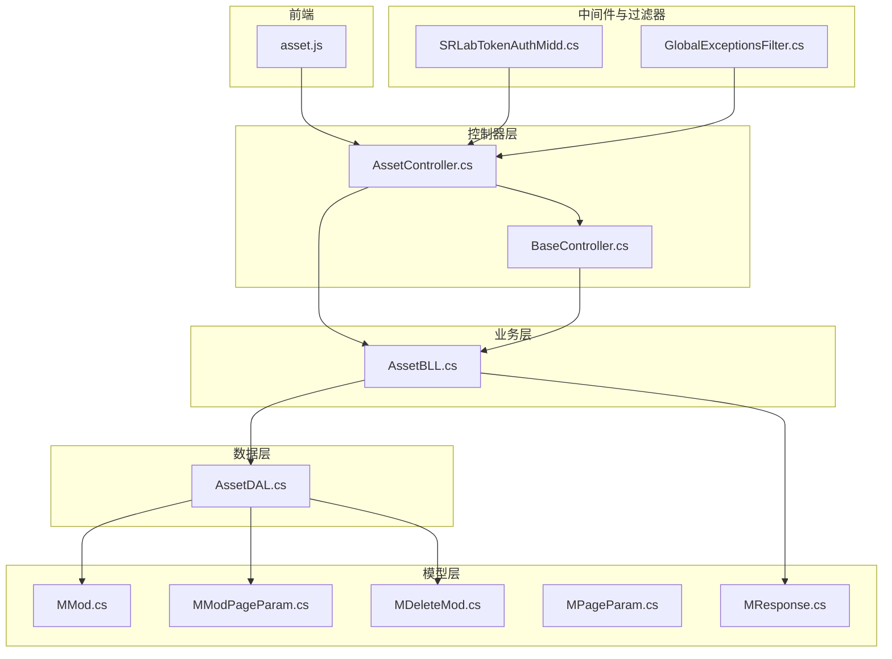
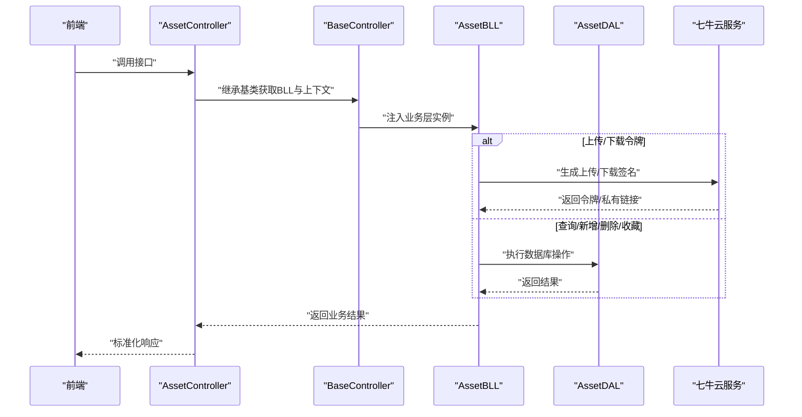
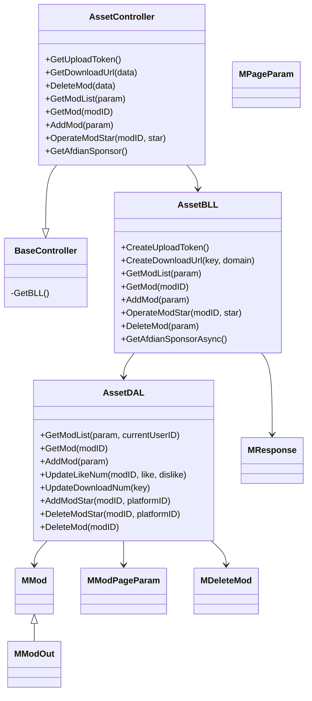
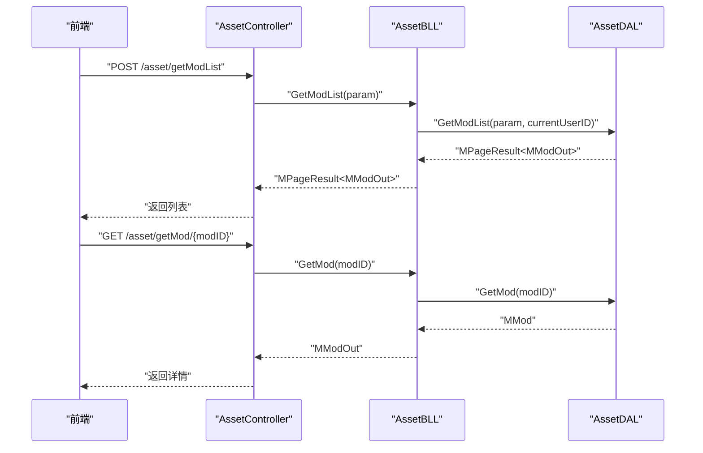

# 资源管理 API

<cite>
**本文引用的文件**
- [SpeedRunners.API/SpeedRunners/Controllers/AssetController.cs](file://SpeedRunners.API/SpeedRunners/Controllers/AssetController.cs)
- [SpeedRunners.API/SpeedRunners/Controllers/BaseController.cs](file://SpeedRunners.API/SpeedRunners/Controllers/BaseController.cs)
- [SpeedRunners.API/SpeedRunners.BLL/AssetBLL.cs](file://SpeedRunners.API/SpeedRunners.BLL/AssetBLL.cs)
- [SpeedRunners.API/SpeedRunners.DAL/AssetDAL.cs](file://SpeedRunners.API/SpeedRunners.DAL/AssetDAL.cs)
- [SpeedRunners.API/SpeedRunners.Model/Asset/MMod.cs](file://SpeedRunners.API/SpeedRunners.Model/Asset/MMod.cs)
- [SpeedRunners.API/SpeedRunners.Model/Asset/MModPageParam.cs](file://SpeedRunners.API/SpeedRunners.Model/Asset/MModPageParam.cs)
- [SpeedRunners.API/SpeedRunners.Model/Asset/MDeleteMod.cs](file://SpeedRunners.API/SpeedRunners.Model/Asset/MDeleteMod.cs)
- [SpeedRunners.API/SpeedRunners.Model/MPageParam.cs](file://SpeedRunners.API/SpeedRunners.Model/MPageParam.cs)
- [SpeedRunners.API/SpeedRunners.Model/MResponse.cs](file://SpeedRunners.API/SpeedRunners.Model/MResponse.cs)
- [SpeedRunners.API/SpeedRunners/Middleware/SRLabTokenAuthMidd.cs](file://SpeedRunners.API/SpeedRunners/Middleware/SRLabTokenAuthMidd.cs)
- [SpeedRunners.API/SpeedRunners/Filter/GlobalExceptionsFilter.cs](file://SpeedRunners.API/SpeedRunners/Filter/GlobalExceptionsFilter.cs)
- [SpeedRunners.UI/src/api/asset.js](file://SpeedRunners.UI/src/api/asset.js)
</cite>

## 目录
1. [简介](#简介)
2. [项目结构](#项目结构)
3. [核心组件](#核心组件)
4. [架构总览](#架构总览)
5. [详细组件分析](#详细组件分析)
6. [依赖关系分析](#依赖关系分析)
7. [性能考量](#性能考量)
8. [故障排查指南](#故障排查指南)
9. [结论](#结论)
10. [附录](#附录)

## 简介
本文件为资源管理模块（MOD 资源）的完整 API 接口文档，覆盖 MOD 的上传、下载、版本控制、评价与收藏、列表查询、搜索与分页、权限控制与安全等能力。后端基于 ASP.NET Core 控制器层，业务层封装了七牛云上传/下载签名、私有链接生成与计数更新；数据层通过 Dapper 实现分页、排序与收藏状态回显；前端通过统一请求封装调用接口。

## 项目结构
资源管理模块主要由以下层次构成：
- 控制器层：对外暴露 REST 风格接口，负责路由与参数绑定
- 基类控制器：统一注入业务层、本地化与当前用户上下文
- 业务层：封装上传/下载令牌生成、私有链接生成、MOD 列表/详情/增删改、收藏操作、赞助商信息拉取
- 数据层：实现 MOD 表的查询、插入、更新与删除，以及收藏表的增删与统计
- 模型层：定义 MOD、分页参数、删除参数等数据结构
- 中间件与过滤器：统一鉴权、异常处理与响应包装
- 前端封装：统一的 axios 请求封装，便于集成

图表来源
- [SpeedRunners.API/SpeedRunners/Controllers/AssetController.cs](file://SpeedRunners.API/SpeedRunners/Controllers/AssetController.cs#L1-L48)
- [SpeedRunners.API/SpeedRunners/Controllers/BaseController.cs](file://SpeedRunners.API/SpeedRunners/Controllers/BaseController.cs#L1-L26)
- [SpeedRunners.API/SpeedRunners.BLL/AssetBLL.cs](file://SpeedRunners.API/SpeedRunners.BLL/AssetBLL.cs#L1-L203)
- [SpeedRunners.API/SpeedRunners.DAL/AssetDAL.cs](file://SpeedRunners.API/SpeedRunners.DAL/AssetDAL.cs#L1-L134)
- [SpeedRunners.API/SpeedRunners.Model/Asset/MMod.cs](file://SpeedRunners.API/SpeedRunners.Model/Asset/MMod.cs#L1-L28)
- [SpeedRunners.API/SpeedRunners.Model/Asset/MModPageParam.cs](file://SpeedRunners.API/SpeedRunners.Model/Asset/MModPageParam.cs#L1-L13)
- [SpeedRunners.API/SpeedRunners.Model/Asset/MDeleteMod.cs](file://SpeedRunners.API/SpeedRunners.Model/Asset/MDeleteMod.cs#L1-L12)
- [SpeedRunners.API/SpeedRunners.Model/MPageParam.cs](file://SpeedRunners.API/SpeedRunners.Model/MPageParam.cs#L1-L15)
- [SpeedRunners.API/SpeedRunners.Model/MResponse.cs](file://SpeedRunners.API/SpeedRunners.Model/MResponse.cs#L1-L42)
- [SpeedRunners.API/SpeedRunners/Middleware/SRLabTokenAuthMidd.cs](file://SpeedRunners.API/SpeedRunners/Middleware/SRLabTokenAuthMidd.cs#L1-L123)
- [SpeedRunners.API/SpeedRunners/Filter/GlobalExceptionsFilter.cs](file://SpeedRunners.API/SpeedRunners/Filter/GlobalExceptionsFilter.cs#L1-L54)
- [SpeedRunners.UI/src/api/asset.js](file://SpeedRunners.UI/src/api/asset.js#L1-L54)

章节来源
- [SpeedRunners.API/SpeedRunners/Controllers/AssetController.cs](file://SpeedRunners.API/SpeedRunners/Controllers/AssetController.cs#L1-L48)
- [SpeedRunners.API/SpeedRunners.BLL/AssetBLL.cs](file://SpeedRunners.API/SpeedRunners.BLL/AssetBLL.cs#L1-L203)
- [SpeedRunners.API/SpeedRunners.DAL/AssetDAL.cs](file://SpeedRunners.API/SpeedRunners.DAL/AssetDAL.cs#L1-L134)
- [SpeedRunners.API/SpeedRunners.Model/Asset/MMod.cs](file://SpeedRunners.API/SpeedRunners.Model/Asset/MMod.cs#L1-L28)
- [SpeedRunners.API/SpeedRunners.Model/Asset/MModPageParam.cs](file://SpeedRunners.API/SpeedRunners.Model/Asset/MModPageParam.cs#L1-L13)
- [SpeedRunners.API/SpeedRunners.Model/Asset/MDeleteMod.cs](file://SpeedRunners.API/SpeedRunners.Model/Asset/MDeleteMod.cs#L1-L12)
- [SpeedRunners.API/SpeedRunners.Model/MPageParam.cs](file://SpeedRunners.API/SpeedRunners.Model/MPageParam.cs#L1-L15)
- [SpeedRunners.API/SpeedRunners.Model/MResponse.cs](file://SpeedRunners.API/SpeedRunners.Model/MResponse.cs#L1-L42)
- [SpeedRunners.API/SpeedRunners/Middleware/SRLabTokenAuthMidd.cs](file://SpeedRunners.API/SpeedRunners/Middleware/SRLabTokenAuthMidd.cs#L1-L123)
- [SpeedRunners.API/SpeedRunners/Filter/GlobalExceptionsFilter.cs](file://SpeedRunners.API/SpeedRunners/Filter/GlobalExceptionsFilter.cs#L1-L54)
- [SpeedRunners.UI/src/api/asset.js](file://SpeedRunners.UI/src/api/asset.js#L1-L54)

## 核心组件
- 控制器层：AssetController 提供上传令牌、下载链接、MOD 列表、详情、新增、删除、收藏等接口，并通过特性标注区分“无需认证”“需登录”“需实名”
- 业务层：AssetBLL 封装上传/下载令牌生成、私有链接生成并更新下载计数、MOD 列表与详情组装、新增、收藏增删、MOD 删除并同步删除云端资源、赞助商信息拉取
- 数据层：AssetDAL 实现 MOD 分页查询、模糊搜索、收藏筛选、详情查询、新增、点赞/下载计数更新、收藏增删、MOD 删除
- 模型层：MMod/MModOut 定义 MOD 字段与输出扩展字段；MModPageParam/MDeleteMod 定义分页与删除参数；MPageParam 定义通用分页；MResponse 统一响应结构
- 中间件与过滤器：SRLabTokenAuthMidd 实现基于 srlab-token 的鉴权；GlobalExceptionsFilter 在生产环境统一捕获异常并返回标准响应

章节来源
- [SpeedRunners.API/SpeedRunners/Controllers/AssetController.cs](file://SpeedRunners.API/SpeedRunners/Controllers/AssetController.cs#L1-L48)
- [SpeedRunners.API/SpeedRunners.BLL/AssetBLL.cs](file://SpeedRunners.API/SpeedRunners.BLL/AssetBLL.cs#L1-L203)
- [SpeedRunners.API/SpeedRunners.DAL/AssetDAL.cs](file://SpeedRunners.API/SpeedRunners.DAL/AssetDAL.cs#L1-L134)
- [SpeedRunners.API/SpeedRunners.Model/Asset/MMod.cs](file://SpeedRunners.API/SpeedRunners.Model/Asset/MMod.cs#L1-L28)
- [SpeedRunners.API/SpeedRunners.Model/Asset/MModPageParam.cs](file://SpeedRunners.API/SpeedRunners.Model/Asset/MModPageParam.cs#L1-L13)
- [SpeedRunners.API/SpeedRunners.Model/Asset/MDeleteMod.cs](file://SpeedRunners.API/SpeedRunners.Model/Asset/MDeleteMod.cs#L1-L12)
- [SpeedRunners.API/SpeedRunners.Model/MPageParam.cs](file://SpeedRunners.API/SpeedRunners.Model/MPageParam.cs#L1-L15)
- [SpeedRunners.API/SpeedRunners.Model/MResponse.cs](file://SpeedRunners.API/SpeedRunners.Model/MResponse.cs#L1-L42)
- [SpeedRunners.API/SpeedRunners/Middleware/SRLabTokenAuthMidd.cs](file://SpeedRunners.API/SpeedRunners/Middleware/SRLabTokenAuthMidd.cs#L1-L123)
- [SpeedRunners.API/SpeedRunners/Filter/GlobalExceptionsFilter.cs](file://SpeedRunners.API/SpeedRunners/Filter/GlobalExceptionsFilter.cs#L1-L54)

## 架构总览
下图展示 MOD 资源管理从接口到数据库的关键交互路径与职责分工：

图表来源
- [SpeedRunners.API/SpeedRunners/Controllers/AssetController.cs](file://SpeedRunners.API/SpeedRunners/Controllers/AssetController.cs#L1-L48)
- [SpeedRunners.API/SpeedRunners/Controllers/BaseController.cs](file://SpeedRunners.API/SpeedRunners/Controllers/BaseController.cs#L1-L26)
- [SpeedRunners.API/SpeedRunners.BLL/AssetBLL.cs](file://SpeedRunners.API/SpeedRunners.BLL/AssetBLL.cs#L1-L203)
- [SpeedRunners.API/SpeedRunners.DAL/AssetDAL.cs](file://SpeedRunners.API/SpeedRunners.DAL/AssetDAL.cs#L1-L134)

## 详细组件分析

### 接口清单与规范

- 获取上传令牌
  - 方法与路径：GET /api/asset/getUploadToken
  - 权限要求：需登录
  - 功能描述：返回图片与 MOD 文件两类上传令牌，用于直传七牛云
  - 返回结构：字符串数组，索引 0 为图片令牌，索引 1 为 MOD 文件令牌
  - 失败场景：无
  - 章节来源
    - [SpeedRunners.API/SpeedRunners/Controllers/AssetController.cs](file://SpeedRunners.API/SpeedRunners/Controllers/AssetController.cs#L16-L18)
    - [SpeedRunners.API/SpeedRunners.BLL/AssetBLL.cs](file://SpeedRunners.API/SpeedRunners.BLL/AssetBLL.cs#L22-L36)

- 获取下载链接
  - 方法与路径：POST /api/asset/getDownloadUrl
  - 权限要求：需登录
  - 请求体：fileName（字符串）
  - 功能描述：生成带有效期的私有下载链接，并在生成后更新下载计数
  - 返回结构：字符串（私有链接）
  - 失败场景：无
  - 章节来源
    - [SpeedRunners.API/SpeedRunners/Controllers/AssetController.cs](file://SpeedRunners.API/SpeedRunners/Controllers/AssetController.cs#L20-L22)
    - [SpeedRunners.API/SpeedRunners.BLL/AssetBLL.cs](file://SpeedRunners.API/SpeedRunners.BLL/AssetBLL.cs#L38-L47)
    - [SpeedRunners.API/SpeedRunners.DAL/AssetDAL.cs](file://SpeedRunners.API/SpeedRunners.DAL/AssetDAL.cs#L106-L110)

- 删除 MOD
  - 方法与路径：POST /api/asset/deleteMod
  - 权限要求：需登录
  - 请求体：MDeleteMod（包含 ModID）
  - 功能描述：仅作者或特定管理员可删除；删除时同步删除云端图片与文件
  - 返回结构：MResponse（成功/失败）
  - 失败场景：非本人且非管理员；删除云端资源失败
  - 章节来源
    - [SpeedRunners.API/SpeedRunners/Controllers/AssetController.cs](file://SpeedRunners.API/SpeedRunners/Controllers/AssetController.cs#L24-L26)
    - [SpeedRunners.API/SpeedRunners.BLL/AssetBLL.cs](file://SpeedRunners.API/SpeedRunners.BLL/AssetBLL.cs#L120-L143)
    - [SpeedRunners.API/SpeedRunners.BLL/AssetBLL.cs](file://SpeedRunners.API/SpeedRunners.BLL/AssetBLL.cs#L150-L160)

- 获取 MOD 列表
  - 方法与路径：POST /api/asset/getModList
  - 权限要求：需实名
  - 请求体：MModPageParam（包含 Tag、OnlyStar、分页参数、关键词）
  - 功能描述：支持按标签筛选、仅看收藏、关键词模糊匹配；返回列表并标记是否为“新资源”，同时回填当前用户的收藏状态
  - 返回结构：MPageResult<MModOut>
  - 失败场景：无
  - 章节来源
    - [SpeedRunners.API/SpeedRunners/Controllers/AssetController.cs](file://SpeedRunners.API/SpeedRunners/Controllers/AssetController.cs#L28-L30)
    - [SpeedRunners.API/SpeedRunners.BLL/AssetBLL.cs](file://SpeedRunners.API/SpeedRunners.BLL/AssetBLL.cs#L49-L62)
    - [SpeedRunners.API/SpeedRunners.DAL/AssetDAL.cs](file://SpeedRunners.API/SpeedRunners.DAL/AssetDAL.cs#L16-L72)

- 获取 MOD 详情
  - 方法与路径：GET /api/asset/getMod/{modID}
  - 权限要求：需实名
  - 路径参数：modID（整数）
  - 功能描述：返回 MOD 详情，自动拼接 CDN 图片前缀
  - 返回结构：MModOut
  - 失败场景：无
  - 章节来源
    - [SpeedRunners.API/SpeedRunners/Controllers/AssetController.cs](file://SpeedRunners.API/SpeedRunners/Controllers/AssetController.cs#L32-L34)
    - [SpeedRunners.API/SpeedRunners.BLL/AssetBLL.cs](file://SpeedRunners.API/SpeedRunners.BLL/AssetBLL.cs#L64-L91)
    - [SpeedRunners.API/SpeedRunners.DAL/AssetDAL.cs](file://SpeedRunners.API/SpeedRunners.DAL/AssetDAL.cs#L74-L77)

- 新增 MOD
  - 方法与路径：POST /api/asset/addMod
  - 权限要求：需登录
  - 请求体：MMod（标题、标签、图片/文件地址、大小等）
  - 功能描述：自动设置作者为当前登录用户，去重判断后入库
  - 返回结构：无（void）
  - 失败场景：重复图片地址（跳过新增）
  - 章节来源
    - [SpeedRunners.API/SpeedRunners/Controllers/AssetController.cs](file://SpeedRunners.API/SpeedRunners/Controllers/AssetController.cs#L36-L38)
    - [SpeedRunners.API/SpeedRunners.BLL/AssetBLL.cs](file://SpeedRunners.API/SpeedRunners.BLL/AssetBLL.cs#L93-L100)
    - [SpeedRunners.API/SpeedRunners.DAL/AssetDAL.cs](file://SpeedRunners.API/SpeedRunners.DAL/AssetDAL.cs#L79-L87)

- 收藏/取消收藏 MOD
  - 方法与路径：GET /api/asset/operateModStar/{modID}/{star}
  - 权限要求：需登录
  - 路径参数：modID（整数）、star（布尔，true 为收藏，false 为取消）
  - 功能描述：根据 star 参数执行收藏或取消收藏，并更新收藏计数
  - 返回结构：无（void）
  - 失败场景：无
  - 章节来源
    - [SpeedRunners.API/SpeedRunners/Controllers/AssetController.cs](file://SpeedRunners.API/SpeedRunners/Controllers/AssetController.cs#L40-L42)
    - [SpeedRunners.API/SpeedRunners.BLL/AssetBLL.cs](file://SpeedRunners.API/SpeedRunners.BLL/AssetBLL.cs#L102-L115)
    - [SpeedRunners.API/SpeedRunners.DAL/AssetDAL.cs](file://SpeedRunners.API/SpeedRunners.DAL/AssetDAL.cs#L112-L124)

- 获取赞助商信息
  - 方法与路径：GET /api/asset/getAfdianSponsor
  - 权限要求：无需认证
  - 功能描述：调用爱发电开放接口获取赞助商信息
  - 返回结构：异步 MResponse
  - 失败场景：外部接口失败或签名错误
  - 章节来源
    - [SpeedRunners.API/SpeedRunners/Controllers/AssetController.cs](file://SpeedRunners.API/SpeedRunners/Controllers/AssetController.cs#L44-L45)
    - [SpeedRunners.API/SpeedRunners.BLL/AssetBLL.cs](file://SpeedRunners.API/SpeedRunners.BLL/AssetBLL.cs#L162-L200)

### 数据模型与分页机制

- MOD 数据模型
  - 字段：ID、Tag、Title、ImgUrl、FileUrl、AuthorID、Like、Dislike、Download、Size、UploadDate、StarCount、Star（输出扩展：IsNew）
  - 章节来源
    - [SpeedRunners.API/SpeedRunners.Model/Asset/MMod.cs](file://SpeedRunners.API/SpeedRunners.Model/Asset/MMod.cs#L7-L27)

- 分页参数
  - 字段：PageNo、PageSize、Offset（计算得出）、Keywords、FuzzyKeywords（自动加 %）
  - 章节来源
    - [SpeedRunners.API/SpeedRunners.Model/MPageParam.cs](file://SpeedRunners.API/SpeedRunners.Model/MPageParam.cs#L3-L14)

- MOD 列表分页参数
  - 扩展字段：Tag、OnlyStar
  - 章节来源
    - [SpeedRunners.API/SpeedRunners.Model/Asset/MModPageParam.cs](file://SpeedRunners.API/SpeedRunners.Model/Asset/MModPageParam.cs#L7-L12)

- 删除参数
  - 字段：ModID
  - 章节来源
    - [SpeedRunners.API/SpeedRunners.Model/Asset/MDeleteMod.cs](file://SpeedRunners.API/SpeedRunners.Model/Asset/MDeleteMod.cs#L7-L10)

- 统一响应
  - 结构：Code、Message、Data（泛型）、静态 Success/Fail 工具方法
  - 章节来源
    - [SpeedRunners.API/SpeedRunners.Model/MResponse.cs](file://SpeedRunners.API/SpeedRunners.Model/MResponse.cs#L3-L41)

### 权限控制与安全

- 鉴权中间件
  - 依据接口特性判断是否需要认证：Persona/User
  - 读取 srlab-token 头部，验证用户有效性并注入当前用户上下文
  - 未登录访问需登录接口将返回失败响应
  - 章节来源
    - [SpeedRunners.API/SpeedRunners/Middleware/SRLabTokenAuthMidd.cs](file://SpeedRunners.API/SpeedRunners/Middleware/SRLabTokenAuthMidd.cs#L54-L101)

- 异常处理
  - 生产环境统一捕获异常，返回标准响应并记录日志
  - 章节来源
    - [SpeedRunners.API/SpeedRunners/Filter/GlobalExceptionsFilter.cs](file://SpeedRunners.API/SpeedRunners/Filter/GlobalExceptionsFilter.cs#L31-L50)

- 上传/下载安全
  - 上传令牌按空间（图片/sr-img、MOD/sr-mod）分别签发
  - 下载链接为私有链接，带有效期并在生成后更新下载计数
  - 章节来源
    - [SpeedRunners.API/SpeedRunners.BLL/AssetBLL.cs](file://SpeedRunners.API/SpeedRunners.BLL/AssetBLL.cs#L22-L36)
    - [SpeedRunners.API/SpeedRunners.BLL/AssetBLL.cs](file://SpeedRunners.API/SpeedRunners.BLL/AssetBLL.cs#L38-L47)

### 前端集成与大文件处理

- 前端封装
  - 使用统一请求封装调用后端接口，包括获取上传令牌、下载链接、MOD 列表/详情、新增、删除、收藏等
  - 章节来源
    - [SpeedRunners.UI/src/api/asset.js](file://SpeedRunners.UI/src/api/asset.js#L1-L54)

- 大文件处理建议
  - 使用分片上传（断点续传）与唯一 key 策略，结合上传令牌与私有链接保障安全性
  - 建议前端在上传前先调用获取上传令牌接口，再进行直传
  - 上传完成后将返回的 key 作为 FileUrl/ImgUrl 存入数据库
  - 章节来源
    - [SpeedRunners.API/SpeedRunners.BLL/AssetBLL.cs](file://SpeedRunners.API/SpeedRunners.BLL/AssetBLL.cs#L22-L36)
    - [SpeedRunners.API/SpeedRunners.BLL/AssetBLL.cs](file://SpeedRunners.API/SpeedRunners.BLL/AssetBLL.cs#L38-L47)

### 版本控制与依赖关系
- 版本控制
  - 通过文件名（key）与上传时间（UploadDate）区分“新资源”，列表排序优先考虑近期上传
  - 章节来源
    - [SpeedRunners.API/SpeedRunners.BLL/AssetBLL.cs](file://SpeedRunners.API/SpeedRunners.BLL/AssetBLL.cs#L86-L87)
    - [SpeedRunners.API/SpeedRunners.DAL/AssetDAL.cs](file://SpeedRunners.API/SpeedRunners.DAL/AssetDAL.cs#L46-L55)

- 依赖关系
  - 控制器依赖业务层；业务层依赖数据层与第三方 SDK（七牛云）；数据层依赖数据库
  - 章节来源
    - [SpeedRunners.API/SpeedRunners/Controllers/AssetController.cs](file://SpeedRunners.API/SpeedRunners/Controllers/AssetController.cs#L1-L48)
    - [SpeedRunners.API/SpeedRunners.BLL/AssetBLL.cs](file://SpeedRunners.API/SpeedRunners.BLL/AssetBLL.cs#L1-L203)
    - [SpeedRunners.API/SpeedRunners.DAL/AssetDAL.cs](file://SpeedRunners.API/SpeedRunners.DAL/AssetDAL.cs#L1-L134)

## 依赖关系分析

图表来源
- [SpeedRunners.API/SpeedRunners/Controllers/AssetController.cs](file://SpeedRunners.API/SpeedRunners/Controllers/AssetController.cs#L1-L48)
- [SpeedRunners.API/SpeedRunners/Controllers/BaseController.cs](file://SpeedRunners.API/SpeedRunners/Controllers/BaseController.cs#L1-L26)
- [SpeedRunners.API/SpeedRunners.BLL/AssetBLL.cs](file://SpeedRunners.API/SpeedRunners.BLL/AssetBLL.cs#L1-L203)
- [SpeedRunners.API/SpeedRunners.DAL/AssetDAL.cs](file://SpeedRunners.API/SpeedRunners.DAL/AssetDAL.cs#L1-L134)
- [SpeedRunners.API/SpeedRunners.Model/Asset/MMod.cs](file://SpeedRunners.API/SpeedRunners.Model/Asset/MMod.cs#L1-L28)
- [SpeedRunners.API/SpeedRunners.Model/Asset/MModPageParam.cs](file://SpeedRunners.API/SpeedRunners.Model/Asset/MModPageParam.cs#L1-L13)
- [SpeedRunners.API/SpeedRunners.Model/Asset/MDeleteMod.cs](file://SpeedRunners.API/SpeedRunners.Model/Asset/MDeleteMod.cs#L1-L12)
- [SpeedRunners.API/SpeedRunners.Model/MPageParam.cs](file://SpeedRunners.API/SpeedRunners.Model/MPageParam.cs#L1-L15)
- [SpeedRunners.API/SpeedRunners.Model/MResponse.cs](file://SpeedRunners.API/SpeedRunners.Model/MResponse.cs#L1-L42)

## 性能考量
- 列表查询
  - 使用联合查询与排序表达式，避免多次往返数据库；分页通过 Offset/PageSize 控制
  - 章节来源
    - [SpeedRunners.API/SpeedRunners.DAL/AssetDAL.cs](file://SpeedRunners.API/SpeedRunners.DAL/AssetDAL.cs#L43-L55)

- 下载计数
  - 私有链接生成后立即更新下载计数，减少并发竞争下的不一致
  - 章节来源
    - [SpeedRunners.API/SpeedRunners.BLL/AssetBLL.cs](file://SpeedRunners.API/SpeedRunners.BLL/AssetBLL.cs#L42-L46)
    - [SpeedRunners.API/SpeedRunners.DAL/AssetDAL.cs](file://SpeedRunners.API/SpeedRunners.DAL/AssetDAL.cs#L106-L110)

- 收藏状态
  - 登录用户一次性查询其收藏列表，列表循环中标记收藏状态，避免多次查询
  - 章节来源
    - [SpeedRunners.API/SpeedRunners.DAL/AssetDAL.cs](file://SpeedRunners.API/SpeedRunners.DAL/AssetDAL.cs#L21-L71)

## 故障排查指南
- 上传失败
  - 检查上传令牌是否正确获取；确认空间名称与域名配置；检查网络与七牛云可用性
  - 章节来源
    - [SpeedRunners.API/SpeedRunners.BLL/AssetBLL.cs](file://SpeedRunners.API/SpeedRunners.BLL/AssetBLL.cs#L22-L36)

- 下载链接无效
  - 检查链接有效期；确认文件 key 是否正确；确认下载计数更新逻辑
  - 章节来源
    - [SpeedRunners.API/SpeedRunners.BLL/AssetBLL.cs](file://SpeedRunners.API/SpeedRunners.BLL/AssetBLL.cs#L38-L47)
    - [SpeedRunners.API/SpeedRunners.DAL/AssetDAL.cs](file://SpeedRunners.API/SpeedRunners.DAL/AssetDAL.cs#L106-L110)

- 删除失败
  - 检查当前用户是否为作者或管理员；确认云端资源删除成功后再删除数据库记录
  - 章节来源
    - [SpeedRunners.API/SpeedRunners.BLL/AssetBLL.cs](file://SpeedRunners.API/SpeedRunners.BLL/AssetBLL.cs#L120-L143)
    - [SpeedRunners.API/SpeedRunners.BLL/AssetBLL.cs](file://SpeedRunners.API/SpeedRunners.BLL/AssetBLL.cs#L150-L160)

- 列表为空
  - 检查筛选条件（标签、OnlyStar、关键词）；确认分页参数是否合理
  - 章节来源
    - [SpeedRunners.API/SpeedRunners.DAL/AssetDAL.cs](file://SpeedRunners.API/SpeedRunners.DAL/AssetDAL.cs#L16-L72)
    - [SpeedRunners.API/SpeedRunners.Model/MPageParam.cs](file://SpeedRunners.API/SpeedRunners.Model/MPageParam.cs#L3-L14)

- 异常与日志
  - 生产环境异常会被统一捕获并记录；可通过日志定位具体接口与参数
  - 章节来源
    - [SpeedRunners.API/SpeedRunners/Filter/GlobalExceptionsFilter.cs](file://SpeedRunners.API/SpeedRunners/Filter/GlobalExceptionsFilter.cs#L31-L50)

## 结论
资源管理模块围绕 MOD 的全生命周期提供了完善的接口能力：上传令牌签发、私有链接下载、列表/详情查询、新增/删除、收藏管理与下载计数。通过鉴权中间件与异常过滤器确保安全与稳定性；通过分页与排序表达式提升查询性能。前端可直接复用统一请求封装完成集成。

## 附录

### API 调用序列示例

图表来源
- [SpeedRunners.API/SpeedRunners/Controllers/AssetController.cs](file://SpeedRunners.API/SpeedRunners/Controllers/AssetController.cs#L28-L34)
- [SpeedRunners.API/SpeedRunners.BLL/AssetBLL.cs](file://SpeedRunners.API/SpeedRunners.BLL/AssetBLL.cs#L49-L91)
- [SpeedRunners.API/SpeedRunners.DAL/AssetDAL.cs](file://SpeedRunners.API/SpeedRunners.DAL/AssetDAL.cs#L16-L77)