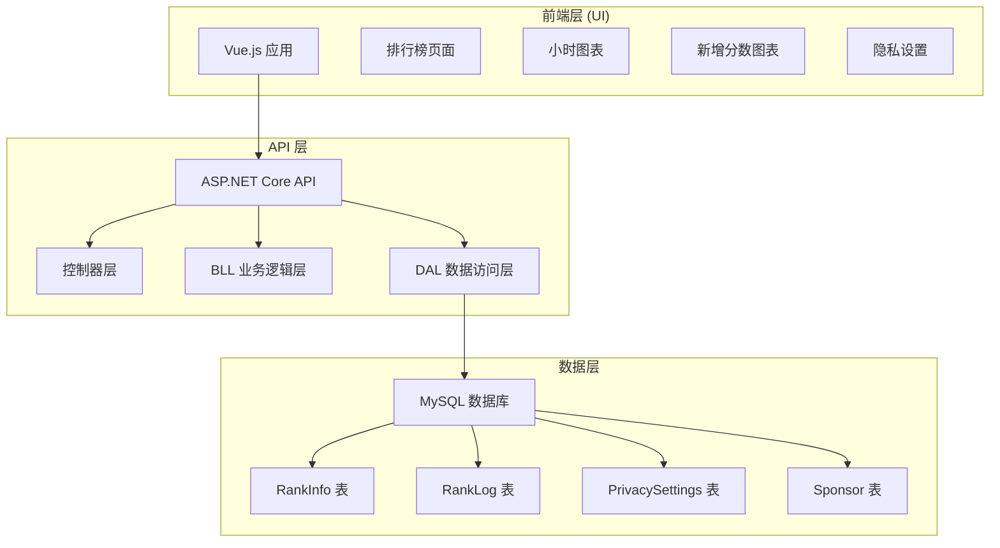
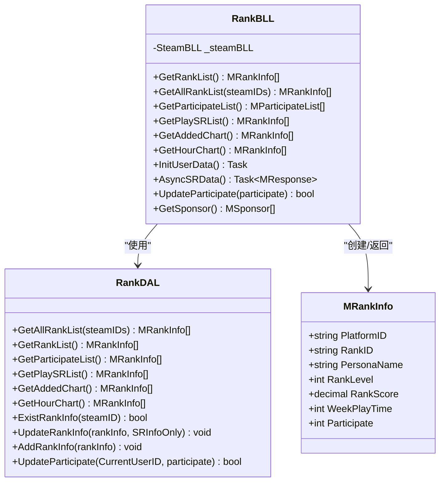
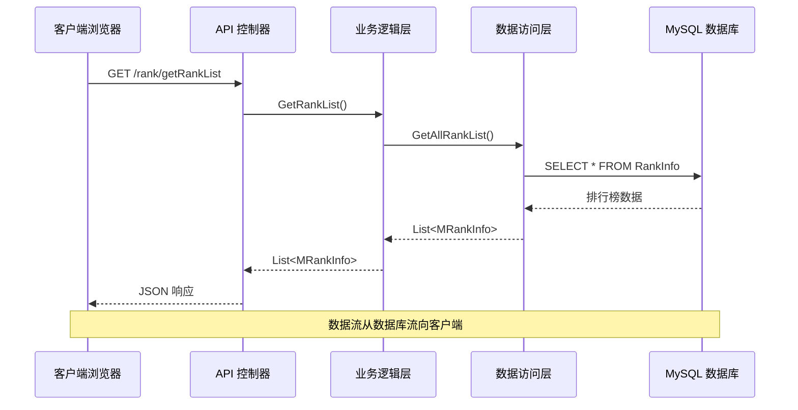
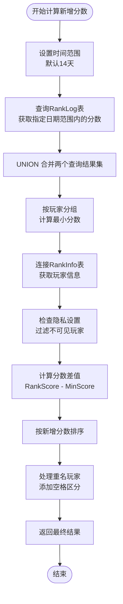
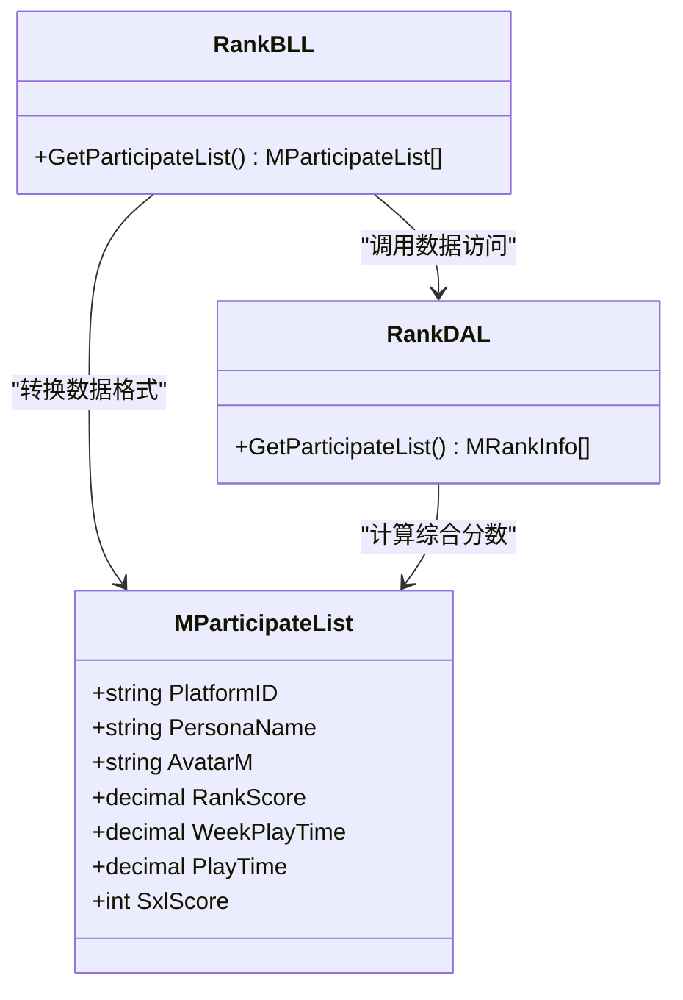
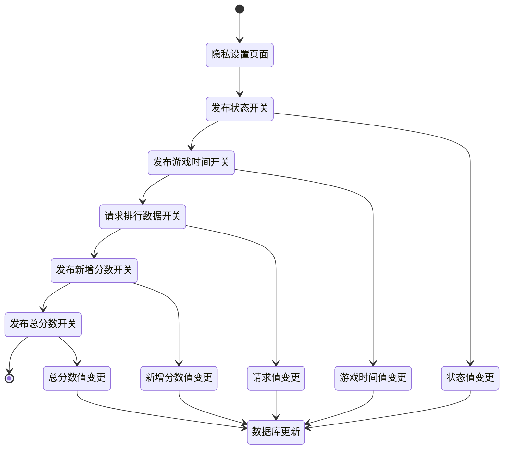
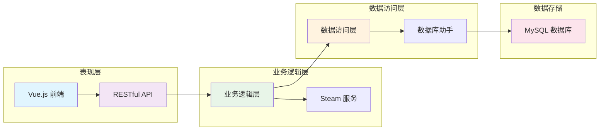

# 排行榜增强功能

<cite>
**本文档引用的文件**
- [RankBLL.cs](file://SpeedRunners.API/SpeedRunners.BLL/RankBLL.cs)
- [RankDAL.cs](file://SpeedRunners.API/SpeedRunners.DAL/RankDAL.cs)
- [RankController.cs](file://SpeedRunners.API/SpeedRunners/Controllers/RankController.cs)
- [MRankInfo.cs](file://SpeedRunners.API/SpeedRunners.Model/Rank/MRankInfo.cs)
- [MParticipateList.cs](file://SpeedRunners.API/SpeedRunners.Model/Rank/MParticipateList.cs)
- [MRankLog.cs](file://SpeedRunners.API/SpeedRunners.Model/Rank/MRankLog.cs)
- [rank.js](file://SpeedRunners.UI/src/api/rank.js)
- [index.vue](file://SpeedRunners.UI/src/views/rank/index.vue)
- [hourChart.vue](file://SpeedRunners.UI/src/views/index/hourChart.vue)
- [addedChart.vue](file://SpeedRunners.UI/src/views/index/addedChart.vue)
- [tmdsr.sql](file://mysql-dump/tmdsr.sql)
- [UserBLL.cs](file://SpeedRunners.API/SpeedRunners.BLL/UserBLL.cs)
- [UserDAL.cs](file://SpeedRunners.API/SpeedRunners.DAL/UserDAL.cs)
- [MPrivacySettings.cs](file://SpeedRunners.API/SpeedRunners.Model/User/MPrivacySettings.cs)
- [privacySettings.vue](file://SpeedRunners.UI/src/views/other/privacySettings.vue)
</cite>

## 目录
1. [简介](#简介)
2. [项目结构](#项目结构)
3. [核心组件](#核心组件)
4. [架构概览](#架构概览)
5. [详细组件分析](#详细组件分析)
6. [依赖关系分析](#依赖关系分析)
7. [性能考虑](#性能考虑)
8. [故障排除指南](#故障排除指南)
9. [结论](#结论)

## 简介

SpeedRunnersLab 是一个基于 ASP.NET Core 和 Vue.js 的 SpeedRunners 游戏排行榜系统。该系统提供了完整的天梯分管理、玩家统计、实时排行榜等功能。本次文档重点分析排行榜增强功能，包括新增天梯分图表、游戏时间排行榜、参与状态管理等核心特性。

## 项目结构

该项目采用典型的三层架构设计，包含以下主要模块：

**图表来源**
- [index.vue](file://SpeedRunners.UI/src/views/rank/index.vue#L1-L328)
- [RankController.cs](file://SpeedRunners.API/SpeedRunners/Controllers/RankController.cs#L1-L48)
- [RankBLL.cs](file://SpeedRunners.API/SpeedRunners.BLL/RankBLL.cs#L1-L210)

**章节来源**
- [index.vue](file://SpeedRunners.UI/src/views/rank/index.vue#L1-L328)
- [rank.js](file://SpeedRunners.UI/src/api/rank.js#L1-L64)

## 核心组件

### 排行榜业务逻辑层 (RankBLL)

RankBLL 是排行榜功能的核心业务逻辑组件，负责处理所有与排行榜相关的业务操作：

**图表来源**
- [RankBLL.cs](file://SpeedRunners.API/SpeedRunners.BLL/RankBLL.cs#L14-L210)
- [RankDAL.cs](file://SpeedRunners.API/SpeedRunners.DAL/RankDAL.cs#L11-L175)
- [MRankInfo.cs](file://SpeedRunners.API/SpeedRunners.Model/Rank/MRankInfo.cs#L5-L36)

### 数据模型设计

系统采用清晰的数据模型设计，支持多种排行榜展示需求：

| 数据表 | 字段说明 | 用途 |
|--------|----------|------|
| RankInfo | 包含玩家基本信息、天梯分、段位等级、游戏状态等 | 主要排行榜数据存储 |
| RankLog | 记录玩家天梯分历史变化 | 支持新增分数统计和趋势分析 |
| PrivacySettings | 隐私设置控制 | 控制排行榜数据的可见性 |
| Sponsor | 赞助商信息 | 支持赞助商展示功能 |

**章节来源**
- [MRankInfo.cs](file://SpeedRunners.API/SpeedRunners.Model/Rank/MRankInfo.cs#L1-L36)
- [MRankLog.cs](file://SpeedRunners.API/SpeedRunners.Model/Rank/MRankLog.cs#L1-L12)
- [tmdsr.sql](file://mysql-dump/tmdsr.sql#L383-L462)

## 架构概览

系统采用经典的三层架构模式，实现了清晰的职责分离：

**图表来源**
- [RankController.cs](file://SpeedRunners.API/SpeedRunners/Controllers/RankController.cs#L17-L17)
- [RankBLL.cs](file://SpeedRunners.API/SpeedRunners.BLL/RankBLL.cs#L28-L34)
- [RankDAL.cs](file://SpeedRunners.API/SpeedRunners.DAL/RankDAL.cs#L17-L25)

## 详细组件分析

### 新增天梯分图表功能

新增天梯分图表功能通过复杂的 SQL 查询实现，能够准确计算玩家在指定时间范围内的天梯分增长情况：

**图表来源**
- [RankDAL.cs](file://SpeedRunners.API/SpeedRunners.DAL/RankDAL.cs#L44-L81)
- [RankBLL.cs](file://SpeedRunners.API/SpeedRunners.BLL/RankBLL.cs#L78-L84)

该功能的关键实现特点：

1. **时间范围计算**：默认14天时间窗口，确保统计的准确性
2. **数据完整性保证**：使用 UNION 操作确保包含时间窗口边界的数据点
3. **隐私保护机制**：自动过滤掉设置了隐私限制的玩家数据
4. **重名处理**：智能处理同名玩家的显示问题

### 游戏时间排行榜功能

游戏时间排行榜基于玩家的周游戏时长进行排序，提供更全面的玩家活跃度展示：

**图表来源**
- [MParticipateList.cs](file://SpeedRunners.API/SpeedRunners.Model/Rank/MParticipateList.cs#L7-L18)
- [RankBLL.cs](file://SpeedRunners.API/SpeedRunners.BLL/RankBLL.cs#L44-L60)
- [RankDAL.cs](file://SpeedRunners.API/SpeedRunners.DAL/RankDAL.cs#L27-L30)

### 隐私设置管理系统

系统提供了完善的隐私设置功能，允许玩家控制自己的数据在排行榜中的可见性：

**图表来源**
- [privacySettings.vue](file://SpeedRunners.UI/src/views/other/privacySettings.vue#L1-L169)
- [UserDAL.cs](file://SpeedRunners.API/SpeedRunners.DAL/UserDAL.cs#L37-L51)

**章节来源**
- [RankBLL.cs](file://SpeedRunners.API/SpeedRunners.BLL/RankBLL.cs#L193-L207)
- [UserBLL.cs](file://SpeedRunners.API/SpeedRunners.BLL/UserBLL.cs#L26-L49)
- [MPrivacySettings.cs](file://SpeedRunners.API/SpeedRunners.Model/User/MPrivacySettings.cs#L7-L22)

## 依赖关系分析

系统各层之间的依赖关系清晰明确，遵循了良好的软件工程原则：

**图表来源**
- [RankController.cs](file://SpeedRunners.API/SpeedRunners/Controllers/RankController.cs#L1-L48)
- [RankBLL.cs](file://SpeedRunners.API/SpeedRunners.BLL/RankBLL.cs#L16-L21)
- [RankDAL.cs](file://SpeedRunners.API/SpeedRunners.DAL/RankDAL.cs#L13-L13)

**章节来源**
- [rank.js](file://SpeedRunners.UI/src/api/rank.js#L1-L64)
- [index.vue](file://SpeedRunners.UI/src/views/rank/index.vue#L61-L96)

## 性能考虑

### 数据库优化策略

1. **索引设计**：RankInfo 表包含多个常用查询字段的索引，包括 PlatformID、RankScore 等关键字段
2. **查询优化**：使用预编译语句和参数化查询，避免 SQL 注入同时提高执行效率
3. **数据类型选择**：采用合适的数值类型，如 decimal(18,3) 存储天梯分，确保精度要求

### 缓存机制

系统可以通过以下方式进一步优化性能：

1. **Redis 缓存**：为热门排行榜数据添加缓存层
2. **分页加载**：对于大量数据的排行榜页面实现分页加载
3. **数据压缩**：对传输的大数据量进行压缩处理

### 前端性能优化

1. **懒加载**：图表组件采用懒加载方式，提升页面初始加载速度
2. **虚拟滚动**：对于长列表数据实现虚拟滚动，减少 DOM 节点数量
3. **图片优化**：使用适当的图片尺寸和格式，减少带宽消耗

## 故障排除指南

### 常见问题及解决方案

**问题1：排行榜数据不更新**
- 检查 RankLog 表是否有新记录
- 验证数据库连接配置
- 确认定时任务正常运行

**问题2：隐私设置不生效**
- 检查 PrivacySettings 表数据是否正确更新
- 验证用户权限验证逻辑
- 确认前端请求参数正确传递

**问题3：图表显示异常**
- 检查 ECharts 库版本兼容性
- 验证数据格式是否符合预期
- 确认网络请求是否成功

**章节来源**
- [RankDAL.cs](file://SpeedRunners.API/SpeedRunners.DAL/RankDAL.cs#L157-L166)
- [UserDAL.cs](file://SpeedRunners.API/SpeedRunners.DAL/UserDAL.cs#L42-L51)

## 结论

SpeedRunnersLab 的排行榜增强功能展现了优秀的软件架构设计和用户体验考虑。通过合理的分层架构、清晰的数据模型设计和完善的隐私保护机制，系统能够为用户提供准确、及时、个性化的排行榜服务。

主要优势包括：
1. **模块化设计**：清晰的三层架构便于维护和扩展
2. **数据完整性**：完善的隐私设置保护用户数据安全
3. **性能优化**：合理的数据库设计和查询优化策略
4. **用户体验**：直观的界面设计和丰富的可视化图表

未来可以考虑的功能增强方向：
1. 实现实时排行榜更新机制
2. 添加更多自定义筛选条件
3. 优化移动端用户体验
4. 增强数据分析和预测功能