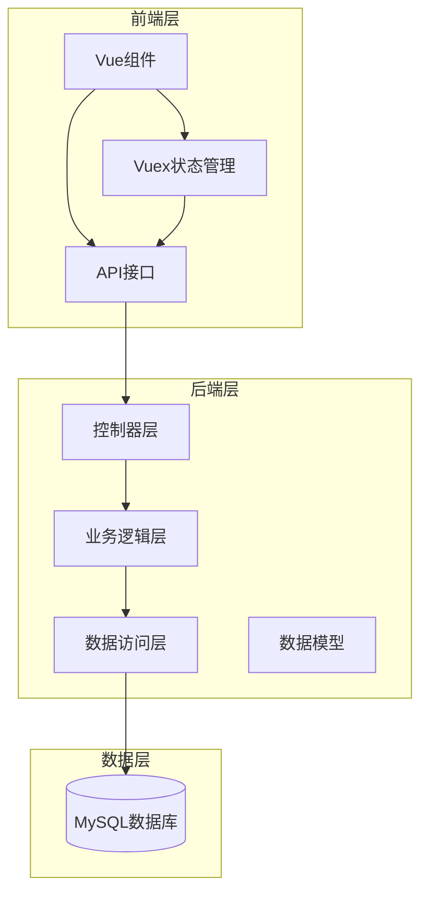
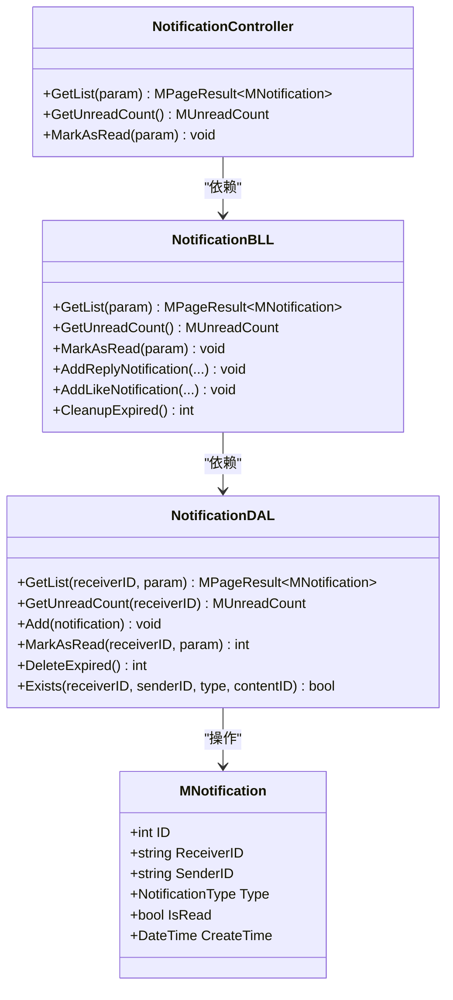
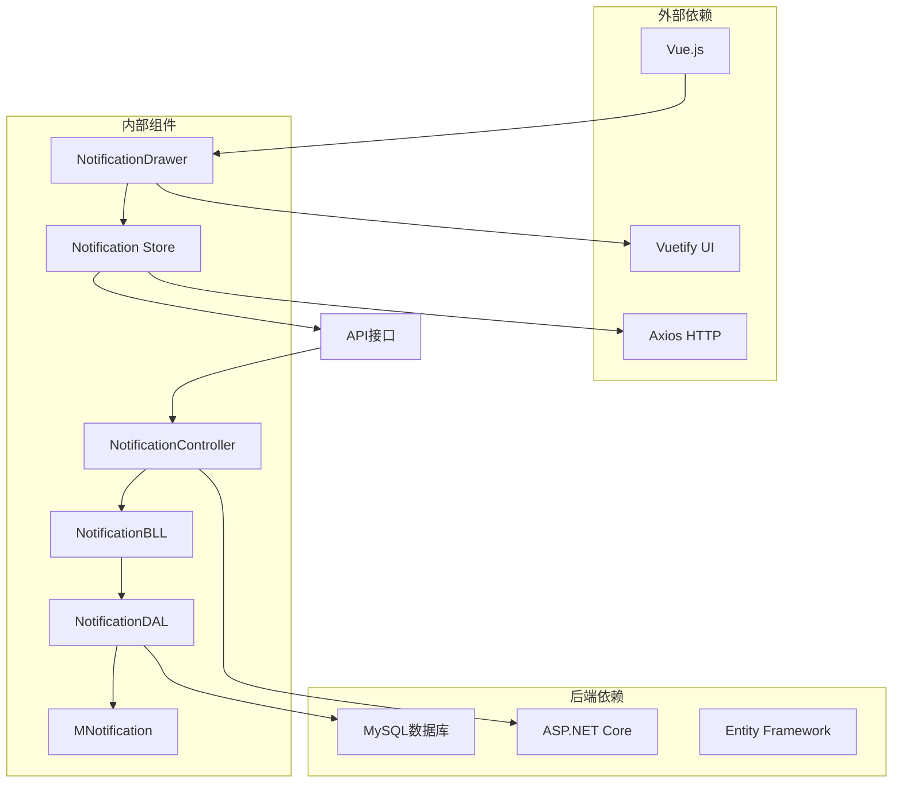

# 通知系统

<cite>
**本文档引用的文件**
- [NotificationController.cs](file://SpeedRunners.API/SpeedRunners/Controllers/NotificationController.cs)
- [NotificationBLL.cs](file://SpeedRunners.API/SpeedRunners.BLL/NotificationBLL.cs)
- [NotificationDAL.cs](file://SpeedRunners.API/SpeedRunners.DAL/NotificationDAL.cs)
- [MNotification.cs](file://SpeedRunners.API/SpeedRunners.Model/User/MNotification.cs)
- [notification.js](file://SpeedRunners.UI/src/api/notification.js)
- [notification.js](file://SpeedRunners.UI/src/store/modules/notification.js)
- [index.vue](file://SpeedRunners.UI/src/components/NotificationDrawer/index.vue)
- [CommentBLL.cs](file://SpeedRunners.API/SpeedRunners.BLL/CommentBLL.cs)
- [Startup.cs](file://SpeedRunners.API/SpeedRunners/Startup.cs)
- [BLLHelper.cs](file://SpeedRunners.API/SpeedRunners.Utils/BLLHelper.cs)
- [notification_table.sql](file://mysql-dump/notification_table.sql)
</cite>

## 目录
1. [简介](#简介)
2. [项目结构](#项目结构)
3. [核心组件](#核心组件)
4. [架构概览](#架构概览)
5. [详细组件分析](#详细组件分析)
6. [依赖关系分析](#依赖关系分析)
7. [性能考虑](#性能考虑)
8. [故障排除指南](#故障排除指南)
9. [结论](#结论)

## 简介

SpeedRunnersLab 项目的通知系统是一个完整的实时消息通知解决方案，主要负责处理用户之间的互动通知，包括回复通知和点赞通知。该系统采用分层架构设计，包含前端Vue组件、后端API控制器、业务逻辑层和数据访问层，实现了从消息生成到展示的完整生命周期管理。

通知系统支持以下核心功能：
- 实时消息推送和展示
- 未读消息计数统计
- 消息分类管理（回复通知、点赞通知）
- 自动清理过期消息
- 用户友好的通知抽屉界面

## 项目结构

通知系统在项目中采用清晰的分层架构组织：

**图表来源**
- [NotificationController.cs](file://SpeedRunners.API/SpeedRunners/Controllers/NotificationController.cs#L1-L48)
- [NotificationBLL.cs](file://SpeedRunners.API/SpeedRunners.BLL/NotificationBLL.cs#L1-L107)
- [NotificationDAL.cs](file://SpeedRunners.API/SpeedRunners.DAL/NotificationDAL.cs#L1-L155)

**章节来源**
- [NotificationController.cs](file://SpeedRunners.API/SpeedRunners/Controllers/NotificationController.cs#L1-L48)
- [Startup.cs](file://SpeedRunners.API/SpeedRunners/Startup.cs#L33-L62)

## 核心组件

通知系统由多个核心组件构成，每个组件都有明确的职责分工：

### 数据模型层
- **MNotification**: 消息实体类，定义了通知的基本属性和结构
- **NotificationType**: 枚举类型，定义消息类型（回复通知、点赞通知）
- **查询参数类**: 支持分页查询和条件过滤

### 业务逻辑层
- **NotificationBLL**: 主要的业务逻辑处理类，负责消息的增删改查操作
- **CommentBLL**: 与评论系统集成，自动触发相关通知

### 数据访问层
- **NotificationDAL**: 数据持久化操作，提供数据库访问接口
- **BLLHelper**: 通用的业务逻辑基类，提供数据库连接和事务管理

### 前端组件层
- **NotificationDrawer**: Vue通知抽屉组件，提供用户界面交互
- **Vuex模块**: 状态管理和异步操作处理

**章节来源**
- [MNotification.cs](file://SpeedRunners.API/SpeedRunners.Model/User/MNotification.cs#L1-L145)
- [NotificationBLL.cs](file://SpeedRunners.API/SpeedRunners.BLL/NotificationBLL.cs#L1-L107)
- [NotificationDAL.cs](file://SpeedRunners.API/SpeedRunners.DAL/NotificationDAL.cs#L1-L155)

## 架构概览

通知系统采用经典的三层架构模式，确保了良好的代码分离和可维护性：

**图表来源**
- [NotificationController.cs](file://SpeedRunners.API/SpeedRunners/Controllers/NotificationController.cs#L10-L46)
- [NotificationBLL.cs](file://SpeedRunners.API/SpeedRunners.BLL/NotificationBLL.cs#L9-L34)
- [NotificationDAL.cs](file://SpeedRunners.API/SpeedRunners.DAL/NotificationDAL.cs#L10-L26)
- [MNotification.cs](file://SpeedRunners.API/SpeedRunners.Model/User/MNotification.cs#L24-L90)

## 详细组件分析

### 后端API控制器

NotificationController 是通知系统的核心入口点，提供了三个主要的REST API接口：

#### GET /api/notification/GetList
用于获取用户的完整通知列表，支持分页和条件过滤。

#### GET /api/notification/GetUnreadCount  
返回用户的未读消息数量统计，包括回复通知和点赞通知的独立计数。

#### POST /api/notification/MarkAsRead
将指定的通知标记为已读，支持按通知ID或通知类型进行批量标记。

**章节来源**
- [NotificationController.cs](file://SpeedRunners.API/SpeedRunners/Controllers/NotificationController.cs#L12-L45)

### 业务逻辑层实现

NotificationBLL 类封装了所有业务逻辑处理，包括：

#### 消息列表获取
通过调用 DAL 层的 GetList 方法，结合当前用户的 PlatformID 进行数据过滤。

#### 未读消息统计
使用 SQL 的 CASE WHEN 语句分别统计回复通知和点赞通知的未读数量。

#### 通知添加机制
- **回复通知**: 当用户回复他人评论时自动触发
- **点赞通知**: 当用户获得点赞时自动触发
- **防重复机制**: 24小时内相同的回复或点赞不会重复发送

#### 消息清理
定期清理30天前的过期消息，保持数据库性能。

**章节来源**
- [NotificationBLL.cs](file://SpeedRunners.API/SpeedRunners.BLL/NotificationBLL.cs#L15-L104)

### 数据访问层设计

NotificationDAL 提供了完整的数据持久化操作：

#### 查询优化
- 使用索引优化查询性能
- 支持动态 WHERE 条件构建
- 分页查询避免大数据量加载

#### 数据完整性
- 事务管理确保数据一致性
- 参数化查询防止SQL注入
- 时间范围限制（30天内）

#### 存储过程
- 单条消息添加
- 批量消息标记
- 过期数据清理

**章节来源**
- [NotificationDAL.cs](file://SpeedRunners.API/SpeedRunners.DAL/NotificationDAL.cs#L17-L136)

### 前端组件实现

#### NotificationDrawer 抽屉组件
这是一个功能完整的Vue组件，提供用户友好的通知界面：

##### 核心功能
- **标签页切换**: 区分回复通知和点赞通知
- **实时轮询**: 每30秒自动检查未读消息
- **消息点击跳转**: 点击通知自动跳转到相关内容
- **批量标记**: 支持一键标记所有通知为已读

##### 界面特性
- **响应式设计**: 适配不同屏幕尺寸
- **主题适配**: 支持明暗主题切换
- **加载状态**: 提供加载指示器
- **空状态**: 无通知时的友好提示

**章节来源**
- [index.vue](file://SpeedRunners.UI/src/components/NotificationDrawer/index.vue#L1-L325)

### Vuex状态管理

notification.js 模块管理通知相关的状态和异步操作：

#### 状态结构
- **unreadCount**: 未读消息计数对象
- **notifications**: 通知列表数组
- **pollingTimer**: 轮询定时器引用

#### 异步操作
- **fetchUnreadCount**: 获取未读消息数量
- **fetchNotifications**: 获取通知列表
- **markAsRead**: 标记消息为已读
- **startPolling/stopPolling**: 控制轮询功能

**章节来源**
- [notification.js](file://SpeedRunners.UI/src/store/modules/notification.js#L1-L138)

## 依赖关系分析

通知系统各组件之间的依赖关系如下：

**图表来源**
- [Startup.cs](file://SpeedRunners.API/SpeedRunners/Startup.cs#L33-L62)
- [BLLHelper.cs](file://SpeedRunners.API/SpeedRunners.Utils/BLLHelper.cs#L7-L71)

### 数据库设计

通知系统使用专门的数据库表存储消息数据：

#### 表结构特点
- **主键索引**: ID 自增主键
- **复合索引**: ReceiverID + Type + IsRead 组合索引
- **时间索引**: CreateTime 索引支持时间范围查询
- **唯一约束**: 防止重复消息的组合索引

#### 字段说明
- **ReceiverID**: 接收用户标识
- **SenderID**: 发送用户标识  
- **Type**: 消息类型（1-回复，2-点赞）
- **ContentID**: 关联内容ID
- **IsRead**: 已读状态标志
- **CreateTime**: 创建时间戳

**章节来源**
- [notification_table.sql](file://mysql-dump/notification_table.sql#L1-L22)

## 性能考虑

通知系统在设计时充分考虑了性能优化：

### 数据库性能优化
- **索引策略**: 为高频查询字段建立适当索引
- **查询优化**: 使用参数化查询和 LIMIT 限制结果集
- **数据清理**: 定期清理过期数据减少表大小

### 前端性能优化
- **虚拟滚动**: 大量通知时使用虚拟滚动技术
- **懒加载**: 按需加载通知数据
- **缓存策略**: 合理使用浏览器缓存

### 后端性能优化
- **连接池**: 使用连接池管理数据库连接
- **异步处理**: 支持异步I/O操作
- **批量操作**: 支持批量插入和更新

## 故障排除指南

### 常见问题及解决方案

#### 通知无法显示
1. **检查用户认证**: 确保用户已正确登录
2. **验证API连接**: 检查网络连接和API可用性
3. **查看控制台错误**: 检查浏览器开发者工具中的错误信息

#### 未读计数不准确
1. **检查轮询设置**: 确认轮询定时器正常工作
2. **验证标记逻辑**: 检查标记已读功能是否正常执行
3. **数据库同步**: 确认数据库操作成功完成

#### 性能问题
1. **检查索引**: 验证数据库索引是否正确创建
2. **监控查询**: 使用数据库性能分析工具
3. **优化查询**: 减少不必要的数据传输

**章节来源**
- [notification.js](file://SpeedRunners.UI/src/store/modules/notification.js#L61-L109)

### 错误处理机制

系统实现了多层次的错误处理：

#### 前端错误处理
- **API调用错误**: 捕获HTTP请求异常
- **数据解析错误**: 处理JSON解析失败
- **用户反馈**: 提供友好的错误提示

#### 后端错误处理
- **数据库异常**: 处理连接和查询异常
- **业务逻辑异常**: 验证输入参数和业务规则
- **全局异常捕获**: 统一处理未捕获的异常

**章节来源**
- [Startup.cs](file://SpeedRunners.API/SpeedRunners/Startup.cs#L46-L48)

## 结论

SpeedRunnersLab 项目的通知系统是一个设计精良、功能完整的实时消息通知解决方案。系统采用了清晰的分层架构，实现了前后端的良好分离，提供了优秀的用户体验。

### 系统优势
- **架构清晰**: 分层设计便于维护和扩展
- **性能优秀**: 合理的数据库设计和查询优化
- **用户体验**: 直观的界面设计和流畅的交互体验
- **可靠性强**: 完善的错误处理和异常恢复机制

### 技术亮点
- **实时性**: 通过轮询机制实现实时通知更新
- **可扩展性**: 模块化设计支持功能扩展
- **国际化**: 支持多语言界面
- **响应式**: 适配多种设备和屏幕尺寸

该通知系统为SpeedRunnersLab平台的用户互动提供了坚实的技术基础，为后续的功能扩展和性能优化奠定了良好基础。