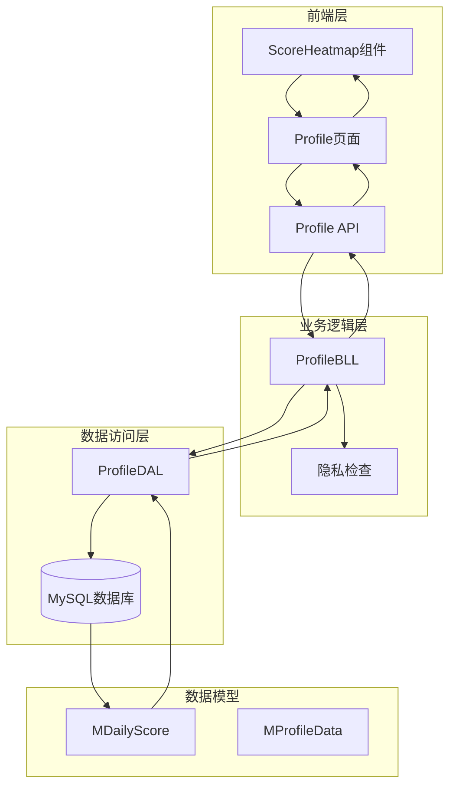
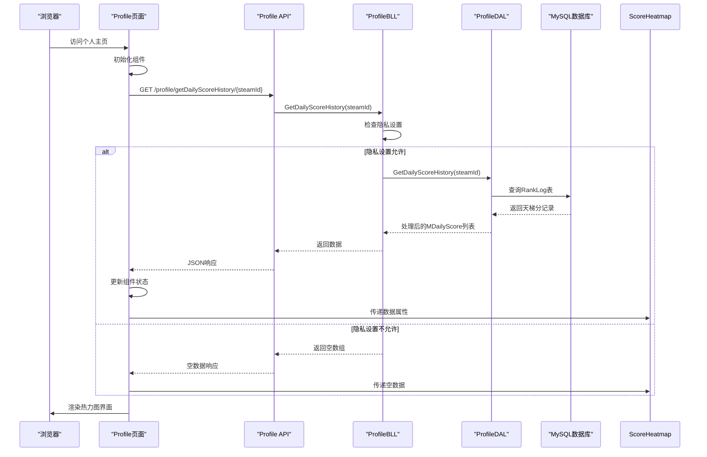
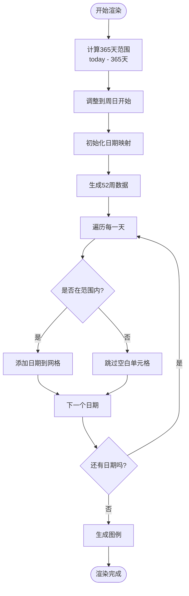
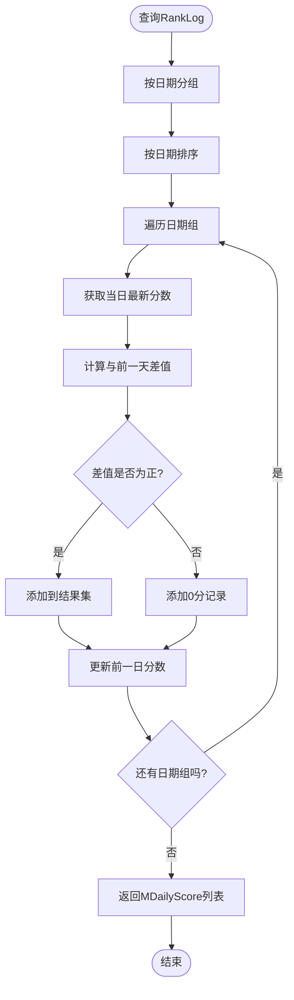
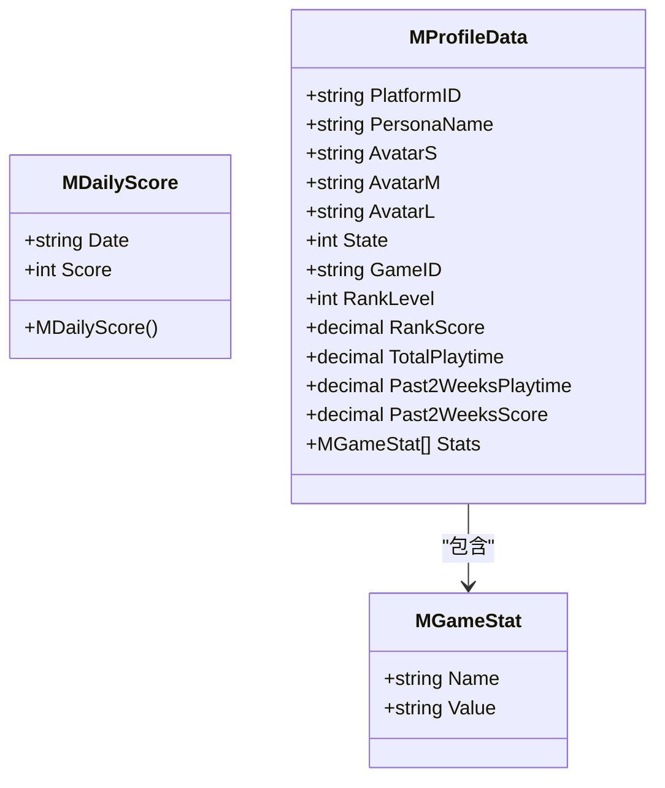
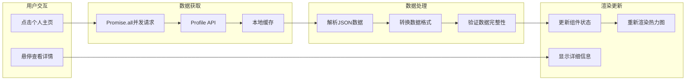
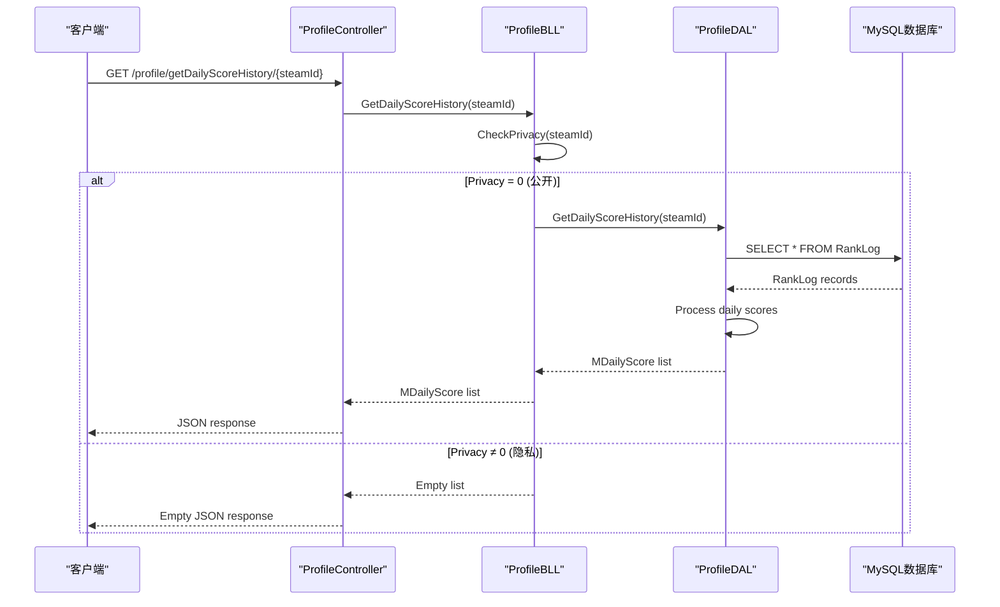
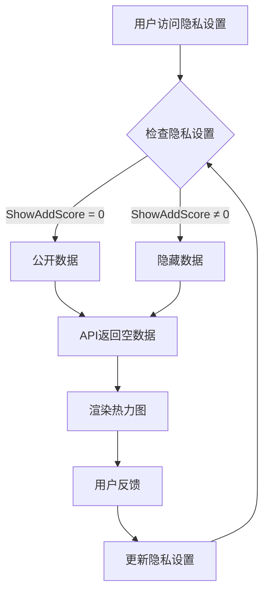

# Score Heatmap 功能文档

<cite>
**本文档引用的文件**
- [index.vue](file://SpeedRunners.UI/src/components/ScoreHeatmap/index.vue)
- [ProfileDAL.cs](file://SpeedRunners.API/SpeedRunners.DAL/ProfileDAL.cs)
- [ProfileBLL.cs](file://SpeedRunners.API/SpeedRunners.BLL/ProfileBLL.cs)
- [ProfileController.cs](file://SpeedRunners.API/SpeedRunners.Controllers/ProfileController.cs)
- [MDailyScore.cs](file://SpeedRunners.API/SpeedRunners.Model/Profile/MDailyScore.cs)
- [MProfileData.cs](file://SpeedRunners.API/SpeedRunners.Model/Profile/MProfileData.cs)
- [index.vue](file://SpeedRunners.UI/src/views/profile/index.vue)
- [profile.js](file://SpeedRunners.UI/src/api/profile.js)
- [privacySettings.vue](file://SpeedRunners.UI/src/views/other/privacySettings.vue)
</cite>

## 目录
1. [简介](#简介)
2. [项目结构](#项目结构)
3. [核心组件](#核心组件)
4. [架构概览](#架构概览)
5. [详细组件分析](#详细组件分析)
6. [数据流分析](#数据流分析)
7. [性能考虑](#性能考虑)
8. [隐私设置集成](#隐私设置集成)
9. [故障排除指南](#故障排除指南)
10. [总结](#总结)

## 简介

Score Heatmap（分数热力图）是SpeedRunnersLab项目中的一个核心功能模块，用于可视化展示玩家在SpeedRunners游戏中天梯分的增长情况。该功能通过颜色深浅直观地反映了玩家在一年时间范围内的活跃程度和进步轨迹，为玩家提供了清晰的个人成长记录。

该功能采用前后端分离的架构设计，前端使用Vue.js构建响应式的热力图界面，后端提供RESTful API接口，通过MySQL数据库存储和查询玩家的天梯分历史数据。

## 项目结构

Score Heatmap功能涉及多个层次的组件协作，形成了完整的数据处理链路：



**图表来源**
- [index.vue](file://SpeedRunners.UI/src/components/ScoreHeatmap/index.vue#L1-L362)
- [ProfileBLL.cs](file://SpeedRunners.API/SpeedRunners.BLL/ProfileBLL.cs#L1-L226)
- [ProfileDAL.cs](file://SpeedRunners.API/SpeedRunners.DAL/ProfileDAL.cs#L1-L126)

**章节来源**
- [index.vue](file://SpeedRunners.UI/src/components/ScoreHeatmap/index.vue#L1-L362)
- [ProfileBLL.cs](file://SpeedRunners.API/SpeedRunners.BLL/ProfileBLL.cs#L1-L226)
- [ProfileDAL.cs](file://SpeedRunners.API/SpeedRunners.DAL/ProfileDAL.cs#L1-L126)

## 核心组件

### 前端组件架构

Score Heatmap功能主要由以下核心组件构成：

#### ScoreHeatmap Vue组件
- **职责**：负责渲染热力图界面，处理用户交互
- **特性**：支持暗色/亮色主题切换，响应式布局，国际化支持
- **数据绑定**：接收每日分数数据，动态生成热力图网格

#### Profile页面集成
- **职责**：整合多个数据源，协调Score Heatmap组件
- **特性**：并发加载玩家数据、成就数据和热力图数据
- **用户体验**：骨架屏加载效果，错误处理机制

#### API层封装
- **职责**：提供统一的数据访问接口
- **特性**：RESTful设计，错误边界处理
- **安全性**：集成身份验证和授权机制

**章节来源**
- [index.vue](file://SpeedRunners.UI/src/components/ScoreHeatmap/index.vue#L81-L188)
- [index.vue](file://SpeedRunners.UI/src/views/profile/index.vue#L248-L430)
- [profile.js](file://SpeedRunners.UI/src/api/profile.js#L1-L25)

## 架构概览

Score Heatmap采用了典型的三层架构模式，确保了代码的可维护性和扩展性：



**图表来源**
- [ProfileController.cs](file://SpeedRunners.API/SpeedRunners.Controllers/ProfileController.cs#L24-L30)
- [ProfileBLL.cs](file://SpeedRunners.API/SpeedRunners.BLL/ProfileBLL.cs#L100-L110)
- [ProfileDAL.cs](file://SpeedRunners.API/SpeedRunners.DAL/ProfileDAL.cs#L63-L108)

## 详细组件分析

### ScoreHeatmap Vue组件详解

#### 数据结构设计
组件接收标准化的每日分数数据格式：
```javascript
// 输入数据格式
[
  { date: "2024-01-01", score: 150 },
  { date: "2024-01-02", score: 0 },
  { date: "2024-01-03", score: 200 }
]
```

#### 热力图网格生成算法



**图表来源**
- [index.vue](file://SpeedRunners.UI/src/components/ScoreHeatmap/index.vue#L100-L139)

#### 颜色分级系统

热力图采用五级颜色分级，直观反映分数增长情况：

| 分级 | 分数范围 | 颜色 | 说明 |
|------|----------|------|------|
| Level 0 | ≤ 0 | 深灰色 | 无分数增长或负增长 |
| Level 1 | 0 < score < 50 | 浅蓝色 | 微量增长 |
| Level 2 | 50 ≤ score < 500 | 中蓝色 | 中等增长 |
| Level 3 | 500 ≤ score < 1000 | 深蓝色 | 较大增长 |
| Level 4 | ≥ 1000 | 青色发光 | 大幅增长 |

#### 国际化支持

组件支持中英文双语显示，包括：
- 月份标签本地化
- 星期标签本地化  
- 提示信息本地化
- 数字格式本地化

**章节来源**
- [index.vue](file://SpeedRunners.UI/src/components/ScoreHeatmap/index.vue#L85-L187)

### 后端数据处理流程

#### 数据聚合算法

后端通过复杂的SQL查询和C#逻辑实现数据聚合：



**图表来源**
- [ProfileDAL.cs](file://SpeedRunners.API/SpeedRunners.DAL/ProfileDAL.cs#L82-L105)

#### 隐私保护机制

系统实现了多层次的隐私保护：
- 用户可选择公开或隐藏天梯分增长数据
- 系统默认公开，用户可随时修改设置
- 隐私设置影响API响应数据

**章节来源**
- [ProfileDAL.cs](file://SpeedRunners.API/SpeedRunners.DAL/ProfileDAL.cs#L113-L123)
- [ProfileBLL.cs](file://SpeedRunners.API/SpeedRunners.BLL/ProfileBLL.cs#L102-L110)

### 数据模型设计

#### MDailyScore数据模型



**图表来源**
- [MDailyScore.cs](file://SpeedRunners.API/SpeedRunners.Model/Profile/MDailyScore.cs#L8-L19)
- [MProfileData.cs](file://SpeedRunners.API/SpeedRunners.Model/Profile/MProfileData.cs#L9-L56)

**章节来源**
- [MDailyScore.cs](file://SpeedRunners.API/SpeedRunners.Model/Profile/MDailyScore.cs#L1-L20)
- [MProfileData.cs](file://SpeedRunners.API/SpeedRunners.Model/Profile/MProfileData.cs#L1-L67)

## 数据流分析

### 前端数据流



**图表来源**
- [index.vue](file://SpeedRunners.UI/src/views/profile/index.vue#L375-L389)
- [profile.js](file://SpeedRunners.UI/src/api/profile.js#L1-L25)

### 后端数据流



**图表来源**
- [ProfileController.cs](file://SpeedRunners.API/SpeedRunners.Controllers/ProfileController.cs#L24-L30)
- [ProfileBLL.cs](file://SpeedRunners.API/SpeedRunners.BLL/ProfileBLL.cs#L100-L110)
- [ProfileDAL.cs](file://SpeedRunners.API/SpeedRunners.DAL/ProfileDAL.cs#L63-L108)

**章节来源**
- [index.vue](file://SpeedRunners.UI/src/views/profile/index.vue#L375-L389)
- [ProfileController.cs](file://SpeedRunners.API/SpeedRunners.Controllers/ProfileController.cs#L1-L40)

## 性能考虑

### 前端性能优化

#### 内存管理
- 使用虚拟滚动避免大量DOM节点创建
- 合理的组件生命周期管理
- 图片懒加载和缓存策略

#### 渲染优化
- 避免不必要的重新渲染
- 使用计算属性缓存复杂数据
- 合理的事件处理程序绑定

### 后端性能优化

#### 数据库优化
- RankLog表建立合适的索引
- 限制查询范围（365天）
- 使用GROUP BY和ORDER BY优化

#### 缓存策略
- Redis缓存热门数据
- 结果集缓存
- 配置合理的缓存过期时间

### 网络优化

#### 请求合并
- 使用Promise.all并发请求
- 减少HTTP请求次数
- 合理的超时和重试机制

## 隐私设置集成

### 隐私控制机制

系统提供了完善的隐私控制功能，用户可以精确控制自己的数据可见性：



**图表来源**
- [ProfileDAL.cs](file://SpeedRunners.API/SpeedRunners.DAL/ProfileDAL.cs#L113-L123)
- [ProfileBLL.cs](file://SpeedRunners.API/SpeedRunners.BLL/ProfileBLL.cs#L102-L110)

### 隐私设置选项

| 设置项 | 默认值 | 说明 | 对热力图的影响 |
|--------|--------|------|----------------|
| Publish State | -1 | 发布状态 | 不影响 |
| Publish Playtime | 0 | 发布游戏时长 | 不影响 |
| Allow Get Rank Data | 0 | 允许获取天梯数据 | 不影响 |
| Publish Add Score | 0 | 发布新增分数 | 直接影响 |
| Publish Total Score | 2 | 发布总分数 | 不影响 |

**章节来源**
- [privacySettings.vue](file://SpeedRunners.UI/src/views/other/privacySettings.vue#L1-L169)

## 故障排除指南

### 常见问题及解决方案

#### 热力图显示异常
**症状**：热力图不显示或显示为空白
**可能原因**：
- 用户隐私设置为隐藏
- 数据库中没有历史记录
- 网络请求失败

**解决方法**：
1. 检查用户隐私设置
2. 验证数据库连接
3. 查看浏览器开发者工具中的网络请求

#### 数据不准确
**症状**：显示的分数与预期不符
**可能原因**：
- 数据聚合算法错误
- 时间区域设置问题
- 数据库查询条件错误

**解决方法**：
1. 检查SQL查询逻辑
2. 验证时间转换逻辑
3. 确认数据类型转换

#### 性能问题
**症状**：页面加载缓慢或卡顿
**可能原因**：
- 数据量过大
- 渲染优化不足
- 网络延迟

**解决方法**：
1. 实施数据分页
2. 优化前端渲染
3. 添加缓存机制

**章节来源**
- [ProfileDAL.cs](file://SpeedRunners.API/SpeedRunners.DAL/ProfileDAL.cs#L63-L108)
- [index.vue](file://SpeedRunners.UI/src/components/ScoreHeatmap/index.vue#L100-L139)

## 总结

Score Heatmap功能作为SpeedRunnersLab项目的重要组成部分，展现了现代Web应用的优秀实践。该功能通过精心设计的架构和实现，为用户提供了直观、美观且功能丰富的数据可视化体验。

### 技术亮点

1. **前后端分离架构**：清晰的职责划分，便于维护和扩展
2. **响应式设计**：适配各种设备和屏幕尺寸
3. **国际化支持**：完整的中英文本地化
4. **隐私保护**：多层次的用户数据保护机制
5. **性能优化**：合理的缓存和渲染策略

### 设计优势

- **可扩展性**：模块化设计便于功能扩展
- **可维护性**：清晰的代码结构和文档
- **用户体验**：流畅的交互和友好的界面
- **数据准确性**：严谨的数据处理和验证机制

该功能不仅满足了当前的需求，还为未来的功能扩展奠定了坚实的基础，是SpeedRunnersLab项目中值得借鉴的优秀实现案例。