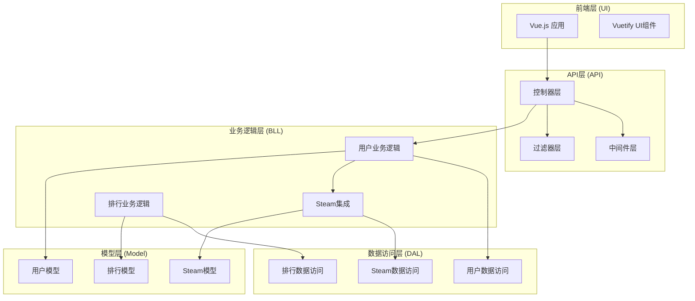
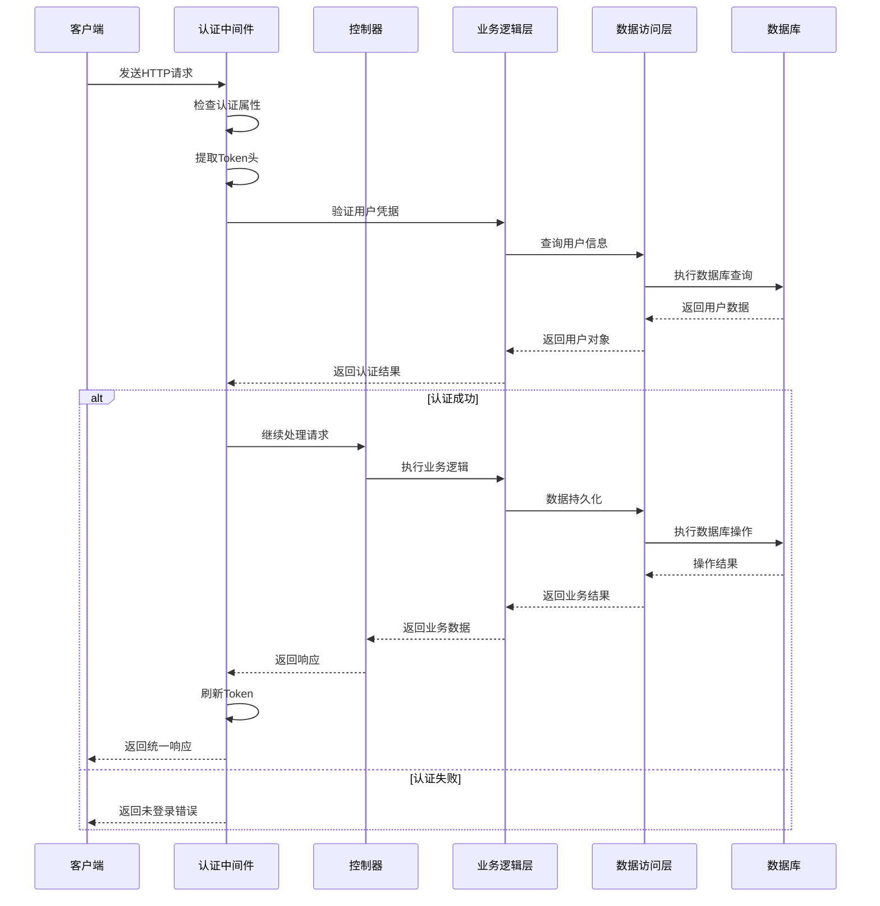
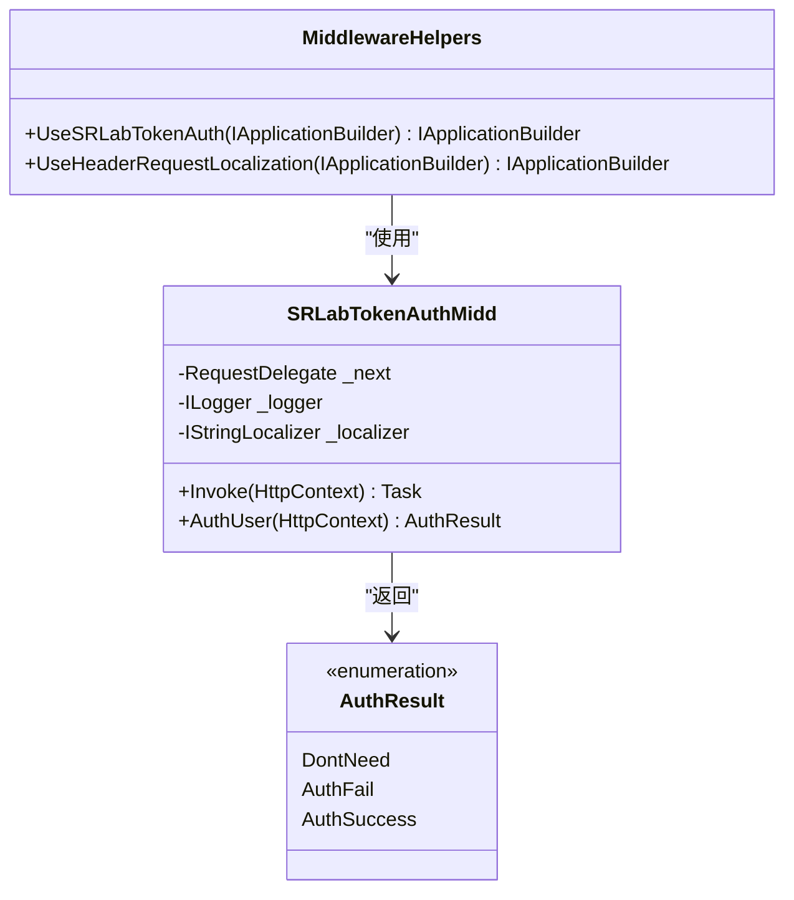
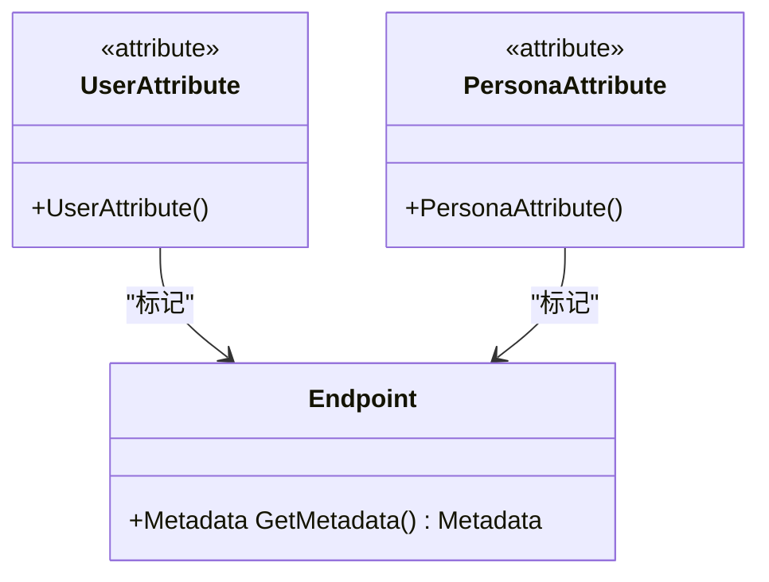
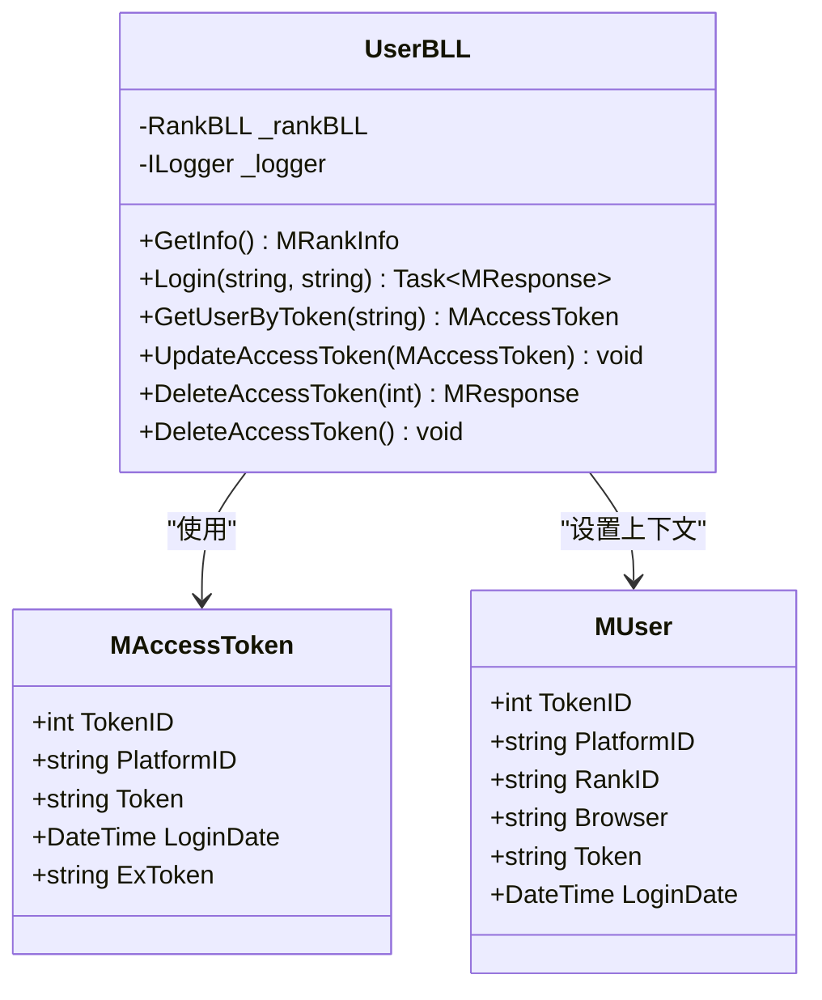
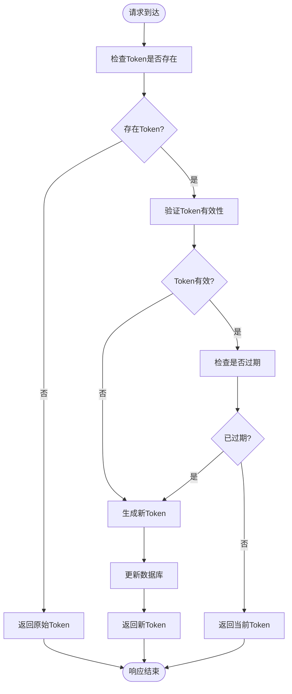
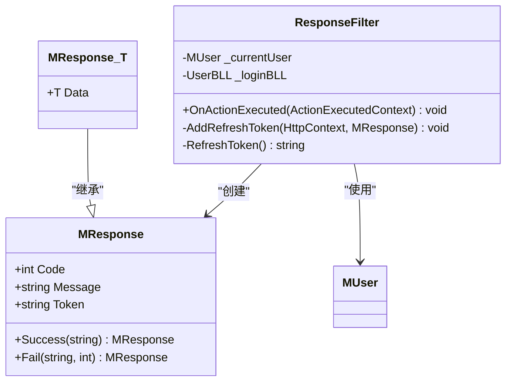
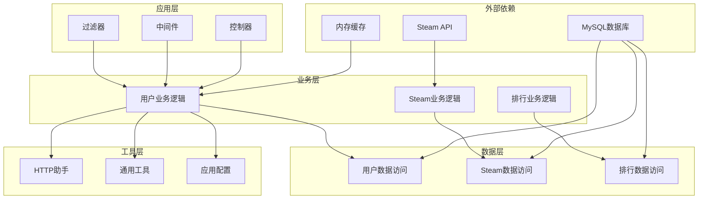

# 验证系统

<cite>
**本文档引用的文件**
- [Program.cs](file://SpeedRunners.API/SpeedRunners/Program.cs)
- [Startup.cs](file://SpeedRunners.API/SpeedRunners/Startup.cs)
- [SRLabTokenAuthMidd.cs](file://SpeedRunners.API/SpeedRunners/Middleware/SRLabTokenAuthMidd.cs)
- [MiddlewareHelpers.cs](file://SpeedRunners.API/SpeedRunners/Middleware/MiddlewareHelpers.cs)
- [UserAttribute.cs](file://SpeedRunners.API/SpeedRunners.Model/UserAttribute.cs)
- [PersonaAttribute.cs](file://SpeedRunners.API/SpeedRunners.Model/PersonaAttribute.cs)
- [MUser.cs](file://SpeedRunners.API/SpeedRunners.Model/MUser.cs)
- [UserBLL.cs](file://SpeedRunners.API/SpeedRunners.BLL/UserBLL.cs)
- [UserController.cs](file://SpeedRunners.API/SpeedRunners/Controllers/UserController.cs)
- [GlobalExceptionsFilter.cs](file://SpeedRunners.API/SpeedRunners/Filter/GlobalExceptionsFilter.cs)
- [ResponseFilter.cs](file://SpeedRunners.API/SpeedRunners/Filter/ResponseFilter.cs)
- [MResponse.cs](file://SpeedRunners.API/SpeedRunners.Model/MResponse.cs)
- [ServiceHelper.cs](file://SpeedRunners.API/SpeedRunners/Service/ServiceHelper.cs)
- [AppSettings.cs](file://SpeedRunners.API/SpeedRunners.Utils/AppSettings.cs)
</cite>

## 目录
1. [简介](#简介)
2. [项目结构](#项目结构)
3. [核心组件](#核心组件)
4. [架构概览](#架构概览)
5. [详细组件分析](#详细组件分析)
6. [依赖关系分析](#依赖关系分析)
7. [性能考虑](#性能考虑)
8. [故障排除指南](#故障排除指南)
9. [结论](#结论)

## 简介

SpeedRunnersLab项目是一个基于ASP.NET Core构建的Web应用程序，主要功能是为游戏SpeedRunners提供数据展示、MOD管理、排行榜等功能。该项目采用了现代化的技术栈：Vuetify + vue-admin-template + ASP.NET Core + Steam开放API。

验证系统是整个应用的核心安全机制，负责用户身份认证、权限控制和会话管理。该系统通过自定义中间件实现，结合属性标记和业务逻辑层，提供了完整的用户验证解决方案。

## 项目结构

项目采用典型的三层架构设计，包含以下主要模块：

**图表来源**
- [Program.cs](file://SpeedRunners.API/SpeedRunners/Program.cs#L1-L33)
- [Startup.cs](file://SpeedRunners.API/SpeedRunners/Startup.cs#L1-L91)

**章节来源**
- [Program.cs](file://SpeedRunners.API/SpeedRunners/Program.cs#L1-L33)
- [Startup.cs](file://SpeedRunners.API/SpeedRunners/Startup.cs#L1-L91)

## 核心组件

验证系统由多个核心组件协同工作，形成完整的认证流程：

### 1. 中间件层
- **SRLabTokenAuthMidd**: 自定义认证中间件，处理用户身份验证
- **MiddlewareHelpers**: 中间件扩展方法，提供便捷的中间件调用

### 2. 属性标记系统
- **UserAttribute**: 标记需要用户认证的接口
- **PersonaAttribute**: 标记返回个性化数据的接口

### 3. 业务逻辑层
- **UserBLL**: 用户认证和会话管理的核心业务逻辑
- **MUser**: 当前用户上下文信息载体

### 4. 响应处理层
- **ResponseFilter**: 统一响应格式和Token刷新
- **GlobalExceptionsFilter**: 全局异常处理

**章节来源**
- [SRLabTokenAuthMidd.cs](file://SpeedRunners.API/SpeedRunners/Middleware/SRLabTokenAuthMidd.cs#L1-L123)
- [UserAttribute.cs](file://SpeedRunners.API/SpeedRunners.Model/UserAttribute.cs#L1-L13)
- [PersonaAttribute.cs](file://SpeedRunners.API/SpeedRunners.Model/PersonaAttribute.cs#L1-L13)
- [MUser.cs](file://SpeedRunners.API/SpeedRunners.Model/MUser.cs#L1-L35)
- [UserBLL.cs](file://SpeedRunners.API/SpeedRunners.BLL/UserBLL.cs#L1-L153)
- [ResponseFilter.cs](file://SpeedRunners.API/SpeedRunners/Filter/ResponseFilter.cs#L1-L114)
- [GlobalExceptionsFilter.cs](file://SpeedRunners.API/SpeedRunners/Filter/GlobalExceptionsFilter.cs#L1-L54)

## 架构概览

验证系统的整体架构采用中间件管道模式，通过HTTP请求管道实现用户认证和授权控制：

**图表来源**
- [SRLabTokenAuthMidd.cs](file://SpeedRunners.API/SpeedRunners/Middleware/SRLabTokenAuthMidd.cs#L31-L47)
- [UserBLL.cs](file://SpeedRunners.API/SpeedRunners.BLL/UserBLL.cs#L95-L111)
- [ResponseFilter.cs](file://SpeedRunners.API/SpeedRunners/Filter/ResponseFilter.cs#L57-L83)

## 详细组件分析

### 认证中间件分析

认证中间件是验证系统的核心组件，负责拦截HTTP请求并执行用户身份验证：

**图表来源**
- [SRLabTokenAuthMidd.cs](file://SpeedRunners.API/SpeedRunners/Middleware/SRLabTokenAuthMidd.cs#L18-L102)
- [MiddlewareHelpers.cs](file://SpeedRunners.API/SpeedRunners/Middleware/MiddlewareHelpers.cs#L16-L19)

认证流程的关键步骤包括：
1. **属性检查**: 通过Endpoint元数据检查UserAttribute和PersonaAttribute标记
2. **Token提取**: 从HTTP头部提取srlab-token
3. **用户验证**: 调用UserBLL.GetUserByToken进行用户验证
4. **上下文设置**: 将用户信息注入MUser上下文
5. **结果处理**: 根据认证结果决定继续处理或返回错误

**章节来源**
- [SRLabTokenAuthMidd.cs](file://SpeedRunners.API/SpeedRunners/Middleware/SRLabTokenAuthMidd.cs#L31-L101)

### 属性标记系统

属性标记系统提供了灵活的接口访问控制机制：

**图表来源**
- [UserAttribute.cs](file://SpeedRunners.API/SpeedRunners.Model/UserAttribute.cs#L9-L11)
- [PersonaAttribute.cs](file://SpeedRunners.API/SpeedRunners.Model/PersonaAttribute.cs#L9-L11)

**章节来源**
- [UserAttribute.cs](file://SpeedRunners.API/SpeedRunners.Model/UserAttribute.cs#L1-L13)
- [PersonaAttribute.cs](file://SpeedRunners.API/SpeedRunners.Model/PersonaAttribute.cs#L1-L13)

### 用户业务逻辑层

UserBLL作为认证系统的核心业务逻辑组件，负责用户相关的所有操作：

**图表来源**
- [UserBLL.cs](file://SpeedRunners.API/SpeedRunners.BLL/UserBLL.cs#L16-L24)
- [MUser.cs](file://SpeedRunners.API/SpeedRunners.Model/MUser.cs#L8-L34)

**章节来源**
- [UserBLL.cs](file://SpeedRunners.API/SpeedRunners.BLL/UserBLL.cs#L1-L153)
- [MUser.cs](file://SpeedRunners.API/SpeedRunners.Model/MUser.cs#L1-L35)

### Token管理系统

Token管理系统实现了安全的会话管理和自动刷新机制：

**图表来源**
- [ResponseFilter.cs](file://SpeedRunners.API/SpeedRunners/Filter/ResponseFilter.cs#L90-L111)
- [UserBLL.cs](file://SpeedRunners.API/SpeedRunners.BLL/UserBLL.cs#L95-L111)

**章节来源**
- [ResponseFilter.cs](file://SpeedRunners.API/SpeedRunners/Filter/ResponseFilter.cs#L57-L111)
- [AppSettings.cs](file://SpeedRunners.API/SpeedRunners.Utils/AppSettings.cs#L16-L19)

### 统一响应处理

统一响应处理确保了所有API响应的一致性和标准化：

**图表来源**
- [MResponse.cs](file://SpeedRunners.API/SpeedRunners.Model/MResponse.cs#L3-L27)
- [ResponseFilter.cs](file://SpeedRunners.API/SpeedRunners/Filter/ResponseFilter.cs#L14-L22)

**章节来源**
- [MResponse.cs](file://SpeedRunners.API/SpeedRunners.Model/MResponse.cs#L1-L42)
- [ResponseFilter.cs](file://SpeedRunners.API/SpeedRunners/Filter/ResponseFilter.cs#L1-L114)

## 依赖关系分析

验证系统的依赖关系呈现清晰的分层结构，各层之间通过接口和抽象类进行解耦：

**图表来源**
- [Startup.cs](file://SpeedRunners.API/SpeedRunners/Startup.cs#L52-L56)
- [ServiceHelper.cs](file://SpeedRunners.API/SpeedRunners/Service/ServiceHelper.cs#L14-L24)

**章节来源**
- [Startup.cs](file://SpeedRunners.API/SpeedRunners/Startup.cs#L34-L66)
- [ServiceHelper.cs](file://SpeedRunners.API/SpeedRunners/Service/ServiceHelper.cs#L1-L27)

## 性能考虑

验证系统在设计时充分考虑了性能优化：

### 1. 缓存策略
- 内存缓存用于存储Steam成就定义，减少重复查询
- Token过期时间配置，平衡安全性与性能

### 2. 异步处理
- 所有网络请求采用异步模式，避免阻塞线程
- 数据库操作使用异步方法

### 3. 连接池管理
- 合理配置数据库连接池大小
- HTTP客户端连接复用

### 4. 中间件优化
- 中间件按需执行，避免不必要的处理
- 属性检查快速失败机制

## 故障排除指南

### 常见问题及解决方案

#### 1. 认证失败问题
**症状**: 用户无法登录或Token验证失败
**可能原因**:
- Token过期或无效
- Steam OpenID验证失败
- 数据库连接问题

**解决步骤**:
1. 检查Token是否在有效期内
2. 验证Steam API连接状态
3. 查看数据库连接日志

#### 2. 响应格式异常
**症状**: API响应格式不符合预期
**可能原因**:
- ResponseFilter配置错误
- MResponse序列化问题

**解决步骤**:
1. 检查ResponseFilter的配置
2. 验证MResponse的序列化设置

#### 3. 中间件执行顺序问题
**症状**: 认证中间件未按预期执行
**可能原因**:
- 中间件注册顺序错误
- Endpoint路由配置问题

**解决步骤**:
1. 检查Startup.cs中的中间件注册顺序
2. 验证路由配置

**章节来源**
- [GlobalExceptionsFilter.cs](file://SpeedRunners.API/SpeedRunners/Filter/GlobalExceptionsFilter.cs#L31-L51)
- [ResponseFilter.cs](file://SpeedRunners.API/SpeedRunners/Filter/ResponseFilter.cs#L24-L50)

## 结论

SpeedRunnersLab项目的验证系统展现了现代Web应用的安全架构设计。通过自定义中间件、属性标记系统和统一响应处理机制，实现了完整而灵活的用户认证和授权控制。

系统的主要优势包括：
1. **模块化设计**: 清晰的分层架构便于维护和扩展
2. **安全性**: 多层次的认证和授权机制
3. **可扩展性**: 基于接口的设计支持功能扩展
4. **性能优化**: 缓存策略和异步处理提升系统性能

验证系统为整个SpeedRunnersLab平台提供了坚实的安全基础，支持用户管理、数据访问控制和个性化服务等功能。通过持续的优化和改进，该系统能够满足不断增长的业务需求。