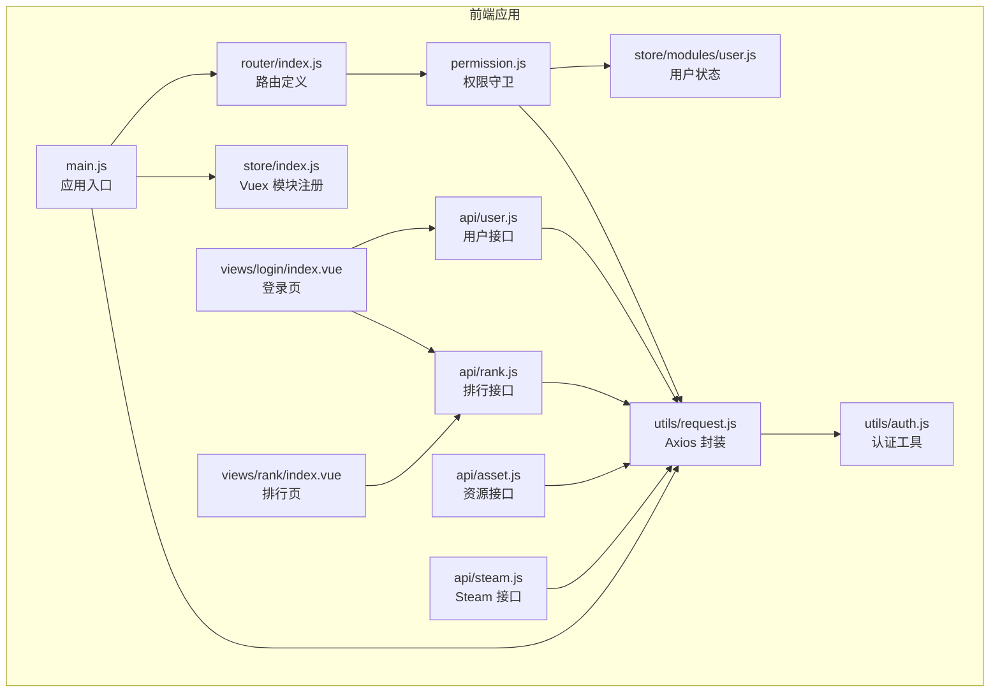
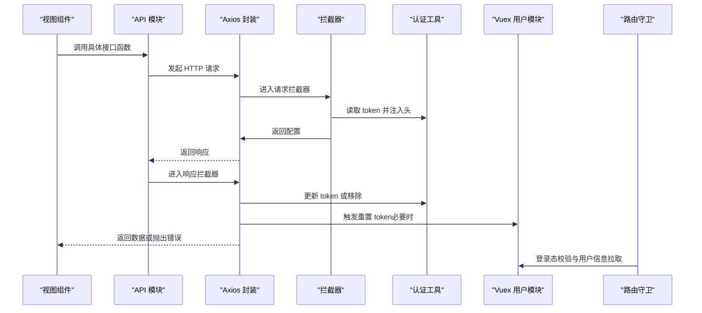
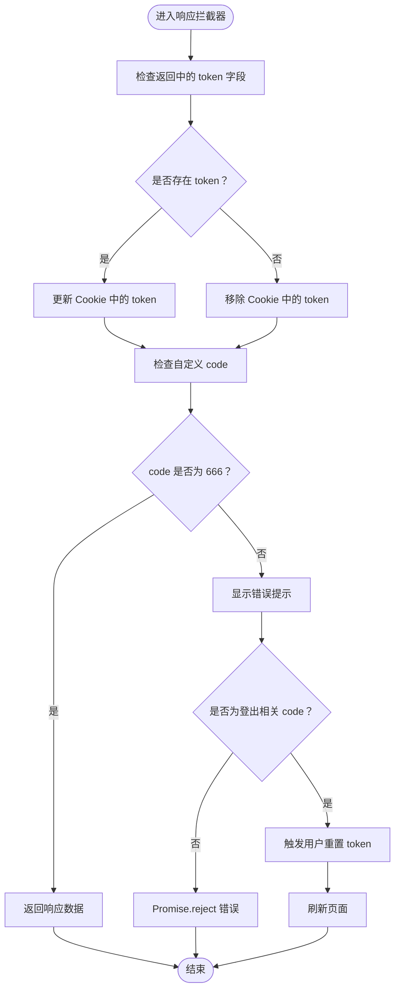
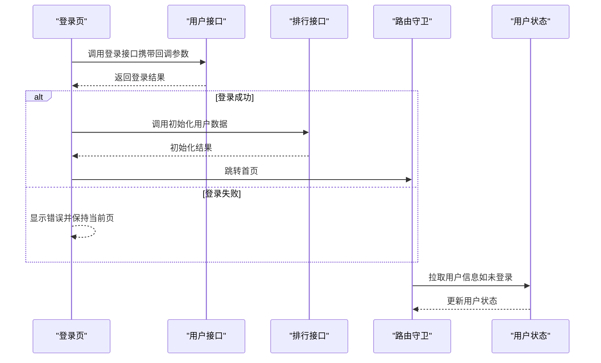
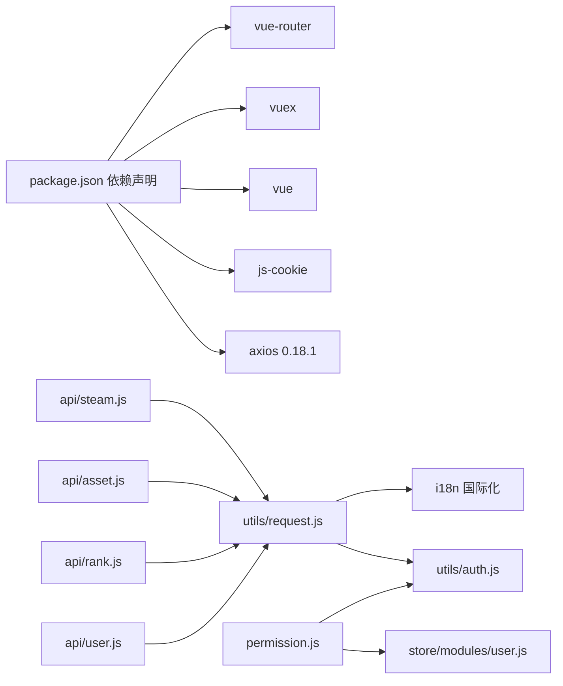

# API 集成

<cite>
**本文引用的文件**
- [SpeedRunners.UI/src/api/user.js](file://SpeedRunners.UI/src/api/user.js)
- [SpeedRunners.UI/src/api/rank.js](file://SpeedRunners.UI/src/api/rank.js)
- [SpeedRunners.UI/src/api/asset.js](file://SpeedRunners.UI/src/api/asset.js)
- [SpeedRunners.UI/src/api/steam.js](file://SpeedRunners.UI/src/api/steam.js)
- [SpeedRunners.UI/src/utils/request.js](file://SpeedRunners.UI/src/utils/request.js)
- [SpeedRunners.UI/src/utils/auth.js](file://SpeedRunners.UI/src/utils/auth.js)
- [SpeedRunners.UI/src/store/modules/user.js](file://SpeedRunners.UI/src/store/modules/user.js)
- [SpeedRunners.UI/src/store/index.js](file://SpeedRunners.UI/src/store/index.js)
- [SpeedRunners.UI/src/permission.js](file://SpeedRunners.UI/src/permission.js)
- [SpeedRunners.UI/src/router/index.js](file://SpeedRunners.UI/src/router/index.js)
- [SpeedRunners.UI/src/views/login/index.vue](file://SpeedRunners.UI/src/views/login/index.vue)
- [SpeedRunners.UI/src/views/rank/index.vue](file://SpeedRunners.UI/src/views/rank/index.vue)
- [SpeedRunners.UI/package.json](file://SpeedRunners.UI/package.json)
- [SpeedRunners.UI/.env.development](file://SpeedRunners.UI/.env.development)
- [SpeedRunners.UI/src/main.js](file://SpeedRunners.UI/src/main.js)
</cite>

## 目录
1. [简介](#简介)
2. [项目结构](#项目结构)
3. [核心组件](#核心组件)
4. [架构总览](#架构总览)
5. [详细组件分析](#详细组件分析)
6. [依赖关系分析](#依赖关系分析)
7. [性能考虑](#性能考虑)
8. [故障排查指南](#故障排查指南)
9. [结论](#结论)
10. [附录](#附录)

## 简介
本文件面向 SpeedRunnersLab 前端的 API 集成，围绕基于 axios 0.18.1 的 HTTP 请求封装与调用机制展开，系统性梳理以下内容：
- API 接口模块：user.js、rank.js、asset.js、steam.js 的职责与实现
- 请求/响应拦截器：token 注入、错误处理、国际化头设置
- 认证与会话：登录流程、token 存取、自动登出与重定向
- 数据校验与格式化：后端返回结构约定与前端处理策略
- 错误处理与异常捕获：统一错误提示与自动登出逻辑
- 调试与测试：开发环境配置、调试方法与测试建议
- 接口文档与调用示例：按模块给出接口清单与调用路径

## 项目结构
前端位于 SpeedRunners.UI，API 封装与调用集中在 utils/request.js，并通过各业务模块导出具体接口；认证与状态管理由 utils/auth.js 与 store/modules/user.js 协同完成；路由与权限守卫在 permission.js 中实现。

**图表来源**
- [SpeedRunners.UI/src/main.js](file://SpeedRunners.UI/src/main.js#L1-L30)
- [SpeedRunners.UI/src/router/index.js](file://SpeedRunners.UI/src/router/index.js#L1-L133)
- [SpeedRunners.UI/src/permission.js](file://SpeedRunners.UI/src/permission.js#L1-L69)
- [SpeedRunners.UI/src/store/index.js](file://SpeedRunners.UI/src/store/index.js#L1-L25)
- [SpeedRunners.UI/src/store/modules/user.js](file://SpeedRunners.UI/src/store/modules/user.js#L1-L88)
- [SpeedRunners.UI/src/utils/request.js](file://SpeedRunners.UI/src/utils/request.js#L1-L82)
- [SpeedRunners.UI/src/utils/auth.js](file://SpeedRunners.UI/src/utils/auth.js#L1-L45)
- [SpeedRunners.UI/src/api/user.js](file://SpeedRunners.UI/src/api/user.js#L1-L77)
- [SpeedRunners.UI/src/api/rank.js](file://SpeedRunners.UI/src/api/rank.js#L1-L64)
- [SpeedRunners.UI/src/api/asset.js](file://SpeedRunners.UI/src/api/asset.js#L1-L54)
- [SpeedRunners.UI/src/api/steam.js](file://SpeedRunners.UI/src/api/steam.js#L1-L36)
- [SpeedRunners.UI/src/views/login/index.vue](file://SpeedRunners.UI/src/views/login/index.vue#L1-L97)
- [SpeedRunners.UI/src/views/rank/index.vue](file://SpeedRunners.UI/src/views/rank/index.vue#L1-L309)

**章节来源**
- [SpeedRunners.UI/src/main.js](file://SpeedRunners.UI/src/main.js#L1-L30)
- [SpeedRunners.UI/src/router/index.js](file://SpeedRunners.UI/src/router/index.js#L1-L133)
- [SpeedRunners.UI/src/permission.js](file://SpeedRunners.UI/src/permission.js#L1-L69)
- [SpeedRunners.UI/src/store/index.js](file://SpeedRunners.UI/src/store/index.js#L1-L25)

## 核心组件
- Axios 封装（utils/request.js）
  - 创建实例：设置基础 URL 与超时
  - 请求拦截器：注入 locale 与 srlab-token 头
  - 响应拦截器：更新 token、按自定义 code 判定错误、触发自动登出、统一错误提示
- 认证工具（utils/auth.js）
  - token 读取/写入/移除（Cookie）
  - 登录跳转（Steam OpenID）
  - 国家检测（网络可达性探测）
- 用户状态（store/modules/user.js）
  - 获取用户信息、本地登出、重置状态
- 权限与路由（permission.js、router/index.js）
  - 路由守卫：登录态校验、动态加载权限路由、用户信息拉取
- 业务 API 模块
  - user.js：用户信息、登录、登出、隐私与偏好设置
  - rank.js：排行列表、异步数据、图表与参与状态
  - asset.js：上传凭证、下载地址、MOD 管理
  - steam.js：玩家搜索、在线人数等

**章节来源**
- [SpeedRunners.UI/src/utils/request.js](file://SpeedRunners.UI/src/utils/request.js#L1-L82)
- [SpeedRunners.UI/src/utils/auth.js](file://SpeedRunners.UI/src/utils/auth.js#L1-L45)
- [SpeedRunners.UI/src/store/modules/user.js](file://SpeedRunners.UI/src/store/modules/user.js#L1-L88)
- [SpeedRunners.UI/src/permission.js](file://SpeedRunners.UI/src/permission.js#L1-L69)
- [SpeedRunners.UI/src/router/index.js](file://SpeedRunners.UI/src/router/index.js#L1-L133)
- [SpeedRunners.UI/src/api/user.js](file://SpeedRunners.UI/src/api/user.js#L1-L77)
- [SpeedRunners.UI/src/api/rank.js](file://SpeedRunners.UI/src/api/rank.js#L1-L64)
- [SpeedRunners.UI/src/api/asset.js](file://SpeedRunners.UI/src/api/asset.js#L1-L54)
- [SpeedRunners.UI/src/api/steam.js](file://SpeedRunners.UI/src/api/steam.js#L1-L36)

## 架构总览
下图展示从前端调用到后端服务的整体链路，以及拦截器与认证在其中的作用。

**图表来源**
- [SpeedRunners.UI/src/api/user.js](file://SpeedRunners.UI/src/api/user.js#L1-L77)
- [SpeedRunners.UI/src/api/rank.js](file://SpeedRunners.UI/src/api/rank.js#L1-L64)
- [SpeedRunners.UI/src/api/asset.js](file://SpeedRunners.UI/src/api/asset.js#L1-L54)
- [SpeedRunners.UI/src/api/steam.js](file://SpeedRunners.UI/src/api/steam.js#L1-L36)
- [SpeedRunners.UI/src/utils/request.js](file://SpeedRunners.UI/src/utils/request.js#L1-L82)
- [SpeedRunners.UI/src/utils/auth.js](file://SpeedRunners.UI/src/utils/auth.js#L1-L45)
- [SpeedRunners.UI/src/store/modules/user.js](file://SpeedRunners.UI/src/store/modules/user.js#L1-L88)
- [SpeedRunners.UI/src/permission.js](file://SpeedRunners.UI/src/permission.js#L1-L69)

## 详细组件分析

### Axios 封装与拦截器
- 实例配置
  - 基础 URL：来自环境变量 VUE_APP_BASE_API
  - 超时：30 秒
- 请求拦截器
  - 设置 locale 头
  - 若存在 token，则附加 srlab-token 头
- 响应拦截器
  - 更新 token（若返回中包含 token）
  - 自定义 code 非 666 视为错误，统一 toast 提示
  - 特定 code 触发用户 token 重置与页面刷新
  - 网络错误统一 toast 提示并 reject

**图表来源**
- [SpeedRunners.UI/src/utils/request.js](file://SpeedRunners.UI/src/utils/request.js#L32-L80)

**章节来源**
- [SpeedRunners.UI/src/utils/request.js](file://SpeedRunners.UI/src/utils/request.js#L1-L82)
- [SpeedRunners.UI/.env.development](file://SpeedRunners.UI/.env.development#L1-L15)

### 认证机制与登录流程
- 登录跳转
  - 使用 Steam OpenID 进行登录，回调至前端登录页
  - 登录页接收参数后调用后端登录接口
- 登录成功后初始化用户数据
  - 登录成功后调用初始化接口，随后跳转首页
- 登录态校验
  - 路由守卫在首次访问时拉取用户信息
  - 若无 token 或拉取失败，重置用户状态并允许继续访问
- token 存取
  - 通过 Cookie 存储与读取 token
  - 支持移除 token 用于登出

**图表来源**
- [SpeedRunners.UI/src/views/login/index.vue](file://SpeedRunners.UI/src/views/login/index.vue#L66-L97)
- [SpeedRunners.UI/src/api/user.js](file://SpeedRunners.UI/src/api/user.js#L10-L16)
- [SpeedRunners.UI/src/api/rank.js](file://SpeedRunners.UI/src/api/rank.js#L17-L22)
- [SpeedRunners.UI/src/permission.js](file://SpeedRunners.UI/src/permission.js#L34-L58)
- [SpeedRunners.UI/src/store/modules/user.js](file://SpeedRunners.UI/src/store/modules/user.js#L37-L60)

**章节来源**
- [SpeedRunners.UI/src/utils/auth.js](file://SpeedRunners.UI/src/utils/auth.js#L18-L22)
- [SpeedRunners.UI/src/views/login/index.vue](file://SpeedRunners.UI/src/views/login/index.vue#L1-L97)
- [SpeedRunners.UI/src/permission.js](file://SpeedRunners.UI/src/permission.js#L1-L69)
- [SpeedRunners.UI/src/store/modules/user.js](file://SpeedRunners.UI/src/store/modules/user.js#L1-L88)

### 用户模块 API（user.js）
- 接口清单
  - 获取用户信息
  - 登录（携带查询参数）
  - 退出其他设备登录
  - 本地登出
  - 获取隐私设置
  - 设置状态、排行类型、周游玩时间可见性、请求排行数据、加分可见性

- 设计要点
  - 所有接口均通过 utils/request.js 发起
  - 参数与返回遵循后端约定的结构

**章节来源**
- [SpeedRunners.UI/src/api/user.js](file://SpeedRunners.UI/src/api/user.js#L1-L77)

### 排行模块 API（rank.js）
- 接口清单
  - 获取排行列表
  - 异步同步 SR 数据
  - 初始化用户数据
  - 获取游玩 SR 列表
  - 获取新增分数图表
  - 获取小时分布图表
  - 获取赞助信息
  - 更新参与状态
  - 获取参与列表

- 设计要点
  - 部分接口采用路径参数拼接
  - 图表类接口用于前端可视化渲染

**章节来源**
- [SpeedRunners.UI/src/api/rank.js](file://SpeedRunners.UI/src/api/rank.js#L1-L64)

### 资源模块 API（asset.js）
- 接口清单
  - 获取上传凭证
  - 获取下载地址
  - 获取 MOD 详情
  - 获取 MOD 列表（POST）
  - 新增 MOD
  - 删除 MOD
  - 操作 MOD 星标
  - 获取爱发电赞助信息

- 设计要点
  - 上传/下载与第三方对象存储集成
  - MOD 管理采用分页与星标操作

**章节来源**
- [SpeedRunners.UI/src/api/asset.js](file://SpeedRunners.UI/src/api/asset.js#L1-L54)

### Steam 模块 API（steam.js）
- 接口清单
  - 关键词搜索玩家
  - 通过用户名/会话/页码获取玩家列表
  - 通过 URL 搜索玩家
  - 通过 SteamID64 搜索玩家
  - 获取在线人数

- 设计要点
  - 多种搜索维度，便于不同场景使用
  - 在线人数用于实时监控

**章节来源**
- [SpeedRunners.UI/src/api/steam.js](file://SpeedRunners.UI/src/api/steam.js#L1-L36)

### 数据验证与格式化
- 后端约定
  - 统一返回结构包含 code、message、token、data 等字段
- 前端处理
  - 响应拦截器依据 code 判定错误并提示
  - 成功时直接透传 data
  - token 变更时更新 Cookie

**章节来源**
- [SpeedRunners.UI/src/utils/request.js](file://SpeedRunners.UI/src/utils/request.js#L44-L74)

### 错误处理与异常捕获
- 统一错误提示
  - 使用 toast 展示 message 或默认错误文案
- 自动登出
  - 对特定 code 触发用户 token 重置与页面刷新
- 网络错误
  - 捕获 axios 错误并提示国际化文案

**章节来源**
- [SpeedRunners.UI/src/utils/request.js](file://SpeedRunners.UI/src/utils/request.js#L55-L79)

### 调试与测试
- 开发环境
  - 基础 URL 通过 VUE_APP_BASE_API 配置
  - 支持热更新优化（详见环境变量说明）
- 调试建议
  - 在浏览器 Network 面板观察请求头（locale、srlab-token）与响应体
  - 在 Console 查看拦截器日志与错误堆栈
  - 使用 Vue DevTools 观察 Vuex 状态变化
- 测试
  - 单元测试可参考项目内置 Jest 配置
  - 建议对 API 模块与拦截器编写用例，覆盖成功/失败分支

**章节来源**
- [SpeedRunners.UI/.env.development](file://SpeedRunners.UI/.env.development#L1-L15)
- [SpeedRunners.UI/package.json](file://SpeedRunners.UI/package.json#L1-L76)

## 依赖关系分析
- 外部依赖
  - axios 0.18.1：HTTP 客户端
  - js-cookie：Cookie 操作
  - vue、vuex、vue-router：前端框架与状态管理
- 内部依赖
  - API 模块依赖 utils/request.js
  - utils/request.js 依赖 utils/auth.js 与 i18n
  - 路由守卫依赖 store/modules/user.js 与 utils/auth.js

**图表来源**
- [SpeedRunners.UI/package.json](file://SpeedRunners.UI/package.json#L15-L32)
- [SpeedRunners.UI/src/api/user.js](file://SpeedRunners.UI/src/api/user.js#L1)
- [SpeedRunners.UI/src/api/rank.js](file://SpeedRunners.UI/src/api/rank.js#L1)
- [SpeedRunners.UI/src/api/asset.js](file://SpeedRunners.UI/src/api/asset.js#L1)
- [SpeedRunners.UI/src/api/steam.js](file://SpeedRunners.UI/src/api/steam.js#L1)
- [SpeedRunners.UI/src/utils/request.js](file://SpeedRunners.UI/src/utils/request.js#L1-L82)
- [SpeedRunners.UI/src/utils/auth.js](file://SpeedRunners.UI/src/utils/auth.js#L1-L45)
- [SpeedRunners.UI/src/permission.js](file://SpeedRunners.UI/src/permission.js#L1-L69)
- [SpeedRunners.UI/src/store/modules/user.js](file://SpeedRunners.UI/src/store/modules/user.js#L1-L88)

**章节来源**
- [SpeedRunners.UI/package.json](file://SpeedRunners.UI/package.json#L1-L76)

## 性能考虑
- 超时设置：30 秒，避免长时间阻塞
- 跨域凭据：未启用 withCredentials，减少不必要的 Cookie 传输
- 路由懒加载：路由组件采用动态导入，降低首屏体积
- 进度条：NProgress 提升交互反馈
- 建议
  - 对高频接口增加本地缓存策略
  - 对大列表分页加载，避免一次性渲染过多 DOM
  - 对图片与资源使用 CDN 与懒加载

[本节为通用建议，不直接分析具体文件]

## 故障排查指南
- 登录后无法获取用户信息
  - 检查响应 code 是否为 666
  - 确认 token 是否正确写入 Cookie
  - 查看路由守卫日志与用户状态变更
- 页面频繁自动登出
  - 检查响应中是否返回特定登出相关 code
  - 确认拦截器是否触发了用户重置 token
- 网络错误提示
  - 检查 axios 拦截器错误分支与国际化文案
- 资源上传/下载失败
  - 检查上传凭证与下载地址接口返回
  - 确认第三方对象存储可用性

**章节来源**
- [SpeedRunners.UI/src/utils/request.js](file://SpeedRunners.UI/src/utils/request.js#L44-L79)
- [SpeedRunners.UI/src/permission.js](file://SpeedRunners.UI/src/permission.js#L44-L58)
- [SpeedRunners.UI/src/store/modules/user.js](file://SpeedRunners.UI/src/store/modules/user.js#L37-L60)

## 结论
本集成方案以 axios 0.18.1 为核心，通过统一的请求/响应拦截器实现 token 注入、国际化头设置、错误统一处理与自动登出；配合 Vuex 用户状态与路由守卫，形成完整的认证与权限体系。业务 API 模块清晰划分职责，便于扩展与维护。建议后续引入缓存与分页策略以进一步提升性能与体验。

[本节为总结性内容，不直接分析具体文件]

## 附录

### 接口文档与调用示例

- 用户模块（user.js）
  - 获取用户信息：GET /user/getInfo
  - 登录：POST /user/login（携带查询参数）
  - 退出其他设备登录：GET /user/logoutOther/{tokenID}
  - 本地登出：GET /user/logoutLocal
  - 获取隐私设置：GET /user/GetPrivacySettings
  - 设置状态：POST /user/SetState（value）
  - 设置排行类型：POST /user/setRankType（value）
  - 设置周游玩时间可见性：POST /user/setShowWeekPlayTime（value）
  - 设置请求排行数据：POST /user/setRequestRankData（value）
  - 设置加分可见性：POST /user/setShowAddScore（value）

- 排行模块（rank.js）
  - 获取排行列表：GET /rank/getRankList
  - 异步同步 SR 数据：GET /rank/asyncSRData
  - 初始化用户数据：GET /rank/initUserData
  - 获取游玩 SR 列表：GET /rank/getPlaySRList
  - 获取新增分数图表：GET /rank/getAddedChart
  - 获取小时分布图表：GET /rank/getHourChart
  - 获取赞助信息：GET /rank/getSponsor
  - 更新参与状态：GET /rank/updateParticipate/{participate}
  - 获取参与列表：GET /rank/getParticipateList

- 资源模块（asset.js）
  - 获取上传凭证：GET /asset/getUploadToken
  - 获取下载地址：POST /asset/getDownloadUrl（fileName）
  - 获取 MOD 详情：GET /asset/getMod/{modID}
  - 获取 MOD 列表：POST /asset/getModList（param）
  - 新增 MOD：POST /asset/addMod（param）
  - 删除 MOD：POST /asset/deleteMod（param）
  - 操作 MOD 星标：GET /asset/operateModStar/{modID}/{star}
  - 获取爱发电赞助信息：GET /asset/getAfdianSponsor

- Steam 模块（steam.js）
  - 关键词搜索玩家：GET /steam/searchPlayer/{keyWords}
  - 通过用户名/会话/页码获取玩家列表：GET /steam/getPlayerList/{userName}/{sessionID}/{pageNo}
  - 通过 URL 搜索玩家：GET /steam/searchPlayerByUrl/{url}
  - 通过 SteamID64 搜索玩家：GET /steam/searchPlayerBySteamID64/{steamID64}
  - 获取在线人数：GET /steam/getOnlineCount

- 调用示例（以用户模块为例）
  - 导入：import { login } from "@/api/user"
  - 调用：login(query).then(res => {...}).catch(err => {...})
  - 登录成功后初始化：initUserData().then(res => {...})

**章节来源**
- [SpeedRunners.UI/src/api/user.js](file://SpeedRunners.UI/src/api/user.js#L1-L77)
- [SpeedRunners.UI/src/api/rank.js](file://SpeedRunners.UI/src/api/rank.js#L1-L64)
- [SpeedRunners.UI/src/api/asset.js](file://SpeedRunners.UI/src/api/asset.js#L1-L54)
- [SpeedRunners.UI/src/api/steam.js](file://SpeedRunners.UI/src/api/steam.js#L1-L36)
- [SpeedRunners.UI/src/views/login/index.vue](file://SpeedRunners.UI/src/views/login/index.vue#L70-L81)
- [SpeedRunners.UI/src/views/rank/index.vue](file://SpeedRunners.UI/src/views/rank/index.vue#L92-L96)