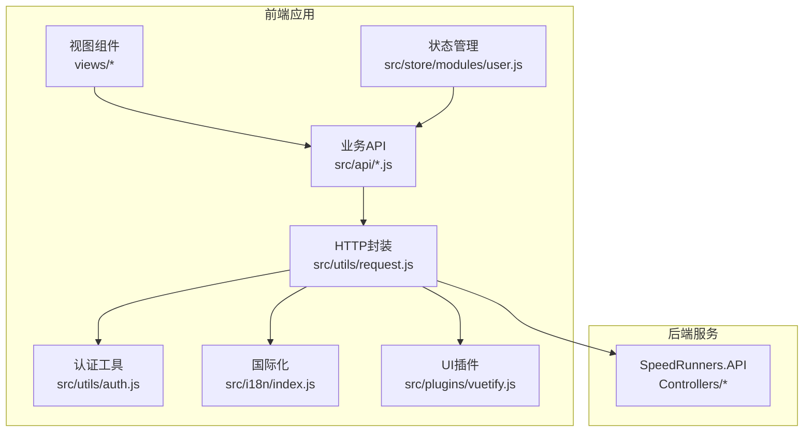
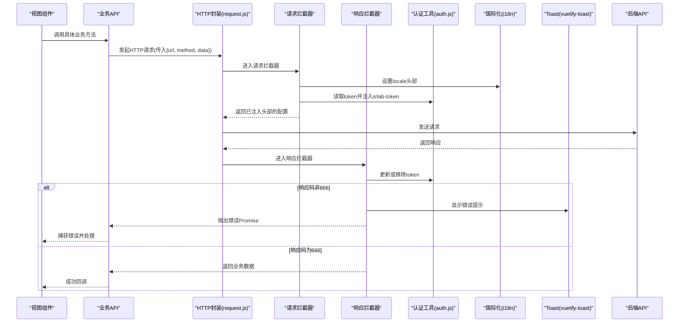
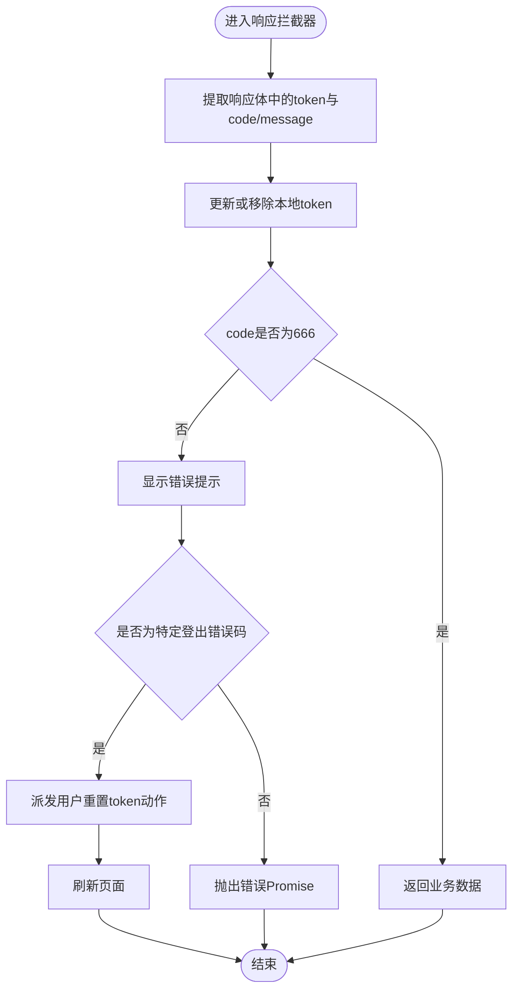
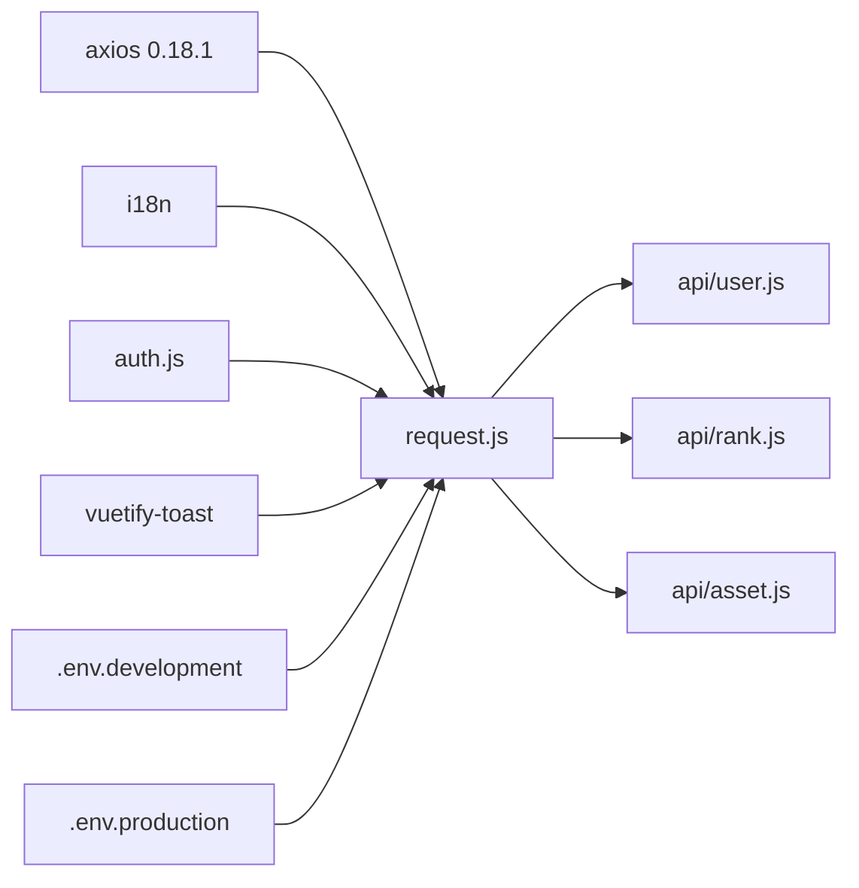

# HTTP 请求封装

<cite>
**本文引用的文件**
- [request.js](file://SpeedRunners.UI/src/utils/request.js)
- [auth.js](file://SpeedRunners.UI/src/utils/auth.js)
- [user.js](file://SpeedRunners.UI/src/api/user.js)
- [rank.js](file://SpeedRunners.UI/src/api/rank.js)
- [asset.js](file://SpeedRunners.UI/src/api/asset.js)
- [user.js（用户模块）](file://SpeedRunners.UI/src/store/modules/user.js)
- [main.js](file://SpeedRunners.UI/src/main.js)
- [index.vue（登录页）](file://SpeedRunners.UI/src/views/login/index.vue)
- [index.vue（排行页）](file://SpeedRunners.UI/src/views/rank/index.vue)
- [index.js（国际化）](file://SpeedRunners.UI/src/i18n/index.js)
- [vuetify.js](file://SpeedRunners.UI/src/plugins/vuetify.js)
- [package.json](file://SpeedRunners.UI/package.json)
- [.env.development](file://SpeedRunners.UI/.env.development)
- [.env.production](file://SpeedRunners.UI/.env.production)
</cite>

## 目录
1. [简介](#简介)
2. [项目结构](#项目结构)
3. [核心组件](#核心组件)
4. [架构总览](#架构总览)
5. [详细组件分析](#详细组件分析)
6. [依赖关系分析](#依赖关系分析)
7. [性能与可靠性](#性能与可靠性)
8. [故障排查指南](#故障排查指南)
9. [结论](#结论)
10. [附录：使用示例与最佳实践](#附录使用示例与最佳实践)

## 简介
本文件系统性梳理 SpeedRunnersLab 前端基于 axios 0.18.1 的 HTTP 请求封装实现，覆盖以下主题：
- baseURL 配置与环境变量
- 请求拦截器与响应拦截器设计
- 请求头设置、token 自动注入与过期处理
- 错误处理机制与国际化提示
- loading 状态管理现状与建议
- 请求超时、重试与取消请求的高级特性说明
- 不同请求类型（GET/POST/PUT/DELETE）的调用方式与示例路径
- 响应数据结构与错误状态码处理策略

## 项目结构
前端采用 Vue 2.x + Vuetify 架构，HTTP 封装位于 utils/request.js，业务 API 定义在 src/api 下，通过统一的 request 工厂导出实例进行调用。

图表来源
- [request.js](file://SpeedRunners.UI/src/utils/request.js#L1-L82)
- [auth.js](file://SpeedRunners.UI/src/utils/auth.js#L1-L45)
- [user.js](file://SpeedRunners.UI/src/api/user.js#L1-L77)
- [rank.js](file://SpeedRunners.UI/src/api/rank.js#L1-L64)
- [asset.js](file://SpeedRunners.UI/src/api/asset.js#L1-L54)
- [user.js（用户模块）](file://SpeedRunners.UI/src/store/modules/user.js#L1-L88)
- [index.js（国际化）](file://SpeedRunners.UI/src/i18n/index.js#L1-L35)
- [vuetify.js](file://SpeedRunners.UI/src/plugins/vuetify.js#L1-L33)

章节来源
- [request.js](file://SpeedRunners.UI/src/utils/request.js#L1-L82)
- [package.json](file://SpeedRunners.UI/package.json#L15-L32)
- [.env.development](file://SpeedRunners.UI/.env.development#L4-L5)
- [.env.production](file://SpeedRunners.UI/.env.production#L4-L5)

## 核心组件
- axios 实例封装：在 utils/request.js 中创建带 baseURL 与超时的 axios 实例，并挂载请求/响应拦截器。
- 认证工具：在 utils/auth.js 中封装 token 的读取、写入与移除，以及登录跳转逻辑。
- 业务 API：在 src/api 下按功能拆分（如 user.js、rank.js、asset.js），统一通过 request 导出的实例发起请求。
- 国际化与 Toast：在 request.js 中使用 i18n.locale 注入 locale 头部；通过 vuetify-toast-snackbar-ng 提示错误消息。
- 环境变量：通过 .env.* 文件配置 VUE_APP_BASE_API，区分开发与生产环境。

章节来源
- [request.js](file://SpeedRunners.UI/src/utils/request.js#L8-L12)
- [auth.js](file://SpeedRunners.UI/src/utils/auth.js#L6-L16)
- [user.js](file://SpeedRunners.UI/src/api/user.js#L1-L77)
- [rank.js](file://SpeedRunners.UI/src/api/rank.js#L1-L64)
- [asset.js](file://SpeedRunners.UI/src/api/asset.js#L1-L54)
- [index.js（国际化）](file://SpeedRunners.UI/src/i18n/index.js#L23-L32)
- [vuetify.js](file://SpeedRunners.UI/src/plugins/vuetify.js#L17-L23)
- [.env.development](file://SpeedRunners.UI/.env.development#L4-L5)
- [.env.production](file://SpeedRunners.UI/.env.production#L4-L5)

## 架构总览
下图展示从前端视图到后端 API 的完整调用链路，以及请求拦截器与响应拦截器对请求/响应的影响。

图表来源
- [request.js](file://SpeedRunners.UI/src/utils/request.js#L14-L30)
- [request.js](file://SpeedRunners.UI/src/utils/request.js#L32-L80)
- [auth.js](file://SpeedRunners.UI/src/utils/auth.js#L6-L16)
- [user.js](file://SpeedRunners.UI/src/api/user.js#L1-L77)
- [rank.js](file://SpeedRunners.UI/src/api/rank.js#L1-L64)
- [index.js（国际化）](file://SpeedRunners.UI/src/i18n/index.js#L23-L32)
- [vuetify.js](file://SpeedRunners.UI/src/plugins/vuetify.js#L17-L23)

## 详细组件分析

### axios 实例与拦截器
- 实例创建
  - baseURL 来源于环境变量 VUE_APP_BASE_API，开发环境为 http://localhost:10340/api，生产环境为 //api.speedrunners.cn/api。
  - 超时时间为 30000ms。
- 请求拦截器
  - 注入 locale 头部（来自 i18n 当前语言）。
  - 从 Cookie 读取 token 并注入 srlab-token 头部。
- 响应拦截器
  - 从响应体提取 token 并更新本地存储（null 表示移除）。
  - 自定义业务码判断：当 code 不等于 666 时视为错误，显示 toast 提示，并对特定错误码触发用户登出流程（dispatch user/resetToken 后刷新页面）。
  - 对网络异常统一捕获并提示国际化错误文案。

图表来源
- [request.js](file://SpeedRunners.UI/src/utils/request.js#L44-L79)
- [auth.js](file://SpeedRunners.UI/src/utils/auth.js#L6-L16)
- [user.js（用户模块）](file://SpeedRunners.UI/src/store/modules/user.js#L37-L80)

章节来源
- [request.js](file://SpeedRunners.UI/src/utils/request.js#L8-L12)
- [request.js](file://SpeedRunners.UI/src/utils/request.js#L14-L30)
- [request.js](file://SpeedRunners.UI/src/utils/request.js#L32-L80)
- [.env.development](file://SpeedRunners.UI/.env.development#L4-L5)
- [.env.production](file://SpeedRunners.UI/.env.production#L4-L5)

### 认证与 token 管理
- 读取：getToken 从 Cookie 读取 srlab-token。
- 写入：setToken 将 token 写入 Cookie，并设置过期时间（约 10 年）。
- 移除：removeToken 清除 Cookie 中的 token。
- 登录跳转：goLoginURL 构造 Steam OpenID 登录地址并跳转。

章节来源
- [auth.js](file://SpeedRunners.UI/src/utils/auth.js#L6-L22)

### 业务 API 层
- 用户相关：getInfo、login、logoutLocal、setState、setRankType、setShowWeekPlayTime、setRequestRankData、setShowAddScore 等。
- 排行相关：getRankList、asyncSRData、initUserData、getPlaySRList、getAddedChart、getHourChart、getSponsor、updateParticipate、getParticipateList 等。
- 资源相关：getUploadToken、getDownloadUrl、getMod、getModList、addMod、deleteMod、operateModStar、getAfdianSponsor 等。

章节来源
- [user.js](file://SpeedRunners.UI/src/api/user.js#L1-L77)
- [rank.js](file://SpeedRunners.UI/src/api/rank.js#L1-L64)
- [asset.js](file://SpeedRunners.UI/src/api/asset.js#L1-L54)

### 视图层调用示例
- 登录页：调用 login 与 initUserData，并根据响应码推进步骤。
- 排行页：调用 getRankList 并将返回数据绑定到表格渲染。

章节来源
- [index.vue（登录页）](file://SpeedRunners.UI/src/views/login/index.vue#L70-L81)
- [index.vue（排行页）](file://SpeedRunners.UI/src/views/rank/index.vue#L92-L95)

## 依赖关系分析
- request.js 依赖 axios 0.18.1、i18n、auth 工具与全局 toast 插件。
- API 文件依赖 request 工厂导出的 axios 实例。
- 视图组件通过 API 文件间接依赖 request。
- 环境变量 VUE_APP_BASE_API 控制 baseURL，影响所有请求的目标域名。

图表来源
- [package.json](file://SpeedRunners.UI/package.json#L15-L32)
- [request.js](file://SpeedRunners.UI/src/utils/request.js#L1-L82)
- [user.js](file://SpeedRunners.UI/src/api/user.js#L1-L77)
- [rank.js](file://SpeedRunners.UI/src/api/rank.js#L1-L64)
- [asset.js](file://SpeedRunners.UI/src/api/asset.js#L1-L54)
- [.env.development](file://SpeedRunners.UI/.env.development#L4-L5)
- [.env.production](file://SpeedRunners.UI/.env.production#L4-L5)

章节来源
- [package.json](file://SpeedRunners.UI/package.json#L15-L32)
- [request.js](file://SpeedRunners.UI/src/utils/request.js#L1-L82)

## 性能与可靠性
- 超时控制：统一 30000ms 超时，避免请求长时间占用资源。
- 重试机制：当前未实现自动重试，可在业务层根据场景自行封装。
- 取消请求：当前未使用 axios CancelToken，可在需要时引入以支持取消。
- loading 状态：未在 request.js 内置 loading 管理，建议在组件或 store 中按需实现，避免阻塞 UI。

[本节为通用建议，不直接分析具体文件]

## 故障排查指南
- 网络错误提示
  - 现象：网络异常时显示国际化错误提示。
  - 排查：检查 VUE_APP_BASE_API 是否正确、跨域配置、后端服务可达性。
- 登录失效与自动登出
  - 现象：响应中特定错误码触发用户重置 token 并刷新页面。
  - 排查：确认后端返回的 code 值、Cookie 是否被清除、路由是否正确重置。
- token 注入失败
  - 现象：srlab-token 未出现在请求头。
  - 排查：确认 Cookie 中是否存在 token、域名与作用域设置、是否跨域携带 Cookie。
- 国际化提示
  - 现象：错误提示语言不符合预期。
  - 排查：确认 i18n.locale 值、vuetify-toast 的语言配置。

章节来源
- [request.js](file://SpeedRunners.UI/src/utils/request.js#L75-L79)
- [request.js](file://SpeedRunners.UI/src/utils/request.js#L55-L69)
- [index.js（国际化）](file://SpeedRunners.UI/src/i18n/index.js#L23-L32)
- [vuetify.js](file://SpeedRunners.UI/src/plugins/vuetify.js#L17-L23)

## 结论
该封装以最小实现提供了稳定的 HTTP 请求能力：统一的 baseURL、自动 token 注入、自定义业务码校验与错误提示、国际化支持。对于更复杂的场景（如重试、取消请求、全局 loading），可在此基础上扩展，保持与现有拦截器与 API 层的解耦。

[本节为总结性内容，不直接分析具体文件]

## 附录：使用示例与最佳实践
- GET 请求
  - 示例路径：[getRankList](file://SpeedRunners.UI/src/api/rank.js#L3-L8)
  - 使用方式：在视图组件中导入对应 API 方法并调用，等待 Promise 解析后的数据。
- POST 请求
  - 示例路径：[login](file://SpeedRunners.UI/src/api/user.js#L10-L16)、[getDownloadUrl](file://SpeedRunners.UI/src/api/asset.js#L9-L15)
  - 使用方式：将参数放入 data 字段，注意后端字段命名与序列化。
- PUT/DELETE
  - 当前代码库未提供 PUT/DELETE 的示例，但 request 工厂支持任意 method。建议在新增 API 时遵循现有风格，统一在 api/*.js 中维护。
- 错误处理
  - 统一在业务层判断 response.code === 666，非 666 时由拦截器抛错并显示提示。
- loading 管理
  - 建议在组件中按需显示/隐藏 loading，避免阻塞 UI；或在 store 中集中管理多个并发请求的状态。
- 超时与重试
  - 超时：已在 request.js 中设置 30000ms。
  - 重试：可在业务层封装 retry 逻辑，结合指数退避策略与最大次数限制。
- 取消请求
  - 在需要时引入 axios.CancelToken，在路由切换或组件销毁时取消未完成请求，防止内存泄漏与无意义的网络消耗。

章节来源
- [user.js](file://SpeedRunners.UI/src/api/user.js#L1-L77)
- [rank.js](file://SpeedRunners.UI/src/api/rank.js#L1-L64)
- [asset.js](file://SpeedRunners.UI/src/api/asset.js#L1-L54)
- [request.js](file://SpeedRunners.UI/src/utils/request.js#L8-L12)