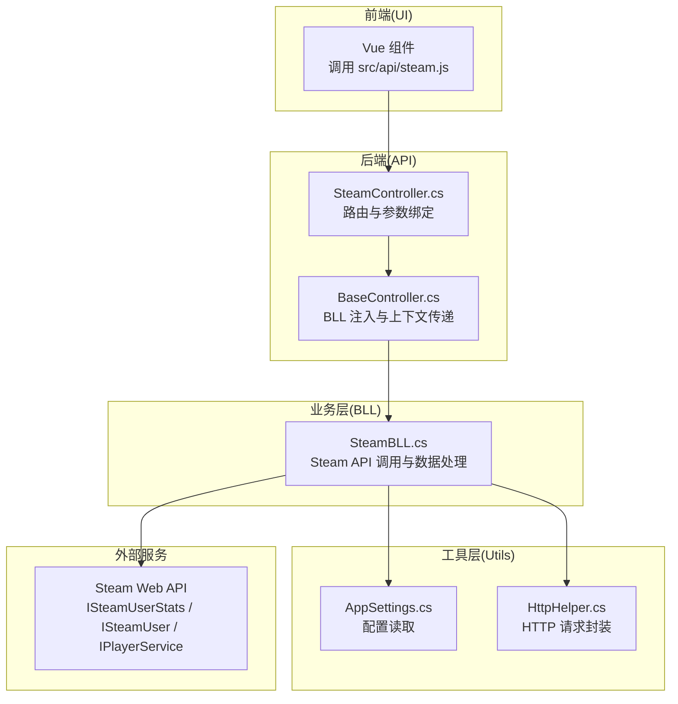
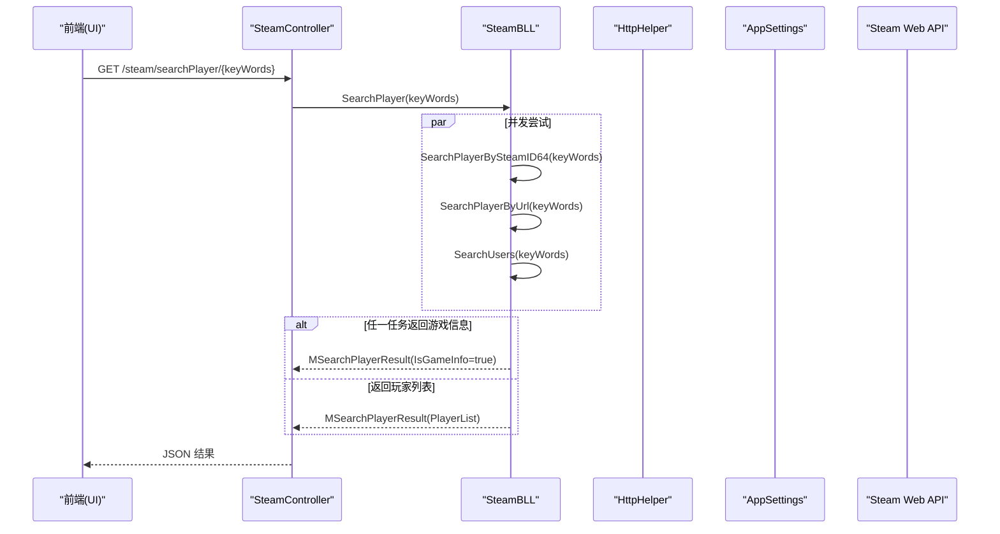
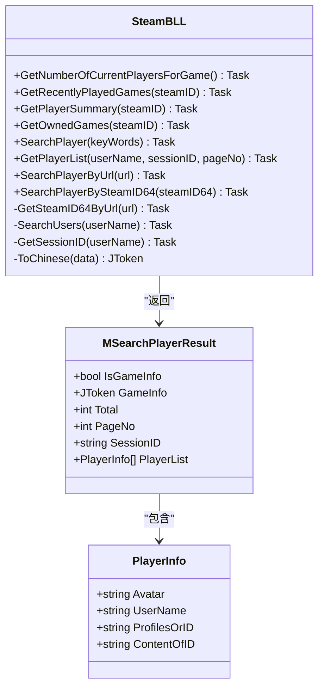
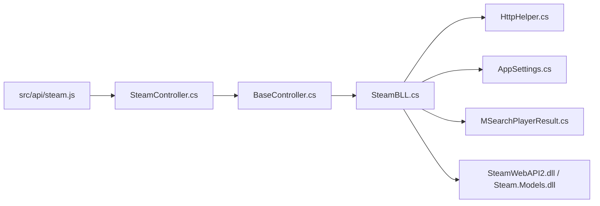
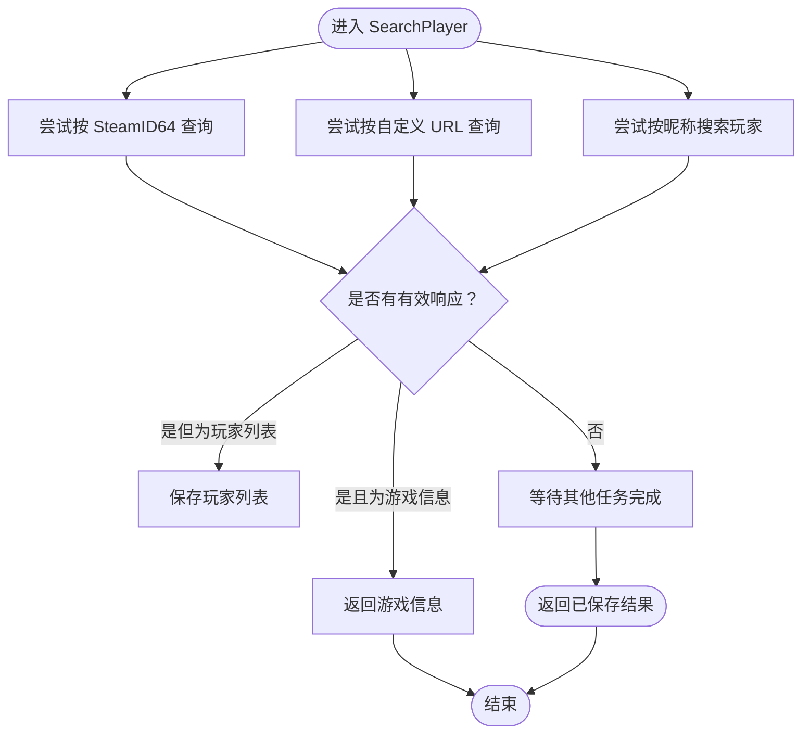

# Steam API 模块

<cite>
**本文引用的文件**
- [SpeedRunners.API/SpeedRunners/Controllers/SteamController.cs](file://SpeedRunners.API/SpeedRunners/Controllers/SteamController.cs)
- [SpeedRunners.API/SpeedRunners.BLL/SteamBLL.cs](file://SpeedRunners.API/SpeedRunners.BLL/SteamBLL.cs)
- [SpeedRunners.API/SpeedRunners.Model/Steam/MSearchPlayerResult.cs](file://SpeedRunners.API/SpeedRunners.Model/Steam/MSearchPlayerResult.cs)
- [SpeedRunners.API/SpeedRunners/Controllers/BaseController.cs](file://SpeedRunners.API/SpeedRunners/Controllers/BaseController.cs)
- [SpeedRunners.API/SpeedRunners.Utils/AppSettings.cs](file://SpeedRunners.API/SpeedRunners.Utils/AppSettings.cs)
- [SpeedRunners.API/SpeedRunners.Utils/HttpHelper.cs](file://SpeedRunners.API/SpeedRunners.Utils/HttpHelper.cs)
- [SpeedRunners.API/SpeedRunners/SpeedRunners.csproj](file://SpeedRunners.API/SpeedRunners/SpeedRunners.csproj)
- [SpeedRunners.API/SpeedRunners.BLL/SpeedRunners.BLL.csproj](file://SpeedRunners.API/SpeedRunners.BLL/SpeedRunners.BLL.csproj)
- [SpeedRunners.API/SpeedRunners.Model/SpeedRunners.Model.csproj](file://SpeedRunners.API/SpeedRunners.Model/SpeedRunners.Model.csproj)
- [SpeedRunners.API/SpeedRunners.Utils/SpeedRunners.Utils.csproj](file://SpeedRunners.API/SpeedRunners.Utils/SpeedRunners.Utils.csproj)
- [SpeedRunners.API/SpeedRunners/appsettings.json](file://SpeedRunners.API/SpeedRunners/appsettings.json)
- [SpeedRunners.UI/src/api/steam.js](file://SpeedRunners.UI/src/api/steam.js)
- [SpeedRunners.Scheduler/Task.cs](file://SpeedRunners.Scheduler/Task.cs)
</cite>

## 目录
1. [简介](#简介)
2. [项目结构](#项目结构)
3. [核心组件](#核心组件)
4. [架构总览](#架构总览)
5. [组件详解](#组件详解)
6. [依赖关系分析](#依赖关系分析)
7. [性能与频率控制](#性能与频率控制)
8. [故障排查指南](#故障排查指南)
9. [结论](#结论)
10. [附录](#附录)

## 简介
本文件系统性梳理 SpeedRunnersLab 中的 Steam API 集成模块，覆盖玩家搜索、游戏信息获取、在线状态查询等能力。文档从架构、数据流、处理逻辑、错误处理与性能优化等维度进行深入解析，并提供与后端接口协作机制及最佳实践建议。

## 项目结构
该模块横跨前端、后端 API 层、业务层、工具层与调度器，形成“UI → API 控制器 → 业务层 → Steam 接口”的清晰链路。

图表来源
- [SpeedRunners.API/SpeedRunners/Controllers/SteamController.cs](file://SpeedRunners.API/SpeedRunners/Controllers/SteamController.cs#L1-L28)
- [SpeedRunners.API/SpeedRunners.BLL/SteamBLL.cs](file://SpeedRunners.API/SpeedRunners.BLL/SteamBLL.cs#L1-L448)
- [SpeedRunners.API/SpeedRunners.Utils/AppSettings.cs](file://SpeedRunners.API/SpeedRunners.Utils/AppSettings.cs#L1-L55)
- [SpeedRunners.API/SpeedRunners.Utils/HttpHelper.cs](file://SpeedRunners.API/SpeedRunners.Utils/HttpHelper.cs#L1-L146)

章节来源
- [SpeedRunners.API/SpeedRunners/Controllers/SteamController.cs](file://SpeedRunners.API/SpeedRunners/Controllers/SteamController.cs#L1-L28)
- [SpeedRunners.API/SpeedRunners.BLL/SteamBLL.cs](file://SpeedRunners.API/SpeedRunners.BLL/SteamBLL.cs#L1-L448)
- [SpeedRunners.API/SpeedRunners/Controllers/BaseController.cs](file://SpeedRunners.API/SpeedRunners/Controllers/BaseController.cs#L1-L26)

## 核心组件
- API 控制器：提供玩家搜索、按 URL/SteamID64 查询、玩家列表、在线人数等接口。
- 业务层：封装 Steam API 调用、多入口并发策略、HTML 解析与字段翻译、语言本地化。
- 工具层：统一配置读取与 HTTP 请求封装，支持代理与异常回退。
- 数据模型：定义搜索结果与玩家信息的数据结构。

章节来源
- [SpeedRunners.API/SpeedRunners/Controllers/SteamController.cs](file://SpeedRunners.API/SpeedRunners/Controllers/SteamController.cs#L1-L28)
- [SpeedRunners.API/SpeedRunners.BLL/SteamBLL.cs](file://SpeedRunners.API/SpeedRunners.BLL/SteamBLL.cs#L1-L448)
- [SpeedRunners.API/SpeedRunners.Model/Steam/MSearchPlayerResult.cs](file://SpeedRunners.API/SpeedRunners.Model/Steam/MSearchPlayerResult.cs#L1-L38)
- [SpeedRunners.API/SpeedRunners.Utils/AppSettings.cs](file://SpeedRunners.API/SpeedRunners.Utils/AppSettings.cs#L1-L55)
- [SpeedRunners.API/SpeedRunners.Utils/HttpHelper.cs](file://SpeedRunners.API/SpeedRunners.Utils/HttpHelper.cs#L1-L146)

## 架构总览
Steam API 模块遵循“控制器-业务层-工具层-外部接口”的分层设计。前端通过 REST 接口调用后端，后端在业务层内组合 Steam 官方接口与社区页面解析，最终返回统一的数据模型。

图表来源
- [SpeedRunners.API/SpeedRunners/Controllers/SteamController.cs](file://SpeedRunners.API/SpeedRunners/Controllers/SteamController.cs#L12-L13)
- [SpeedRunners.API/SpeedRunners.BLL/SteamBLL.cs](file://SpeedRunners.API/SpeedRunners.BLL/SteamBLL.cs#L113-L135)
- [SpeedRunners.API/SpeedRunners.Utils/HttpHelper.cs](file://SpeedRunners.API/SpeedRunners.Utils/HttpHelper.cs#L12-L75)
- [SpeedRunners.API/SpeedRunners.Utils/AppSettings.cs](file://SpeedRunners.API/SpeedRunners.Utils/AppSettings.cs#L16-L19)

## 组件详解

### 1) API 控制器：SteamController
- 提供以下接口：
  - 搜索玩家：支持关键词、自定义 URL、SteamID64、分页玩家列表与在线人数统计。
  - 参数绑定与路由：使用特性路由与强类型参数，便于前端调用。
- 控制器继承通用基类，自动注入业务层实例与本地化资源。

章节来源
- [SpeedRunners.API/SpeedRunners/Controllers/SteamController.cs](file://SpeedRunners.API/SpeedRunners/Controllers/SteamController.cs#L8-L26)
- [SpeedRunners.API/SpeedRunners/Controllers/BaseController.cs](file://SpeedRunners.API/SpeedRunners/Controllers/BaseController.cs#L10-L23)

### 2) 业务层：SteamBLL
- 关键职责
  - 在线人数查询：调用 SteamUserStats 接口获取当前在线玩家数。
  - 玩家信息与游戏数据：封装 PlayerService 与 SteamUser 接口，获取最近游玩、拥有游戏、玩家摘要等。
  - 多入口并发搜索：同时尝试 SteamID64、自定义 URL、社区昵称搜索，优先返回游戏信息，否则回退到玩家列表。
  - 社区页面解析：通过 Steam 社区搜索接口获取玩家头像、昵称、唯一标识等信息。
  - 语言本地化：将游戏统计字段翻译为中文，依据请求头 locale 判断。
- 数据模型
  - 使用统一结果模型承载“游戏信息”或“玩家列表”，便于前后端一致处理。

图表来源
- [SpeedRunners.API/SpeedRunners.BLL/SteamBLL.cs](file://SpeedRunners.API/SpeedRunners.BLL/SteamBLL.cs#L18-L448)
- [SpeedRunners.API/SpeedRunners.Model/Steam/MSearchPlayerResult.cs](file://SpeedRunners.API/SpeedRunners.Model/Steam/MSearchPlayerResult.cs#L6-L37)

章节来源
- [SpeedRunners.API/SpeedRunners.BLL/SteamBLL.cs](file://SpeedRunners.API/SpeedRunners.BLL/SteamBLL.cs#L28-L106)
- [SpeedRunners.API/SpeedRunners.BLL/SteamBLL.cs](file://SpeedRunners.API/SpeedRunners.BLL/SteamBLL.cs#L113-L192)
- [SpeedRunners.API/SpeedRunners.BLL/SteamBLL.cs](file://SpeedRunners.API/SpeedRunners.BLL/SteamBLL.cs#L214-L268)
- [SpeedRunners.API/SpeedRunners.BLL/SteamBLL.cs](file://SpeedRunners.API/SpeedRunners.BLL/SteamBLL.cs#L313-L444)
- [SpeedRunners.API/SpeedRunners.Model/Steam/MSearchPlayerResult.cs](file://SpeedRunners.API/SpeedRunners.Model/Steam/MSearchPlayerResult.cs#L6-L37)

### 3) 数据模型：MSearchPlayerResult 与 PlayerInfo
- MSearchPlayerResult
  - IsGameInfo：区分返回的是游戏统计还是玩家列表。
  - GameInfo：JSON 游戏统计数据（可按语言翻译）。
  - PlayerList：玩家列表，包含头像、昵称、唯一标识等。
- PlayerInfo
  - Avatar、UserName、ProfilesOrID、ContentOfID：用于展示与后续跳转。

章节来源
- [SpeedRunners.API/SpeedRunners.Model/Steam/MSearchPlayerResult.cs](file://SpeedRunners.API/SpeedRunners.Model/Steam/MSearchPlayerResult.cs#L6-L37)

### 4) 工具层：AppSettings 与 HttpHelper
- AppSettings
  - 统一读取配置项，如 API Key、代理开关与地址等。
- HttpHelper
  - 封装 GET/POST 请求，支持代理切换与异常回退。
  - 默认超时 10 秒，可按需扩展重试与限速策略。

章节来源
- [SpeedRunners.API/SpeedRunners.Utils/AppSettings.cs](file://SpeedRunners.API/SpeedRunners.Utils/AppSettings.cs#L16-L52)
- [SpeedRunners.API/SpeedRunners.Utils/HttpHelper.cs](file://SpeedRunners.API/SpeedRunners.Utils/HttpHelper.cs#L12-L75)
- [SpeedRunners.API/SpeedRunners/appsettings.json](file://SpeedRunners.API/SpeedRunners/appsettings.json#L14-L14)

### 5) 前端对接：src/api/steam.js
- 对应后端接口封装了常用方法，便于 Vue 组件直接调用。
- 方法包括：searchPlayer、getPlayerList、searchPlayerByUrl、searchPlayerBySteamID64、getOnlineCount。

章节来源
- [SpeedRunners.UI/src/api/steam.js](file://SpeedRunners.UI/src/api/steam.js#L3-L36)

### 6) 后端协作与调度器：Task.cs
- 调度器定期批量拉取 Steam 玩家信息与游戏时长，写入数据库。
- 采用分批请求与延迟控制，避免触发限流。
- 与业务层共享相同的 API Key 与 Steam 接口调用方式。

章节来源
- [SpeedRunners.Scheduler/Task.cs](file://SpeedRunners.Scheduler/Task.cs#L248-L328)
- [SpeedRunners.Scheduler/Task.cs](file://SpeedRunners.Scheduler/Task.cs#L81-L144)

## 依赖关系分析

图表来源
- [SpeedRunners.API/SpeedRunners/Controllers/SteamController.cs](file://SpeedRunners.API/SpeedRunners/Controllers/SteamController.cs#L1-L28)
- [SpeedRunners.API/SpeedRunners.BLL/SteamBLL.cs](file://SpeedRunners.API/SpeedRunners.BLL/SteamBLL.cs#L1-L25)
- [SpeedRunners.API/SpeedRunners.Utils/HttpHelper.cs](file://SpeedRunners.API/SpeedRunners.Utils/HttpHelper.cs#L1-L146)
- [SpeedRunners.API/SpeedRunners.Utils/AppSettings.cs](file://SpeedRunners.API/SpeedRunners.Utils/AppSettings.cs#L1-L55)
- [SpeedRunners.API/SpeedRunners.Model/Steam/MSearchPlayerResult.cs](file://SpeedRunners.API/SpeedRunners.Model/Steam/MSearchPlayerResult.cs#L1-L38)

章节来源
- [SpeedRunners.API/SpeedRunners/Controllers/SteamController.cs](file://SpeedRunners.API/SpeedRunners/Controllers/SteamController.cs#L1-L28)
- [SpeedRunners.API/SpeedRunners.BLL/SteamBLL.cs](file://SpeedRunners.API/SpeedRunners.BLL/SteamBLL.cs#L1-L25)
- [SpeedRunners.API/SpeedRunners/SpeedRunners.csproj](file://SpeedRunners.API/SpeedRunners/SpeedRunners.csproj)
- [SpeedRunners.API/SpeedRunners.BLL/SpeedRunners.BLL.csproj](file://SpeedRunners.API/SpeedRunners.BLL/SpeedRunners.BLL.csproj)
- [SpeedRunners.API/SpeedRunners.Model/SpeedRunners.Model.csproj](file://SpeedRunners.API/SpeedRunners.Model/SpeedRunners.Model.csproj)
- [SpeedRunners.API/SpeedRunners.Utils/SpeedRunners.Utils.csproj](file://SpeedRunners.API/SpeedRunners.Utils/SpeedRunners.Utils.csproj)

## 性能与频率控制
- 请求频率控制
  - 业务层与调度器均对 Steam 接口调用设置了延迟，避免触发限流。
  - 调度器在批量请求时按组分批处理，并在每组间增加延迟。
- 代理与稳定性
  - HttpHelper 支持代理配置与异常回退，提升网络环境不稳定时的可用性。
- 并发策略
  - 搜索接口采用“三路并发 + 优先返回”的策略，缩短首响应时间。

章节来源
- [SpeedRunners.Scheduler/Task.cs](file://SpeedRunners.Scheduler/Task.cs#L94-L115)
- [SpeedRunners.Scheduler/Task.cs](file://SpeedRunners.Scheduler/Task.cs#L185-L191)
- [SpeedRunners.API/SpeedRunners.BLL/SteamBLL.cs](file://SpeedRunners.API/SpeedRunners.BLL/SteamBLL.cs#L113-L135)
- [SpeedRunners.API/SpeedRunners.Utils/HttpHelper.cs](file://SpeedRunners.API/SpeedRunners.Utils/HttpHelper.cs#L28-L34)

## 故障排查指南
- 常见问题定位
  - API Key 未正确配置：检查配置文件中的 API Key 与实际值是否匹配。
  - 网络异常：确认代理设置与回退逻辑是否生效。
  - 社区页面解析失败：检查 HTML 正则表达式与返回内容格式变化。
- 错误处理策略
  - 所有 HTTP 请求均捕获异常并返回空值，避免中断整体流程。
  - 搜索接口在任一任务返回有效结果后即终止其他任务，减少无效调用。

章节来源
- [SpeedRunners.API/SpeedRunners/appsettings.json](file://SpeedRunners.API/SpeedRunners/appsettings.json#L14-L14)
- [SpeedRunners.API/SpeedRunners.BLL/SteamBLL.cs](file://SpeedRunners.API/SpeedRunners.BLL/SteamBLL.cs#L218-L225)
- [SpeedRunners.API/SpeedRunners.BLL/SteamBLL.cs](file://SpeedRunners.API/SpeedRunners.BLL/SteamBLL.cs#L151-L158)
- [SpeedRunners.API/SpeedRunners.BLL/SteamBLL.cs](file://SpeedRunners.API/SpeedRunners.BLL/SteamBLL.cs#L289-L306)

## 结论
该模块以清晰的分层设计实现了对 Steam 平台的多维集成：既能满足前端即时查询需求，也能通过调度器稳定地维护玩家与游戏数据。通过并发搜索、语言本地化与频率控制，兼顾了性能与可靠性。建议在生产环境中进一步完善重试与熔断策略，并持续关注 Steam 接口与社区页面的变更。

## 附录

### A. API 定义与调用流程
- 接口一览
  - GET /steam/searchPlayer/{keyWords}
  - GET /steam/getPlayerList/{userName}/{sessionID}/{pageNo}
  - GET /steam/searchPlayerByUrl/{url}
  - GET /steam/searchPlayerBySteamID64/{steamID64}
  - GET /steam/getOnlineCount
- 前端调用参考
  - 参考路径：[SpeedRunners.UI/src/api/steam.js](file://SpeedRunners.UI/src/api/steam.js#L3-L36)

章节来源
- [SpeedRunners.API/SpeedRunners/Controllers/SteamController.cs](file://SpeedRunners.API/SpeedRunners/Controllers/SteamController.cs#L12-L25)
- [SpeedRunners.UI/src/api/steam.js](file://SpeedRunners.UI/src/api/steam.js#L3-L36)

### B. 数据处理流程图（搜索）

图表来源
- [SpeedRunners.API/SpeedRunners.BLL/SteamBLL.cs](file://SpeedRunners.API/SpeedRunners.BLL/SteamBLL.cs#L113-L135)