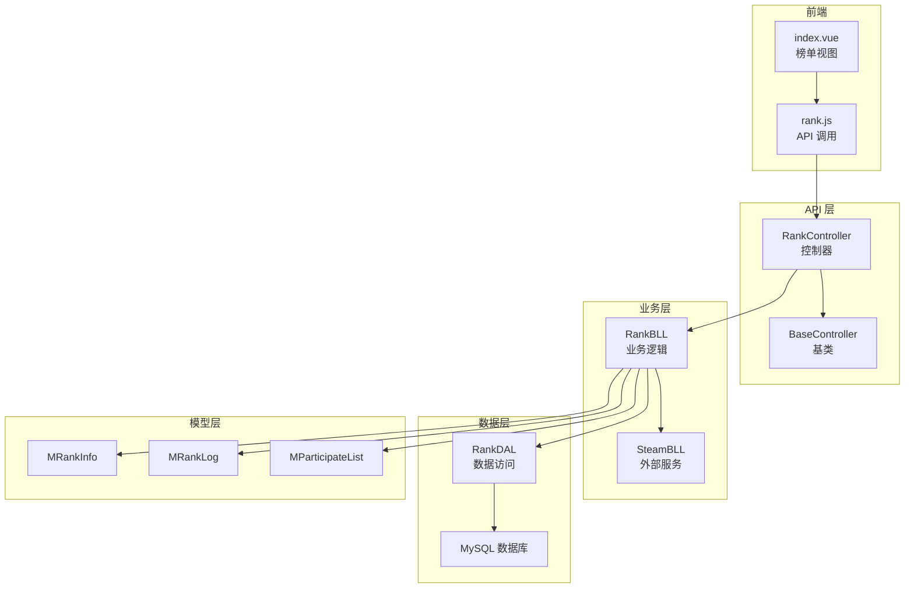
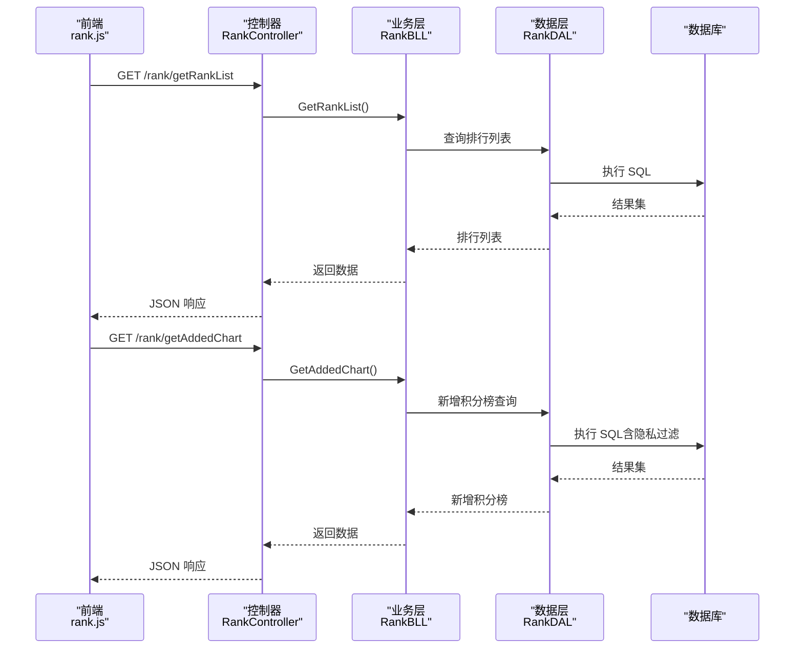
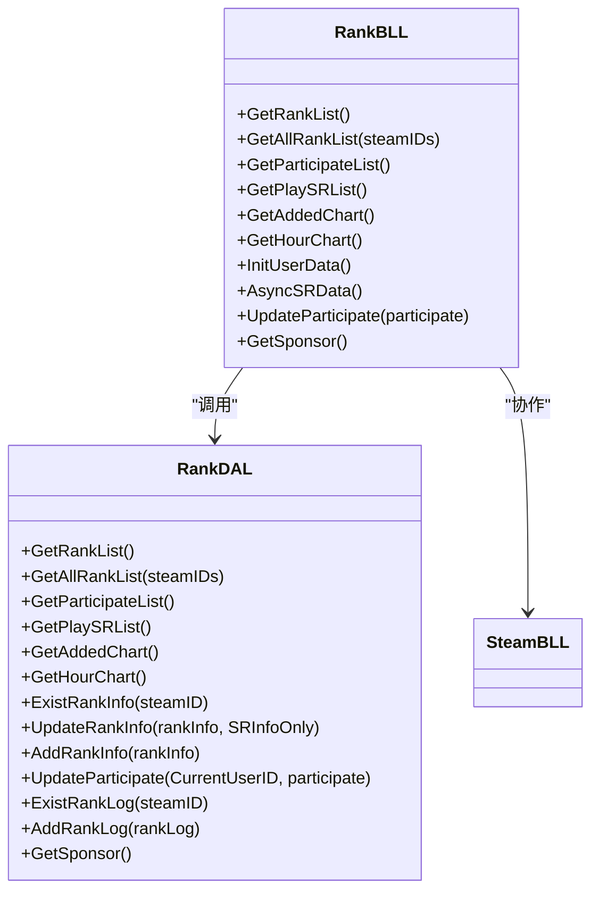
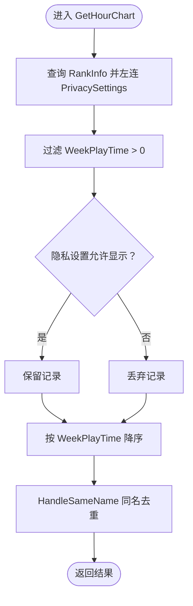
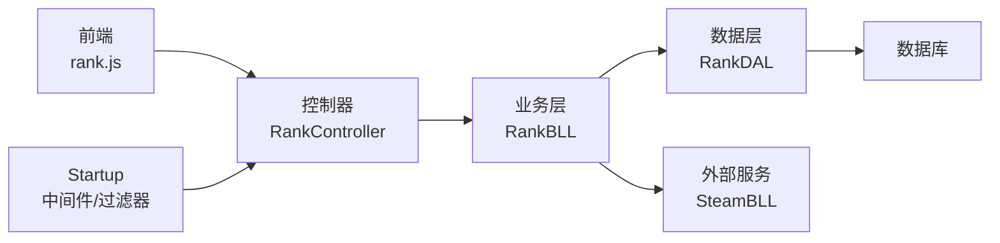

# 排名 API 模块

<cite>
**本文引用的文件**
- [RankController.cs](file://SpeedRunners.API/SpeedRunners/Controllers/RankController.cs)
- [RankBLL.cs](file://SpeedRunners.API/SpeedRunners.BLL/RankBLL.cs)
- [RankDAL.cs](file://SpeedRunners.API/SpeedRunners.DAL/RankDAL.cs)
- [MRankInfo.cs](file://SpeedRunners.API/SpeedRunners.Model/Rank/MRankInfo.cs)
- [MParticipateList.cs](file://SpeedRunners.API/SpeedRunners.Model/Rank/MParticipateList.cs)
- [MRankLog.cs](file://SpeedRunners.API/SpeedRunners.Model/Rank/MRankLog.cs)
- [BaseController.cs](file://SpeedRunners.API/SpeedRunners/Controllers/BaseController.cs)
- [BLLHelper.cs](file://SpeedRunners.API/SpeedRunners.Utils/BLLHelper.cs)
- [DALBase.cs](file://SpeedRunners.API/SpeedRunners.Utils/DALBase.cs)
- [MPageParam.cs](file://SpeedRunners.API/SpeedRunners.Model/MPageParam.cs)
- [MPageResult.cs](file://SpeedRunners.API/SpeedRunners.Model/MPageResult.cs)
- [Startup.cs](file://SpeedRunners.API/SpeedRunners/Startup.cs)
- [rank.js](file://SpeedRunners.UI/src/api/rank.js)
- [index.vue](file://SpeedRunners.UI/src/views/rank/index.vue)
</cite>

## 目录
1. [简介](#简介)
2. [项目结构](#项目结构)
3. [核心组件](#核心组件)
4. [架构总览](#架构总览)
5. [详细组件分析](#详细组件分析)
6. [依赖关系分析](#依赖关系分析)
7. [性能考量](#性能考量)
8. [故障排查指南](#故障排查指南)
9. [结论](#结论)
10. [附录](#附录)

## 简介
本文件系统性梳理 SpeedRunnersLab 排名 API 模块，覆盖以下方面：
- 排行榜列表、实时参与榜、新增积分榜、周游玩时长榜等接口的封装与调用
- 排行数据的获取、处理与展示流程（含去重、排序、隐私过滤）
- 用户数据初始化与异步同步逻辑
- 前端调用示例与图表数据格式化建议
- 性能优化与大数据量处理最佳实践

## 项目结构
后端采用经典的三层架构：控制器层负责路由与鉴权，业务层封装数据处理与外部服务交互，数据层负责 SQL 查询与持久化。

**图表来源**
- [RankController.cs](file://SpeedRunners.API/SpeedRunners/Controllers/RankController.cs#L11-L47)
- [BaseController.cs](file://SpeedRunners.API/SpeedRunners/Controllers/BaseController.cs#L10-L23)
- [RankBLL.cs](file://SpeedRunners.API/SpeedRunners.BLL/RankBLL.cs#L14-L21)
- [RankDAL.cs](file://SpeedRunners.API/SpeedRunners.DAL/RankDAL.cs#L11-L13)
- [MRankInfo.cs](file://SpeedRunners.API/SpeedRunners.Model/Rank/MRankInfo.cs#L5-L34)
- [MRankLog.cs](file://SpeedRunners.API/SpeedRunners.Model/Rank/MRankLog.cs#L5-L10)
- [MParticipateList.cs](file://SpeedRunners.API/SpeedRunners.Model/Rank/MParticipateList.cs#L7-L16)
- [rank.js](file://SpeedRunners.UI/src/api/rank.js#L1-L64)
- [index.vue](file://SpeedRunners.UI/src/views/rank/index.vue#L61-L96)

**章节来源**
- [RankController.cs](file://SpeedRunners.API/SpeedRunners/Controllers/RankController.cs#L11-L47)
- [RankBLL.cs](file://SpeedRunners.API/SpeedRunners.BLL/RankBLL.cs#L14-L21)
- [RankDAL.cs](file://SpeedRunners.API/SpeedRunners.DAL/RankDAL.cs#L11-L13)
- [Startup.cs](file://SpeedRunners.API/SpeedRunners/Startup.cs#L33-L84)

## 核心组件
- 控制器：提供 /rank/* 的 REST 接口，标注鉴权特性，直接委派给 BLL。
- 业务层：封装排行计算、用户数据初始化、异步同步、参与状态更新等。
- 数据层：封装 SQL 查询、插入、更新、事务控制；包含隐私字段过滤与同名处理。
- 模型：MRankInfo、MRankLog、MParticipateList 定义数据结构。
- 基础设施：BaseController 注入当前用户上下文；BLLHelper/DALBase 提供统一数据库访问与事务封装。

**章节来源**
- [RankController.cs](file://SpeedRunners.API/SpeedRunners/Controllers/RankController.cs#L13-L46)
- [RankBLL.cs](file://SpeedRunners.API/SpeedRunners.BLL/RankBLL.cs#L14-L209)
- [RankDAL.cs](file://SpeedRunners.API/SpeedRunners.DAL/RankDAL.cs#L11-L173)
- [MRankInfo.cs](file://SpeedRunners.API/SpeedRunners.Model/Rank/MRankInfo.cs#L5-L34)
- [MRankLog.cs](file://SpeedRunners.API/SpeedRunners.Model/Rank/MRankLog.cs#L5-L10)
- [MParticipateList.cs](file://SpeedRunners.API/SpeedRunners.Model/Rank/MParticipateList.cs#L7-L16)
- [BaseController.cs](file://SpeedRunners.API/SpeedRunners/Controllers/BaseController.cs#L10-L23)
- [BLLHelper.cs](file://SpeedRunners.API/SpeedRunners.Utils/BLLHelper.cs#L7-L72)
- [DALBase.cs](file://SpeedRunners.API/SpeedRunners.Utils/DALBase.cs#L3-L11)

## 架构总览
下图展示从前端到数据库的整体调用链路与关键处理点。

**图表来源**
- [rank.js](file://SpeedRunners.UI/src/api/rank.js#L3-L8)
- [RankController.cs](file://SpeedRunners.API/SpeedRunners/Controllers/RankController.cs#L16-L20)
- [RankBLL.cs](file://SpeedRunners.API/SpeedRunners.BLL/RankBLL.cs#L28-L34)
- [RankDAL.cs](file://SpeedRunners.API/SpeedRunners.DAL/RankDAL.cs#L32-L42)
- [RankDAL.cs](file://SpeedRunners.API/SpeedRunners.DAL/RankDAL.cs#L44-L81)

## 详细组件分析

### 控制器层：RankController
- 提供以下接口：
  - GET /rank/getRankList：获取正式榜单（RankType=1）
  - GET /rank/getAddedChart：新增积分榜（近两周）
  - GET /rank/getHourChart：周游玩时长榜
  - GET /rank/asyncSRData：异步同步用户 SR 数据
  - GET /rank/initUserData：初始化用户数据
  - GET /rank/getPlaySRList：正在玩 SR 的玩家
  - GET /rank/updateParticipate/{participate}：更新参与状态
  - GET /rank/getSponsor：赞助商列表
  - GET /rank/getParticipateList：参与榜单
- 使用特性：
  - [Persona]：可能用于特定角色或权限校验
  - [User]：需要登录用户上下文

**章节来源**
- [RankController.cs](file://SpeedRunners.API/SpeedRunners/Controllers/RankController.cs#L15-L46)

### 业务层：RankBLL
- 主要职责：
  - 排行榜与筛选：GetRankList、GetAllRankList、GetParticipateList
  - 实时与统计：GetPlaySRList、GetAddedChart、GetHourChart
  - 用户数据：InitUserData、AsyncSRData、UpdateParticipate
  - 赞助商：GetSponsor
- 关键实现要点：
  - 通过 BeginDb 委托模式访问 DAL，自动管理连接与事务
  - 与 SteamBLL 协作获取玩家状态、最近游玩、拥有游戏等信息
  - 对参与榜单进行 SxlScore 计算与排序
  - 对新增积分榜与周游玩时长榜进行隐私字段过滤

**图表来源**
- [RankBLL.cs](file://SpeedRunners.API/SpeedRunners.BLL/RankBLL.cs#L14-L209)
- [RankDAL.cs](file://SpeedRunners.API/SpeedRunners.DAL/RankDAL.cs#L11-L173)

**章节来源**
- [RankBLL.cs](file://SpeedRunners.API/SpeedRunners.BLL/RankBLL.cs#L28-L207)

### 数据层：RankDAL
- 查询接口：
  - GetRankList：筛选 RankType=1 的正式榜单
  - GetAllRankList：支持按平台 ID 列表过滤
  - GetParticipateList：筛选参与状态的玩家
  - GetPlaySRList：筛选正在玩 SR 的玩家
  - GetAddedChart：近两周新增积分榜（含最小分数与隐私过滤）
  - GetHourChart：周游玩时长榜（隐私过滤）
- 辅助方法：
  - ExistRankInfo/ExistRankLog：存在性检查
  - UpdateRankInfo/AddRankInfo：更新与新增
  - UpdateParticipate：参与状态更新
  - HandleSameName：同名去重（追加空格）
- 隐私过滤：
  - 通过 PrivacySettings 字段控制是否对外展示新增积分与周游玩时长

**图表来源**
- [RankDAL.cs](file://SpeedRunners.API/SpeedRunners.DAL/RankDAL.cs#L83-L92)
- [RankDAL.cs](file://SpeedRunners.API/SpeedRunners.DAL/RankDAL.cs#L94-L119)

**章节来源**
- [RankDAL.cs](file://SpeedRunners.API/SpeedRunners.DAL/RankDAL.cs#L17-L173)

### 模型层：数据结构
- MRankInfo：排行主表字段（平台 ID、昵称、头像、状态、等级、分数、参与状态、时间等）
- MRankLog：排行日志（平台 ID、分数、日期）
- MParticipateList：参与榜单聚合字段（含 SxlScore 计算）

**章节来源**
- [MRankInfo.cs](file://SpeedRunners.API/SpeedRunners.Model/Rank/MRankInfo.cs#L5-L34)
- [MRankLog.cs](file://SpeedRunners.API/SpeedRunners.Model/Rank/MRankLog.cs#L5-L10)
- [MParticipateList.cs](file://SpeedRunners.API/SpeedRunners.Model/Rank/MParticipateList.cs#L7-L16)

### 基础设施：BaseController、BLLHelper、DALBase
- BaseController：注入当前用户上下文与本地化资源，统一传递给 BLL
- BLLHelper：提供 BeginDb 泛型委托，自动建立连接、包装事务、异常回滚
- DALBase：持有 DbHelper 引用，供具体 DAL 使用

**章节来源**
- [BaseController.cs](file://SpeedRunners.API/SpeedRunners/Controllers/BaseController.cs#L10-L23)
- [BLLHelper.cs](file://SpeedRunners.API/SpeedRunners.Utils/BLLHelper.cs#L30-L70)
- [DALBase.cs](file://SpeedRunners.API/SpeedRunners.Utils/DALBase.cs#L3-L11)

### 分页与排序能力
- 当前 RankDAL 的查询未内置分页参数（如 MPageParam），所有查询均一次性返回全量结果
- 若需分页，可在业务层对结果集进行分页处理，或扩展 DAL 查询以支持 Offset/Limit

**章节来源**
- [MPageParam.cs](file://SpeedRunners.API/SpeedRunners.Model/MPageParam.cs#L3-L13)
- [MPageResult.cs](file://SpeedRunners.API/SpeedRunners.Model/MPageResult.cs#L7-L11)
- [RankDAL.cs](file://SpeedRunners.API/SpeedRunners.DAL/RankDAL.cs#L17-L42)

### 前端调用与展示
- 前端通过 rank.js 调用后端接口，index.vue 渲染榜单表格与图标
- 排行榜页面挂载时拉取 /rank/getRankList，并根据数据渲染头像、状态、等级、分数与增量

**章节来源**
- [rank.js](file://SpeedRunners.UI/src/api/rank.js#L3-L8)
- [index.vue](file://SpeedRunners.UI/src/views/rank/index.vue#L61-L96)

## 依赖关系分析
- 控制器依赖业务层；业务层依赖数据层与外部 SteamBLL；数据层依赖数据库
- 业务层通过 BLLHelper 统一数据库访问，避免重复连接与事务处理代码
- 前端通过 axios 封装的 request 发起请求，控制器与业务层通过 Startup 中的中间件与过滤器统一处理

**图表来源**
- [Startup.cs](file://SpeedRunners.API/SpeedRunners/Startup.cs#L64-L84)
- [RankController.cs](file://SpeedRunners.API/SpeedRunners/Controllers/RankController.cs#L13-L46)
- [RankBLL.cs](file://SpeedRunners.API/SpeedRunners.BLL/RankBLL.cs#L14-L21)
- [RankDAL.cs](file://SpeedRunners.API/SpeedRunners.DAL/RankDAL.cs#L11-L13)

**章节来源**
- [Startup.cs](file://SpeedRunners.API/SpeedRunners/Startup.cs#L33-L84)

## 性能考量
- 查询性能
  - 新增积分榜与周游玩时长榜涉及子查询与窗口函数，建议在 RankLog 与 RankInfo 上建立合适索引（如 PlatformID、Date、RankScore）
  - 同名去重 HandleSameName 在内存中遍历处理，建议在数据库侧通过窗口函数或临时表优化
- 事务与一致性
  - InitUserData 与 AsyncSRData 中使用事务包裹插入 RankInfo 与 RankLog，确保原子性
- 缓存策略
  - 当前未见显式缓存实现；可考虑：
    - Redis 缓存排行榜热数据（如 1-5 分钟）
    - 针对静态榜单（如赞助商）做短期缓存
    - 增量更新：仅在 RankLog 有新记录时刷新相关榜单
- 大数据量处理
  - 若未来榜单规模扩大，建议：
    - 分页查询（扩展 DAL 支持 Offset/Limit）
    - 懒加载与虚拟滚动（前端）
    - 异步后台任务定期生成汇总表，降低实时查询压力
- 隐私过滤
  - 隐私字段过滤在查询阶段完成，避免将敏感数据暴露给前端

[本节为通用性能建议，不直接分析具体文件]

## 故障排查指南
- 接口返回空数据
  - 检查是否存在 RankType=1 的记录（GetRankList）
  - 检查隐私设置是否禁止展示（新增积分榜/周游玩时长榜）
- 新增积分榜为空
  - 确认 RankLog 是否存在近两周记录
  - 确认最小分数计算逻辑是否产生正增长
- 周游玩时长榜为空
  - 确认玩家 WeekPlayTime 是否大于 0
- 用户数据初始化失败
  - 检查 SteamBLL 返回的最近游玩与拥有游戏信息
  - 确认事务是否成功提交
- 前端渲染异常
  - 检查返回数据结构是否符合 MRankInfo
  - 确认 index.vue 中的字段映射与样式

**章节来源**
- [RankDAL.cs](file://SpeedRunners.API/SpeedRunners.DAL/RankDAL.cs#L44-L92)
- [RankBLL.cs](file://SpeedRunners.API/SpeedRunners.BLL/RankBLL.cs#L102-L155)
- [index.vue](file://SpeedRunners.UI/src/views/rank/index.vue#L98-L153)

## 结论
该模块以清晰的三层架构实现了 SpeedRunnersLab 的排名相关功能，涵盖实时榜单、历史积分变化、周游玩统计与用户数据初始化。通过隐私过滤与事务保证，提升了数据一致性与用户体验。后续可在分页、缓存与索引层面进一步优化以支撑更大规模的数据与并发场景。

## 附录

### 接口定义与调用示例
- 获取正式榜单
  - 方法：GET
  - 路由：/rank/getRankList
  - 返回：MRankInfo 列表
  - 前端调用：参考 [rank.js](file://SpeedRunners.UI/src/api/rank.js#L3-L8)
- 获取新增积分榜（近两周）
  - 方法：GET
  - 路由：/rank/getAddedChart
  - 返回：MRankInfo 列表（含分数差）
  - 前端调用：参考 [rank.js](file://SpeedRunners.UI/src/api/rank.js#L31-L36)
- 获取周游玩时长榜
  - 方法：GET
  - 路由：/rank/getHourChart
  - 返回：MRankInfo 列表（含周游玩时长）
  - 前端调用：参考 [rank.js](file://SpeedRunners.UI/src/api/rank.js#L38-L43)
- 异步同步用户 SR 数据
  - 方法：GET
  - 路由：/rank/asyncSRData
  - 返回：MResponse
  - 前端调用：参考 [rank.js](file://SpeedRunners.UI/src/api/rank.js#L10-L15)
- 初始化用户数据
  - 方法：GET
  - 路由：/rank/initUserData
  - 返回：void
  - 前端调用：参考 [rank.js](file://SpeedRunners.UI/src/api/rank.js#L17-L22)
- 正在玩 SR 的玩家
  - 方法：GET
  - 路由：/rank/getPlaySRList
  - 返回：MRankInfo 列表
  - 前端调用：参考 [rank.js](file://SpeedRunners.UI/src/api/rank.js#L24-L29)
- 更新参与状态
  - 方法：GET
  - 路由：/rank/updateParticipate/{participate}
  - 返回：bool
  - 前端调用：参考 [rank.js](file://SpeedRunners.UI/src/api/rank.js#L52-L57)
- 赞助商列表
  - 方法：GET
  - 路由：/rank/getSponsor
  - 返回：MSponsor 列表
  - 前端调用：参考 [rank.js](file://SpeedRunners.UI/src/api/rank.js#L45-L50)
- 参与榜单
  - 方法：GET
  - 路由：/rank/getParticipateList
  - 返回：MParticipateList 列表
  - 前端调用：参考 [rank.js](file://SpeedRunners.UI/src/api/rank.js#L59-L64)

**章节来源**
- [RankController.cs](file://SpeedRunners.API/SpeedRunners/Controllers/RankController.cs#L16-L46)
- [rank.js](file://SpeedRunners.UI/src/api/rank.js#L3-L64)

### 排行榜数据格式化与展示
- 前端 index.vue 已实现：
  - 头像边框颜色区分在线/离线/游戏中
  - 等级徽章裁剪显示对应段位
  - 分数增量“↑”提示
  - 响应式布局与深色主题适配
- 建议：
  - 对于大数据量，前端可采用虚拟滚动与懒加载
  - 对于新增积分榜与周游玩时长榜，建议在前端增加“单位换算”提示（如分钟转小时）

**章节来源**
- [index.vue](file://SpeedRunners.UI/src/views/rank/index.vue#L98-L153)