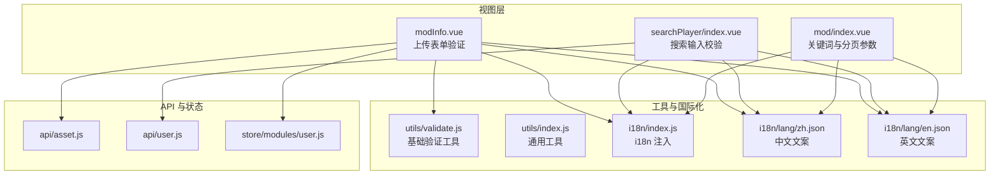
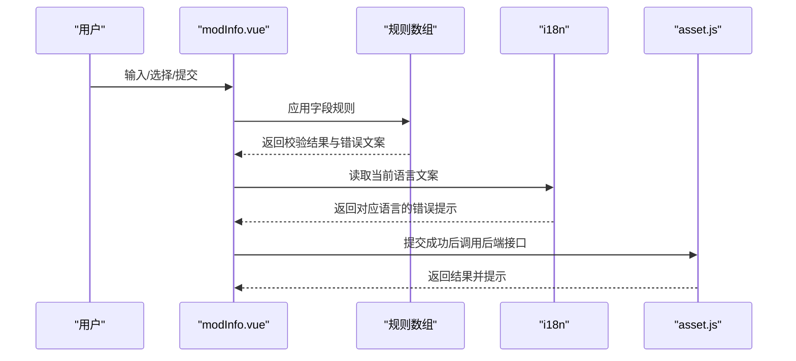
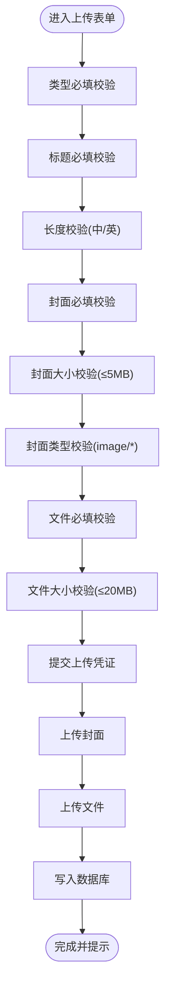
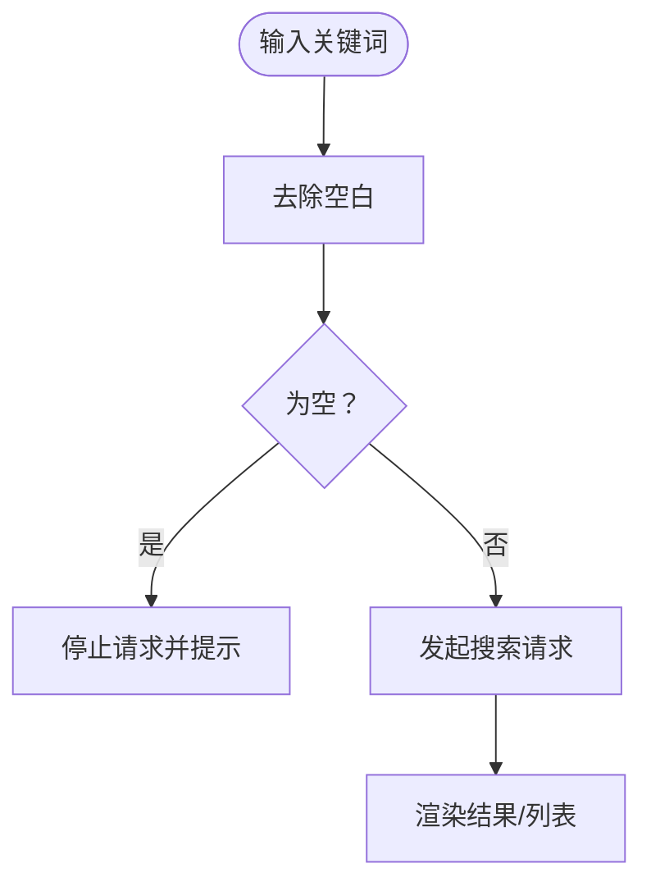
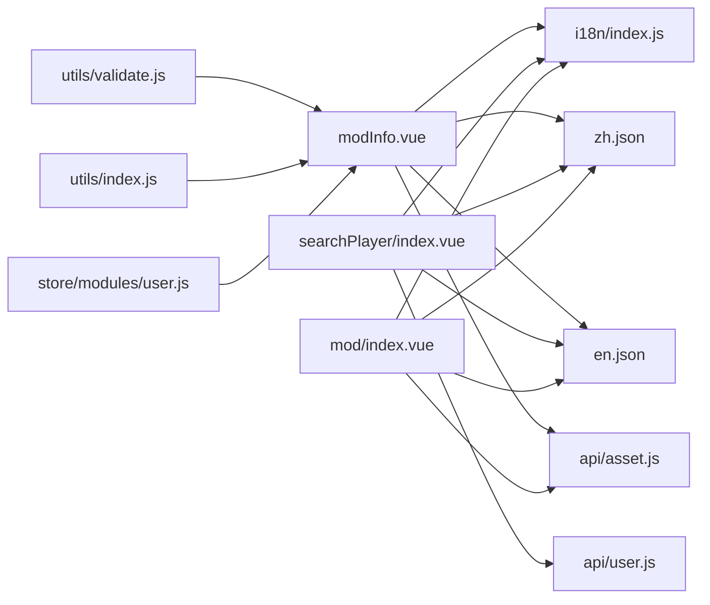

# 数据验证

<cite>
**本文引用的文件**
- [SpeedRunners.UI/src/utils/validate.js](file://SpeedRunners.UI/src/utils/validate.js)
- [SpeedRunners.UI/src/i18n/index.js](file://SpeedRunners.UI/src/i18n/index.js)
- [SpeedRunners.UI/src/i18n/lang/zh.json](file://SpeedRunners.UI/src/i18n/lang/zh.json)
- [SpeedRunners.UI/src/i18n/lang/en.json](file://SpeedRunners.UI/src/i18n/lang/en.json)
- [SpeedRunners.UI/src/views/mod/modInfo.vue](file://SpeedRunners.UI/src/views/mod/modInfo.vue)
- [SpeedRunners.UI/src/views/searchPlayer/index.vue](file://SpeedRunners.UI/src/views/searchPlayer/index.vue)
- [SpeedRunners.UI/src/views/mod/index.vue](file://SpeedRunners.UI/src/views/mod/index.vue)
- [SpeedRunners.UI/src/api/asset.js](file://SpeedRunners.UI/src/api/asset.js)
- [SpeedRunners.UI/src/api/user.js](file://SpeedRunners.UI/src/api/user.js)
- [SpeedRunners.UI/src/store/modules/user.js](file://SpeedRunners.UI/src/store/modules/user.js)
- [SpeedRunners.UI/src/main.js](file://SpeedRunners.UI/src/main.js)
- [SpeedRunners.UI/src/utils/index.js](file://SpeedRunners.UI/src/utils/index.js)
</cite>

## 目录
1. [简介](#简介)
2. [项目结构](#项目结构)
3. [核心组件](#核心组件)
4. [架构总览](#架构总览)
5. [详细组件分析](#详细组件分析)
6. [依赖关系分析](#依赖关系分析)
7. [性能考量](#性能考量)
8. [故障排查指南](#故障排查指南)
9. [结论](#结论)
10. [附录](#附录)

## 简介
本文件面向 SpeedRunnersLab 前端的数据验证体系，聚焦于表单验证与数据校验的实现机制，覆盖必填字段、格式与长度限制等常见规则；说明如何编写与使用自定义验证函数；解释验证错误信息的显示与国际化处理；给出用户注册表单、MOD 上传表单、搜索条件等典型场景的实践路径；并提供性能优化与用户体验改进建议，以及扩展与自定义验证器的实现指南。

## 项目结构
前端验证相关能力主要分布在以下模块：
- 工具与验证：utils/validate.js 提供基础验证工具；utils/index.js 提供通用工具（时间、防抖等）
- 国际化：i18n/index.js 统一注入多语言；i18n/lang/*.json 提供文案
- 视图组件：modInfo.vue 展示并实现 MOD 上传表单的多项验证规则；searchPlayer/index.vue 展示搜索输入的空值校验；mod/index.vue 展示搜索关键词与分页参数的使用
- API 层：asset.js、user.js 提供与后端交互的接口
- 状态管理：store/modules/user.js 管理用户态，影响部分验证逻辑（如登录态）

**图表来源**
- [SpeedRunners.UI/src/views/mod/modInfo.vue](file://SpeedRunners.UI/src/views/mod/modInfo.vue#L1-L266)
- [SpeedRunners.UI/src/views/searchPlayer/index.vue](file://SpeedRunners.UI/src/views/searchPlayer/index.vue#L1-L169)
- [SpeedRunners.UI/src/views/mod/index.vue](file://SpeedRunners.UI/src/views/mod/index.vue#L1-L427)
- [SpeedRunners.UI/src/utils/validate.js](file://SpeedRunners.UI/src/utils/validate.js#L1-L20)
- [SpeedRunners.UI/src/utils/index.js](file://SpeedRunners.UI/src/utils/index.js#L1-L192)
- [SpeedRunners.UI/src/i18n/index.js](file://SpeedRunners.UI/src/i18n/index.js#L1-L35)
- [SpeedRunners.UI/src/i18n/lang/zh.json](file://SpeedRunners.UI/src/i18n/lang/zh.json#L1-L220)
- [SpeedRunners.UI/src/i18n/lang/en.json](file://SpeedRunners.UI/src/i18n/lang/en.json#L1-L220)
- [SpeedRunners.UI/src/api/asset.js](file://SpeedRunners.UI/src/api/asset.js#L1-L54)
- [SpeedRunners.UI/src/api/user.js](file://SpeedRunners.UI/src/api/user.js#L1-L77)
- [SpeedRunners.UI/src/store/modules/user.js](file://SpeedRunners.UI/src/store/modules/user.js#L1-L88)

**章节来源**
- [SpeedRunners.UI/src/main.js](file://SpeedRunners.UI/src/main.js#L1-L30)

## 核心组件
- 表单验证规则集中于 modInfo.vue 的表单字段：
  - 类型选择必填
  - 标题必填且长度限制（中文 17 字，英文 30 字）
  - 封面必填、大小限制、类型限制
  - 文件必填、大小限制
- 搜索场景在 searchPlayer/index.vue 中对空输入进行短路处理
- 国际化文案通过 $t 与 $i18n.locale 动态选择，确保错误提示与界面语言一致

**章节来源**
- [SpeedRunners.UI/src/views/mod/modInfo.vue](file://SpeedRunners.UI/src/views/mod/modInfo.vue#L103-L115)
- [SpeedRunners.UI/src/views/searchPlayer/index.vue](file://SpeedRunners.UI/src/views/searchPlayer/index.vue#L104-L114)
- [SpeedRunners.UI/src/i18n/index.js](file://SpeedRunners.UI/src/i18n/index.js#L23-L33)

## 架构总览
前端验证采用“组件内声明式规则 + 国际化文案 + 工具函数”的组合模式：
- 组件内以数组形式定义字段规则，结合 Vuetify 的内置校验反馈
- 错误文案来自 i18n 语言包，根据当前语言动态渲染
- 工具函数提供基础校验（如外部链接、用户名白名单等），可复用于其他场景

**图表来源**
- [SpeedRunners.UI/src/views/mod/modInfo.vue](file://SpeedRunners.UI/src/views/mod/modInfo.vue#L103-L115)
- [SpeedRunners.UI/src/i18n/index.js](file://SpeedRunners.UI/src/i18n/index.js#L23-L33)
- [SpeedRunners.UI/src/api/asset.js](file://SpeedRunners.UI/src/api/asset.js#L29-L48)

## 详细组件分析

### MOD 上传表单验证（modInfo.vue）
- 规则要点
  - 类型选择必填：通过下拉框的 required 与规则数组共同保障
  - 标题必填且长度限制：必填 + 长度上限（中文 17、英文 30），超出时显示统一长度警告文案
  - 封面必填、大小限制（≤5MB）、类型限制（image/*）
  - 文件必填、大小限制（≤20MB）
- 国际化与文案
  - 所有错误文案通过 $t 读取，语言切换时自动更新
  - 长度上限依据 $i18n.locale 切换
- 交互与提交
  - 表单禁用状态受 valid 与 uploading 控制
  - 提交前获取上传凭证，分别上传封面与文件，完成后写入数据库并提示成功

**图表来源**
- [SpeedRunners.UI/src/views/mod/modInfo.vue](file://SpeedRunners.UI/src/views/mod/modInfo.vue#L103-L115)
- [SpeedRunners.UI/src/views/mod/modInfo.vue](file://SpeedRunners.UI/src/views/mod/modInfo.vue#L177-L246)

**章节来源**
- [SpeedRunners.UI/src/views/mod/modInfo.vue](file://SpeedRunners.UI/src/views/mod/modInfo.vue#L103-L152)
- [SpeedRunners.UI/src/i18n/lang/zh.json](file://SpeedRunners.UI/src/i18n/lang/zh.json#L56-L62)
- [SpeedRunners.UI/src/i18n/lang/en.json](file://SpeedRunners.UI/src/i18n/lang/en.json#L56-L62)

### 搜索条件验证（searchPlayer/index.vue）
- 关键点
  - 对空字符串进行短路处理，避免无效请求
  - 加载状态与骨架屏提升体验
- 适用性
  - 可作为“非表单类输入”的校验范例：前置空值判断 + 状态反馈

**图表来源**
- [SpeedRunners.UI/src/views/searchPlayer/index.vue](file://SpeedRunners.UI/src/views/searchPlayer/index.vue#L104-L114)

**章节来源**
- [SpeedRunners.UI/src/views/searchPlayer/index.vue](file://SpeedRunners.UI/src/views/searchPlayer/index.vue#L104-L114)

### 关键字搜索与分页参数（mod/index.vue）
- 关键点
  - 关键词输入与回车触发查询
  - 分页参数 pageNo/pageSize 参与列表请求
- 适用性
  - 作为“参数级校验”的参考：确保分页参数在合理范围后再请求

**章节来源**
- [SpeedRunners.UI/src/views/mod/index.vue](file://SpeedRunners.UI/src/views/mod/index.vue#L31-L40)
- [SpeedRunners.UI/src/views/mod/index.vue](file://SpeedRunners.UI/src/views/mod/index.vue#L228-L234)
- [SpeedRunners.UI/src/views/mod/index.vue](file://SpeedRunners.UI/src/views/mod/index.vue#L327-L331)

### 基础验证工具（validate.js）
- 能力
  - 外部链接判断：匹配 http/https/mailto/tel
  - 用户名白名单校验：限定合法用户名集合
- 适用性
  - 可作为自定义验证器的基础模板，扩展更多业务规则

**章节来源**
- [SpeedRunners.UI/src/utils/validate.js](file://SpeedRunners.UI/src/utils/validate.js#L9-L20)

### 国际化与错误文案（i18n）
- 能力
  - 自动识别浏览器语言并持久化
  - 通过 $t 与 $i18n.locale 动态选择语言
  - 文案覆盖常见验证提示（必填、长度、大小、类型等）
- 适用性
  - 所有验证错误文案均来自语言包，便于统一维护与扩展

**章节来源**
- [SpeedRunners.UI/src/i18n/index.js](file://SpeedRunners.UI/src/i18n/index.js#L8-L20)
- [SpeedRunners.UI/src/i18n/index.js](file://SpeedRunners.UI/src/i18n/index.js#L23-L33)
- [SpeedRunners.UI/src/i18n/lang/zh.json](file://SpeedRunners.UI/src/i18n/lang/zh.json#L56-L62)
- [SpeedRunners.UI/src/i18n/lang/en.json](file://SpeedRunners.UI/src/i18n/lang/en.json#L56-L62)

## 依赖关系分析
- 组件依赖
  - modInfo.vue 依赖 i18n 与规则数组，间接依赖语言包
  - searchPlayer/index.vue 依赖 i18n 与 API 层
  - mod/index.vue 依赖 i18n 与 API 层
- 工具与状态
  - utils/validate.js 与 utils/index.js 为通用工具
  - store/modules/user.js 提供用户态，影响登录相关验证分支

**图表来源**
- [SpeedRunners.UI/src/views/mod/modInfo.vue](file://SpeedRunners.UI/src/views/mod/modInfo.vue#L1-L266)
- [SpeedRunners.UI/src/views/searchPlayer/index.vue](file://SpeedRunners.UI/src/views/searchPlayer/index.vue#L1-L169)
- [SpeedRunners.UI/src/views/mod/index.vue](file://SpeedRunners.UI/src/views/mod/index.vue#L1-L427)
- [SpeedRunners.UI/src/i18n/index.js](file://SpeedRunners.UI/src/i18n/index.js#L1-L35)
- [SpeedRunners.UI/src/i18n/lang/zh.json](file://SpeedRunners.UI/src/i18n/lang/zh.json#L1-L220)
- [SpeedRunners.UI/src/i18n/lang/en.json](file://SpeedRunners.UI/src/i18n/lang/en.json#L1-L220)
- [SpeedRunners.UI/src/api/asset.js](file://SpeedRunners.UI/src/api/asset.js#L1-L54)
- [SpeedRunners.UI/src/api/user.js](file://SpeedRunners.UI/src/api/user.js#L1-L77)
- [SpeedRunners.UI/src/utils/validate.js](file://SpeedRunners.UI/src/utils/validate.js#L1-L20)
- [SpeedRunners.UI/src/utils/index.js](file://SpeedRunners.UI/src/utils/index.js#L1-L192)
- [SpeedRunners.UI/src/store/modules/user.js](file://SpeedRunners.UI/src/store/modules/user.js#L1-L88)

**章节来源**
- [SpeedRunners.UI/src/main.js](file://SpeedRunners.UI/src/main.js#L1-L30)

## 性能考量
- 防抖与节流
  - 使用 utils/index.js 中的防抖工具，降低高频输入带来的重渲染与请求压力
- 前置校验
  - 在搜索场景对空值进行短路，减少无效请求
- 本地化与懒加载
  - 语言包按需加载，避免一次性加载过多文案

**章节来源**
- [SpeedRunners.UI/src/utils/index.js](file://SpeedRunners.UI/src/utils/index.js#L159-L191)
- [SpeedRunners.UI/src/views/searchPlayer/index.vue](file://SpeedRunners.UI/src/views/searchPlayer/index.vue#L104-L114)

## 故障排查指南
- 常见问题
  - 语言切换后文案未更新：确认 i18n 注入顺序与 $i18n.locale 是否正确
  - 表单提交按钮不可用：检查 valid 与 uploading 状态是否阻断
  - 文件上传失败：核对大小与类型规则，查看错误回调中的错误信息
- 定位建议
  - 在组件内打印当前规则数组与语言包键值，确认 $t 解析
  - 在 API 层打印请求参数，确保分页与必填项符合预期

**章节来源**
- [SpeedRunners.UI/src/i18n/index.js](file://SpeedRunners.UI/src/i18n/index.js#L23-L33)
- [SpeedRunners.UI/src/views/mod/modInfo.vue](file://SpeedRunners.UI/src/views/mod/modInfo.vue#L54-L58)
- [SpeedRunners.UI/src/api/asset.js](file://SpeedRunners.UI/src/api/asset.js#L29-L48)

## 结论
SpeedRunnersLab 前端验证体系以组件内声明式规则为核心，结合 i18n 实现多语言错误提示，并通过工具函数与状态管理形成清晰的职责边界。现有实现覆盖了常见表单验证场景，具备良好的可扩展性与可维护性。后续可在自定义验证器、服务端协同校验、更细粒度的性能优化等方面继续增强。

## 附录

### 自定义验证器实现指南
- 基于 validate.js 的模式扩展
  - 参考外部链接与用户名白名单的实现思路，封装新的校验函数
  - 将新函数暴露为工具函数，供组件内规则数组复用
- 规则数组组织
  - 将多个规则组合为数组，利用 Vuetify 的规则链逐项校验
  - 错误文案统一通过 $t 读取，确保国际化一致性

**章节来源**
- [SpeedRunners.UI/src/utils/validate.js](file://SpeedRunners.UI/src/utils/validate.js#L9-L20)

### 验证场景示例（路径指引）
- 用户注册表单
  - 可参考 MOD 上传表单的规则组织方式，将必填、长度、格式等规则以数组形式声明
  - 使用 $t 与 $i18n.locale 动态渲染错误文案
  - 示例路径：[modInfo.vue 规则定义](file://SpeedRunners.UI/src/views/mod/modInfo.vue#L103-L115)
- MOD 上传表单
  - 必填字段、长度限制、文件大小与类型限制
  - 示例路径：[modInfo.vue 表单与规则](file://SpeedRunners.UI/src/views/mod/modInfo.vue#L103-L152)
- 搜索条件
  - 关键词空值短路与加载状态反馈
  - 示例路径：[searchPlayer/index.vue 搜索逻辑](file://SpeedRunners.UI/src/views/searchPlayer/index.vue#L104-L114)