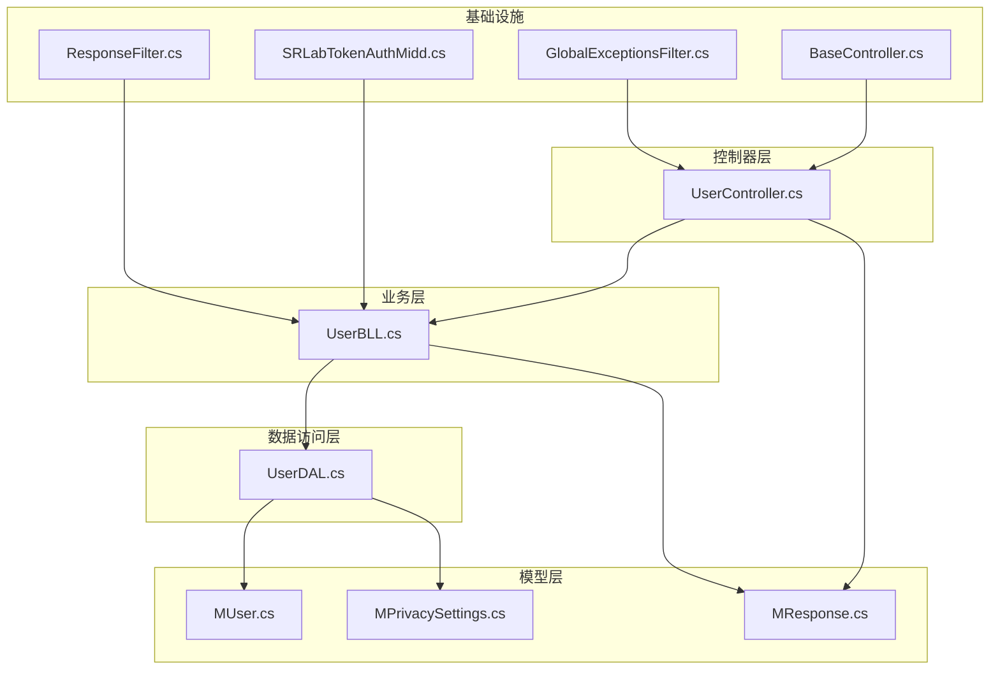
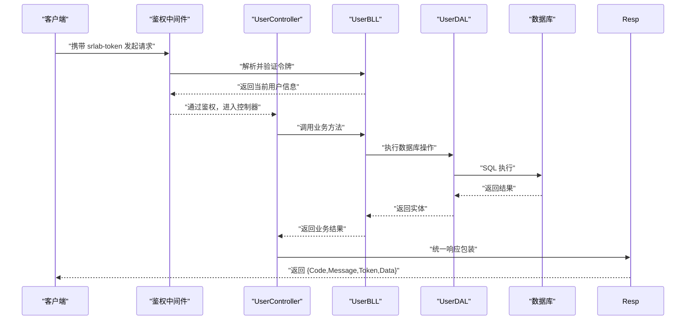
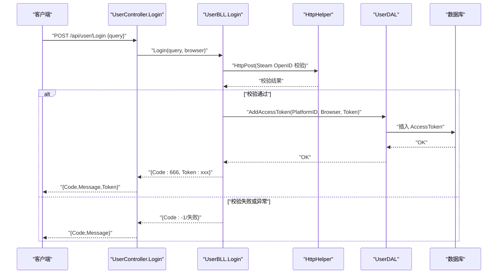
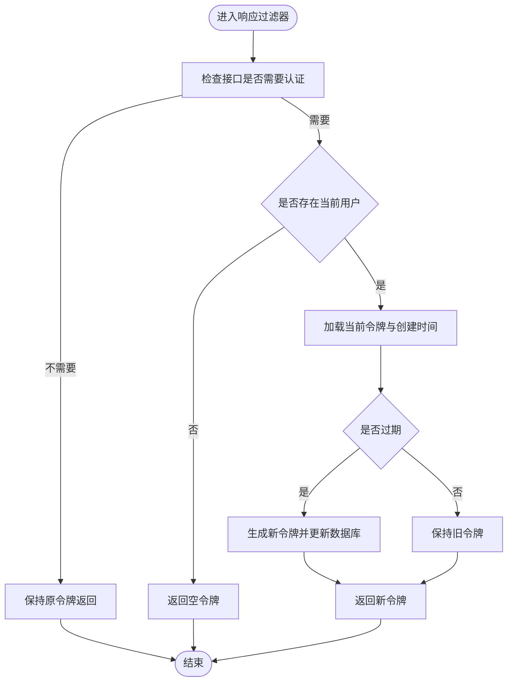
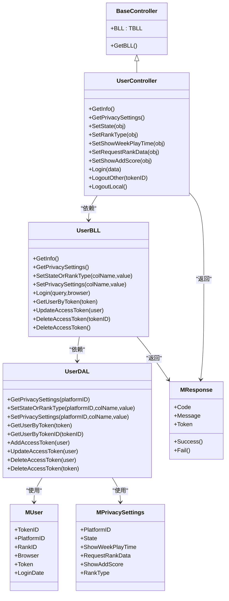

# 用户 API 模块

<cite>
**本文引用的文件**
- [SpeedRunners.API/SpeedRunners/Controllers/UserController.cs](file://SpeedRunners.API/SpeedRunners/Controllers/UserController.cs)
- [SpeedRunners.API/SpeedRunners.BLL/UserBLL.cs](file://SpeedRunners.API/SpeedRunners.BLL/UserBLL.cs)
- [SpeedRunners.API/SpeedRunners.DAL/UserDAL.cs](file://SpeedRunners.API/SpeedRunners.DAL/UserDAL.cs)
- [SpeedRunners.API/SpeedRunners.Model/MUser.cs](file://SpeedRunners.API/SpeedRunners.Model/MUser.cs)
- [SpeedRunners.API/SpeedRunners.Model/User/MPrivacySettings.cs](file://SpeedRunners.API/SpeedRunners.Model/User/MPrivacySettings.cs)
- [SpeedRunners.API/SpeedRunners/Controllers/BaseController.cs](file://SpeedRunners.API/SpeedRunners/Controllers/BaseController.cs)
- [SpeedRunners.API/SpeedRunners/Middleware/SRLabTokenAuthMidd.cs](file://SpeedRunners.API/SpeedRunners/Middleware/SRLabTokenAuthMidd.cs)
- [SpeedRunners.API/SpeedRunners/Filter/GlobalExceptionsFilter.cs](file://SpeedRunners.API/SpeedRunners/Filter/GlobalExceptionsFilter.cs)
- [SpeedRunners.API/SpeedRunners/Filter/ResponseFilter.cs](file://SpeedRunners.API/SpeedRunners/Filter/ResponseFilter.cs)
- [SpeedRunners.API/SpeedRunners.Model/MResponse.cs](file://SpeedRunners.API/SpeedRunners.Model/MResponse.cs)
</cite>

## 目录
1. [简介](#简介)
2. [项目结构](#项目结构)
3. [核心组件](#核心组件)
4. [架构总览](#架构总览)
5. [详细组件分析](#详细组件分析)
6. [依赖关系分析](#依赖关系分析)
7. [性能考虑](#性能考虑)
8. [故障排查指南](#故障排查指南)
9. [结论](#结论)
10. [附录](#附录)

## 简介
本文件面向 SpeedRunnersLab 的“用户 API 模块”，系统性梳理用户相关接口的封装与实现，覆盖登录、登出（单点与其他会话）、个人信息查询、隐私设置与状态变更等能力。文档从架构、数据流、处理逻辑、错误处理、性能与调试等方面进行深入说明，并提供接口调用示例与排障建议。

## 项目结构
用户模块位于后端 API 工程中，采用经典的分层架构：
- 控制器层：暴露 REST 风格接口，负责路由与参数绑定
- 业务层（BLL）：编排业务逻辑，协调 DAL 与工具类
- 数据访问层（DAL）：封装数据库操作
- 模型层：定义请求/响应与领域模型
- 中间件与过滤器：统一鉴权、响应包装与异常处理

图表来源
- [SpeedRunners.API/SpeedRunners/Controllers/UserController.cs](file://SpeedRunners.API/SpeedRunners/Controllers/UserController.cs#L1-L58)
- [SpeedRunners.API/SpeedRunners.BLL/UserBLL.cs](file://SpeedRunners.API/SpeedRunners.BLL/UserBLL.cs#L1-L153)
- [SpeedRunners.API/SpeedRunners.DAL/UserDAL.cs](file://SpeedRunners.API/SpeedRunners.DAL/UserDAL.cs#L1-L85)
- [SpeedRunners.API/SpeedRunners.Model/MUser.cs](file://SpeedRunners.API/SpeedRunners.Model/MUser.cs#L1-L35)
- [SpeedRunners.API/SpeedRunners.Model/User/MPrivacySettings.cs](file://SpeedRunners.API/SpeedRunners.Model/User/MPrivacySettings.cs#L1-L23)
- [SpeedRunners.API/SpeedRunners/Controllers/BaseController.cs](file://SpeedRunners.API/SpeedRunners/Controllers/BaseController.cs#L1-L26)
- [SpeedRunners.API/SpeedRunners/Middleware/SRLabTokenAuthMidd.cs](file://SpeedRunners.API/SpeedRunners/Middleware/SRLabTokenAuthMidd.cs#L1-L123)
- [SpeedRunners.API/SpeedRunners/Filter/ResponseFilter.cs](file://SpeedRunners.API/SpeedRunners/Filter/ResponseFilter.cs#L1-L114)
- [SpeedRunners.API/SpeedRunners/Filter/GlobalExceptionsFilter.cs](file://SpeedRunners.API/SpeedRunners/Filter/GlobalExceptionsFilter.cs#L1-L54)
- [SpeedRunners.API/SpeedRunners.Model/MResponse.cs](file://SpeedRunners.API/SpeedRunners.Model/MResponse.cs#L1-L42)

章节来源
- [SpeedRunners.API/SpeedRunners/Controllers/UserController.cs](file://SpeedRunners.API/SpeedRunners/Controllers/UserController.cs#L1-L58)
- [SpeedRunners.API/SpeedRunners.BLL/UserBLL.cs](file://SpeedRunners.API/SpeedRunners.BLL/UserBLL.cs#L1-L153)
- [SpeedRunners.API/SpeedRunners.DAL/UserDAL.cs](file://SpeedRunners.API/SpeedRunners.DAL/UserDAL.cs#L1-L85)
- [SpeedRunners.API/SpeedRunners.Model/MUser.cs](file://SpeedRunners.API/SpeedRunners.Model/MUser.cs#L1-L35)
- [SpeedRunners.API/SpeedRunners.Model/User/MPrivacySettings.cs](file://SpeedRunners.API/SpeedRunners.Model/User/MPrivacySettings.cs#L1-L23)
- [SpeedRunners.API/SpeedRunners/Controllers/BaseController.cs](file://SpeedRunners.API/SpeedRunners/Controllers/BaseController.cs#L1-L26)
- [SpeedRunners.API/SpeedRunners/Middleware/SRLabTokenAuthMidd.cs](file://SpeedRunners.API/SpeedRunners/Middleware/SRLabTokenAuthMidd.cs#L1-L123)
- [SpeedRunners.API/SpeedRunners/Filter/ResponseFilter.cs](file://SpeedRunners.API/SpeedRunners/Filter/ResponseFilter.cs#L1-L114)
- [SpeedRunners.API/SpeedRunners/Filter/GlobalExceptionsFilter.cs](file://SpeedRunners.API/SpeedRunners/Filter/GlobalExceptionsFilter.cs#L1-L54)
- [SpeedRunners.API/SpeedRunners.Model/MResponse.cs](file://SpeedRunners.API/SpeedRunners.Model/MResponse.cs#L1-L42)

## 核心组件
- 控制器：提供用户相关接口，如登录、登出、获取信息、隐私设置与状态变更等
- 业务层：封装登录校验、令牌刷新、权限检查、数据库事务包装等
- 数据层：封装对 AccessToken、RankInfo、PrivacySettings 等表的操作
- 模型：MUser、MPrivacySettings、MResponse 等
- 中间件与过滤器：统一鉴权、响应包装、异常捕获

章节来源
- [SpeedRunners.API/SpeedRunners/Controllers/UserController.cs](file://SpeedRunners.API/SpeedRunners/Controllers/UserController.cs#L1-L58)
- [SpeedRunners.API/SpeedRunners.BLL/UserBLL.cs](file://SpeedRunners.API/SpeedRunners.BLL/UserBLL.cs#L1-L153)
- [SpeedRunners.API/SpeedRunners.DAL/UserDAL.cs](file://SpeedRunners.API/SpeedRunners.DAL/UserDAL.cs#L1-L85)
- [SpeedRunners.API/SpeedRunners.Model/MUser.cs](file://SpeedRunners.API/SpeedRunners.Model/MUser.cs#L1-L35)
- [SpeedRunners.API/SpeedRunners.Model/User/MPrivacySettings.cs](file://SpeedRunners.API/SpeedRunners.Model/User/MPrivacySettings.cs#L1-L23)
- [SpeedRunners.API/SpeedRunners/Controllers/BaseController.cs](file://SpeedRunners.API/SpeedRunners/Controllers/BaseController.cs#L1-L26)
- [SpeedRunners.API/SpeedRunners/Middleware/SRLabTokenAuthMidd.cs](file://SpeedRunners.API/SpeedRunners/Middleware/SRLabTokenAuthMidd.cs#L1-L123)
- [SpeedRunners.API/SpeedRunners/Filter/ResponseFilter.cs](file://SpeedRunners.API/SpeedRunners/Filter/ResponseFilter.cs#L1-L114)
- [SpeedRunners.API/SpeedRunners/Filter/GlobalExceptionsFilter.cs](file://SpeedRunners.API/SpeedRunners/Filter/GlobalExceptionsFilter.cs#L1-L54)
- [SpeedRunners.API/SpeedRunners.Model/MResponse.cs](file://SpeedRunners.API/SpeedRunners.Model/MResponse.cs#L1-L42)

## 架构总览
用户模块遵循“控制器-业务-数据-模型”的分层设计，配合中间件与过滤器完成鉴权、响应统一与异常处理。

图表来源
- [SpeedRunners.API/SpeedRunners/Middleware/SRLabTokenAuthMidd.cs](file://SpeedRunners.API/SpeedRunners/Middleware/SRLabTokenAuthMidd.cs#L31-L101)
- [SpeedRunners.API/SpeedRunners/Controllers/UserController.cs](file://SpeedRunners.API/SpeedRunners/Controllers/UserController.cs#L42-L55)
- [SpeedRunners.API/SpeedRunners.BLL/UserBLL.cs](file://SpeedRunners.API/SpeedRunners.BLL/UserBLL.cs#L60-L93)
- [SpeedRunners.API/SpeedRunners.DAL/UserDAL.cs](file://SpeedRunners.API/SpeedRunners.DAL/UserDAL.cs#L53-L82)
- [SpeedRunners.API/SpeedRunners/Filter/ResponseFilter.cs](file://SpeedRunners.API/SpeedRunners/Filter/ResponseFilter.cs#L24-L111)

## 详细组件分析

### 登录接口
- 接口路径：POST /api/user/Login
- 请求头：无强制要求，但会读取 User-Agent 作为浏览器标识
- 请求体：包含 Steam OpenID 查询字符串
- 返回：统一响应对象，包含令牌字段
- 处理流程：
  - 替换 openid.mode 为 check_authentication 并向 Steam OpenID 校验地址发起请求
  - 若校验通过，提取 SteamID，生成新令牌并写入 AccessToken 表
  - 返回成功响应并附带新令牌
- 错误处理：
  - 校验超时：返回特定错误码
  - 校验失败：返回通用失败

图表来源
- [SpeedRunners.API/SpeedRunners/Controllers/UserController.cs](file://SpeedRunners.API/SpeedRunners/Controllers/UserController.cs#L42-L47)
- [SpeedRunners.API/SpeedRunners.BLL/UserBLL.cs](file://SpeedRunners.API/SpeedRunners.BLL/UserBLL.cs#L60-L93)
- [SpeedRunners.API/SpeedRunners.DAL/UserDAL.cs](file://SpeedRunners.API/SpeedRunners.DAL/UserDAL.cs#L63-L67)

章节来源
- [SpeedRunners.API/SpeedRunners/Controllers/UserController.cs](file://SpeedRunners.API/SpeedRunners/Controllers/UserController.cs#L42-L47)
- [SpeedRunners.API/SpeedRunners.BLL/UserBLL.cs](file://SpeedRunners.API/SpeedRunners.BLL/UserBLL.cs#L60-L93)
- [SpeedRunners.API/SpeedRunners.DAL/UserDAL.cs](file://SpeedRunners.API/SpeedRunners.DAL/UserDAL.cs#L63-L67)
- [SpeedRunners.API/SpeedRunners.Model/MResponse.cs](file://SpeedRunners.API/SpeedRunners.Model/MResponse.cs#L11-L21)

### 获取用户信息
- 接口路径：GET /api/user/GetInfo
- 权限：需要已登录
- 返回：当前用户的段位/排行相关信息
- 实现要点：通过当前用户 PlatformID 查询排行列表并返回第一条

章节来源
- [SpeedRunners.API/SpeedRunners/Controllers/UserController.cs](file://SpeedRunners.API/SpeedRunners/Controllers/UserController.cs#L14-L16)
- [SpeedRunners.API/SpeedRunners.BLL/UserBLL.cs](file://SpeedRunners.API/SpeedRunners.BLL/UserBLL.cs#L55-L58)

### 获取隐私设置
- 接口路径：GET /api/user/GetPrivacySettings
- 权限：需要已登录
- 返回：隐私设置对象（含状态、是否展示周游玩时长、是否允许请求排行数据、是否展示加分等）
- 实现要点：
  - 若不存在对应记录则初始化插入默认值
  - 合并 RankInfo 与 PrivacySettings 的字段

章节来源
- [SpeedRunners.API/SpeedRunners/Controllers/UserController.cs](file://SpeedRunners.API/SpeedRunners/Controllers/UserController.cs#L18-L20)
- [SpeedRunners.API/SpeedRunners.BLL/UserBLL.cs](file://SpeedRunners.API/SpeedRunners.BLL/UserBLL.cs#L26-L33)
- [SpeedRunners.API/SpeedRunners.DAL/UserDAL.cs](file://SpeedRunners.API/SpeedRunners.DAL/UserDAL.cs#L13-L35)
- [SpeedRunners.API/SpeedRunners.Model/User/MPrivacySettings.cs](file://SpeedRunners.API/SpeedRunners.Model/User/MPrivacySettings.cs#L7-L21)

### 设置状态（公开/隐藏）
- 接口路径：POST /api/user/SetState
- 权限：需要已登录
- 请求体：包含 value 字段（整数）
- 效果：更新 RankInfo 的 State 字段

章节来源
- [SpeedRunners.API/SpeedRunners/Controllers/UserController.cs](file://SpeedRunners.API/SpeedRunners/Controllers/UserController.cs#L22-L24)
- [SpeedRunners.API/SpeedRunners.BLL/UserBLL.cs](file://SpeedRunners.API/SpeedRunners.BLL/UserBLL.cs#L35-L41)
- [SpeedRunners.API/SpeedRunners.DAL/UserDAL.cs](file://SpeedRunners.API/SpeedRunners.DAL/UserDAL.cs#L37-L40)

### 设置段位类型（公开/隐藏）
- 接口路径：POST /api/user/SetRankType
- 权限：需要已登录
- 请求体：包含 value 字段（整数）
- 效果：更新 RankInfo 的 RankType 字段

章节来源
- [SpeedRunners.API/SpeedRunners/Controllers/UserController.cs](file://SpeedRunners.API/SpeedRunners/Controllers/UserController.cs#L26-L28)
- [SpeedRunners.API/SpeedRunners.BLL/UserBLL.cs](file://SpeedRunners.API/SpeedRunners.BLL/UserBLL.cs#L35-L41)
- [SpeedRunners.API/SpeedRunners.DAL/UserDAL.cs](file://SpeedRunners.API/SpeedRunners.DAL/UserDAL.cs#L37-L40)

### 设置隐私选项
- 接口路径：POST /api/user/SetShowWeekPlayTime、SetRequestRankData、SetShowAddScore
- 权限：需要已登录
- 请求体：包含 value 字段（整数）
- 效果：
  - ShowWeekPlayTime：更新 PrivacySettings.ShowWeekPlayTime
  - RequestRankData：更新 PrivacySettings.RequestRankData，并根据值联动 RankType
  - ShowAddScore：更新 PrivacySettings.ShowAddScore

章节来源
- [SpeedRunners.API/SpeedRunners/Controllers/UserController.cs](file://SpeedRunners.API/SpeedRunners/Controllers/UserController.cs#L30-L40)
- [SpeedRunners.API/SpeedRunners.BLL/UserBLL.cs](file://SpeedRunners.API/SpeedRunners.BLL/UserBLL.cs#L43-L49)
- [SpeedRunners.API/SpeedRunners.DAL/UserDAL.cs](file://SpeedRunners.API/SpeedRunners.DAL/UserDAL.cs#L42-L51)

### 单点登出（其他会话）
- 接口路径：GET /api/user/LogoutOther/{tokenID}
- 权限：需要已登录
- 参数：tokenID（整数）
- 效果：删除指定 TokenID 的登录记录，支持跨设备登出
- 权限校验：
  - 平台 ID 必须一致
  - 当前用户登录时间必须早于目标会话，否则拒绝低权限操作

章节来源
- [SpeedRunners.API/SpeedRunners/Controllers/UserController.cs](file://SpeedRunners.API/SpeedRunners/Controllers/UserController.cs#L49-L51)
- [SpeedRunners.API/SpeedRunners.BLL/UserBLL.cs](file://SpeedRunners.API/SpeedRunners.BLL/UserBLL.cs#L121-L141)
- [SpeedRunners.API/SpeedRunners.DAL/UserDAL.cs](file://SpeedRunners.API/SpeedRunners.DAL/UserDAL.cs#L58-L61)

### 本地登出（当前会话）
- 接口路径：GET /api/user/LogoutLocal
- 权限：需要已登录
- 效果：删除当前会话令牌，清空当前用户平台 ID

章节来源
- [SpeedRunners.API/SpeedRunners/Controllers/UserController.cs](file://SpeedRunners.API/SpeedRunners/Controllers/UserController.cs#L53-L55)
- [SpeedRunners.API/SpeedRunners.BLL/UserBLL.cs](file://SpeedRunners.API/SpeedRunners.BLL/UserBLL.cs#L143-L150)
- [SpeedRunners.API/SpeedRunners.DAL/UserDAL.cs](file://SpeedRunners.API/SpeedRunners.DAL/UserDAL.cs#L79-L82)

### 令牌刷新机制
- 触发时机：每次请求经过响应过滤器时，若当前用户已登录且需要认证
- 刷新条件：当前令牌创建时间超过配置的刷新间隔，则生成新令牌并回写数据库
- 返回策略：统一在响应中返回最新令牌

图表来源
- [SpeedRunners.API/SpeedRunners/Filter/ResponseFilter.cs](file://SpeedRunners.API/SpeedRunners/Filter/ResponseFilter.cs#L57-L111)
- [SpeedRunners.API/SpeedRunners.BLL/UserBLL.cs](file://SpeedRunners.API/SpeedRunners.BLL/UserBLL.cs#L95-L119)
- [SpeedRunners.API/SpeedRunners.DAL/UserDAL.cs](file://SpeedRunners.API/SpeedRunners.DAL/UserDAL.cs#L69-L72)

章节来源
- [SpeedRunners.API/SpeedRunners/Filter/ResponseFilter.cs](file://SpeedRunners.API/SpeedRunners/Filter/ResponseFilter.cs#L24-L111)
- [SpeedRunners.API/SpeedRunners.BLL/UserBLL.cs](file://SpeedRunners.API/SpeedRunners.BLL/UserBLL.cs#L95-L119)
- [SpeedRunners.API/SpeedRunners.DAL/UserDAL.cs](file://SpeedRunners.API/SpeedRunners.DAL/UserDAL.cs#L69-L72)

### 鉴权与中间件
- 鉴权中间件会读取请求头 srlab-token，解析并填充当前用户上下文
- 对标注了 [User] 特性的接口，若缺少令牌则直接返回未登录错误
- 对无需认证的接口，直接放行

章节来源
- [SpeedRunners.API/SpeedRunners/Middleware/SRLabTokenAuthMidd.cs](file://SpeedRunners.API/SpeedRunners/Middleware/SRLabTokenAuthMidd.cs#L31-L101)
- [SpeedRunners.API/SpeedRunners/Controllers/UserController.cs](file://SpeedRunners.API/SpeedRunners/Controllers/UserController.cs#L14-L16)

### 响应统一与异常处理
- 响应过滤器将所有控制器返回值统一包装为 MResponse，并附加令牌
- 全局异常过滤器在生产环境捕获未处理异常，记录日志并返回统一错误结构

章节来源
- [SpeedRunners.API/SpeedRunners/Filter/ResponseFilter.cs](file://SpeedRunners.API/SpeedRunners/Filter/ResponseFilter.cs#L24-L50)
- [SpeedRunners.API/SpeedRunners/Filter/GlobalExceptionsFilter.cs](file://SpeedRunners.API/SpeedRunners/Filter/GlobalExceptionsFilter.cs#L31-L51)
- [SpeedRunners.API/SpeedRunners.Model/MResponse.cs](file://SpeedRunners.API/SpeedRunners.Model/MResponse.cs#L3-L27)

## 依赖关系分析

图表来源
- [SpeedRunners.API/SpeedRunners/Controllers/BaseController.cs](file://SpeedRunners.API/SpeedRunners/Controllers/BaseController.cs#L10-L23)
- [SpeedRunners.API/SpeedRunners/Controllers/UserController.cs](file://SpeedRunners.API/SpeedRunners/Controllers/UserController.cs#L12-L56)
- [SpeedRunners.API/SpeedRunners.BLL/UserBLL.cs](file://SpeedRunners.API/SpeedRunners.BLL/UserBLL.cs#L16-L24)
- [SpeedRunners.API/SpeedRunners.DAL/UserDAL.cs](file://SpeedRunners.API/SpeedRunners.DAL/UserDAL.cs#L9-L11)
- [SpeedRunners.API/SpeedRunners.Model/MUser.cs](file://SpeedRunners.API/SpeedRunners.Model/MUser.cs#L8-L34)
- [SpeedRunners.API/SpeedRunners.Model/User/MPrivacySettings.cs](file://SpeedRunners.API/SpeedRunners.Model/User/MPrivacySettings.cs#L7-L21)
- [SpeedRunners.API/SpeedRunners.Model/MResponse.cs](file://SpeedRunners.API/SpeedRunners.Model/MResponse.cs#L3-L27)

## 性能考虑
- 令牌刷新：仅在过期时生成新令牌，避免频繁写库
- 数据库访问：隐私设置读取时若不存在自动初始化，减少重复初始化成本
- 异常处理：生产环境统一异常捕获与日志记录，降低异常传播开销
- 建议：
  - 合理设置令牌刷新间隔
  - 对高频接口开启缓存（如隐私设置）
  - 使用连接池与参数化 SQL，避免 SQL 注入与资源浪费

## 故障排查指南
- 登录失败
  - 检查 Steam OpenID 校验是否超时或返回无效
  - 确认请求体中的 query 是否正确
- 未登录/权限不足
  - 确认请求头是否携带 srlab-token
  - 检查令牌是否过期或被刷新
  - 对于登出其他会话，确认当前用户登录时间与目标会话的时间关系
- 响应异常
  - 生产环境异常会被全局过滤器捕获并记录日志
  - 检查日志输出定位具体接口与参数

章节来源
- [SpeedRunners.API/SpeedRunners.BLL/UserBLL.cs](file://SpeedRunners.API/SpeedRunners.BLL/UserBLL.cs#L60-L93)
- [SpeedRunners.API/SpeedRunners/Middleware/SRLabTokenAuthMidd.cs](file://SpeedRunners.API/SpeedRunners/Middleware/SRLabTokenAuthMidd.cs#L31-L101)
- [SpeedRunners.API/SpeedRunners/Filter/GlobalExceptionsFilter.cs](file://SpeedRunners.API/SpeedRunners/Filter/GlobalExceptionsFilter.cs#L31-L51)

## 结论
用户 API 模块以清晰的分层设计实现了登录、隐私设置、状态变更与多会话管理等核心功能。通过中间件与过滤器统一鉴权与响应，结合数据库层的初始化与更新策略，保证了接口的一致性与可维护性。建议在生产环境中关注令牌刷新策略与异常日志，持续优化高频接口的性能与稳定性。

## 附录

### 接口调用示例（步骤说明）
- 登录
  - 方法：POST
  - 路径：/api/user/Login
  - 请求头：无强制要求，服务端会读取 User-Agent
  - 请求体：包含 Steam OpenID 查询字符串
  - 成功返回：包含令牌字段的统一响应
- 获取信息
  - 方法：GET
  - 路径：/api/user/GetInfo
  - 需要：已登录
  - 返回：用户排行信息
- 获取隐私设置
  - 方法：GET
  - 路径：/api/user/GetPrivacySettings
  - 需要：已登录
  - 返回：隐私设置对象
- 设置状态
  - 方法：POST
  - 路径：/api/user/SetState
  - 需要：已登录
  - 请求体：value（整数）
- 设置段位类型
  - 方法：POST
  - 路径：/api/user/SetRankType
  - 需要：已登录
  - 请求体：value（整数）
- 设置隐私选项
  - 方法：POST
  - 路径：/api/user/SetShowWeekPlayTime 或 /api/user/SetRequestRankData 或 /api/user/SetShowAddScore
  - 需要：已登录
  - 请求体：value（整数）
- 单点登出
  - 方法：GET
  - 路径：/api/user/LogoutOther/{tokenID}
  - 需要：已登录
  - 参数：tokenID（整数）
- 本地登出
  - 方法：GET
  - 路径：/api/user/LogoutLocal
  - 需要：已登录

章节来源
- [SpeedRunners.API/SpeedRunners/Controllers/UserController.cs](file://SpeedRunners.API/SpeedRunners/Controllers/UserController.cs#L14-L55)