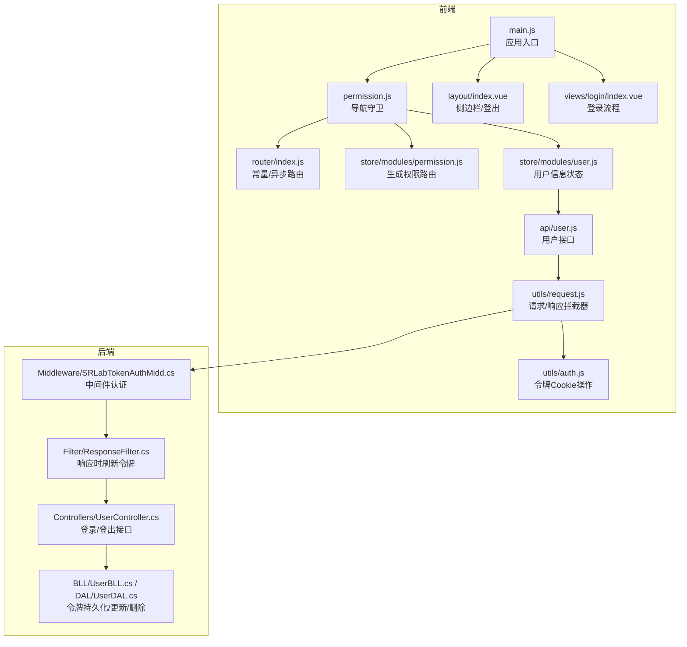
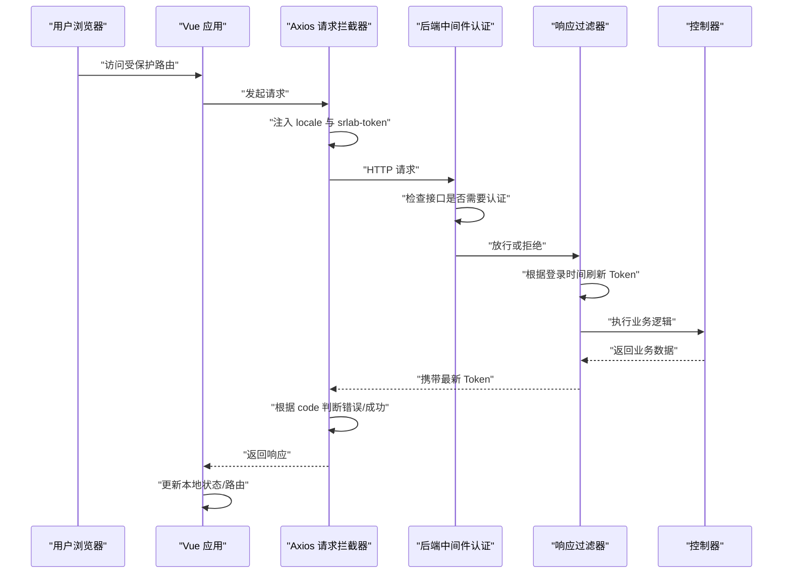
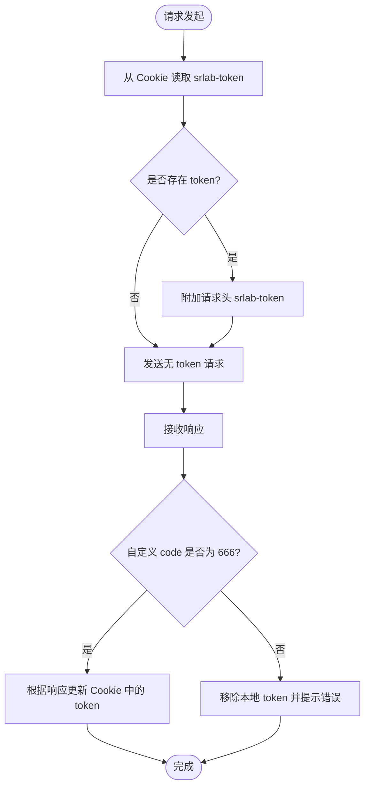
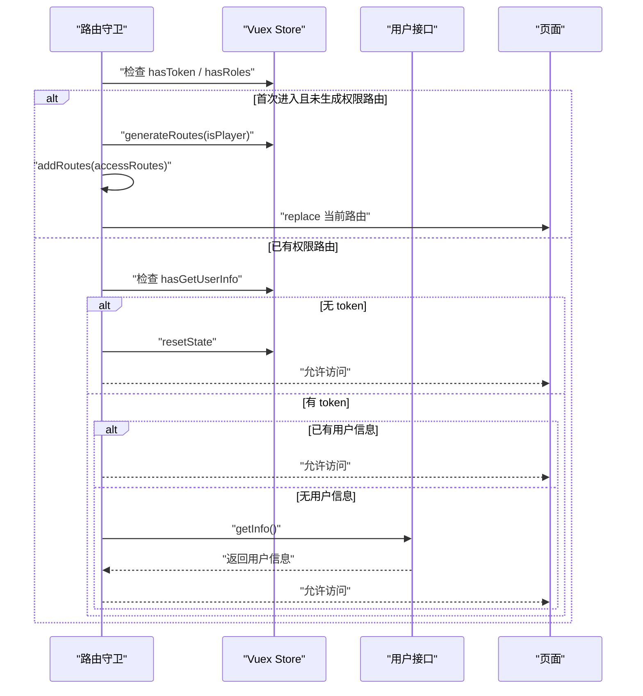
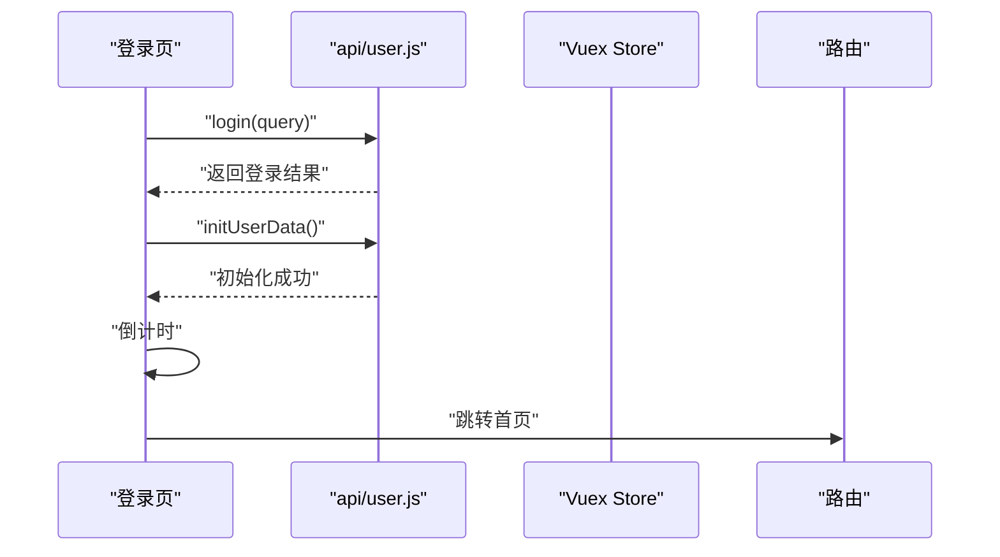
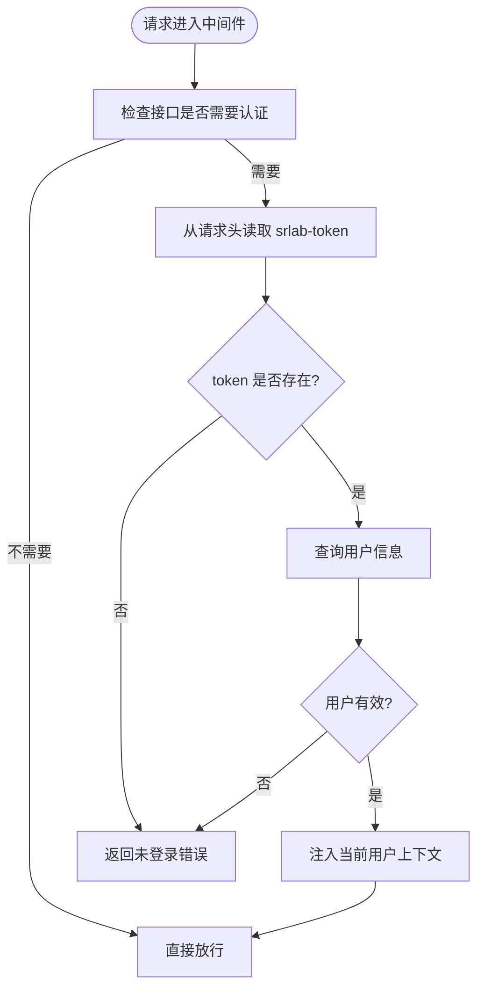
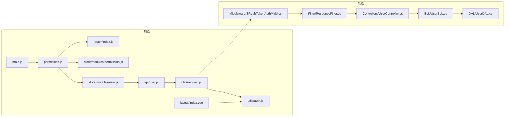

# 认证系统

<cite>
**本文引用的文件**
- [SpeedRunners.UI/src/utils/auth.js](file://SpeedRunners.UI/src/utils/auth.js)
- [SpeedRunners.UI/src/utils/request.js](file://SpeedRunners.UI/src/utils/request.js)
- [SpeedRunners.UI/src/store/modules/user.js](file://SpeedRunners.UI/src/store/modules/user.js)
- [SpeedRunners.UI/src/store/modules/permission.js](file://SpeedRunners.UI/src/store/modules/permission.js)
- [SpeedRunners.UI/src/store/getters.js](file://SpeedRunners.UI/src/store/getters.js)
- [SpeedRunners.UI/src/api/user.js](file://SpeedRunners.UI/src/api/user.js)
- [SpeedRunners.UI/src/views/login/index.vue](file://SpeedRunners.UI/src/views/login/index.vue)
- [SpeedRunners.UI/src/layout/index.vue](file://SpeedRunners.UI/src/layout/index.vue)
- [SpeedRunners.UI/src/permission.js](file://SpeedRunners.UI/src/permission.js)
- [SpeedRunners.UI/src/router/index.js](file://SpeedRunners.UI/src/router/index.js)
- [SpeedRunners.UI/src/main.js](file://SpeedRunners.UI/src/main.js)
- [SpeedRunners.UI/.env.development](file://SpeedRunners.UI/.env.development)
- [SpeedRunners.UI/.env.production](file://SpeedRunners.UI/.env.production)
- [SpeedRunners.API/SpeedRunners/Middleware/SRLabTokenAuthMidd.cs](file://SpeedRunners.API/SpeedRunners/Middleware/SRLabTokenAuthMidd.cs)
- [SpeedRunners.API/SpeedRunners/Filter/ResponseFilter.cs](file://SpeedRunners.API/SpeedRunners/Filter/ResponseFilter.cs)
- [SpeedRunners.API/SpeedRunners.BLL/UserBLL.cs](file://SpeedRunners.API/SpeedRunners.BLL/UserBLL.cs)
- [SpeedRunners.API/SpeedRunners.DAL/UserDAL.cs](file://SpeedRunners.API/SpeedRunners.DAL/UserDAL.cs)
- [SpeedRunners.API/SpeedRunners/Controllers/UserController.cs](file://SpeedRunners.API/SpeedRunners/Controllers/UserController.cs)
</cite>

## 目录
1. [简介](#简介)
2. [项目结构](#项目结构)
3. [核心组件](#核心组件)
4. [架构总览](#架构总览)
5. [组件详解](#组件详解)
6. [依赖关系分析](#依赖关系分析)
7. [性能考量](#性能考量)
8. [故障排查指南](#故障排查指南)
9. [结论](#结论)
10. [附录](#附录)

## 简介
本文件面向 SpeedRunnersLab 前端认证系统，围绕基于 Cookie 的令牌（srlab-token）传递与刷新机制，系统性阐述以下主题：
- 登录状态管理与页面刷新后的状态恢复
- 令牌存储策略与自动刷新逻辑
- 用户信息获取与缓存、权限路由生成
- 登出流程与本地状态清理
- 在组件中使用认证状态与权限控制的最佳实践
- 认证失败处理与用户体验优化建议

该系统采用前端通过 Cookie 持有令牌、后端统一中间件校验与响应时刷新令牌的协作模式，并结合 Vue Router 的导航守卫完成权限路由与用户信息的按需加载。

## 项目结构
前端认证相关的关键目录与文件：
- 工具层：auth.js（令牌读取/写入/删除、Steam 登录跳转）、request.js（Axios 请求拦截器与响应拦截器）
- 状态层：store/modules/user.js（用户信息状态）、store/modules/permission.js（权限路由生成）、store/getters.js（全局派生状态）
- API 层：api/user.js（用户相关接口封装）
- 路由与守卫：router/index.js（常量路由/异步路由/重置路由）、permission.js（导航守卫）
- 视图层：views/login/index.vue（登录流程视图）、layout/index.vue（侧边栏与登出入口）
- 入口：main.js（初始化入口，引入权限守卫）

图表来源
- [SpeedRunners.UI/src/main.js](file://SpeedRunners.UI/src/main.js#L1-L30)
- [SpeedRunners.UI/src/permission.js](file://SpeedRunners.UI/src/permission.js#L1-L69)
- [SpeedRunners.UI/src/router/index.js](file://SpeedRunners.UI/src/router/index.js#L1-L133)
- [SpeedRunners.UI/src/store/modules/permission.js](file://SpeedRunners.UI/src/store/modules/permission.js#L1-L42)
- [SpeedRunners.UI/src/store/modules/user.js](file://SpeedRunners.UI/src/store/modules/user.js#L1-L88)
- [SpeedRunners.UI/src/api/user.js](file://SpeedRunners.UI/src/api/user.js#L1-L77)
- [SpeedRunners.UI/src/utils/request.js](file://SpeedRunners.UI/src/utils/request.js#L1-L82)
- [SpeedRunners.UI/src/utils/auth.js](file://SpeedRunners.UI/src/utils/auth.js#L1-L45)
- [SpeedRunners.API/SpeedRunners/Middleware/SRLabTokenAuthMidd.cs](file://SpeedRunners.API/SpeedRunners/Middleware/SRLabTokenAuthMidd.cs#L1-L122)
- [SpeedRunners.API/SpeedRunners/Filter/ResponseFilter.cs](file://SpeedRunners.API/SpeedRunners/Filter/ResponseFilter.cs#L41-L113)
- [SpeedRunners.API/SpeedRunners.BLL/UserBLL.cs](file://SpeedRunners.API/SpeedRunners.BLL/UserBLL.cs#L114-L152)
- [SpeedRunners.API/SpeedRunners.DAL/UserDAL.cs](file://SpeedRunners.API/SpeedRunners.DAL/UserDAL.cs#L56-L84)
- [SpeedRunners.API/SpeedRunners/Controllers/UserController.cs](file://SpeedRunners.API/SpeedRunners/Controllers/UserController.cs#L41-L57)

章节来源
- [SpeedRunners.UI/src/main.js](file://SpeedRunners.UI/src/main.js#L1-L30)
- [SpeedRunners.UI/src/router/index.js](file://SpeedRunners.UI/src/router/index.js#L1-L133)

## 核心组件
- 令牌工具（auth.js）
  - 提供获取/设置/移除 srlab-token 的方法；提供 Steam OpenID 登录跳转与“是否在中国”的网络探测能力。
- 请求拦截器（request.js）
  - 请求头注入 locale 与 srlab-token；响应拦截器根据自定义 code 决定业务错误、触发登出清理与 toast 提示。
- 用户状态（store/modules/user.js）
  - 定义用户信息字段（steamId、name、avatar、rankType、participate），提供 getInfo 与 logoutLocal 动作。
- 权限路由（store/modules/permission.js 与 router/index.js）
  - 根据 isPlayer 生成异步路由集合，合并常量路由与 404 路由。
- 导航守卫（permission.js）
  - 在路由切换前判断令牌与用户信息，按需加载权限路由与用户信息；处理异常时重置状态并提示。
- 登录视图（views/login/index.vue）
  - 接收 query 参数，调用登录接口，初始化用户数据，完成后跳转首页。
- 布局与登出（layout/index.vue）
  - 侧边栏展示用户信息与登出按钮；调用用户模块的 logoutLocal 并提示。

章节来源
- [SpeedRunners.UI/src/utils/auth.js](file://SpeedRunners.UI/src/utils/auth.js#L1-L45)
- [SpeedRunners.UI/src/utils/request.js](file://SpeedRunners.UI/src/utils/request.js#L1-L82)
- [SpeedRunners.UI/src/store/modules/user.js](file://SpeedRunners.UI/src/store/modules/user.js#L1-L88)
- [SpeedRunners.UI/src/store/modules/permission.js](file://SpeedRunners.UI/src/store/modules/permission.js#L1-L42)
- [SpeedRunners.UI/src/router/index.js](file://SpeedRunners.UI/src/router/index.js#L1-L133)
- [SpeedRunners.UI/src/permission.js](file://SpeedRunners.UI/src/permission.js#L1-L69)
- [SpeedRunners.UI/src/views/login/index.vue](file://SpeedRunners.UI/src/views/login/index.vue#L1-L97)
- [SpeedRunners.UI/src/layout/index.vue](file://SpeedRunners.UI/src/layout/index.vue#L1-L355)

## 架构总览
前端与后端的认证协作流程如下：

图表来源
- [SpeedRunners.UI/src/utils/request.js](file://SpeedRunners.UI/src/utils/request.js#L14-L80)
- [SpeedRunners.API/SpeedRunners/Middleware/SRLabTokenAuthMidd.cs](file://SpeedRunners.API/SpeedRunners/Middleware/SRLabTokenAuthMidd.cs#L31-L101)
- [SpeedRunners.API/SpeedRunners/Filter/ResponseFilter.cs](file://SpeedRunners.API/SpeedRunners/Filter/ResponseFilter.cs#L57-L111)
- [SpeedRunners.API/SpeedRunners/Controllers/UserController.cs](file://SpeedRunners.API/SpeedRunners/Controllers/UserController.cs#L41-L57)

## 组件详解

### 令牌存储与自动刷新（auth.js 与 request.js）
- 令牌存储
  - 使用 js-cookie 以 Cookie 方式保存 srlab-token，默认过期天数为 10 年。
- 请求头注入
  - 请求拦截器在每次请求时从 Cookie 读取 srlab-token 并写入自定义请求头。
- 响应刷新
  - 响应拦截器根据后端返回的自定义 code 判断业务状态；当检测到返回 token 为空时，主动移除本地 Cookie；否则更新 Cookie。
  - 后端在响应过滤器中依据登录时间动态刷新 Token，并将新 Token 写回响应体，确保前后端一致。

图表来源
- [SpeedRunners.UI/src/utils/auth.js](file://SpeedRunners.UI/src/utils/auth.js#L1-L45)
- [SpeedRunners.UI/src/utils/request.js](file://SpeedRunners.UI/src/utils/request.js#L14-L80)
- [SpeedRunners.API/SpeedRunners/Filter/ResponseFilter.cs](file://SpeedRunners.API/SpeedRunners/Filter/ResponseFilter.cs#L57-L111)

章节来源
- [SpeedRunners.UI/src/utils/auth.js](file://SpeedRunners.UI/src/utils/auth.js#L1-L45)
- [SpeedRunners.UI/src/utils/request.js](file://SpeedRunners.UI/src/utils/request.js#L1-L82)
- [SpeedRunners.API/SpeedRunners/Filter/ResponseFilter.cs](file://SpeedRunners.API/SpeedRunners/Filter/ResponseFilter.cs#L41-L113)

### 登录状态管理与页面刷新恢复（permission.js 与 user.js）
- 导航守卫逻辑
  - 首次进入时若权限路由未生成，则根据是否为中国用户或已登录决定生成异步路由并替换当前导航。
  - 若存在 token 但未获取用户信息，则尝试拉取用户信息；若失败则重置用户状态并提示错误。
- 用户信息缓存
  - 用户信息通过 Vuex 模块 user.js 缓存于内存；页面刷新后若无用户信息且存在 token，将在导航守卫中再次拉取。
- 登出清理
  - 登出时调用 logoutLocal，重置路由、清空用户状态并返回首页。

图表来源
- [SpeedRunners.UI/src/permission.js](file://SpeedRunners.UI/src/permission.js#L13-L60)
- [SpeedRunners.UI/src/store/modules/user.js](file://SpeedRunners.UI/src/store/modules/user.js#L37-L81)
- [SpeedRunners.UI/src/store/modules/permission.js](file://SpeedRunners.UI/src/store/modules/permission.js#L21-L34)
- [SpeedRunners.UI/src/router/index.js](file://SpeedRunners.UI/src/router/index.js#L96-L116)

章节来源
- [SpeedRunners.UI/src/permission.js](file://SpeedRunners.UI/src/permission.js#L1-L69)
- [SpeedRunners.UI/src/store/modules/user.js](file://SpeedRunners.UI/src/store/modules/user.js#L1-L88)
- [SpeedRunners.UI/src/store/modules/permission.js](file://SpeedRunners.UI/src/store/modules/permission.js#L1-L42)
- [SpeedRunners.UI/src/router/index.js](file://SpeedRunners.UI/src/router/index.js#L1-L133)

### 登录流程（views/login/index.vue 与 api/user.js）
- 登录视图
  - 接收 query 参数，调用登录接口；登录成功后初始化用户数据；完成后倒计时跳转首页。
- 登录接口
  - api/user.js 封装了 /user/login、/user/getInfo、/user/logoutLocal 等接口。

图表来源
- [SpeedRunners.UI/src/views/login/index.vue](file://SpeedRunners.UI/src/views/login/index.vue#L66-L97)
- [SpeedRunners.UI/src/api/user.js](file://SpeedRunners.UI/src/api/user.js#L3-L30)

章节来源
- [SpeedRunners.UI/src/views/login/index.vue](file://SpeedRunners.UI/src/views/login/index.vue#L1-L97)
- [SpeedRunners.UI/src/api/user.js](file://SpeedRunners.UI/src/api/user.js#L1-L77)

### 布局与权限控制（layout/index.vue 与 permission.js）
- 布局组件
  - 侧边栏根据用户信息显示头像与昵称；未登录时提供 Steam 登录入口；登录后提供隐私设置与登出按钮。
- 权限路由
  - 通过 permission.js 生成可访问路由集合；layout/index.vue 使用 mapGetters 获取用户与路由状态，动态渲染导航项。

章节来源
- [SpeedRunners.UI/src/layout/index.vue](file://SpeedRunners.UI/src/layout/index.vue#L1-L355)
- [SpeedRunners.UI/src/permission.js](file://SpeedRunners.UI/src/permission.js#L1-L69)
- [SpeedRunners.UI/src/store/getters.js](file://SpeedRunners.UI/src/store/getters.js#L1-L11)

### 后端认证与令牌刷新（Middleware/SRLabTokenAuthMidd.cs 与 Filter/ResponseFilter.cs）
- 中间件认证
  - 根据接口标注的特性判断是否需要认证；从请求头读取 srlab-token；若用户信息有效则将当前用户上下文注入服务容器。
- 响应刷新
  - 在响应阶段根据登录时间判断是否需要刷新 Token；若过期则生成新 Token 并更新数据库记录，同时将新 Token 返回给前端。

图表来源
- [SpeedRunners.API/SpeedRunners/Middleware/SRLabTokenAuthMidd.cs](file://SpeedRunners.API/SpeedRunners/Middleware/SRLabTokenAuthMidd.cs#L31-L101)
- [SpeedRunners.API/SpeedRunners/Filter/ResponseFilter.cs](file://SpeedRunners.API/SpeedRunners/Filter/ResponseFilter.cs#L57-L111)

章节来源
- [SpeedRunners.API/SpeedRunners/Middleware/SRLabTokenAuthMidd.cs](file://SpeedRunners.API/SpeedRunners/Middleware/SRLabTokenAuthMidd.cs#L1-L122)
- [SpeedRunners.API/SpeedRunners/Filter/ResponseFilter.cs](file://SpeedRunners.API/SpeedRunners/Filter/ResponseFilter.cs#L41-L113)

## 依赖关系分析
- 前端依赖
  - main.js 引入 permission.js 作为全局守卫；permission.js 依赖 router、store、i18n 与 auth 工具。
  - request.js 依赖 auth 工具与 i18n；user.js 依赖 api/user.js 与 router。
  - layout/index.vue 依赖 auth 工具与 user 派生状态。
- 后端依赖
  - Middleware/SRLabTokenAuthMidd.cs 依赖接口特性与 UserBLL；ResponseFilter.cs 依赖当前用户上下文与配置刷新周期；UserController.cs 依赖 UserBLL；UserBLL.cs/DAL.cs 负责令牌持久化与更新。

图表来源
- [SpeedRunners.UI/src/main.js](file://SpeedRunners.UI/src/main.js#L1-L30)
- [SpeedRunners.UI/src/permission.js](file://SpeedRunners.UI/src/permission.js#L1-L69)
- [SpeedRunners.UI/src/router/index.js](file://SpeedRunners.UI/src/router/index.js#L1-L133)
- [SpeedRunners.UI/src/store/modules/permission.js](file://SpeedRunners.UI/src/store/modules/permission.js#L1-L42)
- [SpeedRunners.UI/src/store/modules/user.js](file://SpeedRunners.UI/src/store/modules/user.js#L1-L88)
- [SpeedRunners.UI/src/api/user.js](file://SpeedRunners.UI/src/api/user.js#L1-L77)
- [SpeedRunners.UI/src/utils/request.js](file://SpeedRunners.UI/src/utils/request.js#L1-L82)
- [SpeedRunners.UI/src/utils/auth.js](file://SpeedRunners.UI/src/utils/auth.js#L1-L45)
- [SpeedRunners.API/SpeedRunners/Middleware/SRLabTokenAuthMidd.cs](file://SpeedRunners.API/SpeedRunners/Middleware/SRLabTokenAuthMidd.cs#L1-L122)
- [SpeedRunners.API/SpeedRunners/Filter/ResponseFilter.cs](file://SpeedRunners.API/SpeedRunners/Filter/ResponseFilter.cs#L41-L113)
- [SpeedRunners.API/SpeedRunners.BLL/UserBLL.cs](file://SpeedRunners.API/SpeedRunners.BLL/UserBLL.cs#L114-L152)
- [SpeedRunners.API/SpeedRunners.DAL/UserDAL.cs](file://SpeedRunners.API/SpeedRunners.DAL/UserDAL.cs#L56-L84)
- [SpeedRunners.API/SpeedRunners/Controllers/UserController.cs](file://SpeedRunners.API/SpeedRunners/Controllers/UserController.cs#L41-L57)

章节来源
- [SpeedRunners.UI/src/main.js](file://SpeedRunners.UI/src/main.js#L1-L30)
- [SpeedRunners.API/SpeedRunners/Controllers/UserController.cs](file://SpeedRunners.API/SpeedRunners/Controllers/UserController.cs#L41-L57)

## 性能考量
- 请求拦截器统一注入 token 与 locale，减少重复代码，提升一致性。
- 响应拦截器在业务错误时及时清理无效 token，避免后续请求继续携带无效令牌。
- 后端响应过滤器仅在必要时刷新 token，降低数据库写入压力。
- 导航守卫仅在首次进入或缺少用户信息时触发用户信息拉取，避免重复请求。

## 故障排查指南
- 登录后无法访问受保护路由
  - 检查响应拦截器是否正确更新 Cookie；确认后端中间件是否正确注入用户上下文。
- 页面刷新后用户信息丢失
  - 确认导航守卫在无用户信息时会尝试 getInfo；检查后端是否返回正确的用户数据。
- 登出后仍可访问受保护内容
  - 确认后端响应过滤器返回的 token 为空；前端响应拦截器是否移除了本地 token。
- 国内网络环境下登录异常
  - 检查 auth.js 中 isInChina 的探测逻辑与超时设置；确认 Steam 登录回调地址与域名匹配。

章节来源
- [SpeedRunners.UI/src/utils/request.js](file://SpeedRunners.UI/src/utils/request.js#L32-L80)
- [SpeedRunners.API/SpeedRunners/Middleware/SRLabTokenAuthMidd.cs](file://SpeedRunners.API/SpeedRunners/Middleware/SRLabTokenAuthMidd.cs#L31-L101)
- [SpeedRunners.API/SpeedRunners/Filter/ResponseFilter.cs](file://SpeedRunners.API/SpeedRunners/Filter/ResponseFilter.cs#L57-L111)

## 结论
本认证系统通过前端 Cookie 令牌与后端中间件认证的协同，实现了：
- 明确的登录状态管理与页面刷新后的状态恢复
- 响应时自动刷新令牌的机制
- 基于权限的路由生成与用户信息缓存
- 清晰的登出流程与本地状态清理
配合导航守卫与布局组件，为用户提供了稳定且一致的认证体验。

## 附录
- 环境变量
  - 开发环境与生产环境的 API 基础地址分别在 .env.development 与 .env.production 中配置。
- 最佳实践
  - 在组件中通过 mapGetters 获取用户与路由状态，避免直接访问 store。
  - 对受保护路由使用导航守卫统一处理；对需要权限的接口保持后端统一校验。
  - 错误处理统一通过响应拦截器与 toast 提示，保证用户体验一致。

章节来源
- [SpeedRunners.UI/.env.development](file://SpeedRunners.UI/.env.development#L1-L15)
- [SpeedRunners.UI/.env.production](file://SpeedRunners.UI/.env.production#L1-L7)