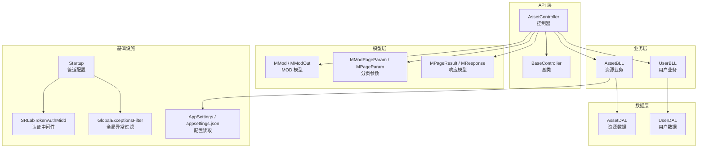
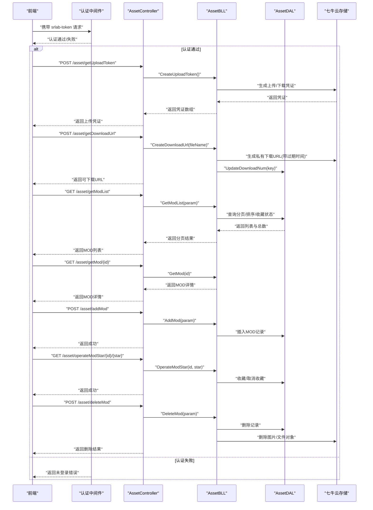
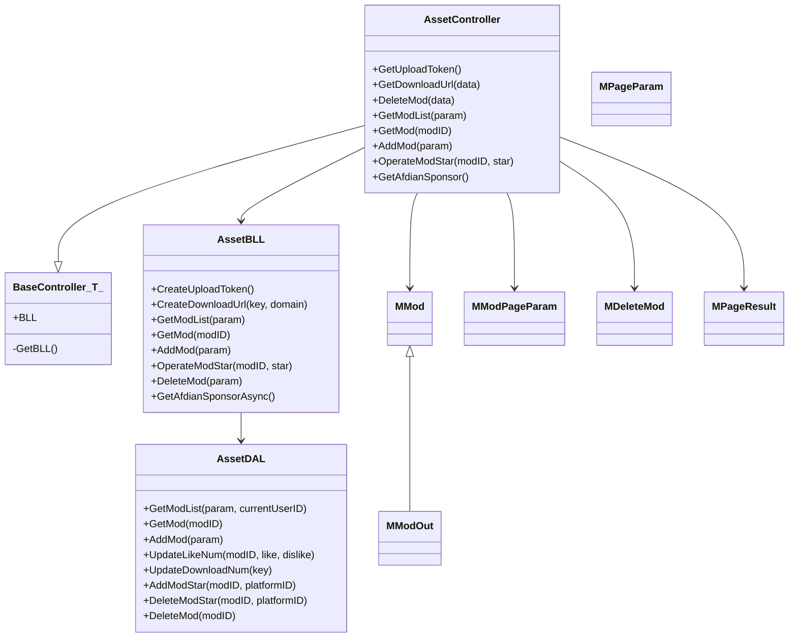

# 资源 API 模块

<cite>
**本文引用的文件**
- [SpeedRunners.API/SpeedRunners/Controllers/AssetController.cs](file://SpeedRunners.API/SpeedRunners/Controllers/AssetController.cs)
- [SpeedRunners.API/SpeedRunners/Controllers/BaseController.cs](file://SpeedRunners.API/SpeedRunners/Controllers/BaseController.cs)
- [SpeedRunners.API/SpeedRunners.BLL/AssetBLL.cs](file://SpeedRunners.API/SpeedRunners.BLL/AssetBLL.cs)
- [SpeedRunners.API/SpeedRunners.DAL/AssetDAL.cs](file://SpeedRunners.API/SpeedRunners.DAL/AssetDAL.cs)
- [SpeedRunners.API/SpeedRunners.Model/Asset/MMod.cs](file://SpeedRunners.API/SpeedRunners.Model/Asset/MMod.cs)
- [SpeedRunners.API/SpeedRunners.Model/Asset/MModPageParam.cs](file://SpeedRunners.API/SpeedRunners.Model/Asset/MModPageParam.cs)
- [SpeedRunners.API/SpeedRunners.Model/Asset/MDeleteMod.cs](file://SpeedRunners.API/SpeedRunners.Model/Asset/MDeleteMod.cs)
- [SpeedRunners.API/SpeedRunners/Startup.cs](file://SpeedRunners.API/SpeedRunners/Startup.cs)
- [SpeedRunners.API/SpeedRunners/Filter/GlobalExceptionsFilter.cs](file://SpeedRunners.API/SpeedRunners/Filter/GlobalExceptionsFilter.cs)
- [SpeedRunners.API/SpeedRunners/Middleware/SRLabTokenAuthMidd.cs](file://SpeedRunners.API/SpeedRunners/Middleware/SRLabTokenAuthMidd.cs)
- [SpeedRunners.API/SpeedRunners/Utils/AppSettings.cs](file://SpeedRunners.API/SpeedRunners/Utils/AppSettings.cs)
- [SpeedRunners.API/SpeedRunners.Model/MPageParam.cs](file://SpeedRunners.API/SpeedRunners.Model/MPageParam.cs)
- [SpeedRunners.API/SpeedRunners.Model/MPageResult.cs](file://SpeedRunners.API/SpeedRunners.Model/MPageResult.cs)
- [SpeedRunners.API/SpeedRunners.BLL/UserBLL.cs](file://SpeedRunners.API/SpeedRunners.BLL/UserBLL.cs)
- [SpeedRunners.API/SpeedRunners.DAL/UserDAL.cs](file://SpeedRunners.API/SpeedRunners.DAL/UserDAL.cs)
- [SpeedRunners.API/SpeedRunners/appsettings.json](file://SpeedRunners.API/SpeedRunners/appsettings.json)
- [SpeedRunners.UI/src/api/asset.js](file://SpeedRunners.UI/src/api/asset.js)
</cite>

## 目录
1. [简介](#简介)
2. [项目结构](#项目结构)
3. [核心组件](#核心组件)
4. [架构总览](#架构总览)
5. [详细组件分析](#详细组件分析)
6. [依赖关系分析](#依赖关系分析)
7. [性能考量](#性能考量)
8. [故障排查指南](#故障排查指南)
9. [结论](#结论)
10. [附录](#附录)

## 简介
本文件面向 SpeedRunnersLab 的资源 API 模块，聚焦 MOD 资源相关接口的实现与使用说明。内容涵盖：
- MOD 列表查询、详情获取、新增、删除、收藏/取消收藏
- 文件上传与下载（基于七牛云），含上传凭证生成、私有下载链接生成、下载计数更新
- MOD 数据管理与展示：分类筛选、关键词搜索、收藏状态、排序逻辑
- 安全机制：令牌认证、防盗链、权限控制
- 错误处理与全局异常过滤
- 前后端调用示例与最佳实践

## 项目结构
资源 API 模块位于 SpeedRunners.API 工程中，采用经典的三层架构：控制器层负责路由与参数绑定；业务层封装资源与第三方服务；数据层负责数据库访问；模型层承载数据契约。

图表来源
- [SpeedRunners.API/SpeedRunners/Controllers/AssetController.cs](file://SpeedRunners.API/SpeedRunners/Controllers/AssetController.cs#L10-L47)
- [SpeedRunners.API/SpeedRunners/Controllers/BaseController.cs](file://SpeedRunners.API/SpeedRunners/Controllers/BaseController.cs#L10-L24)
- [SpeedRunners.API/SpeedRunners.BLL/AssetBLL.cs](file://SpeedRunners.API/SpeedRunners.BLL/AssetBLL.cs#L16-L202)
- [SpeedRunners.API/SpeedRunners.BLL/UserBLL.cs](file://SpeedRunners.API/SpeedRunners.BLL/UserBLL.cs#L16-L152)
- [SpeedRunners.API/SpeedRunners.DAL/AssetDAL.cs](file://SpeedRunners.API/SpeedRunners.DAL/AssetDAL.cs#L13-L133)
- [SpeedRunners.API/SpeedRunners.DAL/UserDAL.cs](file://SpeedRunners.API/SpeedRunners.DAL/UserDAL.cs#L9-L84)
- [SpeedRunners.API/SpeedRunners.Model/Asset/MMod.cs](file://SpeedRunners.API/SpeedRunners.Model/Asset/MMod.cs#L7-L27)
- [SpeedRunners.API/SpeedRunners.Model/Asset/MModPageParam.cs](file://SpeedRunners.API/SpeedRunners.Model/Asset/MModPageParam.cs#L7-L12)
- [SpeedRunners.API/SpeedRunners/Startup.cs](file://SpeedRunners.API/SpeedRunners/Startup.cs#L33-L84)
- [SpeedRunners.API/SpeedRunners/Filter/GlobalExceptionsFilter.cs](file://SpeedRunners.API/SpeedRunners/Filter/GlobalExceptionsFilter.cs#L16-L51)
- [SpeedRunners.API/SpeedRunners/Utils/AppSettings.cs](file://SpeedRunners.API/SpeedRunners/Utils/AppSettings.cs#L8-L54)
- [SpeedRunners.API/SpeedRunners/appsettings.json](file://SpeedRunners.API/SpeedRunners/appsettings.json#L1-L21)

章节来源
- [SpeedRunners.API/SpeedRunners/Controllers/AssetController.cs](file://SpeedRunners.API/SpeedRunners/Controllers/AssetController.cs#L10-L47)
- [SpeedRunners.API/SpeedRunners/Startup.cs](file://SpeedRunners.API/SpeedRunners/Startup.cs#L33-L84)

## 核心组件
- 控制器层：AssetController 提供资源相关接口，统一继承 BaseController，自动注入当前用户上下文与本地化资源。
- 业务层：AssetBLL 封装上传/下载、列表/详情、新增/删除、收藏操作，并集成七牛云 SDK 实现文件管理。
- 数据层：AssetDAL 实现 MOD 的分页查询、新增、收藏增删、下载次数更新等数据库操作。
- 模型层：MMod/MModOut/MModPageParam/MDeleteMod/MPageParam/MPageResult 等承载请求/响应数据结构。
- 安全与异常：SRLabTokenAuthMidd 实现基于 srlab-token 的认证与权限判定；GlobalExceptionsFilter 提供生产环境统一异常返回与日志记录。

章节来源
- [SpeedRunners.API/SpeedRunners/Controllers/BaseController.cs](file://SpeedRunners.API/SpeedRunners/Controllers/BaseController.cs#L10-L24)
- [SpeedRunners.API/SpeedRunners.BLL/AssetBLL.cs](file://SpeedRunners.API/SpeedRunners.BLL/AssetBLL.cs#L16-L202)
- [SpeedRunners.API/SpeedRunners.DAL/AssetDAL.cs](file://SpeedRunners.API/SpeedRunners.DAL/AssetDAL.cs#L13-L133)
- [SpeedRunners.API/SpeedRunners.Model/Asset/MMod.cs](file://SpeedRunners.API/SpeedRunners.Model/Asset/MMod.cs#L7-L27)
- [SpeedRunners.API/SpeedRunners.Model/Asset/MModPageParam.cs](file://SpeedRunners.API/SpeedRunners.Model/Asset/MModPageParam.cs#L7-L12)
- [SpeedRunners.API/SpeedRunners/Filter/GlobalExceptionsFilter.cs](file://SpeedRunners.API/SpeedRunners/Filter/GlobalExceptionsFilter.cs#L16-L51)
- [SpeedRunners.API/SpeedRunners/Middleware/SRLabTokenAuthMidd.cs](file://SpeedRunners.API/SpeedRunners/Middleware/SRLabTokenAuthMidd.cs#L18-L122)

## 架构总览
下图展示了 MOD 资源 API 的端到端调用路径与安全控制：

图表来源
- [SpeedRunners.API/SpeedRunners/Controllers/AssetController.cs](file://SpeedRunners.API/SpeedRunners/Controllers/AssetController.cs#L16-L45)
- [SpeedRunners.API/SpeedRunners.BLL/AssetBLL.cs](file://SpeedRunners.API/SpeedRunners.BLL/AssetBLL.cs#L22-L143)
- [SpeedRunners.API/SpeedRunners.DAL/AssetDAL.cs](file://SpeedRunners.API/SpeedRunners.DAL/AssetDAL.cs#L16-L131)
- [SpeedRunners.API/SpeedRunners/Middleware/SRLabTokenAuthMidd.cs](file://SpeedRunners.API/SpeedRunners/Middleware/SRLabTokenAuthMidd.cs#L54-L101)

## 详细组件分析

### 控制器：AssetController
- 接口职责
  - 获取上传凭证：用于前端直传七牛云（图片与 MOD 文件）。
  - 生成下载链接：返回带过期时间的私有下载 URL，并更新下载计数。
  - MOD 列表与详情：支持标签筛选、关键词模糊搜索、仅看收藏、排序与收藏状态标记。
  - 新增/删除 MOD：新增时写入作者信息；删除时校验权限并清理云端对象。
  - 收藏/取消收藏：按当前用户平台 ID 写入/删除收藏记录并更新计数。
  - 赞助信息：调用爱发电开放接口获取赞助者信息。
- 认证特性
  - 使用自定义特性标注接口是否需要认证或仅需身份识别，配合中间件进行拦截与放行。

章节来源
- [SpeedRunners.API/SpeedRunners/Controllers/AssetController.cs](file://SpeedRunners.API/SpeedRunners/Controllers/AssetController.cs#L16-L45)

### 业务层：AssetBLL
- 上传与下载
  - 上传凭证：为图片与 MOD 文件分别生成上传策略与凭证，便于前端直传。
  - 下载链接：生成带过期时间的私有下载 URL，并在返回前更新下载次数。
- MOD 管理
  - 列表：根据标签、关键词、仅看收藏等条件构建查询，结合“新旧”权重排序。
  - 详情：组装输出模型，拼接 CDN 图片地址。
  - 新增：写入作者 ID、时间戳等字段。
  - 收藏：按用户平台 ID 增删收藏记录并同步计数。
  - 删除：校验作者或管理员权限，删除数据库记录并清理云端对象。
- 第三方集成
  - 七牛云 SDK：上传、下载、删除对象。
  - 爱发电开放接口：签名参数生成与请求转发。

章节来源
- [SpeedRunners.API/SpeedRunners.BLL/AssetBLL.cs](file://SpeedRunners.API/SpeedRunners.BLL/AssetBLL.cs#L22-L143)
- [SpeedRunners.API/SpeedRunners.BLL/AssetBLL.cs](file://SpeedRunners.API/SpeedRunners.BLL/AssetBLL.cs#L162-L200)

### 数据层：AssetDAL
- 查询与分页
  - 多条件组合：标签、关键词模糊匹配、仅看收藏。
  - 排序规则：优先“是否近期”（新），再按收藏数与下载数综合排序。
  - 收藏状态：根据当前用户平台 ID 查询其收藏集合，标记列表项。
- 写入与更新
  - 新增：去重判断、插入记录。
  - 下载计数：按文件 Key 更新下载次数。
  - 收藏：插入/删除收藏记录并同步计数。
  - 删除：级联删除收藏与 MOD 记录。

章节来源
- [SpeedRunners.API/SpeedRunners.DAL/AssetDAL.cs](file://SpeedRunners.API/SpeedRunners.DAL/AssetDAL.cs#L16-L131)

### 模型与分页
- MMod/MModOut：承载 MOD 字段，输出模型扩展“是否新资源”标记。
- MModPageParam：在通用分页参数基础上增加标签与仅看收藏标志。
- MDeleteMod：删除请求体模型。
- MPageParam/MPageResult：通用分页输入/输出模型。

章节来源
- [SpeedRunners.API/SpeedRunners.Model/Asset/MMod.cs](file://SpeedRunners.API/SpeedRunners.Model/Asset/MMod.cs#L7-L27)
- [SpeedRunners.API/SpeedRunners.Model/Asset/MModPageParam.cs](file://SpeedRunners.API/SpeedRunners.Model/Asset/MModPageParam.cs#L7-L12)
- [SpeedRunners.API/SpeedRunners.Model/Asset/MDeleteMod.cs](file://SpeedRunners.API/SpeedRunners.Model/Asset/MDeleteMod.cs#L7-L11)
- [SpeedRunners.API/SpeedRunners.Model/MPageParam.cs](file://SpeedRunners.API/SpeedRunners.Model/MPageParam.cs#L3-L14)
- [SpeedRunners.API/SpeedRunners.Model/MPageResult.cs](file://SpeedRunners.API/SpeedRunners.Model/MPageResult.cs#L7-L12)

### 安全与异常处理
- 认证中间件
  - 从请求头读取 srlab-token，解析用户信息并注入上下文。
  - 根据接口标注的特性决定是否需要登录或仅需身份识别。
- 全局异常过滤
  - 生产环境统一返回标准化错误响应，记录请求路径、参数与堆栈。
- 配置与密钥
  - 通过 AppSettings 读取七牛云 AccessKey/SecretKey、爱发电用户 ID 与 Token。
  - appsettings.json 中集中存放敏感配置。

章节来源
- [SpeedRunners.API/SpeedRunners/Middleware/SRLabTokenAuthMidd.cs](file://SpeedRunners.API/SpeedRunners/Middleware/SRLabTokenAuthMidd.cs#L54-L101)
- [SpeedRunners.API/SpeedRunners/Filter/GlobalExceptionsFilter.cs](file://SpeedRunners.API/SpeedRunners/Filter/GlobalExceptionsFilter.cs#L31-L51)
- [SpeedRunners.API/SpeedRunners/Utils/AppSettings.cs](file://SpeedRunners.API/SpeedRunners/Utils/AppSettings.cs#L16-L38)
- [SpeedRunners.API/SpeedRunners/appsettings.json](file://SpeedRunners.API/SpeedRunners/appsettings.json#L15-L19)

### 前端调用示例
以下为前端调用资源 API 的典型场景（路径与方法来自前端模块）：
- 获取上传凭证：GET /asset/getUploadToken
- 生成下载链接：POST /asset/getDownloadUrl
- 获取 MOD 列表：POST /asset/getModList
- 获取 MOD 详情：GET /asset/getMod/{id}
- 新增 MOD：POST /asset/addMod
- 收藏/取消收藏：GET /asset/operateModStar/{id}/{star}
- 删除 MOD：POST /asset/deleteMod
- 获取赞助者：GET /asset/getAfdianSponsor

章节来源
- [SpeedRunners.UI/src/api/asset.js](file://SpeedRunners.UI/src/api/asset.js#L3-L54)

## 依赖关系分析

图表来源
- [SpeedRunners.API/SpeedRunners/Controllers/AssetController.cs](file://SpeedRunners.API/SpeedRunners/Controllers/AssetController.cs#L14-L46)
- [SpeedRunners.API/SpeedRunners/Controllers/BaseController.cs](file://SpeedRunners.API/SpeedRunners/Controllers/BaseController.cs#L10-L24)
- [SpeedRunners.API/SpeedRunners.BLL/AssetBLL.cs](file://SpeedRunners.API/SpeedRunners.BLL/AssetBLL.cs#L16-L202)
- [SpeedRunners.API/SpeedRunners.DAL/AssetDAL.cs](file://SpeedRunners.API/SpeedRunners.DAL/AssetDAL.cs#L13-L133)
- [SpeedRunners.API/SpeedRunners.Model/Asset/MMod.cs](file://SpeedRunners.API/SpeedRunners.Model/Asset/MMod.cs#L7-L27)
- [SpeedRunners.API/SpeedRunners.Model/Asset/MModPageParam.cs](file://SpeedRunners.API/SpeedRunners.Model/Asset/MModPageParam.cs#L7-L12)
- [SpeedRunners.API/SpeedRunners.Model/Asset/MDeleteMod.cs](file://SpeedRunners.API/SpeedRunners.Model/Asset/MDeleteMod.cs#L7-L11)
- [SpeedRunners.API/SpeedRunners.Model/MPageParam.cs](file://SpeedRunners.API/SpeedRunners.Model/MPageParam.cs#L3-L14)
- [SpeedRunners.API/SpeedRunners.Model/MPageResult.cs](file://SpeedRunners.API/SpeedRunners.Model/MPageResult.cs#L7-L12)

## 性能考量
- 分页与排序
  - 列表查询采用“近期优先 + 综合权重”的双层子查询合并，避免一次性全表扫描，提升排序效率。
  - 分页参数 Offset 由 PageNo 与 PageSize 计算得出，建议前端合理设置 PageSize 并避免超大偏移。
- 数据库访问
  - 使用 Dapper 批量查询与单一连接执行多语句，减少往返。
  - 收藏状态标记在内存中完成，避免额外查询。
- 上传/下载
  - 前端直传七牛云，降低服务端带宽压力；下载链接带过期时间，防止长期暴露。
- 缓存与 CDN
  - 图片与 MOD 文件均通过 CDN 加速；下载链接为私有访问，结合过期时间实现防盗链。
- 可选优化
  - 对热门 MOD 的列表结果可引入 Redis 缓存，设置短 TTL。
  - 对下载计数可采用异步更新或批量更新策略，降低写放大。

## 故障排查指南
- 认证失败
  - 现象：返回未登录错误。
  - 排查：确认请求头是否携带 srlab-token；检查中间件是否正确注入用户上下文；核对用户令牌有效性。
- 上传失败
  - 现象：前端直传失败或返回无效凭证。
  - 排查：检查七牛云 AccessKey/SecretKey 配置；确认上传策略作用空间与权限；核对前端签名与过期时间。
- 下载失败
  - 现象：下载链接无法访问或立即失效。
  - 排查：确认下载链接过期时间；检查文件 Key 是否正确；核对 CDN 域名与私有访问策略。
- 删除失败
  - 现象：MOD 删除但云端文件未清理。
  - 排查：确认删除权限（作者或管理员）；检查云端对象是否存在；查看删除返回码。
- 全局异常
  - 现象：生产环境统一返回错误码与提示。
  - 排查：查看日志记录的请求路径、参数与堆栈；定位具体异常位置并修复。

章节来源
- [SpeedRunners.API/SpeedRunners/Middleware/SRLabTokenAuthMidd.cs](file://SpeedRunners.API/SpeedRunners/Middleware/SRLabTokenAuthMidd.cs#L54-L101)
- [SpeedRunners.API/SpeedRunners.BLL/AssetBLL.cs](file://SpeedRunners.API/SpeedRunners.BLL/AssetBLL.cs#L150-L160)
- [SpeedRunners.API/SpeedRunners/Filter/GlobalExceptionsFilter.cs](file://SpeedRunners.API/SpeedRunners/Filter/GlobalExceptionsFilter.cs#L31-L51)

## 结论
资源 API 模块围绕 MOD 资源实现了完整的生命周期管理：从上传、存储、鉴权、展示到删除，均通过清晰的分层设计与安全机制保障。结合七牛云与 CDN，具备良好的扩展性与性能表现。建议在高并发场景下进一步引入缓存与异步更新策略，并持续完善监控与告警体系。

## 附录

### API 定义与调用示例
- 获取上传凭证
  - 方法：GET
  - 路径：/asset/getUploadToken
  - 返回：上传凭证数组（图片与 MOD）
- 生成下载链接
  - 方法：POST
  - 路径：/asset/getDownloadUrl
  - 请求体：{ fileName }
  - 返回：带过期时间的私有下载 URL
- 获取 MOD 列表
  - 方法：POST
  - 路径：/asset/getModList
  - 请求体：MModPageParam（含标签、关键词、仅看收藏、分页）
  - 返回：MPageResult<MModOut>
- 获取 MOD 详情
  - 方法：GET
  - 路径：/asset/getMod/{id}
  - 返回：MModOut
- 新增 MOD
  - 方法：POST
  - 路径：/asset/addMod
  - 请求体：MMod（作者信息由后端写入）
  - 返回：成功
- 收藏/取消收藏
  - 方法：GET
  - 路径：/asset/operateModStar/{id}/{star}
  - 返回：成功
- 删除 MOD
  - 方法：POST
  - 路径：/asset/deleteMod
  - 请求体：MDeleteMod
  - 返回：删除结果（含云端清理状态）

章节来源
- [SpeedRunners.API/SpeedRunners/Controllers/AssetController.cs](file://SpeedRunners.API/SpeedRunners/Controllers/AssetController.cs#L16-L45)
- [SpeedRunners.UI/src/api/asset.js](file://SpeedRunners.UI/src/api/asset.js#L3-L54)

### 文件上传实现机制
- 凭证生成
  - 后端为图片与 MOD 文件分别生成上传策略与凭证，前端直传至对应空间。
- 断点续传
  - 当前实现未见断点续传逻辑；如需支持，可在前端引入分片上传并在后端提供合并接口。
- 类型验证
  - 未见显式 MIME 校验；建议在上传策略中限制允许的文件类型与大小，并在业务层二次校验。
- 进度显示
  - 未见进度回调；可在前端监听上传进度事件并上报后端（如需要）。

章节来源
- [SpeedRunners.API/SpeedRunners.BLL/AssetBLL.cs](file://SpeedRunners.API/SpeedRunners.BLL/AssetBLL.cs#L22-L36)

### MOD 数据管理与展示
- 分类筛选：按 Tag 字段过滤。
- 搜索功能：关键词模糊匹配标题。
- 收藏系统：按用户平台 ID 标记与统计。
- 排序逻辑：近期资源优先，其次按收藏数与下载数综合排序。
- 输出模型：自动拼接 CDN 图片地址，标记“是否新资源”。

章节来源
- [SpeedRunners.API/SpeedRunners.BLL/AssetBLL.cs](file://SpeedRunners.API/SpeedRunners.BLL/AssetBLL.cs#L49-L91)
- [SpeedRunners.API/SpeedRunners.DAL/AssetDAL.cs](file://SpeedRunners.API/SpeedRunners.DAL/AssetDAL.cs#L16-L71)

### 下载安全与防盗链
- 私有下载 URL：带过期时间，防止长期暴露。
- 下载计数：在返回下载链接前更新，确保统计准确性。
- CDN 防盗链：结合域名与过期策略，限制外站直接访问。

章节来源
- [SpeedRunners.API/SpeedRunners.BLL/AssetBLL.cs](file://SpeedRunners.API/SpeedRunners.BLL/AssetBLL.cs#L38-L47)
- [SpeedRunners.API/SpeedRunners.DAL/AssetDAL.cs](file://SpeedRunners.API/SpeedRunners.DAL/AssetDAL.cs#L106-L110)

### 资源缓存与 CDN 集成
- CDN 加速：图片与 MOD 文件通过独立域名加速。
- 缓存策略：建议对列表结果引入短期缓存；对静态图片可结合 ETag/Last-Modified。
- CDN 集成：下载 URL 由后端生成，确保访问控制与过期时间。

章节来源
- [SpeedRunners.API/SpeedRunners.BLL/AssetBLL.cs](file://SpeedRunners.API/SpeedRunners.BLL/AssetBLL.cs#L58-L59)
- [SpeedRunners.API/SpeedRunners.BLL/AssetBLL.cs](file://SpeedRunners.API/SpeedRunners.BLL/AssetBLL.cs#L38-L47)