# UI 组件库

<cite>
**本文引用的文件**
- [package.json](file://SpeedRunners.UI/package.json)
- [vuetify.js](file://SpeedRunners.UI/src/plugins/vuetify.js)
- [main.js](file://SpeedRunners.UI/src/main.js)
- [vue.config.js](file://SpeedRunners.UI/vue.config.js)
- [SvgIcon/index.vue](file://SpeedRunners.UI/src/components/SvgIcon/index.vue)
- [XCard/index.vue](file://SpeedRunners.UI/src/components/XCard/index.vue)
- [XCard/DarkInfo.vue](file://SpeedRunners.UI/src/components/XCard/DarkInfo.vue)
- [CommentSection/index.vue](file://SpeedRunners.UI/src/components/CommentSection/index.vue)
- [CommentSection/CommentItem.vue](file://SpeedRunners.UI/src/components/CommentSection/CommentItem.vue)
- [ScoreHeatmap/index.vue](file://SpeedRunners.UI/src/components/ScoreHeatmap/index.vue)
- [UserAvatar/index.vue](file://SpeedRunners.UI/src/components/UserAvatar/index.vue)
- [UserName/index.vue](file://SpeedRunners.UI/src/components/UserName/index.vue)
- [AppMain.vue](file://SpeedRunners.UI/src/layout/components/AppMain.vue)
- [addedChart.vue](file://SpeedRunners.UI/src/views/index/addedChart.vue)
- [hourChart.vue](file://SpeedRunners.UI/src/views/index/hourChart.vue)
- [resize.js](file://SpeedRunners.UI/src/utils/resize.js)
- [profile.js](file://SpeedRunners.UI/src/utils/profile.js)
- [index.scss](file://SpeedRunners.UI/src/styles/index.scss)
- [variables.scss](file://SpeedRunners.UI/src/styles/variables.scss)
- [sidebar.scss](file://SpeedRunners.UI/src/styles/sidebar.scss)
- [index.js](file://SpeedRunners.UI/src/i18n/index.js)
- [icons/index.js](file://SpeedRunners.UI/src/icons/index.js)
- [layout/index.vue](file://SpeedRunners.UI/src/layout/index.vue)
- [settings.js](file://SpeedRunners.UI/src/settings.js)
- [zh.json](file://SpeedRunners.UI/src/i18n/lang/zh.json)
- [en.json](file://SpeedRunners.UI/src/i18n/lang/en.json)
</cite>

## 更新摘要
**变更内容**
- 新增图表组件交互功能章节，详细介绍 addedChart.vue 和 hourChart.vue 的点击交互增强
- 更新图表组件与骨架加载器优化章节，补充事件监听器、智能 platformID 提取逻辑、指针光标效果和增强的 tooltip 格式化
- 更新用户导航功能章节，说明图表点击如何触发用户资料跳转
- 更新故障排查指南，增加图表交互功能相关问题解决方案

## 目录
1. [简介](#简介)
2. [项目结构](#项目结构)
3. [核心组件](#核心组件)
4. [架构总览](#架构总览)
5. [组件详解](#组件详解)
6. [依赖关系分析](#依赖关系分析)
7. [性能与构建优化](#性能与构建优化)
8. [故障排查指南](#故障排查指南)
9. [结论](#结论)
10. [附录](#附录)

## 简介
本文件面向 SpeedRunnersLab 前端 UI 组件库，围绕基于 Vuetify 2.3.11 的 Material Design 组件体系，系统梳理插件配置（主题、图标、语言）、自定义组件（SvgIcon、XCard、CommentSection、ScoreHeatmap、UserAvatar、UserName）的设计与用法、样式系统（SCSS 变量/混入/工具类）、响应式布局与断点、主题定制（颜色/字体/间距）以及组件开发最佳实践。文档同时提供代码级架构图与流程图，帮助不同背景读者快速理解与落地。

## 项目结构
前端位于 SpeedRunners.UI，采用 Vue CLI 3.x + Vuetify 2.x 栈，核心目录与职责概览：
- src/plugins：Vuetify 插件与全局样式入口
- src/components：业务自定义组件（SvgIcon、XCard、CommentSection、ScoreHeatmap、UserAvatar、UserName）
- src/views/index：首页图表组件（addedChart、hourChart）
- src/styles：全局样式与 SCSS 变量/工具类
- src/icons：SVG 图标注册与加载
- src/layout：应用布局与导航
- src/i18n：国际化配置
- src/utils：通用工具（含响应式处理、用户资料跳转）
- vue.config.js：构建链路与资源加载策略
- package.json：依赖与脚本

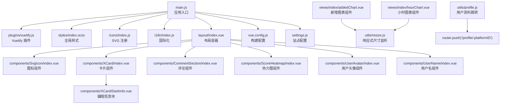

**图表来源**
- [main.js:1-30](file://SpeedRunners.UI/src/main.js#L1-L30)
- [vuetify.js:1-33](file://SpeedRunners.UI/src/plugins/vuetify.js#L1-L33)
- [index.scss:1-68](file://SpeedRunners.UI/src/styles/index.scss#L1-L68)
- [icons/index.js:1-9](file://SpeedRunners.UI/src/icons/index.js#L1-L9)
- [layout/index.vue:1-556](file://SpeedRunners.UI/src/layout/index.vue#L1-L556)
- [SvgIcon/index.vue:1-66](file://SpeedRunners.UI/src/components/SvgIcon/index.vue#L1-L66)
- [XCard/index.vue:1-102](file://SpeedRunners.UI/src/components/XCard/index.vue#L1-L102)
- [XCard/DarkInfo.vue:1-76](file://SpeedRunners.UI/src/components/XCard/DarkInfo.vue#L1-L76)
- [CommentSection/index.vue:1-191](file://SpeedRunners.UI/src/components/CommentSection/index.vue#L1-L191)
- [ScoreHeatmap/index.vue:1-362](file://SpeedRunners.UI/src/components/ScoreHeatmap/index.vue#L1-L362)
- [UserAvatar/index.vue:1-39](file://SpeedRunners.UI/src/components/UserAvatar/index.vue#L1-L39)
- [UserName/index.vue:1-35](file://SpeedRunners.UI/src/components/UserName/index.vue#L1-L35)
- [addedChart.vue:1-174](file://SpeedRunners.UI/src/views/index/addedChart.vue#L1-L174)
- [hourChart.vue:1-187](file://SpeedRunners.UI/src/views/index/hourChart.vue#L1-L187)
- [resize.js:1-55](file://SpeedRunners.UI/src/utils/resize.js#L1-L55)
- [profile.js:1-4](file://SpeedRunners.UI/src/utils/profile.js#L1-L4)
- [vue.config.js:1-129](file://SpeedRunners.UI/vue.config.js#L1-L129)
- [settings.js:1-16](file://SpeedRunners.UI/src/settings.js#L1-L16)

**章节来源**
- [main.js:1-30](file://SpeedRunners.UI/src/main.js#L1-L30)
- [vue.config.js:1-129](file://SpeedRunners.UI/vue.config.js#L1-L129)

## 核心组件
- Vuetify 插件：按需引入组件、Toast 扩展、语言与图标配置、主题开关
- SvgIcon：统一 SVG 与 MDI 图标渲染，支持外部链接与内联 use
- XCard：带偏移标题区、动作条、分隔线与响应式内边距的卡片容器
- DarkInfo：偏暗风格的标题/内容块，支持边框方向与明暗模式
- CommentSection：评论区组件，支持登录用户评论、分页加载、回复功能
- ScoreHeatmap：365天分数活动热力图组件，支持五级强度色彩系统和月份数字标签
- UserAvatar：统一用户头像显示组件，支持点击跳转到个人资料页面
- UserName：统一用户名显示组件，支持点击跳转到个人资料页面
- 布局容器：顶部栏、侧边抽屉、页脚、回到顶部按钮
- 图表组件：ECharts 图表，支持骨架加载器优化、响应式自适应、点击交互功能
- 国际化：自动识别语言、持久化选择、切换与页面标题更新
- 样式系统：SCSS 变量导出、过渡与工具类、侧边栏响应式

**章节来源**
- [vuetify.js:1-33](file://SpeedRunners.UI/src/plugins/vuetify.js#L1-L33)
- [SvgIcon/index.vue:1-66](file://SpeedRunners.UI/src/components/SvgIcon/index.vue#L1-L66)
- [XCard/index.vue:1-102](file://SpeedRunners.UI/src/components/XCard/index.vue#L1-L102)
- [XCard/DarkInfo.vue:1-76](file://SpeedRunners.UI/src/components/XCard/DarkInfo.vue#L1-L76)
- [CommentSection/index.vue:1-191](file://SpeedRunners.UI/src/components/CommentSection/index.vue#L1-L191)
- [CommentSection/CommentItem.vue:1-341](file://SpeedRunners.UI/src/components/CommentSection/CommentItem.vue#L1-L341)
- [ScoreHeatmap/index.vue:1-362](file://SpeedRunners.UI/src/components/ScoreHeatmap/index.vue#L1-L362)
- [UserAvatar/index.vue:1-39](file://SpeedRunners.UI/src/components/UserAvatar/index.vue#L1-L39)
- [UserName/index.vue:1-35](file://SpeedRunners.UI/src/components/UserName/index.vue#L1-L35)
- [layout/index.vue:1-556](file://SpeedRunners.UI/src/layout/index.vue#L1-L556)
- [addedChart.vue:1-174](file://SpeedRunners.UI/src/views/index/addedChart.vue#L1-L174)
- [hourChart.vue:1-187](file://SpeedRunners.UI/src/views/index/hourChart.vue#L1-L187)
- [index.js:1-35](file://SpeedRunners.UI/src/i18n/index.js#L1-L35)
- [index.scss:1-68](file://SpeedRunners.UI/src/styles/index.scss#L1-L68)
- [variables.scss:1-26](file://SpeedRunners.UI/src/styles/variables.scss#L1-L26)
- [sidebar.scss:1-84](file://SpeedRunners.UI/src/styles/sidebar.scss#L1-L84)

## 架构总览
下图展示应用启动到组件渲染的关键路径，以及 Vuetify、图标系统、布局与图表组件之间的交互，包括新增的用户头像和用户名组件以及图表点击交互功能。

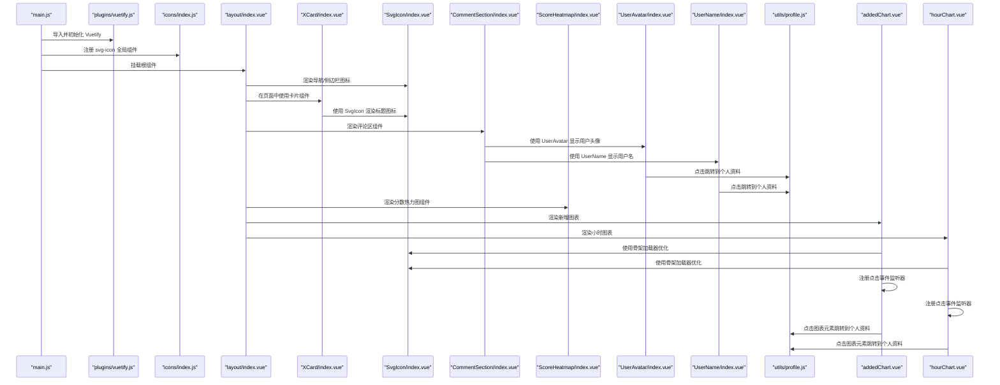

**图表来源**
- [main.js:1-30](file://SpeedRunners.UI/src/main.js#L1-L30)
- [vuetify.js:1-33](file://SpeedRunners.UI/src/plugins/vuetify.js#L1-L33)
- [icons/index.js:1-9](file://SpeedRunners.UI/src/icons/index.js#L1-L9)
- [layout/index.vue:1-556](file://SpeedRunners.UI/src/layout/index.vue#L1-L556)
- [XCard/index.vue:1-102](file://SpeedRunners.UI/src/components/XCard/index.vue#L1-L102)
- [SvgIcon/index.vue:1-66](file://SpeedRunners.UI/src/components/SvgIcon/index.vue#L1-L66)
- [CommentSection/index.vue:1-191](file://SpeedRunners.UI/src/components/CommentSection/index.vue#L1-L191)
- [CommentSection/CommentItem.vue:1-341](file://SpeedRunners.UI/src/components/CommentSection/CommentItem.vue#L1-L341)
- [ScoreHeatmap/index.vue:1-362](file://SpeedRunners.UI/src/components/ScoreHeatmap/index.vue#L1-L362)
- [UserAvatar/index.vue:1-39](file://SpeedRunners.UI/src/components/UserAvatar/index.vue#L1-L39)
- [UserName/index.vue:1-35](file://SpeedRunners.UI/src/components/UserName/index.vue#L1-L35)
- [profile.js:1-4](file://SpeedRunners.UI/src/utils/profile.js#L1-L4)
- [addedChart.vue:1-174](file://SpeedRunners.UI/src/views/index/addedChart.vue#L1-L174)
- [hourChart.vue:1-187](file://SpeedRunners.UI/src/views/index/hourChart.vue#L1-L187)

## 组件详解

### Vuetify 插件配置
- 按需引入组件：仅打包所需 Vuetify 组件，减少体积
- Toast 扩展：全局 Toast 配置（位置、超时、关闭图标）
- 语言与图标：内置中文语言包；图标使用 MDI 字体
- 主题：读取本地存储决定深色/浅色模式，动态切换并持久化

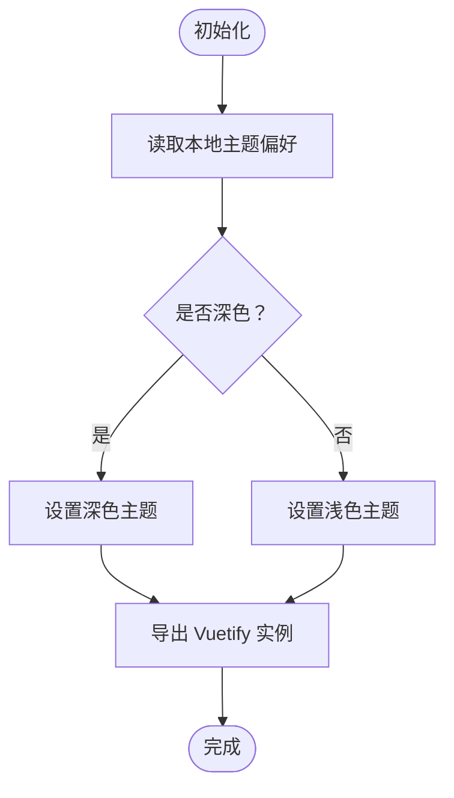

**图表来源**
- [vuetify.js:1-33](file://SpeedRunners.UI/src/plugins/vuetify.js#L1-L33)

**章节来源**
- [vuetify.js:1-33](file://SpeedRunners.UI/src/plugins/vuetify.js#L1-L33)
- [main.js:1-30](file://SpeedRunners.UI/src/main.js#L1-L30)
- [package.json:15-32](file://SpeedRunners.UI/package.json#L15-L32)

### SvgIcon 图标组件
- 支持两类图标：
  - MDI 前缀：直接使用 Vuetify 图标组件
  - 内联 SVG：通过 use href 引用已注册的符号
- 外部图标：通过 mask 背景实现彩色填充
- 类名与尺寸：统一添加外边距与尺寸，便于在不同容器中复用

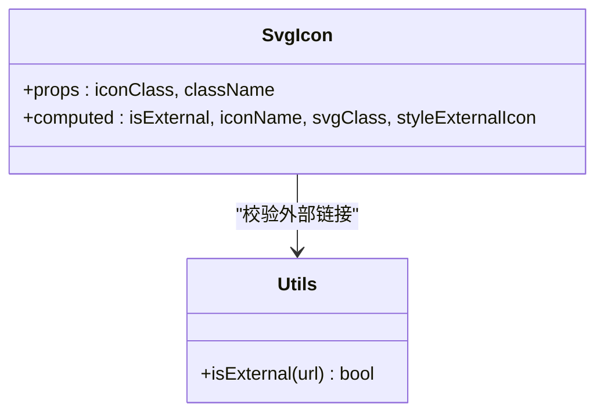

**图表来源**
- [SvgIcon/index.vue:1-66](file://SpeedRunners.UI/src/components/SvgIcon/index.vue#L1-L66)
- [icons/index.js:1-9](file://SpeedRunners.UI/src/icons/index.js#L1-L9)

**章节来源**
- [SvgIcon/index.vue:1-66](file://SpeedRunners.UI/src/components/SvgIcon/index.vue#L1-L66)
- [icons/index.js:1-9](file://SpeedRunners.UI/src/icons/index.js#L1-L9)

### XCard 卡片组件
- 设计理念：将标题/偏移区与内容区解耦，支持插槽扩展与动作条
- 偏移标题：根据是否存在 header/offset/title/text 自动渲染
- 响应式内边距：在中小屏自动收紧内边距，提升移动端体验
- 透传属性：将未显式声明的属性与事件透传给底层 VCard

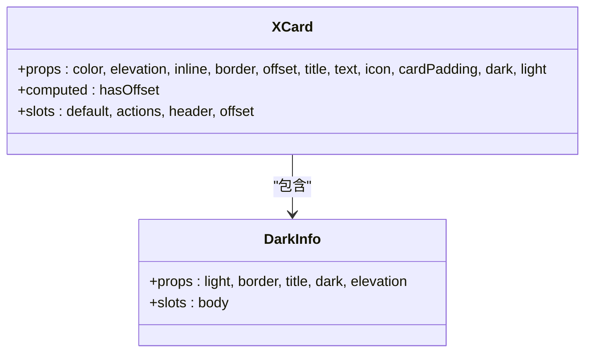

**图表来源**
- [XCard/index.vue:1-102](file://SpeedRunners.UI/src/components/XCard/index.vue#L1-L102)
- [XCard/DarkInfo.vue:1-76](file://SpeedRunners.UI/src/components/XCard/DarkInfo.vue#L1-L76)

**章节来源**
- [XCard/index.vue:1-102](file://SpeedRunners.UI/src/components/XCard/index.vue#L1-L102)
- [XCard/DarkInfo.vue:1-76](file://SpeedRunners.UI/src/components/XCard/DarkInfo.vue#L1-L76)

### CommentSection 评论组件
- 用户认证：支持登录用户发表评论，未登录用户显示提示信息
- 评论列表：支持分页加载、回复功能、删除操作
- 响应式设计：支持侧边栏模式，移除自动水平居中样式
- 数据管理：支持评论发布、刷新、分页切换
- 用户信息统一：使用 UserAvatar 和 UserName 组件统一显示用户头像和用户名

**更新** 移除了自动水平居中样式，改为更灵活的布局控制，并集成了新的用户头像和用户名组件

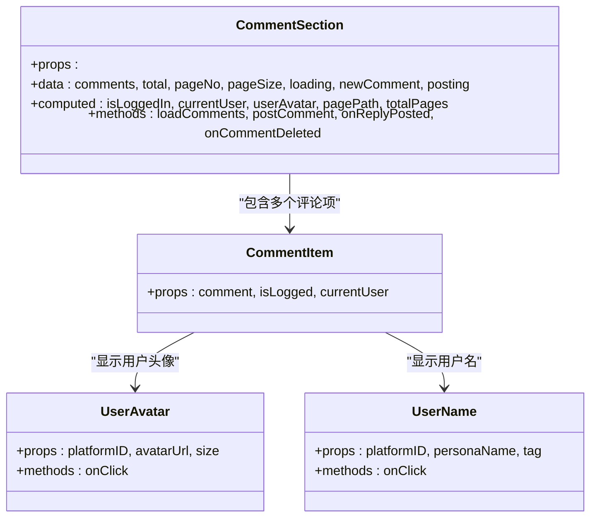

**图表来源**
- [CommentSection/index.vue:1-191](file://SpeedRunners.UI/src/components/CommentSection/index.vue#L1-L191)
- [CommentSection/CommentItem.vue:1-341](file://SpeedRunners.UI/src/components/CommentSection/CommentItem.vue#L1-L341)
- [UserAvatar/index.vue:1-39](file://SpeedRunners.UI/src/components/UserAvatar/index.vue#L1-L39)
- [UserName/index.vue:1-35](file://SpeedRunners.UI/src/components/UserName/index.vue#L1-L35)

**章节来源**
- [CommentSection/index.vue:1-191](file://SpeedRunners.UI/src/components/CommentSection/index.vue#L1-L191)
- [CommentSection/CommentItem.vue:1-341](file://SpeedRunners.UI/src/components/CommentSection/CommentItem.vue#L1-L341)

### ScoreHeatmap 热力图组件
- 设计理念：365天分数活动可视化，支持五级强度色彩系统和月份数字标签
- 数据结构：接收每日分数数组，格式为 [{ date: 'YYYY-MM-DD', score: number }, ...]
- 核心功能：
  - 计算总新增分数：自动累加所有正分数
  - 生成周数据：构建52周+当前周的数据矩阵
  - 五级强度色彩：0分、1-49分、50-149分、150-299分、300+分对应不同颜色
  - 月份标签：显示过去12个月的月份标签
  - 交互功能：鼠标悬停显示详细分数和日期信息
- 主题适配：深色主题使用渐变蓝绿色，浅色主题使用绿色系渐变
- 响应式设计：支持横向滚动，适配不同屏幕尺寸

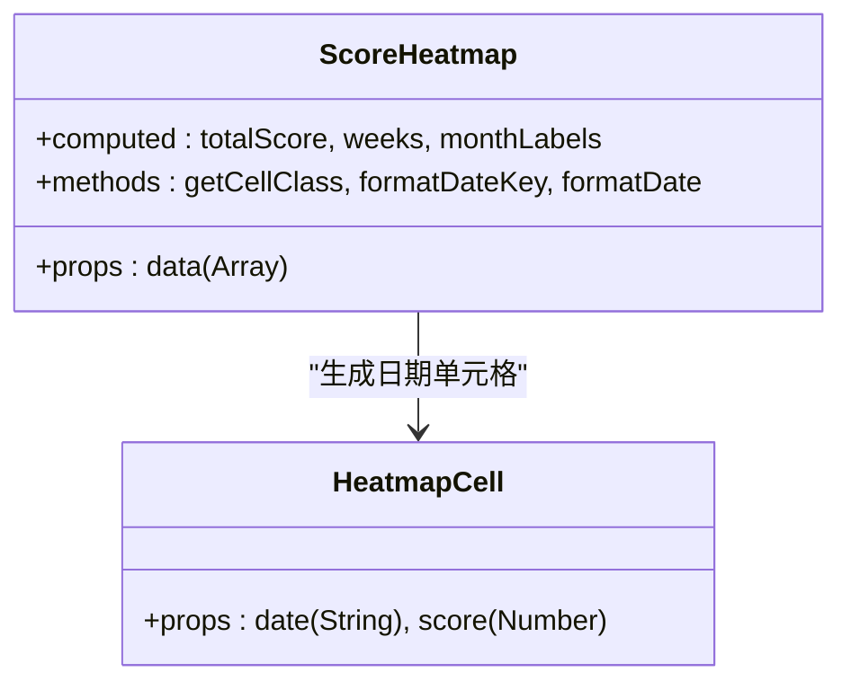

**图表来源**
- [ScoreHeatmap/index.vue:1-362](file://SpeedRunners.UI/src/components/ScoreHeatmap/index.vue#L1-L362)

**章节来源**
- [ScoreHeatmap/index.vue:1-362](file://SpeedRunners.UI/src/components/ScoreHeatmap/index.vue#L1-L362)

### UserAvatar 用户头像组件
- 设计理念：统一用户头像显示，提供点击导航功能
- 功能特性：
  - 支持头像图片显示：当 avatarUrl 存在时显示用户头像
  - 默认头像：当没有头像URL时显示 mdi-account-circle 图标
  - 点击导航：当 platformID 存在时提供点击跳转到个人资料页面的功能
  - 尺寸控制：支持自定义头像尺寸，默认36像素
  - 可点击样式：当可点击时显示手型光标和悬停效果
- 属性配置：
  - platformID：用户平台ID，用于导航跳转
  - avatarUrl：用户头像URL地址
  - size：头像尺寸，默认36
- 导航机制：通过 goToUserProfile 工具函数实现路由跳转

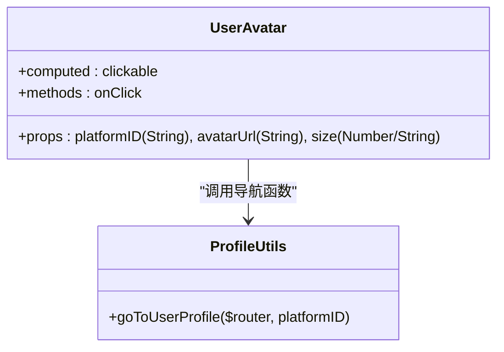

**图表来源**
- [UserAvatar/index.vue:1-39](file://SpeedRunners.UI/src/components/UserAvatar/index.vue#L1-L39)
- [profile.js:1-4](file://SpeedRunners.UI/src/utils/profile.js#L1-L4)

**章节来源**
- [UserAvatar/index.vue:1-39](file://SpeedRunners.UI/src/components/UserAvatar/index.vue#L1-L39)
- [profile.js:1-4](file://SpeedRunners.UI/src/utils/profile.js#L1-L4)

### UserName 用户名组件
- 设计理念：统一用户名显示，提供点击导航功能
- 功能特性：
  - 支持显示用户名：当 personaName 存在时显示用户名
  - 回退显示：当没有用户名时显示 platformID
  - 点击导航：当 platformID 存在时提供点击跳转到个人资料页面的功能
  - 标签控制：支持自定义HTML标签，默认span元素
  - 可点击样式：当可点击时显示手型光标和下划线效果
- 属性配置：
  - platformID：用户平台ID，用于导航跳转
  - personaName：用户显示名称
  - tag：HTML标签类型，默认span
- 导航机制：通过 goToUserProfile 工具函数实现路由跳转

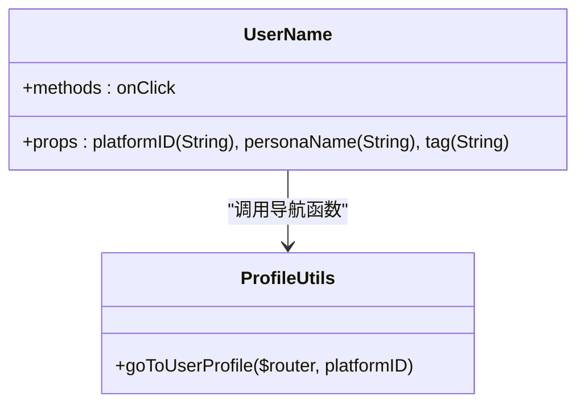

**图表来源**
- [UserName/index.vue:1-35](file://SpeedRunners.UI/src/components/UserName/index.vue#L1-L35)
- [profile.js:1-4](file://SpeedRunners.UI/src/utils/profile.js#L1-L4)

**章节来源**
- [UserName/index.vue:1-35](file://SpeedRunners.UI/src/components/UserName/index.vue#L1-L35)
- [profile.js:1-4](file://SpeedRunners.UI/src/utils/profile.js#L1-L4)

### 图表组件与骨架加载器优化
- 骨架加载器：addedChart.vue 和 hourChart.vue 使用 v-skeleton-loader 提供加载状态反馈
- 响应式自适应：集成 resize mixin，支持窗口大小变化时图表重新计算
- ECharts 集成：按需引入图表组件，支持主题切换与国际化
- 性能优化：骨架加载器减少首屏等待时间，提升用户体验
- **交互功能增强**：新增点击事件监听器，支持用户通过点击图表元素直接跳转到玩家个人资料
- **智能 platformID 提取**：支持从系列数据和Y轴标签中智能提取用户平台ID
- **指针光标效果**：设置鼠标悬停时的指针样式为手型光标
- **增强的 tooltip 格式化**：提供更友好的数据展示格式

**更新** 新增图表组件交互功能增强章节

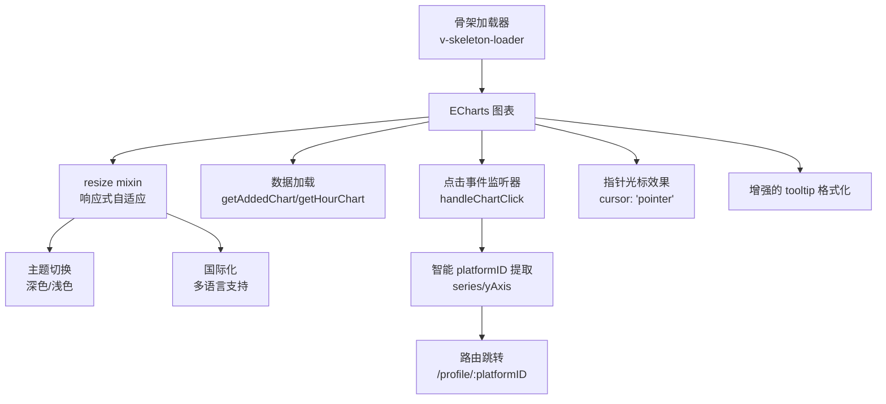

**图表来源**
- [addedChart.vue:1-174](file://SpeedRunners.UI/src/views/index/addedChart.vue#L1-L174)
- [hourChart.vue:1-187](file://SpeedRunners.UI/src/views/index/hourChart.vue#L1-L187)
- [resize.js:1-55](file://SpeedRunners.UI/src/utils/resize.js#L1-L55)
- [profile.js:1-4](file://SpeedRunners.UI/src/utils/profile.js#L1-L4)

**章节来源**
- [addedChart.vue:1-174](file://SpeedRunners.UI/src/views/index/addedChart.vue#L1-L174)
- [hourChart.vue:1-187](file://SpeedRunners.UI/src/views/index/hourChart.vue#L1-L187)
- [resize.js:1-55](file://SpeedRunners.UI/src/utils/resize.js#L1-L55)
- [profile.js:1-4](file://SpeedRunners.UI/src/utils/profile.js#L1-L4)

### 布局与导航
- 顶部栏：Logo、主题切换、语言切换、导航标签
- 侧边抽屉：用户信息、路由菜单、隐私设置入口、登出
- 页脚：社交链接、版权信息、回到顶部按钮
- 主题切换：读取当前主题状态并写入本地存储
- 语言切换：更新 i18n 语言并同步持久化
- 评论区布局：支持侧边栏评论区，根据用户状态动态显示
- 用户导航：UserAvatar 和 UserName 组件提供统一的用户信息点击导航
- **图表导航**：addedChart 和 hourChart 组件支持点击图表元素跳转到用户个人资料

**更新** AppMain 布局组件支持评论区侧边栏显示，新增用户头像和用户名组件导航功能，以及图表组件的点击导航功能

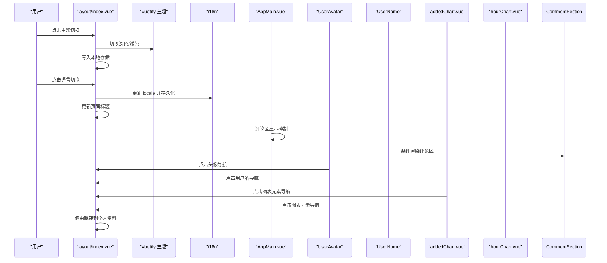

**图表来源**
- [layout/index.vue:416-478](file://SpeedRunners.UI/src/layout/index.vue#L416-L478)
- [vuetify.js:24-33](file://SpeedRunners.UI/src/plugins/vuetify.js#L24-L33)
- [index.js:1-35](file://SpeedRunners.UI/src/i18n/index.js#L1-L35)
- [AppMain.vue:1-139](file://SpeedRunners.UI/src/layout/components/AppMain.vue#L1-L139)
- [UserAvatar/index.vue:22-26](file://SpeedRunners.UI/src/components/UserAvatar/index.vue#L22-L26)
- [UserName/index.vue:19-23](file://SpeedRunners.UI/src/components/UserName/index.vue#L19-L23)
- [addedChart.vue:102-113](file://SpeedRunners.UI/src/views/index/addedChart.vue#L102-L113)
- [hourChart.vue:173-184](file://SpeedRunners.UI/src/views/index/hourChart.vue#L173-L184)

**章节来源**
- [layout/index.vue:1-556](file://SpeedRunners.UI/src/layout/index.vue#L1-L556)
- [index.js:1-35](file://SpeedRunners.UI/src/i18n/index.js#L1-L35)
- [AppMain.vue:1-139](file://SpeedRunners.UI/src/layout/components/AppMain.vue#L1-L139)
- [UserAvatar/index.vue:1-39](file://SpeedRunners.UI/src/components/UserAvatar/index.vue#L1-L39)
- [UserName/index.vue:1-35](file://SpeedRunners.UI/src/components/UserName/index.vue#L1-L35)
- [addedChart.vue:102-113](file://SpeedRunners.UI/src/views/index/addedChart.vue#L102-L113)
- [hourChart.vue:173-184](file://SpeedRunners.UI/src/views/index/hourChart.vue#L173-L184)

### 样式系统与主题定制
- SCSS 变量：侧边栏宽度、菜单文本/背景色等，通过 :export 导出供 JS 使用
- 全局样式：重置、字体、过渡、工具类、主容器内边距
- 侧边栏响应式：固定/折叠/移动端动画与定位
- 主题颜色：通过 Vuetify theme 控制，结合暗色/亮色样式类
- 评论区样式：支持侧边栏模式下的特殊样式处理
- 热力图样式：五级强度色彩系统，支持主题适配
- 用户头像样式：可点击状态的悬停效果和过渡动画
- 用户名样式：可点击状态的手型光标和下划线效果
- **图表样式**：支持指针光标效果，增强用户交互体验

**更新** 新增图表组件样式说明

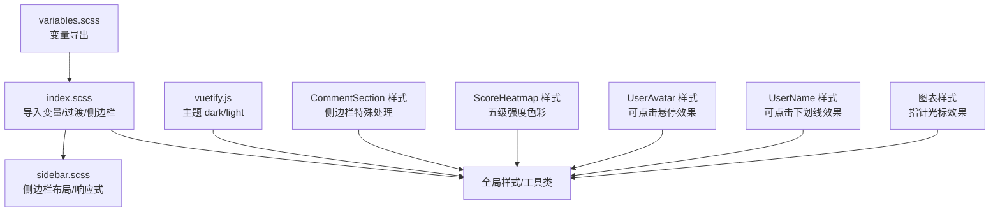

**图表来源**
- [variables.scss:1-26](file://SpeedRunners.UI/src/styles/variables.scss#L1-L26)
- [index.scss:1-68](file://SpeedRunners.UI/src/styles/index.scss#L1-L68)
- [sidebar.scss:1-84](file://SpeedRunners.UI/src/styles/sidebar.scss#L1-L84)
- [vuetify.js:24-33](file://SpeedRunners.UI/src/plugins/vuetify.js#L24-L33)
- [CommentSection/index.vue:181-191](file://SpeedRunners.UI/src/components/CommentSection/index.vue#L181-L191)
- [ScoreHeatmap/index.vue:298-361](file://SpeedRunners.UI/src/components/ScoreHeatmap/index.vue#L298-L361)
- [UserAvatar/index.vue:30-38](file://SpeedRunners.UI/src/components/UserAvatar/index.vue#L30-L38)
- [UserName/index.vue:27-34](file://SpeedRunners.UI/src/components/UserName/index.vue#L27-L34)

**章节来源**
- [variables.scss:1-26](file://SpeedRunners.UI/src/styles/variables.scss#L1-L26)
- [index.scss:1-68](file://SpeedRunners.UI/src/styles/index.scss#L1-L68)
- [sidebar.scss:1-84](file://SpeedRunners.UI/src/styles/sidebar.scss#L1-L84)
- [vuetify.js:24-33](file://SpeedRunners.UI/src/plugins/vuetify.js#L24-L33)
- [CommentSection/index.vue:181-191](file://SpeedRunners.UI/src/components/CommentSection/index.vue#L181-L191)
- [ScoreHeatmap/index.vue:298-361](file://SpeedRunners.UI/src/components/ScoreHeatmap/index.vue#L298-L361)
- [UserAvatar/index.vue:30-38](file://SpeedRunners.UI/src/components/UserAvatar/index.vue#L30-L38)
- [UserName/index.vue:27-34](file://SpeedRunners.UI/src/components/UserName/index.vue#L27-L34)

### 响应式设计与断点
- 断点使用：组件内部通过 $vuetify.breakpoint 判断屏幕尺寸，控制布局细节（如卡片内边距）
- 侧边栏响应式：PC/移动端不同行为，折叠/隐藏/动画
- 尺寸监听：通用 resize mixin，防抖处理图表与布局重算
- 图表自适应：addedChart 和 hourChart 通过 resize mixin 实现响应式图表
- 热力图响应式：支持横向滚动，适配不同屏幕尺寸
- 用户头像响应式：在不同屏幕尺寸下保持合适的显示比例和交互效果
- **图表交互响应式**：点击事件在不同屏幕尺寸下保持一致的交互体验

**更新** 新增图表组件响应式说明

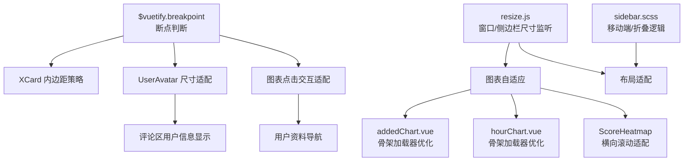

**图表来源**
- [XCard/index.vue:74-82](file://SpeedRunners.UI/src/components/XCard/index.vue#L74-L82)
- [UserAvatar/index.vue:17-21](file://SpeedRunners.UI/src/components/UserAvatar/index.vue#L17-L21)
- [resize.js:1-55](file://SpeedRunners.UI/src/utils/resize.js#L1-L55)
- [sidebar.scss:57-82](file://SpeedRunners.UI/src/styles/sidebar.scss#L57-L82)
- [addedChart.vue:32-33](file://SpeedRunners.UI/src/views/index/addedChart.vue#L32-L33)
- [hourChart.vue:32-33](file://SpeedRunners.UI/src/views/index/hourChart.vue#L32-L33)
- [ScoreHeatmap/index.vue:219-240](file://SpeedRunners.UI/src/components/ScoreHeatmap/index.vue#L219-L240)

**章节来源**
- [XCard/index.vue:74-82](file://SpeedRunners.UI/src/components/XCard/index.vue#L74-L82)
- [UserAvatar/index.vue:17-21](file://SpeedRunners.UI/src/components/UserAvatar/index.vue#L17-L21)
- [resize.js:1-55](file://SpeedRunners.UI/src/utils/resize.js#L1-L55)
- [sidebar.scss:57-82](file://SpeedRunners.UI/src/styles/sidebar.scss#L57-L82)
- [addedChart.vue:32-33](file://SpeedRunners.UI/src/views/index/addedChart.vue#L32-L33)
- [hourChart.vue:32-33](file://SpeedRunners.UI/src/views/index/hourChart.vue#L32-L33)
- [ScoreHeatmap/index.vue:219-240](file://SpeedRunners.UI/src/components/ScoreHeatmap/index.vue#L219-L240)

### 国际化配置
- 语言支持：中文（zh）和英文（en）双语支持
- 翻译键：包含基础界面、图表、个人主页等模块的翻译
- 热力图翻译：新增 scoreHeatmap、totalAdded、less、more、mon、wed、fri、scoreUnit 等翻译键
- **图表国际化**：新增 addedChartTitle、hourChartTile、hourChartUnit 等图表标题和单位翻译键
- 动态切换：支持运行时语言切换，自动更新界面显示

**更新** 新增图表组件相关翻译键

**章节来源**
- [index.js:1-35](file://SpeedRunners.UI/src/i18n/index.js#L1-L35)
- [zh.json:17-20](file://SpeedRunners.UI/src/i18n/lang/zh.json#L17-L20)
- [en.json:17-19](file://SpeedRunners.UI/src/i18n/lang/en.json#L17-L19)

## 依赖关系分析
- 依赖版本：Vuetify 2.3.11、Vue 2.6.10、vue-i18n、mdi 字体等
- 构建依赖：vuetify-loader、svg-sprite-loader、autoprefixer、sass 等
- 运行时依赖：axios、nprogress、echarts、js-cookie 等

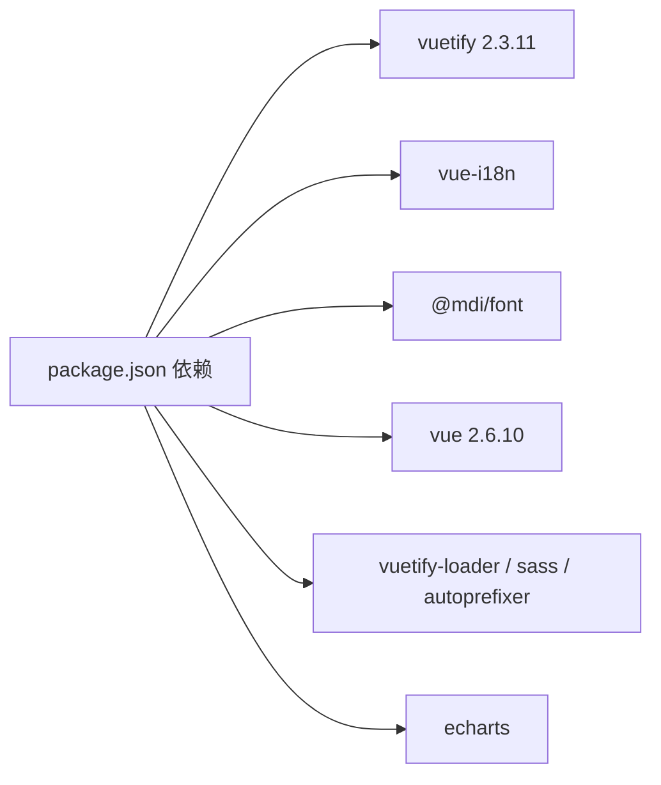

**图表来源**
- [package.json:15-64](file://SpeedRunners.UI/package.json#L15-L64)

**章节来源**
- [package.json:1-76](file://SpeedRunners.UI/package.json#L1-L76)

## 性能与构建优化
- 按需引入：仅打包所需 Vuetify 组件，降低首屏体积
- 图标优化：SVG Sprite 加载，避免重复请求
- 代码分割：splitChunks 将第三方与公共组件拆分，提升缓存命中
- 开发体验：cheap-source-map、nyan 进度条、预加载/预取可选禁用
- 依赖转译：对 vuetify 明确转译以兼容旧环境
- 骨架加载器：图表组件使用 v-skeleton-loader 减少首屏等待时间
- 响应式优化：resize mixin 防抖处理，提升图表自适应性能
- 热力图优化：虚拟滚动和按需渲染，提升大数据量显示性能
- 用户头像优化：懒加载头像图片，提升页面加载速度
- **图表交互优化**：事件监听器优化，避免重复绑定，提升交互性能

**更新** 新增图表交互性能优化说明

**章节来源**
- [vuetify.js:10-16](file://SpeedRunners.UI/src/plugins/vuetify.js#L10-L16)
- [vue.config.js:58-129](file://SpeedRunners.UI/vue.config.js#L58-L129)
- [addedChart.vue:3-10](file://SpeedRunners.UI/src/views/index/addedChart.vue#L3-L10)
- [hourChart.vue:3-10](file://SpeedRunners.UI/src/views/index/hourChart.vue#L3-L10)
- [resize.js:11-15](file://SpeedRunners.UI/src/utils/resize.js#L11-L15)
- [ScoreHeatmap/index.vue:1-362](file://SpeedRunners.UI/src/components/ScoreHeatmap/index.vue#L1-L362)
- [UserAvatar/index.vue:1-39](file://SpeedRunners.UI/src/components/UserAvatar/index.vue#L1-L39)

## 故障排查指南
- 图标不显示
  - 检查图标前缀是否为 MDI 或已在 icons/svg 中注册
  - 确认 svg-sprite-loader 已正确配置
- 主题切换无效
  - 确认本地存储键值存在且类型正确
  - 检查 Vuetify 主题实例是否被正确导出与使用
- 语言切换后刷新失效
  - 确认 i18n 初始化与本地存储逻辑一致
- 移动端侧边栏异常
  - 检查 sidebar.scss 媒体查询与 transform 动画
- 图表不自适应
  - 确认使用 resize mixin 并在窗口/侧边栏尺寸变化时触发 resize
- 骨架加载器问题
  - 检查 v-skeleton-loader 组件是否正确引入
  - 确认图表数据加载完成后正确移除骨架状态
- 评论区布局异常
  - 检查 CommentSection 组件的侧边栏样式类是否正确应用
  - 确认 AppMain 布局中评论区条件渲染逻辑
- 热力图显示异常
  - 检查 data 属性格式是否正确（包含 date 和 score 字段）
  - 确认五级强度色彩类名是否正确应用
  - 检查月份标签和星期标签的国际化配置
  - 确认主题切换时的颜色适配是否正常
- 用户头像组件问题
  - 检查 platformID 属性是否正确传递
  - 确认 avatarUrl 是否有效且可访问
  - 检查点击导航功能是否正常工作
  - 确认可点击样式是否正确应用
- 用户名组件问题
  - 检查 personaName 和 platformID 属性是否正确传递
  - 确认点击导航功能是否正常工作
  - 检查标签类型是否符合预期
- **图表点击交互问题**
  - 检查 handleChartClick 方法是否正确绑定到图表事件
  - 确认 platformID 提取逻辑是否正确处理 series 和 yAxis 两种情况
  - 检查 tooltip 格式化函数是否正确配置
  - 确认指针光标效果是否正确应用
  - 检查 goToUserProfile 函数是否正确导入和使用

**更新** 新增图表交互功能相关故障排查

**章节来源**
- [SvgIcon/index.vue:1-66](file://SpeedRunners.UI/src/components/SvgIcon/index.vue#L1-L66)
- [icons/index.js:1-9](file://SpeedRunners.UI/src/icons/index.js#L1-L9)
- [vuetify.js:24-33](file://SpeedRunners.UI/src/plugins/vuetify.js#L24-L33)
- [index.js:1-35](file://SpeedRunners.UI/src/i18n/index.js#L1-L35)
- [sidebar.scss:57-82](file://SpeedRunners.UI/src/styles/sidebar.scss#L57-L82)
- [resize.js:1-55](file://SpeedRunners.UI/src/utils/resize.js#L1-L55)
- [addedChart.vue:3-10](file://SpeedRunners.UI/src/views/index/addedChart.vue#L3-L10)
- [hourChart.vue:3-10](file://SpeedRunners.UI/src/views/index/hourChart.vue#L3-L10)
- [CommentSection/index.vue:181-191](file://SpeedRunners.UI/src/components/CommentSection/index.vue#L181-L191)
- [AppMain.vue:35-42](file://SpeedRunners.UI/src/layout/components/AppMain.vue#L35-L42)
- [ScoreHeatmap/index.vue:85-91](file://SpeedRunners.UI/src/components/ScoreHeatmap/index.vue#L85-L91)
- [UserAvatar/index.vue:1-39](file://SpeedRunners.UI/src/components/UserAvatar/index.vue#L1-L39)
- [UserName/index.vue:1-35](file://SpeedRunners.UI/src/components/UserName/index.vue#L1-L35)
- [addedChart.vue:102-113](file://SpeedRunners.UI/src/views/index/addedChart.vue#L102-L113)
- [hourChart.vue:173-184](file://SpeedRunners.UI/src/views/index/hourChart.vue#L173-L184)

## 结论
本组件库以 Vuetify 为核心，结合自定义 SvgIcon、XCard、CommentSection、ScoreHeatmap、UserAvatar、UserName，形成统一的图标、卡片、评论区、数据可视化和用户信息显示体系；通过 SCSS 变量与布局样式实现主题与响应式一致性；借助 i18n 与构建配置保障国际化与性能。新增的 UserAvatar 和 UserName 组件显著提升了用户信息显示的一致性和交互体验，统一了用户头像和用户名的展示方式，并提供了便捷的点击导航功能。**最新增强的图表组件交互功能进一步提升了用户体验，用户可以通过点击图表元素直接跳转到对应的玩家个人资料页面，实现了更直观的数据探索体验。** 建议在新功能开发中遵循现有命名与结构约定，优先使用自定义组件与统一样式变量，确保风格一致与维护性。

## 附录
- 站点配置：标题、固定头部、侧边栏 Logo 等
- 国际化语言包：中文/英文
- 图标清单：通过 icons/svg 目录集中管理，构建时批量注册
- 图表组件：ECharts 集成，支持主题切换与国际化，具备点击交互功能
- 评论系统：支持登录用户评论、分页加载、回复功能，使用统一的用户信息组件
- 热力图组件：支持五级强度色彩系统、月份数字标签、主题适配
- 用户头像组件：统一头像显示和点击导航功能
- 用户名组件：统一用户名显示和点击导航功能
- **图表交互功能**：支持点击图表元素跳转到用户个人资料，具备智能 platformID 提取和增强的 tooltip 格式化

**章节来源**
- [settings.js:1-16](file://SpeedRunners.UI/src/settings.js#L1-L16)
- [index.js:1-35](file://SpeedRunners.UI/src/i18n/index.js#L1-L35)
- [icons/index.js:1-9](file://SpeedRunners.UI/src/icons/index.js#L1-L9)
- [addedChart.vue:1-174](file://SpeedRunners.UI/src/views/index/addedChart.vue#L1-L174)
- [hourChart.vue:1-187](file://SpeedRunners.UI/src/views/index/hourChart.vue#L1-L187)
- [CommentSection/index.vue:1-191](file://SpeedRunners.UI/src/components/CommentSection/index.vue#L1-L191)
- [CommentSection/CommentItem.vue:1-341](file://SpeedRunners.UI/src/components/CommentSection/CommentItem.vue#L1-L341)
- [ScoreHeatmap/index.vue:1-362](file://SpeedRunners.UI/src/components/ScoreHeatmap/index.vue#L1-L362)
- [UserAvatar/index.vue:1-39](file://SpeedRunners.UI/src/components/UserAvatar/index.vue#L1-L39)
- [UserName/index.vue:1-35](file://SpeedRunners.UI/src/components/UserName/index.vue#L1-L35)