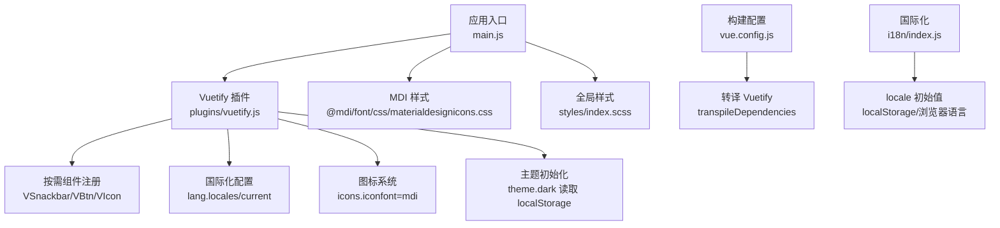
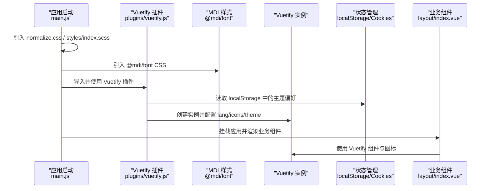
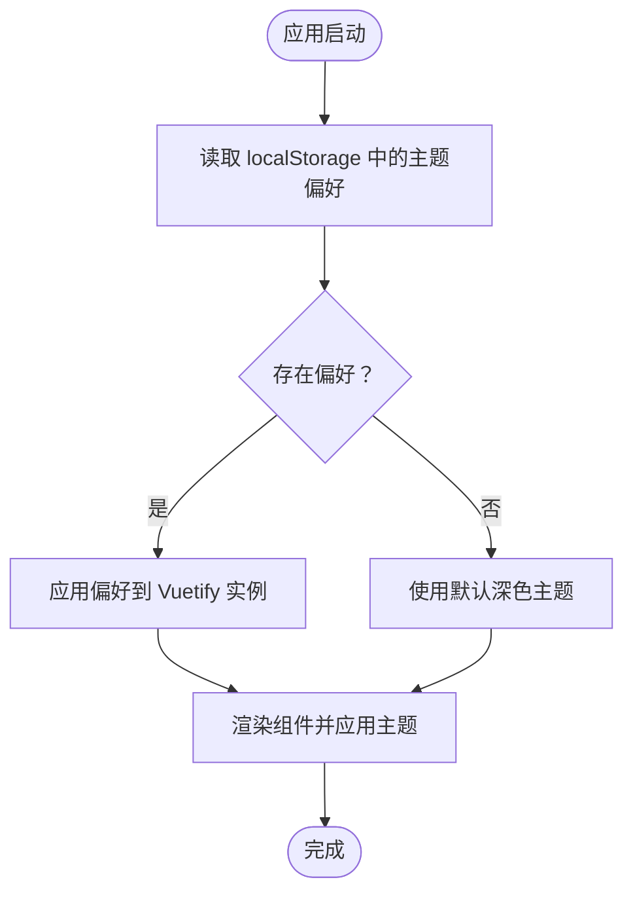
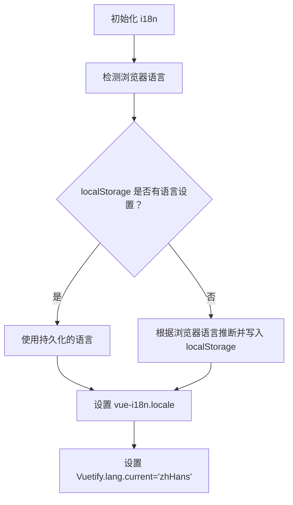
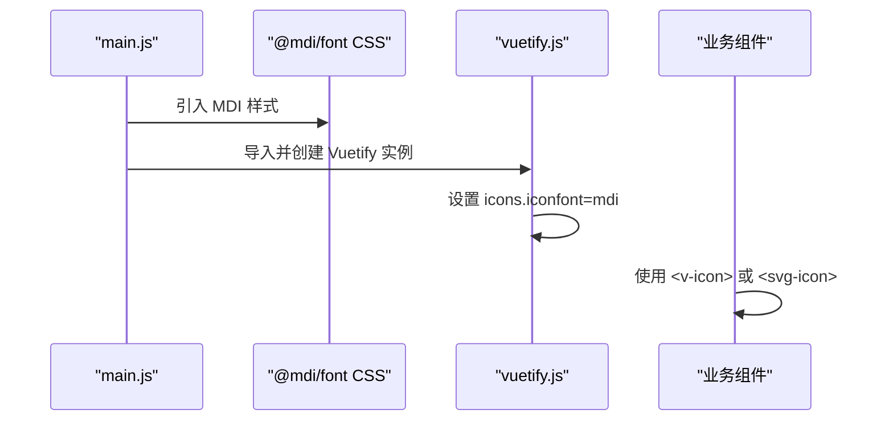
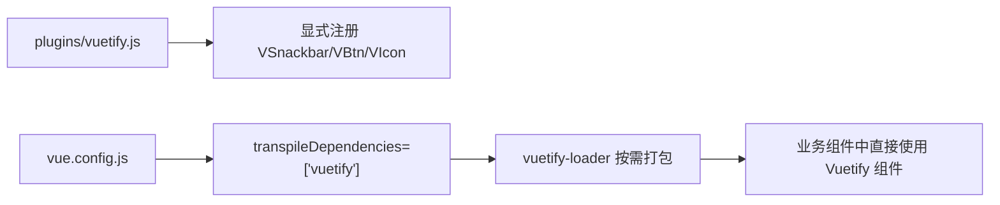
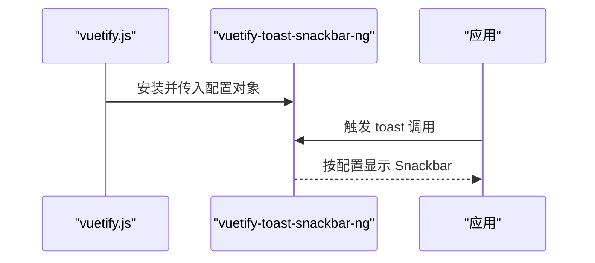
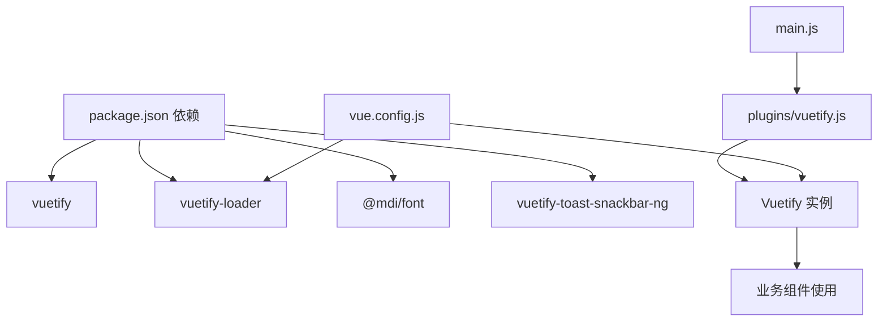

# Vuetify 配置

<cite>
**本文引用的文件**
- [vuetify.js](file://SpeedRunners.UI/src/plugins/vuetify.js)
- [main.js](file://SpeedRunners.UI/src/main.js)
- [package.json](file://SpeedRunners.UI/package.json)
- [vue.config.js](file://SpeedRunners.UI/vue.config.js)
- [index.js](file://SpeedRunners.UI/src/i18n/index.js)
- [index.vue](file://SpeedRunners.UI/src/layout/index.vue)
- [index.vue](file://SpeedRunners.UI/src/views/index/index.vue)
- [variables.scss](file://SpeedRunners.UI/src/styles/variables.scss)
- [settings.js](file://SpeedRunners.UI/src/settings.js)
</cite>

## 目录
1. [简介](#简介)
2. [项目结构](#项目结构)
3. [核心组件](#核心组件)
4. [架构总览](#架构总览)
5. [详细组件分析](#详细组件分析)
6. [依赖关系分析](#依赖关系分析)
7. [性能考虑](#性能考虑)
8. [故障排查指南](#故障排查指南)
9. [结论](#结论)
10. [附录](#附录)

## 简介
本文件面向 SpeedRunnersLab 前端（Vue 2 + Vuetify 2）项目，系统性梳理并解释 Vuetify 插件在本项目的完整配置与使用方式，重点覆盖以下方面：
- 主题定制：深色/浅色模式切换与持久化
- 国际化设置：中文支持与 Vuetify 内部文案本地化
- 图标系统：MDI 图标字体的引入与使用
- 按需引入组件：对 VSnackbar、VBtn、VIcon 的按需加载策略
- Toast 通知系统：位置、显示时间、关闭按钮等参数配置
- 主题持久化：通过 localStorage 保存用户偏好
- 最佳实践与性能优化建议

## 项目结构
与 Vuetify 配置直接相关的关键文件与职责如下：
- 插件入口：在应用入口集中注册 Vuetify，并引入 MDI 样式与全局样式
- 插件定义：在插件文件中完成 Vuetify 实例化、按需组件注册、国际化与图标配置、主题初始化
- 构建配置：通过 vue.config.js 对 Vuetify 进行转译与打包优化
- 国际化：独立的 i18n 初始化逻辑，与 Vuetify 的语言设置协同工作
- 使用示例：在布局与视图中广泛使用 Vuetify 组件与图标

图表来源
- [main.js](file://SpeedRunners.UI/src/main.js#L1-L30)
- [vuetify.js](file://SpeedRunners.UI/src/plugins/vuetify.js#L1-L33)
- [vue.config.js](file://SpeedRunners.UI/vue.config.js#L128-L129)

章节来源
- [main.js](file://SpeedRunners.UI/src/main.js#L1-L30)
- [vuetify.js](file://SpeedRunners.UI/src/plugins/vuetify.js#L1-L33)
- [vue.config.js](file://SpeedRunners.UI/vue.config.js#L128-L129)

## 核心组件
本节聚焦 Vuetify 插件在项目中的关键配置点与行为。

- 按需引入组件
  - 在插件中仅导入并注册 VSnackbar、VBtn、VIcon，避免全量引入导致体积膨胀
  - 其他常用组件如 VCard、VIcon、VTooltip 等在业务组件中直接使用，由 vuetify-loader 在构建期按需处理
- 国际化设置
  - 通过 lang.locales 注入 zh-Hans，并将 current 设为 zhHans，确保 Vuetify 内部组件（如日期选择器等）显示中文
- 图标系统
  - 通过引入 @mdi/font 的 CSS 并在 Vuetify 中将 iconfont 设为 mdi，使模板中可直接使用 mdi-* 前缀图标
- 主题定制与持久化
  - 启动时从 localStorage 读取主题偏好；若未设置则默认深色主题
  - 将 dark 属性写入 Vuetify 实例，影响全局主题渲染
- Toast 通知系统
  - 使用 vuetify-toast-snackbar-ng 插件，统一配置显示位置、超时时间、关闭按钮与图标

章节来源
- [vuetify.js](file://SpeedRunners.UI/src/plugins/vuetify.js#L1-L33)
- [main.js](file://SpeedRunners.UI/src/main.js#L2-L15)
- [package.json](file://SpeedRunners.UI/package.json#L30-L31)
- [package.json](file://SpeedRunners.UI/package.json#L37-L37)

## 架构总览
下图展示 Vuetify 在应用启动与运行期间的关键交互路径，包括插件初始化、样式注入、按需组件与图标使用、国际化与主题持久化。

图表来源
- [main.js](file://SpeedRunners.UI/src/main.js#L1-L30)
- [vuetify.js](file://SpeedRunners.UI/src/plugins/vuetify.js#L1-L33)
- [index.vue](file://SpeedRunners.UI/src/layout/index/index.vue#L1-L84)

## 详细组件分析

### 主题系统与持久化
- 初始化策略
  - 启动时从 localStorage 读取主题偏好；若为空则默认启用深色主题
  - 将 dark 属性写入 Vuetify 实例，影响全局主题渲染
- 使用场景
  - 在布局组件中根据 $vuetify.theme.dark 动态切换链接颜色等样式
- 可扩展建议
  - 提供主题切换开关，将用户选择写回 localStorage 并同步到 Vuetify 实例

图表来源
- [vuetify.js](file://SpeedRunners.UI/src/plugins/vuetify.js#L6-L9)
- [vuetify.js](file://SpeedRunners.UI/src/plugins/vuetify.js#L32-L33)
- [index.vue](file://SpeedRunners.UI/src/layout/index/index.vue#L231-L237)

章节来源
- [vuetify.js](file://SpeedRunners.UI/src/plugins/vuetify.js#L6-L9)
- [vuetify.js](file://SpeedRunners.UI/src/plugins/vuetify.js#L32-L33)
- [index.vue](file://SpeedRunners.UI/src/layout/index/index.vue#L231-L237)

### 国际化与 Vuetify 文案本地化
- 浏览器语言检测与持久化
  - 优先使用 localStorage 中的语言设置；若无则根据浏览器语言自动判定并写入 localStorage
- Vuetify 内部文案
  - 通过 lang.locales 注入 zh-Hans，并将 current 设为 zhHans，使日期选择器等内部组件显示中文
- 协同关系
  - 应用级 i18n（vue-i18n）负责页面文本翻译，Vuetify 的 lang 负责其内部组件文案

图表来源
- [index.js](file://SpeedRunners.UI/src/i18n/index.js#L8-L20)
- [index.js](file://SpeedRunners.UI/src/i18n/index.js#L23-L33)
- [vuetify.js](file://SpeedRunners.UI/src/plugins/vuetify.js#L25-L28)

章节来源
- [index.js](file://SpeedRunners.UI/src/i18n/index.js#L8-L20)
- [index.js](file://SpeedRunners.UI/src/i18n/index.js#L23-L33)
- [vuetify.js](file://SpeedRunners.UI/src/plugins/vuetify.js#L25-L28)

### 图标系统与 MDI 字体
- 样式引入
  - 在应用入口引入 @mdi/font 的 CSS 文件，确保图标类名可用
- Vuetify 配置
  - 将 icons.iconfont 设为 mdi，使模板中可直接使用 mdi-* 前缀图标
- 使用示例
  - 在布局与视图中广泛使用 <v-icon> 与自定义 SVG 组件配合

图表来源
- [main.js](file://SpeedRunners.UI/src/main.js#L2-L2)
- [main.js](file://SpeedRunners.UI/src/main.js#L15-L15)
- [vuetify.js](file://SpeedRunners.UI/src/plugins/vuetify.js#L29-L31)
- [index.vue](file://SpeedRunners.UI/src/layout/index/index.vue#L163-L230)

章节来源
- [main.js](file://SpeedRunners.UI/src/main.js#L2-L2)
- [main.js](file://SpeedRunners.UI/src/main.js#L15-L15)
- [vuetify.js](file://SpeedRunners.UI/src/plugins/vuetify.js#L29-L31)
- [index.vue](file://SpeedRunners.UI/src/layout/index/index.vue#L163-L230)

### 按需引入组件与 vuetify-loader
- 显式按需
  - 在插件中显式导入并注册 VSnackbar、VBtn、VIcon，避免全量引入
- 自动按需
  - 通过 vuetify-loader 与 vue.config.js 的 transpileDependencies: ["vuetify"]，在构建期对 Vuetify 组件进行按需打包
- 典型使用
  - 在业务组件中直接使用 VCard、VIcon、VTooltip 等，由 loader 在构建期处理

图表来源
- [vuetify.js](file://SpeedRunners.UI/src/plugins/vuetify.js#L10-L16)
- [package.json](file://SpeedRunners.UI/package.json#L62-L64)
- [vue.config.js](file://SpeedRunners.UI/vue.config.js#L128-L129)

章节来源
- [vuetify.js](file://SpeedRunners.UI/src/plugins/vuetify.js#L10-L16)
- [package.json](file://SpeedRunners.UI/package.json#L62-L64)
- [vue.config.js](file://SpeedRunners.UI/vue.config.js#L128-L129)

### Toast 通知系统配置
- 插件安装
  - 安装 vuetify-toast-snackbar-ng 并在插件中进行全局配置
- 参数说明
  - x: "center"（水平居中）
  - y: "top"（顶部）
  - showClose: true（显示关闭按钮）
  - timeout: 6000（显示 6 秒）
  - closeIcon: "mdi-close"（关闭图标为 MDI 关闭图标）

图表来源
- [vuetify.js](file://SpeedRunners.UI/src/plugins/vuetify.js#L17-L23)

章节来源
- [vuetify.js](file://SpeedRunners.UI/src/plugins/vuetify.js#L17-L23)

### 主题变量与样式协同
- SCSS 变量导出
  - styles/variables.scss 通过 :export 导出侧边栏相关变量，便于 JS/TS 在运行时读取
- 主题联动
  - 布局组件根据 $vuetify.theme.dark 切换链接颜色等样式，体现主题一致性

章节来源
- [variables.scss](file://SpeedRunners.UI/src/styles/variables.scss#L16-L25)
- [index.vue](file://SpeedRunners.UI/src/layout/index/index.vue#L339-L354)

## 依赖关系分析
- 外部依赖
  - vuetify 与 vuetify-loader：提供 UI 组件库与按需打包能力
  - @mdi/font：提供 MDI 图标字体
  - vuetify-toast-snackbar-ng：提供 Toast 通知能力
- 内部依赖
  - main.js 作为入口，统一引入样式与插件
  - vuetify.js 作为插件定义中心，集中配置主题、国际化、图标与按需组件
  - vue.config.js 通过 transpileDependencies 与 vuetify-loader 协作，保证按需加载生效

图表来源
- [package.json](file://SpeedRunners.UI/package.json#L30-L31)
- [package.json](file://SpeedRunners.UI/package.json#L62-L64)
- [package.json](file://SpeedRunners.UI/package.json#L37-L37)
- [package.json](file://SpeedRunners.UI/package.json#L31-L31)
- [main.js](file://SpeedRunners.UI/src/main.js#L1-L30)
- [vuetify.js](file://SpeedRunners.UI/src/plugins/vuetify.js#L1-L33)
- [vue.config.js](file://SpeedRunners.UI/vue.config.js#L128-L129)

章节来源
- [package.json](file://SpeedRunners.UI/package.json#L30-L31)
- [package.json](file://SpeedRunners.UI/package.json#L62-L64)
- [package.json](file://SpeedRunners.UI/package.json#L37-L37)
- [package.json](file://SpeedRunners.UI/package.json#L31-L31)
- [main.js](file://SpeedRunners.UI/src/main.js#L1-L30)
- [vuetify.js](file://SpeedRunners.UI/src/plugins/vuetify.js#L1-L33)
- [vue.config.js](file://SpeedRunners.UI/vue.config.js#L128-L129)

## 性能考虑
- 按需引入
  - 已通过显式注册与 vuetify-loader 实现按需加载，减少初始包体
- 构建优化
  - vue.config.js 中开启 transpileDependencies: ["vuetify"]，确保第三方组件正确转译
- 样式与资源
  - 仅引入必要的 CSS（normalize.css、全局样式、MDI），避免重复或冗余样式
- 缓存与懒加载
  - 建议结合路由与组件懒加载进一步优化首屏加载

章节来源
- [vuetify.js](file://SpeedRunners.UI/src/plugins/vuetify.js#L10-L16)
- [vue.config.js](file://SpeedRunners.UI/vue.config.js#L128-L129)
- [main.js](file://SpeedRunners.UI/src/main.js#L2-L4)

## 故障排查指南
- 图标不显示
  - 确认已在入口引入 @mdi/font CSS
  - 确认 Vuetify 配置中 icons.iconfont 为 "mdi"
- 主题未生效
  - 检查 localStorage 中是否存在 "themeDark" 键值
  - 确认 Vuetify 实例 theme.dark 与实际主题一致
- Toast 不显示
  - 检查是否正确安装并配置 vuetify-toast-snackbar-ng
  - 确认传入的 x/y/timeout/showClose/closeIcon 等参数符合预期
- 国际化文案未本地化
  - 确认已设置 Vuetify.lang.current 为 "zhHans"
  - 确认 vue-i18n 的 locale 与页面文本翻译正常

章节来源
- [main.js](file://SpeedRunners.UI/src/main.js#L2-L2)
- [main.js](file://SpeedRunners.UI/src/main.js#L15-L15)
- [vuetify.js](file://SpeedRunners.UI/src/plugins/vuetify.js#L29-L31)
- [vuetify.js](file://SpeedRunners.UI/src/plugins/vuetify.js#L32-L33)
- [vuetify.js](file://SpeedRunners.UI/src/plugins/vuetify.js#L17-L23)
- [vuetify.js](file://SpeedRunners.UI/src/plugins/vuetify.js#L25-L28)
- [index.js](file://SpeedRunners.UI/src/i18n/index.js#L23-L33)

## 结论
本项目在 Vuetify 配置上遵循“按需引入 + 构建期优化”的原则，实现了：
- 主题的本地持久化与运行时切换
- 中文国际化与 Vuetify 内部文案本地化
- MDI 图标字体的稳定使用
- Toast 通知的统一配置
- 通过构建配置保障按需加载生效

建议后续可在主题切换处增加 UI 控件，并完善主题变量的统一管理，以进一步提升可维护性与一致性。

## 附录
- 相关设置项参考
  - 固定头部与侧边栏 Logo：settings.js 中的 fixedHeader 与 sidebarLogo
  - 项目标题：settings.js 中的 title

章节来源
- [settings.js](file://SpeedRunners.UI/src/settings.js#L1-L16)