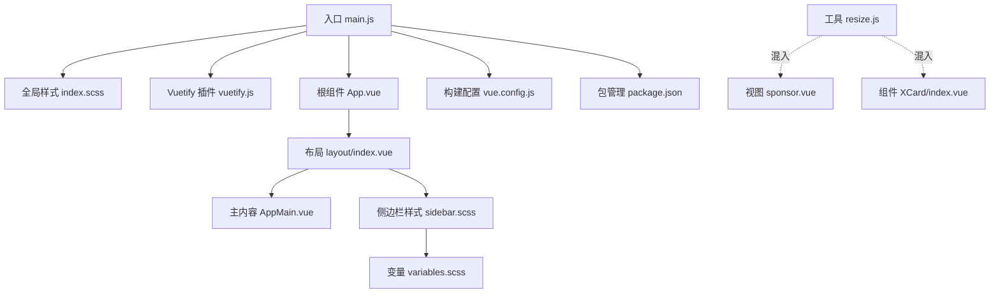
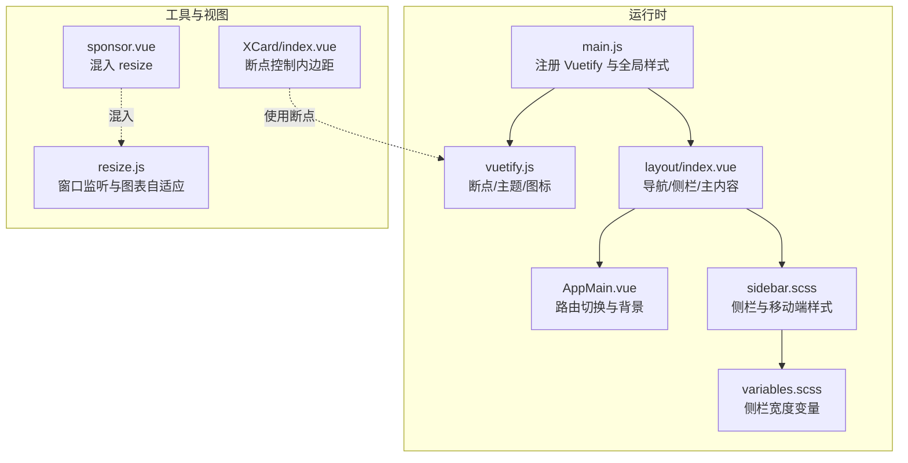
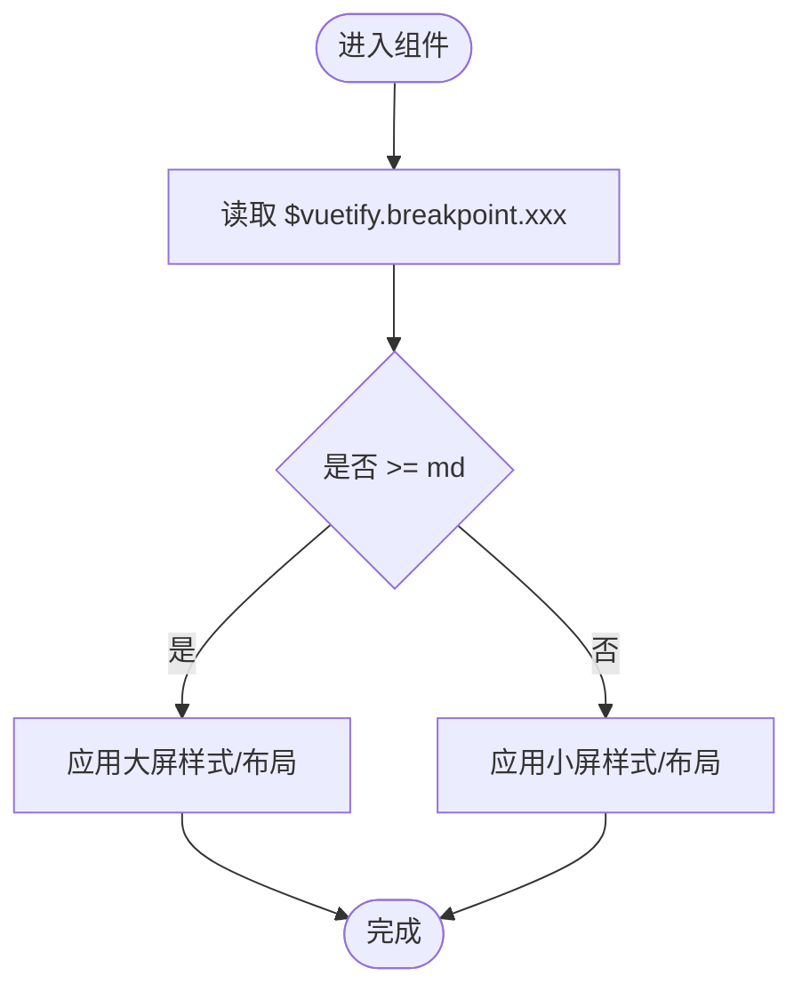
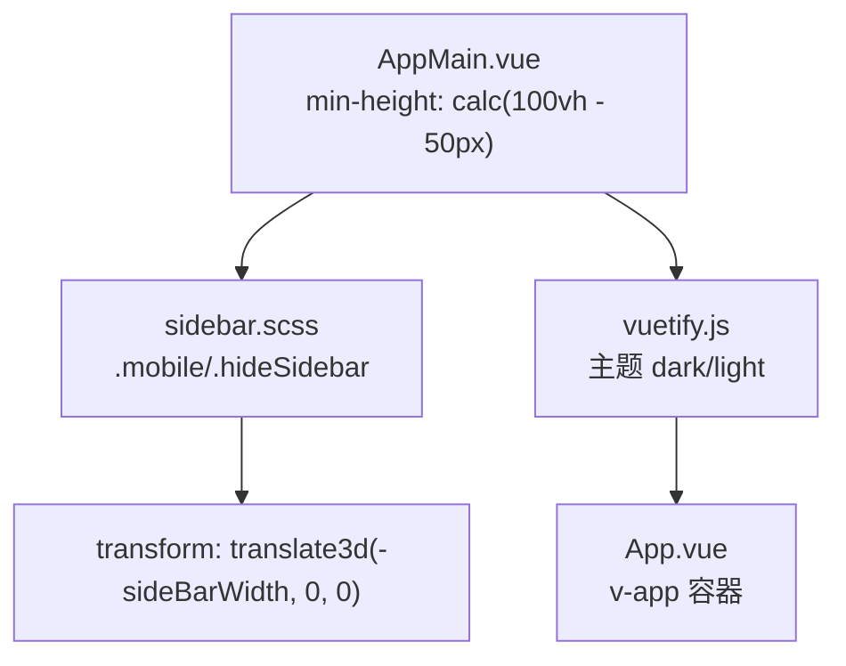
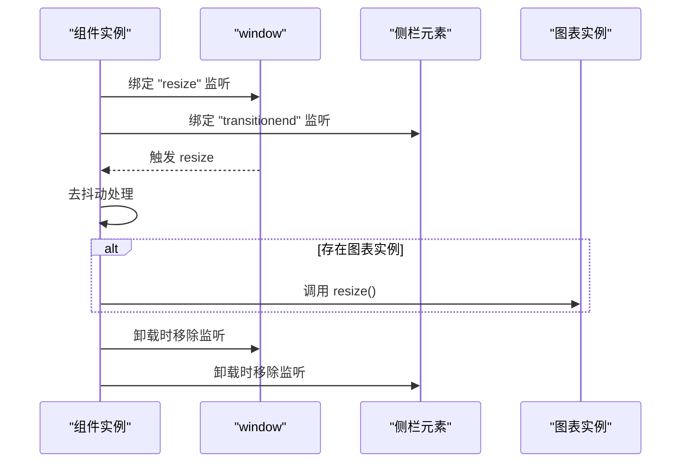
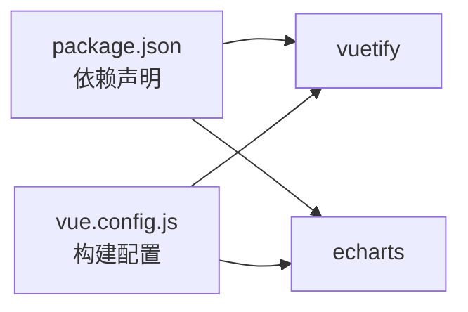

# 响应式设计

<cite>
**本文引用的文件**   
- [SpeedRunners.UI/src/utils/resize.js](file://SpeedRunners.UI/src/utils/resize.js)
- [SpeedRunners.UI/src/plugins/vuetify.js](file://SpeedRunners.UI/src/plugins/vuetify.js)
- [SpeedRunners.UI/src/styles/variables.scss](file://SpeedRunners.UI/src/styles/variables.scss)
- [SpeedRunners.UI/src/styles/sidebar.scss](file://SpeedRunners.UI/src/styles/sidebar.scss)
- [SpeedRunners.UI/src/styles/index.scss](file://SpeedRunners.UI/src/styles/index.scss)
- [SpeedRunners.UI/src/layout/index.vue](file://SpeedRunners.UI/src/layout/index.vue)
- [SpeedRunners.UI/src/layout/components/AppMain.vue](file://SpeedRunners.UI/src/layout/components/AppMain.vue)
- [SpeedRunners.UI/src/main.js](file://SpeedRunners.UI/src/main.js)
- [SpeedRunners.UI/vue.config.js](file://SpeedRunners.UI/vue.config.js)
- [SpeedRunners.UI/package.json](file://SpeedRunners.UI/package.json)
- [SpeedRunners.UI/src/views/index/sponsor.vue](file://SpeedRunners.UI/src/views/index/sponsor.vue)
- [SpeedRunners.UI/src/components/XCard/index.vue](file://SpeedRunners.UI/src/components/XCard/index.vue)
</cite>

## 目录
1. [简介](#简介)
2. [项目结构](#项目结构)
3. [核心组件](#核心组件)
4. [架构总览](#架构总览)
5. [详细组件分析](#详细组件分析)
6. [依赖关系分析](#依赖关系分析)
7. [性能考量](#性能考量)
8. [故障排查指南](#故障排查指南)
9. [结论](#结论)
10. [附录](#附录)

## 简介
本章节面向 SpeedRunnersLab 前端（Vue 2 + Vuetify）的响应式设计实现，聚焦以下主题：
- Vuetify 断点系统在代码中的使用方式与场景
- 自适应布局：网格系统、弹性布局、媒体查询的组合应用
- 窗口大小监听与响应式行为：resize.js 的事件绑定、去抖动与图表自适应
- 移动端适配最佳实践：触摸交互、屏幕适配、性能优化
- 响应式图片与视频处理：懒加载、格式转换、尺寸适配策略
- 响应式设计的测试与调试方法

## 项目结构
前端位于 SpeedRunners.UI，采用 Vue CLI 构建，样式通过 Sass 组织，布局由 Vuetify 提供基础组件，断点与主题能力来自 Vuetify 插件。

**图示来源**
- [SpeedRunners.UI/src/main.js](file://SpeedRunners.UI/src/main.js#L1-L30)
- [SpeedRunners.UI/src/styles/index.scss](file://SpeedRunners.UI/src/styles/index.scss#L1-L68)
- [SpeedRunners.UI/src/plugins/vuetify.js](file://SpeedRunners.UI/src/plugins/vuetify.js#L1-L33)
- [SpeedRunners.UI/src/layout/index.vue](file://SpeedRunners.UI/src/layout/index.vue#L1-L355)
- [SpeedRunners.UI/src/layout/components/AppMain.vue](file://SpeedRunners.UI/src/layout/components/AppMain.vue#L1-L36)
- [SpeedRunners.UI/src/styles/sidebar.scss](file://SpeedRunners.UI/src/styles/sidebar.scss#L1-L84)
- [SpeedRunners.UI/src/styles/variables.scss](file://SpeedRunners.UI/src/styles/variables.scss#L1-L26)
- [SpeedRunners.UI/vue.config.js](file://SpeedRunners.UI/vue.config.js#L1-L129)
- [SpeedRunners.UI/package.json](file://SpeedRunners.UI/package.json#L1-L76)
- [SpeedRunners.UI/src/utils/resize.js](file://SpeedRunners.UI/src/utils/resize.js#L1-L55)
- [SpeedRunners.UI/src/views/index/sponsor.vue](file://SpeedRunners.UI/src/views/index/sponsor.vue#L1-L43)
- [SpeedRunners.UI/src/components/XCard/index.vue](file://SpeedRunners.UI/src/components/XCard/index.vue#L57-L102)

**章节来源**
- [SpeedRunners.UI/src/main.js](file://SpeedRunners.UI/src/main.js#L1-L30)
- [SpeedRunners.UI/src/styles/index.scss](file://SpeedRunners.UI/src/styles/index.scss#L1-L68)
- [SpeedRunners.UI/vue.config.js](file://SpeedRunners.UI/vue.config.js#L1-L129)

## 核心组件
- Vuetify 断点与主题：通过插件初始化断点、图标与主题开关，断点信息在组件中以 $vuetify.breakpoint.xxx 使用。
- 布局容器：App.vue 包裹 v-app，layout/index.vue 提供导航栏、侧边栏、主内容区与页脚；AppMain.vue 负责路由切换动画与背景。
- 侧边栏样式：sidebar.scss 定义固定侧栏宽度与移动端 transform 切换；variables.scss 提供侧栏宽度变量。
- 窗口监听与图表自适应：resize.js 作为混入，统一处理 window.resize 与侧栏过渡结束事件，对图表进行 resize。
- 视图与组件：sponsor.vue 与 XCard/index.vue 展示断点驱动的布局与内边距差异。

**章节来源**
- [SpeedRunners.UI/src/plugins/vuetify.js](file://SpeedRunners.UI/src/plugins/vuetify.js#L1-L33)
- [SpeedRunners.UI/src/layout/index.vue](file://SpeedRunners.UI/src/layout/index.vue#L1-L355)
- [SpeedRunners.UI/src/layout/components/AppMain.vue](file://SpeedRunners.UI/src/layout/components/AppMain.vue#L1-L36)
- [SpeedRunners.UI/src/styles/sidebar.scss](file://SpeedRunners.UI/src/styles/sidebar.scss#L1-L84)
- [SpeedRunners.UI/src/styles/variables.scss](file://SpeedRunners.UI/src/styles/variables.scss#L1-L26)
- [SpeedRunners.UI/src/utils/resize.js](file://SpeedRunners.UI/src/utils/resize.js#L1-L55)
- [SpeedRunners.UI/src/views/index/sponsor.vue](file://SpeedRunners.UI/src/views/index/sponsor.vue#L1-L43)
- [SpeedRunners.UI/src/components/XCard/index.vue](file://SpeedRunners.UI/src/components/XCard/index.vue#L57-L102)

## 架构总览
下图展示响应式相关模块之间的交互关系：入口注入 Vuetify → 布局层使用断点与主题 → 样式层提供变量与媒体查询 → 工具层统一处理窗口变化 → 视图与组件按断点渲染。

**图示来源**
- [SpeedRunners.UI/src/main.js](file://SpeedRunners.UI/src/main.js#L1-L30)
- [SpeedRunners.UI/src/plugins/vuetify.js](file://SpeedRunners.UI/src/plugins/vuetify.js#L1-L33)
- [SpeedRunners.UI/src/layout/index.vue](file://SpeedRunners.UI/src/layout/index.vue#L1-L355)
- [SpeedRunners.UI/src/layout/components/AppMain.vue](file://SpeedRunners.UI/src/layout/components/AppMain.vue#L1-L36)
- [SpeedRunners.UI/src/styles/sidebar.scss](file://SpeedRunners.UI/src/styles/sidebar.scss#L1-L84)
- [SpeedRunners.UI/src/styles/variables.scss](file://SpeedRunners.UI/src/styles/variables.scss#L1-L26)
- [SpeedRunners.UI/src/utils/resize.js](file://SpeedRunners.UI/src/utils/resize.js#L1-L55)
- [SpeedRunners.UI/src/views/index/sponsor.vue](file://SpeedRunners.UI/src/views/index/sponsor.vue#L1-L43)
- [SpeedRunners.UI/src/components/XCard/index.vue](file://SpeedRunners.UI/src/components/XCard/index.vue#L57-L102)

## 详细组件分析

### Vuetify 断点系统与使用场景
- 初始化与断点访问：在插件中启用 Vuetify，并通过 $vuetify.breakpoint.xxx 获取当前断点状态（如 mdAndUp），用于条件渲染与布局调整。
- 典型用法：
  - XCard 组件根据断点动态设置卡片内边距，保证小屏紧凑、大屏舒适。
  - sponsor 视图通过混入 resize，在窗口变化时触发图表自适应。
- 断点语义映射（基于 Vuetify 2）：
  - xs：超小屏（默认）
  - sm：小屏
  - md：中屏
  - lg：大屏
  - xl：超大屏
  - 以及组合断点如 mdAndUp、smAndDown 等

**图示来源**
- [SpeedRunners.UI/src/components/XCard/index.vue](file://SpeedRunners.UI/src/components/XCard/index.vue#L74-L83)

**章节来源**
- [SpeedRunners.UI/src/plugins/vuetify.js](file://SpeedRunners.UI/src/plugins/vuetify.js#L1-L33)
- [SpeedRunners.UI/src/components/XCard/index.vue](file://SpeedRunners.UI/src/components/XCard/index.vue#L57-L102)

### 自适应布局：网格系统、弹性布局与媒体查询
- 网格系统：布局层使用 Vuetify 的栅格组件（如 v-row、v-col）组织页面结构，配合断点属性实现列数与间距自适应。
- 弹性布局：AppMain.vue 使用 CSS 过渡与背景覆盖，结合 calc(100vh - 50px) 实现主内容区高度自适应。
- 媒体查询：sidebar.scss 中针对移动端使用 transform 切换侧栏，隐藏时通过 translate3d 阻止交互并平滑过渡。
- 变量与主题：variables.scss 导出侧栏宽度变量供样式使用；vuetify.js 控制主题深浅模式与语言。

**图示来源**
- [SpeedRunners.UI/src/layout/components/AppMain.vue](file://SpeedRunners.UI/src/layout/components/AppMain.vue#L23-L36)
- [SpeedRunners.UI/src/styles/sidebar.scss](file://SpeedRunners.UI/src/styles/sidebar.scss#L57-L82)
- [SpeedRunners.UI/src/plugins/vuetify.js](file://SpeedRunners.UI/src/plugins/vuetify.js#L24-L33)
- [SpeedRunners.UI/src/layout/index.vue](file://SpeedRunners.UI/src/layout/index.vue#L1-L355)

**章节来源**
- [SpeedRunners.UI/src/layout/components/AppMain.vue](file://SpeedRunners.UI/src/layout/components/AppMain.vue#L1-L36)
- [SpeedRunners.UI/src/styles/sidebar.scss](file://SpeedRunners.UI/src/styles/sidebar.scss#L1-L84)
- [SpeedRunners.UI/src/styles/variables.scss](file://SpeedRunners.UI/src/styles/variables.scss#L1-L26)
- [SpeedRunners.UI/src/plugins/vuetify.js](file://SpeedRunners.UI/src/plugins/vuetify.js#L1-L33)

### 窗口大小监听与响应式行为（resize.js）
- 功能概述：在组件挂载时监听 window.resize 与侧栏 transitionend 事件，使用去抖动函数避免频繁重绘；当检测到图表实例存在时触发 chart.resize()。
- 生命周期钩子：mounted/activated 绑定事件，beforeDestroy/deactivated 解绑，解决 keep-alive 缓存导致的事件泄漏。
- 应用场景：在需要根据窗口变化重新计算图表尺寸的视图中混入该工具，如 sponsor 页面。

**图示来源**
- [SpeedRunners.UI/src/utils/resize.js](file://SpeedRunners.UI/src/utils/resize.js#L1-L55)
- [SpeedRunners.UI/src/views/index/sponsor.vue](file://SpeedRunners.UI/src/views/index/sponsor.vue#L32-L37)

**章节来源**
- [SpeedRunners.UI/src/utils/resize.js](file://SpeedRunners.UI/src/utils/resize.js#L1-L55)
- [SpeedRunners.UI/src/views/index/sponsor.vue](file://SpeedRunners.UI/src/views/index/sponsor.vue#L1-L43)

### 移动端适配最佳实践
- 触摸交互：使用 Vuetify 的按钮、菜单、抽屉等组件，确保点击目标足够大、间距合理；在移动端使用临时抽屉（temporary）承载导航。
- 屏幕适配：sidebar.scss 的 .mobile 类在小屏时禁用 margin-left 并使用 transform 隐藏侧栏；通过断点切换显示/隐藏逻辑。
- 性能优化：避免在 resize 回调中执行昂贵操作；使用去抖动；必要时关闭动画（withoutAnimation）减少重排。
- 主题与可读性：通过 vuetify.js 切换 dark 主题，结合 AppMain.vue 的背景色计算，提升不同环境下的可读性。

**章节来源**
- [SpeedRunners.UI/src/styles/sidebar.scss](file://SpeedRunners.UI/src/styles/sidebar.scss#L57-L82)
- [SpeedRunners.UI/src/layout/index.vue](file://SpeedRunners.UI/src/layout/index.vue#L67-L115)
- [SpeedRunners.UI/src/layout/components/AppMain.vue](file://SpeedRunners.UI/src/layout/components/AppMain.vue#L16-L18)
- [SpeedRunners.UI/src/plugins/vuetify.js](file://SpeedRunners.UI/src/plugins/vuetify.js#L24-L33)

### 响应式图片与视频处理
- 图片尺寸适配：在布局中使用 v-img 的 contain/cover 等属性，结合断点控制宽度，确保在不同设备上清晰显示。
- 懒加载与格式转换：建议在业务层引入懒加载策略（如 IntersectionObserver）与 WebP 等现代格式，以降低带宽与提升加载速度。
- 视频适配：使用 HTML5 video 或第三方播放器时，设置宽高比与流式宽度，配合断点切换播放器尺寸或分辨率。
- 注意：当前仓库未直接包含图片懒加载与格式转换的具体实现，建议在新增视图中按需集成。

**章节来源**
- [SpeedRunners.UI/src/layout/index.vue](file://SpeedRunners.UI/src/layout/index.vue#L6-L11)
- [SpeedRunners.UI/src/layout/components/AppMain.vue](file://SpeedRunners.UI/src/layout/components/AppMain.vue#L24-L32)

### 响应式设计测试与调试
- 浏览器开发者工具：使用设备模拟器（Device Toolbar）切换常见断点（xs/sm/md/lg/xl），观察布局与组件表现。
- 断点调试：在组件中打印 $vuetify.breakpoint 的值，确认断点判断逻辑正确。
- 性能观测：关注 resize 事件频率与图表重绘次数，必要时增加节流/去抖参数或关闭动画。
- 样式检查：核对 sidebar.scss 的 .mobile 与 .hideSidebar 条件，确保侧栏在小屏下的行为符合预期。

**章节来源**
- [SpeedRunners.UI/src/plugins/vuetify.js](file://SpeedRunners.UI/src/plugins/vuetify.js#L1-L33)
- [SpeedRunners.UI/src/styles/sidebar.scss](file://SpeedRunners.UI/src/styles/sidebar.scss#L57-L82)
- [SpeedRunners.UI/src/utils/resize.js](file://SpeedRunners.UI/src/utils/resize.js#L1-L55)

## 依赖关系分析
- 构建与兼容：vue.config.js 对 SVG Sprite、预加载与分包进行配置；browserslist 指定目标浏览器范围，间接影响断点与样式的兼容性。
- 第三方库：Vuetify 提供断点、主题与组件；echarts 在需要图表自适应的视图中被调用 resize。

**图示来源**
- [SpeedRunners.UI/package.json](file://SpeedRunners.UI/package.json#L15-L32)
- [SpeedRunners.UI/vue.config.js](file://SpeedRunners.UI/vue.config.js#L58-L129)

**章节来源**
- [SpeedRunners.UI/package.json](file://SpeedRunners.UI/package.json#L1-L76)
- [SpeedRunners.UI/vue.config.js](file://SpeedRunners.UI/vue.config.js#L1-L129)

## 性能考量
- 减少重排与重绘：在 resize.js 中使用去抖动；在 sidebar.scss 中使用 transform 替代改变布局属性。
- 资源优化：通过 vue.config.js 的 splitChunks 与 runtimeChunk 优化打包体积；按需加载非关键资源。
- 主题切换：主题切换仅修改 CSS 变量与类名，避免全量样式重算。

**章节来源**
- [SpeedRunners.UI/src/utils/resize.js](file://SpeedRunners.UI/src/utils/resize.js#L1-L55)
- [SpeedRunners.UI/src/styles/sidebar.scss](file://SpeedRunners.UI/src/styles/sidebar.scss#L64-L74)
- [SpeedRunners.UI/vue.config.js](file://SpeedRunners.UI/vue.config.js#L107-L126)

## 故障排查指南
- 图表不随窗口变化而自适应：确认组件已混入 resize 工具并在 mounted 后初始化监听；检查是否存在 chart 实例。
- 侧栏在小屏不可见或无法展开：检查 sidebar.scss 的 .mobile 与 .hideSidebar 条件是否生效；确认 transform 是否被覆盖。
- 主题切换无效：检查 vuetify.js 的 theme.dark 设置与本地存储键值；确认 App.vue 的 v-app 容器是否正确包裹。
- 构建后样式异常：核对 vue.config.js 的 alias 与样式导入顺序；确保 index.scss 优先加载。

**章节来源**
- [SpeedRunners.UI/src/utils/resize.js](file://SpeedRunners.UI/src/utils/resize.js#L10-L32)
- [SpeedRunners.UI/src/styles/sidebar.scss](file://SpeedRunners.UI/src/styles/sidebar.scss#L57-L82)
- [SpeedRunners.UI/src/plugins/vuetify.js](file://SpeedRunners.UI/src/plugins/vuetify.js#L24-L33)
- [SpeedRunners.UI/src/styles/index.scss](file://SpeedRunners.UI/src/styles/index.scss#L1-L4)

## 结论
SpeedRunnersLab 的响应式设计以 Vuetify 为核心，结合 Sass 变量与媒体查询、以及自研的 resize 工具，实现了从断点感知到布局自适应再到图表自适应的完整链路。通过在视图与组件中合理使用断点、在样式中采用 transform 与 calc 计算高度、在工具层统一处理窗口变化，项目在桌面端与移动端均具备良好的可用性与性能表现。后续可在图片懒加载与格式转换方面进一步完善，以提升移动端加载体验。

## 附录
- 断点速查（基于 Vuetify 2）：xs（超小）、sm（小）、md（中）、lg（大）、xl（超大），以及组合断点如 mdAndUp、smAndDown 等。
- 关键实现路径参考：
  - 断点使用：[XCard/index.vue](file://SpeedRunners.UI/src/components/XCard/index.vue#L74-L83)
  - 窗口监听：[resize.js](file://SpeedRunners.UI/src/utils/resize.js#L1-L55)
  - 侧栏样式：[sidebar.scss](file://SpeedRunners.UI/src/styles/sidebar.scss#L1-L84)
  - 主题与图标：[vuetify.js](file://SpeedRunners.UI/src/plugins/vuetify.js#L1-L33)
  - 构建与兼容：[vue.config.js](file://SpeedRunners.UI/vue.config.js#L1-L129)