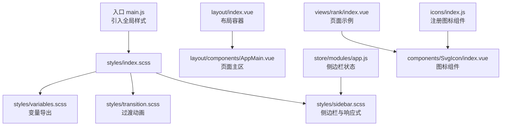
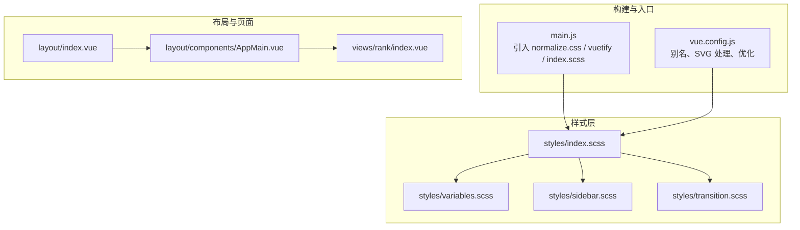
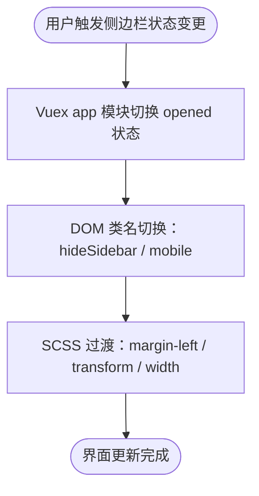
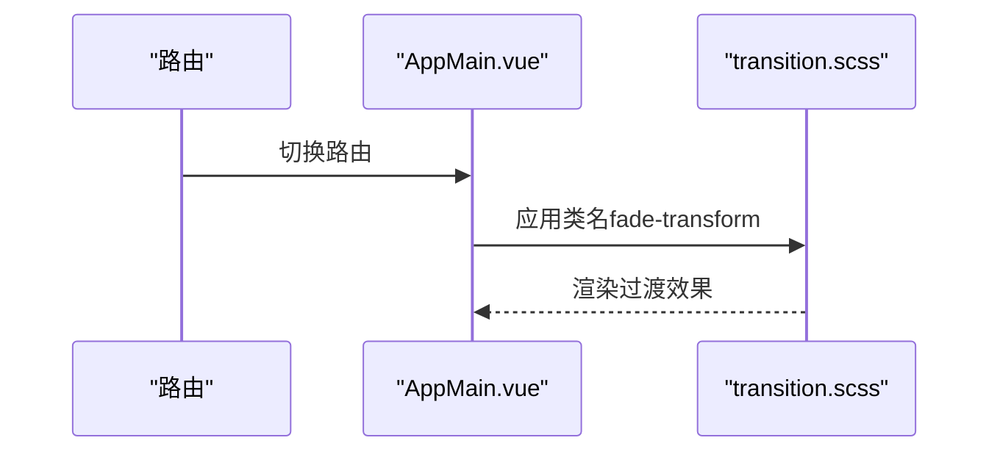
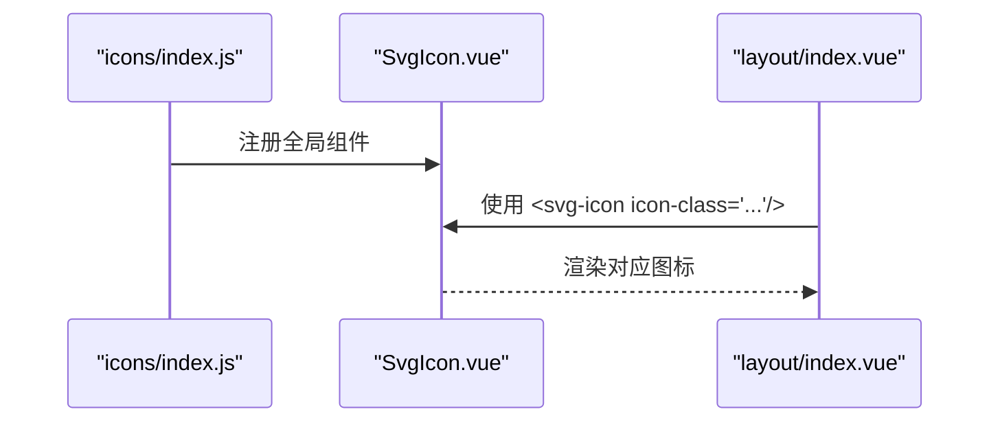
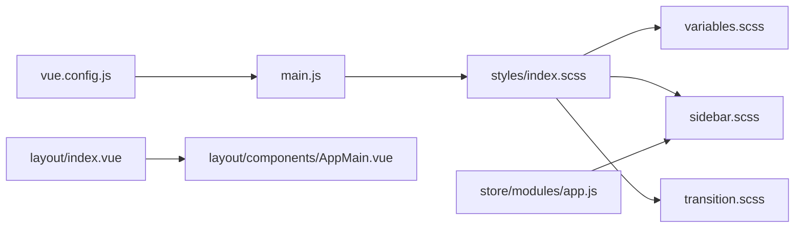

# 样式系统

<cite>
**本文引用的文件**
- [index.scss](file://SpeedRunners.UI/src/styles/index.scss)
- [variables.scss](file://SpeedRunners.UI/src/styles/variables.scss)
- [sidebar.scss](file://SpeedRunners.UI/src/styles/sidebar.scss)
- [transition.scss](file://SpeedRunners.UI/src/styles/transition.scss)
- [main.js](file://SpeedRunners.UI/src/main.js)
- [vue.config.js](file://SpeedRunners.UI/vue.config.js)
- [layout/index.vue](file://SpeedRunners.UI/src/layout/index.vue)
- [layout/components/AppMain.vue](file://SpeedRunners.UI/src/layout/components/AppMain.vue)
- [store/modules/app.js](file://SpeedRunners.UI/src/store/modules/app.js)
- [views/rank/index.vue](file://SpeedRunners.UI/src/views/rank/index.vue)
- [components/SvgIcon/index.vue](file://SpeedRunners.UI/src/components/SvgIcon/index.vue)
- [icons/index.js](file://SpeedRunners.UI/src/icons/index.js)
</cite>

## 目录
1. [简介](#简介)
2. [项目结构](#项目结构)
3. [核心组件](#核心组件)
4. [架构总览](#架构总览)
5. [详细组件分析](#详细组件分析)
6. [依赖关系分析](#依赖关系分析)
7. [性能考量](#性能考量)
8. [故障排查指南](#故障排查指南)
9. [结论](#结论)
10. [附录](#附录)

## 简介
本文件系统性梳理 SpeedRunners.UI 的样式系统，聚焦 SCSS 变量体系、全局样式组织、侧边栏与响应式布局、过渡动画、模块化与可维护性策略，并结合实际代码路径给出落地实践与调试建议。目标是帮助开发者快速理解并高效扩展样式层。

## 项目结构
样式系统位于前端工程 SpeedRunners.UI 的 src/styles 目录下，采用“变量 → 全局 → 模块”的分层组织方式；同时通过入口文件集中引入，配合构建配置完成编译与打包。

图表来源
- [main.js](file://SpeedRunners.UI/src/main.js#L1-L30)
- [index.scss](file://SpeedRunners.UI/src/styles/index.scss#L1-L68)
- [variables.scss](file://SpeedRunners.UI/src/styles/variables.scss#L1-L26)
- [sidebar.scss](file://SpeedRunners.UI/src/styles/sidebar.scss#L1-L84)
- [transition.scss](file://SpeedRunners.UI/src/styles/transition.scss#L1-L49)
- [layout/index.vue](file://SpeedRunners.UI/src/layout/index.vue#L1-L355)
- [layout/components/AppMain.vue](file://SpeedRunners.UI/src/layout/components/AppMain.vue#L1-L36)
- [store/modules/app.js](file://SpeedRunners.UI/src/store/modules/app.js#L1-L48)
- [views/rank/index.vue](file://SpeedRunners.UI/src/views/rank/index.vue#L1-L309)
- [components/SvgIcon/index.vue](file://SpeedRunners.UI/src/components/SvgIcon/index.vue#L1-L66)
- [icons/index.js](file://SpeedRunners.UI/src/icons/index.js#L1-L9)

章节来源
- [index.scss](file://SpeedRunners.UI/src/styles/index.scss#L1-L68)
- [variables.scss](file://SpeedRunners.UI/src/styles/variables.scss#L1-L26)
- [sidebar.scss](file://SpeedRunners.UI/src/styles/sidebar.scss#L1-L84)
- [transition.scss](file://SpeedRunners.UI/src/styles/transition.scss#L1-L49)
- [main.js](file://SpeedRunners.UI/src/main.js#L1-L30)

## 核心组件
- 变量系统：集中定义颜色、层级、尺寸等，支持 JS 导入共享，便于主题与组件复用。
- 全局样式：包含基础重置、通用类（如清除浮动）、页面容器内边距等。
- 侧边栏样式：固定定位、宽度控制、折叠/展开动画、移动端隐藏与位移。
- 过渡动画：提供淡入淡出、位移过渡、面包屑过渡等通用类。
- 布局与页面：通过布局容器与 AppMain 主区承载路由视图，配合 Vuetify 组件库实现交互与主题。

章节来源
- [variables.scss](file://SpeedRunners.UI/src/styles/variables.scss#L1-L26)
- [index.scss](file://SpeedRunners.UI/src/styles/index.scss#L1-L68)
- [sidebar.scss](file://SpeedRunners.UI/src/styles/sidebar.scss#L1-L84)
- [transition.scss](file://SpeedRunners.UI/src/styles/transition.scss#L1-L49)
- [layout/index.vue](file://SpeedRunners.UI/src/layout/index.vue#L1-L355)
- [layout/components/AppMain.vue](file://SpeedRunners.UI/src/layout/components/AppMain.vue#L1-L36)

## 架构总览
样式系统围绕“变量 → 全局 → 模块”三层展开，入口统一引入，构建时由 Webpack 链式处理，最终注入到 DOM 中生效。

图表来源
- [main.js](file://SpeedRunners.UI/src/main.js#L1-L30)
- [vue.config.js](file://SpeedRunners.UI/vue.config.js#L1-L129)
- [index.scss](file://SpeedRunners.UI/src/styles/index.scss#L1-L68)
- [variables.scss](file://SpeedRunners.UI/src/styles/variables.scss#L1-L26)
- [sidebar.scss](file://SpeedRunners.UI/src/styles/sidebar.scss#L1-L84)
- [transition.scss](file://SpeedRunners.UI/src/styles/transition.scss#L1-L49)
- [layout/index.vue](file://SpeedRunners.UI/src/layout/index.vue#L1-L355)
- [layout/components/AppMain.vue](file://SpeedRunners.UI/src/layout/components/AppMain.vue#L1-L36)
- [views/rank/index.vue](file://SpeedRunners.UI/src/views/rank/index.vue#L1-L309)

## 详细组件分析

### SCSS 变量系统与命名规范
- 颜色变量：菜单文本、激活文本、子菜单背景与悬停等，形成一套可复用的主题色板。
- 尺寸变量：侧边栏宽度统一管理，便于在多处样式中引用。
- 导出机制：通过特殊导出指令将变量暴露给 JS 使用，实现运行时主题切换与组件消费。

命名与组织建议
- 颜色：menuText、menuActiveText、subMenuBg 等语义化命名，避免无意义的十六进制直写。
- 尺寸：sideBarWidth 等以“功能域+属性”命名，减少跨模块耦合。
- 导出：仅导出必要变量，避免污染全局命名空间。

章节来源
- [variables.scss](file://SpeedRunners.UI/src/styles/variables.scss#L1-L26)

### 全局样式组织
- 基础重置：统一字体族、去除默认轮廓、统一盒模型，确保跨浏览器一致性。
- 通用类：提供清除浮动等工具类，降低重复样式编写。
- 页面容器：统一内边距与高度约束，保证内容区域一致的视觉节奏。

章节来源
- [index.scss](file://SpeedRunners.UI/src/styles/index.scss#L1-L68)

### 侧边栏样式设计
- 定位与尺寸：固定定位、宽度由变量控制，主内容区通过外边距占位。
- 动画与过渡：侧边栏与主内容区均设置过渡时间，折叠/展开与移动端隐藏采用位移与变换。
- 移动端适配：在移动端容器上增加位移与事件拦截，保证交互体验与性能。

图表来源
- [store/modules/app.js](file://SpeedRunners.UI/src/store/modules/app.js#L1-L48)
- [sidebar.scss](file://SpeedRunners.UI/src/styles/sidebar.scss#L1-L84)
- [layout/index.vue](file://SpeedRunners.UI/src/layout/index.vue#L1-L355)

章节来源
- [sidebar.scss](file://SpeedRunners.UI/src/styles/sidebar.scss#L1-L84)
- [store/modules/app.js](file://SpeedRunners.UI/src/store/modules/app.js#L1-L48)

### 过渡动画样式
- 淡入淡出：适用于通用显隐场景。
- 位移过渡：从左侧或右侧滑入，适合页面切换与抽屉类组件。
- 面包屑过渡：列表项移动与离开时的过渡，提升导航反馈。

图表来源
- [layout/components/AppMain.vue](file://SpeedRunners.UI/src/layout/components/AppMain.vue#L1-L36)
- [transition.scss](file://SpeedRunners.UI/src/styles/transition.scss#L1-L49)

章节来源
- [transition.scss](file://SpeedRunners.UI/src/styles/transition.scss#L1-L49)
- [layout/components/AppMain.vue](file://SpeedRunners.UI/src/layout/components/AppMain.vue#L1-L36)

### 图标与 SVG 集成
- 组件化：通过 SvgIcon 组件统一分发 Material Design Icons 与本地 SVG。
- 注册与加载：全局注册组件并通过上下文批量导入 SVG 资源，按需渲染。

图表来源
- [icons/index.js](file://SpeedRunners.UI/src/icons/index.js#L1-L9)
- [components/SvgIcon/index.vue](file://SpeedRunners.UI/src/components/SvgIcon/index.vue#L1-L66)
- [layout/index.vue](file://SpeedRunners.UI/src/layout/index.vue#L1-L355)

章节来源
- [icons/index.js](file://SpeedRunners.UI/src/icons/index.js#L1-L9)
- [components/SvgIcon/index.vue](file://SpeedRunners.UI/src/components/SvgIcon/index.vue#L1-L66)

### 页面级样式示例（排行榜页）
- 表格主题色：根据当前主题动态设置文字与条纹背景色。
- 响应式布局：通过计算属性判断设备宽度，调整列宽与元素尺寸。
- 自绘等级图标：通过裁剪与偏移实现精灵图切片展示。

章节来源
- [views/rank/index.vue](file://SpeedRunners.UI/src/views/rank/index.vue#L1-L309)

## 依赖关系分析
- 入口依赖：main.js 引入 normalize.css、vuetify 样式与全局 index.scss。
- 构建依赖：vue.config.js 设置别名、SVG 处理与分包优化，确保样式与资源正确打包。
- 运行时依赖：layout 与 AppMain 作为页面容器，配合 Vuex 控制侧边栏状态，transition 提供过渡类。

图表来源
- [main.js](file://SpeedRunners.UI/src/main.js#L1-L30)
- [index.scss](file://SpeedRunners.UI/src/styles/index.scss#L1-L68)
- [variables.scss](file://SpeedRunners.UI/src/styles/variables.scss#L1-L26)
- [sidebar.scss](file://SpeedRunners.UI/src/styles/sidebar.scss#L1-L84)
- [transition.scss](file://SpeedRunners.UI/src/styles/transition.scss#L1-L49)
- [vue.config.js](file://SpeedRunners.UI/vue.config.js#L1-L129)
- [layout/index.vue](file://SpeedRunners.UI/src/layout/index.vue#L1-L355)
- [layout/components/AppMain.vue](file://SpeedRunners.UI/src/layout/components/AppMain.vue#L1-L36)
- [store/modules/app.js](file://SpeedRunners.UI/src/store/modules/app.js#L1-L48)

章节来源
- [main.js](file://SpeedRunners.UI/src/main.js#L1-L30)
- [vue.config.js](file://SpeedRunners.UI/vue.config.js#L1-L129)

## 性能考量
- 样式体积控制：通过分包策略与按需加载，避免单文件过大。
- 过渡与动画：合理设置过渡时长与缓动函数，避免过度动画影响首屏与滚动性能。
- 图标资源：SVG 内联与复用，减少 HTTP 请求；外部图标使用遮罩方案时注意兼容性。
- 主题切换：变量导出至 JS 后，尽量避免频繁重排，优先使用 CSS 变量或类名切换。

## 故障排查指南
- 样式不生效
  - 检查入口是否正确引入全局样式与第三方样式。
  - 确认构建配置中别名与资源路径正确。
- 侧边栏动画异常
  - 核对状态变更是否触发相应类名切换。
  - 检查移动端隐藏逻辑与事件拦截是否生效。
- 过渡效果不对
  - 确认路由切换时是否应用了正确的过渡类名。
  - 检查是否存在样式覆盖导致过渡被禁用。
- 图标显示异常
  - 确认图标名称与注册是否匹配。
  - 检查 SVG 加载与 sprite 配置。

章节来源
- [main.js](file://SpeedRunners.UI/src/main.js#L1-L30)
- [sidebar.scss](file://SpeedRunners.UI/src/styles/sidebar.scss#L1-L84)
- [transition.scss](file://SpeedRunners.UI/src/styles/transition.scss#L1-L49)
- [icons/index.js](file://SpeedRunners.UI/src/icons/index.js#L1-L9)
- [components/SvgIcon/index.vue](file://SpeedRunners.UI/src/components/SvgIcon/index.vue#L1-L66)

## 结论
该样式系统以 SCSS 变量为核心，结合全局样式与模块化布局，实现了清晰的主题与交互体验。通过构建期优化与运行时状态驱动，兼顾了可维护性与性能。建议在后续迭代中持续完善变量命名规范、主题切换的原子化与可组合性，并加强样式测试与回归验证。

## 附录
- 开发调试建议
  - 使用浏览器开发者工具检查类名与过渡状态。
  - 对关键动画设置断点，观察渲染帧率与回流情况。
  - 在不同设备与主题模式下进行回归测试。
- 最佳实践清单
  - 使用语义化变量命名，避免硬编码值。
  - 将通用样式抽取为独立模块，减少重复。
  - 严格区分全局样式与组件作用域样式，避免冲突。
  - 保持过渡动画简洁，优先使用 transform 与 opacity。