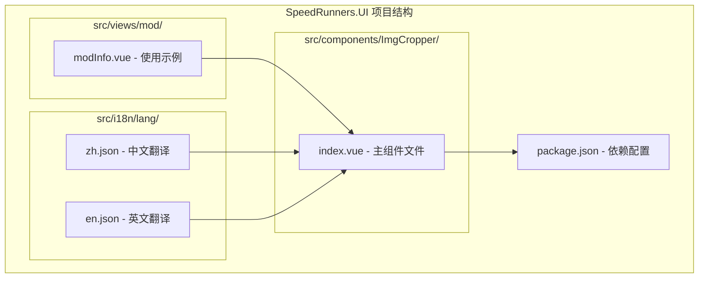
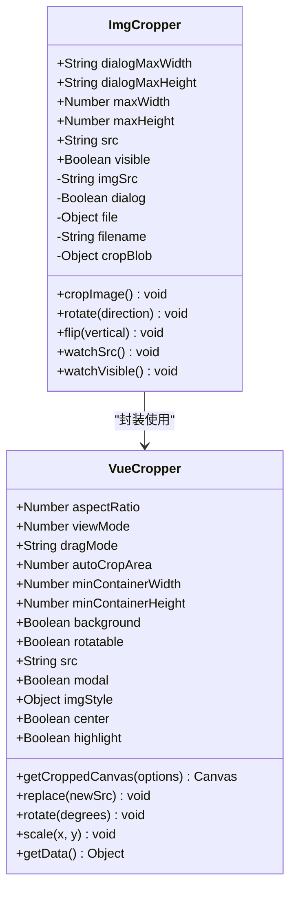
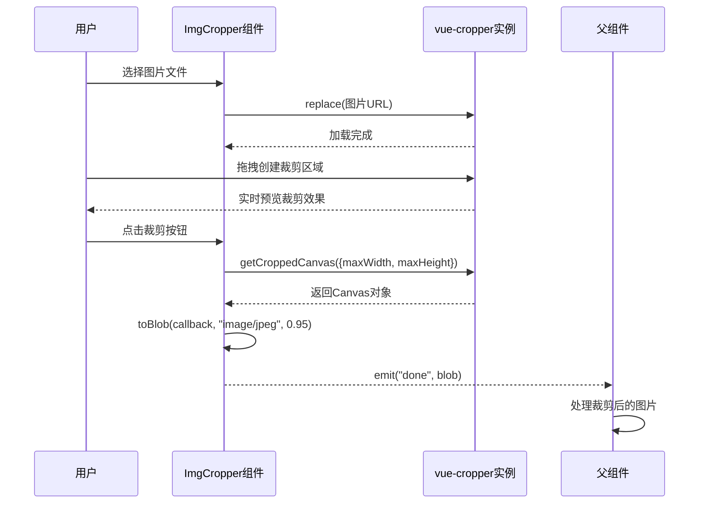
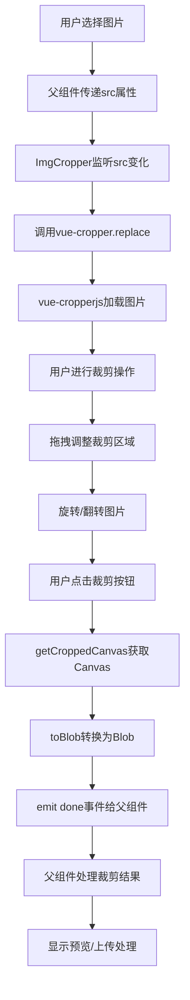
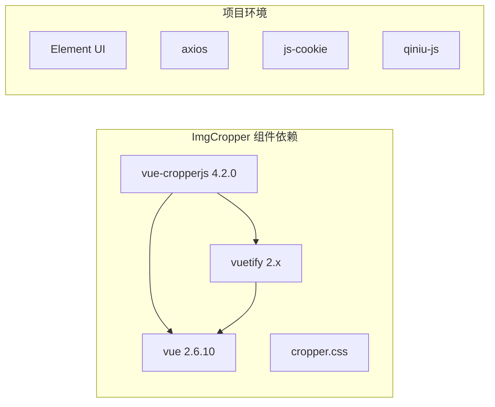
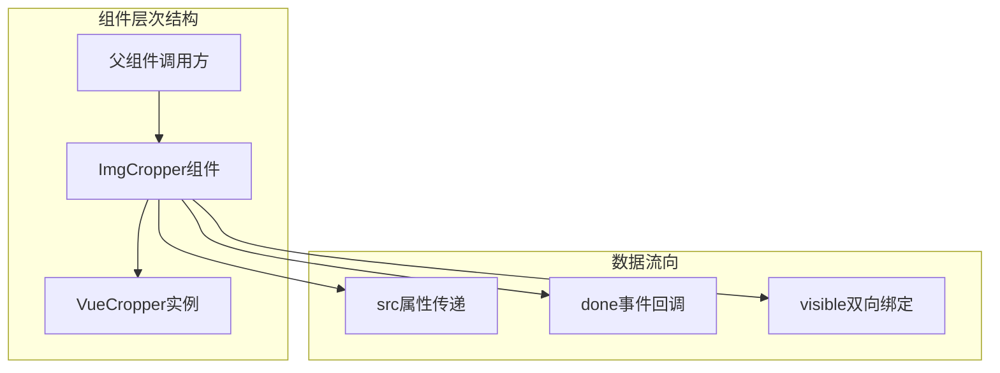

# ImgCropper 图片裁剪组件

<cite>
**本文档引用的文件**
- [index.vue](file://SpeedRunners.UI/src/components/ImgCropper/index.vue)
- [modInfo.vue](file://SpeedRunners.UI/src/views/mod/modInfo.vue)
- [zh.json](file://SpeedRunners.UI/src/i18n/lang/zh.json)
- [en.json](file://SpeedRunners.UI/src/i18n/lang/en.json)
- [package.json](file://SpeedRunners.UI/package.json)
</cite>

## 目录
1. [简介](#简介)
2. [项目结构](#项目结构)
3. [核心组件](#核心组件)
4. [架构概览](#架构概览)
5. [详细组件分析](#详细组件分析)
6. [依赖分析](#依赖分析)
7. [性能考虑](#性能考虑)
8. [故障排除指南](#故障排除指南)
9. [结论](#结论)
10. [附录](#附录)

## 简介

ImgCropper 是 SpeedRunners 项目中的一个 Vue 组件，专门用于图片裁剪和处理。该组件基于 vue-cropperjs 库构建，提供了完整的图片裁剪功能，包括拖拽选择、比例锁定、旋转翻转、实时预览等特性。

该组件主要服务于 MOD 上传功能，为用户提供直观的图片裁剪体验，确保上传的封面图片符合平台要求的尺寸和格式标准。

## 项目结构

ImgCropper 组件位于前端项目的组件目录中，采用标准的 Vue 单文件组件结构：



**图表来源**
- [index.vue](file://SpeedRunners.UI/src/components/ImgCropper/index.vue#L1-L157)
- [modInfo.vue](file://SpeedRunners.UI/src/views/mod/modInfo.vue#L1-L266)

**章节来源**
- [index.vue](file://SpeedRunners.UI/src/components/ImgCropper/index.vue#L1-L157)
- [modInfo.vue](file://SpeedRunners.UI/src/views/mod/modInfo.vue#L1-L266)

## 核心组件

### 组件架构设计

ImgCropper 采用对话框模式，通过 v-dialog 控制显示和隐藏，内部集成了 vue-cropperjs 的完整裁剪功能：



**图表来源**
- [index.vue](file://SpeedRunners.UI/src/components/ImgCropper/index.vue#L67-L150)

### 核心功能特性

1. **拖拽选择区域**: 基于 vue-cropperjs 的拖拽功能，用户可以通过鼠标拖拽创建裁剪区域
2. **比例锁定**: 固定 250:160 的宽高比，确保输出图片符合平台要求
3. **旋转翻转**: 支持 90° 顺时针/逆时针旋转和水平/垂直翻转
4. **实时预览**: 裁剪过程中的实时预览效果
5. **尺寸控制**: 可配置的最大输出尺寸限制

**章节来源**
- [index.vue](file://SpeedRunners.UI/src/components/ImgCropper/index.vue#L14-L29)
- [index.vue](file://SpeedRunners.UI/src/components/ImgCropper/index.vue#L112-L148)

## 架构概览

### 组件交互流程



**图表来源**
- [index.vue](file://SpeedRunners.UI/src/components/ImgCropper/index.vue#L113-L129)
- [modInfo.vue](file://SpeedRunners.UI/src/views/mod/modInfo.vue#L70-L76)

### 数据流架构



**图表来源**
- [index.vue](file://SpeedRunners.UI/src/components/ImgCropper/index.vue#L100-L111)
- [index.vue](file://SpeedRunners.UI/src/components/ImgCropper/index.vue#L113-L129)

## 详细组件分析

### 组件配置参数

| 参数名 | 类型 | 默认值 | 描述 |
|--------|------|--------|------|
| dialogMaxWidth | String | "600px" | 对话框最大宽度 |
| dialogMaxHeight | String | "0.8vh" | 对话框最大高度 |
| maxWidth | Number | 1920 | 输出图片最大宽度 |
| maxHeight | Number | 1200 | 输出图片最大高度 |
| src | String | "" | 图片源URL（支持Blob URL） |
| visible | Boolean | false | 控制组件显示/隐藏 |

### 核心方法实现

#### 裁剪功能 (`cropImage`)
- 获取裁剪后的 Canvas 对象
- 设置最大输出尺寸限制
- 转换为 JPEG 格式 Blob（质量 0.95）
- 触发 done 事件返回裁剪结果

#### 旋转功能 (`rotate`)
- 支持 90° 顺时针和逆时针旋转
- 自动处理旋转状态下的坐标变换

#### 翻转功能 (`flip`)
- 支持水平和垂直翻转
- 根据当前旋转角度智能调整翻转方向

**章节来源**
- [index.vue](file://SpeedRunners.UI/src/components/ImgCropper/index.vue#L71-L84)
- [index.vue](file://SpeedRunners.UI/src/components/ImgCropper/index.vue#L112-L148)

### 交互逻辑

#### 鼠标拖拽
- 支持拖拽创建和调整裁剪区域
- 实时预览裁剪效果
- 比例锁定确保固定宽高比

#### 键盘快捷键
- 通过图标按钮提供旋转和翻转操作
- 支持取消操作

#### 触摸设备支持
- 基于 vue-cropperjs 的触摸支持
- 移动端友好的手势操作

**章节来源**
- [index.vue](file://SpeedRunners.UI/src/components/ImgCropper/index.vue#L32-L48)

### 文件处理机制

#### 输入处理
- 支持任意图片格式（通过 accept 属性）
- 自动创建 Blob URL 供裁剪器使用
- 文件大小限制（5MB）

#### 输出处理
- 裁剪后输出为 JPEG 格式
- 质量参数 0.95，平衡质量和文件大小
- 支持自定义最大输出尺寸

#### 错误处理
- 组件级错误处理
- 国际化错误提示
- 状态管理和用户反馈

**章节来源**
- [modInfo.vue](file://SpeedRunners.UI/src/views/mod/modInfo.vue#L160-L176)
- [modInfo.vue](file://SpeedRunners.UI/src/views/mod/modInfo.vue#L107-L115)

## 依赖分析

### 外部依赖



**图表来源**
- [package.json](file://SpeedRunners.UI/package.json#L15-L32)

### 内部依赖关系



**图表来源**
- [index.vue](file://SpeedRunners.UI/src/components/ImgCropper/index.vue#L77-L84)
- [index.vue](file://SpeedRunners.UI/src/components/ImgCropper/index.vue#L100-L111)

**章节来源**
- [package.json](file://SpeedRunners.UI/package.json#L15-L32)

## 性能考虑

### 渲染优化
- 使用 v-dialog 控制组件渲染时机
- 按需加载 vue-cropperjs 库
- 合理的最小容器尺寸设置（250x160）

### 内存管理
- 及时清理 Blob URL 引用
- 组件销毁时释放相关资源
- 避免内存泄漏

### 网络优化
- JPEG 压缩质量 0.95 平衡画质和体积
- 可配置的最大输出尺寸限制
- 异步处理避免阻塞主线程

## 故障排除指南

### 常见问题及解决方案

#### 图片无法显示
- 检查 src 属性是否为有效的 Blob URL
- 确认图片格式兼容性
- 验证文件大小限制

#### 裁剪功能异常
- 确认 vue-cropperjs 库正确加载
- 检查 aspect-ratio 配置
- 验证容器尺寸设置

#### 旋转翻转问题
- 检查旋转状态同步
- 确认翻转方向计算逻辑
- 验证坐标变换准确性

**章节来源**
- [index.vue](file://SpeedRunners.UI/src/components/ImgCropper/index.vue#L100-L111)

## 结论

ImgCropper 组件是一个功能完整、易于使用的图片裁剪解决方案。它基于成熟的 vue-cropperjs 库，提供了丰富的图片编辑功能，包括拖拽裁剪、比例锁定、旋转翻转等特性。

该组件的设计充分考虑了用户体验和性能优化，在 SpeedRunners 项目中主要用于 MOD 上传功能，确保用户能够轻松创建符合平台要求的封面图片。

组件的模块化设计使得它可以在项目中灵活使用，同时保持良好的可维护性和扩展性。

## 附录

### 使用示例

#### 基础使用
```vue
<template>
  <ImgCropper 
    :visible.sync="showCropper"
    :src="imageUrl"
    @done="handleCropDone"
  />
</template>
```

#### 在 MOD 上传中的应用
组件在 MOD 信息页面中实现了完整的图片裁剪工作流，从图片选择到裁剪完成的全过程处理。

**章节来源**
- [modInfo.vue](file://SpeedRunners.UI/src/views/mod/modInfo.vue#L70-L76)

### 国际化支持
组件支持中英文双语界面，翻译键值包括：
- `components.cropper.title`: "封面尽量直观展现MOD样式"
- `components.cropper.crop`: "裁 剪"

**章节来源**
- [zh.json](file://SpeedRunners.UI/src/i18n/lang/zh.json#L208-L211)
- [en.json](file://SpeedRunners.UI/src/i18n/lang/en.json#L208-L211)