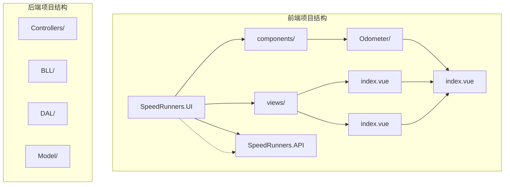
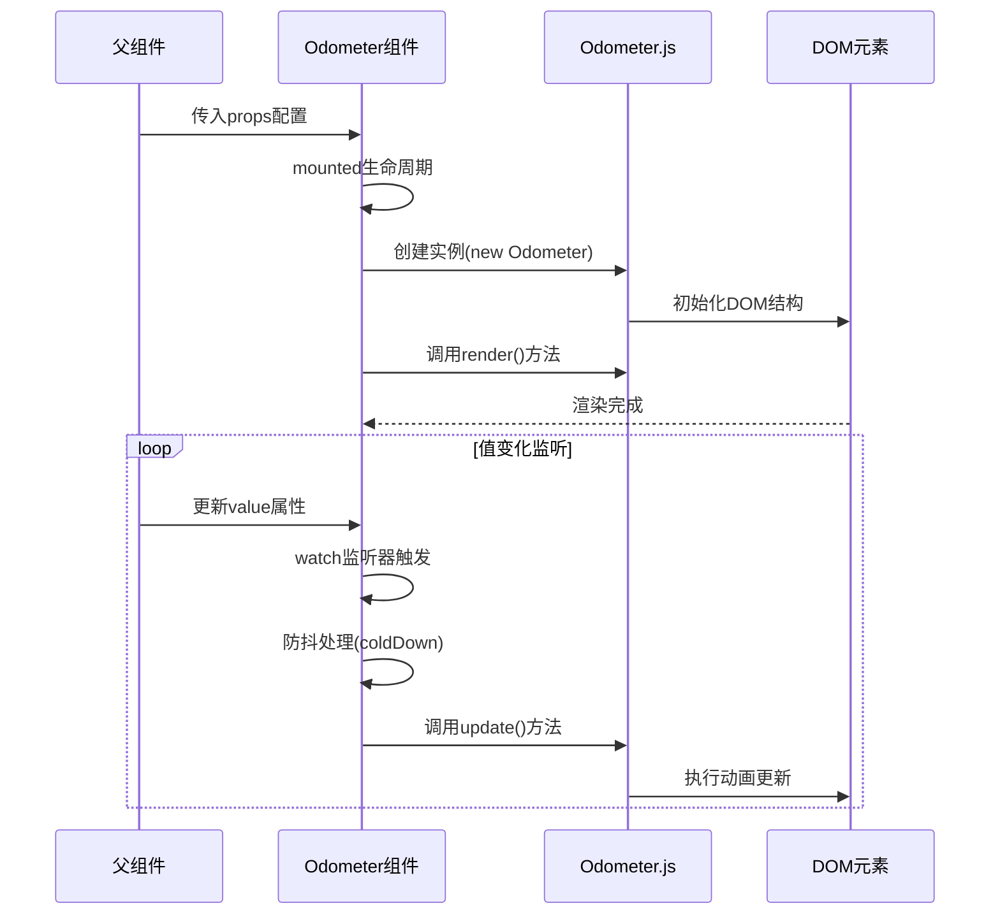
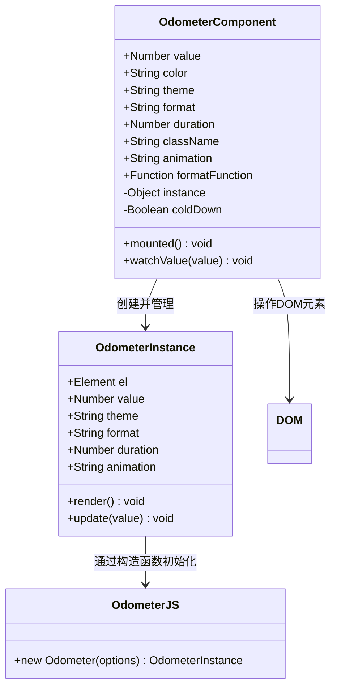
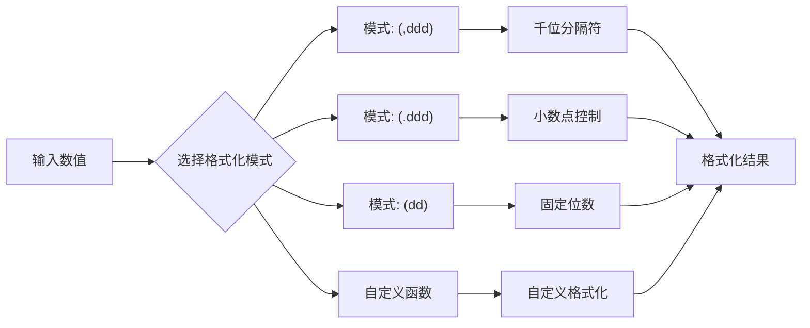

# Odometer 计数器组件

<cite>
**本文档引用的文件**
- [index.vue](file://SpeedRunners.UI/src/components/Odometer/index.vue)
- [package.json](file://SpeedRunners.UI/package.json)
- [index.vue](file://SpeedRunners.UI/src/views/index/index.vue)
- [index.vue](file://SpeedRunners.UI/src/views/match/index.vue)
- [README.md](file://README.md)
</cite>

## 目录
1. [简介](#简介)
2. [项目结构](#项目结构)
3. [核心组件](#核心组件)
4. [架构概览](#架构概览)
5. [详细组件分析](#详细组件分析)
6. [依赖关系分析](#依赖关系分析)
7. [性能考虑](#性能考虑)
8. [故障排除指南](#故障排除指南)
9. [结论](#结论)
10. [附录](#附录)

## 简介
Odometer 计数器组件是一个基于 Vue.js 和 Odometer.js 的数字滚动计数器组件。该组件提供了流畅的数字动画效果，支持多种主题样式、自定义格式化和动画时长控制。在 SpeedRunnersLab 项目中，该组件被广泛用于展示在线玩家数量、奖池金额等动态数据。

该项目采用现代化的技术栈：Vuetify + vue-admin-template + ASP.NET Core + Steam 开放 API，构建了一个功能完整的 SpeedRunners 游戏相关信息展示平台。

## 项目结构
SpeedRunnersLab 项目采用前后端分离架构，前端使用 Vue.js 技术栈，后端基于 ASP.NET Core。Odometer 组件位于前端项目的组件库中，作为可复用的 UI 组件供各个页面使用。



**图表来源**
- [index.vue](file://SpeedRunners.UI/src/components/Odometer/index.vue#L1-L72)
- [index.vue](file://SpeedRunners.UI/src/views/index/index.vue#L1-L84)
- [index.vue](file://SpeedRunners.UI/src/views/match/index.vue#L1-L250)

**章节来源**
- [README.md](file://README.md#L1-L5)
- [index.vue](file://SpeedRunners.UI/src/components/Odometer/index.vue#L1-L72)

## 核心组件
Odometer 计数器组件是基于第三方 Odometer.js 库封装的 Vue.js 组件，提供了以下核心功能：

### 主要特性
- **数字滚动动画**：提供流畅的数字变化动画效果
- **多主题支持**：内置多种预设主题样式
- **自定义格式化**：支持千位分隔符、小数位数控制
- **颜色定制**：支持自定义文本颜色
- **动画时长控制**：可配置动画持续时间
- **防抖处理**：避免频繁更新导致的性能问题

### 组件属性配置
组件通过 props 接收配置参数，所有参数都有默认值：

| 属性名 | 类型 | 默认值 | 描述 |
|--------|------|--------|------|
| value | Number | 0 | 显示的数值 |
| color | String | "white" | 文本颜色 |
| theme | String | "minimal" | 显示主题 |
| format | String | "(,ddd)" | 数字格式化模式 |
| duration | Number | 1000 | 动画持续时间（毫秒） |
| className | String | "odometer" | CSS 类名 |
| animation | String | "" | 动画类型 |
| formatFunction | Function | val => val | 自定义格式化函数 |

**章节来源**
- [index.vue](file://SpeedRunners.UI/src/components/Odometer/index.vue#L16-L25)

## 架构概览
Odometer 组件采用组件化设计，通过 Vue.js 的生命周期钩子与第三方 Odometer.js 库进行交互。



**图表来源**
- [index.vue](file://SpeedRunners.UI/src/components/Odometer/index.vue#L30-L49)
- [index.vue](file://SpeedRunners.UI/src/components/Odometer/index.vue#L50-L60)

## 详细组件分析

### 组件实现架构
Odometer 组件采用简洁的设计模式，主要包含以下关键部分：



**图表来源**
- [index.vue](file://SpeedRunners.UI/src/components/Odometer/index.vue#L14-L61)

### 数据流分析
组件的数据流遵循单向数据绑定原则，从父组件传递到子组件，通过 watch 监听器响应变化。

```mermaid
flowchart TD
Start([组件初始化]) --> Mount[mounted生命周期]
Mount --> CreateInstance[创建Odometer实例]
CreateInstance --> Render[调用render()渲染]
Render --> Wait[等待值变化]
Wait --> ValueChange{value属性变化?}
ValueChange --> |否| Wait
ValueChange --> |是| CheckColdDown{是否处于冷却期?}
CheckColdDown --> |是| DelayUpdate[延迟1秒执行]
CheckColdDown --> |否| ImmediateUpdate[立即更新]
DelayUpdate --> SetColdDown[设置冷却期]
ImmediateUpdate --> SetColdDown
SetColdDown --> ColdDownTimeout[1秒后重置]
ColdDownTimeout --> Wait
```

**图表来源**
- [index.vue](file://SpeedRunners.UI/src/components/Odometer/index.vue#L30-L49)

### 主题系统分析
组件支持多种预设主题，每种主题都有独特的视觉效果：

| 主题名称 | 特点 | 适用场景 |
|----------|------|----------|
| minimal | 极简风格 | 数据展示、统计面板 |
| digital | 数字屏风格 | 科技感界面、仪表盘 |
| car | 汽车仪表风格 | 汽车相关应用、速度显示 |
| plaza | 广场风格 | 商业环境、大型展示屏 |
| slot-machine | 赌场老虎机风格 | 娱乐应用、游戏界面 |
| train-station | 火车站风格 | 交通应用、时刻表显示 |
| default | 默认风格 | 通用场景、基础使用 |

**章节来源**
- [index.vue](file://SpeedRunners.UI/src/components/Odometer/index.vue#L7-L13)

### 格式化系统
组件支持灵活的数字格式化，通过 format 属性控制输出格式：



**图表来源**
- [index.vue](file://SpeedRunners.UI/src/components/Odometer/index.vue#L20)
- [index.vue](file://SpeedRunners.UI/src/components/Odometer/index.vue#L24)

## 依赖关系分析
Odometer 组件的依赖关系相对简单，主要依赖于第三方 Odometer.js 库和相关的样式文件。

```mermaid
graph TB
subgraph "组件依赖"
OdometerVue[index.vue]
OdometerJS[odometer/odometer.min.js]
ThemeCSS[主题样式文件]
OdometerVue --> OdometerJS
OdometerVue --> ThemeCSS
end
subgraph "运行时依赖"
VueRuntime[vue@2.6.10]
OdometerLib[odometer@^0.4.8]
Vuetify[vuetify@~2.3.11]
end
OdometerJS --> OdometerLib
OdometerVue --> VueRuntime
OdometerVue --> Vuetify
```

**图表来源**
- [index.vue](file://SpeedRunners.UI/src/components/Odometer/index.vue#L6-L13)
- [package.json](file://SpeedRunners.UI/package.json#L15-L33)

**章节来源**
- [package.json](file://SpeedRunners.UI/package.json#L22)
- [package.json](file://SpeedRunners.UI/package.json#L25)

## 性能考虑
Odometer 组件在设计时充分考虑了性能优化，采用了多种策略来确保良好的用户体验：

### 动画帧控制
组件通过防抖机制避免频繁的动画更新：
- 冷却期机制：每次更新后设置1秒冷却时间
- 延迟队列：在冷却期内的更新请求会被延迟执行
- 避免动画冲突：防止多个快速连续的动画同时进行

### DOM 操作优化
- 单一根节点：组件只使用一个 span 元素作为容器
- 样式内联：颜色通过内联样式设置，减少额外的 CSS 类
- 最小化重排：Odometer.js 库内部处理 DOM 重排优化

### 内存管理
- 实例销毁：组件卸载时自动清理 Odometer 实例
- 事件监听器：避免手动添加不必要的事件监听器
- 引用清理：及时清理对 DOM 元素的引用

**章节来源**
- [index.vue](file://SpeedRunners.UI/src/components/Odometer/index.vue#L26-L29)
- [index.vue](file://SpeedRunners.UI/src/components/Odometer/index.vue#L34-L45)

## 故障排除指南

### 常见问题及解决方案

#### 1. 数字不显示或显示异常
**症状**：组件渲染但数字不显示
**可能原因**：
- Odometer.js 库加载失败
- DOM 元素未正确初始化
- 样式文件未正确导入

**解决方法**：
- 检查网络连接和 CDN 可用性
- 确认组件已正确挂载到 DOM
- 验证样式文件路径正确性

#### 2. 动画不流畅
**症状**：数字变化时出现卡顿
**可能原因**：
- 动画时长设置过短
- 页面性能不足
- 多个 Odometer 实例同时运行

**解决方法**：
- 增加 duration 属性值
- 减少同时运行的 Odometer 实例数量
- 优化页面整体性能

#### 3. 主题样式不生效
**症状**：自定义主题不显示
**可能原因**：
- 主题文件路径错误
- CSS 加载顺序问题
- 样式被覆盖

**解决方法**：
- 确认主题文件路径正确
- 检查 CSS 加载顺序
- 使用更高优先级的选择器

#### 4. 值更新无反应
**症状**：父组件更新 value 后，显示不变
**可能原因**：
- 冷却期机制阻止了更新
- watch 监听器未正确触发
- Odometer 实例未正确初始化

**解决方法**：
- 等待冷却期结束后再次尝试
- 检查父组件数据绑定
- 确认组件已正确初始化

### 调试技巧
1. **浏览器开发者工具**：检查 DOM 结构和样式应用
2. **控制台日志**：添加必要的日志输出进行调试
3. **网络面板**：确认资源文件正确加载
4. **性能面板**：监控动画性能和内存使用

**章节来源**
- [index.vue](file://SpeedRunners.UI/src/components/Odometer/index.vue#L34-L45)

## 结论
Odometer 计数器组件是一个设计精良的 Vue.js 组件，它成功地将第三方 Odometer.js 库的功能封装为易于使用的组件。组件具有以下优势：

- **易用性强**：简单的 API 设计，只需传入数值即可使用
- **功能丰富**：支持多种主题、格式化选项和动画控制
- **性能优化**：内置防抖机制和内存管理策略
- **可扩展性**：支持自定义格式化函数和样式

在 SpeedRunnersLab 项目中，该组件被成功应用于多个场景，包括在线玩家统计、奖池金额展示等，为用户提供了良好的视觉体验。

## 附录

### 使用示例

#### 基础使用
```vue
<Odometer :value="12345" />
```

#### 自定义样式
```vue
<Odometer 
  :value="prizePool" 
  color="#e4c269" 
  :duration="1500"
  theme="digital"
/>
```

#### 动态数据绑定
```vue
<template>
  <Odometer :value="dynamicValue" class="text-h4" />
</template>

<script>
export default {
  data() {
    return {
      dynamicValue: 0
    }
  },
  mounted() {
    // 模拟实时数据更新
    setInterval(() => {
      this.dynamicValue += Math.floor(Math.random() * 100);
    }, 2000);
  }
}
</script>
```

### 高级配置选项

#### 自定义格式化函数
```javascript
// 自定义货币格式化
const currencyFormatter = (value) => {
  return `¥${value.toLocaleString()}`;
};

// 使用自定义格式化
<Odometer 
  :value="prizePool" 
  :format-function="currencyFormatter"
/>
```

#### 复杂主题组合
```vue
<Odometer 
  :value="score" 
  color="rgb(6,180,253)"
  theme="train-station"
  :duration="2000"
  class="custom-score-display"
/>
```

**章节来源**
- [index.vue](file://SpeedRunners.UI/src/views/index/index.vue#L10-L11)
- [index.vue](file://SpeedRunners.UI/src/views/match/index.vue#L23-L25)