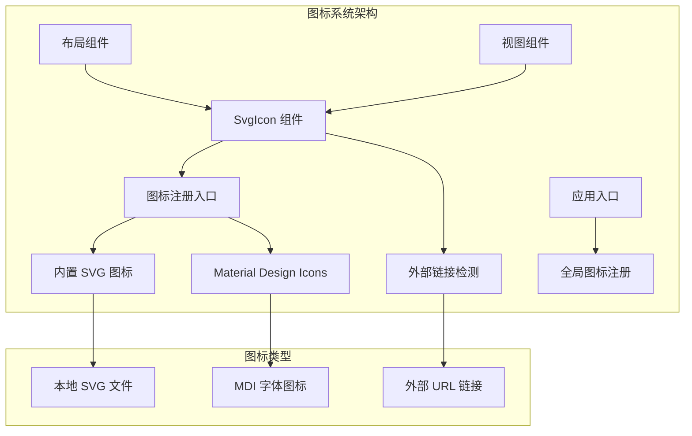
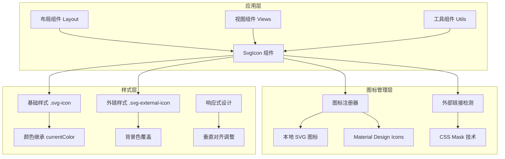
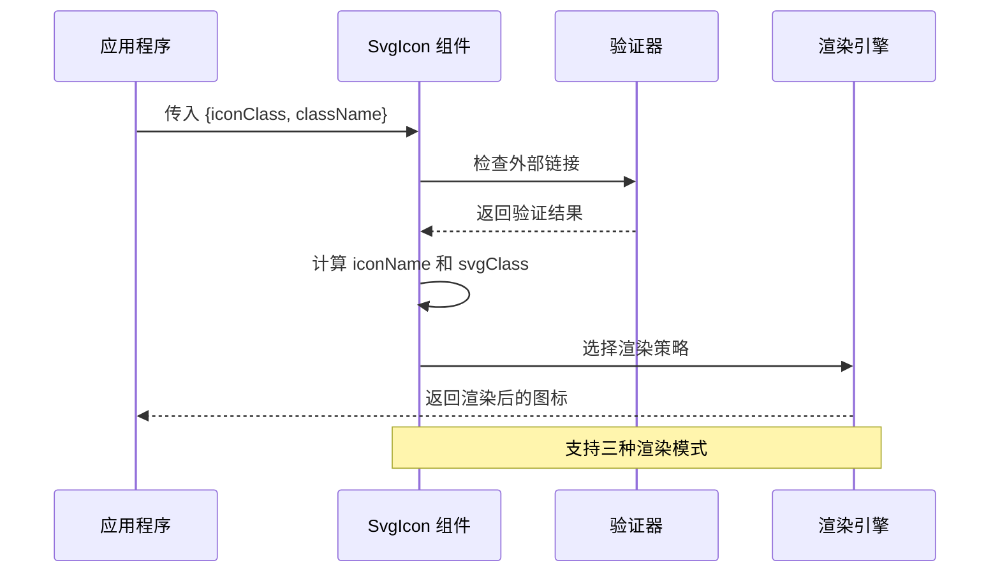
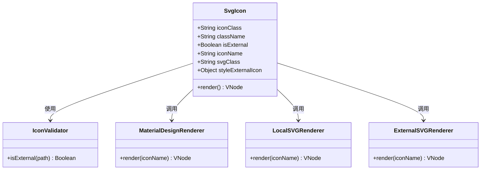
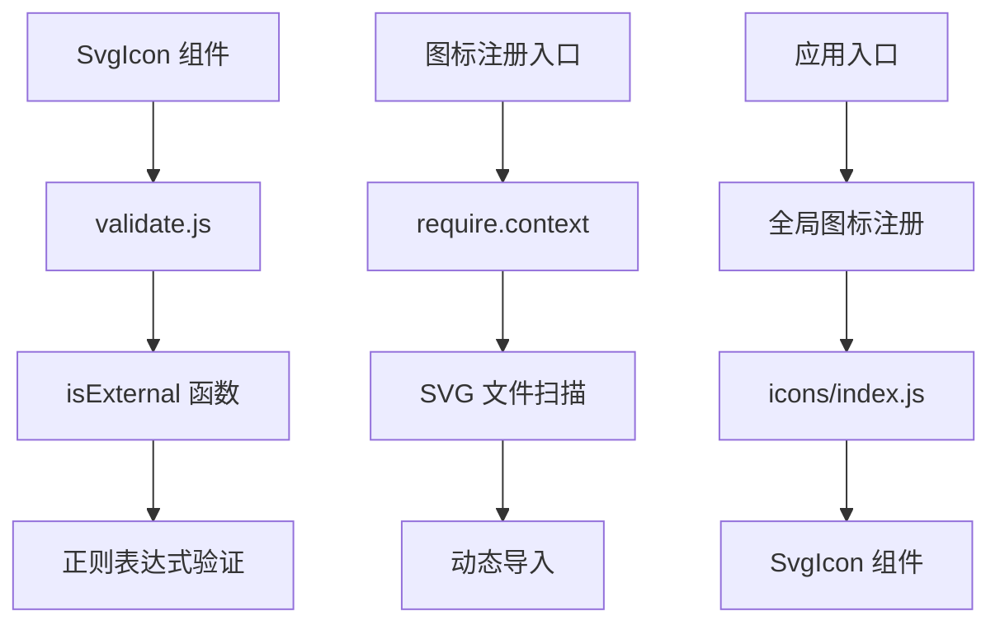

# SvgIcon 图标组件

<cite>
**本文引用的文件**
- [SvgIcon 组件](file://SpeedRunners.UI/src/components/SvgIcon/index.vue)
- [图标注册入口](file://SpeedRunners.UI/src/icons/index.js)
- [外部链接检测工具](file://SpeedRunners.UI/src/utils/validate.js)
- [应用入口](file://SpeedRunners.UI/src/main.js)
- [布局组件](file://SpeedRunners.UI/src/layout/index.vue)
- [匹配页视图](file://SpeedRunners.UI/src/views/match/index.vue)
- [包管理配置](file://SpeedRunners.UI/package.json)
</cite>

## 目录
1. [简介](#简介)
2. [项目结构](#项目结构)
3. [核心组件](#核心组件)
4. [架构概览](#架构概览)
5. [详细组件分析](#详细组件分析)
6. [依赖关系分析](#依赖关系分析)
7. [性能考虑](#性能考虑)
8. [故障排除指南](#故障排除指南)
9. [结论](#结论)

## 简介

SvgIcon 是一个功能强大的 Vue 图标组件，专为 SpeedRunnersLab 项目设计。该组件支持多种图标源，包括内置 SVG 图标、外部 SVG 图标和 Material Design Icons，提供了统一的图标渲染接口。

该组件的核心设计理念是通过智能路由机制自动识别不同类型的图标源，并采用最优的渲染策略来确保图标的一致性和性能表现。组件支持响应式设计，能够根据不同的使用场景自动调整图标尺寸和样式。

## 项目结构

SpeedRunnersLab 项目的图标系统采用模块化设计，主要包含以下关键文件：



**图表来源**
- [SvgIcon 组件](file://SpeedRunners.UI/src/components/SvgIcon/index.vue#L1-L66)
- [图标注册入口](file://SpeedRunners.UI/src/icons/index.js#L1-L9)
- [应用入口](file://SpeedRunners.UI/src/main.js#L1-L30)

**章节来源**
- [SvgIcon 组件](file://SpeedRunners.UI/src/components/SvgIcon/index.vue#L1-L66)
- [图标注册入口](file://SpeedRunners.UI/src/icons/index.js#L1-L9)
- [应用入口](file://SpeedRunners.UI/src/main.js#L1-L30)

## 核心组件

### 组件属性配置

SvgIcon 组件提供两个核心属性来控制图标的行为和外观：

| 属性名 | 类型 | 必需 | 默认值 | 描述 |
|--------|------|------|--------|------|
| iconClass | String | 是 | - | 图标的唯一标识符，支持多种格式 |
| className | String | 否 | "" | 自定义 CSS 类名，用于样式扩展 |

### 渲染策略

组件采用智能渲染策略，根据 iconClass 的前缀自动选择合适的渲染方式：

```mermaid
flowchart TD
A[接收 iconClass 参数] --> B{检查前缀}
B --> |以 "mdi" 开头| C[使用 Vuetify v-icon 组件]
B --> |其他情况| D[使用 SVG <use> 元素]
C --> E[Material Design Icons 渲染]
D --> F{检查是否为外部链接}
F --> |是| G[使用 CSS mask 技术]
F --> |否| H[使用本地 SVG 符号]
G --> I[外部 SVG 图标渲染]
H --> J[内置 SVG 图标渲染]
```

**图表来源**
- [SvgIcon 组件](file://SpeedRunners.UI/src/components/SvgIcon/index.vue#L25-L48)

**章节来源**
- [SvgIcon 组件](file://SpeedRunners.UI/src/components/SvgIcon/index.vue#L15-L48)

## 架构概览

### 整体架构设计



**图表来源**
- [SvgIcon 组件](file://SpeedRunners.UI/src/components/SvgIcon/index.vue#L52-L66)
- [图标注册入口](file://SpeedRunners.UI/src/icons/index.js#L1-L9)

### 数据流分析



**图表来源**
- [SvgIcon 组件](file://SpeedRunners.UI/src/components/SvgIcon/index.vue#L25-L48)
- [外部链接检测工具](file://SpeedRunners.UI/src/utils/validate.js#L9-L11)

**章节来源**
- [SvgIcon 组件](file://SpeedRunners.UI/src/components/SvgIcon/index.vue#L1-L66)
- [外部链接检测工具](file://SpeedRunners.UI/src/utils/validate.js#L1-L20)

## 详细组件分析

### 组件实现原理

#### 智能路由机制

SvgIcon 组件的核心优势在于其智能路由机制，能够自动识别不同类型的图标源：



**图表来源**
- [SvgIcon 组件](file://SpeedRunners.UI/src/components/SvgIcon/index.vue#L13-L49)
- [外部链接检测工具](file://SpeedRunners.UI/src/utils/validate.js#L9-L11)

#### 外部图标支持机制

对于外部 SVG 图标，组件采用 CSS mask 技术实现高质量渲染：

| 特性 | 实现方式 | 优点 |
|------|----------|------|
| CSS Mask 技术 | `mask: url(${this.iconClass}) no-repeat 50% 50%` | 支持任意颜色主题 |
| 透明度处理 | `background-color: currentColor` | 自动继承父元素颜色 |
| 响应式适配 | `mask-size: cover!important` | 适应不同容器尺寸 |
| 性能优化 | 单一 DOM 元素渲染 | 减少 DOM 节点数量 |

**章节来源**
- [SvgIcon 组件](file://SpeedRunners.UI/src/components/SvgIcon/index.vue#L42-L47)

### Material Design Icons 兼容性

#### 集成方式

组件与 Material Design Icons 的集成通过 Vuetify 框架实现：

```mermaid
graph LR
A[应用入口 main.js] --> B[@mdi/font/css/materialdesignicons.css]
B --> C[Vuetify 框架]
C --> D[SvgIcon 组件]
D --> E[mdi-* 前缀检测]
E --> F[v-icon 组件渲染]
subgraph "图标库"
G[Material Design Icons]
H[MDI Font]
I[CSS 类映射]
end
B --> G
G --> H
H --> I
```

**图表来源**
- [应用入口](file://SpeedRunners.UI/src/main.js#L2-L2)
- [SvgIcon 组件](file://SpeedRunners.UI/src/components/SvgIcon/index.vue#L3-L3)

**章节来源**
- [应用入口](file://SpeedRunners.UI/src/main.js#L1-L30)
- [SvgIcon 组件](file://SpeedRunners.UI/src/components/SvgIcon/index.vue#L3-L3)

### 内置 SVG 图标系统

#### 自动注册机制

图标注册入口文件实现了自动化的图标发现和注册：

```mermaid
flowchart TD
A[图标注册入口] --> B[require.context('./svg', false, /\.svg$/)]
B --> C[获取所有 SVG 文件路径]
C --> D[遍历文件列表]
D --> E[动态导入每个 SVG]
E --> F[自动注册为组件]
subgraph "构建时处理"
G[webpack 配置]
H[svg-sprite-loader]
I[生成符号表]
end
B --> G
G --> H
H --> I
```

**图表来源**
- [图标注册入口](file://SpeedRunners.UI/src/icons/index.js#L7-L9)

**章节来源**
- [图标注册入口](file://SpeedRunners.UI/src/icons/index.js#L1-L9)

## 依赖关系分析

### 外部依赖

组件的外部依赖关系相对简洁，主要依赖于：

| 依赖项 | 版本 | 用途 | 重要性 |
|--------|------|------|--------|
| vue | 2.6.10 | 核心框架 | 必需 |
| vuetify | ~2.3.11 | Material Design 组件库 | 中等 |
| @mdi/font | ^7.4.47 | Material Design Icons 字体 | 中等 |
| svg-sprite-loader | 4.1.3 | SVG 图标精灵生成 | 高 |

### 内部依赖关系



**图表来源**
- [SvgIcon 组件](file://SpeedRunners.UI/src/components/SvgIcon/index.vue#L11-L11)
- [图标注册入口](file://SpeedRunners.UI/src/icons/index.js#L7-L9)
- [应用入口](file://SpeedRunners.UI/src/main.js#L12-L12)

**章节来源**
- [SvgIcon 组件](file://SpeedRunners.UI/src/components/SvgIcon/index.vue#L1-L66)
- [图标注册入口](file://SpeedRunners.UI/src/icons/index.js#L1-L9)
- [应用入口](file://SpeedRunners.UI/src/main.js#L1-L30)
- [包管理配置](file://SpeedRunners.UI/package.json#L15-L65)

## 性能考虑

### 渲染性能优化

组件在设计时充分考虑了性能因素：

1. **条件渲染优化**：通过 `v-if` 和 `v-else` 实现分支渲染，避免不必要的 DOM 操作
2. **计算属性缓存**：使用 `computed` 属性缓存计算结果，减少重复计算
3. **CSS 优先级**：优先使用 CSS 技术而非 JavaScript 动态样式修改

### 内存使用优化

- **单实例复用**：同一图标在页面中可多次复用，无需重复加载
- **懒加载机制**：外部图标仅在需要时才进行资源加载
- **样式复用**：通过 CSS 类名复用，减少样式计算开销

## 故障排除指南

### 常见问题及解决方案

#### 图标不显示问题

**问题描述**：图标无法正常显示或显示异常

**可能原因**：
1. 图标名称拼写错误
2. SVG 文件路径不正确
3. CSS 样式冲突

**解决步骤**：
1. 检查 `iconClass` 参数是否正确
2. 验证 SVG 文件是否存在且命名规范
3. 查看浏览器开发者工具中的网络请求

#### 外部图标加载失败

**问题描述**：外部 SVG 图标无法加载

**排查方法**：
1. 确认 URL 地址有效且可访问
2. 检查跨域设置
3. 验证 CSS mask 属性是否被其他样式覆盖

#### Material Design 图标显示异常

**问题描述**：MDI 图标显示不正确

**解决方法**：
1. 确认 `@mdi/font` 包已正确安装和引入
2. 检查图标名称是否符合 MDI 规范
3. 验证 Vuetify 版本兼容性

**章节来源**
- [SvgIcon 组件](file://SpeedRunners.UI/src/components/SvgIcon/index.vue#L25-L48)
- [外部链接检测工具](file://SpeedRunners.UI/src/utils/validate.js#L9-L11)

## 结论

SvgIcon 图标组件通过其智能化的设计和灵活的渲染机制，成功地解决了现代 Web 应用中图标管理的复杂性问题。组件的主要优势包括：

1. **多源支持**：统一支持本地 SVG、外部 SVG 和 Material Design Icons
2. **智能路由**：自动识别图标类型并选择最优渲染策略
3. **性能优化**：通过计算属性缓存和条件渲染提升性能
4. **样式灵活性**：支持自定义样式类名和响应式设计
5. **开发友好**：简洁的 API 设计和完善的错误处理机制

该组件为 SpeedRunnersLab 项目提供了可靠的图标解决方案，不仅满足了当前的功能需求，也为未来的扩展和维护奠定了良好的基础。通过合理的架构设计和性能优化，组件能够在保证功能完整性的同时，提供优秀的用户体验。