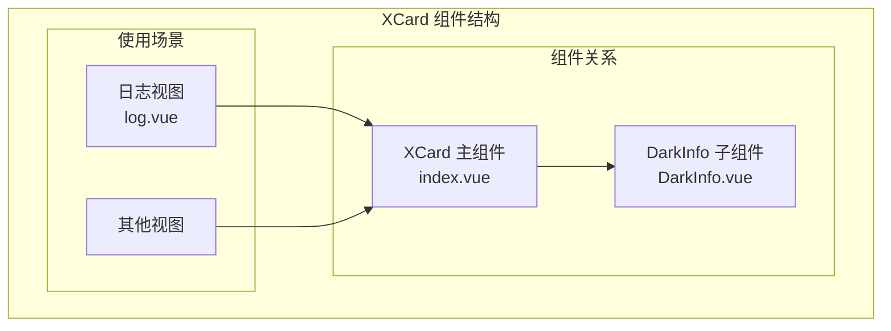
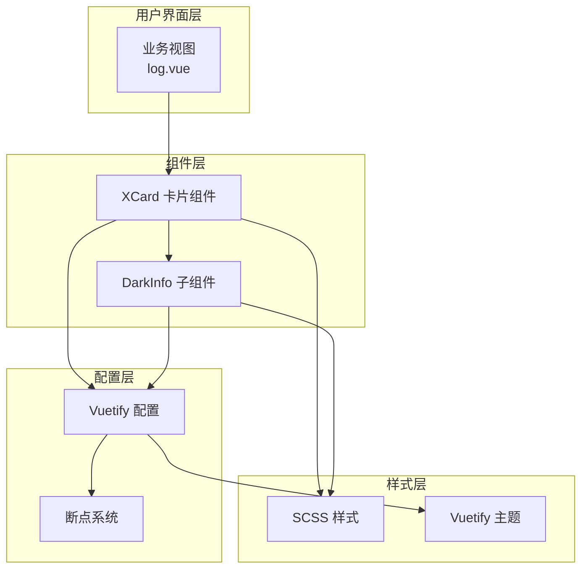
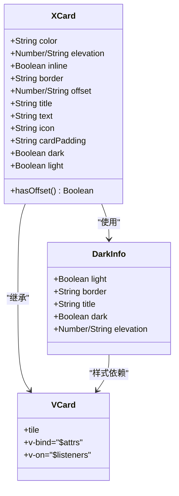
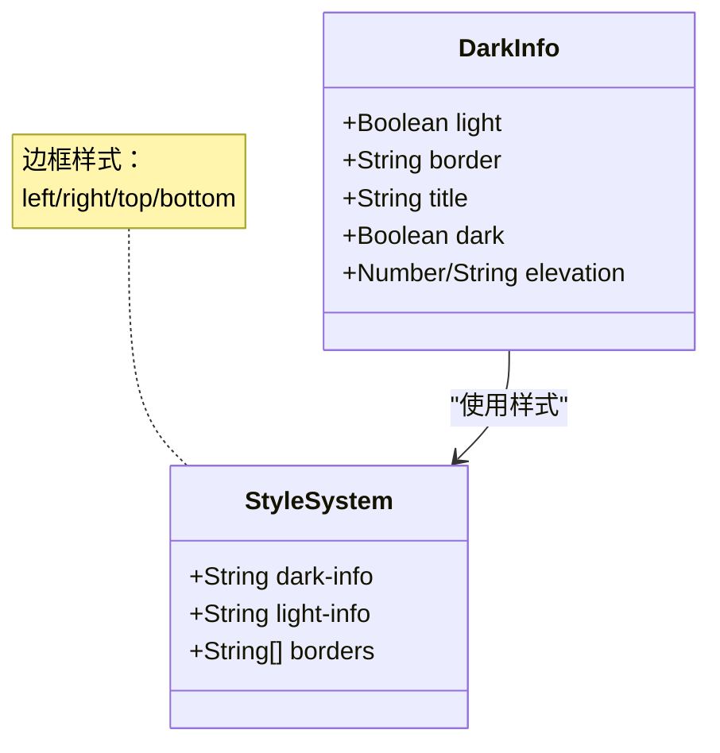
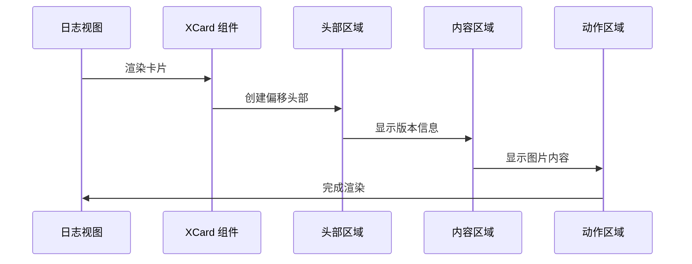
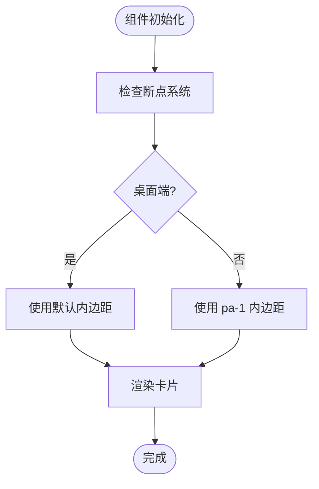
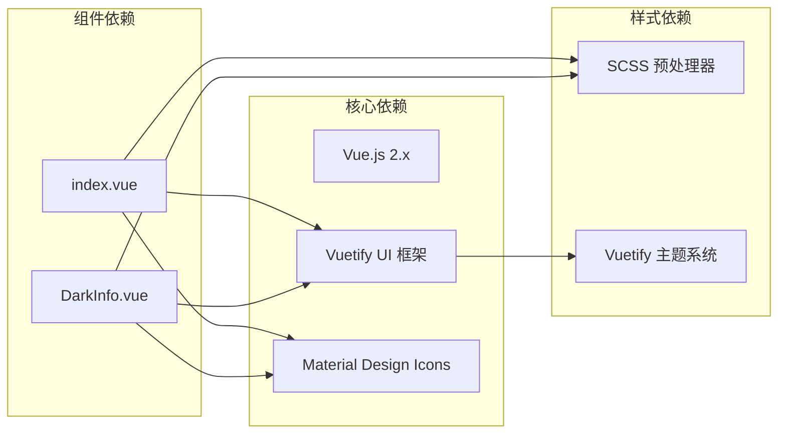
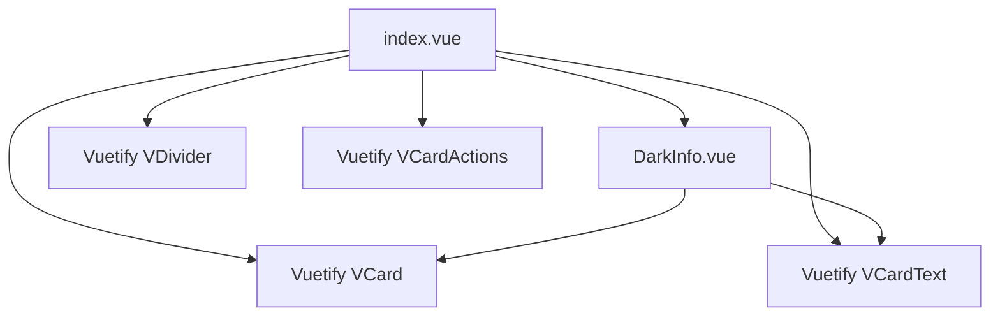

# XCard 卡片组件

<cite>
**本文档引用的文件**
- [index.vue](file://SpeedRunners.UI/src/components/XCard/index.vue)
- [DarkInfo.vue](file://SpeedRunners.UI/src/components/XCard/DarkInfo.vue)
- [log.vue](file://SpeedRunners.UI/src/views/other/log.vue)
- [vuetify.js](file://SpeedRunners.UI/src/plugins/vuetify.js)
- [main.js](file://SpeedRunners.UI/src/main.js)
- [index.scss](file://SpeedRunners.UI/src/styles/index.scss)
</cite>

## 目录
1. [简介](#简介)
2. [项目结构](#项目结构)
3. [核心组件](#核心组件)
4. [架构概览](#架构概览)
5. [详细组件分析](#详细组件分析)
6. [依赖关系分析](#依赖关系分析)
7. [性能考虑](#性能考虑)
8. [故障排除指南](#故障排除指南)
9. [结论](#结论)

## 简介

XCard 是 SpeedRunnersLab 项目中的一个自定义卡片组件，基于 Vuetify 框架构建。该组件提供了灵活的卡片布局、暗色模式支持、响应式设计和丰富的插槽系统。XCard 组件特别适用于展示版本更新日志、项目信息和其他需要突出显示的内容。

该组件的核心特色包括：
- 基础卡片结构与 DarkInfo 子组件的组合设计
- 暗色模式与亮色模式的智能切换机制
- 响应式布局适配不同屏幕尺寸
- 插槽系统支持自定义内容布局
- 支持标题、图标和边框装饰

## 项目结构

XCard 组件位于前端项目的组件库中，采用模块化组织方式：

**图表来源**
- [index.vue](file://SpeedRunners.UI/src/components/XCard/index.vue#L1-L102)
- [DarkInfo.vue](file://SpeedRunners.UI/src/components/XCard/DarkInfo.vue#L1-L76)

**章节来源**
- [index.vue](file://SpeedRunners.UI/src/components/XCard/index.vue#L1-L102)
- [DarkInfo.vue](file://SpeedRunners.UI/src/components/XCard/DarkInfo.vue#L1-L76)

## 核心组件

### XCard 主组件

XCard 是一个功能完整的卡片组件，提供了以下核心功能：

#### 基础结构
- 使用 Vuetify 的 VCard 作为基础容器
- 支持透传所有 Vuetify 属性和事件
- 提供可选的偏移头部区域

#### 关键特性
- **动态头部区域**：根据内容自动显示或隐藏
- **响应式内边距**：根据屏幕尺寸调整内边距
- **插槽系统**：支持默认插槽和动作插槽
- **主题适配**：集成 Vuetify 主题系统

**章节来源**
- [index.vue](file://SpeedRunners.UI/src/components/XCard/index.vue#L1-L102)

### DarkInfo 子组件

DarkInfo 是 XCard 的辅助组件，专门用于创建带有装饰的标题区域：

#### 设计特点
- **暗色背景**：默认深色背景，提升内容对比度
- **边框装饰**：支持四个方向的边框装饰
- **轻重模式**：支持亮色和暗色两种显示模式
- **灵活标题**：支持自定义标题文本或插槽内容

#### 样式系统
- 基于 SCSS 的样式定义
- 支持多种边框样式（左、右、上、下）
- 字体权重统一设置为 400

**章节来源**
- [DarkInfo.vue](file://SpeedRunners.UI/src/components/XCard/DarkInfo.vue#L1-L76)

## 架构概览

XCard 组件采用了分层架构设计，将复杂的功能分解为独立的组件模块：

**图表来源**
- [log.vue](file://SpeedRunners.UI/src/views/other/log.vue#L1-L180)
- [index.vue](file://SpeedRunners.UI/src/components/XCard/index.vue#L1-L102)
- [DarkInfo.vue](file://SpeedRunners.UI/src/components/XCard/DarkInfo.vue#L1-L76)
- [vuetify.js](file://SpeedRunners.UI/src/plugins/vuetify.js#L1-L33)

## 详细组件分析

### XCard 组件架构

**图表来源**
- [index.vue](file://SpeedRunners.UI/src/components/XCard/index.vue#L34-L101)
- [DarkInfo.vue](file://SpeedRunners.UI/src/components/XCard/DarkInfo.vue#L16-L40)

#### 属性配置详解

| 属性名 | 类型 | 默认值 | 描述 |
|--------|------|--------|------|
| color | String | "primary" | 卡片颜色主题 |
| elevation | Number/String | 3 | 卡片阴影层级 |
| inline | Boolean | false | 是否内联显示 |
| border | String | "bottom" | 边框装饰类型 |
| offset | Number/String | 24 | 头部偏移量 |
| title | String | undefined | 标题文本 |
| text | String | undefined | 副标题文本 |
| icon | String | undefined | 图标名称 |
| cardPadding | String/function | 响应式 | 卡片内边距 |
| dark | Boolean | false | 暗色模式开关 |
| light | Boolean | true | 亮色模式开关 |

#### 插槽系统

| 插槽名 | 用途 | 条件 | 示例 |
|--------|------|------|------|
| default | 主要内容 | 总是显示 | 卡片主体内容 |
| header | 自定义头部 | 当有标题时 | 自定义标题布局 |
| actions | 操作按钮 | 当存在动作时 | 确认、取消按钮 |
| offset | 自定义偏移 | 当提供偏移插槽时 | 自定义装饰元素 |

**章节来源**
- [index.vue](file://SpeedRunners.UI/src/components/XCard/index.vue#L40-L100)

### DarkInfo 组件设计

**图表来源**
- [DarkInfo.vue](file://SpeedRunners.UI/src/components/XCard/DarkInfo.vue#L16-L76)

#### 样式系统

DarkInfo 组件实现了完整的样式系统：

- **暗色模式样式**：深灰色背景 (`#333`)，适合深色主题
- **亮色模式样式**：浅色背景，适合浅色主题  
- **边框装饰**：支持四种方向的边框样式
- **字体规范**：统一的字体权重设置

**章节来源**
- [DarkInfo.vue](file://SpeedRunners.UI/src/components/XCard/DarkInfo.vue#L42-L76)

### 使用场景示例

#### 基础卡片使用

在日志视图中，XCard 组件被广泛用于展示版本更新信息：

**图表来源**
- [log.vue](file://SpeedRunners.UI/src/views/other/log.vue#L14-L64)

#### 响应式布局实现

XCard 组件通过 Vuetify 断点系统实现响应式设计：

**图表来源**
- [index.vue](file://SpeedRunners.UI/src/components/XCard/index.vue#L74-L82)

**章节来源**
- [log.vue](file://SpeedRunners.UI/src/views/other/log.vue#L1-L180)

## 依赖关系分析

### 外部依赖

XCard 组件依赖于多个外部库和框架：

**图表来源**
- [main.js](file://SpeedRunners.UI/src/main.js#L1-L30)
- [vuetify.js](file://SpeedRunners.UI/src/plugins/vuetify.js#L1-L33)

### 内部依赖关系

**图表来源**
- [index.vue](file://SpeedRunners.UI/src/components/XCard/index.vue#L1-L32)
- [DarkInfo.vue](file://SpeedRunners.UI/src/components/XCard/DarkInfo.vue#L1-L15)

**章节来源**
- [index.vue](file://SpeedRunners.UI/src/components/XCard/index.vue#L34-L39)
- [DarkInfo.vue](file://SpeedRunners.UI/src/components/XCard/DarkInfo.vue#L1-L15)

## 性能考虑

### 渲染优化

XCard 组件在设计时考虑了性能优化：

1. **条件渲染**：仅在需要时渲染头部区域和动作区域
2. **响应式计算**：使用计算属性避免不必要的重新渲染
3. **样式缓存**：静态样式通过编译期优化

### 内存管理

- 组件生命周期短，无持久化状态
- 事件监听器在组件销毁时自动清理
- 插槽内容按需加载

### 加载性能

- 组件体积小，无额外依赖
- 样式文件独立，可按需加载
- 图标资源通过 CDN 加载

## 故障排除指南

### 常见问题及解决方案

#### 样式不生效

**问题描述**：DarkInfo 组件样式不显示

**解决方案**：
1. 确保 Vuetify 正确初始化
2. 检查 SCSS 编译配置
3. 验证主题设置是否正确

#### 插槽内容不显示

**问题描述**：自定义插槽内容无法渲染

**解决方案**：
1. 检查插槽名称是否正确
2. 确认插槽作用域变量
3. 验证父组件传递的插槽内容

#### 响应式布局异常

**问题描述**：卡片在移动端显示异常

**解决方案**：
1. 检查 Vuetify 断点配置
2. 验证设备断点设置
3. 确认样式优先级

**章节来源**
- [vuetify.js](file://SpeedRunners.UI/src/plugins/vuetify.js#L6-L33)
- [index.vue](file://SpeedRunners.UI/src/components/XCard/index.vue#L74-L82)

## 结论

XCard 卡片组件是一个设计精良、功能完整的 UI 组件，具有以下优势：

### 技术优势
- **模块化设计**：清晰的组件分离和职责划分
- **响应式支持**：完整的断点适配系统
- **主题兼容**：深度集成 Vuetify 主题系统
- **扩展性强**：灵活的插槽系统支持自定义内容

### 实际价值
- **使用场景丰富**：适用于日志展示、信息卡片等多种场景
- **维护成本低**：简洁的代码结构便于维护和扩展
- **用户体验佳**：合理的视觉层次和交互设计

### 改进建议
1. 添加更多的动画效果支持
2. 增强无障碍访问功能
3. 扩展更多的主题变体
4. 添加单元测试覆盖

XCard 组件为 SpeedRunnersLab 项目提供了可靠的 UI 基础设施，其设计理念和实现方式值得在其他项目中借鉴和应用。