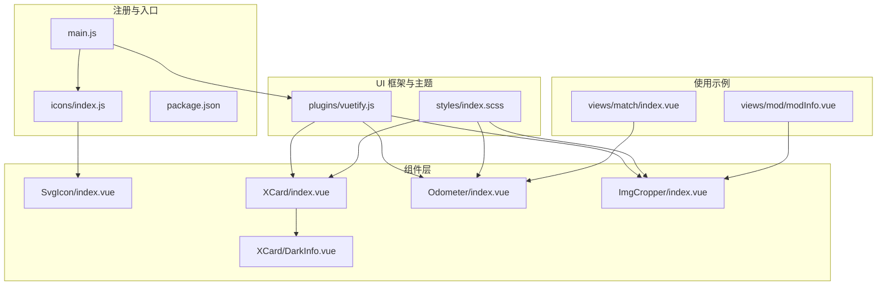
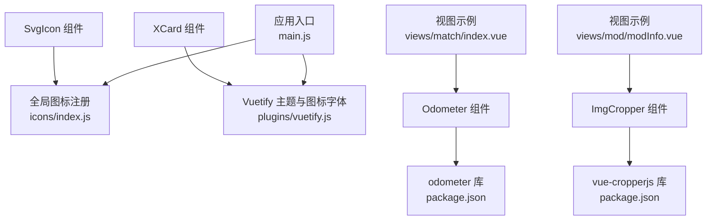
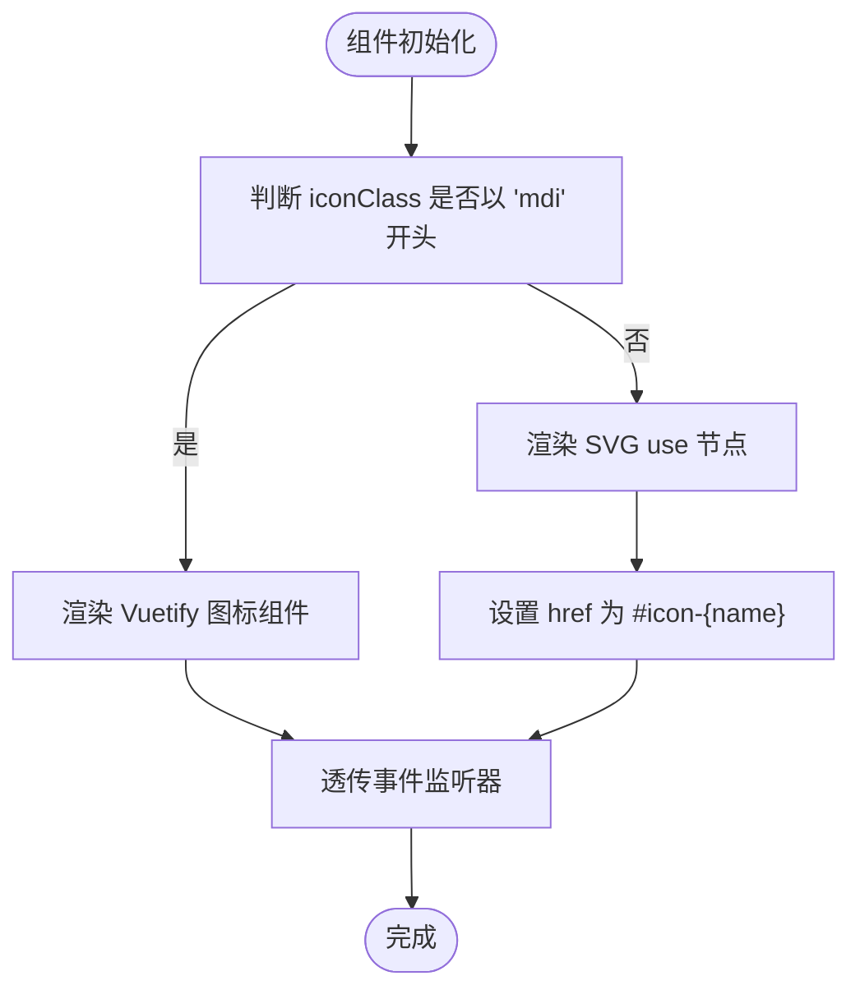
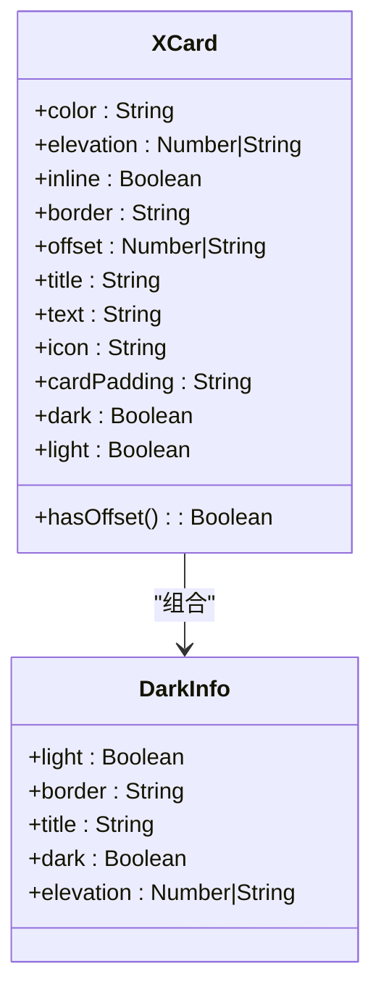
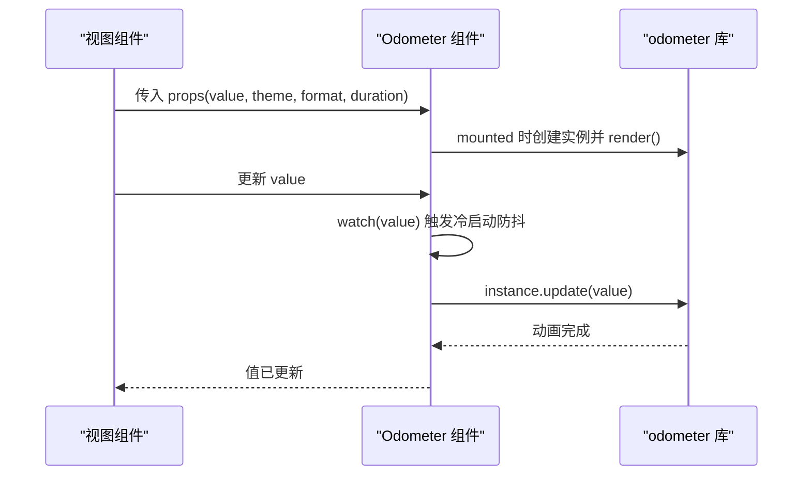
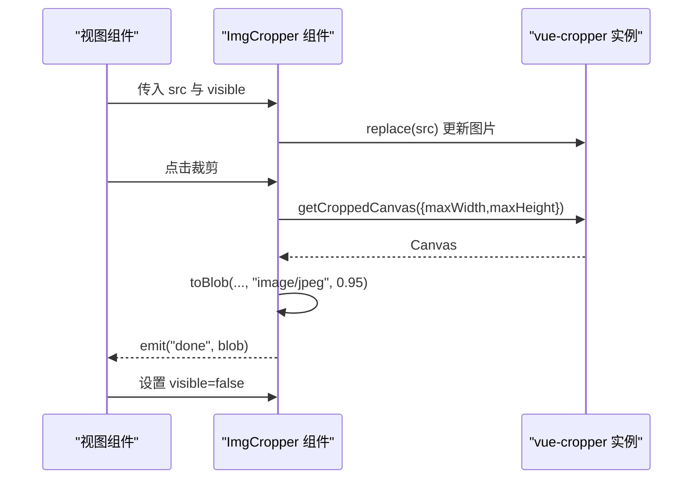
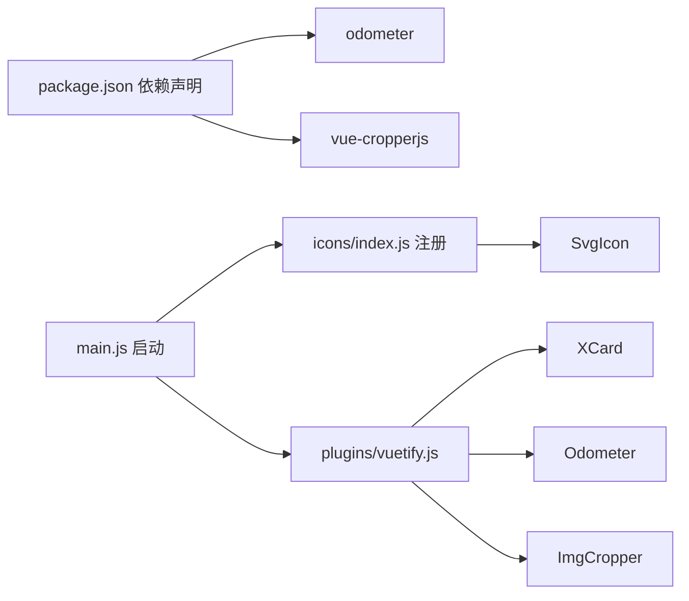

# 自定义组件

<cite>
**本文引用的文件**
- [SvgIcon/index.vue](file://SpeedRunners.UI/src/components/SvgIcon/index.vue)
- [XCard/index.vue](file://SpeedRunners.UI/src/components/XCard/index.vue)
- [XCard/DarkInfo.vue](file://SpeedRunners.UI/src/components/XCard/DarkInfo.vue)
- [Odometer/index.vue](file://SpeedRunners.UI/src/components/Odometer/index.vue)
- [ImgCropper/index.vue](file://SpeedRunners.UI/src/components/ImgCropper/index.vue)
- [icons/index.js](file://SpeedRunners.UI/src/icons/index.js)
- [main.js](file://SpeedRunners.UI/src/main.js)
- [package.json](file://SpeedRunners.UI/package.json)
- [vuetify.js](file://SpeedRunners.UI/src/plugins/vuetify.js)
- [index.scss](file://SpeedRunners.UI/src/styles/index.scss)
- [match/index.vue](file://SpeedRunners.UI/src/views/match/index.vue)
- [modInfo.vue](file://SpeedRunners.UI/src/views/mod/modInfo.vue)
</cite>

## 目录
1. [简介](#简介)
2. [项目结构](#项目结构)
3. [核心组件](#核心组件)
4. [架构总览](#架构总览)
5. [详细组件分析](#详细组件分析)
6. [依赖关系分析](#依赖关系分析)
7. [性能考量](#性能考量)
8. [故障排查指南](#故障排查指南)
9. [结论](#结论)
10. [附录](#附录)

## 简介
本文件系统性梳理 SpeedRunners.UI 中的自定义组件：SvgIcon 图标组件、XCard 卡片组件、Odometer 计数器组件与 ImgCropper 图片裁剪组件。内容覆盖设计理念、API 定义、使用方式、交互与视觉表现、主题与暗色模式适配、性能优化建议以及常见问题排查。

## 项目结构
自定义组件集中于 src/components 下，配合全局图标注册、主题与 Vuetify 配置、样式体系共同构成组件生态。下图给出与本文相关的核心文件与模块关系：

**图表来源**
- [icons/index.js](file://SpeedRunners.UI/src/icons/index.js#L1-L9)
- [main.js](file://SpeedRunners.UI/src/main.js#L1-L30)
- [vuetify.js](file://SpeedRunners.UI/src/plugins/vuetify.js#L1-L33)
- [index.scss](file://SpeedRunners.UI/src/styles/index.scss#L1-L68)
- [SvgIcon/index.vue](file://SpeedRunners.UI/src/components/SvgIcon/index.vue#L1-L66)
- [XCard/index.vue](file://SpeedRunners.UI/src/components/XCard/index.vue#L1-L102)
- [XCard/DarkInfo.vue](file://SpeedRunners.UI/src/components/XCard/DarkInfo.vue#L1-L76)
- [Odometer/index.vue](file://SpeedRunners.UI/src/components/Odometer/index.vue#L1-L72)
- [ImgCropper/index.vue](file://SpeedRunners.UI/src/components/ImgCropper/index.vue#L1-L157)
- [match/index.vue](file://SpeedRunners.UI/src/views/match/index.vue#L1-L32)
- [modInfo.vue](file://SpeedRunners.UI/src/views/mod/modInfo.vue#L139-L190)

**章节来源**
- [icons/index.js](file://SpeedRunners.UI/src/icons/index.js#L1-L9)
- [main.js](file://SpeedRunners.UI/src/main.js#L1-L30)
- [vuetify.js](file://SpeedRunners.UI/src/plugins/vuetify.js#L1-L33)
- [index.scss](file://SpeedRunners.UI/src/styles/index.scss#L1-L68)

## 核心组件
- SvgIcon：统一管理 SVG 图标与 Material Design 图标，支持内联 SVG 与外部图标，自动注入尺寸与颜色语义。
- XCard：基于 Vuetify 的卡片容器，支持标题偏移区、暗色模式、响应式内边距与操作区。
- Odometer：数字滚动计数器，封装第三方 odometer 库，支持主题、格式化、动画时长与冷启动防抖。
- ImgCropper：基于 vue-cropperjs 的图片裁剪对话框，支持旋转、翻转、最大宽高限制与 Blob 输出。

**章节来源**
- [SvgIcon/index.vue](file://SpeedRunners.UI/src/components/SvgIcon/index.vue#L1-L66)
- [XCard/index.vue](file://SpeedRunners.UI/src/components/XCard/index.vue#L1-L102)
- [XCard/DarkInfo.vue](file://SpeedRunners.UI/src/components/XCard/DarkInfo.vue#L1-L76)
- [Odometer/index.vue](file://SpeedRunners.UI/src/components/Odometer/index.vue#L1-L72)
- [ImgCropper/index.vue](file://SpeedRunners.UI/src/components/ImgCropper/index.vue#L1-L157)

## 架构总览
组件间协作与外部依赖如下：

**图表来源**
- [icons/index.js](file://SpeedRunners.UI/src/icons/index.js#L1-L9)
- [vuetify.js](file://SpeedRunners.UI/src/plugins/vuetify.js#L1-L33)
- [package.json](file://SpeedRunners.UI/package.json#L15-L32)
- [main.js](file://SpeedRunners.UI/src/main.js#L1-L30)
- [match/index.vue](file://SpeedRunners.UI/src/views/match/index.vue#L1-L32)
- [modInfo.vue](file://SpeedRunners.UI/src/views/mod/modInfo.vue#L139-L190)

## 详细组件分析

### SvgIcon 图标组件
- 设计理念
  - 统一图标入口，兼容 Material Design Icons（通过 MDI 字体）与内嵌 SVG sprite。
  - 使用当前文本色作为填充色，确保与主题一致；支持自定义类名扩展样式。
  - 外部图标通过 mask 渲染，保证在不同背景下的可读性。
- 关键能力
  - 动态加载：根据传入的 iconClass 判断是否为 MDI 前缀或 SVG 名称。
  - 尺寸控制：默认 1.8em × 1.8em，垂直对齐微调，溢出隐藏。
  - 颜色适配：fill 使用 currentColor，跟随父级文本色。
- 使用方式
  - 全局注册后可在任意模板中以 <svg-icon icon-class="..."></svg-icon> 使用。
  - 支持透传原生事件监听器到根节点。
- 最佳实践
  - 内嵌 SVG 建议通过构建工具生成 sprite 并集中引入。
  - 外部图标仅在必要时使用，优先采用内嵌 SVG 以提升性能与可维护性。

**图表来源**
- [SvgIcon/index.vue](file://SpeedRunners.UI/src/components/SvgIcon/index.vue#L1-L66)

**章节来源**
- [SvgIcon/index.vue](file://SpeedRunners.UI/src/components/SvgIcon/index.vue#L1-L66)
- [icons/index.js](file://SpeedRunners.UI/src/icons/index.js#L1-L9)
- [main.js](file://SpeedRunners.UI/src/main.js#L1-L30)

### XCard 卡片组件
- 设计理念
  - 在 VCard 基础上提供“标题偏移区”与“动作区”，增强信息层级与交互表达。
  - 支持暗色模式与亮色模式切换，结合 Vuetify 主题实现。
  - 响应式内边距：移动端紧凑、桌面端宽松，兼顾可用性与美观。
- 关键能力
  - 标题偏移区：支持插槽 header/offset 或直接传入 title/text/icon。
  - 暗色模式支持：通过 DarkInfo 子组件实现带边框的深色区域。
  - 插槽：默认插槽用于内容，actions 插槽用于操作按钮组。
  - 属性透传：将未显式声明的属性与事件透传给 VCard。
- 使用方式
  - 在页面中直接使用 <XCard> 包裹内容，按需提供 actions 插槽与标题偏移区。
  - 可通过 color/elevation/border 等属性调整外观。
- 最佳实践
  - 将标题与副标题放入偏移区，正文放入默认插槽，保持信息层次清晰。
  - 在暗色模式页面中优先使用浅色文字与对比度充足的色彩。

**图表来源**
- [XCard/index.vue](file://SpeedRunners.UI/src/components/XCard/index.vue#L1-L102)
- [XCard/DarkInfo.vue](file://SpeedRunners.UI/src/components/XCard/DarkInfo.vue#L1-L76)

**章节来源**
- [XCard/index.vue](file://SpeedRunners.UI/src/components/XCard/index.vue#L1-L102)
- [XCard/DarkInfo.vue](file://SpeedRunners.UI/src/components/XCard/DarkInfo.vue#L1-L76)
- [vuetify.js](file://SpeedRunners.UI/src/plugins/vuetify.js#L1-L33)
- [index.scss](file://SpeedRunners.UI/src/styles/index.scss#L1-L68)

### Odometer 计数器组件
- 工作原理
  - 基于 odometer 第三方库，挂载到组件根元素，初始值与主题、格式、动画时长在 mounted 时配置。
  - 通过 watch 监听 value 变化，使用冷启动防抖避免频繁更新导致的闪烁或卡顿。
  - 支持自定义格式函数与主题样式，渲染时自动应用对应主题 CSS。
- 关键参数
  - value：当前数值，支持实时更新。
  - color/theme/format/duration/animation：控制外观与动画。
  - className：根元素类名，默认为 odometer。
  - formatFunction：自定义格式化回调。
- 使用示例
  - 在视图中直接使用 <Odometer :value="prizePool" color="#e4c269" :duration="1500" /> 实现金额滚动展示。

**图表来源**
- [Odometer/index.vue](file://SpeedRunners.UI/src/components/Odometer/index.vue#L1-L72)
- [match/index.vue](file://SpeedRunners.UI/src/views/match/index.vue#L1-L32)

**章节来源**
- [Odometer/index.vue](file://SpeedRunners.UI/src/components/Odometer/index.vue#L1-L72)
- [package.json](file://SpeedRunners.UI/package.json#L22-L22)
- [match/index.vue](file://SpeedRunners.UI/src/views/match/index.vue#L1-L32)

### ImgCropper 图片裁剪组件
- 功能特性
  - 对话框承载裁剪器，支持最大宽高限制与输出 Blob。
  - 提供旋转、水平/垂直翻转等基础编辑操作。
  - 响应式对话框尺寸，支持国际化标题与按钮文案。
- 关键参数
  - dialogMaxWidth/dialogMaxHeight：对话框最大尺寸。
  - maxWidth/maxHeight：裁剪输出最大尺寸。
  - src：待裁剪图片 URL（支持 Blob URL）。
  - visible：受控显示状态。
- 事件与输出
  - done：裁剪完成后返回 Blob，可用于上传或设置图片源。
  - update:visible：同步 visible 状态。
- 使用流程
  - 选择本地图片后生成 Blob URL，赋给 src 并打开对话框。
  - 用户点击裁剪，组件将裁剪结果以 Blob 形式发出。

**图表来源**
- [ImgCropper/index.vue](file://SpeedRunners.UI/src/components/ImgCropper/index.vue#L1-L157)
- [modInfo.vue](file://SpeedRunners.UI/src/views/mod/modInfo.vue#L139-L190)

**章节来源**
- [ImgCropper/index.vue](file://SpeedRunners.UI/src/components/ImgCropper/index.vue#L1-L157)
- [package.json](file://SpeedRunners.UI/package.json#L26-L26)
- [modInfo.vue](file://SpeedRunners.UI/src/views/mod/modInfo.vue#L139-L190)

## 依赖关系分析
- 组件依赖
  - SvgIcon 依赖全局图标注册与 MDI 字体资源。
  - XCard 依赖 Vuetify 主题与断点系统，DarkInfo 为内部子组件。
  - Odometer 依赖 odometer 库及其主题 CSS。
  - ImgCropper 依赖 vue-cropperjs 与 cropperjs 样式。
- 外部依赖版本
  - 通过 package.json 管理，确保版本一致性与可复现构建。

**图表来源**
- [package.json](file://SpeedRunners.UI/package.json#L15-L32)
- [main.js](file://SpeedRunners.UI/src/main.js#L1-L30)
- [icons/index.js](file://SpeedRunners.UI/src/icons/index.js#L1-L9)
- [vuetify.js](file://SpeedRunners.UI/src/plugins/vuetify.js#L1-L33)

**章节来源**
- [package.json](file://SpeedRunners.UI/package.json#L15-L32)
- [main.js](file://SpeedRunners.UI/src/main.js#L1-L30)

## 性能考量
- SvgIcon
  - 优先使用内嵌 SVG，减少网络请求与 DOM 结构复杂度。
  - 外部图标使用 mask 渲染，注意背景对比度与可访问性。
- XCard
  - 合理使用 elevation 与边框，避免过度阴影造成重绘压力。
  - 移动端内边距按需收缩，减少布局计算。
- Odometer
  - 使用冷启动防抖避免频繁 update 导致的动画抖动。
  - 控制 duration 与 format，避免过长动画影响首屏体验。
- ImgCropper
  - 限制 maxWidth/maxHeight 与初始图片尺寸，防止内存占用过高。
  - 裁剪完成后及时释放 Blob URL 与临时对象。

## 故障排查指南
- 图标不显示
  - 检查 iconClass 是否正确匹配 SVG sprite 名称或 MDI 前缀。
  - 确认全局图标注册已执行且资源已打包。
- 主题色异常
  - 确认 Vuetify 主题开关与组件 color/elevation 属性未冲突。
  - 检查样式文件是否正确引入。
- 计数器无动画
  - 确认 odometer 库已正确安装与导入主题 CSS。
  - 检查 value 是否变化，watch 是否触发。
- 裁剪无输出
  - 确认 src 已替换为有效图片 URL。
  - 检查 done 事件监听与 Blob 输出参数。

**章节来源**
- [SvgIcon/index.vue](file://SpeedRunners.UI/src/components/SvgIcon/index.vue#L1-L66)
- [Odometer/index.vue](file://SpeedRunners.UI/src/components/Odometer/index.vue#L1-L72)
- [ImgCropper/index.vue](file://SpeedRunners.UI/src/components/ImgCropper/index.vue#L1-L157)
- [vuetify.js](file://SpeedRunners.UI/src/plugins/vuetify.js#L1-L33)

## 结论
上述四个自定义组件围绕“统一入口、主题一致、易用可维护”的目标设计。通过全局注册、主题集成与清晰的 API，它们在 SpeedRunners.UI 中承担了图标、信息容器、数据展示与媒体处理的关键角色。遵循本文的设计规范与最佳实践，可进一步提升组件的稳定性与用户体验。

## 附录
- 组件开发设计规范
  - 统一命名与目录结构，组件文件与样式分离。
  - 明确 props 类型与默认值，提供必要的校验与注释。
  - 事件命名采用 update:xxx 与 done 等约定式命名，便于父组件监听。
  - 透传属性与事件，保持与上游 UI 框架的一致性。
- API 接口定义（概要）
  - SvgIcon
    - 属性：iconClass（必填），className（可选）
    - 插槽：无
    - 事件：透传原生事件
  - XCard
    - 属性：color、elevation、inline、border、offset、title、text、icon、cardPadding、dark、light
    - 插槽：默认插槽、actions、header/offset
  - Odometer
    - 属性：value、color、theme、format、duration、className、animation、formatFunction
  - ImgCropper
    - 属性：dialogMaxWidth、dialogMaxHeight、maxWidth、maxHeight、src、visible
    - 事件：done(blob)、update:visible(flag)
- 使用示例路径
  - 数字滚动计数器：[views/match/index.vue](file://SpeedRunners.UI/src/views/match/index.vue#L1-L32)
  - 图片裁剪：[views/mod/modInfo.vue](file://SpeedRunners.UI/src/views/mod/modInfo.vue#L139-L190)