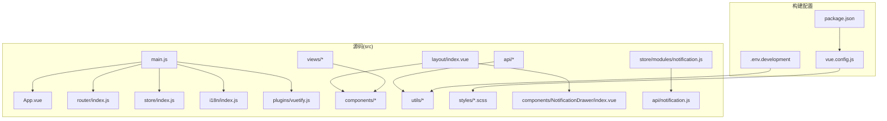
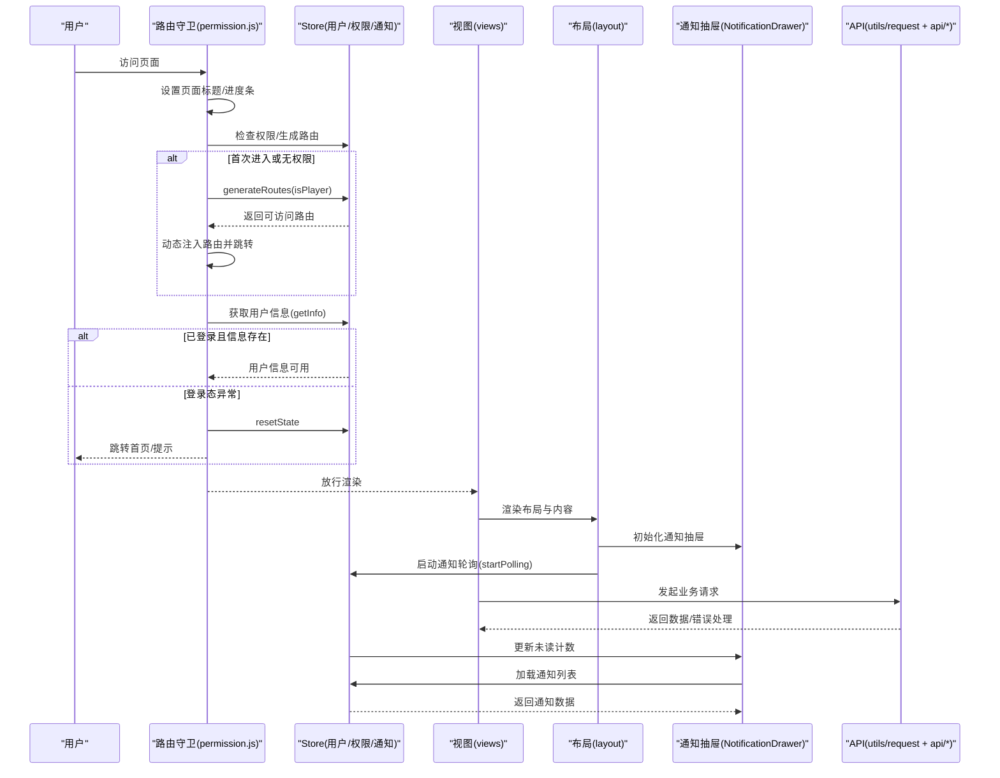
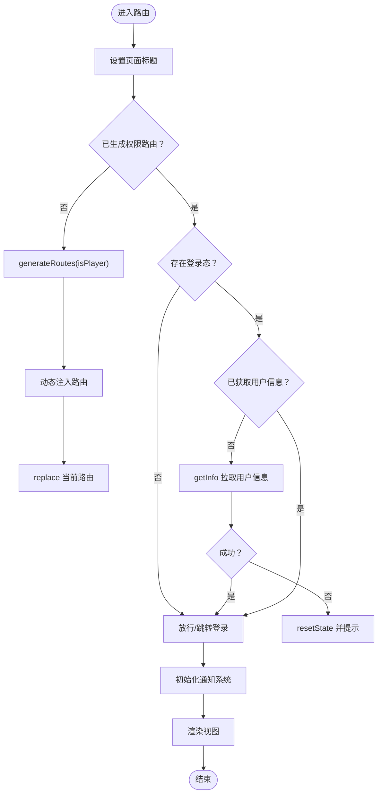
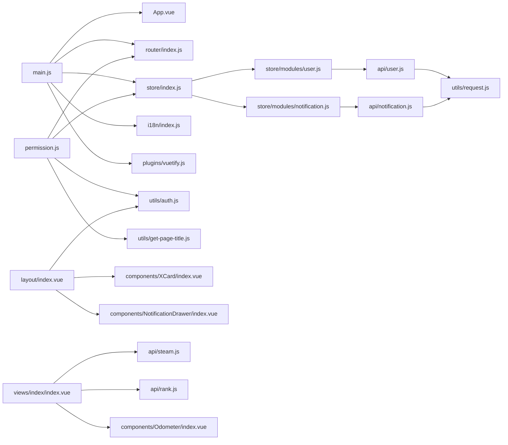
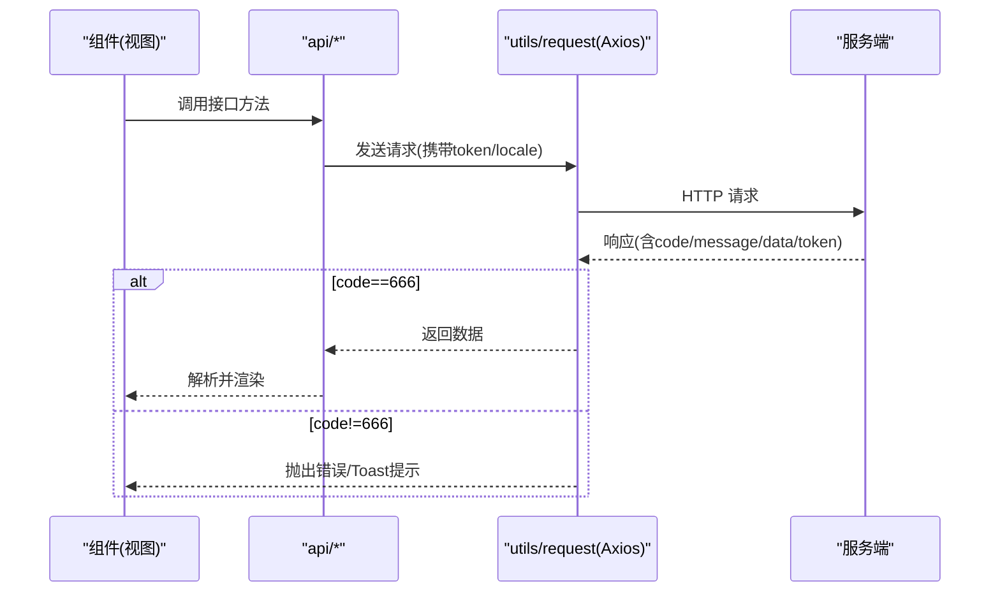
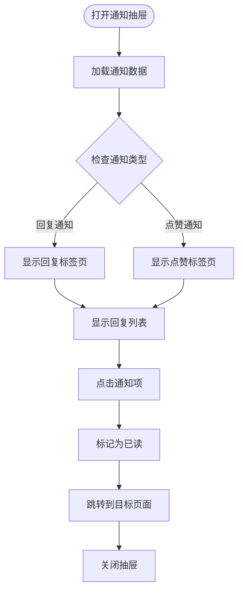

# 前端应用

<cite>
**本文引用的文件**
- [package.json](file://SpeedRunners.UI/package.json)
- [main.js](file://SpeedRunners.UI/src/main.js)
- [vue.config.js](file://SpeedRunners.UI/vue.config.js)
- [router/index.js](file://SpeedRunners.UI/src/router/index.js)
- [store/index.js](file://SpeedRunners.UI/src/store/index.js)
- [store/modules/user.js](file://SpeedRunners.UI/src/store/modules/user.js)
- [store/modules/notification.js](file://SpeedRunners.UI/src/store/modules/notification.js)
- [i18n/index.js](file://SpeedRunners.UI/src/i18n/index.js)
- [plugins/vuetify.js](file://SpeedRunners.UI/src/plugins/vuetify.js)
- [settings.js](file://SpeedRunners.UI/src/settings.js)
- [permission.js](file://SpeedRunners.UI/src/permission.js)
- [layout/index.vue](file://SpeedRunners.UI/src/layout/index.vue)
- [App.vue](file://SpeedRunners.UI/src/App.vue)
- [api/user.js](file://SpeedRunners.UI/src/api/user.js)
- [api/notification.js](file://SpeedRunners.UI/src/api/notification.js)
- [utils/request.js](file://SpeedRunners.UI/src/utils/request.js)
- [views/index/index.vue](file://SpeedRunners.UI/src/views/index/index.vue)
- [components/XCard/index.vue](file://SpeedRunners.UI/src/components/XCard/index.vue)
- [components/NotificationDrawer/index.vue](file://SpeedRunners.UI/src/components/NotificationDrawer/index.vue)
- [styles/index.scss](file://SpeedRunners.UI/src/styles/index.scss)
- [.env.development](file://SpeedRunners.UI/.env.development)
</cite>

## 更新摘要
**所做更改**
- 新增 NotificationDrawer 通知抽屉组件章节
- 新增 notification store 状态管理模块章节
- 更新布局组件与通知系统的集成章节
- 新增评论系统与通知深度集成章节
- 更新依赖关系分析以包含通知系统
- 更新架构总览以反映通知系统流程

## 目录
1. [简介](#简介)
2. [项目结构](#项目结构)
3. [核心组件](#核心组件)
4. [架构总览](#架构总览)
5. [组件与路由详解](#组件与路由详解)
6. [依赖关系分析](#依赖关系分析)
7. [性能与构建优化](#性能与构建优化)
8. [国际化与主题定制](#国际化与主题定制)
9. [API 集成与错误处理](#api-集成与错误处理)
10. [通知系统与评论集成](#通知系统与评论集成)
11. [部署与环境管理](#部署与环境管理)
12. [故障排查指南](#故障排查指南)
13. [结论](#结论)

## 简介
本项目为 SpeedRunnersLab 的前端单页应用（SPA），采用 Vue.js 2.x + Vuetify 构建，配合 Vue Router 实现页面路由，Vuex 提供状态管理，并通过 Axios 封装统一的 HTTP 请求与错误处理。项目遵循组件化开发模式，目录清晰，职责明确，便于扩展与维护。现已集成完整的通知系统，支持回复通知和点赞通知的实时推送与管理。

## 项目结构
- 根目录：构建与运行脚本、环境变量、Docker 配置等
- src 目录：
  - api：接口定义与封装
  - assets：静态资源
  - components：可复用通用组件
  - i18n：国际化语言包与初始化逻辑
  - icons：SVG 图标与加载器配置
  - layout：布局组件（导航栏、侧边栏、页脚）
  - plugins：第三方插件初始化（如 Vuetify）
  - router：路由配置（常量路由、异步路由、404）
  - store：状态管理（模块化、自动注册）
  - styles：全局样式与变量
  - utils：工具函数（请求、鉴权、页面标题、尺寸监听等）
  - views：页面级视图组件
  - App.vue、main.js：应用入口与根组件
- public：公共资源与静态页面模板
- 构建产物：dist 目录（含静态资源）

**图表来源**
- [main.js](file://SpeedRunners.UI/src/main.js#L1-L30)
- [router/index.js](file://SpeedRunners.UI/src/router/index.js#L1-L133)
- [store/index.js](file://SpeedRunners.UI/src/store/index.js#L1-L25)
- [i18n/index.js](file://SpeedRunners.UI/src/i18n/index.js#L1-L35)
- [plugins/vuetify.js](file://SpeedRunners.UI/src/plugins/vuetify.js#L1-L33)
- [layout/index.vue](file://SpeedRunners.UI/src/layout/index.vue#L1-L486)
- [vue.config.js](file://SpeedRunners.UI/vue.config.js#L1-L129)
- [.env.development](file://SpeedRunners.UI/.env.development#L1-L15)
- [components/NotificationDrawer/index.vue](file://SpeedRunners.UI/src/components/NotificationDrawer/index.vue#L1-L325)
- [store/modules/notification.js](file://SpeedRunners.UI/src/store/modules/notification.js#L1-L138)
- [api/notification.js](file://SpeedRunners.UI/src/api/notification.js#L1-L13)

**章节来源**
- [package.json](file://SpeedRunners.UI/package.json#L1-L76)
- [vue.config.js](file://SpeedRunners.UI/vue.config.js#L1-L129)

## 核心组件
- 应用入口与插件初始化：在入口文件中引入全局样式、图标、权限控制、Meta SEO 插件以及 Vuetify，并挂载根实例。
- 布局组件：提供顶部导航、右侧抽屉菜单、页脚社交链接、回到顶部按钮等；支持主题切换与语言切换；集成了通知抽屉组件。
- 路由系统：常量路由用于无需权限访问的基础页面；异步路由按权限动态注入；统一 404 处理。
- 状态管理：模块化自动注册，包含用户信息、权限路由、设置、通知等模块；提供用户信息拉取与登出重置，以及通知状态管理。
- 国际化：基于 vue-i18n，自动识别浏览器语言并持久化；提供中英双语包。
- UI 框架：Vuetify 主题、图标字体、语言本地化与 Toast 提示。
- 工具与 API：Axios 封装统一请求头、超时、响应拦截与错误提示；各业务模块通过 api/* 文件暴露方法。

**章节来源**
- [main.js](file://SpeedRunners.UI/src/main.js#L1-L30)
- [layout/index.vue](file://SpeedRunners.UI/src/layout/index.vue#L1-L486)
- [router/index.js](file://SpeedRunners.UI/src/router/index.js#L1-L133)
- [store/index.js](file://SpeedRunners.UI/src/store/index.js#L1-L25)
- [store/modules/user.js](file://SpeedRunners.UI/src/store/modules/user.js#L1-L88)
- [store/modules/notification.js](file://SpeedRunners.UI/src/store/modules/notification.js#L1-L138)
- [i18n/index.js](file://SpeedRunners.UI/src/i18n/index.js#L1-L35)
- [plugins/vuetify.js](file://SpeedRunners.UI/src/plugins/vuetify.js#L1-L33)
- [utils/request.js](file://SpeedRunners.UI/src/utils/request.js#L1-L82)
- [api/user.js](file://SpeedRunners.UI/src/api/user.js#L1-L77)
- [api/notification.js](file://SpeedRunners.UI/src/api/notification.js#L1-L13)

## 架构总览
应用采用"入口初始化 → 路由守卫 → 布局渲染 → 页面视图"的主流程；状态管理与 API 层相互解耦，通过 Vuex 模块与 API 方法协作完成用户态与数据态管理。新增的通知系统通过轮询机制实现实时通知更新，与评论系统深度集成。

**图表来源**
- [permission.js](file://SpeedRunners.UI/src/permission.js#L1-L69)
- [store/modules/user.js](file://SpeedRunners.UI/src/store/modules/user.js#L1-L88)
- [store/modules/notification.js](file://SpeedRunners.UI/src/store/modules/notification.js#L1-L138)
- [utils/request.js](file://SpeedRunners.UI/src/utils/request.js#L1-L82)
- [api/user.js](file://SpeedRunners.UI/src/api/user.js#L1-L77)
- [layout/index.vue](file://SpeedRunners.UI/src/layout/index.vue#L1-L486)
- [views/index/index.vue](file://SpeedRunners.UI/src/views/index/index.vue#L1-L84)
- [components/NotificationDrawer/index.vue](file://SpeedRunners.UI/src/components/NotificationDrawer/index.vue#L1-L325)

## 组件与路由详解
- 路由组织
  - 常量路由：首页、赛事、排行、MOD、搜索玩家、登录、日志等基础页面
  - 异步路由：根据权限动态注入的区域（如广场）
  - 404 路由：兜底路由置于末尾
  - 路由元信息：标题、图标、面包屑、激活菜单等
- 权限控制
  - 路由守卫在进入前设置页面标题、启动进度条
  - 判断是否已生成权限路由；若未生成，则依据登录态与地域判定生成并注入
  - 登录后尝试拉取用户信息，异常则重置状态并提示
- 视图与布局
  - 布局组件负责顶部标签页、右侧抽屉、主题切换、语言切换、社交链接与回到顶部
  - 视图组件按功能拆分，首页聚合展示在线人数、玩家列表、图表与赞助信息
  - 新增通知抽屉组件，提供回复通知和点赞通知的分类查看

**图表来源**
- [permission.js](file://SpeedRunners.UI/src/permission.js#L1-L69)
- [router/index.js](file://SpeedRunners.UI/src/router/index.js#L1-L133)
- [layout/index.vue](file://SpeedRunners.UI/src/layout/index.vue#L398-L407)

**章节来源**
- [router/index.js](file://SpeedRunners.UI/src/router/index.js#L1-L133)
- [permission.js](file://SpeedRunners.UI/src/permission.js#L1-L69)
- [layout/index.vue](file://SpeedRunners.UI/src/layout/index.vue#L1-L486)
- [views/index/index.vue](file://SpeedRunners.UI/src/views/index/index.vue#L1-L84)

## 依赖关系分析
- 入口依赖：main.js 依赖 App、router、store、i18n、vuetify、permission、icons 等
- 路由依赖：permission.js 依赖 router、store、i18n、utils/auth、getPageTitle
- 状态依赖：store/index.js 自动注册 modules 下所有模块；user 模块依赖 api/user 与 router；notification 模块依赖 api/notification
- UI 依赖：layout 依赖 components、i18n、store、utils/auth；各视图依赖对应 API 与组件；NotificationDrawer 依赖 notification store
- 工具依赖：utils/request 依赖 axios、store、i18n、utils/auth；各视图通过 api/* 调用

**图表来源**
- [main.js](file://SpeedRunners.UI/src/main.js#L1-L30)
- [router/index.js](file://SpeedRunners.UI/src/router/index.js#L1-L133)
- [store/index.js](file://SpeedRunners.UI/src/store/index.js#L1-L25)
- [store/modules/user.js](file://SpeedRunners.UI/src/store/modules/user.js#L1-L88)
- [store/modules/notification.js](file://SpeedRunners.UI/src/store/modules/notification.js#L1-L138)
- [i18n/index.js](file://SpeedRunners.UI/src/i18n/index.js#L1-L35)
- [plugins/vuetify.js](file://SpeedRunners.UI/src/plugins/vuetify.js#L1-L33)
- [permission.js](file://SpeedRunners.UI/src/permission.js#L1-L69)
- [layout/index.vue](file://SpeedRunners.UI/src/layout/index.vue#L1-L486)
- [views/index/index.vue](file://SpeedRunners.UI/src/views/index/index.vue#L1-L84)
- [api/user.js](file://SpeedRunners.UI/src/api/user.js#L1-L77)
- [api/notification.js](file://SpeedRunners.UI/src/api/notification.js#L1-L13)
- [utils/request.js](file://SpeedRunners.UI/src/utils/request.js#L1-L82)

**章节来源**
- [main.js](file://SpeedRunners.UI/src/main.js#L1-L30)
- [store/index.js](file://SpeedRunners.UI/src/store/index.js#L1-L25)
- [utils/request.js](file://SpeedRunners.UI/src/utils/request.js#L1-L82)

## 性能与构建优化
- 构建配置要点
  - publicPath 默认为 "/"，输出目录 dist，静态资源目录 static
  - 开发端口可通过环境变量或命令行参数配置
  - 关闭生产 SourceMap，提升构建速度与安全性
  - Webpack 优化：删除 preload/prefetch 插件；SVG 使用 svg-sprite-loader；保留空白字符以提升可读性
  - 代码分割：第三方库与公共组件分别打包；运行时 chunk 单独提取
  - 转译依赖：对 vuetify 进行转译以兼容构建
- 运行时优化
  - NProgress 进度条减少感知延迟
  - 版本检测与缓存更新（通过 utils/version）避免缓存导致的体验问题
  - 通知轮询优化：采用 30 秒间隔轮询，避免频繁请求造成性能问题

**章节来源**
- [vue.config.js](file://SpeedRunners.UI/vue.config.js#L1-L129)
- [main.js](file://SpeedRunners.UI/src/main.js#L1-L30)
- [store/modules/notification.js](file://SpeedRunners.UI/src/store/modules/notification.js#L112-L125)

## 国际化与主题定制
- 国际化
  - 自动识别浏览器语言并持久化到 localStorage，默认中文；可在布局中切换至英文
  - 语言包位于 i18n/lang，通过 VueI18n 初始化并注入
  - 路由标题与布局文案均使用 $t 进行翻译
  - 通知系统文案完全支持国际化，包括时间格式化和通知类型
- 主题定制
  - Vuetify 主题：支持深色/浅色切换，切换后持久化到 localStorage
  - 图标：Material Design Icons（MDI）作为默认图标字体
  - 语言本地化：Vuetify 语言设置为简体中文

**章节来源**
- [i18n/index.js](file://SpeedRunners.UI/src/i18n/index.js#L1-L35)
- [layout/index.vue](file://SpeedRunners.UI/src/layout/index.vue#L1-L486)
- [plugins/vuetify.js](file://SpeedRunners.UI/src/plugins/vuetify.js#L1-L33)

## API 集成与错误处理
- 请求封装
  - 基于 axios 创建实例，设置基础路径、超时时间
  - 请求拦截：附加 locale 与 srlab-token 头部
  - 响应拦截：根据自定义 code 判断成功/失败；异常时弹出 Toast 并触发登出逻辑
- 错误处理
  - 服务端返回非 666 时统一提示错误消息
  - 对特定 token 相关错误码执行重置并刷新页面
  - 网络异常统一提示"服务器开小差"
- 接口定义
  - 用户相关接口：获取信息、登录、登出（本地/其他设备）、隐私设置、状态与排行类型设置等
  - 通知相关接口：获取通知列表、获取未读数量、标记已读等
  - 各视图通过 api/* 调用具体接口，实现数据驱动

**图表来源**
- [utils/request.js](file://SpeedRunners.UI/src/utils/request.js#L1-L82)
- [api/user.js](file://SpeedRunners.UI/src/api/user.js#L1-L77)
- [api/notification.js](file://SpeedRunners.UI/src/api/notification.js#L1-L13)

**章节来源**
- [utils/request.js](file://SpeedRunners.UI/src/utils/request.js#L1-L82)
- [api/user.js](file://SpeedRunners.UI/src/api/user.js#L1-L77)
- [api/notification.js](file://SpeedRunners.UI/src/api/notification.js#L1-L13)

## 通知系统与评论集成

### NotificationDrawer 通知抽屉组件
新增的 NotificationDrawer 是一个功能完整的通知管理系统，提供以下核心功能：

- **双标签页设计**：支持回复通知（type=1）和点赞通知（type=2）的分类查看
- **实时轮询**：每 30 秒自动检查未读通知，确保通知状态的实时性
- **未读标记**：支持单条消息标记已读和批量标记已读功能
- **智能跳转**：点击通知可直接跳转到对应的评论或内容页面
- **主题适配**：根据当前主题自动调整未读消息的高亮样式

**图表来源**
- [components/NotificationDrawer/index.vue](file://SpeedRunners.UI/src/components/NotificationDrawer/index.vue#L222-L245)

### notification store 状态管理模块
notification 模块提供了完整的通知状态管理，包括：

- **状态管理**：维护未读计数、通知列表、总记录数和轮询定时器
- **动作处理**：获取未读数量、获取通知列表、标记已读、启动/停止轮询
- **数据同步**：本地状态与服务器状态保持同步
- **性能优化**：支持分页加载和增量更新

### 布局组件集成
布局组件集成了通知系统的完整功能：

- **通知按钮**：顶部导航栏显示未读通知徽章
- **下拉菜单**：提供快速查看不同类型通知的入口
- **轮询管理**：登录状态下自动启动轮询，离开时自动停止
- **状态同步**：实时更新未读计数和通知状态

### 评论系统深度集成
通知系统与评论系统的集成体现在：

- **回复通知**：当用户收到评论回复时，系统会发送回复通知
- **点赞通知**：当用户的评论获得点赞时，系统会发送点赞通知
- **内容关联**：通知包含完整的内容信息，支持直接跳转到具体内容
- **时间格式化**：支持多种时间格式显示，如"刚刚"、"X分钟前"等

**章节来源**
- [components/NotificationDrawer/index.vue](file://SpeedRunners.UI/src/components/NotificationDrawer/index.vue#L1-L325)
- [store/modules/notification.js](file://SpeedRunners.UI/src/store/modules/notification.js#L1-L138)
- [layout/index.vue](file://SpeedRunners.UI/src/layout/index.vue#L1-L486)
- [api/notification.js](file://SpeedRunners.UI/src/api/notification.js#L1-L13)

## 部署与环境管理
- 环境变量
  - .env.development：开发环境基础 API 地址、热更新优化开关等
  - 可新增 .env.production/.env.staging 以区分不同环境
- 构建与预览
  - 使用 Vue CLI 脚本进行开发、构建与预览
  - 生产构建关闭 SourceMap，启用代码分割与运行时抽取
- 静态资源
  - 输出目录 dist，静态资源位于 static；favicon、验证文件等放置于 public
- Docker/Nginx
  - 提供 Dockerfile 与 Nginx 配置示例，便于容器化部署

**章节来源**
- [.env.development](file://SpeedRunners.UI/.env.development#L1-L15)
- [vue.config.js](file://SpeedRunners.UI/vue.config.js#L1-L129)
- [package.json](file://SpeedRunners.UI/package.json#L1-L76)

## 故障排查指南
- 登录后无法显示用户信息
  - 检查路由守卫是否正确调用用户信息拉取；确认接口返回字段与提交的 commit 一致
  - 若出现 token 异常，确认响应拦截器是否触发了重置逻辑
- 主题切换无效
  - 确认 Vuetify 主题开关与 localStorage 存储逻辑；检查布局中的切换方法
- 语言切换不生效
  - 确认 i18n 初始化与布局切换逻辑；检查页面标题是否使用 $t 渲染
- 构建后静态资源 404
  - 检查 publicPath 与部署路径；确认输出目录与静态资源目录配置
- 进度条与页面标题异常
  - 检查 permission.js 中的 NProgress 与 getPageTitle 调用链
- 通知系统异常
  - 检查通知轮询是否正常启动和停止
  - 确认 API 接口调用是否正常，网络请求是否被正确拦截
  - 验证通知数据格式是否符合预期

**章节来源**
- [permission.js](file://SpeedRunners.UI/src/permission.js#L1-L69)
- [layout/index.vue](file://SpeedRunners.UI/src/layout/index.vue#L398-L407)
- [plugins/vuetify.js](file://SpeedRunners.UI/src/plugins/vuetify.js#L1-L33)
- [i18n/index.js](file://SpeedRunners.UI/src/i18n/index.js#L1-L35)
- [vue.config.js](file://SpeedRunners.UI/vue.config.js#L1-L129)
- [store/modules/notification.js](file://SpeedRunners.UI/src/store/modules/notification.js#L112-L130)

## 结论
本项目以 Vue 2.x + Vuetify 为基础，结合 Vue Router 与 Vuex，实现了清晰的路由与状态管理；通过 Axios 封装统一处理请求与错误；国际化与主题定制完善；构建配置兼顾开发体验与生产性能。新增的通知系统进一步增强了用户体验，通过 NotificationDrawer 组件和 notification store 模块，实现了完整的通知管理功能。评论系统与通知系统的深度集成，为用户提供了及时的消息提醒和便捷的内容导航。整体结构层次分明、职责清晰，适合团队协作与长期维护。