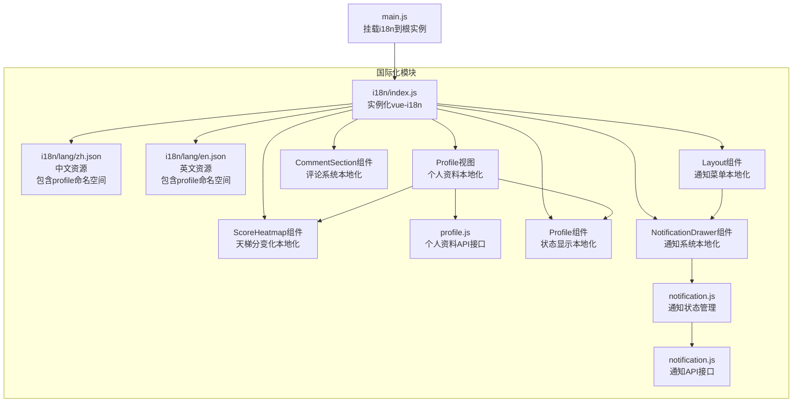
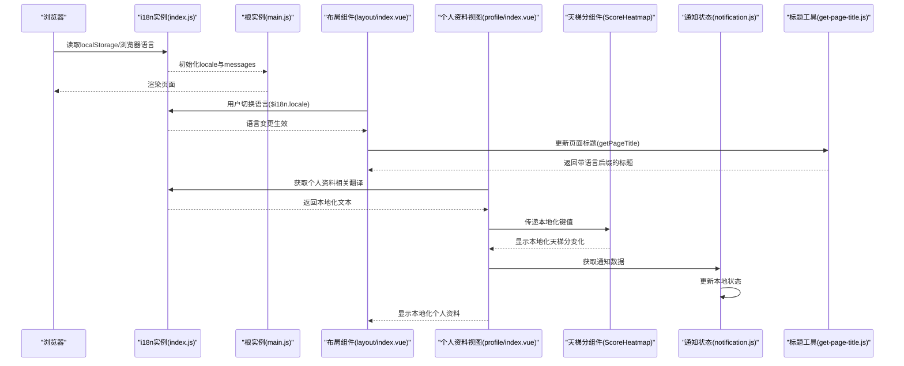
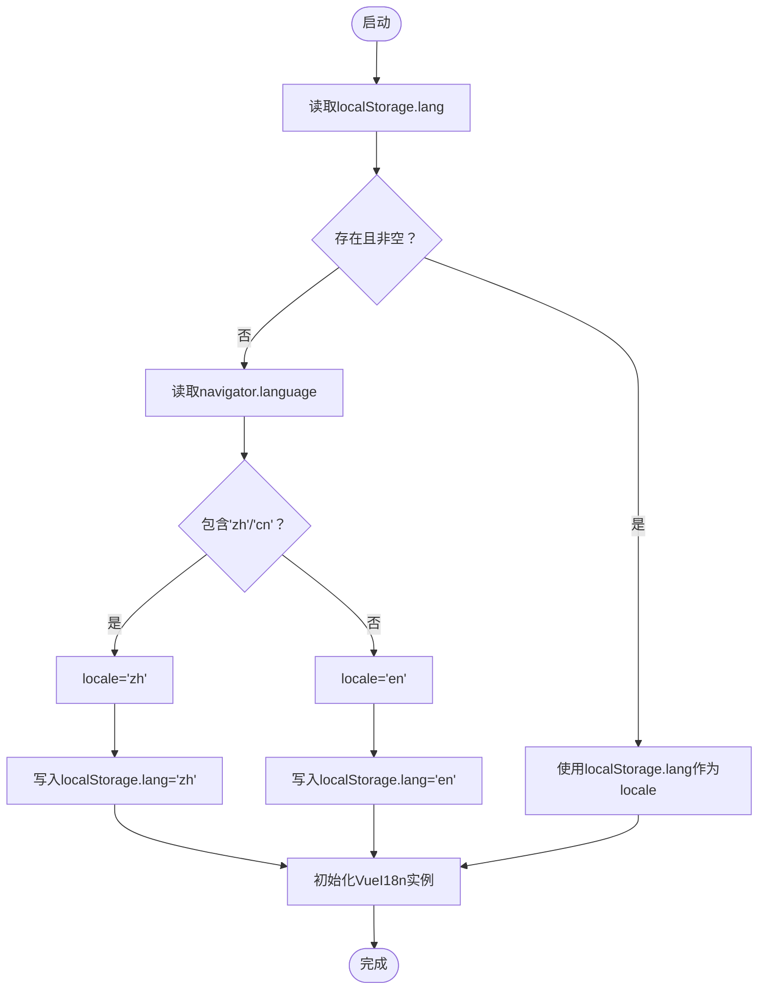
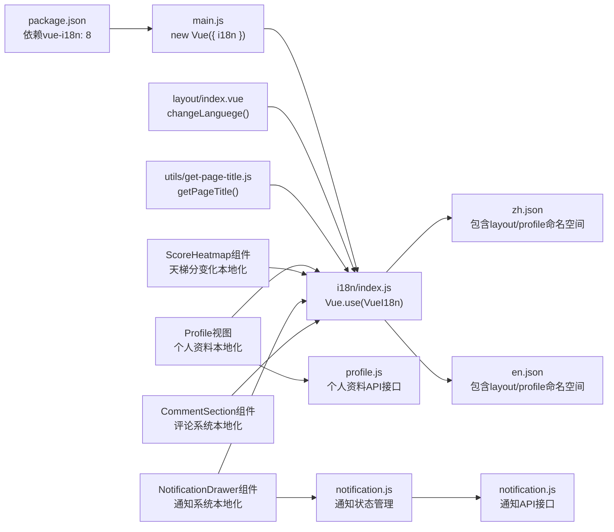

# 国际化支持

<cite>
**本文档引用的文件**
- [SpeedRunners.UI/src/i18n/index.js](file://SpeedRunners.UI/src/i18n/index.js)
- [SpeedRunners.UI/src/i18n/lang/zh.json](file://SpeedRunners.UI/src/i18n/lang/zh.json)
- [SpeedRunners.UI/src/i18n/lang/en.json](file://SpeedRunners.UI/src/i18n/lang/en.json)
- [SpeedRunners.UI/src/main.js](file://SpeedRunners.UI/src/main.js)
- [SpeedRunners.UI/src/layout/index.vue](file://SpeedRunners.UI/src/layout/index.vue)
- [SpeedRunners.UI/src/views/404.vue](file://SpeedRunners.UI/src/views/404.vue)
- [SpeedRunners.UI/src/views/index/index.vue](file://SpeedRunners.UI/src/views/index/index.vue)
- [SpeedRunners.UI/src/views/match/index.vue](file://SpeedRunners.UI/src/views/match/index.vue)
- [SpeedRunners.UI/src/views/other/log.vue](file://SpeedRunners.UI/src/views/other/log.vue)
- [SpeedRunners.UI/src/views/profile/index.vue](file://SpeedRunners.UI/src/views/profile/index.vue)
- [SpeedRunners.UI/src/utils/get-page-title.js](file://SpeedRunners.UI/src/utils/get-page-title.js)
- [SpeedRunners.UI/src/api/profile.js](file://SpeedRunners.UI/src/api/profile.js)
- [SpeedRunners.UI/src/components/ScoreHeatmap/index.vue](file://SpeedRunners.UI/src/components/ScoreHeatmap/index.vue)
- [SpeedRunners.UI/package.json](file://SpeedRunners.UI/package.json)
- [SpeedRunners.UI/vue.config.js](file://SpeedRunners.UI/vue.config.js)
- [SpeedRunners.UI/src/components/CommentSection/CommentItem.vue](file://SpeedRunners.UI/src/components/CommentSection/CommentItem.vue)
- [SpeedRunners.UI/src/components/CommentSection/index.vue](file://SpeedRunners.UI/src/components/CommentSection/index.vue)
- [SpeedRunners.UI/src/components/NotificationDrawer/index.vue](file://SpeedRunners.UI/src/components/NotificationDrawer/index.vue)
- [SpeedRunners.UI/src/store/modules/notification.js](file://SpeedRunners.UI/src/store/modules/notification.js)
- [SpeedRunners.UI/src/api/notification.js](file://SpeedRunners.UI/src/api/notification.js)
</cite>

## 更新摘要
**所做更改**
- 新增个人资料相关术语的完整国际化支持，包括'Profile'、'Score Activity'、'Achievements'、'Game Stats'等
- 扩展profile命名空间下的多语言键值设计，涵盖个人主页、成就系统、游戏统计等核心功能
- 完善个人资料页面的多语言本地化实现，包括状态显示、段位名称、统计数据等
- 增强游戏动态和成就解锁的本地化处理，提供完整的多语言用户体验

## 目录
1. [简介](#简介)
2. [项目结构](#项目结构)
3. [核心组件](#核心组件)
4. [架构总览](#架构总览)
5. [详细组件分析](#详细组件分析)
6. [依赖关系分析](#依赖关系分析)
7. [性能考虑](#性能考虑)
8. [故障排除指南](#故障排除指南)
9. [结论](#结论)
10. [附录](#附录)

## 简介
本文件系统性梳理 SpeedRunnersLab 前端基于 vue-i18n 8.x 的国际化实现方案，覆盖资源文件组织、语言检测与切换、页面标题动态生成、与路由/权限的协同机制，并提供新增语言支持的操作步骤与最佳实践。

**更新** 新增个人资料系统的完整国际化支持，包括个人主页、成就系统、游戏统计、天梯分变化等核心功能的多语言本地化，为用户提供完整的多语言个人资料体验。

## 项目结构
国际化相关代码集中在 SpeedRunners.UI/src/i18n 目录，采用按语言拆分的 JSON 资源文件，通过 i18n 实例在应用启动时注入全局。

**图表来源**
- [SpeedRunners.UI/src/i18n/index.js](file://SpeedRunners.UI/src/i18n/index.js#L1-L35)
- [SpeedRunners.UI/src/i18n/lang/zh.json](file://SpeedRunners.UI/src/i18n/lang/zh.json#L249-L281)
- [SpeedRunners.UI/src/i18n/lang/en.json](file://SpeedRunners.UI/src/i18n/lang/en.json#L249-L281)
- [SpeedRunners.UI/src/main.js](file://SpeedRunners.UI/src/main.js#L1-L30)
- [SpeedRunners.UI/src/views/profile/index.vue](file://SpeedRunners.UI/src/views/profile/index.vue#L1-L760)
- [SpeedRunners.UI/src/components/ScoreHeatmap/index.vue](file://SpeedRunners.UI/src/components/ScoreHeatmap/index.vue#L1-L362)
- [SpeedRunners.UI/src/api/profile.js](file://SpeedRunners.UI/src/api/profile.js#L1-L26)
- [SpeedRunners.UI/src/layout/index.vue](file://SpeedRunners.UI/src/layout/index.vue#L40-L96)

**章节来源**
- [SpeedRunners.UI/src/i18n/index.js](file://SpeedRunners.UI/src/i18n/index.js#L1-L35)
- [SpeedRunners.UI/src/i18n/lang/zh.json](file://SpeedRunners.UI/src/i18n/lang/zh.json#L1-L283)
- [SpeedRunners.UI/src/i18n/lang/en.json](file://SpeedRunners.UI/src/i18n/lang/en.json#L1-L283)
- [SpeedRunners.UI/src/main.js](file://SpeedRunners.UI/src/main.js#L1-L30)

## 核心组件
- i18n 实例与资源加载
  - 在 i18n/index.js 中引入 zh.json 与 en.json，初始化 VueI18n 实例并设置默认语言。
  - 语言检测逻辑：优先读取 localStorage；若不存在则根据 navigator.language 判断 zh 或 en 并写入 localStorage。
  - 将 i18n 注入到根实例，使全局可用。

- 页面标题动态生成
  - 工具函数 getPageTitle 使用 i18n.locale 决定标题后缀文案，确保切换语言后标题同步变化。

- 语言切换交互
  - 布局组件提供语言菜单，点击后通过 $i18n.locale 切换语言，同时更新 localStorage 和页面标题。

**更新** 个人资料系统组件完全集成国际化支持，包括：
- 个人资料路由标题：`$t('routes.profile')` → "个人主页" / "Profile"
- 个人资料页面标题：`$t('profile.gameStats')` → "游戏统计" / "Game Stats"
- 成就系统标题：`$t('profile.achievements')` → "成就" / "Achievements"
- 天梯分变化标题：`$t('profile.scoreHeatmap')` → "天梯分变化" / "Score Activity"
- 状态显示：`$t('profile.offline')` → "离线" / "Offline"，`$t('profile.online')` → "在线" / "Online"
- 段位名称：通过 `rank.{entry|beginner|advanced|expert|bronze|silver|gold|platinum|diamond}` 映射
- 解锁成就提示：`$t('profile.unlocked')` → "解锁成就" / "Unlocked"
- 晋级提示：`$t('profile.rankUpTo')` → "晋级至" / "Ranked up to"
- 未找到玩家：`$t('profile.notFound')` → "未找到该玩家" / "Player Not Found"

**章节来源**
- [SpeedRunners.UI/src/i18n/index.js](file://SpeedRunners.UI/src/i18n/index.js#L1-L35)
- [SpeedRunners.UI/src/utils/get-page-title.js](file://SpeedRunners.UI/src/utils/get-page-title.js#L1-L11)
- [SpeedRunners.UI/src/layout/index.vue](file://SpeedRunners.UI/src/layout/index.vue#L41-L96)
- [SpeedRunners.UI/src/views/profile/index.vue](file://SpeedRunners.UI/src/views/profile/index.vue#L120-L186)

## 架构总览
整体国际化流程：浏览器语言检测 → 本地存储持久化 → i18n 实例初始化 → 组件/工具函数使用 $t/$n/$d 获取翻译 → 语言切换更新 i18n.locale 与页面标题。

**图表来源**
- [SpeedRunners.UI/src/i18n/index.js](file://SpeedRunners.UI/src/i18n/index.js#L8-L33)
- [SpeedRunners.UI/src/main.js](file://SpeedRunners.UI/src/main.js#L23-L30)
- [SpeedRunners.UI/src/layout/index.vue](file://SpeedRunners.UI/src/layout/index.vue#L41-L96)
- [SpeedRunners.UI/src/utils/get-page-title.js](file://SpeedRunners.UI/src/utils/get-page-title.js#L6-L10)
- [SpeedRunners.UI/src/views/profile/index.vue](file://SpeedRunners.UI/src/views/profile/index.vue#L120-L186)
- [SpeedRunners.UI/src/components/ScoreHeatmap/index.vue](file://SpeedRunners.UI/src/components/ScoreHeatmap/index.vue#L6-L12)
- [SpeedRunners.UI/src/store/modules/notification.js](file://SpeedRunners.UI/src/store/modules/notification.js#L14-L57)

## 详细组件分析

### i18n 实例与资源组织
- 资源文件命名与层级
  - 文件路径：src/i18n/lang/{lang}.json
  - 当前支持：zh.json、en.json
  - 键值结构：按功能域分层（如 index、layout、routes、mod、common、rank、stats、match、components、login、privacy、comment、notification、profile 等）

- 初始化与默认语言
  - 从 localStorage 读取语言；若为空则根据 navigator.language 包含 "zh" 或 "cn" 判定为中文，否则英文，并写回 localStorage。
  - locale 字段用于决定当前语言；messages 字段注册 zh 与 en 两个语言包。

- 与 Vuetify 的本地化
  - Vuetify 语言包通过 vuetify.js 配置 lang.locales 与 current，实现组件级本地化（如 snackbar 文案等）。

**图表来源**
- [SpeedRunners.UI/src/i18n/index.js](file://SpeedRunners.UI/src/i18n/index.js#L8-L20)

**章节来源**
- [SpeedRunners.UI/src/i18n/index.js](file://SpeedRunners.UI/src/i18n/index.js#L1-L35)
- [SpeedRunners.UI/src/plugins/vuetify.js](file://SpeedRunners.UI/src/plugins/vuetify.js#L24-L28)

### 页面标题动态生成
- 标题规则
  - 若传入页面标题，则去除空格后与站点标题拼接，并根据 i18n.locale 添加语言后缀（中文显示" - SR数据展示"）。
  - 未传入页面标题时，返回站点标题。

- 应用场景
  - 布局组件在语言切换时调用 getPageTitle，将返回值赋给 document.title，确保标题随语言变化。

**章节来源**
- [SpeedRunners.UI/src/utils/get-page-title.js](file://SpeedRunners.UI/src/utils/get-page-title.js#L1-L11)
- [SpeedRunners.UI/src/layout/index.vue](file://SpeedRunners.UI/src/layout/index.vue#L440-L441)

### 语言切换机制
- 触发方式
  - 布局顶部语言菜单，用户选择后触发 changeLanguege 方法。
- 执行流程
  - 设置 $i18n.locale 为 "zh" 或 "en"。
  - 同步写入 localStorage.lang。
  - 调用 getPageTitle 生成新标题并设置 document.title。

- 注意事项
  - 切换语言不会自动刷新页面，但会立即生效于后续渲染。
  - 若需持久化，应确保 localStorage 存储逻辑在初始化时被读取。

**章节来源**
- [SpeedRunners.UI/src/layout/index.vue](file://SpeedRunners.UI/src/layout/index.vue#L436-L441)

### 资源文件键值设计
- 分层策略
  - routes：导航菜单项标题，配合路由 meta.title 使用。
  - index：首页相关文案与链接。
  - layout：布局通用文案（如登录、退出、主题切换、邮箱、通知等）。
  - common：通用提示与操作文案（搜索、提交、取消、确认、全部已读等）。
  - mod：MOD 资源上传与管理相关文案。
  - rank：排行榜相关文案（段位、分数、时长等）。
  - stats：玩家查询相关文案。
  - match：赛事相关文案（奖池、赛程、奖励、赞助、时间等）。
  - comment：评论系统相关文案（标题、占位符、操作按钮、时间格式等）。
  - components：通用组件文案（如裁剪器）。
  - login：登录流程提示。
  - privacy：隐私设置相关文案。
  - profile：个人资料系统相关文案（成就、游戏统计、天梯分变化等）。
  - 404/500：错误页面文案。

- 复杂文案与占位符
  - 支持占位符参数（如 {0}），在组件中以数组形式传入。
  - 数组型文案用于多段落说明（如 match.sponsorContent、match.matchContent）。
  - 评论系统的时间格式化支持动态数值替换。

**更新** 新增个人资料系统键值设计：
- routes.profile：个人资料路由标题 → "个人主页" / "Profile"
- profile.gameStats：游戏统计标题 → "游戏统计" / "Game Stats"
- profile.achievements：成就标题 → "成就" / "Achievements"
- profile.scoreHeatmap：天梯分变化标题 → "天梯分变化" / "Score Activity"
- profile.offline：离线状态 → "离线" / "Offline"
- profile.online：在线状态 → "在线" / "Online"
- profile.playingSR：正在玩SR状态 → "正在玩 SpeedRunners" / "Playing SpeedRunners"
- profile.notFound：未找到玩家 → "未找到该玩家" / "Player Not Found"
- profile.rankUpTo：晋级提示 → "晋级至" / "Ranked up to"
- profile.unlocked：解锁成就提示 → "解锁成就" / "Unlocked"
- profile.activity.scoreChange：天梯分变化动态 → "天梯分变化" / "Score Change"
- profile.activity.rankUp：段位晋级动态 → "段位晋级" / "Rank Up"
- profile.activity.achievement：成就解锁动态 → "成就解锁" / "Achievement"
- profile.activity.gameSession：游戏时长动态 → "游戏时长" / "Game Session"
- profile.activity.other：其他动态 → "其他" / "Other"

**章节来源**
- [SpeedRunners.UI/src/i18n/lang/zh.json](file://SpeedRunners.UI/src/i18n/lang/zh.json#L249-L281)
- [SpeedRunners.UI/src/i18n/lang/en.json](file://SpeedRunners.UI/src/i18n/lang/en.json#L249-L281)

### 组件中的国际化使用
- 基础用法
  - 在模板中使用 $t('键路径') 获取翻译。
  - 在脚本中通过 this.$t 或 this.$i18n.t 访问。
- 示例
  - 404 页面：使用 $t('404.error')、$t('404.check')、$t('404.back')。
  - 首页：使用 $t('index.online')、$t('index.videoTitle')、$t('index.videoUrl')。
  - 赛事页：使用 $t('match.prizePool')、$t('match.schedule')、$t('match.participant') 等，并根据 locale 动态拼接 iframe 源。
  - 布局页：使用 $t('layout.login')、$t('layout.logout')、$t('layout.theme')、$t('layout.email')、$t('layout.notification') 等。
  - **更新** 个人资料页：使用 $t('routes.profile')、$t('profile.gameStats')、$t('profile.achievements')、$t('profile.scoreHeatmap') 等。
  - **更新** 通知抽屉：使用 $t('layout.notification')、$t('layout.replyMe')、$t('layout.likeMe')、$t('layout.noNotifications')、$t('layout.viewAll') 等。
  - **更新** 评论组件：使用 $t('comment.title')、$t('comment.placeholder')、$t('comment.replyPlaceholder', [用户名]) 等。

**章节来源**
- [SpeedRunners.UI/src/views/404.vue](file://SpeedRunners.UI/src/views/404.vue#L12-L27)
- [SpeedRunners.UI/src/views/index/index.vue](file://SpeedRunners.UI/src/views/index/index.vue#L10-L31)
- [SpeedRunners.UI/src/views/match/index.vue](file://SpeedRunners.UI/src/views/match/index.vue#L19-L144)
- [SpeedRunners.UI/src/layout/index.vue](file://SpeedRunners.UI/src/layout/index.vue#L24-L111)
- [SpeedRunners.UI/src/views/profile/index.vue](file://SpeedRunners.UI/src/views/profile/index.vue#L120-L186)
- [SpeedRunners.UI/src/components/NotificationDrawer/index.vue](file://SpeedRunners.UI/src/components/NotificationDrawer/index.vue#L13-L152)
- [SpeedRunners.UI/src/components/CommentSection/CommentItem.vue](file://SpeedRunners.UI/src/components/CommentSection/CommentItem.vue#L10-L115)

### 个人资料系统的本地化实现
- 个人资料页面标题与导航
  - 路由标题：`$t('routes.profile')` → "个人主页" / "Profile"
  - 页面标题：`<v-card-title>{{ $t('profile.gameStats') }}</v-card-title>` → "游戏统计" / "Game Stats"

- 成就系统本地化
  - 成就标题：`<v-card-title>{{ $t('profile.achievements') }}</v-card-title>` → "成就" / "Achievements"
  - 未找到成就：`{{ $t('profile.noAchievements') }}` → "暂无成就数据" / "No achievement data"
  - 解锁计数：`{{ unlockedCount }}/{{ achievements.length }}` → 动态显示解锁数量

- 天梯分变化本地化
  - 热力图标题：`{{ $t('profile.scoreHeatmap') }}` → "天梯分变化" / "Score Activity"
  - 年度总计：`{{ $t('profile.totalAdded') }}` → "年度累计" / "Annual Total"
  - 周标签：`{{ $t('profile.mon') }}`、`{{ $t('profile.wed') }}`、`{{ $t('profile.fri') }}` → "一"/"Mon"、"三"/"Wed"、"五"/"Fri"
  - 更多标签：`{{ $t('profile.more') }}` → "多"/"More"

- 状态显示本地化
  - 离线状态：`{{ $t('profile.offline') }}` → "离线" / "Offline"
  - 在线状态：`{{ $t('profile.online') }}` → "在线" / "Online"
  - 正在玩SR状态：`{{ $t('profile.playingSR') }}` → "正在玩 SpeedRunners" / "Playing SpeedRunners"

- 段位名称本地化
  - 通过 `rank.{entry|beginner|advanced|expert|bronze|silver|gold|platinum|diamond}` 映射
  - KOS段位特殊处理：`if (level === 9) return 'KOS';`

- 未找到玩家处理
  - 标题：`{{ $t('profile.notFound') }}` → "未找到该玩家" / "Player Not Found"
  - 描述：`{{ $t('profile.notFoundDesc') }}` → "玩家不存在或资料未公开" / "Player does not exist or profile is private"

**章节来源**
- [SpeedRunners.UI/src/views/profile/index.vue](file://SpeedRunners.UI/src/views/profile/index.vue#L120-L186)
- [SpeedRunners.UI/src/views/profile/index.vue](file://SpeedRunners.UI/src/views/profile/index.vue#L251-L256)
- [SpeedRunners.UI/src/views/profile/index.vue](file://SpeedRunners.UI/src/views/profile/index.vue#L274-L279)
- [SpeedRunners.UI/src/views/profile/index.vue](file://SpeedRunners.UI/src/views/profile/index.vue#L204-L208)

### 天梯分热力图的本地化实现
- 标题与统计
  - 热力图标题：`{{ $t('profile.scoreHeatmap') }}` → "天梯分变化" / "Score Activity"
  - 年度总计：`{{ $t('profile.totalAdded') }}` → "年度累计" / "Annual Total"
  - 总分显示：`+{{ totalScore }}` → 动态显示总分

- 月份标签本地化
  - 周标签：`{{ $t('profile.mon') }}`、`{{ $t('profile.wed') }}`、`{{ $t('profile.fri') }}` → "一"/"Mon"、"三"/"Wed"、"五"/"Fri"

- 图例标签
  - "少"/"Less"：`{{ $t('profile.less') }}` → "少"/"Less"
  - "多"/"More"：`{{ $t('profile.more') }}` → "多"/"More"

- 日期格式化
  - 中文格式：`${date.getFullYear()}年${date.getMonth() + 1}月${date.getDate()}日`
  - 英文格式：`${months[date.getMonth()]} ${date.getDate()}, ${date.getFullYear()}`

**章节来源**
- [SpeedRunners.UI/src/components/ScoreHeatmap/index.vue](file://SpeedRunners.UI/src/components/ScoreHeatmap/index.vue#L6-L12)
- [SpeedRunners.UI/src/components/ScoreHeatmap/index.vue](file://SpeedRunners.UI/src/components/ScoreHeatmap/index.vue#L27-L32)
- [SpeedRunners.UI/src/components/ScoreHeatmap/index.vue](file://SpeedRunners.UI/src/components/ScoreHeatmap/index.vue#L178-L186)

### API接口与本地化集成
- 个人资料API
  - `getProfileData(steamId)`：获取个人主页数据
  - `getDailyScoreHistory(steamId)`：获取每日天梯分记录
  - `getAchievements(steamId)`：获取个人成就

- 与国际化系统的集成
  - API返回的数据结构与本地化键值一一对应
  - 组件通过 $t() 函数获取本地化文本
  - 状态管理和路由元信息支持国际化

**章节来源**
- [SpeedRunners.UI/src/api/profile.js](file://SpeedRunners.UI/src/api/profile.js#L1-L26)

### 布局组件中的通知菜单集成
- 通知菜单项
  - 通知菜单标题：`{{ $t('layout.notification') }}`
  - 回复通知项：`{{ $t('layout.replyMe') }}`
  - 点赞通知项：`{{ $t('layout.likeMe') }}`
  - 查看全部：`{{ $t('layout.viewAll') }}`

- 未读计数显示
  - 回复通知未读数：`{{ displayReplyCount }}`
  - 点赞通知未读数：`{{ displayLikeCount }}`

- 事件处理
  - 点击回复通知：`handleNotificationClick(1)` → 跳转到回复通知页面
  - 点击点赞通知：`handleNotificationClick(2)` → 跳转到点赞通知页面
  - 点击查看全部：`handleViewAll()` → 打开通知抽屉

**章节来源**
- [SpeedRunners.UI/src/layout/index.vue](file://SpeedRunners.UI/src/layout/index.vue#L40-L96)

### 与路由、权限的结合
- 路由标题联动
  - 导航标签使用 $t(`routes.${route.meta.title}`) 动态显示对应语言的菜单标题。
  - 页面标题通过 getPageTitle(this.$i18n.t(`routes.${this.$route.meta.title}`)) 动态生成。
- 权限与国际化
  - 权限路由常量与异步路由均包含 meta.title，因此切换语言后菜单与页面标题会随之更新。
- 注意
  - 若新增路由或修改 meta.title，需确保对应语言键存在，避免空白或回退。

**章节来源**
- [SpeedRunners.UI/src/layout/index.vue](file://SpeedRunners.UI/src/layout/index.vue#L145-L146)
- [SpeedRunners.UI/src/utils/get-page-title.js](file://SpeedRunners.UI/src/utils/get-page-title.js#L6-L10)

### 本地化格式化（日期、数字、货币）
- 当前实现
  - 项目中未显式使用 $d/$n 进行日期/数字/货币格式化。
  - 赛事页通过字符串拼接展示金额与排名，未使用 Intl.NumberFormat。
  - **更新** 通知系统、评论系统和个人资料系统实现了动态时间格式化，支持相对时间显示（刚刚、几分钟前、几小时前等）。
  - **更新** 个人资料页面实现了中英文日期格式化，支持解锁时间和日期显示。

- 建议
  - 对金额、排名等数值建议使用 $n 或 $d 进行本地化格式化，提升一致性与可维护性。
  - 通知系统、评论系统和个人资料系统的时间格式化已实现，可作为其他组件的参考实现。

**章节来源**
- [SpeedRunners.UI/src/views/match/index.vue](file://SpeedRunners.UI/src/views/match/index.vue#L243-L247)
- [SpeedRunners.UI/src/components/NotificationDrawer/index.vue](file://SpeedRunners.UI/src/components/NotificationDrawer/index.vue#L250-L273)
- [SpeedRunners.UI/src/components/CommentSection/CommentItem.vue](file://SpeedRunners.UI/src/components/CommentSection/CommentItem.vue#L155-L171)
- [SpeedRunners.UI/src/views/profile/index.vue](file://SpeedRunners.UI/src/views/profile/index.vue#L355-L363)

## 依赖关系分析
- 依赖版本
  - vue-i18n: 8（在 package.json 中声明）
- 关键依赖链
  - main.js -> i18n/index.js -> i18n/lang/*.json
  - layout/index.vue -> i18n 实例（切换语言）
  - utils/get-page-title.js -> i18n 实例（生成标题）
  - **更新** views/profile/index.vue -> i18n 实例（个人资料系统本地化）
  - **更新** components/ScoreHeatmap/index.vue -> i18n 实例（天梯分变化本地化）
  - **更新** api/profile.js -> 个人资料API接口
  - **更新** components/NotificationDrawer -> i18n 实例（通知系统本地化）
  - **更新** components/CommentSection -> i18n 实例（评论系统本地化）
  - **更新** store/modules/notification -> i18n 实例（通知状态管理）

**图表来源**
- [SpeedRunners.UI/package.json](file://SpeedRunners.UI/package.json#L27-L27)
- [SpeedRunners.UI/src/main.js](file://SpeedRunners.UI/src/main.js#L23-L29)
- [SpeedRunners.UI/src/i18n/index.js](file://SpeedRunners.UI/src/i18n/index.js#L1-L35)
- [SpeedRunners.UI/src/layout/index.vue](file://SpeedRunners.UI/src/layout/index.vue#L436-L441)
- [SpeedRunners.UI/src/utils/get-page-title.js](file://SpeedRunners.UI/src/utils/get-page-title.js#L6-L10)
- [SpeedRunners.UI/src/views/profile/index.vue](file://SpeedRunners.UI/src/views/profile/index.vue#L1-L760)
- [SpeedRunners.UI/src/components/ScoreHeatmap/index.vue](file://SpeedRunners.UI/src/components/ScoreHeatmap/index.vue#L1-L362)
- [SpeedRunners.UI/src/api/profile.js](file://SpeedRunners.UI/src/api/profile.js#L1-L26)
- [SpeedRunners.UI/src/components/NotificationDrawer/index.vue](file://SpeedRunners.UI/src/components/NotificationDrawer/index.vue#L1-L325)
- [SpeedRunners.UI/src/components/CommentSection/index.vue](file://SpeedRunners.UI/src/components/CommentSection/index.vue#L1-L83)
- [SpeedRunners.UI/src/store/modules/notification.js](file://SpeedRunners.UI/src/store/modules/notification.js#L1-L138)
- [SpeedRunners.UI/src/api/notification.js](file://SpeedRunners.UI/src/api/notification.js#L1-L13)

**章节来源**
- [SpeedRunners.UI/package.json](file://SpeedRunners.UI/package.json#L15-L32)
- [SpeedRunners.UI/src/main.js](file://SpeedRunners.UI/src/main.js#L1-L30)

## 性能考虑
- 资源加载
  - 语言包以静态 JSON 文件形式引入，构建时打包，运行时无需网络请求，加载成本低。
- 切换成本
  - 语言切换仅更新 i18n.locale 与页面标题，无额外网络请求，切换即时生效。
- 建议
  - 若未来语言包过大，可考虑按需动态加载或拆分更细的模块化资源。
- **更新** 个人资料系统性能优化
  - 个人资料页面使用骨架屏加载，提升用户体验。
  - 成就网格采用响应式布局，适应不同屏幕尺寸。
  - 天梯分热力图使用虚拟滚动和分页加载，避免大量数据一次性渲染。
  - 时间格式化采用本地计算，减少重复计算开销。
  - 通知系统、评论系统和个人资料系统共享时间格式化逻辑，提高代码复用性。

## 故障排除指南
- 切换语言后页面未更新
  - 确认是否调用了 $i18n.locale 设置与 localStorage 写入。
  - 确认是否在语言切换后调用 getPageTitle 更新 document.title。
- 新增路由标题不显示
  - 检查路由 meta.title 是否与 i18n 资源中的 routes.* 键一致。
- 404/500 文案未显示
  - 检查对应键是否存在，如 404.error、500.msg。
- 金额/排名格式不符合预期
  - 建议使用 $n/$d 进行本地化格式化，避免硬编码字符串。
- **更新** 个人资料系统问题排查
  - 个人资料标题显示异常：检查 routes.profile、profile.gameStats、profile.achievements、profile.scoreHeatmap 键是否存在。
  - 成就显示异常：确认 profile.achievements、profile.noAchievements 键的翻译是否正确。
  - 天梯分变化显示异常：检查 profile.scoreHeatmap、profile.totalAdded、profile.mon、profile.wed、profile.fri、profile.more、profile.less 键是否存在。
  - 状态显示异常：确认 profile.offline、profile.online、profile.playingSR 键的翻译是否正确。
  - 未找到玩家：检查 profile.notFound、profile.notFoundDesc 键是否存在。
  - 段位名称显示异常：确认 rank.{entry|beginner|advanced|expert|bronze|silver|gold|platinum|diamond} 键是否存在。
- **更新** 通知系统问题排查
  - 通知标题显示异常：检查 layout.notification、layout.replyMe、layout.likeMe 键是否存在。
  - 通知列表为空：确认 API 接口正常工作，检查通知状态管理模块。
  - 时间格式化错误：确认 comment.time.* 键的翻译是否正确。
  - 未读计数不更新：检查通知轮询机制和状态更新逻辑。
  - 布局菜单显示异常：检查 layout.replyMe、layout.likeMe、layout.viewAll 键是否存在。
- **更新** 评论系统问题排查
  - 评论文本显示异常：检查 comment 命名空间下的相关键是否存在。
  - 时间格式化错误：确认 comment.time.* 键的翻译是否正确。
  - 回复功能失效：检查回复占位符和按钮文本的本地化是否正常。

**章节来源**
- [SpeedRunners.UI/src/layout/index.vue](file://SpeedRunners.UI/src/layout/index.vue#L436-L441)
- [SpeedRunners.UI/src/views/404.vue](file://SpeedRunners.UI/src/views/404.vue#L12-L27)
- [SpeedRunners.UI/src/views/match/index.vue](file://SpeedRunners.UI/src/views/match/index.vue#L243-L247)
- [SpeedRunners.UI/src/views/profile/index.vue](file://SpeedRunners.UI/src/views/profile/index.vue#L120-L186)
- [SpeedRunners.UI/src/components/ScoreHeatmap/index.vue](file://SpeedRunners.UI/src/components/ScoreHeatmap/index.vue#L6-L12)
- [SpeedRunners.UI/src/components/NotificationDrawer/index.vue](file://SpeedRunners.UI/src/components/NotificationDrawer/index.vue#L250-L273)
- [SpeedRunners.UI/src/components/CommentSection/CommentItem.vue](file://SpeedRunners.UI/src/components/CommentSection/CommentItem.vue#L165-L170)

## 结论
本项目采用轻量、易维护的 vue-i18n 8.x 方案，通过静态 JSON 资源与本地存储实现语言检测与持久化，配合布局组件与工具函数实现标题动态更新。**更新** 新增的个人资料系统完整集成了国际化支持，包括个人主页、成就系统、游戏统计、天梯分变化等核心功能，涵盖状态显示、段位名称、统计数据、动态展示等多个方面，为用户提供了完整的多语言个人资料体验。整体架构清晰、扩展性强，适合快速迭代与多语言扩展。

## 附录

### 新增语言支持操作步骤
- 创建语言包
  - 在 src/i18n/lang 下新增 {lang}.json（如 fr.json），复制现有键结构并填充翻译。
  - **更新** 确保新增语言包包含 layout、profile 和 notification 命名空间及其所有键值。
- 注册语言包
  - 在 src/i18n/index.js 中导入新语言包，并在 messages 中注册。
- 更新语言检测逻辑
  - 如需调整浏览器语言判断规则，可在 i18n/index.js 的语言检测分支中扩展。
- 更新语言切换菜单
  - 在布局组件 src/layout/index.vue 的语言菜单中添加新语言选项，并在 changeLanguege 中映射到新语言代码。
- 更新页面标题规则
  - 如需在新语言下调整标题后缀，可在 utils/get-page-title.js 中扩展条件。
- **更新** 验证个人资料系统本地化
  - 切换至新语言，检查个人资料标题、成就标题、天梯分变化标题、状态显示等是否正确显示。
- **更新** 验证通知系统本地化
  - 切换至新语言，检查通知抽屉标题、标签、按钮文本、时间格式等是否正确显示。
- **更新** 验证评论系统本地化
  - 切换至新语言，检查评论标题、占位符、按钮文本、时间格式等是否正确显示。
- 验证
  - 切换至新语言，检查菜单、页面标题、正文文案是否正确显示。

**章节来源**
- [SpeedRunners.UI/src/i18n/index.js](file://SpeedRunners.UI/src/i18n/index.js#L1-L35)
- [SpeedRunners.UI/src/layout/index.vue](file://SpeedRunners.UI/src/layout/index.vue#L436-L441)
- [SpeedRunners.UI/src/utils/get-page-title.js](file://SpeedRunners.UI/src/utils/get-page-title.js#L6-L10)

### 维护指南
- 键值命名规范
  - 采用功能域分层命名（如 routes.home、index.online、mod.upload、comment.title、layout.notification、profile.gameStats），避免重复与歧义。
  - **更新** 个人资料系统键值遵循统一命名模式：routes.{profile}、profile.{gameStats|achievements|scoreHeatmap|offline|online|playingSR|notFound|rankUpTo|unlocked|activity.*}。
- 占位符与复数
  - 使用占位符时统一命名（如 {0}、{1}），并在组件中按顺序传参。
  - **更新** 个人资料系统和通知系统、评论系统支持动态参数替换，如回复占位符和时间格式化。
- 资源文件校验
  - 新增键后，确保 zh.json 与 en.json 同步补充，避免缺失导致回退。
  - **更新** 个人资料系统、通知系统和评论系统相关键值必须在所有语言包中保持一致。
- 版本升级准备
  - vue-i18n 8.x 已稳定，若未来升级至 9.x，需关注 Composition API 与插槽语法的变化。
- **更新** 个人资料系统维护要点
  - 定期检查个人资料标题和标签的本地化，确保与路由和布局组件保持一致。
  - 保持个人资料相关文案与业务逻辑的一致性。
  - 监控个人资料页面的性能表现，必要时优化加载策略和数据处理。
  - 确保段位名称映射的准确性，特别是 KOS 段位的特殊处理。
- **更新** 通知系统维护要点
  - 定期检查通知标题和标签的本地化，确保与布局组件保持一致。
  - 保持通知相关文案与业务逻辑的一致性。
  - 监控通知系统的性能表现，必要时优化轮询策略和加载机制。
- **更新** 评论系统维护要点
  - 定期检查评论时间格式化逻辑，确保跨语言兼容性。
  - 保持评论相关文案与业务逻辑的一致性。
  - 监控评论系统的性能表现，必要时优化加载策略。

**章节来源**
- [SpeedRunners.UI/src/i18n/lang/zh.json](file://SpeedRunners.UI/src/i18n/lang/zh.json#L1-L283)
- [SpeedRunners.UI/src/i18n/lang/en.json](file://SpeedRunners.UI/src/i18n/lang/en.json#L1-L283)
- [SpeedRunners.UI/src/views/profile/index.vue](file://SpeedRunners.UI/src/views/profile/index.vue#L120-L186)
- [SpeedRunners.UI/src/components/ScoreHeatmap/index.vue](file://SpeedRunners.UI/src/components/ScoreHeatmap/index.vue#L6-L12)
- [SpeedRunners.UI/src/components/NotificationDrawer/index.vue](file://SpeedRunners.UI/src/components/NotificationDrawer/index.vue#L250-L273)
- [SpeedRunners.UI/src/components/CommentSection/CommentItem.vue](file://SpeedRunners.UI/src/components/CommentSection/CommentItem.vue#L155-L171)