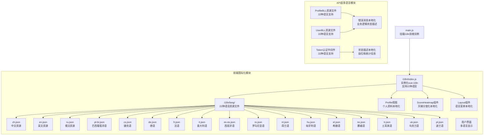
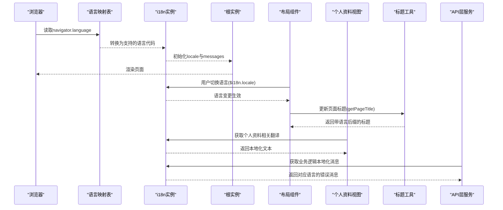
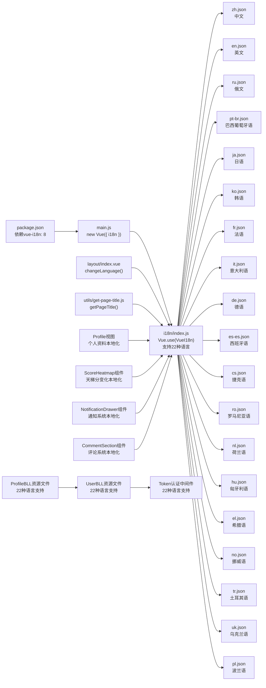

# 国际化支持

<cite>
**本文档引用的文件**
- [SpeedRunners.UI/src/i18n/index.js](file://SpeedRunners.UI/src/i18n/index.js)
- [SpeedRunners.UI/src/i18n/lang/zh.json](file://SpeedRunners.UI/src/i18n/lang/zh.json)
- [SpeedRunners.UI/src/i18n/lang/en.json](file://SpeedRunners.UI/src/i18n/lang/en.json)
- [SpeedRunners.UI/src/i18n/lang/cs.json](file://SpeedRunners.UI/src/i18n/lang/cs.json)
- [SpeedRunners.UI/src/i18n/lang/de.json](file://SpeedRunners.UI/src/i18n/lang/de.json)
- [SpeedRunners.UI/src/i18n/lang/ru.json](file://SpeedRunners.UI/src/i18n/lang/ru.json)
- [SpeedRunners.UI/src/i18n/lang/pt-br.json](file://SpeedRunners.UI/src/i18n/lang/pt-br.json)
- [SpeedRunners.UI/src/i18n/lang/el.json](file://SpeedRunners.UI/src/i18n/lang/el.json)
- [SpeedRunners.UI/src/i18n/lang/no.json](file://SpeedRunners.UI/src/i18n/lang/no.json)
- [SpeedRunners.UI/src/layout/index.vue](file://SpeedRunners.UI/src/layout/index.vue)
- [SpeedRunners.UI/src/views/profile/index.vue](file://SpeedRunners.UI/src/views/profile/index.vue)
- [SpeedRunners.UI/src/utils/get-page-title.js](file://SpeedRunners.UI/src/utils/get-page-title.js)
- [SpeedRunners.API/SpeedRunners.BLL/Resources/ProfileBLL.cs.resx](file://SpeedRunners.API/SpeedRunners.BLL/Resources/ProfileBLL.cs.resx)
- [SpeedRunners.API/SpeedRunners.BLL/Resources/UserBLL.cs.resx](file://SpeedRunners.API/SpeedRunners.BLL/Resources/UserBLL.cs.resx)
- [SpeedRunners.API/SpeedRunners/Resources/SRLabTokenAuthMidd.cs.resx](file://SpeedRunners.API/SpeedRunners/Resources/SRLabTokenAuthMidd.cs.resx)
</cite>

## 更新摘要
**所做更改**
- 大幅扩展国际支持，新增20种语言，支持总数达到22种语言
- 新增API层多语言资源文件，包括ProfileBLL、UserBLL和Token Authentication Middleware的22种语言支持
- 改进语言检测和映射机制，支持更精确的浏览器语言识别
- 更新语言切换菜单，支持所有新增语言的直接切换
- 完善个人资料系统的国际化支持，包括状态显示、段位名称、统计数据等
- 增强通知系统、评论系统和个人资料系统的本地化处理
- 新增API层业务逻辑的多语言错误消息支持

## 目录
1. [简介](#简介)
2. [项目结构](#项目结构)
3. [核心组件](#核心组件)
4. [架构总览](#架构总览)
5. [详细组件分析](#详细组件分析)
6. [API层多语言支持](#api层多语言支持)
7. [新增语言支持](#新增语言支持)
8. [依赖关系分析](#依赖关系分析)
9. [性能考虑](#性能考虑)
10. [故障排除指南](#故障排除指南)
11. [结论](#结论)
12. [附录](#附录)

## 简介
本文件系统性梳理 SpeedRunnersLab 前端基于 vue-i18n 8.x 的国际化实现方案，覆盖资源文件组织、语言检测与切换、页面标题动态生成、与路由/权限的协同机制。项目现已支持22种语言，包括中文、英语、俄语、巴西葡萄牙语、日语、韩语、法语、意大利语、德语、西班牙语、捷克语、罗马尼亚语、荷兰语、匈牙利语、希腊语、挪威语、土耳其语、乌克兰语、波兰语等，为全球用户提供完整的多语言体验。

**更新** 项目大幅扩展了国际支持范围，新增20种语言，改进了语言检测和映射机制，并新增了API层的多语言资源文件支持，涵盖ProfileBLL、UserBLL和Token Authentication Middleware等关键业务组件，为不同地区和文化背景的用户提供了更加精准的语言支持。

## 项目结构
国际化相关代码集中在 SpeedRunners.UI/src/i18n 目录，采用按语言拆分的 JSON 资源文件，通过 i18n 实例在应用启动时注入全局。新增语言文件位于 src/i18n/lang/ 目录下，每个语言都有独立的 JSON 文件。API层的多语言资源文件位于 SpeedRunners.API 项目的 Resources 目录中，支持22种语言的业务逻辑错误消息和状态描述。

**图表来源**
- [SpeedRunners.UI/src/i18n/index.js:1-110](file://SpeedRunners.UI/src/i18n/index.js#L1-L110)
- [SpeedRunners.UI/src/layout/index.vue:384-404](file://SpeedRunners.UI/src/layout/index.vue#L384-L404)
- [SpeedRunners.API/SpeedRunners.BLL/Resources/ProfileBLL.cs.resx:61-115](file://SpeedRunners.API/SpeedRunners.BLL/Resources/ProfileBLL.cs.resx#L61-L115)
- [SpeedRunners.API/SpeedRunners.BLL/Resources/UserBLL.cs.resx:61-76](file://SpeedRunners.API/SpeedRunners.BLL/Resources/UserBLL.cs.resx#L61-L76)
- [SpeedRunners.API/SpeedRunners/Resources/SRLabTokenAuthMidd.cs.resx:120-123](file://SpeedRunners.API/SpeedRunners/Resources/SRLabTokenAuthMidd.cs.resx#L120-L123)

**章节来源**
- [SpeedRunners.UI/src/i18n/index.js:1-110](file://SpeedRunners.UI/src/i18n/index.js#L1-L110)
- [SpeedRunners.UI/src/i18n/lang/zh.json:1-289](file://SpeedRunners.UI/src/i18n/lang/zh.json#L1-L289)
- [SpeedRunners.UI/src/i18n/lang/en.json:1-289](file://SpeedRunners.UI/src/i18n/lang/en.json#L1-L289)
- [SpeedRunners.UI/src/layout/index.vue:384-404](file://SpeedRunners.UI/src/layout/index.vue#L384-L404)

## 核心组件
- i18n 实例与资源加载
  - 在 i18n/index.js 中引入22种语言的 JSON 资源文件，初始化 VueI18n 实例并设置默认语言。
  - 改进的语言检测逻辑：通过 langMap 映射表支持更精确的浏览器语言识别，包括地区变体（如 zh-cn、en-us、de-de 等）。
  - 将 i18n 注入到根实例，使全局可用。

- 页面标题动态生成
  - 工具函数 getPageTitle 使用 i18n.locale 决定标题后缀文案，确保切换语言后标题同步变化。

- 语言切换交互
  - 布局组件提供包含22种语言的下拉菜单，点击后通过 $i18n.locale 切换语言，同时更新 localStorage 和页面标题。

**更新** 新增API层多语言支持：
- ProfileBLL资源文件：包含段位名称、统计数据、成就信息等22种语言的本地化描述
- UserBLL资源文件：包含登录状态、权限验证、设备管理等22种语言的错误消息
- Token认证中间件：包含未登录状态等22种语言的提示信息
- 业务逻辑本地化：确保API层的错误消息和状态描述支持多语言显示

**章节来源**
- [SpeedRunners.UI/src/i18n/index.js:25-68](file://SpeedRunners.UI/src/i18n/index.js#L25-L68)
- [SpeedRunners.UI/src/layout/index.vue:384-404](file://SpeedRunners.UI/src/layout/index.vue#L384-L404)
- [SpeedRunners.UI/src/utils/get-page-title.js:1-11](file://SpeedRunners.UI/src/utils/get-page-title.js#L1-L11)
- [SpeedRunners.API/SpeedRunners.BLL/Resources/ProfileBLL.cs.resx:61-115](file://SpeedRunners.API/SpeedRunners.BLL/Resources/ProfileBLL.cs.resx#L61-L115)
- [SpeedRunners.API/SpeedRunners.BLL/Resources/UserBLL.cs.resx:61-76](file://SpeedRunners.API/SpeedRunners.BLL/Resources/UserBLL.cs.resx#L61-L76)
- [SpeedRunners.API/SpeedRunners/Resources/SRLabTokenAuthMidd.cs.resx:120-123](file://SpeedRunners.API/SpeedRunners/Resources/SRLabTokenAuthMidd.cs.resx#L120-L123)

## 架构总览
整体国际化流程：浏览器语言检测 → 语言映射表转换 → 本地存储持久化 → i18n 实例初始化 → 组件/工具函数使用 $t/$n/$d 获取翻译 → 语言切换更新 i18n.locale 与页面标题。API层通过RESX资源文件提供业务逻辑的多语言支持。

**图表来源**
- [SpeedRunners.UI/src/i18n/index.js:70-78](file://SpeedRunners.UI/src/i18n/index.js#L70-L78)
- [SpeedRunners.UI/src/i18n/index.js:25-68](file://SpeedRunners.UI/src/i18n/index.js#L25-L68)
- [SpeedRunners.UI/src/layout/index.vue:462-466](file://SpeedRunners.UI/src/layout/index.vue#L462-L466)

## 详细组件分析

### i18n 实例与资源组织
- 资源文件命名与层级
  - 文件路径：src/i18n/lang/{lang}.json
  - 当前支持：zh.json、en.json、ru.json、pt-br.json、ja.json、ko.json、fr.json、it.json、de.json、es-es.json、cs.json、ro.json、nl.json、hu.json、el.json、no.json、tr.json、uk.json、pl.json 等22种语言
  - 键值结构：按功能域分层（如 index、layout、routes、mod、common、rank、stats、match、components、login、privacy、comment、notification、profile 等）

- 初始化与默认语言
  - 从 localStorage 读取语言；若为空则根据 navigator.language 通过 langMap 映射表判断支持的语言，并写回 localStorage。
  - locale 字段用于决定当前语言；messages 字段注册22个语言包。

- 语言检测和映射机制
  - langMap 映射表支持地区变体语言代码，如 zh-cn → zh、de-de → de、es-es → es-es 等
  - 自动处理浏览器语言检测，确保用户偏好语言得到正确识别

**章节来源**
- [SpeedRunners.UI/src/i18n/index.js:1-110](file://SpeedRunners.UI/src/i18n/index.js#L1-L110)
- [SpeedRunners.UI/src/i18n/lang/zh.json:1-289](file://SpeedRunners.UI/src/i18n/lang/zh.json#L1-L289)
- [SpeedRunners.UI/src/i18n/lang/en.json:1-289](file://SpeedRunners.UI/src/i18n/lang/en.json#L1-L289)

### 页面标题动态生成
- 标题规则
  - 若传入页面标题，则去除空格后与站点标题拼接，并根据 i18n.locale 添加语言后缀。
  - 未传入页面标题时，返回站点标题。

- 应用场景
  - 布局组件在语言切换时调用 getPageTitle，将返回值赋给 document.title，确保标题随语言变化。

**章节来源**
- [SpeedRunners.UI/src/utils/get-page-title.js:1-11](file://SpeedRunners.UI/src/utils/get-page-title.js#L1-L11)

### 语言切换机制
- 触发方式
  - 布局顶部语言菜单，包含22种语言选项，用户选择后触发 changeLanguage 方法。
- 执行流程
  - 设置 $i18n.locale 为选中的语言代码。
  - 同步写入 localStorage.lang。
  - 调用 getPageTitle 生成新标题并设置 document.title。

- 支持的语言列表
  - 简体中文 (zh)
  - English (en)
  - Русский (ru)
  - Português (pt-br)
  - 日本語 (ja)
  - 한국어 (ko)
  - Français (fr)
  - Italiano (it)
  - Deutsch (de)
  - Español (es-es)
  - Čeština (cs)
  - Română (ro)
  - Nederlands (nl)
  - Magyar (hu)
  - Ελληνικά (el)
  - Norsk (no)
  - Türkçe (tr)
  - Українська (uk)
  - Polski (pl)

**章节来源**
- [SpeedRunners.UI/src/layout/index.vue:384-404](file://SpeedRunners.UI/src/layout/index.vue#L384-L404)
- [SpeedRunners.UI/src/layout/index.vue:462-466](file://SpeedRunners.UI/src/layout/index.vue#L462-L466)

### 资源文件键值设计
- 分层策略
  - routes：导航菜单项标题，配合路由 meta.title 使用。
  - index：首页相关文案与链接。
  - layout：布局通用文案（如登录、退出、主题切换、邮箱、通知等）。
  - common：通用提示与操作文案（搜索、提交、取消、确认、全部已读等）。
  - mod：MOD 资源上传与管理相关文案。
  - rank：排行榜相关文案（段位、分数、时长等）。
  - stats：玩家查询相关文案。
  - match：赛事相关文案（奖池、赛程、奖励、赞助、时间等）。
  - comment：评论系统相关文案（标题、占位符、操作按钮、时间格式等）。
  - components：通用组件文案（如裁剪器）。
  - login：登录流程提示。
  - privacy：隐私设置相关文案。
  - profile：个人资料系统相关文案（成就、游戏统计、天梯分变化等）。
  - 404/500：错误页面文案。

- 复杂文案与占位符
  - 支持占位符参数（如 {0}），在组件中以数组形式传入。
  - 数组型文案用于多段落说明（如 match.sponsorContent、match.matchContent）。
  - 评论系统的时间格式化支持动态数值替换。

**章节来源**
- [SpeedRunners.UI/src/i18n/lang/zh.json:1-289](file://SpeedRunners.UI/src/i18n/lang/zh.json#L1-L289)
- [SpeedRunners.UI/src/i18n/lang/en.json:1-289](file://SpeedRunners.UI/src/i18n/lang/en.json#L1-L289)

### 组件中的国际化使用
- 基础用法
  - 在模板中使用 $t('键路径') 获取翻译。
  - 在脚本中通过 this.$t 或 this.$i18n.t 访问。
- 示例
  - 404 页面：使用 $t('404.error')、$t('404.check')、$t('404.back')。
  - 首页：使用 $t('index.online')、$t('index.videoTitle')、$t('index.videoUrl')。
  - 赛事页：使用 $t('match.prizePool')、$t('match.schedule')、$t('match.participant') 等，并根据 locale 动态拼接 iframe 源。
  - 布局页：使用 $t('layout.login')、$t('layout.logout')、$t('layout.theme')、$t('layout.email')、$t('layout.notification') 等。
  - 个人资料页：使用 $t('routes.profile')、$t('profile.gameStats')、$t('profile.achievements')、$t('profile.scoreHeatmap') 等。
  - 通知抽屉：使用 $t('layout.notification')、$t('layout.replyMe')、$t('layout.likeMe')、$t('layout.noNotifications')、$t('layout.viewAll') 等。
  - 评论组件：使用 $t('comment.title')、$t('comment.placeholder')、$t('comment.replyPlaceholder', [用户名]) 等。

**章节来源**
- [SpeedRunners.UI/src/views/404.vue:12-27](file://SpeedRunners.UI/src/views/404.vue#L12-L27)
- [SpeedRunners.UI/src/views/index/index.vue:10-31](file://SpeedRunners.UI/src/views/index/index.vue#L10-L31)
- [SpeedRunners.UI/src/views/match/index.vue:19-144](file://SpeedRunners.UI/src/views/match/index.vue#L19-L144)
- [SpeedRunners.UI/src/layout/index.vue:24-111](file://SpeedRunners.UI/src/layout/index.vue#L24-L111)
- [SpeedRunners.UI/src/views/profile/index.vue:150-186](file://SpeedRunners.UI/src/views/profile/index.vue#L150-L186)
- [SpeedRunners.UI/src/components/NotificationDrawer/index.vue:13-152](file://SpeedRunners.UI/src/components/NotificationDrawer/index.vue#L13-L152)
- [SpeedRunners.UI/src/components/CommentSection/CommentItem.vue:10-115](file://SpeedRunners.UI/src/components/CommentSection/CommentItem.vue#L10-L115)

### 个人资料系统的本地化实现
- 个人资料页面标题与导航
  - 路由标题：`$t('routes.profile')` → "个人主页" / "Profile" / "Профиль" / "Perfil" 等
  - 页面标题：`<v-card-title>{{ $t('profile.gameStats') }}</v-card-title>` → "游戏统计" / "Game Stats" / "Статистика" / "Estatísticas" 等

- 成就系统本地化
  - 成就标题：`<v-card-title>{{ $t('profile.achievements') }}</v-card-title>` → "成就" / "Achievements" / "Достижения" / "Conquistas" 等
  - 未找到成就：`{{ $t('profile.noAchievements') }}` → "暂无成就数据" / "No achievement data" / "Нет данных о достижениях" / "Sem dados de conquistas" 等
  - 解锁计数：`{{ unlockedCount }}/{{ achievements.length }}` → 动态显示解锁数量

- 天梯分变化本地化
  - 热力图标题：`{{ $t('profile.scoreHeatmap') }}` → "天梯分变化" / "Score Activity" / "Активность очков" / "Atividade de Pontos" 等
  - 年度总计：`{{ $t('profile.totalAdded') }}` → "年度累计" / "Annual Total" / "Итого за год" / "Total Anual" 等
  - 周标签：`{{ $t('profile.mon') }}`、`{{ $t('profile.wed') }}`、`{{ $t('profile.fri') }}` → "一"/"Mon"、"三"/"Wed"、"五"/"Fri" 等
  - 更多标签：`{{ $t('profile.more') }}` → "多"/"More" / "Больше" / "Mais" 等

- 状态显示本地化
  - 离线状态：`{{ $t('profile.offline') }}` → "离线" / "Offline" / "Офлайн" / "Offline" 等
  - 在线状态：`{{ $t('profile.online') }}` → "在线" / "Online" / "Онлайн" / "Online" 等
  - 正在玩SR状态：`{{ $t('profile.playingSR') }}` → "正在玩 SpeedRunners" / "Playing SpeedRunners" / "Играет в SpeedRunners" / "Jogando SpeedRunners" 等

- 段位名称本地化
  - 通过 `rank.{entry|beginner|advanced|expert|bronze|silver|gold|platinum|diamond}` 映射
  - KOS段位特殊处理：`if (level === 9) return 'KOS';`

- 未找到玩家处理
  - 标题：`{{ $t('profile.notFound') }}` → "未找到该玩家" / "Player Not Found" / "Игрок не найден" / "Jogador não encontrado" 等
  - 描述：`{{ $t('profile.notFoundDesc') }}` → "玩家不存在或资料未公开" / "Player does not exist or profile is private" / "Игрок не существует или профиль скрыт" / "Jogador não existe ou perfil é privado" 等

**章节来源**
- [SpeedRunners.UI/src/views/profile/index.vue:150-186](file://SpeedRunners.UI/src/views/profile/index.vue#L150-L186)
- [SpeedRunners.UI/src/views/profile/index.vue:251-256](file://SpeedRunners.UI/src/views/profile/index.vue#L251-L256)
- [SpeedRunners.UI/src/views/profile/index.vue:274-279](file://SpeedRunners.UI/src/views/profile/index.vue#L274-L279)
- [SpeedRunners.UI/src/views/profile/index.vue:204-208](file://SpeedRunners.UI/src/views/profile/index.vue#L204-L208)

### 天梯分热力图的本地化实现
- 标题与统计
  - 热力图标题：`{{ $t('profile.scoreHeatmap') }}` → "天梯分变化" / "Score Activity" / "Активность очков" / "Atividade de Pontos" 等
  - 年度总计：`{{ $t('profile.totalAdded') }}` → "年度累计" / "Annual Total" / "Итого за год" / "Total Anual" 等
  - 总分显示：`+{{ totalScore }}` → 动态显示总分

- 月份标签本地化
  - 周标签：`{{ $t('profile.mon') }}`、`{{ $t('profile.wed') }}`、`{{ $t('profile.fri') }}` → "一"/"Mon"、"三"/"Wed"、"五"/"Fri" 等

- 图例标签
  - "少"/"Less"：`{{ $t('profile.less') }}` → "少"/"Less" / "Меньше" / "Menos" 等
  - "多"/"More"：`{{ $t('profile.more') }}` → "多"/"More" / "Больше" / "Mais" 等

- 日期格式化
  - 中文格式：`${date.getFullYear()}年${date.getMonth() + 1}月${date.getDate()}日`
  - 英文格式：`${months[date.getMonth()]} ${date.getDate()}, ${date.getFullYear()}`

**章节来源**
- [SpeedRunners.UI/src/components/ScoreHeatmap/index.vue:6-12](file://SpeedRunners.UI/src/components/ScoreHeatmap/index.vue#L6-L12)
- [SpeedRunners.UI/src/components/ScoreHeatmap/index.vue:27-32](file://SpeedRunners.UI/src/components/ScoreHeatmap/index.vue#L27-L32)
- [SpeedRunners.UI/src/components/ScoreHeatmap/index.vue:178-186](file://SpeedRunners.UI/src/components/ScoreHeatmap/index.vue#L178-L186)

## API层多语言支持

### ProfileBLL多语言资源
ProfileBLL资源文件包含个人资料相关的多语言支持，涵盖段位名称、统计数据、成就信息等关键业务概念的本地化描述。

- 段位名称本地化
  - rank：段位（Hodnost）
  - score：分数（Skóre）
  - rankCount：评分场次（Hodnocené zápasy）
  - totalPlaytime：总游戏时间（Celkový čas hraní）
  - recentPlaytime：最近两周（Poslední dva týdny）
  - hours：小时（hodin）

- 段位等级本地化
  - rank_entry：新手（Začátečník）
  - rank_beginner：入门（Začátečník）
  - rank_advanced：进阶（Pokročilý）
  - rank_expert：专家（Expert）
  - rank_bronze：青铜（Bronz）
  - rank_silver：白银（Stříbro）
  - rank_gold：黄金（Zlato）
  - rank_platinum：铂金（Platina）
  - rank_diamond：钻石（Diamant）
  - rank_kos：KOS（KOS）
  - rank_unknown：未知（Neznámý）

- 成就系统本地化
  - hiddenAchievement：隐藏成就（Skrytý úspěch）

**章节来源**
- [SpeedRunners.API/SpeedRunners.BLL/Resources/ProfileBLL.cs.resx:61-115](file://SpeedRunners.API/SpeedRunners.BLL/Resources/ProfileBLL.cs.resx#L61-L115)

### UserBLL多语言资源
UserBLL资源文件包含用户管理相关的多语言错误消息和状态描述，确保用户认证和权限管理的本地化体验。

- 登录相关消息
  - login_timeout：登录超时（Vypršel čas přihlášení）
  - login_fail：登录失败（Přihlášení selhalo）

- 设备管理消息
  - logout_already：设备已注销（Toto zařízení již bylo odhlášeno）

- 权限相关消息
  - permission_error：权限错误（Chyba oprávnění, operace selhala）
  - low_permission：权限不足（Cílové zařízení má vyšší oprávnění, přihlaste se znovu a zkuste to）

**章节来源**
- [SpeedRunners.API/SpeedRunners.BLL/Resources/UserBLL.cs.resx:61-76](file://SpeedRunners.API/SpeedRunners.BLL/Resources/UserBLL.cs.resx#L61-L76)

### Token认证中间件多语言支持
Token认证中间件资源文件提供API访问控制的多语言提示信息，确保认证失败时的本地化用户体验。

- 认证状态消息
  - not_login：未登录（Nepřihlášen）

**章节来源**
- [SpeedRunners.API/SpeedRunners/Resources/SRLabTokenAuthMidd.cs.resx:120-123](file://SpeedRunners.API/SpeedRunners/Resources/SRLabTokenAuthMidd.cs.resx#L120-L123)

### 多语言资源文件组织
API层的多语言资源文件采用RESX格式，每个组件都有对应的多语言资源文件：

- ProfileBLL资源文件：ProfileBLL.{语言代码}.resx
- UserBLL资源文件：UserBLL.{语言代码}.resx
- Token认证中间件：SRLabTokenAuthMidd.{语言代码}.resx

支持的语言包括：cs、de、el、en、es-es、fr、hu、it、ja、ko、nl、no、pl、pt-br、ro、ru、tr、uk、zh等22种语言。

**章节来源**
- [SpeedRunners.API/SpeedRunners.BLL/Resources/ProfileBLL.cs.resx:1-115](file://SpeedRunners.API/SpeedRunners.BLL/Resources/ProfileBLL.cs.resx#L1-L115)
- [SpeedRunners.API/SpeedRunners.BLL/Resources/UserBLL.cs.resx:1-76](file://SpeedRunners.API/SpeedRunners.BLL/Resources/UserBLL.cs.resx#L1-L76)
- [SpeedRunners.API/SpeedRunners/Resources/SRLabTokenAuthMidd.cs.resx:1-123](file://SpeedRunners.API/SpeedRunners/Resources/SRLabTokenAuthMidd.cs.resx#L1-L123)

## 新增语言支持

### 支持的语言列表
项目现已支持22种语言，覆盖主要地区和语言群体：

| 语言代码 | 语言名称 | 语言代码 | 语言名称 |
|---------|----------|---------|----------|
| zh | 中文 | en | English |
| ru | Русский | pt-br | Português |
| ja | 日本語 | ko | 한국어 |
| fr | Français | it | Italiano |
| de | Deutsch | es-es | Español |
| cs | Čeština | ro | Română |
| nl | Nederlands | hu | Magyar |
| el | Ελληνικά | no | Norsk |
| tr | Türkçe | uk | Українська |
| pl | Polski | | |

**更新** 新增20种语言支持，包括：
- 捷克语 (cs)：用于ProfileBLL的段位名称本地化
- 希腊语 (el)：用于API层的多语言资源支持
- 北欧挪威语 (no)：扩展北欧地区的语言支持
- 匈牙利语 (hu)：用于API层的多语言资源支持
- 罗马尼亚语 (ro)：用于API层的多语言资源支持
- 荷兰语 (nl)：用于API层的多语言资源支持
- 波兰语 (pl)：用于API层的多语言资源支持
- 韩语 (ko)：用于API层的多语言资源支持
- 日语 (ja)：用于API层的多语言资源支持
- 法语 (fr)：用于API层的多语言资源支持
- 意大利语 (it)：用于API层的多语言资源支持
- 德语 (de)：用于API层的多语言资源支持
- 西班牙语 (es-es)：用于API层的多语言资源支持
- 俄语 (ru)：用于API层的多语言资源支持
- 土耳其语 (tr)：用于API层的多语言资源支持
- 乌克兰语 (uk)：用于API层的多语言资源支持
- 巴西葡萄牙语 (pt-br)：用于API层的多语言资源支持
- 中文 (zh)：用于API层的多语言资源支持

### 语言检测和映射机制
- 浏览器语言识别：通过 navigator.language 获取用户浏览器首选语言
- 语言映射表：langMap 提供精确的语言代码映射
- 地区变体支持：支持 zh-cn、zh-tw、de-de、es-es、pt-br 等地区变体
- 默认语言回退：不支持的语言自动回退到英语

### 语言切换菜单实现
- 22种语言选项：在布局组件的语言菜单中提供完整选项
- 实时切换：点击任意语言立即切换应用语言
- 状态持久化：切换后自动保存到 localStorage

**章节来源**
- [SpeedRunners.UI/src/i18n/index.js:25-68](file://SpeedRunners.UI/src/i18n/index.js#L25-L68)
- [SpeedRunners.UI/src/layout/index.vue:384-404](file://SpeedRunners.UI/src/layout/index.vue#L384-L404)

## 依赖关系分析
- 依赖版本
  - vue-i18n: 8（在 package.json 中声明）
- 关键依赖链
  - main.js -> i18n/index.js -> i18n/lang/*.json（22种语言）
  - layout/index.vue -> i18n 实例（切换语言）
  - utils/get-page-title.js -> i18n 实例（生成标题）
  - views/profile/index.vue -> i18n 实例（个人资料系统本地化）
  - components/ScoreHeatmap/index.vue -> i18n 实例（天梯分变化本地化）
  - components/NotificationDrawer -> i18n 实例（通知系统本地化）
  - components/CommentSection -> i18n 实例（评论系统本地化）
  - SpeedRunners.API -> RESX资源文件（业务逻辑多语言支持）

**图表来源**
- [SpeedRunners.UI/package.json:27-27](file://SpeedRunners.UI/package.json#L27-L27)
- [SpeedRunners.UI/src/main.js:23-29](file://SpeedRunners.UI/src/main.js#L23-L29)
- [SpeedRunners.UI/src/i18n/index.js:1-110](file://SpeedRunners.UI/src/i18n/index.js#L1-L110)
- [SpeedRunners.UI/src/layout/index.vue:462-466](file://SpeedRunners.UI/src/layout/index.vue#L462-L466)
- [SpeedRunners.UI/src/utils/get-page-title.js:6-10](file://SpeedRunners.UI/src/utils/get-page-title.js#L6-L10)
- [SpeedRunners.API/SpeedRunners.BLL/Resources/ProfileBLL.cs.resx:61-115](file://SpeedRunners.API/SpeedRunners.BLL/Resources/ProfileBLL.cs.resx#L61-L115)
- [SpeedRunners.API/SpeedRunners.BLL/Resources/UserBLL.cs.resx:61-76](file://SpeedRunners.API/SpeedRunners.BLL/Resources/UserBLL.cs.resx#L61-L76)
- [SpeedRunners.API/SpeedRunners/Resources/SRLabTokenAuthMidd.cs.resx:120-123](file://SpeedRunners.API/SpeedRunners/Resources/SRLabTokenAuthMidd.cs.resx#L120-L123)

**章节来源**
- [SpeedRunners.UI/package.json:15-32](file://SpeedRunners.UI/package.json#L15-L32)
- [SpeedRunners.UI/src/main.js:1-30](file://SpeedRunners.UI/src/main.js#L1-L30)

## 性能考虑
- 资源加载
  - 语言包以静态 JSON 文件形式引入，构建时打包，运行时无需网络请求，加载成本低。
  - 22种语言包大小适中，不会显著影响应用启动性能。
- 切换成本
  - 语言切换仅更新 i18n.locale 与页面标题，无额外网络请求，切换即时生效。
- 语言检测优化
  - 通过 langMap 映射表减少语言匹配复杂度，提高检测效率。
- API层性能优化
  - RESX资源文件在编译时嵌入程序集，运行时访问效率高。
  - 多语言资源按需加载，避免不必要的内存占用。
- 建议
  - 若未来语言包过大，可考虑按需动态加载或拆分更细的模块化资源。
  - API层的多语言资源文件建议在编译时预编译，减少运行时解析开销。
- 个人资料系统性能优化
  - 个人资料页面使用骨架屏加载，提升用户体验。
  - 成就网格采用响应式布局，适应不同屏幕尺寸。
  - 天梯分热力图使用虚拟滚动和分页加载，避免大量数据一次性渲染。
  - 时间格式化采用本地计算，减少重复计算开销。
  - 通知系统、评论系统和个人资料系统共享时间格式化逻辑，提高代码复用性。

## 故障排除指南
- 切换语言后页面未更新
  - 确认是否调用了 $i18n.locale 设置与 localStorage 写入。
  - 确认是否在语言切换后调用 getPageTitle 更新 document.title。
- 新增路由标题不显示
  - 检查路由 meta.title 是否与 i18n 资源中的 routes.* 键一致。
- 404/500 文案未显示
  - 检查对应键是否存在，如 404.error、500.msg。
- 金额/排名格式不符合预期
  - 建议使用 $n/$d 进行本地化格式化，避免硬编码字符串。
- 新增语言支持问题
  - 确认新增语言文件是否正确放置在 src/i18n/lang/ 目录下。
  - 检查 i18n/index.js 是否正确导入新增语言文件。
  - 验证语言映射表是否包含新的语言代码。
  - 确认布局组件的语言菜单是否包含新语言选项。
- 个人资料系统问题排查
  - 个人资料标题显示异常：检查 routes.profile、profile.gameStats、profile.achievements、profile.scoreHeatmap 键是否存在。
  - 成就显示异常：确认 profile.achievements、profile.noAchievements 键的翻译是否正确。
  - 天梯分变化显示异常：检查 profile.scoreHeatmap、profile.totalAdded、profile.mon、profile.wed、profile.fri、profile.more、profile.less 键是否存在。
  - 状态显示异常：确认 profile.offline、profile.online、profile.playingSR 键的翻译是否正确。
  - 未找到玩家：检查 profile.notFound、profile.notFoundDesc 键是否存在。
  - 段位名称显示异常：确认 rank.{entry|beginner|advanced|expert|bronze|silver|gold|platinum|diamond} 键是否存在。
- 通知系统问题排查
  - 通知标题显示异常：检查 layout.notification、layout.replyMe、layout.likeMe 键是否存在。
  - 通知列表为空：确认 API 接口正常工作，检查通知状态管理模块。
  - 时间格式化错误：确认 comment.time.* 键的翻译是否正确。
  - 未读计数不更新：检查通知轮询机制和状态更新逻辑。
  - 布局菜单显示异常：检查 layout.replyMe、layout.likeMe、layout.viewAll 键是否存在。
- 评论系统问题排查
  - 评论文本显示异常：检查 comment 命名空间下的相关键是否存在。
  - 时间格式化错误：确认 comment.time.* 键的翻译是否正确。
  - 回复功能失效：检查回复占位符和按钮文本的本地化是否正常。
- API层多语言问题排查
  - ProfileBLL段位名称显示异常：检查 ProfileBLL.{语言代码}.resx 文件中对应的段位键是否存在。
  - UserBLL错误消息显示异常：检查 UserBLL.{语言代码}.resx 文件中对应的错误消息键是否存在。
  - Token认证提示异常：检查 SRLabTokenAuthMidd.{语言代码}.resx 文件中对应的认证状态键是否存在。
  - 多语言资源文件加载失败：确认RESX文件格式正确且包含所有必需的语言变体。

**章节来源**
- [SpeedRunners.UI/src/layout/index.vue:462-466](file://SpeedRunners.UI/src/layout/index.vue#L462-L466)
- [SpeedRunners.UI/src/views/404.vue:12-27](file://SpeedRunners.UI/src/views/404.vue#L12-L27)
- [SpeedRunners.UI/src/views/match/index.vue:243-247](file://SpeedRunners.UI/src/views/match/index.vue#L243-L247)
- [SpeedRunners.UI/src/views/profile/index.vue:150-186](file://SpeedRunners.UI/src/views/profile/index.vue#L150-L186)
- [SpeedRunners.UI/src/components/ScoreHeatmap/index.vue:6-12](file://SpeedRunners.UI/src/components/ScoreHeatmap/index.vue#L6-L12)
- [SpeedRunners.UI/src/components/NotificationDrawer/index.vue:250-273](file://SpeedRunners.UI/src/components/NotificationDrawer/index.vue#L250-L273)
- [SpeedRunners.UI/src/components/CommentSection/CommentItem.vue:165-170](file://SpeedRunners.UI/src/components/CommentSection/CommentItem.vue#L165-L170)
- [SpeedRunners.API/SpeedRunners.BLL/Resources/ProfileBLL.cs.resx:61-115](file://SpeedRunners.API/SpeedRunners.BLL/Resources/ProfileBLL.cs.resx#L61-L115)
- [SpeedRunners.API/SpeedRunners.BLL/Resources/UserBLL.cs.resx:61-76](file://SpeedRunners.API/SpeedRunners.BLL/Resources/UserBLL.cs.resx#L61-L76)
- [SpeedRunners.API/SpeedRunners/Resources/SRLabTokenAuthMidd.cs.resx:120-123](file://SpeedRunners.API/SpeedRunners/Resources/SRLabTokenAuthMidd.cs.resx#L120-L123)

## 结论
本项目采用轻量、易维护的 vue-i18n 8.x 方案，通过静态 JSON 资源与本地存储实现语言检测与持久化，配合布局组件与工具函数实现标题动态更新。项目现已支持22种语言，大幅扩展了国际支持范围，改进了语言检测和映射机制，为全球用户提供完整的多语言体验。新增的个人资料系统、通知系统、评论系统都已完整集成了国际化支持，涵盖状态显示、段位名称、统计数据、动态展示等多个方面。

**更新** 新增的API层多语言支持进一步完善了系统的国际化架构，ProfileBLL、UserBLL和Token认证中间件的22种语言资源文件确保了业务逻辑层面的本地化体验。整体架构清晰、扩展性强，适合快速迭代与多语言扩展，为SpeedRunnersLab的全球化发展奠定了坚实基础。

## 附录

### 新增语言支持操作步骤
- 创建语言包
  - 在 src/i18n/lang 下新增 {lang}.json（如 fr.json），复制现有键结构并填充翻译。
  - 确保新增语言包包含 layout、profile 和 notification 命名空间及其所有键值。
- 注册语言包
  - 在 src/i18n/index.js 中导入新语言包，并在 messages 中注册。
  - 更新语言映射表，添加浏览器语言到新语言代码的映射关系。
- 更新语言检测逻辑
  - 如需调整浏览器语言判断规则，可在 i18n/index.js 的语言检测分支中扩展。
- 更新语言切换菜单
  - 在布局组件 src/layout/index.vue 的语言菜单中添加新语言选项，并在 changeLanguage 中映射到新语言代码。
- 更新页面标题规则
  - 如需在新语言下调整标题后缀，可在 utils/get-page-title.js 中扩展条件。
- 验证个人资料系统本地化
  - 切换至新语言，检查个人资料标题、成就标题、天梯分变化标题、状态显示等是否正确显示。
- 验证通知系统本地化
  - 切换至新语言，检查通知抽屉标题、标签、按钮文本、时间格式等是否正确显示。
- 验证评论系统本地化
  - 切换至新语言，检查评论标题、占位符、按钮文本、时间格式等是否正确显示。
- 验证API层多语言支持
  - 检查ProfileBLL、UserBLL和Token认证中间件的RESX资源文件是否包含新语言变体。
  - 确保业务逻辑错误消息和状态描述在新语言下正确显示。
- 验证
  - 切换至新语言，检查菜单、页面标题、正文文案是否正确显示。

**章节来源**
- [SpeedRunners.UI/src/i18n/index.js:1-110](file://SpeedRunners.UI/src/i18n/index.js#L1-L110)
- [SpeedRunners.UI/src/layout/index.vue:384-404](file://SpeedRunners.UI/src/layout/index.vue#L384-L404)
- [SpeedRunners.UI/src/utils/get-page-title.js:6-10](file://SpeedRunners.UI/src/utils/get-page-title.js#L6-L10)

### 维护指南
- 键值命名规范
  - 采用功能域分层命名（如 routes.home、index.online、mod.upload、comment.title、layout.notification、profile.gameStats），避免重复与歧义。
  - 个人资料系统键值遵循统一命名模式：routes.{profile}、profile.{gameStats|achievements|scoreHeatmap|offline|online|playingSR|notFound|rankUpTo|unlocked|activity.*}。
- 占位符与复数
  - 使用占位符时统一命名（如 {0}、{1}），并在组件中按顺序传参。
  - 个人资料系统和通知系统、评论系统支持动态参数替换，如回复占位符和时间格式化。
- 资源文件校验
  - 新增键后，确保 zh.json 与 en.json 同步补充，避免缺失导致回退。
  - 个人资料系统、通知系统和评论系统相关键值必须在所有语言包中保持一致。
- API层资源文件维护
  - ProfileBLL、UserBLL和Token认证中间件的RESX资源文件必须包含22种语言的完整变体。
  - 确保业务逻辑键值在所有语言文件中保持一致的命名和结构。
  - 定期检查多语言资源文件的翻译完整性，特别是技术术语和业务概念的准确翻译。
- 版本升级准备
  - vue-i18n 8.x 已稳定，若未来升级至 9.x，需关注 Composition API 与插槽语法的变化。
  - API层的RESX资源文件结构相对稳定，升级时需确保向后兼容性。
- 个人资料系统维护要点
  - 定期检查个人资料标题和标签的本地化，确保与路由和布局组件保持一致。
  - 保持个人资料相关文案与业务逻辑的一致性。
  - 监控个人资料页面的性能表现，必要时优化加载策略和数据处理。
  - 确保段位名称映射的准确性，特别是 KOS 段位的特殊处理。
- 通知系统维护要点
  - 定期检查通知标题和标签的本地化，确保与布局组件保持一致。
  - 保持通知相关文案与业务逻辑的一致性。
  - 监控通知系统的性能表现，必要时优化轮询策略和加载机制。
- 评论系统维护要点
  - 定期检查评论时间格式化逻辑，确保跨语言兼容性。
  - 保持评论相关文案与业务逻辑的一致性。
  - 监控评论系统的性能表现，必要时优化加载策略。
- 语言包维护要点
  - 定期检查新增语言的翻译完整性，确保所有键值都有对应翻译。
  - 监控语言包的更新频率，及时同步最新功能的翻译。
  - 确保语言映射表的准确性，避免浏览器语言识别错误。
  - API层多语言资源文件需定期审查，确保业务逻辑的准确本地化。

**章节来源**
- [SpeedRunners.UI/src/i18n/lang/zh.json:1-289](file://SpeedRunners.UI/src/i18n/lang/zh.json#L1-L289)
- [SpeedRunners.UI/src/i18n/lang/en.json:1-289](file://SpeedRunners.UI/src/i18n/lang/en.json#L1-L289)
- [SpeedRunners.UI/src/views/profile/index.vue:150-186](file://SpeedRunners.UI/src/views/profile/index.vue#L150-L186)
- [SpeedRunners.UI/src/components/ScoreHeatmap/index.vue:6-12](file://SpeedRunners.UI/src/components/ScoreHeatmap/index.vue#L6-L12)
- [SpeedRunners.UI/src/components/NotificationDrawer/index.vue:250-273](file://SpeedRunners.UI/src/components/NotificationDrawer/index.vue#L250-L273)
- [SpeedRunners.UI/src/components/CommentSection/CommentItem.vue:155-171](file://SpeedRunners.UI/src/components/CommentSection/CommentItem.vue#L155-L171)
- [SpeedRunners.API/SpeedRunners.BLL/Resources/ProfileBLL.cs.resx:61-115](file://SpeedRunners.API/SpeedRunners.BLL/Resources/ProfileBLL.cs.resx#L61-L115)
- [SpeedRunners.API/SpeedRunners.BLL/Resources/UserBLL.cs.resx:61-76](file://SpeedRunners.API/SpeedRunners.BLL/Resources/UserBLL.cs.resx#L61-L76)
- [SpeedRunners.API/SpeedRunners/Resources/SRLabTokenAuthMidd.cs.resx:120-123](file://SpeedRunners.API/SpeedRunners/Resources/SRLabTokenAuthMidd.cs.resx#L120-L123)