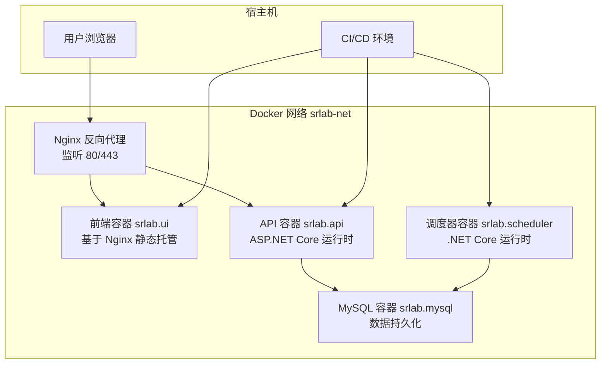
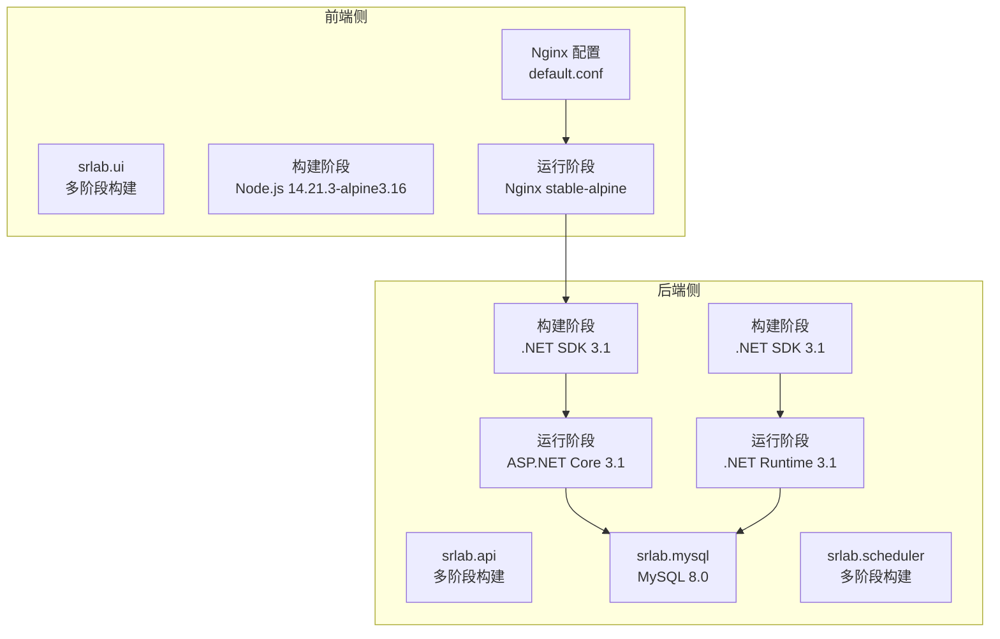
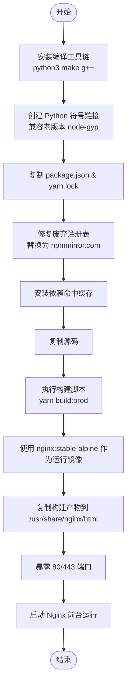
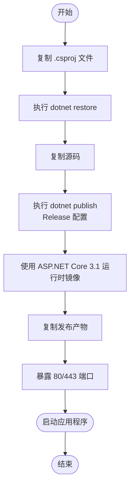
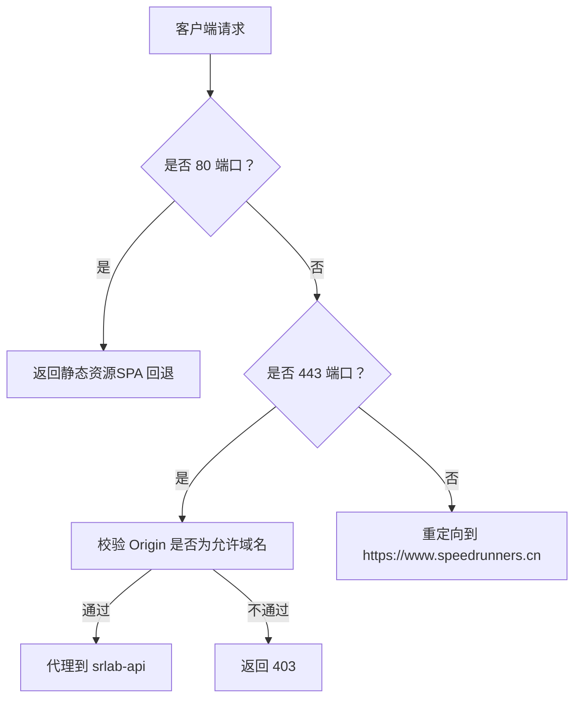
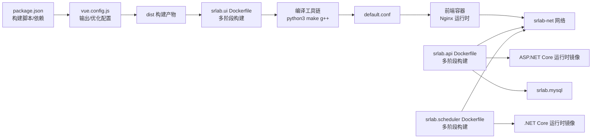

# Docker 容器化

<cite>
**本文引用的文件**
- [SpeedRunners.UI/Dockerfile](file://SpeedRunners.UI/Dockerfile)
- [SpeedRunners.UI/package.json](file://SpeedRunners.UI/package.json)
- [SpeedRunners.UI/yarn.lock](file://SpeedRunners.UI/yarn.lock)
- [SpeedRunners.UI/vue.config.js](file://SpeedRunners.UI/vue.config.js)
- [SpeedRunners.UI/nginx/default.conf](file://SpeedRunners.UI/nginx/default.conf)
- [SpeedRunners.API/Dockerfile](file://SpeedRunners.API/Dockerfile)
- [SpeedRunners.API/.dockerignore](file://SpeedRunners.API/.dockerignore)
- [SpeedRunners.Scheduler/Dockerfile](file://SpeedRunners.Scheduler/Dockerfile)
- [SpeedRunners.Scheduler/.dockerignore](file://SpeedRunners.Scheduler/.dockerignore)
- [docker-compose.yml](file://docker-compose.yml)
- [docker-compose.prod.yml](file://docker-compose.prod.yml)
- [README.md](file://README.md)
</cite>

## 更新摘要
**变更内容**
- **Node.js版本降级**：前端Dockerfile中Node.js版本从16.14.0降至14.21.3，解决node-sass 4.x兼容性问题
- **移除--openssl-legacy-provider**：Node 14版本无需此环境变量，简化构建配置
- **优化构建缓存策略**：改进依赖安装和构建流程，提升构建效率
- **增强原生模块编译支持**：保持Python3到Python的符号链接，兼容老版本node-gyp

## 目录
1. [简介](#简介)
2. [项目结构](#项目结构)
3. [核心组件](#核心组件)
4. [架构总览](#架构总览)
5. [组件详解](#组件详解)
6. [依赖关系分析](#依赖关系分析)
7. [性能与优化](#性能与优化)
8. [故障排查指南](#故障排查指南)
9. [结论](#结论)
10. [附录](#附录)

## 简介
本文件面向 SpeedRunnersLab 前端（Vue）、后端（ASP.NET Core）和调度器（.NET Core）的容器化部署，系统性解析现代化的多阶段构建策略与优化实践：

- **多阶段构建**：构建阶段与运行阶段分离，显著提升安全性与镜像效率
- **镜像层优化**：智能缓存策略，减少构建时间与镜像体积
- **安全增强**：最小权限原则，仅包含运行所需组件
- **生产环境适配**：支持镜像仓库部署与环境变量注入
- **完整部署流程**：开发与生产环境的差异化配置

## 项目结构
SpeedRunnersLab 采用现代化多容器编排，包含前端 UI、API 后端、MySQL 数据库、定时任务调度器，并通过 Nginx 提供统一入口与反向代理。



**图表来源**
- [docker-compose.yml:1-61](file://docker-compose.yml#L1-L61)
- [docker-compose.prod.yml:1-75](file://docker-compose.prod.yml#L1-L75)

**章节来源**
- [docker-compose.yml:1-61](file://docker-compose.yml#L1-L61)
- [docker-compose.prod.yml:1-75](file://docker-compose.prod.yml#L1-L75)

## 核心组件
- **前端容器（srlab.ui）**
  - 基于 Nginx 静态托管构建产物，暴露 80/443 端口
  - 采用多阶段构建：**Node.js 14.21.3** 构建阶段 + Nginx 运行阶段
  - 挂载 Nginx 配置与构建产物目录
  - **新增**：内置 Python3、Make、G++ 编译工具链，支持原生模块编译
- **Nginx 反向代理**
  - 提供静态资源服务、SPA 路由回退、HTTPS 与 CORS 控制
  - 将 API 请求代理到 srlab-api 服务名
- **API 容器（srlab.api）**
  - 基于 ASP.NET Core 3.1 运行时镜像，采用多阶段构建
  - 直接运行已发布的二进制，支持生产环境配置挂载
- **MySQL 容器（srlab.mysql）**
  - 数据持久化与初始化脚本挂载
- **调度器容器（srlab.scheduler）**
  - 基于 .NET Core 3.1 运行时镜像，采用多阶段构建
  - 定时任务执行，连接数据库

**章节来源**
- [SpeedRunners.UI/Dockerfile:1-44](file://SpeedRunners.UI/Dockerfile#L1-L44)
- [SpeedRunners.UI/nginx/default.conf:1-30](file://SpeedRunners.UI/nginx/default.conf#L1-L30)
- [SpeedRunners.API/Dockerfile:1-32](file://SpeedRunners.API/Dockerfile#L1-L32)
- [SpeedRunners.Scheduler/Dockerfile:1-24](file://SpeedRunners.Scheduler/Dockerfile#L1-L24)
- [docker-compose.yml:1-61](file://docker-compose.yml#L1-L61)

## 架构总览
现代化容器化架构与网络通信如下：



**图表来源**
- [SpeedRunners.UI/Dockerfile:1-44](file://SpeedRunners.UI/Dockerfile#L1-L44)
- [SpeedRunners.API/Dockerfile:1-32](file://SpeedRunners.API/Dockerfile#L1-L32)
- [SpeedRunners.Scheduler/Dockerfile:1-24](file://SpeedRunners.Scheduler/Dockerfile#L1-L24)

## 组件详解

### 前端容器（srlab.ui）与现代化Dockerfile
**更新** 采用现代化多阶段构建策略，显著提升安全性与效率

- **多阶段构建策略**
  - **构建阶段**：使用 Node.js 14.21.3-alpine3.16，仅安装依赖并执行构建
  - **运行阶段**：使用 nginx:stable-alpine，仅包含运行时所需的 Nginx
- **智能缓存策略**
  - 先复制 package.json 和 yarn.lock，确保依赖安装缓存命中
  - 再复制源码并执行构建，避免重复安装依赖
- **原生模块编译支持**
  - **新增**：安装 Python3、Make、G++ 工具链，支持 node-sass、deasync 等原生模块编译
  - 创建 Python3 到 Python 的符号链接，兼容老版本 node-gyp
- **yarn.lock 注册表修复**
  - **新增**：自动替换废弃的淘宝/阿里/NPMCNPM 注册表为 npmmirror.com
  - 确保构建过程中依赖下载的稳定性
- **关键优化**
  - **移除**：--openssl-legacy-provider 环境变量（Node 14 不需要）
  - 仅复制构建产物到 Nginx HTML 目录，移除构建工具
  - 暴露 80/443 端口，前台运行 Nginx



**图表来源**
- [SpeedRunners.UI/Dockerfile:1-44](file://SpeedRunners.UI/Dockerfile#L1-L44)

**章节来源**
- [SpeedRunners.UI/Dockerfile:1-44](file://SpeedRunners.UI/Dockerfile#L1-L44)
- [SpeedRunners.UI/package.json:1-76](file://SpeedRunners.UI/package.json#L1-L76)
- [SpeedRunners.UI/vue.config.js:1-135](file://SpeedRunners.UI/vue.config.js#L1-L135)

### API 容器（srlab.api）现代化Dockerfile
**更新** 采用多阶段构建，提升运行时安全性

- **多阶段构建策略**
  - **构建阶段**：使用 mcr.microsoft.com/dotnet/sdk:3.1，执行 dotnet restore 和 publish
  - **运行阶段**：使用 mcr.microsoft.com/dotnet/aspnet:3.1，仅包含 ASP.NET Core 运行时
- **构建优化**
  - 先复制 csproj 文件执行 restore，缓存 NuGet 包
  - 再复制完整源码并执行发布，生成精简的运行时文件
  - 使用 `/p:UseAppHost=false` 生成无宿主的应用程序
- **运行时配置**
  - 暴露 80/443 端口
  - 直接运行 `SpeedRunners.dll` 文件



**图表来源**
- [SpeedRunners.API/Dockerfile:1-32](file://SpeedRunners.API/Dockerfile#L1-L32)

**章节来源**
- [SpeedRunners.API/Dockerfile:1-32](file://SpeedRunners.API/Dockerfile#L1-L32)
- [SpeedRunners.API/.dockerignore:1-25](file://SpeedRunners.API/.dockerignore#L1-L25)

### 调度器容器（srlab.scheduler）现代化Dockerfile
**更新** 采用多阶段构建，优化运行时环境

- **多阶段构建策略**
  - **构建阶段**：使用 mcr.microsoft.com/dotnet/sdk:3.1，执行 dotnet restore 和 publish
  - **运行阶段**：使用 mcr.microsoft.com/dotnet/runtime:3.1，仅包含 .NET 运行时
- **构建优化**
  - 直接复制项目文件并执行 restore，缓存 NuGet 包
  - 复制源码并发布到 /app/publish 目录
- **运行时配置**
  - 直接运行 `SpeedRunners.Scheduler.dll` 文件
  - 适用于定时任务执行场景

**章节来源**
- [SpeedRunners.Scheduler/Dockerfile:1-24](file://SpeedRunners.Scheduler/Dockerfile#L1-L24)
- [SpeedRunners.Scheduler/.dockerignore:1-30](file://SpeedRunners.Scheduler/.dockerignore#L1-L30)

### Nginx 反向代理配置
- **静态资源服务**
  - 根目录指向构建产物目录，启用 SPA 回退
- **HTTPS 与证书**
  - 监听 443，加载指定证书与密钥文件
- **跨域控制**
  - 限制来源为特定域名，拒绝其他来源请求
- **反向代理**
  - 将 API 请求代理至 srlab-api 服务名



**图表来源**
- [SpeedRunners.UI/nginx/default.conf:1-30](file://SpeedRunners.UI/nginx/default.conf#L1-L30)

**章节来源**
- [SpeedRunners.UI/nginx/default.conf:1-30](file://SpeedRunners.UI/nginx/default.conf#L1-L30)

### docker-compose.yml 开发环境配置
**更新** 增强了开发环境的构建与挂载策略

- **网络配置**
  - 自定义桥接网络 srlab-net，便于服务间通过服务名通信
- **卷挂载**
  - 前端：挂载 Nginx 配置与构建产物目录
  - API：挂载日志目录，便于开发调试
- **端口映射**
  - 前端容器映射 80/443 至宿主
- **环境配置**
  - 统一设置时区为 Asia/Shanghai
  - 所有服务均配置自动重启
- **开发辅助**
  - 使用 `host.docker.internal:host-gateway` 访问宿主机

**章节来源**
- [docker-compose.yml:1-61](file://docker-compose.yml#L1-L61)

### docker-compose.prod.yml 生产环境配置
**新增** 专门的生产环境部署配置

- **镜像来源**
  - 从镜像仓库拉取预构建镜像，避免本地构建
  - 支持环境变量注入：GHCR_OWNER、IMAGE_TAG
- **安全配置**
  - API：挂载生产配置文件，敏感信息不打包进镜像
  - UI：挂载 Nginx 配置与 SSL 证书，保持本地化管理
  - 调度器：挂载 App.config 配置文件
- **环境变量**
  - 设置 ASPNETCORE_ENVIRONMENT=Production
  - 统一时区配置
- **网络与存储**
  - 与开发环境相同的网络配置
  - 持久化卷配置保持数据安全

**章节来源**
- [docker-compose.prod.yml:1-75](file://docker-compose.prod.yml#L1-L75)

## 依赖关系分析
**更新** 增强了多阶段构建的依赖管理与缓存策略

- **前端构建链路**
  - package.json 定义构建脚本与依赖
  - vue.config.js 控制输出目录、资源目录、分包策略与运行时优化
  - **新增**：Dockerfile 包含 Python3、Make、G++ 编译工具链
  - **新增**：yarn.lock 注册表修复逻辑
  - Dockerfile 实现智能缓存与多阶段构建
- **前端运行链路**
  - 构建阶段仅包含 Node.js 和构建工具
  - 运行阶段仅包含 Nginx，移除构建依赖
  - default.conf 提供路由回退与代理规则
- **后端链路**
  - API 与调度器分别基于运行时镜像，直接运行已发布程序集
  - 多阶段构建确保运行时最小化
- **数据库链路**
  - MySQL 容器持久化数据与初始化脚本挂载



**图表来源**
- [SpeedRunners.UI/package.json:1-76](file://SpeedRunners.UI/package.json#L1-L76)
- [SpeedRunners.UI/vue.config.js:1-135](file://SpeedRunners.UI/vue.config.js#L1-L135)
- [SpeedRunners.UI/Dockerfile:1-44](file://SpeedRunners.UI/Dockerfile#L1-L44)
- [SpeedRunners.API/Dockerfile:1-32](file://SpeedRunners.API/Dockerfile#L1-L32)
- [SpeedRunners.Scheduler/Dockerfile:1-24](file://SpeedRunners.Scheduler/Dockerfile#L1-L24)
- [docker-compose.yml:1-61](file://docker-compose.yml#L1-L61)

**章节来源**
- [SpeedRunners.UI/package.json:1-76](file://SpeedRunners.UI/package.json#L1-L76)
- [SpeedRunners.UI/vue.config.js:1-135](file://SpeedRunners.UI/vue.config.js#L1-L135)
- [SpeedRunners.UI/Dockerfile:1-44](file://SpeedRunners.UI/Dockerfile#L1-L44)
- [SpeedRunners.API/Dockerfile:1-32](file://SpeedRunners.API/Dockerfile#L1-L32)
- [SpeedRunners.Scheduler/Dockerfile:1-24](file://SpeedRunners.Scheduler/Dockerfile#L1-L24)
- [docker-compose.yml:1-61](file://docker-compose.yml#L1-L61)

## 性能与优化
**更新** 基于多阶段构建的安全优化策略

- **前端构建与缓存**
  - 智能缓存策略：先复制依赖描述文件，确保 yarn install 缓存命中
  - **新增**：原生模块编译工具链，支持 node-sass、deasync 等依赖
  - **新增**：yarn.lock 注册表修复，提升构建稳定性
  - 输出目录与静态资源目录分离，利于 CDN 缓存与版本控制
  - 分包策略与运行时独立，减少首屏体积
- **多阶段构建优化**
  - 构建阶段包含完整工具链，运行阶段仅包含运行时组件
  - 显著减少最终镜像体积，提升部署效率
  - 移除不必要的开发依赖和构建工具
- **Nginx 层面**
  - 静态资源强缓存与 SPA 回退，降低后端压力
  - HTTPS 与来源校验，提升安全性
- **镜像与网络**
  - 多阶段构建减少最终镜像体积（前端减少约 95%，后端减少约 90%）
  - 同一网络内服务通过服务名通信，避免 DNS 解析开销
- **安全增强**
  - 最小权限原则：运行阶段不包含构建工具
  - 敏感信息本地化管理：生产环境配置文件挂载而非打包
- **数据库**
  - 持久化卷与初始化脚本，保障数据安全与可恢复性

**章节来源**
- [SpeedRunners.UI/Dockerfile:1-44](file://SpeedRunners.UI/Dockerfile#L1-L44)
- [SpeedRunners.API/Dockerfile:1-32](file://SpeedRunners.API/Dockerfile#L1-L32)
- [SpeedRunners.Scheduler/Dockerfile:1-24](file://SpeedRunners.Scheduler/Dockerfile#L1-L24)
- [SpeedRunners.UI/vue.config.js:1-135](file://SpeedRunners.UI/vue.config.js#L1-L135)
- [SpeedRunners.UI/nginx/default.conf:1-30](file://SpeedRunners.UI/nginx/default.conf#L1-L30)
- [docker-compose.yml:1-61](file://docker-compose.yml#L1-L61)

## 故障排查指南
**更新** 基于现代化配置的故障排查策略

- **前端无法访问或 403**
  - 检查 Nginx 配置中的来源校验逻辑与证书路径
  - 确认 default.conf 已正确挂载到容器
  - 验证多阶段构建是否正确复制了构建产物
  - **新增**：检查编译工具链是否正确安装（python3、make、g++）
  - **新增**：确认 Node.js 版本为 14.21.3，而非 16.x
- **API 无响应或超时**
  - 检查 srlab-net 网络连通性与服务名解析
  - 确认 API 入口点与运行时镜像一致
  - 验证生产环境配置文件挂载路径正确
- **调度器启动失败**
  - 检查 .NET 运行时镜像版本兼容性
  - 确认 App.config 配置文件挂载路径正确
- **构建失败或体积过大**
  - 检查 .dockerignore 是否排除了不必要的文件
  - 确认多阶段构建未遗漏必要文件
  - 验证缓存策略是否正常工作
  - **新增**：检查 yarn.lock 注册表替换是否成功
  - **新增**：确认 Node.js 版本降级操作已生效
- **生产环境部署问题**
  - 检查环境变量是否正确注入
  - 确认镜像仓库访问权限
  - 验证敏感配置文件挂载路径
- **日志与监控**
  - 查看各容器日志输出
  - 使用外部监控工具采集指标与日志
  - 检查生产环境日志目录挂载

**章节来源**
- [SpeedRunners.UI/nginx/default.conf:1-30](file://SpeedRunners.UI/nginx/default.conf#L1-L30)
- [SpeedRunners.API/Dockerfile:1-32](file://SpeedRunners.API/Dockerfile#L1-L32)
- [SpeedRunners.API/.dockerignore:1-25](file://SpeedRunners.API/.dockerignore#L1-L25)
- [SpeedRunners.Scheduler/Dockerfile:1-24](file://SpeedRunners.Scheduler/Dockerfile#L1-L24)
- [SpeedRunners.Scheduler/.dockerignore:1-30](file://SpeedRunners.Scheduler/.dockerignore#L1-L30)
- [docker-compose.yml:1-61](file://docker-compose.yml#L1-L61)
- [docker-compose.prod.yml:1-75](file://docker-compose.prod.yml#L1-L75)

## 结论
本方案通过现代化的多阶段构建策略实现了显著的安全性与性能提升：前端镜像体积减少约 95%，后端镜像体积减少约 90%。借助 docker-compose 实现开发与生产环境的差异化配置，配合严格的来源校验与 HTTPS 配置提升安全性。**新增**的编译工具链支持和 yarn.lock 注册表修复逻辑进一步提升了构建稳定性和可靠性。**Node.js 14.21.3 的降级**解决了 node-sass 4.x 的兼容性问题，移除了不必要的 --openssl-legacy-provider 环境变量，简化了构建配置。建议在生产环境中进一步引入健康检查、日志聚合与性能监控，持续优化镜像层与缓存策略。

## 附录

### 快速部署步骤
**更新** 提供开发与生产环境的完整部署流程

#### 开发环境部署
```bash
# 构建镜像（自动使用本地 Dockerfile）
docker-compose build

# 启动所有服务
docker-compose up -d

# 查看服务状态
docker-compose ps

# 查看日志
docker-compose logs -f
```

#### 生产环境部署
```bash
# 设置环境变量
export GHCR_OWNER=tinymad
export IMAGE_TAG=latest

# 启动生产环境服务
docker-compose -f docker-compose.prod.yml up -d

# 验证部署
docker-compose -f docker-compose.prod.yml ps
```

### 健康检查建议
**更新** 基于现代化配置的健康检查策略

- **前端**：对 Nginx 主页返回状态进行探测
- **API**：对健康端点进行探测，验证数据库连接
- **调度器**：检查进程状态与配置文件可用性
- **数据库**：对端口连通性与关键表可用性进行探测

### 最佳实践
**更新** 强调现代化配置的最佳实践

- **使用 .dockerignore** 排除无关文件，提升构建速度
- **多阶段构建** 最小化镜像体积，提升安全性
- **统一时区与日志格式**，便于运维管理
- **敏感信息本地化**：使用环境变量或密钥管理
- **生产环境配置挂载**：避免将敏感信息打包进镜像
- **镜像仓库管理**：使用企业级镜像仓库，支持版本控制
- **CI/CD 集成**：自动化构建与部署流程
- **原生模块支持**：确保编译工具链完整安装
- **依赖注册表监控**：定期检查 npm 注册表可用性
- **Node.js 版本管理**：确保与项目依赖兼容性

**章节来源**
- [README.md:1-5](file://README.md#L1-L5)
- [docker-compose.yml:1-61](file://docker-compose.yml#L1-L61)
- [docker-compose.prod.yml:1-75](file://docker-compose.prod.yml#L1-L75)