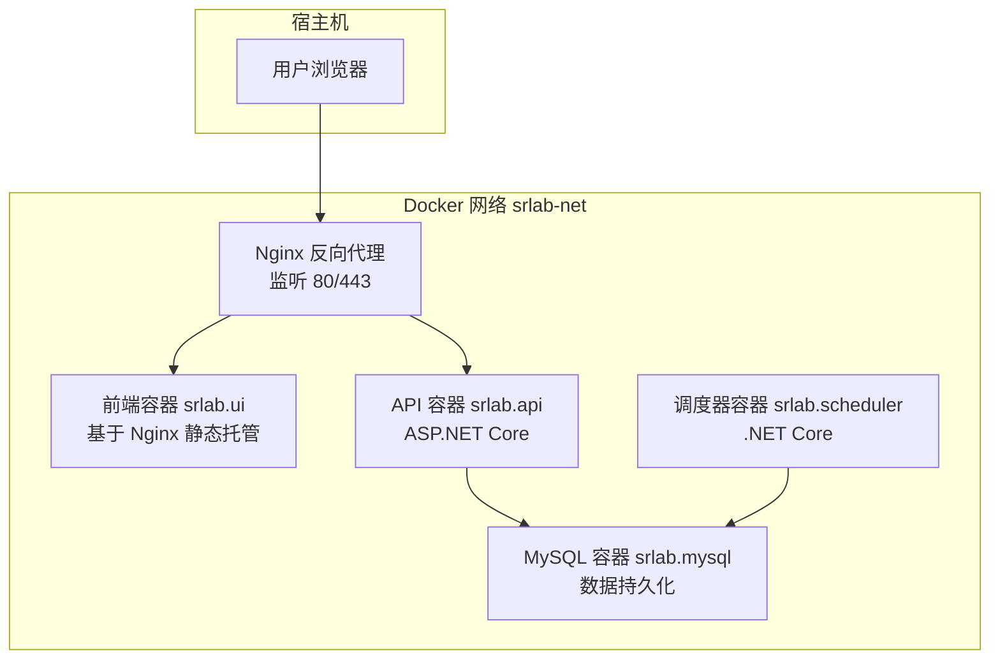
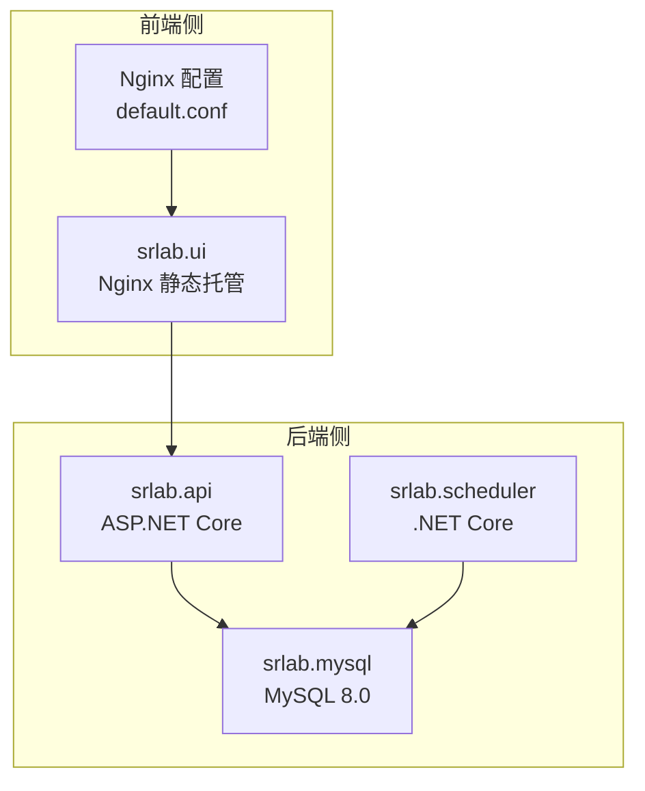
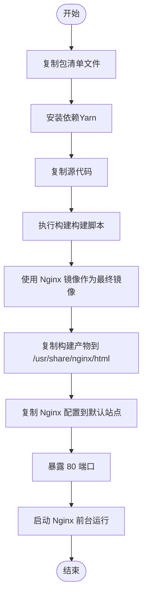
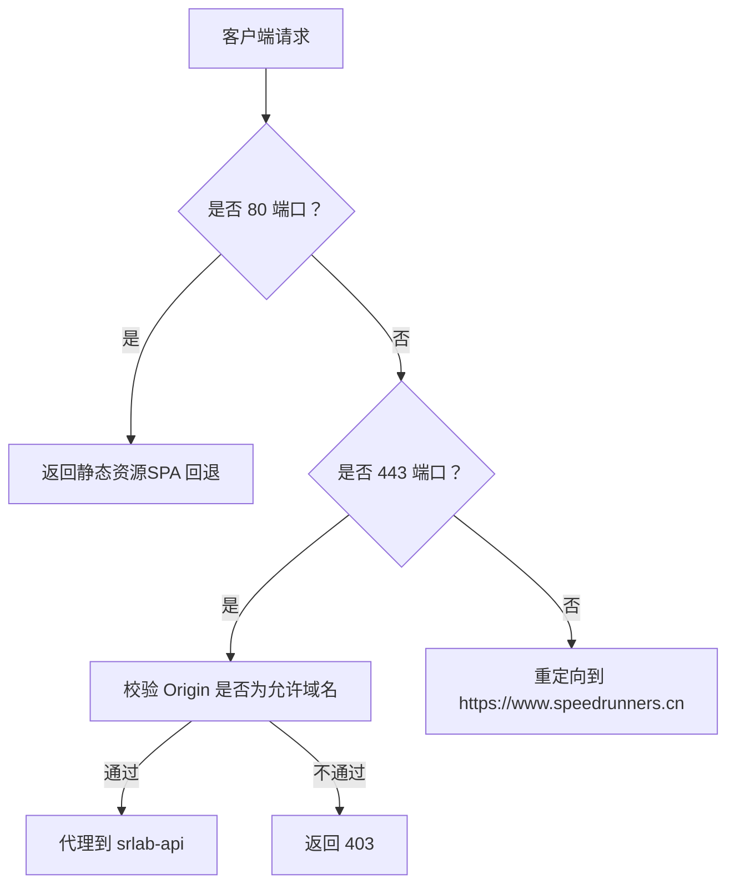
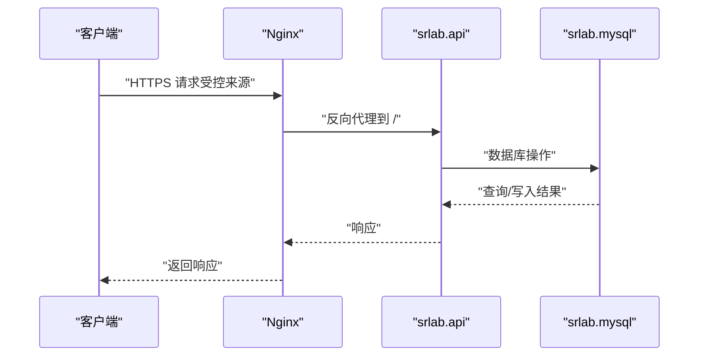
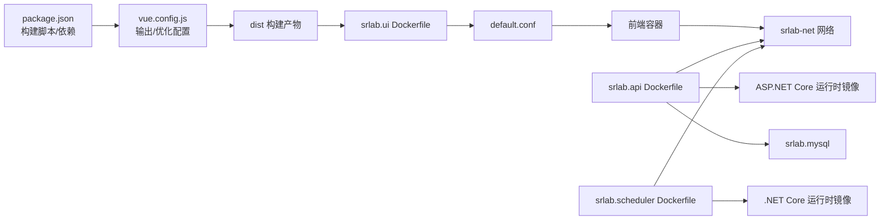

# Docker 容器化

<cite>
**本文引用的文件**
- [SpeedRunners.UI/Dockerfile](file://SpeedRunners.UI/Dockerfile)
- [SpeedRunners.UI/nginx/default.conf](file://SpeedRunners.UI/nginx/default.conf)
- [SpeedRunners.UI/package.json](file://SpeedRunners.UI/package.json)
- [SpeedRunners.UI/vue.config.js](file://SpeedRunners.UI/vue.config.js)
- [SpeedRunners.API/Dockerfile](file://SpeedRunners.API/Dockerfile)
- [SpeedRunners.API/.dockerignore](file://SpeedRunners.API/.dockerignore)
- [SpeedRunners.Scheduler/Dockerfile](file://SpeedRunners.Scheduler/Dockerfile)
- [SpeedRunners.Scheduler/.dockerignore](file://SpeedRunners.Scheduler/.dockerignore)
- [docker-compose.yml](file://docker-compose.yml)
- [README.md](file://README.md)
</cite>

## 目录
1. [简介](#简介)
2. [项目结构](#项目结构)
3. [核心组件](#核心组件)
4. [架构总览](#架构总览)
5. [组件详解](#组件详解)
6. [依赖关系分析](#依赖关系分析)
7. [性能与优化](#性能与优化)
8. [故障排查指南](#故障排查指南)
9. [结论](#结论)
10. [附录](#附录)

## 简介
本文件面向 SpeedRunnersLab 前端（Vue）的容器化部署，系统性解析以下内容：
- Dockerfile 构建步骤与优化策略（多阶段构建、镜像层优化、依赖管理）
- Nginx 反向代理配置（静态资源服务、缓存策略、Gzip 压缩、跨域处理）
- docker-compose.yml 服务编排（前端、Nginx、API、数据库、调度器）
- 完整部署流程（镜像构建、服务启动、健康检查）
- 运维实践（监控、日志、性能调优）
- 故障排查与最佳实践

## 项目结构
SpeedRunnersLab 采用多容器编排，包含前端 UI、API 后端、MySQL 数据库、定时任务调度器，并通过 Nginx 提供统一入口与反向代理。

图表来源
- [docker-compose.yml](file://docker-compose.yml#L1-L59)

章节来源
- [docker-compose.yml](file://docker-compose.yml#L1-L59)

## 核心组件
- 前端容器（srlab.ui）
  - 基于 Nginx 静态托管构建产物，暴露 80/443 端口
  - 挂载 Nginx 配置与构建产物目录
- Nginx 反向代理
  - 提供静态资源服务、SPA 路由回退、HTTPS 与 CORS 控制
  - 将 API 请求代理到 srlab-api
- API 容器（srlab.api）
  - 托管 ASP.NET Core 应用，使用已发布的二进制
- MySQL 容器（srlab.mysql）
  - 数据持久化与初始化脚本挂载
- 调度器容器（srlab.scheduler）
  - 定时任务执行，连接数据库

章节来源
- [SpeedRunners.UI/Dockerfile](file://SpeedRunners.UI/Dockerfile#L1-L22)
- [SpeedRunners.UI/nginx/default.conf](file://SpeedRunners.UI/nginx/default.conf#L1-L30)
- [SpeedRunners.API/Dockerfile](file://SpeedRunners.API/Dockerfile#L1-L27)
- [docker-compose.yml](file://docker-compose.yml#L1-L59)

## 架构总览
前端与 API 的容器化与网络通信如下：

图表来源
- [docker-compose.yml](file://docker-compose.yml#L1-L59)
- [SpeedRunners.UI/nginx/default.conf](file://SpeedRunners.UI/nginx/default.conf#L1-L30)

## 组件详解

### 前端容器（srlab.ui）与 Dockerfile
- 多阶段构建策略
  - 构建阶段：使用 Node 基础镜像进行依赖安装与打包
  - 生产阶段：使用 Nginx 镜像，仅复制构建产物与 Nginx 配置
- 关键步骤
  - 复制构建产物至 Nginx HTML 目录
  - 复制 Nginx 配置文件至默认站点配置路径
  - 暴露 80 端口，前台运行 Nginx
- 依赖与构建命令
  - 使用 Yarn 安装依赖
  - 使用 Vue CLI 执行构建（生产或预发模式）

图表来源
- [SpeedRunners.UI/Dockerfile](file://SpeedRunners.UI/Dockerfile#L1-L22)

章节来源
- [SpeedRunners.UI/Dockerfile](file://SpeedRunners.UI/Dockerfile#L1-L22)
- [SpeedRunners.UI/package.json](file://SpeedRunners.UI/package.json#L1-L76)
- [SpeedRunners.UI/vue.config.js](file://SpeedRunners.UI/vue.config.js#L1-L129)

### Nginx 反向代理配置
- 静态资源服务
  - 根目录指向构建产物目录，启用 SPA 回退
- HTTPS 与证书
  - 监听 443，加载指定证书与密钥文件
- 跨域控制
  - 限制来源为特定域名，拒绝其他来源请求
- 反向代理
  - 将 API 请求代理至 srlab-api 服务名

图表来源
- [SpeedRunners.UI/nginx/default.conf](file://SpeedRunners.UI/nginx/default.conf#L1-L30)

章节来源
- [SpeedRunners.UI/nginx/default.conf](file://SpeedRunners.UI/nginx/default.conf#L1-L30)

### API 容器（srlab.api）
- 基于 ASP.NET Core 3.1 运行时镜像
- 直接复制已发布的二进制并以入口点启动应用
- 通过网络访问 MySQL 数据库

图表来源
- [docker-compose.yml](file://docker-compose.yml#L1-L59)
- [SpeedRunners.API/Dockerfile](file://SpeedRunners.API/Dockerfile#L1-L27)

章节来源
- [SpeedRunners.API/Dockerfile](file://SpeedRunners.API/Dockerfile#L1-L27)
- [docker-compose.yml](file://docker-compose.yml#L1-L59)

### 调度器容器（srlab.scheduler）
- 基于 .NET Core 3.1 运行时镜像
- 直接复制运行时产物并以入口点启动
- 与 MySQL 容器同网段通信

章节来源
- [SpeedRunners.Scheduler/Dockerfile](file://SpeedRunners.Scheduler/Dockerfile#L1-L23)
- [docker-compose.yml](file://docker-compose.yml#L1-L59)

### docker-compose.yml 服务编排
- 网络
  - 自定义桥接网络 srlab-net，便于服务间通过服务名通信
- 卷挂载
  - 前端 Nginx 配置与构建产物目录挂载
- 端口映射
  - 前端容器映射 80/443 至宿主
- 环境与重启策略
  - 统一设置时区，所有服务均配置自动重启
- 服务依赖
  - API 与调度器通过 extra_hosts 访问宿主机内部地址（开发场景）

章节来源
- [docker-compose.yml](file://docker-compose.yml#L1-L59)

## 依赖关系分析
- 前端构建链路
  - package.json 定义构建脚本与依赖
  - vue.config.js 控制输出目录、资源目录、分包策略与运行时优化
- 前端运行链路
  - Dockerfile 将构建产物复制到 Nginx 静态目录
  - default.conf 提供路由回退与代理规则
- 后端链路
  - API 与调度器分别基于运行时镜像，直接运行已发布程序集
- 数据库链路
  - MySQL 容器持久化数据与初始化脚本挂载

图表来源
- [SpeedRunners.UI/package.json](file://SpeedRunners.UI/package.json#L1-L76)
- [SpeedRunners.UI/vue.config.js](file://SpeedRunners.UI/vue.config.js#L1-L129)
- [SpeedRunners.UI/Dockerfile](file://SpeedRunners.UI/Dockerfile#L1-L22)
- [SpeedRunners.API/Dockerfile](file://SpeedRunners.API/Dockerfile#L1-L27)
- [SpeedRunners.Scheduler/Dockerfile](file://SpeedRunners.Scheduler/Dockerfile#L1-L23)
- [docker-compose.yml](file://docker-compose.yml#L1-L59)

章节来源
- [SpeedRunners.UI/package.json](file://SpeedRunners.UI/package.json#L1-L76)
- [SpeedRunners.UI/vue.config.js](file://SpeedRunners.UI/vue.config.js#L1-L129)
- [SpeedRunners.UI/Dockerfile](file://SpeedRunners.UI/Dockerfile#L1-L22)
- [SpeedRunners.API/Dockerfile](file://SpeedRunners.API/Dockerfile#L1-L27)
- [SpeedRunners.Scheduler/Dockerfile](file://SpeedRunners.Scheduler/Dockerfile#L1-L23)
- [docker-compose.yml](file://docker-compose.yml#L1-L59)

## 性能与优化
- 前端构建与缓存
  - 输出目录与静态资源目录分离，利于 CDN 缓存与版本控制
  - 分包策略与运行时独立，减少首屏体积
- Nginx 层面
  - 静态资源强缓存与 SPA 回退，降低后端压力
  - HTTPS 与来源校验，提升安全性
- 镜像与网络
  - 多阶段构建减少最终镜像体积
  - 同一网络内服务通过服务名通信，避免 DNS 解析开销
- 数据库
  - 持久化卷与初始化脚本，保障数据安全与可恢复性

章节来源
- [SpeedRunners.UI/vue.config.js](file://SpeedRunners.UI/vue.config.js#L1-L129)
- [SpeedRunners.UI/nginx/default.conf](file://SpeedRunners.UI/nginx/default.conf#L1-L30)
- [SpeedRunners.UI/Dockerfile](file://SpeedRunners.UI/Dockerfile#L1-L22)
- [docker-compose.yml](file://docker-compose.yml#L1-L59)

## 故障排查指南
- 前端无法访问或 403
  - 检查 Nginx 配置中的来源校验逻辑与证书路径
  - 确认 default.conf 已正确挂载到容器
- API 无响应或超时
  - 检查 srlab-net 网络连通性与服务名解析
  - 确认 API 入口点与运行时镜像一致
- 数据库连接失败
  - 检查 MySQL 端口映射与凭据
  - 确认初始化脚本已成功导入
- 构建失败或体积过大
  - 检查 .dockerignore 是否排除了不必要的文件
  - 确认多阶段构建未遗漏必要文件
- 日志与监控
  - 查看各容器日志输出
  - 使用外部监控工具采集指标与日志

章节来源
- [SpeedRunners.UI/nginx/default.conf](file://SpeedRunners.UI/nginx/default.conf#L1-L30)
- [SpeedRunners.API/Dockerfile](file://SpeedRunners.API/Dockerfile#L1-L27)
- [SpeedRunners.API/.dockerignore](file://SpeedRunners.API/.dockerignore#L1-L25)
- [SpeedRunners.Scheduler/.dockerignore](file://SpeedRunners.Scheduler/.dockerignore#L1-L30)
- [docker-compose.yml](file://docker-compose.yml#L1-L59)

## 结论
本方案通过多阶段构建与 Nginx 静态托管实现前端高效交付；借助 docker-compose 实现前后端与数据库的一体化编排；配合严格的来源校验与 HTTPS 配置提升安全性。建议在生产环境中进一步引入健康检查、日志聚合与性能监控，持续优化镜像层与缓存策略。

## 附录
- 快速部署步骤（示例）
  - 构建镜像：在项目根目录执行容器编排构建
  - 启动服务：启动编排中定义的所有服务
  - 访问入口：通过 80/443 端口访问前端页面，API 通过反向代理转发
- 健康检查建议
  - 前端：对 Nginx 主页返回状态进行探测
  - API：对健康端点进行探测
  - 数据库：对端口连通性与关键表可用性进行探测
- 最佳实践
  - 使用 .dockerignore 排除无关文件
  - 多阶段构建最小化镜像体积
  - 统一时区与日志格式
  - 对敏感信息使用环境变量或密钥管理

章节来源
- [README.md](file://README.md#L1-L5)
- [docker-compose.yml](file://docker-compose.yml#L1-L59)