# 前端构建配置

<cite>
**本文引用的文件**
- [vue.config.js](file://SpeedRunners.UI/vue.config.js)
- [package.json](file://SpeedRunners.UI/package.json)
- [babel.config.js](file://SpeedRunners.UI/babel.config.js)
- [postcss.config.js](file://SpeedRunners.UI/postcss.config.js)
- [.env.development](file://SpeedRunners.UI/.env.development)
- [.env.production](file://SpeedRunners.UI/.env.production)
- [settings.js](file://SpeedRunners.UI/src/settings.js)
- [main.js](file://SpeedRunners.UI/src/main.js)
- [jsconfig.json](file://SpeedRunners.UI/jsconfig.json)
- [index.js（图标入口）](file://SpeedRunners.UI/src/icons/index.js)
- [svgo.yml（图标优化配置）](file://SpeedRunners.UI/src/icons/svgo.yml)
- [index.js（预览脚本）](file://SpeedRunners.UI/build/index.js)
- [version-create.js（版本创建）](file://SpeedRunners.UI/build/version-create.js)
- [index.scss（全局样式）](file://SpeedRunners.UI/src/styles/index.scss)
- [SvgIcon 组件](file://SpeedRunners.UI/src/components/SvgIcon/index.vue)
- [version.js（版本检查）](file://SpeedRunners.UI/src/utils/version.js)
- [verify.json（版本文件）](file://SpeedRunners.UI/public/verify.json)
</cite>

## 更新摘要
**变更内容**
- 新增版本管理系统重构章节，详细介绍从 src/utils/version.js 迁移到 build/version-create.js 的架构变更
- 新增 Babel 配置增强章节，说明 sourceType: 'unambiguous' 的作用和优势
- 更新内容哈希配置章节，强调条件性内容哈希在生产环境的优化效果
- 更新版本检查系统集成章节，展示重构后的版本管理流程
- 更新性能考量章节，增加新配置对构建性能的影响分析

## 目录
1. [简介](#简介)
2. [项目结构](#项目结构)
3. [核心组件](#核心组件)
4. [架构总览](#架构总览)
5. [详细组件分析](#详细组件分析)
6. [依赖关系分析](#依赖关系分析)
7. [性能考量](#性能考量)
8. [故障排查指南](#故障排查指南)
9. [结论](#结论)
10. [附录](#附录)

## 简介
本文件系统性梳理 SpeedRunners.UI 前端构建配置，围绕 vue.config.js 的完整配置项进行深度解析，涵盖 configureWebpack 与 chainWebpack 的自定义策略、路径别名、externals 外部依赖、SVG 图标处理、Vue 编译器选项、开发/生产环境差异、Babel 与 PostCSS 配置、以及构建优化最佳实践与常见问题排查。

**更新** 本次更新重点反映了构建配置的增强：版本管理系统重构（新增 build/version-create.js）、Babel 配置增强（sourceType: 'unambiguous'）、内容哈希配置优化，为生产环境提供了更完善的缓存管理和版本控制机制。

## 项目结构
SpeedRunners.UI 采用 Vue CLI 3.x 生成的模板工程，构建相关的关键文件集中在根目录：
- 构建配置：vue.config.js
- 依赖与脚本：package.json
- 转译与样式：babel.config.js、postcss.config.js
- 环境变量：.env.development、.env.production
- 源码别名：jsconfig.json、settings.js
- 图标体系：src/icons、SvgIcon 组件
- 预览脚本：build/index.js
- **版本管理系统**：build/version-create.js、src/utils/version.js、public/verify.json

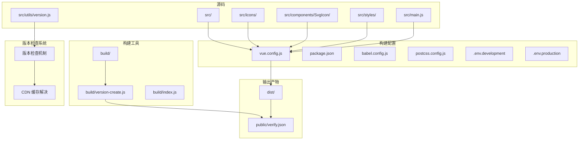

**图表来源**
- [vue.config.js](file://SpeedRunners.UI/vue.config.js#L23-L135)
- [package.json](file://SpeedRunners.UI/package.json#L1-L76)
- [babel.config.js](file://SpeedRunners.UI/babel.config.js#L1-L7)
- [postcss.config.js](file://SpeedRunners.UI/postcss.config.js#L1-L9)
- [.env.development](file://SpeedRunners.UI/.env.development#L1-L15)
- [.env.production](file://SpeedRunners.UI/.env.production#L1-L7)
- [version.js](file://SpeedRunners.UI/src/utils/version.js#L1-L195)
- [version-create.js](file://SpeedRunners.UI/build/version-create.js#L1-L26)
- [verify.json](file://SpeedRunners.UI/public/verify.json#L1-L1)

**章节来源**
- [vue.config.js](file://SpeedRunners.UI/vue.config.js#L1-L135)
- [package.json](file://SpeedRunners.UI/package.json#L1-L76)

## 核心组件
本节聚焦 vue.config.js 中的关键配置项及其作用域。

- configureWebpack
  - externals：将 jquery 暴露为全局 jQuery，避免打包进业务代码，减少体积并复用外部库。
  - resolve.alias：配置 @ 指向 src，提升导入可读性与维护性。
  - name：注入应用标题到 webpack 名称，便于在 HTML 注入时使用。
  - plugins：集成进度条插件，改善构建体验。
  
- chainWebpack
  - 删除 preload/prefetch 插件，避免对首屏无意义的预加载。
  - **内容哈希配置**：仅在生产环境启用 contenthash，解决 CDN 缓存问题，确保资源更新时能够正确失效。
  - 自定义 svg-sprite-loader 规则：排除默认 svg 处理，专门处理 src/icons 下的 SVG，并以 sprite 方式引入，统一管理图标。
  - 设置 preserveWhitespace：通过 vue-loader 的 compilerOptions 将空白符保留策略设为 true，便于调试与排版。
  - 开发环境 devtool：使用 cheap-source-map 提升调试效率。
  - 生产环境优化：
    - script-ext-html-webpack-plugin：将 runtime.*.js 内联至 HTML，降低额外请求。
    - splitChunks：按 cacheGroups 将第三方依赖与公共组件拆分，提升缓存命中率。
    - runtimeChunk：生成独立运行时文件，利于长期缓存。
  - transpileDependencies：显式转译 vuetify，确保兼容旧浏览器。

- 其他通用配置
  - publicPath：部署路径前缀，默认 "/"。
  - outputDir/assetsDir：输出目录与静态资源目录。
  - lintOnSave：仅开发环境开启保存时校验。
  - productionSourceMap：关闭生产环境 SourceMap，减小包体。
  - devServer：端口、错误覆盖显示等。
  - 环境变量：通过 .env.* 注入 VUE_APP_* 变量，区分开发/生产 API 地址。

**章节来源**
- [vue.config.js](file://SpeedRunners.UI/vue.config.js#L23-L135)
- [.env.development](file://SpeedRunners.UI/.env.development#L1-L15)
- [.env.production](file://SpeedRunners.UI/.env.production#L1-L7)

## 架构总览
下图展示从源码到构建产物的整体流程，以及关键配置点如何影响打包结果。

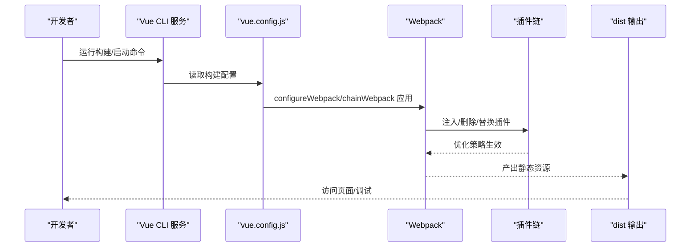

**图表来源**
- [vue.config.js](file://SpeedRunners.UI/vue.config.js#L23-L135)
- [package.json](file://SpeedRunners.UI/package.json#L6-L14)

## 详细组件分析

### 路径别名与源码别名
- Webpack 别名：configureWebpack.resolve.alias 将 @ 映射到 src，简化导入路径。
- JS 编辑器别名：jsconfig.json 同步 baseUrl 与 paths，保证 IDE 智能提示与跳转一致。
- 标题注入：configureWebpack.name 从 settings.js 读取 title，用于 HTML 注入。

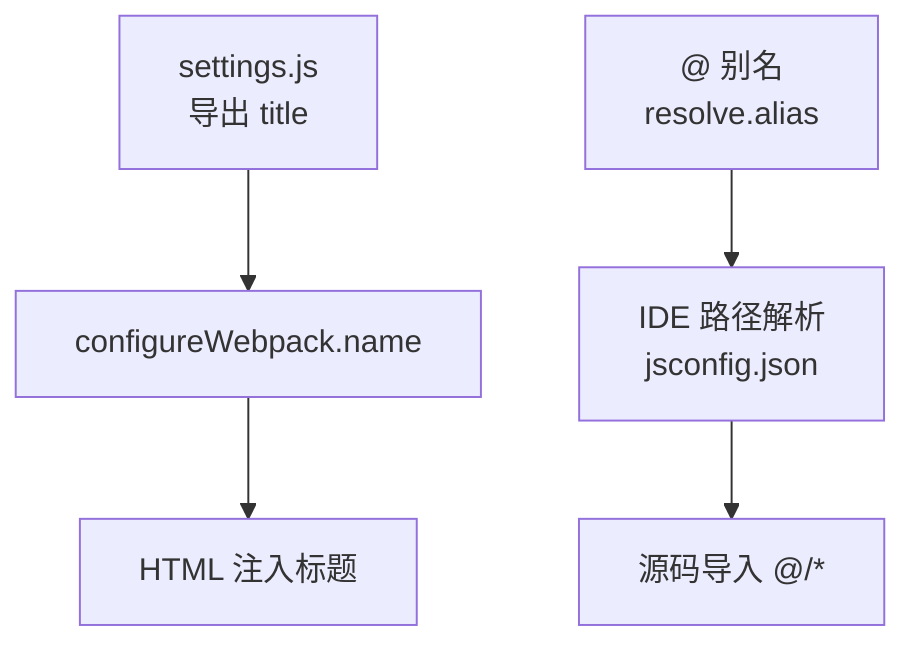

**图表来源**
- [vue.config.js](file://SpeedRunners.UI/vue.config.js#L13-L36)
- [settings.js](file://SpeedRunners.UI/src/settings.js#L1-L16)
- [jsconfig.json](file://SpeedRunners.UI/jsconfig.json#L1-L10)

**章节来源**
- [vue.config.js](file://SpeedRunners.UI/vue.config.js#L13-L36)
- [jsconfig.json](file://SpeedRunners.UI/jsconfig.json#L1-L10)
- [settings.js](file://SpeedRunners.UI/src/settings.js#L1-L16)

### 外部依赖 externals
- 将 jquery 暴露为全局 jQuery，避免重复打包，减小 bundle 体积。
- 适用于 CDN 引入或站点已有库场景。

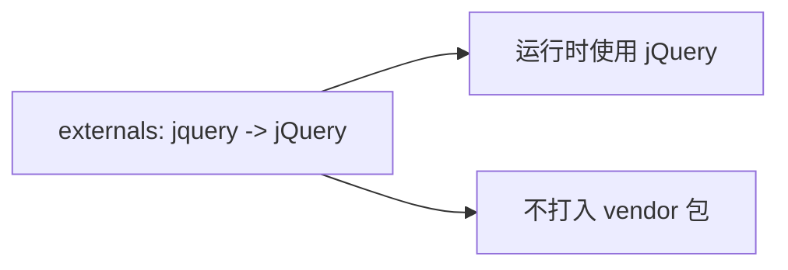

**图表来源**
- [vue.config.js](file://SpeedRunners.UI/vue.config.js#L24-L27)

**章节来源**
- [vue.config.js](file://SpeedRunners.UI/vue.config.js#L24-L27)

### 内容哈希配置与 CDN 缓存解决
**更新** 为了解决 CDN 缓存导致的资源更新问题，配置系统在生产环境中启用了内容哈希（contenthash）。

- **配置实现**：在 chainWebpack 中通过 `config.when(process.env.NODE_ENV !== "development")` 条件判断，仅在生产环境启用内容哈希。
- **文件命名规则**：使用 `[contenthash:8]` 生成 8 位内容哈希，确保文件内容变化时文件名随之变化。
- **缓存策略**：通过文件名的唯一性，确保 CDN 能够正确识别资源更新并失效缓存。
- **性能影响**：内容哈希相比传统哈希更精确，只有当文件内容真正改变时才会更新文件名，有利于长期缓存。

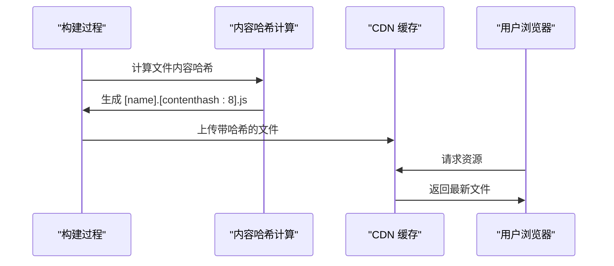

**图表来源**
- [vue.config.js](file://SpeedRunners.UI/vue.config.js#L62-L66)

**章节来源**
- [vue.config.js](file://SpeedRunners.UI/vue.config.js#L62-L66)

### SVG 图标处理
- 排除默认 svg 规则，专门针对 src/icons 下的 SVG 使用 svg-sprite-loader。
- 通过 SvgIcon 组件统一渲染，支持 Material Design Icons 与本地 SVG。
- SVGO 优化：移除 fill、fill-rule 等属性，使图标颜色可由 CSS 控制。

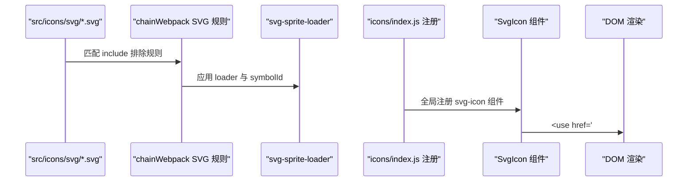

**图表来源**
- [vue.config.js](file://SpeedRunners.UI/vue.config.js#L68-L83)
- [index.js（图标入口）](file://SpeedRunners.UI/src/icons/index.js#L1-L9)
- [SvgIcon 组件](file://SpeedRunners.UI/src/components/SvgIcon/index.vue#L1-L66)
- [svgo.yml（图标优化配置）](file://SpeedRunners.UI/src/icons/svgo.yml#L1-L23)

**章节来源**
- [vue.config.js](file://SpeedRunners.UI/vue.config.js#L68-L83)
- [index.js（图标入口）](file://SpeedRunners.UI/src/icons/index.js#L1-L9)
- [SvgIcon 组件](file://SpeedRunners.UI/src/components/SvgIcon/index.vue#L1-L66)
- [svgo.yml（图标优化配置）](file://SpeedRunners.UI/src/icons/svgo.yml#L1-L23)

### Vue 编译器选项
- 通过 vue-loader 的 compilerOptions.preserveWhitespace = true，保留模板中的空白字符，便于调试与布局排版。

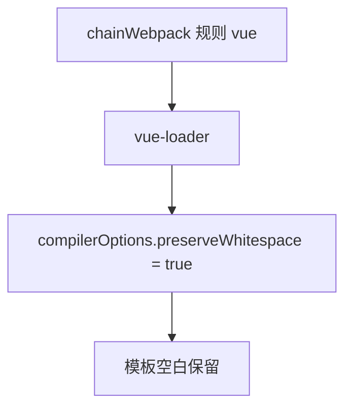

**图表来源**
- [vue.config.js](file://SpeedRunners.UI/vue.config.js#L85-L94)

**章节来源**
- [vue.config.js](file://SpeedRunners.UI/vue.config.js#L85-L94)

### 开发与生产环境差异化策略
- 开发环境
  - devServer.port：默认 9528，可传参覆盖。
  - overlay：仅显示错误，避免干扰。
  - devtool：cheap-source-map，平衡调试与性能。
  - lintOnSave：开启保存时 ESLint 校验。
- 生产环境
  - 关闭 productionSourceMap，减小包体。
  - **内容哈希配置**：启用 contenthash 解决 CDN 缓存问题。
  - script-ext-html-webpack-plugin：内联 runtime.*.js，减少请求数。
  - splitChunks：按 cacheGroups 拆分第三方与公共组件，提升缓存命中。
  - runtimeChunk：单 runtime 文件，利于长效缓存。
  - publicPath：默认 "/"，如需子路径部署可调整。

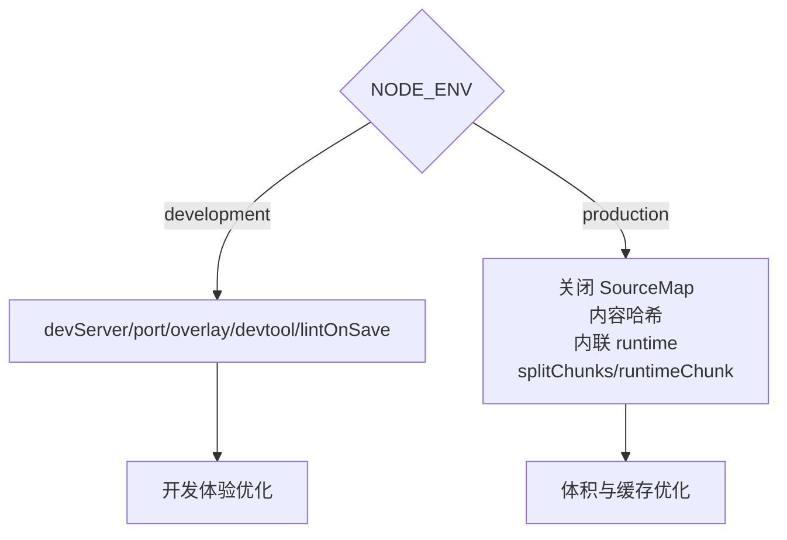

**图表来源**
- [vue.config.js](file://SpeedRunners.UI/vue.config.js#L50-L135)
- [.env.development](file://SpeedRunners.UI/.env.development#L1-L15)
- [.env.production](file://SpeedRunners.UI/.env.production#L1-L7)

**章节来源**
- [vue.config.js](file://SpeedRunners.UI/vue.config.js#L50-L135)
- [.env.development](file://SpeedRunners.UI/.env.development#L1-L15)
- [.env.production](file://SpeedRunners.UI/.env.production#L1-L7)

### 版本管理系统重构
**新增功能** 系统进行了版本管理系统的架构重构，将构建时的版本文件创建逻辑从 src/utils/version.js 迁移到独立的 build/version-create.js 文件。

- **重构原因**：将 Node.js 环境下的构建工具与浏览器端的版本检查逻辑分离，提高模块职责清晰度。
- **构建时创建**：在 vue.config.js 中通过 `require("./build/version-create")` 动态导入，构建时自动生成版本文件。
- **版本文件格式**：public/verify.json 包含当前时间戳作为版本号，格式为 `{"version": timestamp}`。
- **防缓存机制**：版本检查系统在请求版本文件时添加时间戳参数 `_t=timestamp`，强制绕过 CDN 缓存。
- **自动更新**：检测到新版本后，系统会延迟自动刷新页面，确保用户获取最新资源。

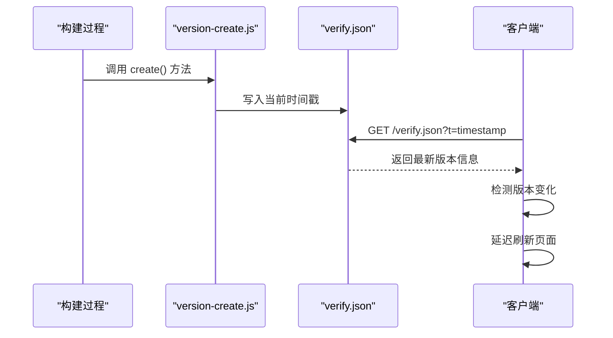

**图表来源**
- [vue.config.js](file://SpeedRunners.UI/vue.config.js#L6-L7)
- [version-create.js](file://SpeedRunners.UI/build/version-create.js#L11-L23)
- [verify.json](file://SpeedRunners.UI/public/verify.json#L1-L1)

**章节来源**
- [vue.config.js](file://SpeedRunners.UI/vue.config.js#L6-L7)
- [version-create.js](file://SpeedRunners.UI/build/version-create.js#L1-L26)
- [verify.json](file://SpeedRunners.UI/public/verify.json#L1-L1)

### Babel 配置增强
**新增功能** Babel 配置增强了对不同模块类型的支持，通过 `sourceType: 'unambiguous'` 配置提供更好的模块解析能力。

- **配置位置**：babel.config.js 中的第5行，`sourceType: 'unambiguous'`
- **作用机制**：让 Babel 自动推断模块类型（CommonJS、AMD、UMD、ES6+），无需手动指定。
- **优势**：
  - 提高模块解析的准确性
  - 减少配置复杂度
  - 支持更多模块格式
  - 与现代构建工具更好地协作
- **兼容性**：确保与 Vue CLI 3.x 和 Webpack 4+ 的兼容性。

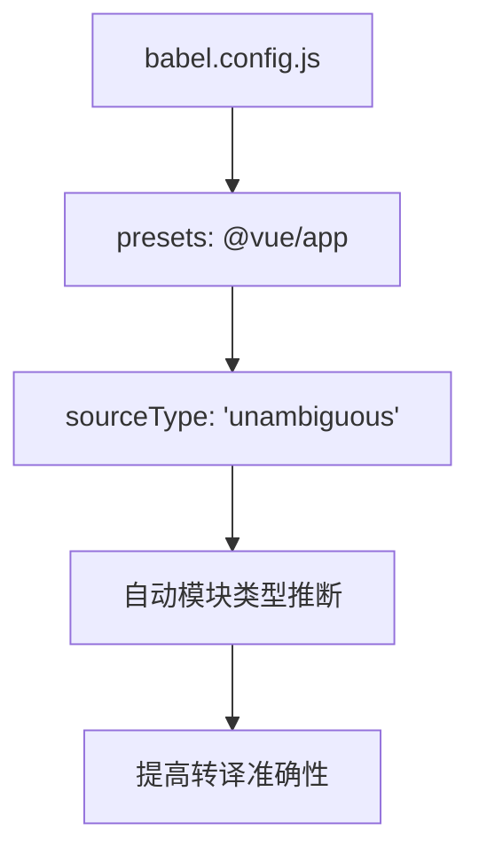

**图表来源**
- [babel.config.js](file://SpeedRunners.UI/babel.config.js#L1-L7)

**章节来源**
- [babel.config.js](file://SpeedRunners.UI/babel.config.js#L1-L7)

### 预览与构建脚本
- 预览脚本：build/index.js 支持 --preview 参数，先执行构建，再本地起静态服务器预览 dist。
- package.json scripts：提供 dev、build:prod、build:stage、preview 等常用命令。

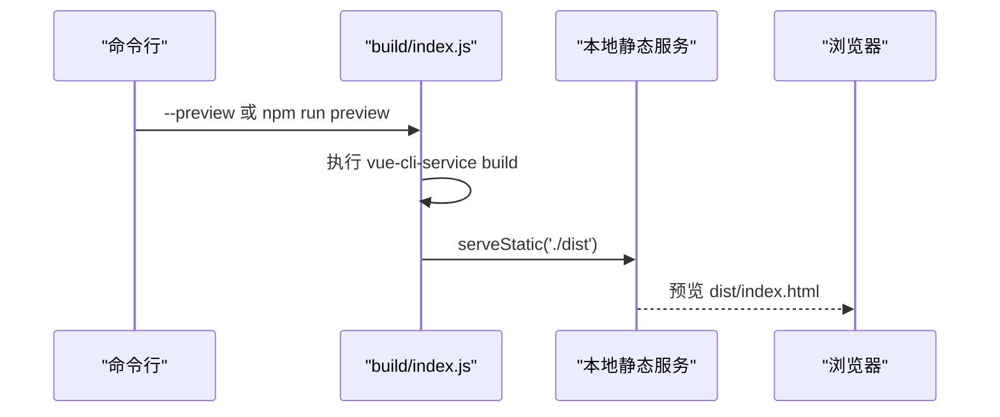

**图表来源**
- [index.js（预览脚本）](file://SpeedRunners.UI/build/index.js#L1-L36)
- [package.json](file://SpeedRunners.UI/package.json#L6-L14)

**章节来源**
- [index.js（预览脚本）](file://SpeedRunners.UI/build/index.js#L1-L36)
- [package.json](file://SpeedRunners.UI/package.json#L6-L14)

## 依赖关系分析
- 构建期依赖
  - @vue/cli-service、@vue/cli-plugin-*：提供 Vue CLI 能力与插件生态。
  - svg-sprite-loader、vuetify-loader：分别负责 SVG 图标与 Vuetify 的按需处理。
  - autoprefixer、@mdi/font：样式兼容与图标字体。
  - **版本检查依赖**：nyan-progress-webpack-plugin、script-ext-html-webpack-plugin 等。
  - **构建工具依赖**：fs、path（Node.js 核心模块）用于版本文件创建。
- 运行期依赖
  - vue、vue-router、vuex、vuetify、axios 等：业务功能基础。
  - **版本检查模块**：src/utils/version.js 提供客户端版本检查功能。
- 开发期依赖
  - eslint、jest、svgo 等：质量与工具链保障。

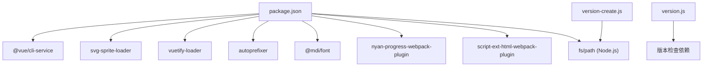

**图表来源**
- [package.json](file://SpeedRunners.UI/package.json#L15-L76)
- [version-create.js](file://SpeedRunners.UI/build/version-create.js#L2-L3)
- [version.js](file://SpeedRunners.UI/src/utils/version.js#L1-L195)

**章节来源**
- [package.json](file://SpeedRunners.UI/package.json#L15-L76)

## 性能考量
- 代码分割
  - splitChunks.cacheGroups：将 node_modules 与 src/components 拆分为独立 chunk，提升缓存命中与并行加载能力。
- 运行时优化
  - runtimeChunk("single")：独立运行时，利于长效缓存。
  - script-ext-html-webpack-plugin 内联 runtime，减少请求数。
- **内容哈希优化**
  - **CDN 缓存解决**：生产环境启用 contenthash，确保资源更新时文件名变化，避免 CDN 缓存问题。
  - **精确缓存控制**：内容哈希只在文件内容变化时更新，有利于长期缓存策略。
- **Babel 转译优化**
  - **模块类型自动推断**：sourceType: 'unambiguous' 提高转译准确性，减少不必要的转译步骤。
  - **按需降级策略**：@vue/app preset 与 browserslist 协同，按需降级，避免过度转译。
- 资源与体积
  - 关闭生产环境 SourceMap，减小包体。
  - SVGO 移除冗余属性，保持图标可由 CSS 控制颜色，降低 CSS 体积。
- 图标体系
  - svg-sprite-loader 将多图标合并为精灵，减少 HTTP 请求；SvgIcon 组件统一渲染，便于按需使用。

**章节来源**
- [vue.config.js](file://SpeedRunners.UI/vue.config.js#L96-L135)
- [babel.config.js](file://SpeedRunners.UI/babel.config.js#L1-L7)
- [package.json](file://SpeedRunners.UI/package.json#L66-L69)

## 故障排查指南
- 构建失败或找不到模块
  - 确认 @ 别名是否正确映射到 src，IDE 与 Webpack 需要保持一致。
  - 检查 jsconfig.json 与 vue.config.js 的 alias 是否冲突。
- 图标不显示或样式异常
  - 确认 src/icons 下的 SVG 已被 svg-sprite-loader 正确处理。
  - 检查 SvgIcon 组件是否正确注册，且使用 #icon-xxx 形式的 href。
  - 若图标颜色固定，检查 SVGO 配置是否移除了 fill 属性。
- 开发/生产环境差异
  - 确认 .env.development/.env.production 的 VUE_APP_BASE_API 是否正确注入。
  - 生产环境若出现白屏或资源 404，检查 publicPath 与部署路径是否匹配。
- **CDN 缓存问题**
  - **内容哈希验证**：检查生产环境是否正确生成带 contenthash 的文件名。
  - **版本文件检查**：确认 public/verify.json 是否存在且包含有效的时间戳。
  - **缓存穿透测试**：验证版本检查系统是否正确添加时间戳参数。
- **版本检查相关问题**
  - **版本文件访问**：确认 verify.json 能够通过浏览器直接访问。
  - **自动刷新机制**：检查浏览器控制台是否有版本更新日志。
  - **缓存清理**：确认 clearCache 函数是否正确清理浏览器缓存。
  - **构建时版本创建**：确认 build/version-create.js 是否正常执行，检查 Node.js 环境权限。
- **Babel 转译问题**
  - **模块类型识别**：如果遇到模块解析错误，确认 sourceType: 'unambiguous' 配置正确。
  - **转译兼容性**：检查 browserslist 配置与目标浏览器兼容性。
- SourceMap 与调试
  - 开发环境建议保留 devtool，生产环境关闭 productionSourceMap 以减小包体。
- 第三方库未生效
  - 若使用 externals 引入 jQuery，请确认外部已正确提供全局 jQuery。

**章节来源**
- [vue.config.js](file://SpeedRunners.UI/vue.config.js#L24-L49)
- [index.js（图标入口）](file://SpeedRunners.UI/src/icons/index.js#L1-L9)
- [SvgIcon 组件](file://SpeedRunners.UI/src/components/SvgIcon/index.vue#L1-L66)
- [svgo.yml（图标优化配置）](file://SpeedRunners.UI/src/icons/svgo.yml#L1-L23)
- [.env.development](file://SpeedRunners.UI/.env.development#L1-L15)
- [.env.production](file://SpeedRunners.UI/.env.production#L1-L7)
- [version.js](file://SpeedRunners.UI/src/utils/version.js#L1-L195)
- [version-create.js](file://SpeedRunners.UI/build/version-create.js#L1-L26)

## 结论
本配置以 Vue CLI 为基础，结合 Webpack 高级定制，实现了：
- 明确的路径别名与 IDE 同步；
- 外部依赖剥离与图标体系优化；
- 开发/生产差异化策略与缓存友好型代码分割；
- **内容哈希配置**：解决 CDN 缓存问题，确保资源更新的及时性；
- **版本管理系统重构**：将构建时版本创建逻辑分离到独立模块，提高架构清晰度；
- **Babel 配置增强**：通过 sourceType: 'unambiguous' 提供更好的模块解析能力；
- **版本检查系统**：集成构建流程，提供自动化的版本管理和缓存控制；
- Babel 与 PostCSS 的合理组合，兼顾兼容与体积；
- 可预览的本地服务与脚本化工作流。

**更新** 在实际项目中，建议持续关注依赖版本更新与浏览器兼容范围，配合 CI/CD 实现自动化构建与部署。新增的版本管理系统重构和 Babel 配置增强为生产环境提供了更完善的缓存管理和版本控制机制，显著提升了用户体验和系统可靠性。

## 附录
- 环境变量注入
  - .env.development：设置开发 API 地址与热更新转译模块开关。
  - .env.production：设置生产 API 地址。
- 全局样式
  - index.scss 引入主题、过渡与侧边栏样式，统一基础样式规范。
- **版本检查文件**
  - public/verify.json：构建时自动生成的版本文件，包含当前时间戳。
  - src/utils/version.js：提供版本检查、缓存清理、自动刷新等功能。
  - **build/version-create.js**：独立的版本文件创建工具，用于构建时生成版本信息。

**章节来源**
- [.env.development](file://SpeedRunners.UI/.env.development#L1-L15)
- [.env.production](file://SpeedRunners.UI/.env.production#L1-L7)
- [index.scss（全局样式）](file://SpeedRunners.UI/src/styles/index.scss#L1-L68)
- [version.js（版本检查）](file://SpeedRunners.UI/src/utils/version.js#L1-L195)
- [version-create.js（版本创建）](file://SpeedRunners.UI/build/version-create.js#L1-L26)
- [verify.json（版本文件）](file://SpeedRunners.UI/public/verify.json#L1-L1)