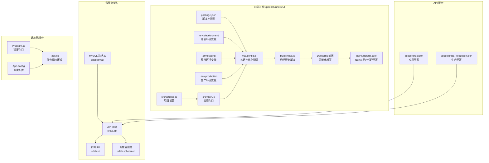
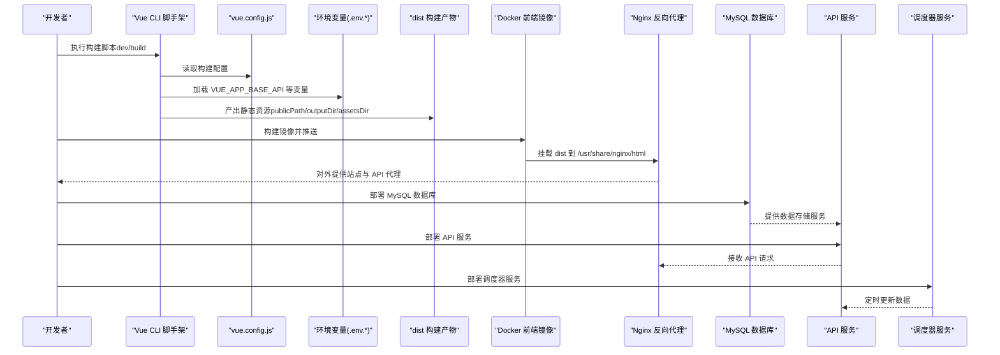
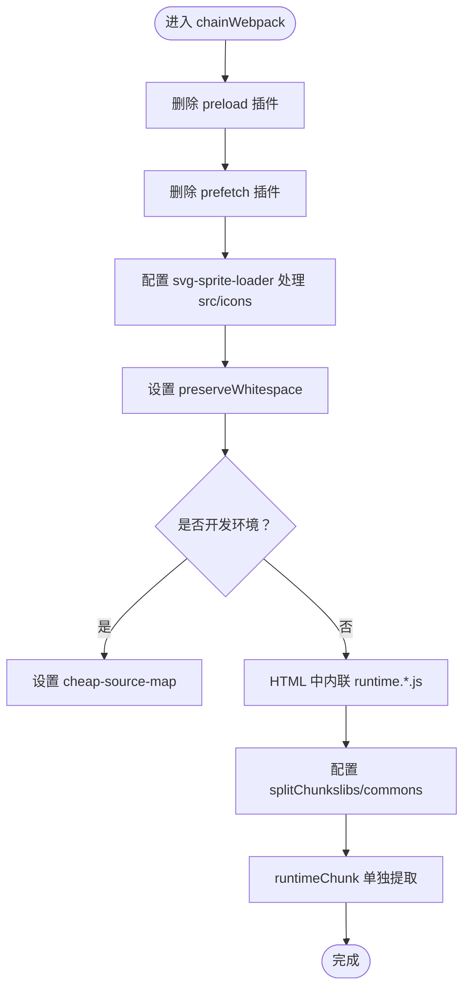
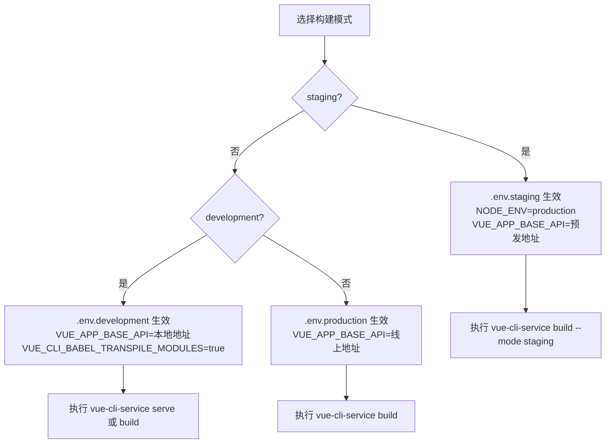
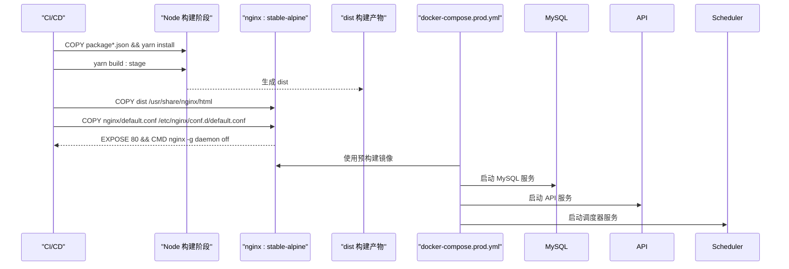
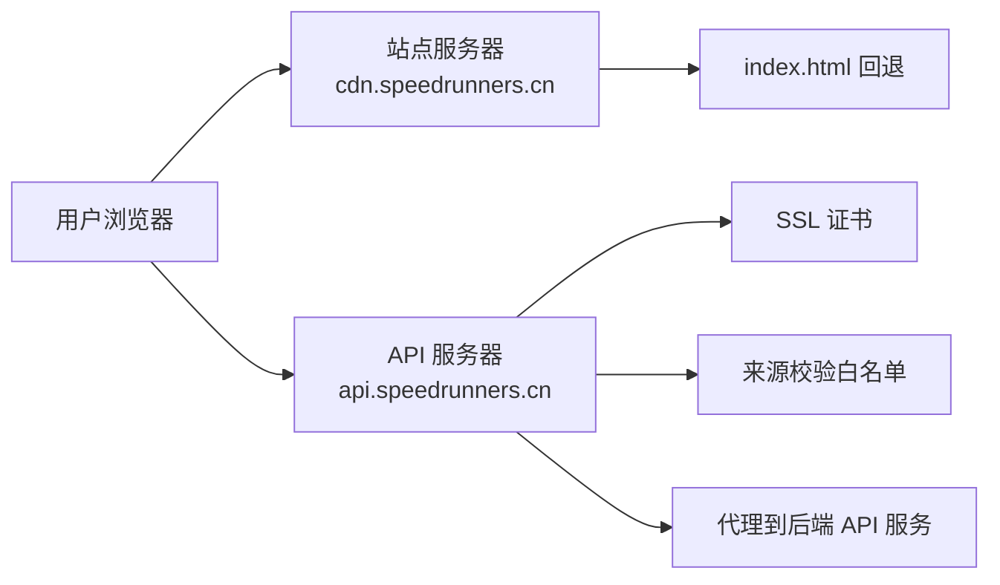
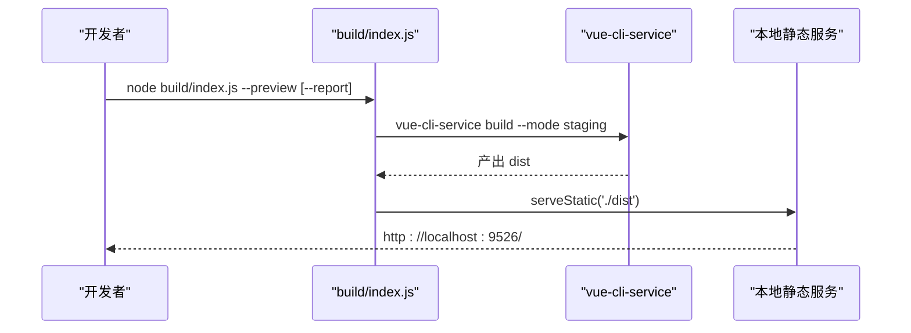
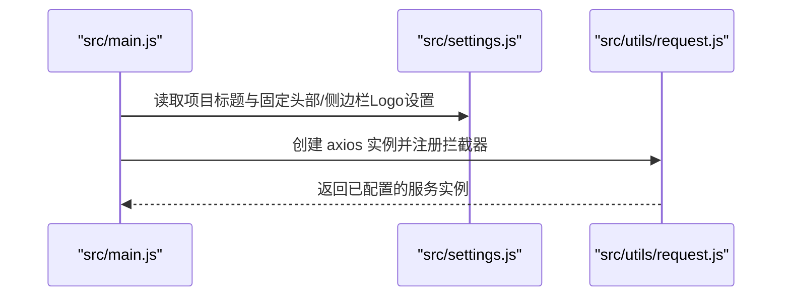
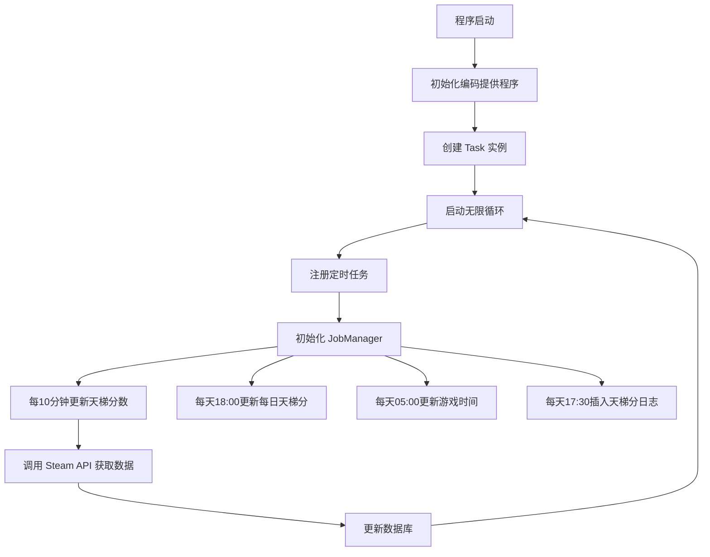
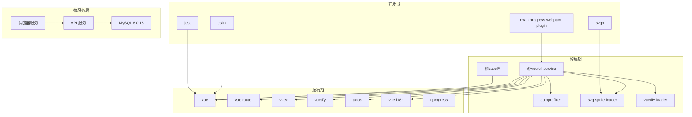

# 构建部署

<cite>
**本文引用的文件**
- [docker-compose.prod.yml](file://docker-compose.prod.yml)
- [docker-compose.yml](file://docker-compose.yml)
- [vue.config.js](file://SpeedRunners.UI/vue.config.js)
- [package.json](file://SpeedRunners.UI/package.json)
- [.env.development](file://SpeedRunners.UI/.env.development)
- [.env.staging](file://SpeedRunners.UI/.env.staging)
- [.env.production](file://SpeedRunners.UI/.env.production)
- [Dockerfile（前端）](file://SpeedRunners.UI/Dockerfile)
- [Nginx 配置](file://SpeedRunners.UI/nginx/default.conf)
- [构建预览脚本](file://SpeedRunners.UI/build/index.js)
- [项目设置](file://SpeedRunners.UI/src/settings.js)
- [请求封装](file://SpeedRunners.UI/src/utils/request.js)
- [主入口](file://SpeedRunners.UI/src/main.js)
- [PostCSS 配置](file://SpeedRunners.UI/postcss.config.js)
- [Babel 配置](file://SpeedRunners.UI/babel.config.js)
- [ESLint 配置](file://SpeedRunners.UI/.eslintrc.js)
- [Jest 测试配置](file://SpeedRunners.UI/jest.config.js)
- [API 应用配置](file://SpeedRunners.API/SpeedRunners/appsettings.json)
- [API 生产配置](file://SpeedRunners.API/SpeedRunners/appsettings.Production.json)
- [调度器程序入口](file://SpeedRunners.Scheduler/Program.cs)
- [调度器任务逻辑](file://SpeedRunners.Scheduler/Task.cs)
- [调度器配置](file://SpeedRunners.Scheduler/App.config)
- [本地部署脚本](file://scripts/setup-local.ps1)
- [ECS 初始化脚本](file://scripts/setup-ecs.sh)
</cite>

## 更新摘要
**变更内容**
- 新增专门的生产环境docker-compose配置，支持MySQL、API、UI和调度器服务的完整部署
- 新增调度器服务的Docker配置和任务调度逻辑
- 新增完整的部署脚本和环境配置文件
- 新增API的生产环境配置分离
- 更新部署架构图以反映新的微服务架构

## 目录
1. [简介](#简介)
2. [项目结构](#项目结构)
3. [核心组件](#核心组件)
4. [架构总览](#架构总览)
5. [详细组件分析](#详细组件分析)
6. [依赖关系分析](#依赖关系分析)
7. [性能考量](#性能考量)
8. [故障排查指南](#故障排查指南)
9. [结论](#结论)
10. [附录](#附录)

## 简介
本文件面向 SpeedRunnersLab 前端的构建与部署，围绕基于 Vue CLI 的工程化配置展开，系统性说明以下主题：
- vue.config.js 自定义配置：路径别名、SVG 处理、开发服务器、构建优化、输出目录与资源目录、代码分割、运行时分包等
- 环境变量与多环境构建：development、staging、production 的差异与设置
- Docker 容器化部署：镜像构建与运行流程，支持完整的微服务架构
- Nginx 反向代理与静态资源优化：站点与 API 分离、SSL、CORS 限制、SPA 回退
- 版本管理与发布流程：脚本命令与预览工具
- 性能优化最佳实践：代码分割、资源压缩、缓存策略
- 部署故障排查与监控建议
- **新增**：调度器服务的集成与定时任务管理
- **新增**：完整的生产环境部署架构与配置分离

## 项目结构
前端工程位于 SpeedRunners.UI，采用 Vue CLI 3.x 生成的默认目录结构，关键配置集中在根目录下的配置文件中；构建产物输出到 dist，静态资源位于 static；通过 Nginx 提供反向代理与静态服务。现在支持完整的微服务架构，包括 MySQL 数据库、API 服务、前端 UI 和调度器服务。

**图表来源**
- [docker-compose.prod.yml:11-76](file://docker-compose.prod.yml#L11-L76)
- [docker-compose.yml:3-61](file://docker-compose.yml#L3-L61)
- [vue.config.js:23-135](file://SpeedRunners.UI/vue.config.js#L23-L135)
- [API 应用配置:1-22](file://SpeedRunners.API/SpeedRunners/appsettings.json#L1-L22)
- [API 生产配置:1-23](file://SpeedRunners.API/SpeedRunners/appsettings.Production.json#L1-L23)
- [调度器程序入口:1-21](file://SpeedRunners.Scheduler/Program.cs#L1-L21)
- [调度器任务逻辑:1-349](file://SpeedRunners.Scheduler/Task.cs#L1-L349)

**章节来源**
- [docker-compose.prod.yml:1-76](file://docker-compose.prod.yml#L1-L76)
- [docker-compose.yml:1-61](file://docker-compose.yml#L1-L61)
- [vue.config.js:1-135](file://SpeedRunners.UI/vue.config.js#L1-L135)
- [API 应用配置:1-22](file://SpeedRunners.API/SpeedRunners/appsettings.json#L1-L22)
- [API 生产配置:1-23](file://SpeedRunners.API/SpeedRunners/appsettings.Production.json#L1-L23)
- [调度器程序入口:1-21](file://SpeedRunners.Scheduler/Program.cs#L1-L21)
- [调度器任务逻辑:1-349](file://SpeedRunners.Scheduler/Task.cs#L1-L349)

## 核心组件
- 构建配置与优化
  - 路径别名与外部依赖注入：通过 configureWebpack.resolve.alias 和 externals 实现模块别名与全局库注入
  - 开发服务器与热更新：devServer 配置端口与错误覆盖
  - 输出与资源目录：publicPath、outputDir、assetsDir 控制构建产物位置与静态资源子目录
  - 生产构建优化：删除 preload/prefetch 插件、启用 inline 运行时脚本、splitChunks 与 runtimeChunk
  - SVG 图标处理：使用 svg-sprite-loader 统一处理 src/icons 下的图标
  - Vue 编译选项：preserveWhitespace 以保留空白
  - 转译依赖：transpileDependencies 包含 vuetify
- 环境变量与多环境
  - development：本地开发 API 地址、热更新加速开关
  - staging：预发生产模式、API 地址
  - production：线上 API 地址
- 容器化与反向代理
  - Dockerfile：基于 nginx:stable-alpine 运行构建产物
  - Nginx：站点回退到 index.html、API 代理、SSL 证书、域名与 CORS 限制
  - **新增**：完整的微服务架构支持，包括 MySQL、API、UI 和调度器服务
- 构建脚本与预览
  - package.json scripts：dev、build:prod、build:stage、preview
  - build/index.js：支持 --preview 与 --report 参数的本地预览
- **新增**：调度器服务
  - 任务调度：定时更新 Steam 状态、玩家信息、天梯分数
  - 配置管理：通过 App.config 管理调度参数和数据库连接
  - 日志记录：详细的执行日志和错误处理

**章节来源**
- [vue.config.js:23-135](file://SpeedRunners.UI/vue.config.js#L23-L135)
- [package.json:6-14](file://SpeedRunners.UI/package.json#L6-L14)
- [docker-compose.prod.yml:11-76](file://docker-compose.prod.yml#L11-L76)
- [调度器任务逻辑:1-349](file://SpeedRunners.Scheduler/Task.cs#L1-L349)

## 架构总览
前端构建与部署的整体流程现在支持完整的微服务架构：

**图表来源**
- [docker-compose.prod.yml:11-76](file://docker-compose.prod.yml#L11-L76)
- [docker-compose.yml:3-61](file://docker-compose.yml#L3-L61)
- [package.json:6-14](file://SpeedRunners.UI/package.json#L6-L14)
- [调度器任务逻辑:26-66](file://SpeedRunners.Scheduler/Task.cs#L26-L66)

**章节来源**
- [docker-compose.prod.yml:1-76](file://docker-compose.prod.yml#L1-L76)
- [docker-compose.yml:1-61](file://docker-compose.yml#L1-L61)
- [package.json:6-14](file://SpeedRunners.UI/package.json#L6-L14)

## 详细组件分析

### Vue CLI 构建配置（vue.config.js）
- 路径别名与外部依赖
  - 别名：将 @ 映射到 src，便于导入
  - 外部依赖：jquery 注入为全局 jQuery，避免打包进第三方库
- 开发服务器
  - 端口：优先从环境变量读取，否则使用默认端口
  - 错误覆盖：仅显示错误，不显示警告
- 输出与资源目录
  - publicPath：根路径
  - outputDir：dist
  - assetsDir：static
- 生产构建优化
  - 删除 preload/prefetch 插件
  - HTML 中内联运行时脚本，减少请求数
  - splitChunks：按 node_modules 与公共组件拆分
  - runtimeChunk：单 runtime 提升缓存命中
- SVG 图标处理
  - 排除 src/icons 下的 SVG，单独使用 svg-sprite-loader 并设置 symbolId
- Vue 编译选项
  - 保留空白字符，提升可读性
- 转译依赖
  - vuetify 加入转译范围，确保兼容

**图表来源**
- [vue.config.js:58-132](file://SpeedRunners.UI/vue.config.js#L58-L132)

**章节来源**
- [vue.config.js:23-135](file://SpeedRunners.UI/vue.config.js#L23-L135)

### 环境变量与多环境构建
- development
  - 设置开发 API 基础地址
  - 启用 VUE_CLI_BABEL_TRANSPILE_MODULES，加速热更新
- staging
  - 生产模式，设置预发 API 基础地址
- production
  - 设置线上 API 基础地址
- 构建模式
  - build:prod 使用默认模式
  - build:stage 使用 staging 模式

**图表来源**
- [package.json:9-11](file://SpeedRunners.UI/package.json#L9-L11)
- [.env.development:1-15](file://SpeedRunners.UI/.env.development#L1-L15)
- [.env.staging:1-9](file://SpeedRunners.UI/.env.staging#L1-L9)
- [.env.production:1-7](file://SpeedRunners.UI/.env.production#L1-L7)

**章节来源**
- [package.json:6-14](file://SpeedRunners.UI/package.json#L6-L14)
- [.env.development:1-15](file://SpeedRunners.UI/.env.development#L1-L15)
- [.env.staging:1-9](file://SpeedRunners.UI/.env.staging#L1-L9)
- [.env.production:1-7](file://SpeedRunners.UI/.env.production#L1-L7)

### Docker 容器化部署
- 阶段一（可选）：在构建阶段使用 Node 镜像安装依赖并执行 build:stage
- 阶段二（必须）：使用 nginx:stable-alpine 作为运行时镜像
  - 将 dist 目录挂载到 /usr/share/nginx/html
  - 复制 Nginx 配置文件到 /etc/nginx/conf.d/default.conf
  - 暴露 80 端口，前台启动 nginx
- **新增**：生产环境专用配置
  - 使用预构建的镜像而非本地构建
  - 支持环境变量注入（ALIYUN_REGISTRY、ALIYUN_NAMESPACE、IMAGE_TAG）
  - 完整的微服务架构部署

**图表来源**
- [docker-compose.prod.yml:28-71](file://docker-compose.prod.yml#L28-L71)
- [Dockerfile（前端）:1-22](file://SpeedRunners.UI/Dockerfile#L1-L22)

**章节来源**
- [docker-compose.prod.yml:1-76](file://docker-compose.prod.yml#L1-L76)
- [docker-compose.yml:1-61](file://docker-compose.yml#L1-L61)
- [Dockerfile（前端）:1-22](file://SpeedRunners.UI/Dockerfile#L1-L22)

### Nginx 反向代理与静态资源优化
- 站点服务器（cdn.speedrunners.cn）
  - 根目录 /usr/share/nginx/html
  - 回退到 index.html，适配 SPA
- API 服务器（api.speedrunners.cn）
  - 监听 443，加载 SSL 证书
  - 限制来源域名（仅允许特定来源），防止跨域滥用
  - 将 / 请求代理到后端 API 服务
- HTTP 到 HTTPS 重定向
  - speedrunners.cn 重定向至 www 域名并走 HTTPS

**图表来源**
- [Nginx 配置:1-30](file://SpeedRunners.UI/nginx/default.conf#L1-L30)

**章节来源**
- [Nginx 配置:1-30](file://SpeedRunners.UI/nginx/default.conf#L1-L30)

### 构建脚本与预览
- package.json scripts
  - dev：本地开发服务器
  - build:prod：生产构建
  - build:stage：预发构建（staging 模式）
  - preview：本地预览构建产物
- 构建预览脚本
  - 支持 --preview 与 --report 参数
  - 使用 serve-static 提供静态服务，默认端口 9526

**图表来源**
- [构建预览脚本:1-36](file://SpeedRunners.UI/build/index.js#L1-L36)
- [package.json:6-14](file://SpeedRunners.UI/package.json#L6-L14)

**章节来源**
- [构建预览脚本:1-36](file://SpeedRunners.UI/build/index.js#L1-L36)
- [package.json:6-14](file://SpeedRunners.UI/package.json#L6-L14)

### 应用入口与设置
- 入口文件引入全局样式、图标、权限控制、插件与国际化
- 项目标题与页面元信息由 settings.js 提供
- 请求拦截器统一注入语言与令牌头，并处理响应状态码

**图表来源**
- [主入口:1-30](file://SpeedRunners.UI/src/main.js#L1-L30)
- [项目设置:1-16](file://SpeedRunners.UI/src/settings.js#L1-L16)
- [请求封装:1-82](file://SpeedRunners.UI/src/utils/request.js#L1-L82)

**章节来源**
- [主入口:1-30](file://SpeedRunners.UI/src/main.js#L1-L30)
- [项目设置:1-16](file://SpeedRunners.UI/src/settings.js#L1-L16)
- [请求封装:1-82](file://SpeedRunners.UI/src/utils/request.js#L1-L82)

### 工程化辅助配置
- PostCSS：启用 autoprefixer
- Babel：使用 @vue/app 预设
- ESLint：推荐规则与自定义规则集合
- Jest：模块映射、快照序列化、覆盖率收集范围

**章节来源**
- [PostCSS 配置:1-9](file://SpeedRunners.UI/postcss.config.js#L1-L9)
- [Babel 配置:1-6](file://SpeedRunners.UI/babel.config.js#L1-L6)
- [ESLint 配置:1-199](file://SpeedRunners.UI/.eslintrc.js#L1-L199)
- [Jest 测试配置:1-25](file://SpeedRunners.UI/jest.config.js#L1-L25)

### **新增**：调度器服务
- 程序入口
  - 注册编码提供程序
  - 初始化任务并启动循环执行
- 任务调度逻辑
  - 定时更新天梯分数：每10分钟
  - 更新每日天梯分：每天18:00
  - 更新游戏时间：每天05:00
  - 插入天梯分日志：每天17:30
- 数据更新功能
  - Steam API 集成：获取玩家信息和游戏时间
  - 数据库操作：更新 RankInfo 表
  - 错误处理：详细的日志记录和异常捕获

**图表来源**
- [调度器程序入口:7-18](file://SpeedRunners.Scheduler/Program.cs#L7-L18)
- [调度器任务逻辑:34-59](file://SpeedRunners.Scheduler/Task.cs#L34-L59)

**章节来源**
- [调度器程序入口:1-21](file://SpeedRunners.Scheduler/Program.cs#L1-L21)
- [调度器任务逻辑:1-349](file://SpeedRunners.Scheduler/Task.cs#L1-L349)

### **新增**：生产环境部署配置
- 环境变量管理
  - ALIYUN_REGISTRY：阿里云镜像仓库地址
  - ALIYUN_NAMESPACE：命名空间
  - IMAGE_TAG：镜像标签（latest 或 git sha）
- 服务配置
  - MySQL：8.0.18 版本，持久化存储
  - API：生产环境配置，挂载敏感配置文件
  - UI：Nginx 反向代理，支持 SSL
  - Scheduler：定时任务服务，配置文件挂载

**章节来源**
- [docker-compose.prod.yml:4-8](file://docker-compose.prod.yml#L4-L8)
- [docker-compose.prod.yml:11-76](file://docker-compose.prod.yml#L11-L76)

## 依赖关系分析
- 构建期依赖
  - @vue/cli-service、@vue/cli-plugin-*、babel、postcss、svg-sprite-loader、vuetify-loader 等
- 运行期依赖
  - vue、vue-router、vuex、vuetify、axios、vue-i18n、nprogress 等
- 开发期依赖
  - eslint、jest、svgo、nyan-progress-webpack-plugin 等
- **新增**：微服务依赖
  - MySQL：数据库服务
  - API：后端服务，依赖数据库和外部 API
  - 调度器：定时任务服务，依赖 API 和数据库

**图表来源**
- [package.json:15-65](file://SpeedRunners.UI/package.json#L15-L65)
- [docker-compose.prod.yml:12-69](file://docker-compose.prod.yml#L12-L69)

**章节来源**
- [package.json:1-76](file://SpeedRunners.UI/package.json#L1-L76)
- [docker-compose.prod.yml:1-76](file://docker-compose.prod.yml#L1-L76)

## 性能考量
- 代码分割
  - splitChunks 拆分 node_modules 与公共组件，减少重复与体积
  - runtimeChunk 单独提取，提升浏览器缓存命中率
- 资源处理
  - SVG 图标统一使用 svg-sprite-loader，减少请求与体积
  - 生产关闭 source map，减小产物体积
- 构建体验
  - development 使用 cheap-source-map，平衡调试与性能
  - 删除 preload/prefetch 插件，避免无效预加载
- 网络与缓存
  - Nginx 回退到 index.html，保证 SPA 路由可用
  - API 服务器启用 SSL 并限制来源，提升安全性
- **新增**：微服务性能优化
  - 容器化部署提升资源利用率
  - 调度器服务异步处理，避免阻塞主线程
  - 数据库连接池优化，提升查询性能

**章节来源**
- [vue.config.js:58-132](file://SpeedRunners.UI/vue.config.js#L58-L132)
- [.env.development:7-14](file://SpeedRunners.UI/.env.development#L7-L14)
- [Nginx 配置:1-30](file://SpeedRunners.UI/nginx/default.conf#L1-L30)
- [调度器任务逻辑:154-171](file://SpeedRunners.Scheduler/Task.cs#L154-L171)

## 故障排查指南
- 构建失败或端口占用
  - 确认 devServer 端口未被占用，或通过参数指定端口
  - 检查 publicPath 与部署路径是否一致
- 资源 404 或路由刷新 404
  - 确认 Nginx 回退到 index.html 的配置生效
  - 检查 dist 与 Nginx 挂载路径一致
- API 跨域或访问受限
  - 检查 Nginx 中来源校验与代理目标是否正确
  - 确认 SSL 证书路径与权限
- 热更新缓慢
  - 开发环境已启用 VUE_CLI_BABEL_TRANSPILE_MODULES，如仍慢可检查依赖数量与模块大小
- 本地预览异常
  - 使用 --preview 参数确认 dist 是否生成
  - 确认本地静态服务端口未被占用
- **新增**：微服务部署问题
  - Docker 镜像拉取失败：检查阿里云 ACR 凭证配置
  - 服务启动失败：确认敏感配置文件已正确挂载
  - 数据库连接问题：检查 MySQL 服务状态和连接字符串
  - 调度器任务异常：查看日志输出，确认 API 密钥和定时参数

**章节来源**
- [vue.config.js:50-57](file://SpeedRunners.UI/vue.config.js#L50-L57)
- [Nginx 配置:7-25](file://SpeedRunners.UI/nginx/default.conf#L7-L25)
- [构建预览脚本:7-32](file://SpeedRunners.UI/build/index.js#L7-L32)
- [.env.development:1-15](file://SpeedRunners.UI/.env.development#L1-L15)
- [docker-compose.prod.yml:35-38](file://docker-compose.prod.yml#L35-L38)
- [调度器任务逻辑:26-66](file://SpeedRunners.Scheduler/Task.cs#L26-L66)

## 结论
本方案以 Vue CLI 为基础，结合 Nginx 反向代理与 Docker 容器化，形成一套完整的前端构建与部署流水线。通过合理的代码分割、资源处理与缓存策略，兼顾开发体验与上线性能。配合多环境变量与预览脚本，可稳定支撑开发、预发与生产的全链路交付。**新增的微服务架构进一步提升了系统的可扩展性和维护性，支持完整的数据采集、处理和展示流程。**

## 附录
- 关键配置清单
  - 构建配置：publicPath、outputDir、assetsDir、externals、resolve.alias、devServer、chainWebpack、transpileDependencies
  - 环境变量：VUE_APP_BASE_API、NODE_ENV、ENV、VUE_CLI_BABEL_TRANSPILE_MODULES
  - 容器化：Dockerfile（前端）、Nginx 配置、docker-compose.prod.yml
  - 构建脚本：package.json scripts、build/index.js
  - **新增**：调度器配置：App.config、Program.cs、Task.cs
  - **新增**：API 配置：appsettings.json、appsettings.Production.json
  - **新增**：部署脚本：setup-local.ps1、setup-ecs.sh

**章节来源**
- [vue.config.js:23-135](file://SpeedRunners.UI/vue.config.js#L23-L135)
- [.env.development:1-15](file://SpeedRunners.UI/.env.development#L1-L15)
- [.env.staging:1-9](file://SpeedRunners.UI/.env.staging#L1-L9)
- [.env.production:1-7](file://SpeedRunners.UI/.env.production#L1-L7)
- [Dockerfile（前端）:1-22](file://SpeedRunners.UI/Dockerfile#L1-L22)
- [Nginx 配置:1-30](file://SpeedRunners.UI/nginx/default.conf#L1-L30)
- [构建预览脚本:1-36](file://SpeedRunners.UI/build/index.js#L1-L36)
- [package.json:6-14](file://SpeedRunners.UI/package.json#L6-L14)
- [docker-compose.prod.yml:1-76](file://docker-compose.prod.yml#L1-L76)
- [调度器配置:1-14](file://SpeedRunners.Scheduler/App.config#L1-L14)
- [API 应用配置:1-22](file://SpeedRunners.API/SpeedRunners/appsettings.json#L1-L22)
- [API 生产配置:1-23](file://SpeedRunners.API/SpeedRunners/appsettings.Production.json#L1-L23)
- [本地部署脚本:1-214](file://scripts/setup-local.ps1#L1-L214)
- [ECS 初始化脚本:1-154](file://scripts/setup-ecs.sh#L1-L154)