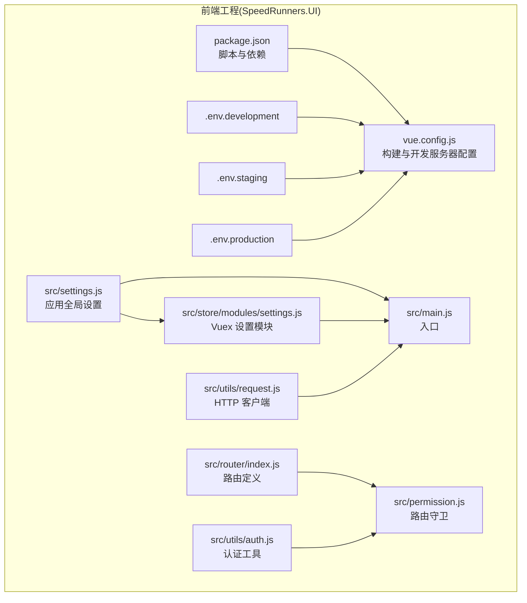
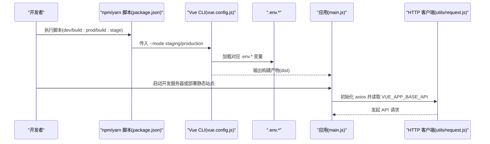
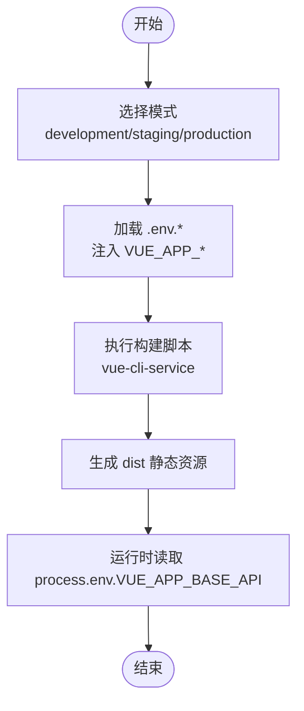
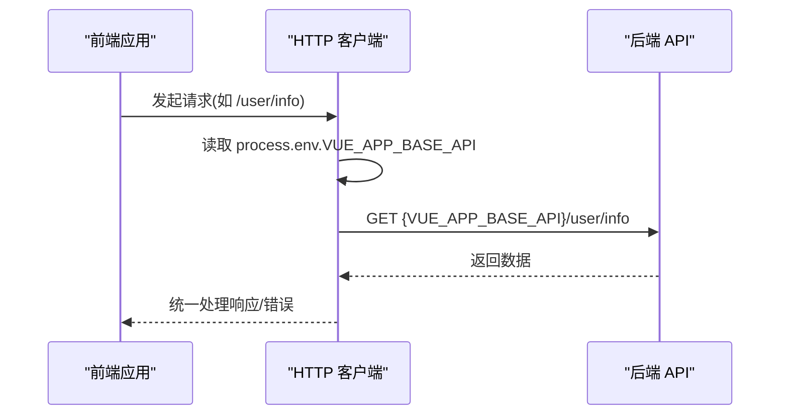
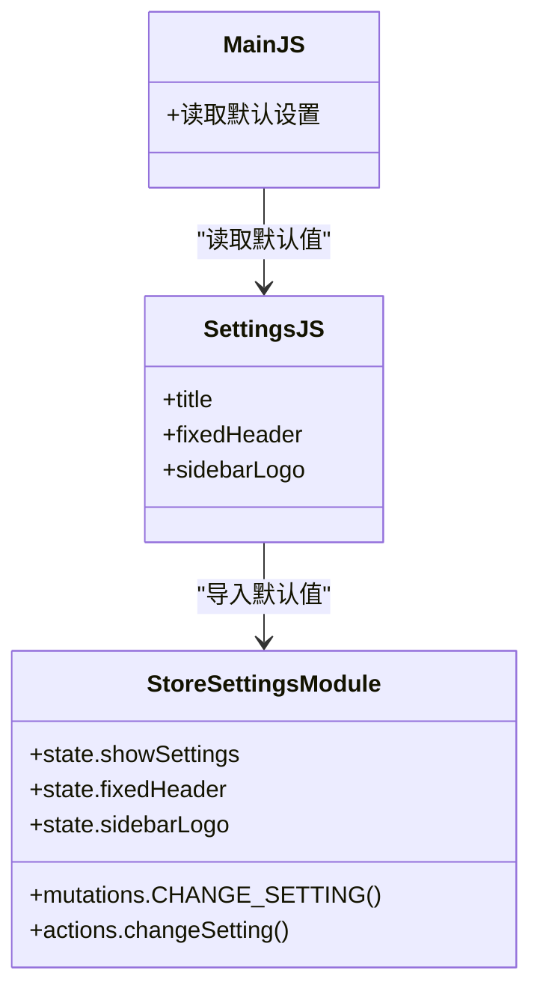
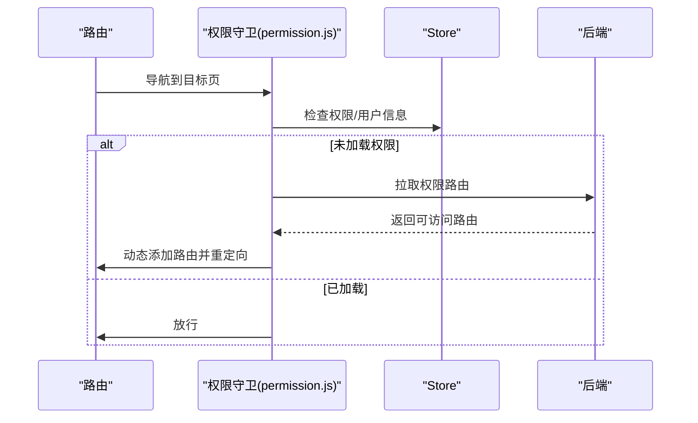
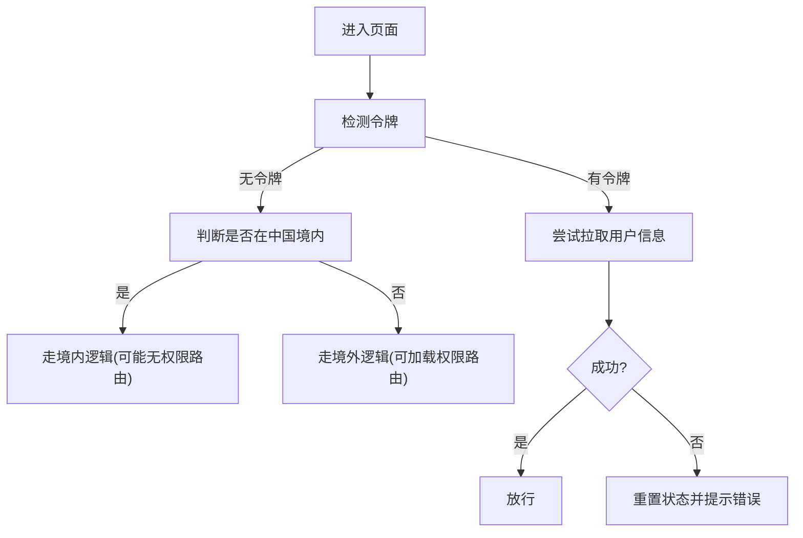
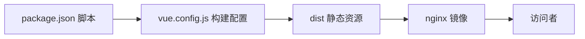
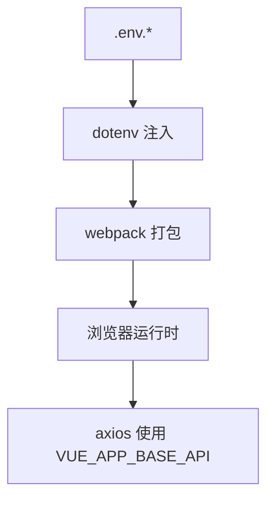

# 环境配置

<cite>
**本文引用的文件**
- [.env.development](file://SpeedRunners.UI/.env.development)
- [.env.staging](file://SpeedRunners.UI/.env.staging)
- [.env.production](file://SpeedRunners.UI/.env.production)
- [package.json](file://SpeedRunners.UI/package.json)
- [vue.config.js](file://SpeedRunners.UI/vue.config.js)
- [src/settings.js](file://SpeedRunners.UI/src/settings.js)
- [src/store/modules/settings.js](file://SpeedRunners.UI/src/store/modules/settings.js)
- [src/router/index.js](file://SpeedRunners.UI/src/router/index.js)
- [src/utils/request.js](file://SpeedRunners.UI/src/utils/request.js)
- [src/main.js](file://SpeedRunners.UI/src/main.js)
- [src/permission.js](file://SpeedRunners.UI/src/permission.js)
- [src/utils/auth.js](file://SpeedRunners.UI/src/utils/auth.js)
- [Dockerfile](file://SpeedRunners.UI/Dockerfile)
- [SpeedRunners.API/SpeedRunners/Properties/launchSettings.json](file://SpeedRunners.API/SpeedRunners/Properties/launchSettings.json)
- [SpeedRunners.API/SpeedRunners/appsettings.json](file://SpeedRunners.API/SpeedRunners/appsettings.json)
</cite>

## 目录
1. [简介](#简介)
2. [项目结构](#项目结构)
3. [核心组件](#核心组件)
4. [架构总览](#架构总览)
5. [详细组件分析](#详细组件分析)
6. [依赖关系分析](#依赖关系分析)
7. [性能考虑](#性能考虑)
8. [故障排查指南](#故障排查指南)
9. [结论](#结论)
10. [附录](#附录)

## 简介
本文件面向 SpeedRunnersLab 前端工程的环境配置与运行机制，系统性说明以下内容：
- 不同环境配置文件（.env.development、.env.staging、.env.production）的作用与配置项
- 环境变量的使用方式与优先级规则
- API 端点配置、调试开关、功能开关等环境特定设置
- settings.js 中的应用配置项（标题、主题、路由等）
- 环境切换最佳实践与安全注意事项
- 环境配置的验证与测试方法

## 项目结构
前端工程位于 SpeedRunners.UI 目录，采用 Vue CLI 3.x 构建，核心配置集中在 vue.config.js 与 package.json 中；环境变量通过 .env.* 文件注入，并由构建脚本以 --mode staging 等方式选择。

图表来源
- [package.json](file://SpeedRunners.UI/package.json#L6-L13)
- [vue.config.js](file://SpeedRunners.UI/vue.config.js#L23-L129)
- [.env.development](file://SpeedRunners.UI/.env.development#L1-L15)
- [.env.staging](file://SpeedRunners.UI/.env.staging#L1-L9)
- [.env.production](file://SpeedRunners.UI/.env.production#L1-L7)
- [src/settings.js](file://SpeedRunners.UI/src/settings.js#L1-L16)
- [src/store/modules/settings.js](file://SpeedRunners.UI/src/store/modules/settings.js#L1-L30)
- [src/router/index.js](file://SpeedRunners.UI/src/router/index.js#L1-L133)
- [src/utils/request.js](file://SpeedRunners.UI/src/utils/request.js#L1-L82)
- [src/main.js](file://SpeedRunners.UI/src/main.js#L1-L30)
- [src/permission.js](file://SpeedRunners.UI/src/permission.js#L1-L69)
- [src/utils/auth.js](file://SpeedRunners.UI/src/utils/auth.js#L1-L45)

章节来源
- [package.json](file://SpeedRunners.UI/package.json#L6-L13)
- [vue.config.js](file://SpeedRunners.UI/vue.config.js#L23-L129)

## 核心组件
- 环境变量注入与优先级
  - Vue CLI 通过 dotenv 将 .env.* 文件中的键值注入到构建时可用的环境变量中，前缀 VUE_APP_* 的变量会被注入到客户端代码可访问的环境变量中。
  - 不同模式通过 package.json 中的 scripts 使用 --mode staging 或默认 development/production 进行区分。
- API 基础路径
  - VUE_APP_BASE_API 在各环境文件中分别指向本地、预发、生产服务地址。
- 应用全局设置
  - src/settings.js 提供标题、固定头部、侧边栏 Logo 等全局配置；src/store/modules/settings.js 将其映射为可编辑的 Vuex 状态。
- 路由与权限
  - src/router/index.js 定义常量路由与异步路由；src/permission.js 在导航前根据令牌与区域判断加载权限路由。
- HTTP 客户端
  - src/utils/request.js 基于 axios，使用 process.env.VUE_APP_BASE_API 作为基础 URL，并统一处理请求头与响应错误。

章节来源
- [.env.development](file://SpeedRunners.UI/.env.development#L1-L15)
- [.env.staging](file://SpeedRunners.UI/.env.staging#L1-L9)
- [.env.production](file://SpeedRunners.UI/.env.production#L1-L7)
- [package.json](file://SpeedRunners.UI/package.json#L6-L13)
- [src/settings.js](file://SpeedRunners.UI/src/settings.js#L1-L16)
- [src/store/modules/settings.js](file://SpeedRunners.UI/src/store/modules/settings.js#L1-L30)
- [src/router/index.js](file://SpeedRunners.UI/src/router/index.js#L33-L133)
- [src/permission.js](file://SpeedRunners.UI/src/permission.js#L13-L60)
- [src/utils/request.js](file://SpeedRunners.UI/src/utils/request.js#L8-L12)

## 架构总览
下图展示从构建到运行的关键流程：构建脚本选择模式 -> 注入环境变量 -> 打包输出 -> 开发服务器或静态部署 -> 运行时读取环境变量发起 API 请求。

图表来源
- [package.json](file://SpeedRunners.UI/package.json#L6-L13)
- [vue.config.js](file://SpeedRunners.UI/vue.config.js#L23-L129)
- [.env.development](file://SpeedRunners.UI/.env.development#L1-L15)
- [.env.staging](file://SpeedRunners.UI/.env.staging#L1-L9)
- [.env.production](file://SpeedRunners.UI/.env.production#L1-L7)
- [src/utils/request.js](file://SpeedRunners.UI/src/utils/request.js#L8-L12)
- [src/main.js](file://SpeedRunners.UI/src/main.js#L1-L30)

## 详细组件分析

### 环境变量与优先级
- 注入规则
  - Vue CLI 会按顺序加载 .env.local、.{mode}.env.local、.{mode}.env、.env，仅 VUE_APP_* 前缀变量会被注入到客户端代码。
- 模式选择
  - 开发：默认 development
  - 预发：使用 build:stage 脚本传入 --mode staging
  - 生产：使用 build:prod 或直接生产模式
- 关键变量
  - ENV：用于标识当前环境字符串
  - VUE_APP_BASE_API：API 基础路径
  - VUE_CLI_BABEL_TRANSPILE_MODULES：影响动态导入转换，提升热更新速度（开发）

图表来源
- [package.json](file://SpeedRunners.UI/package.json#L6-L13)
- [.env.development](file://SpeedRunners.UI/.env.development#L1-L15)
- [.env.staging](file://SpeedRunners.UI/.env.staging#L1-L9)
- [.env.production](file://SpeedRunners.UI/.env.production#L1-L7)
- [vue.config.js](file://SpeedRunners.UI/vue.config.js#L23-L129)

章节来源
- [package.json](file://SpeedRunners.UI/package.json#L6-L13)
- [.env.development](file://SpeedRunners.UI/.env.development#L1-L15)
- [.env.staging](file://SpeedRunners.UI/.env.staging#L1-L9)
- [.env.production](file://SpeedRunners.UI/.env.production#L1-L7)

### API 端点配置
- 基础路径
  - 开发：指向本地后端服务
  - 预发：指向预发服务器
  - 生产：指向生产域名
- 运行时使用
  - axios 实例在初始化时读取 VUE_APP_BASE_API 作为 baseURL，所有接口调用自动拼接该前缀。

图表来源
- [src/utils/request.js](file://SpeedRunners.UI/src/utils/request.js#L8-L12)
- [.env.development](file://SpeedRunners.UI/.env.development#L5)
- [.env.staging](file://SpeedRunners.UI/.env.staging#L7)
- [.env.production](file://SpeedRunners.UI/.env.production#L5)

章节来源
- [src/utils/request.js](file://SpeedRunners.UI/src/utils/request.js#L8-L12)
- [.env.development](file://SpeedRunners.UI/.env.development#L5)
- [.env.staging](file://SpeedRunners.UI/.env.staging#L7)
- [.env.production](file://SpeedRunners.UI/.env.production#L5)

### settings.js 与应用全局设置
- 配置项
  - title：页面标题
  - fixedHeader：是否固定头部
  - sidebarLogo：侧边栏是否显示 Logo
- 作用范围
  - src/settings.js 为默认全局设置
  - src/store/modules/settings.js 将其映射为可编辑的 Vuex 状态，便于运行时修改
  - src/main.js 读取默认设置用于初始化

图表来源
- [src/settings.js](file://SpeedRunners.UI/src/settings.js#L1-L16)
- [src/store/modules/settings.js](file://SpeedRunners.UI/src/store/modules/settings.js#L1-L30)
- [src/main.js](file://SpeedRunners.UI/src/main.js#L1-L30)

章节来源
- [src/settings.js](file://SpeedRunners.UI/src/settings.js#L1-L16)
- [src/store/modules/settings.js](file://SpeedRunners.UI/src/store/modules/settings.js#L1-L30)
- [src/main.js](file://SpeedRunners.UI/src/main.js#L1-L30)

### 路由与权限控制
- 路由
  - constantRoutes：无需权限的基础路由
  - asyncRoutes：基于权限动态加载的路由
  - add404Router：兜底 404 路由
- 权限
  - permission.js 在导航前根据是否存在令牌与区域判断加载权限路由
  - 支持墙内外不同策略与用户信息拉取

图表来源
- [src/router/index.js](file://SpeedRunners.UI/src/router/index.js#L33-L133)
- [src/permission.js](file://SpeedRunners.UI/src/permission.js#L13-L60)

章节来源
- [src/router/index.js](file://SpeedRunners.UI/src/router/index.js#L33-L133)
- [src/permission.js](file://SpeedRunners.UI/src/permission.js#L13-L60)

### 认证与区域判断
- 令牌管理
  - 通过 Cookie 存储与读取令牌
  - 登录跳转使用 Steam OpenID
- 区域判断
  - 通过快速请求外部接口判断是否在中国境内，决定后续行为

图表来源
- [src/permission.js](file://SpeedRunners.UI/src/permission.js#L13-L60)
- [src/utils/auth.js](file://SpeedRunners.UI/src/utils/auth.js#L18-L22)
- [src/utils/auth.js](file://SpeedRunners.UI/src/utils/auth.js#L25-L45)

章节来源
- [src/utils/auth.js](file://SpeedRunners.UI/src/utils/auth.js#L1-L45)
- [src/permission.js](file://SpeedRunners.UI/src/permission.js#L1-L69)

### 构建与部署
- 构建脚本
  - dev：本地开发
  - build:stage：预发模式构建
  - build:prod：生产模式构建
- 开发服务器
  - vue.config.js 配置 devServer、端口、进度条插件等
- 部署
  - Dockerfile 使用 nginx 镜像部署 dist 目录

图表来源
- [package.json](file://SpeedRunners.UI/package.json#L6-L13)
- [vue.config.js](file://SpeedRunners.UI/vue.config.js#L23-L129)
- [Dockerfile](file://SpeedRunners.UI/Dockerfile#L1-L22)

章节来源
- [package.json](file://SpeedRunners.UI/package.json#L6-L13)
- [vue.config.js](file://SpeedRunners.UI/vue.config.js#L23-L129)
- [Dockerfile](file://SpeedRunners.UI/Dockerfile#L1-L22)

## 依赖关系分析
- 环境变量对运行时的影响
  - VUE_APP_BASE_API 决定 axios 请求的目标域
  - ENV 用于标识当前环境，可用于日志或调试开关
- 构建期与运行期
  - 构建期：dotenv 注入 -> webpack 打包
  - 运行期：process.env.VUE_APP_BASE_API 在浏览器中生效

图表来源
- [.env.development](file://SpeedRunners.UI/.env.development#L1-L15)
- [.env.staging](file://SpeedRunners.UI/.env.staging#L1-L9)
- [.env.production](file://SpeedRunners.UI/.env.production#L1-L7)
- [vue.config.js](file://SpeedRunners.UI/vue.config.js#L23-L129)
- [src/utils/request.js](file://SpeedRunners.UI/src/utils/request.js#L8-L12)

章节来源
- [src/utils/request.js](file://SpeedRunners.UI/src/utils/request.js#L8-L12)

## 性能考虑
- 动态导入优化
  - 开发环境启用 VUE_CLI_BABEL_TRANSPILE_MODULES 可将动态 import 转换为 require，减少模块解析开销，提升热更新速度
- 代码分割与运行时
  - vue.config.js 在非开发模式下启用 splitChunks 与 runtimeChunk，优化首屏与缓存
- 构建体积
  - 生产关闭 source map，减少产物体积

章节来源
- [.env.development](file://SpeedRunners.UI/.env.development#L7-L14)
- [vue.config.js](file://SpeedRunners.UI/vue.config.js#L96-L126)

## 故障排查指南
- 环境变量未生效
  - 确认变量名以 VUE_APP_ 前缀开头
  - 确认使用正确模式（--mode staging/production）
  - 确认 .env.* 文件编码与换行符
- API 请求失败
  - 检查 VUE_APP_BASE_API 是否指向正确后端
  - 检查 CORS 与代理配置（后端 launchSettings.json 中的 IIS Express 端口）
- 部署后页面空白
  - 确认 Dockerfile 复制 dist 目录并暴露 80
  - 确认 nginx 配置正确映射静态资源

章节来源
- [src/utils/request.js](file://SpeedRunners.UI/src/utils/request.js#L8-L12)
- [SpeedRunners.API/SpeedRunners/Properties/launchSettings.json](file://SpeedRunners.API/SpeedRunners/Properties/launchSettings.json#L36-L38)
- [Dockerfile](file://SpeedRunners.UI/Dockerfile#L14-L22)

## 结论
- 通过 .env.* 文件与 Vue CLI 的 dotenv 注入机制，前端实现了清晰的环境隔离
- VUE_APP_BASE_API 是连接前后端的关键纽带，应严格管理不同环境的值
- settings.js 与 Vuex 设置模块提供了灵活的全局配置能力
- 建议在 CI/CD 中以 --mode 控制构建，并在部署镜像中固化环境变量

## 附录

### 环境切换最佳实践
- 本地开发
  - 使用 .env.development，确保 VUE_APP_BASE_API 指向本地后端
  - 如需加速热更新，保持 VUE_CLI_BABEL_TRANSPILE_MODULES=true
- 预发环境
  - 使用 build:stage 脚本，确认 .env.staging 的 VUE_APP_BASE_API 指向预发
- 生产环境
  - 使用 build:prod 或生产模式，确认 .env.production 的 VUE_APP_BASE_API 指向生产域名
  - 生产关闭 source map，启用代码分割与运行时优化

### 安全注意事项
- 不要在 .env.* 中存放敏感信息（如密钥），应通过后端配置或环境变量注入
- 确保 HTTPS 传输，避免令牌在明文网络中泄露
- 避免将 VUE_APP_* 暴露过多敏感信息，仅保留必要配置

### 环境配置验证与测试
- 构建验证
  - 分别执行 build:stage 与 build:prod，核对 dist 目录结构与资源
- 运行验证
  - 本地启动开发服务器，确认页面可访问且 API 请求成功
  - 使用 Dockerfile 构建镜像并运行，验证静态资源可被 nginx 正常服务
- 端到端验证
  - 在不同模式下访问首页，检查路由加载、权限策略与 API 调用链路

章节来源
- [package.json](file://SpeedRunners.UI/package.json#L6-L13)
- [vue.config.js](file://SpeedRunners.UI/vue.config.js#L23-L129)
- [Dockerfile](file://SpeedRunners.UI/Dockerfile#L1-L22)