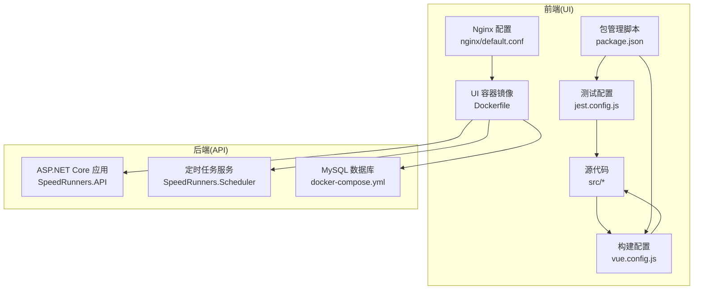
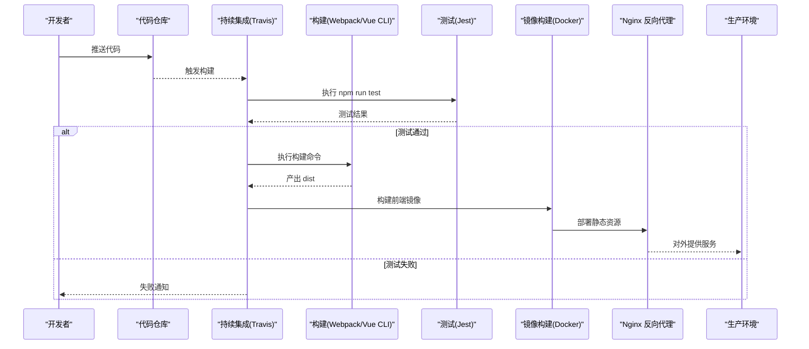
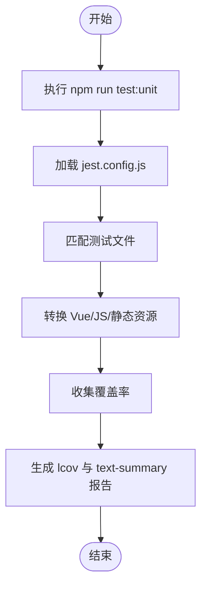
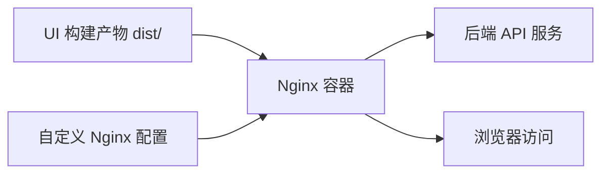
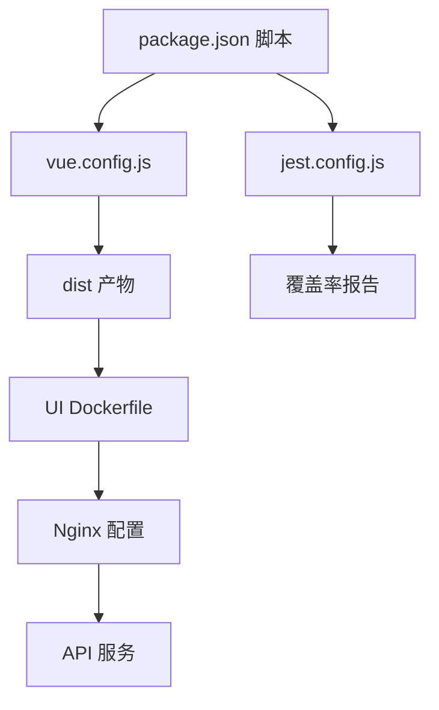

# 部署流水线

<cite>
**本文引用的文件**
- [README.md](file://README.md)
- [.travis.yml](file://SpeedRunners.UI/.travis.yml)
- [package.json](file://SpeedRunners.UI/package.json)
- [jest.config.js](file://SpeedRunners.UI/jest.config.js)
- [vue.config.js](file://SpeedRunners.UI/vue.config.js)
- [Dockerfile](file://SpeedRunners.UI/Dockerfile)
- [nginx/default.conf](file://SpeedRunners.UI/nginx/default.conf)
- [docker-compose.yml](file://docker-compose.yml)
</cite>

## 目录
1. [简介](#简介)
2. [项目结构](#项目结构)
3. [核心组件](#核心组件)
4. [架构总览](#架构总览)
5. [详细组件分析](#详细组件分析)
6. [依赖关系分析](#依赖关系分析)
7. [性能考虑](#性能考虑)
8. [故障排查指南](#故障排查指南)
9. [结论](#结论)
10. [附录](#附录)

## 简介
本文件面向 SpeedRunnersLab 前端（Vue.js）部署流水线，系统性梳理从代码提交到构建、测试、打包与发布的完整流程；解析 Travis CI 配置、自动化测试配置与报告、容器化部署策略及本地开发与联调环境；并提供部署前准备清单、常见问题排查与应急处理建议。

## 项目结构
前端工程位于 SpeedRunners.UI，采用 Vue CLI 3.x 构建，使用 Jest 进行单元测试，通过 Nginx 提供静态资源服务，并以 Docker 容器化交付。后端 API 与调度服务位于 SpeedRunners.API 与 SpeedRunners.Scheduler，数据库为 MySQL。整体通过 docker-compose 编排，形成可一键启动的本地联调环境。

图表来源
- [docker-compose.yml](file://docker-compose.yml#L1-L59)
- [Dockerfile](file://SpeedRunners.UI/Dockerfile#L1-L22)
- [nginx/default.conf](file://SpeedRunners.UI/nginx/default.conf#L1-L30)
- [vue.config.js](file://SpeedRunners.UI/vue.config.js#L1-L129)
- [jest.config.js](file://SpeedRunners.UI/jest.config.js#L1-L25)
- [package.json](file://SpeedRunners.UI/package.json#L1-L76)

章节来源
- [README.md](file://README.md#L1-L5)
- [docker-compose.yml](file://docker-compose.yml#L1-L59)

## 核心组件
- 构建与打包
  - 使用 Vue CLI 的构建命令生成生产产物 dist 目录，配置了输出目录、静态资源目录、资源压缩与分包策略。
- 单元测试
  - Jest 配置支持 Vue 组件与 JS 测试，匹配规则、覆盖率收集范围、报告格式等。
- 持续集成
  - Travis CI 使用 Node.js 10 执行 npm run test，当前未配置构建与部署阶段。
- 容器化与反向代理
  - 基于 Nginx 镜像提供静态站点服务，映射 dist 目录与自定义 Nginx 配置；API 通过反向代理转发至后端服务。
- 本地联调
  - docker-compose 将 UI、API、调度器与数据库编排在同一网络，便于端到端联调。

章节来源
- [vue.config.js](file://SpeedRunners.UI/vue.config.js#L1-L129)
- [jest.config.js](file://SpeedRunners.UI/jest.config.js#L1-L25)
- [.travis.yml](file://SpeedRunners.UI/.travis.yml#L1-L6)
- [Dockerfile](file://SpeedRunners.UI/Dockerfile#L1-L22)
- [nginx/default.conf](file://SpeedRunners.UI/nginx/default.conf#L1-L30)
- [docker-compose.yml](file://docker-compose.yml#L1-L59)

## 架构总览
前端部署流水线由“提交触发 -> 自动化测试 -> 构建产物 -> 容器镜像 -> 反向代理 -> 发布”构成。当前仓库未包含 GitHub Actions 或其他 CI 平台的工作流文件，Travis 仅执行测试；如需实现端到端流水线，可在 CI 中扩展构建与部署步骤。

图表来源
- [.travis.yml](file://SpeedRunners.UI/.travis.yml#L1-L6)
- [package.json](file://SpeedRunners.UI/package.json#L6-L13)
- [vue.config.js](file://SpeedRunners.UI/vue.config.js#L45-L47)
- [Dockerfile](file://SpeedRunners.UI/Dockerfile#L14-L22)
- [nginx/default.conf](file://SpeedRunners.UI/nginx/default.conf#L1-L30)

## 详细组件分析

### CI/CD 触发与执行流程
- 触发条件
  - 当前仓库未发现 GitHub Actions 工作流文件；Travis 配置仅在推送时触发测试脚本。
- 执行步骤
  - Node.js 版本：10
  - 执行命令：npm run test
  - 通知：关闭邮件通知
- 建议增强
  - 在 CI 中增加构建阶段（Webpack/Vue CLI），并在测试通过后进行镜像构建与部署（如 Docker Hub 或私有仓库）。
  - 引入环境变量注入（如 API 地址、站点标题等）与多环境构建（staging/prod）。

章节来源
- [.travis.yml](file://SpeedRunners.UI/.travis.yml#L1-L6)

### 自动化测试配置
- 测试框架
  - Jest
- 匹配规则
  - 支持 tests/unit/**/*.spec.(js|jsx|ts|tsx) 与 __tests__/*.(js|jsx|ts|tsx)
- 转换器
  - Vue 组件使用 vue-jest；静态资源使用 jest-transform-stub；JS 使用 babel-jest
- 模块映射
  - @/ 映射到 src/
- 覆盖率
  - 收集 src/utils 与 src/components 下的覆盖率，排除认证与请求工具
  - 报告格式：lcov 与 text-summary
- 运行入口
  - package.json 中 test:unit 脚本用于清理缓存并运行单元测试

图表来源
- [jest.config.js](file://SpeedRunners.UI/jest.config.js#L1-L25)
- [package.json](file://SpeedRunners.UI/package.json#L6-L8)

章节来源
- [jest.config.js](file://SpeedRunners.UI/jest.config.js#L1-L25)
- [package.json](file://SpeedRunners.UI/package.json#L6-L13)

### 构建与产物
- 输出目录
  - outputDir: dist
  - 静态资源目录: static
- 资源优化
  - 关闭生产环境 SourceMap
  - 分包策略：第三方库与公共组件拆分
  - 运行时 chunk 单独提取
- 开发体验
  - 开启 ESLint 校验（开发模式）
  - SVG Sprite Loader 与保留空白符配置
- 版本缓存
  - 通过版本工具在构建时生成版本号，避免浏览器缓存

章节来源
- [vue.config.js](file://SpeedRunners.UI/vue.config.js#L45-L47)
- [vue.config.js](file://SpeedRunners.UI/vue.config.js#L107-L126)
- [vue.config.js](file://SpeedRunners.UI/vue.config.js#L48-L49)
- [vue.config.js](file://SpeedRunners.UI/vue.config.js#L58-L88)

### 容器化与部署策略
- 镜像基础层
  - 使用 nginx:stable-alpine 作为生产镜像
- 构建阶段
  - 当前 Dockerfile 为注释状态，未启用多阶段构建与 yarn install
- 静态资源挂载
  - 将 dist 目录挂载到 Nginx Web 根目录
  - 将自定义 Nginx 配置挂载到 /etc/nginx/conf.d
- 端口映射
  - 80/443 映射到宿主机
- 反向代理
  - 将 API 请求代理到后端服务（srlab-api）

图表来源
- [Dockerfile](file://SpeedRunners.UI/Dockerfile#L14-L22)
- [nginx/default.conf](file://SpeedRunners.UI/nginx/default.conf#L1-L30)
- [docker-compose.yml](file://docker-compose.yml#L31-L44)

章节来源
- [Dockerfile](file://SpeedRunners.UI/Dockerfile#L1-L22)
- [nginx/default.conf](file://SpeedRunners.UI/nginx/default.conf#L1-L30)
- [docker-compose.yml](file://docker-compose.yml#L31-L44)

### 本地联调与网络编排
- 服务编排
  - srlab.mysql、srlab.api、srlab.ui、srlab.scheduler
- 网络
  - 同一 bridge 网络，服务间可通过服务名互访
- 存储
  - MySQL 数据卷映射与初始化 SQL 目录映射
- 环境变量
  - 统一设置时区等

章节来源
- [docker-compose.yml](file://docker-compose.yml#L1-L59)

## 依赖关系分析
- 前端构建链路
  - package.json scripts -> vue.config.js -> Webpack/Vue CLI -> dist
- 测试链路
  - package.json test:unit -> jest.config.js -> 测试文件 -> 覆盖率报告
- 部署链路
  - docker-compose -> UI 容器 -> Nginx -> API 代理 -> 生产环境

图表来源
- [package.json](file://SpeedRunners.UI/package.json#L6-L13)
- [vue.config.js](file://SpeedRunners.UI/vue.config.js#L45-L47)
- [jest.config.js](file://SpeedRunners.UI/jest.config.js#L16-L22)
- [Dockerfile](file://SpeedRunners.UI/Dockerfile#L14-L22)
- [nginx/default.conf](file://SpeedRunners.UI/nginx/default.conf#L1-L30)

章节来源
- [package.json](file://SpeedRunners.UI/package.json#L6-L13)
- [vue.config.js](file://SpeedRunners.UI/vue.config.js#L45-L47)
- [jest.config.js](file://SpeedRunners.UI/jest.config.js#L16-L22)
- [Dockerfile](file://SpeedRunners.UI/Dockerfile#L14-L22)
- [nginx/default.conf](file://SpeedRunners.UI/nginx/default.conf#L1-L30)

## 性能考虑
- 构建性能
  - 合理使用分包策略与运行时 chunk 单独提取，减少首屏体积
  - 关闭生产 SourceMap，降低构建时间与产物大小
- 运行性能
  - Nginx 静态资源缓存与 gzip 压缩（可在 Nginx 配置中补充）
  - CDN 加速与 HTTPS 强制跳转（已在 Nginx 配置中体现）
- 测试效率
  - Jest 快照与增量测试，结合覆盖率阈值控制质量门槛

## 故障排查指南
- Travis 测试失败
  - 检查 Node.js 版本与依赖安装是否一致
  - 查看测试日志与覆盖率报告定位问题模块
- 构建失败
  - 确认 vue.config.js 输出目录与静态资源路径正确
  - 检查分包与运行时 chunk 配置是否冲突
- Nginx 访问异常
  - 确认 dist 目录已正确挂载且权限正常
  - 检查 default.conf 中 server_name、try_files 与代理配置
- API 代理失败
  - 校验 srlab-api 服务可达性与 CORS 策略
  - 确认域名白名单与 SSL 证书路径有效
- 本地联调异常
  - 检查 docker-compose 网络与端口占用
  - 清理旧容器与数据卷后重新编排

章节来源
- [.travis.yml](file://SpeedRunners.UI/.travis.yml#L1-L6)
- [jest.config.js](file://SpeedRunners.UI/jest.config.js#L1-L25)
- [vue.config.js](file://SpeedRunners.UI/vue.config.js#L45-L47)
- [nginx/default.conf](file://SpeedRunners.UI/nginx/default.conf#L1-L30)
- [docker-compose.yml](file://docker-compose.yml#L1-L59)

## 结论
当前仓库实现了基本的前端测试与本地联调能力，但缺少端到端的 CI/CD 流水线与容器化部署。建议在 CI 中补齐构建与部署步骤，完善多环境配置与镜像推送策略，并在生产环境中引入蓝绿/滚动更新与回滚机制，以提升发布稳定性与可恢复性。

## 附录

### 部署前准备清单
- 环境验证
  - Node.js 与 npm/yarn 版本满足工程要求
  - 本地或 CI 环境具备 Docker 与 docker-compose
- 依赖检查
  - 安装依赖：确保 package.json 依赖完整
  - 构建产物：确认 dist 目录生成且内容完整
- 配置确认
  - API 地址、站点标题等环境变量正确
  - Nginx 配置与证书路径有效
  - docker-compose 网络、端口与存储映射无冲突

### 部署策略建议
- 蓝绿部署
  - 通过两套 Nginx 实例与不同标签镜像实现零停机切换
- 滚动更新
  - 使用容器编排平台的滚动升级策略，逐步替换实例
- 回滚机制
  - 保留最近几个版本镜像，失败时快速回退至上一个稳定版本