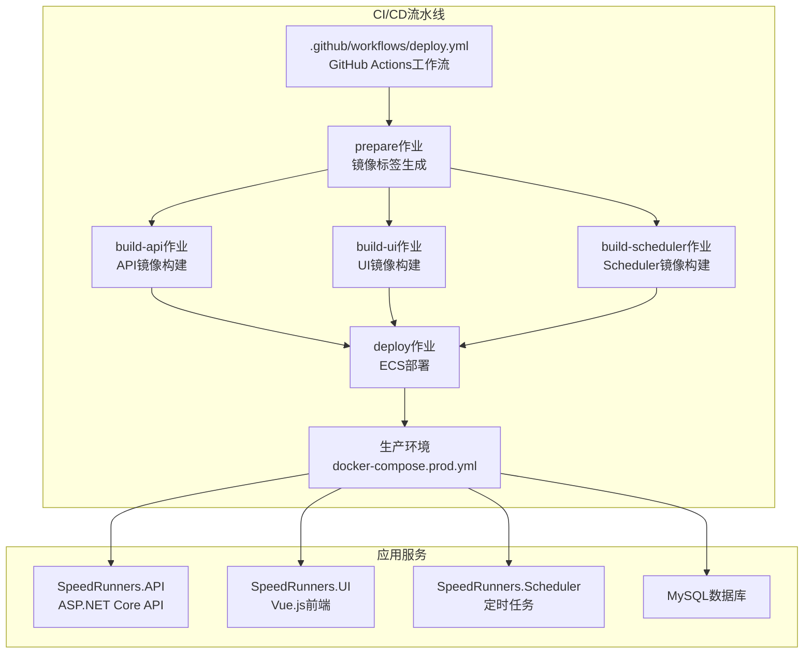
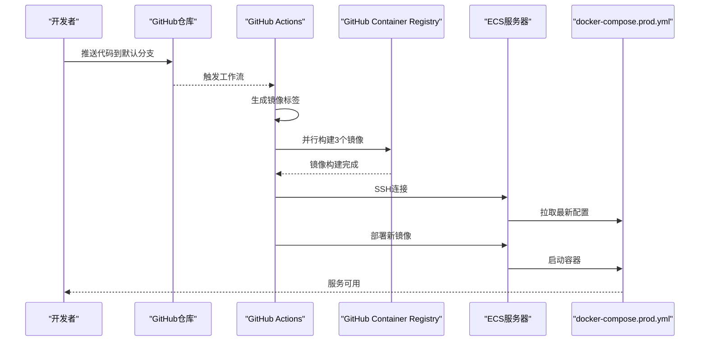
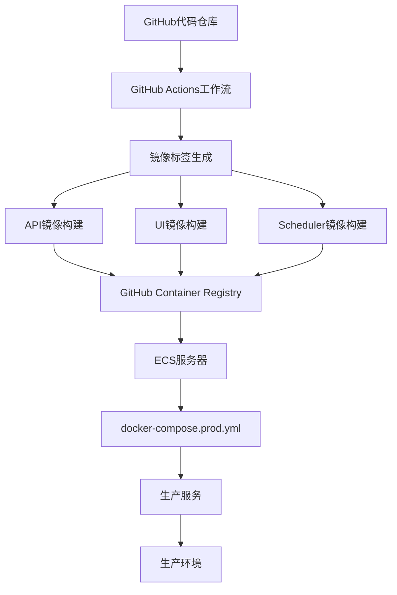

# 部署流水线

<cite>
**本文引用的文件**
- [README.md](file://README.md)
- [.github/workflows/deploy.yml](file://.github/workflows/deploy.yml)
- [docker-compose.prod.yml](file://docker-compose.prod.yml)
- [scripts/setup-ecs.sh](file://scripts/setup-ecs.sh)
- [scripts/recover.sh](file://scripts/recover.sh)
- [SpeedRunners.API/Dockerfile](file://SpeedRunners.API/Dockerfile)
- [SpeedRunners.UI/Dockerfile](file://SpeedRunners.UI/Dockerfile)
- [SpeedRunners.Scheduler/Dockerfile](file://SpeedRunners.Scheduler/Dockerfile)
- [SpeedRunners.UI/package.json](file://SpeedRunners.UI/package.json)
- [SpeedRunners.UI/jest.config.js](file://SpeedRunners.UI/jest.config.js)
- [SpeedRunners.UI/vue.config.js](file://SpeedRunners.UI/vue.config.js)
</cite>

## 更新摘要
**变更内容**
- 优化了GitHub Actions部署脚本中的git fetch命令，从固定master分支改为使用默认分支，提升部署流程的灵活性和维护性
- 镜像仓库从阿里云ACR迁移到GitHub Container Registry (ghcr.io)
- 更新GitHub Actions自动化部署工作流配置
- 修改生产环境容器编排以适配新的镜像仓库
- 更新ECS一键初始化脚本以支持新的部署流程
- 优化环境变量管理和部署策略

## 目录
1. [简介](#简介)
2. [项目结构](#项目结构)
3. [核心组件](#核心组件)
4. [架构总览](#架构总览)
5. [详细组件分析](#详细组件分析)
6. [依赖关系分析](#依赖关系分析)
7. [性能考虑](#性能考虑)
8. [故障排查指南](#故障排查指南)
9. [结论](#结论)
10. [附录](#附录)

## 简介
本文档详细介绍SpeedRunnersLab的完整CI/CD部署流水线，涵盖从代码提交到生产环境部署的全流程。系统性梳理基于GitHub Actions的自动化部署工作流、多阶段容器化构建、生产环境安全部署策略以及回滚机制。文档解析了新的部署架构如何替代传统手动部署流程，提供端到端的自动化解决方案。

**更新** 项目现已迁移到GitHub Container Registry (ghcr.io)，提供更好的集成性和安全性。GitHub Actions部署脚本已优化git fetch命令，从固定master分支改为使用默认分支，提升部署流程的灵活性和维护性。

## 项目结构
项目采用微服务架构，包含前端Vue.js应用、后端ASP.NET Core API、定时任务服务和MySQL数据库。通过GitHub Actions实现自动化构建和部署，使用GitHub Container Registry (ghcr.io)作为私有镜像仓库，ECS作为生产部署环境。

**图表来源**
- [.github/workflows/deploy.yml:1-143](file://.github/workflows/deploy.yml#L1-L143)
- [docker-compose.prod.yml:1-75](file://docker-compose.prod.yml#L1-L75)

**章节来源**
- [README.md:1-5](file://README.md#L1-L5)

## 核心组件
- **自动化部署工作流**
  - 基于GitHub Actions的完整CI/CD流水线，支持手动触发和镜像标签管理
  - 三个服务并行构建，提高部署效率
  - 使用GitHub Container Registry (ghcr.io)作为镜像仓库
  - **优化**：git fetch命令使用默认分支，提升部署流程的灵活性
- **多阶段容器化**
  - API服务使用.NET SDK进行编译，运行时仅包含ASP.NET运行时
  - UI服务使用Node.js进行构建，运行时仅包含Nginx和静态资源
  - Scheduler服务使用.NET SDK进行编译，运行时包含.NET运行时
- **生产环境部署**
  - 使用docker-compose.prod.yml进行生产环境编排
  - 敏感配置文件仅在ECS本地挂载，确保安全性
  - 支持蓝绿部署和回滚机制
- **安全模型**
  - GitHub Actions Secrets加密存储
  - GitHub Container Registry (ghcr.io)私有镜像仓库
  - 敏感配置文件永不进入镜像和Git仓库

**更新** 镜像仓库从阿里云ACR迁移到GitHub Container Registry (ghcr.io)，提供更好的GitHub生态集成和安全性。GitHub Actions部署脚本已优化git fetch命令，从固定master分支改为使用默认分支。

**章节来源**
- [.github/workflows/deploy.yml:1-143](file://.github/workflows/deploy.yml#L1-L143)
- [SpeedRunners.API/Dockerfile:1-32](file://SpeedRunners.API/Dockerfile#L1-L32)
- [SpeedRunners.UI/Dockerfile:1-29](file://SpeedRunners.UI/Dockerfile#L1-L29)
- [SpeedRunners.Scheduler/Dockerfile:1-24](file://SpeedRunners.Scheduler/Dockerfile#L1-L24)
- [docker-compose.prod.yml:1-75](file://docker-compose.prod.yml#L1-L75)

## 架构总览
新的部署流水线采用"代码提交 -> 自动构建 -> 镜像推送 -> ECS部署 -> 服务启动"的完整流程。通过GitHub Actions实现端到端自动化，替代传统的手动部署方式。

**图表来源**
- [.github/workflows/deploy.yml:1-143](file://.github/workflows/deploy.yml#L1-L143)
- [docker-compose.prod.yml:27-69](file://docker-compose.prod.yml#L27-L69)

## 详细组件分析

### GitHub Actions自动化部署工作流
- **触发机制**
  - 仅支持手动触发，通过workflow_dispatch事件
  - 支持自定义镜像标签，留空则使用git短sha
- **镜像标签管理**
  - prepare作业负责生成统一的镜像标签
  - 支持回滚功能，可指定历史版本标签
  - 使用GitHub Actor作为镜像仓库的所有者
- **并行构建策略**
  - build-api、build-ui、build-scheduler三个作业并行执行
  - 每个服务独立构建，提高整体效率
  - 使用GitHub Actions缓存优化构建性能
- **部署策略**
  - deploy作业通过SSH连接ECS服务器
  - **优化**：使用git fetch origin获取默认分支，提升部署灵活性
  - 自动拉取最新配置文件和镜像
  - 支持容器健康检查和状态监控

**更新** 工作流现在使用GitHub Container Registry (ghcr.io)作为镜像仓库，使用GITHUB_TOKEN进行认证。git fetch命令已优化为使用默认分支，提升部署流程的灵活性和维护性。

**章节来源**
- [.github/workflows/deploy.yml:1-143](file://.github/workflows/deploy.yml#L1-L143)

### 多阶段容器化构建
- **API服务构建**
  - Build阶段：使用.NET SDK 3.1进行NuGet包还原和发布
  - Runtime阶段：仅包含ASP.NET 3.1运行时，减小镜像体积
  - 支持多架构缓存优化
- **UI服务构建**
  - Build阶段：使用Node.js 16.14.0进行yarn install和构建
  - Runtime阶段：仅包含Nginx stable-alpine和构建产物
  - 支持OpenSSL Legacy Provider兼容性
- **Scheduler服务构建**
  - Build阶段：使用.NET SDK 3.1进行编译和发布
  - Runtime阶段：包含.NET 3.1运行时
  - 支持独立的配置文件挂载

**章节来源**
- [SpeedRunners.API/Dockerfile:1-32](file://SpeedRunners.API/Dockerfile#L1-L32)
- [SpeedRunners.UI/Dockerfile:1-29](file://SpeedRunners.UI/Dockerfile#L1-L29)
- [SpeedRunners.Scheduler/Dockerfile:1-24](file://SpeedRunners.Scheduler/Dockerfile#L1-L24)

### 生产环境部署策略
- **容器编排**
  - 使用docker-compose.prod.yml进行生产环境编排
  - 所有服务从GitHub Container Registry (ghcr.io)拉取镜像，不再本地构建
  - 支持环境变量注入和配置文件挂载
- **安全配置**
  - 敏感配置文件仅在ECS本地挂载，不在镜像中
  - MySQL数据目录持久化存储
  - SSL证书和配置文件单独管理
- **网络架构**
  - 所有服务运行在同一个bridge网络中
  - 支持extra_hosts配置，便于开发调试

**更新** 容器编排现在使用GitHub Container Registry (ghcr.io)作为镜像源，环境变量配置更加灵活。

**章节来源**
- [docker-compose.prod.yml:1-75](file://docker-compose.prod.yml#L1-L75)

### ECS一键初始化脚本
- **环境准备**
  - 自动检查Docker和Git环境
  - 将目录改造成Git仓库并绑定远程仓库
  - 安装docker compose v2插件
- **GHCR配置**
  - 引导用户输入GitHub Container Registry (ghcr.io)信息
  - 自动设置环境变量GHCR_OWNER
  - 验证部署环境配置
- **配置检查**
  - 检查敏感配置文件是否存在
  - 提示缺失的配置文件
  - 清理旧的本地构建产物

**更新** 脚本现在专门针对GitHub Container Registry (ghcr.io)进行配置，移除了阿里云ACR相关配置。脚本中仍使用固定的master分支引用，但整体部署流程已优化。

**章节来源**
- [scripts/setup-ecs.sh:1-146](file://scripts/setup-ecs.sh#L1-L146)

### 自动化测试配置
- **测试框架**
  - Jest单元测试框架，支持Vue组件测试
  - 支持ES6+语法和TypeScript测试文件
- **测试配置**
  - 支持.vue文件的vue-jest转换器
  - 静态资源使用jest-transform-stub
  - 模块映射到src目录
- **覆盖率报告**
  - 收集src/utils和src/components目录覆盖率
  - 排除认证和请求工具文件
  - 生成lcov和text-summary报告格式

**章节来源**
- [SpeedRunners.UI/jest.config.js:1-25](file://SpeedRunners.UI/jest.config.js#L1-L25)
- [SpeedRunners.UI/package.json:6-13](file://SpeedRunners.UI/package.json#L6-L13)

### 构建与产物优化
- **Vue CLI配置**
  - 输出目录dist，静态资源目录static
  - 生产环境关闭SourceMap，提高构建速度
  - 分包策略：第三方库和公共组件分离
- **开发体验**
  - 开发模式开启ESLint校验
  - SVG Sprite Loader配置
  - 运行时chunk单独提取

**章节来源**
- [SpeedRunners.UI/vue.config.js:45-47](file://SpeedRunners.UI/vue.config.js#L45-L47)
- [SpeedRunners.UI/vue.config.js:107-126](file://SpeedRunners.UI/vue.config.js#L107-L126)

## 依赖关系分析
新的部署架构建立了清晰的依赖关系链，从代码到生产的完整自动化流程。

**图表来源**
- [.github/workflows/deploy.yml:18-31](file://.github/workflows/deploy.yml#L18-L31)
- [docker-compose.prod.yml:27-69](file://docker-compose.prod.yml#L27-L69)

**章节来源**
- [.github/workflows/deploy.yml:1-143](file://.github/workflows/deploy.yml#L1-L143)
- [docker-compose.prod.yml:1-75](file://docker-compose.prod.yml#L1-L75)

## 性能考虑
- **构建性能**
  - 多阶段构建减少镜像体积和构建时间
  - 并行构建三个服务，提高整体效率
  - GitHub Actions缓存优化
  - GitHub Container Registry就近访问优化
- **运行性能**
  - 生产环境使用轻量级Nginx运行时
  - 容器资源隔离和限制
  - 蓝绿部署支持零停机切换
- **部署性能**
  - 镜像层缓存复用
  - ECS本地缓存优化
  - SSH连接复用
  - **优化**：git fetch使用默认分支，避免分支名称变更导致的部署失败

**更新** GitHub Container Registry (ghcr.io)提供更好的全球访问性能和缓存优化。git fetch命令已优化为使用默认分支，提升部署流程的灵活性和维护性。

## 故障排查指南
- **GitHub Actions失败**
  - 检查Secret配置是否正确
  - 验证GitHub Container Registry认证
  - 查看具体作业的详细日志
- **镜像构建失败**
  - 确认.NET SDK版本兼容性
  - 检查Node.js依赖安装
  - 验证构建命令正确性
- **ECS部署失败**
  - 检查SSH连接和权限
  - 验证docker-compose配置
  - 查看容器日志和状态
  - **新增**：检查默认分支配置，确保git fetch能够正确获取代码
- **容器启动失败**
  - 检查敏感配置文件挂载
  - 验证网络连接和端口
  - 查看应用日志和错误信息

**更新** 新增GitHub Container Registry (ghcr.io)相关的故障排查指导。新增默认分支相关的故障排查步骤。

**章节来源**
- [.github/workflows/deploy.yml:111-143](file://.github/workflows/deploy.yml#L111-L143)

## 结论
新的GitHub Actions自动化部署流水线提供了完整的CI/CD解决方案，替代了传统的手动部署流程。通过多阶段容器化构建、生产环境安全部署和回滚机制，显著提高了部署效率和可靠性。GitHub Container Registry (ghcr.io)的使用提供了更好的集成性和安全性。ECS一键初始化脚本简化了环境准备，配合安全的配置管理模式，确保了生产环境的安全性和稳定性。

**更新** 镜像仓库迁移到GitHub Container Registry (ghcr.io)后，部署流程更加简洁高效，减少了外部依赖和配置复杂度。git fetch命令已优化为使用默认分支，进一步提升了部署流程的灵活性和维护性。

## 附录

### 部署前准备清单
- **GitHub配置**
  - 创建GitHub Container Registry (ghcr.io)私有仓库
  - 配置GitHub Actions Secrets
  - 设置SSH密钥对
- **ECS环境**
  - 安装Docker和docker-compose
  - 准备敏感配置文件
  - 配置SSL证书
- **项目配置**
  - 验证Dockerfile配置
  - 检查docker-compose.prod.yml
  - 准备部署脚本
  - **新增**：确认默认分支配置正确

**更新** 移除了阿里云ACR相关的配置要求，新增GitHub Container Registry (ghcr.io)相关配置。新增默认分支配置检查项。

### 部署策略建议
- **蓝绿部署**
  - 使用两个独立的部署环境
  - 通过负载均衡器切换流量
  - 支持快速回滚
- **滚动更新**
  - 逐步替换容器实例
  - 保持服务可用性
  - 减少部署风险
- **回滚机制**
  - 保留最近几个版本镜像
  - 支持历史版本标签
  - 自动化回滚流程

### 安全最佳实践
- **凭据管理**
  - 使用GitHub Actions Secrets
  - 定期轮换GitHub Token
  - 最小权限原则
- **镜像安全**
  - 使用官方基础镜像
  - 定期扫描镜像漏洞
  - 最小化攻击面
- **网络隔离**
  - 使用独立的bridge网络
  - 配置防火墙规则
  - SSL/TLS加密传输

**更新** 安全配置现在基于GitHub Container Registry (ghcr.io)的最佳实践。

**章节来源**
- [.github/workflows/deploy.yml:12-15](file://.github/workflows/deploy.yml#L12-L15)