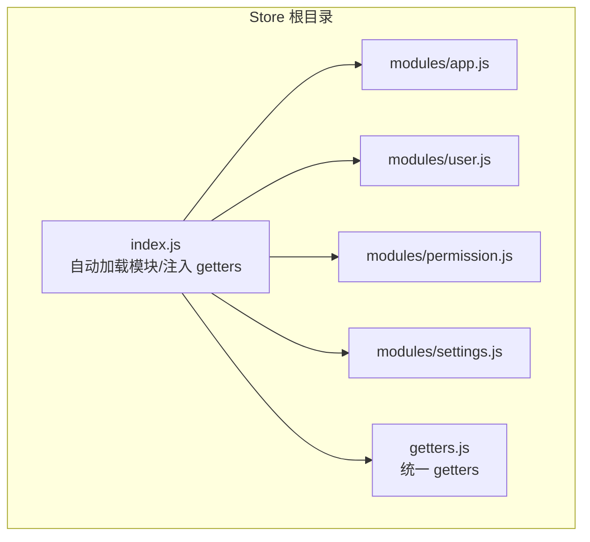
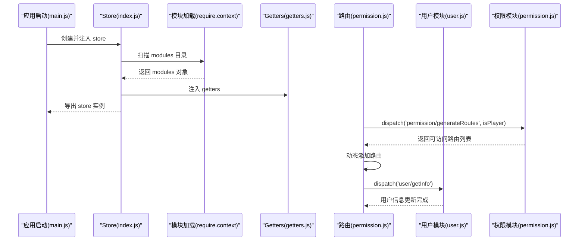
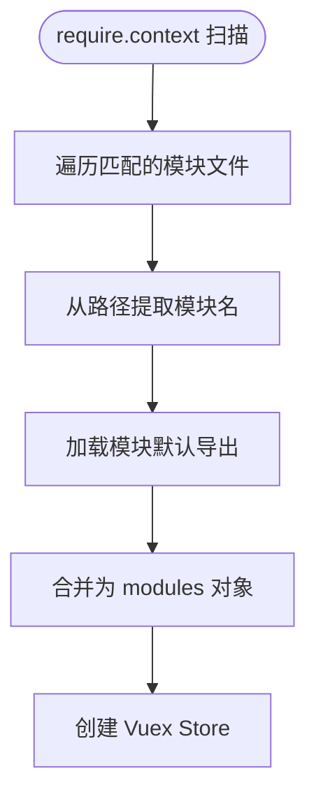
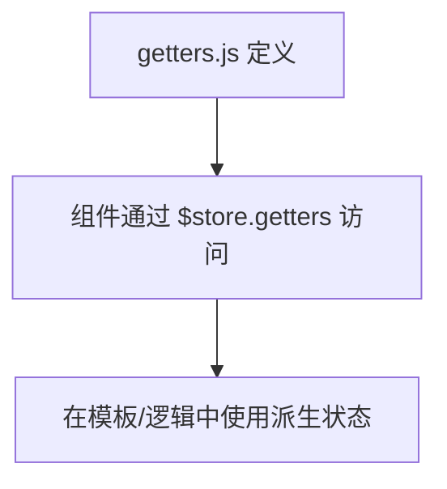
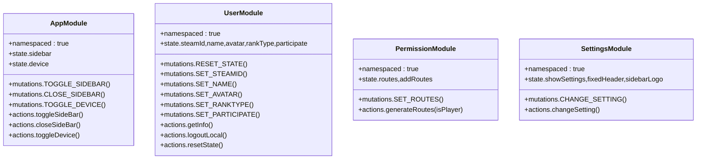
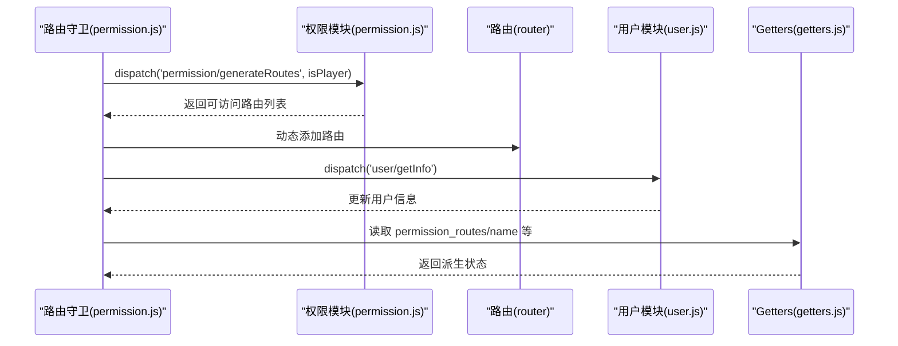
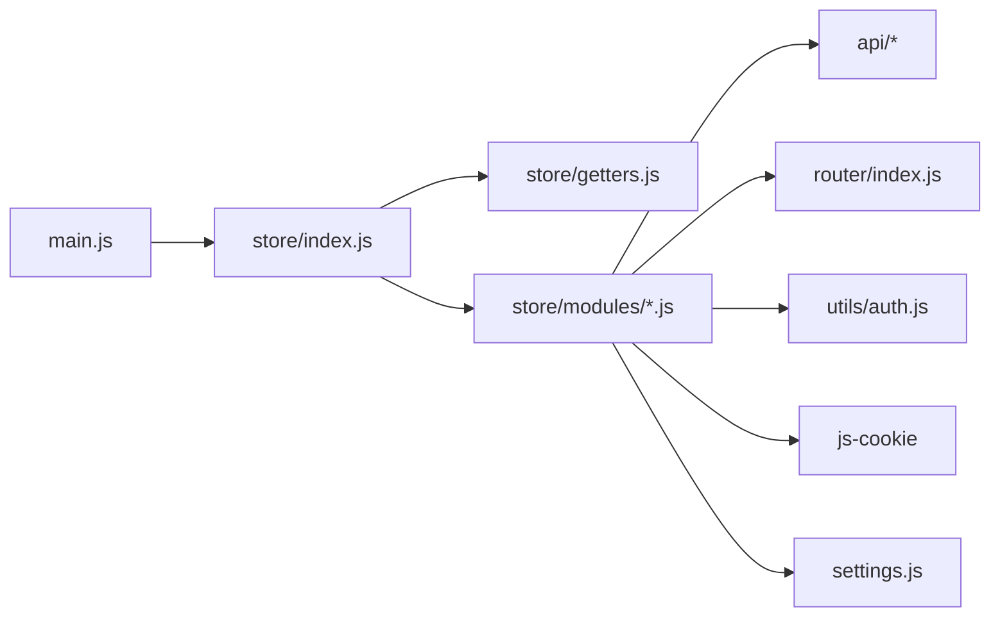

# Vuex Store 架构

<cite>
**本文引用的文件**
- [store/index.js](file://SpeedRunners.UI/src/store/index.js)
- [store/getters.js](file://SpeedRunners.UI/src/store/getters.js)
- [store/modules/app.js](file://SpeedRunners.UI/src/store/modules/app.js)
- [store/modules/user.js](file://SpeedRunners.UI/src/store/modules/user.js)
- [store/modules/permission.js](file://SpeedRunners.UI/src/store/modules/permission.js)
- [store/modules/settings.js](file://SpeedRunners.UI/src/store/modules/settings.js)
- [main.js](file://SpeedRunners.UI/src/main.js)
- [permission.js](file://SpeedRunners.UI/src/permission.js)
- [utils/auth.js](file://SpeedRunners.UI/src/utils/auth.js)
- [settings.js](file://SpeedRunners.UI/src/settings.js)
</cite>

## 目录
1. [引言](#引言)
2. [项目结构](#项目结构)
3. [核心组件](#核心组件)
4. [架构总览](#架构总览)
5. [详细组件分析](#详细组件分析)
6. [依赖关系分析](#依赖关系分析)
7. [性能考量](#性能考量)
8. [故障排查指南](#故障排查指南)
9. [结论](#结论)
10. [附录](#附录)

## 引言
本文件系统性梳理 SpeedRunnersLab 前端（Vue）应用中基于 Vuex 的模块化 Store 架构，重点覆盖以下方面：
- 自动模块加载机制的实现原理与配置方式
- Store 初始化流程、模块动态导入与命名空间管理策略
- Getters 统一管理与全局访问模式
- 模块间通信机制与数据流向
- 性能优化策略与最佳实践
- 架构扩展与维护指导原则

该架构以“约定优于配置”为核心：通过 Webpack 的 require.context 动态扫描模块目录，结合命名空间隔离，形成清晰、可扩展的状态管理模式。

## 项目结构
SpeedRunners.UI/src/store 目录采用模块化组织，包含：
- 根入口：index.js 负责自动加载模块、注入 getters 并创建 Store 实例
- 模块：modules 目录下按功能拆分 app、user、permission、settings 等
- 全局 Getters：getters.js 提供跨模块的统一访问入口
- 应用启动：main.js 将 store 注入根实例
- 权限集成：permission.js 在路由守卫中调用 store 的 action 生成动态路由

图表来源
- [store/index.js](file://SpeedRunners.UI/src/store/index.js#L1-L25)
- [store/getters.js](file://SpeedRunners.UI/src/store/getters.js#L1-L11)
- [store/modules/app.js](file://SpeedRunners.UI/src/store/modules/app.js#L1-L48)
- [store/modules/user.js](file://SpeedRunners.UI/src/store/modules/user.js#L1-L88)
- [store/modules/permission.js](file://SpeedRunners.UI/src/store/modules/permission.js#L1-L42)
- [store/modules/settings.js](file://SpeedRunners.UI/src/store/modules/settings.js#L1-L30)

章节来源
- [store/index.js](file://SpeedRunners.UI/src/store/index.js#L1-L25)
- [store/getters.js](file://SpeedRunners.UI/src/store/getters.js#L1-L11)
- [store/modules/app.js](file://SpeedRunners.UI/src/store/modules/app.js#L1-L48)
- [store/modules/user.js](file://SpeedRunners.UI/src/store/modules/user.js#L1-L88)
- [store/modules/permission.js](file://SpeedRunners.UI/src/store/modules/permission.js#L1-L42)
- [store/modules/settings.js](file://SpeedRunners.UI/src/store/modules/settings.js#L1-L30)
- [main.js](file://SpeedRunners.UI/src/main.js#L1-L30)

## 核心组件
- 自动模块加载器（Webpack require.context）
  - 作用：扫描 modules 目录，按文件名推导模块名，统一导出默认模块对象
  - 关键点：使用正则匹配 .js 文件；通过模块路径解析模块名；将模块默认导出挂载到 modules 对象
- Getters 统一入口
  - 作用：集中暴露常用派生状态，如侧边栏状态、设备类型、用户信息、权限路由等
  - 访问方式：通过 store.getters.xxx 或在组件中 mapGetters 使用
- 命名空间模块
  - 所有模块均启用 namespaced: true，避免状态/动作/提交的命名冲突
- 根 Store 配置
  - 将 modules 与 getters 注入，形成完整的状态树

章节来源
- [store/index.js](file://SpeedRunners.UI/src/store/index.js#L7-L18)
- [store/getters.js](file://SpeedRunners.UI/src/store/getters.js#L1-L11)

## 架构总览
下图展示从应用启动到模块加载、路由守卫触发、动态路由注入与用户信息拉取的整体流程。

图表来源
- [main.js](file://SpeedRunners.UI/src/main.js#L23-L30)
- [store/index.js](file://SpeedRunners.UI/src/store/index.js#L1-L25)
- [store/getters.js](file://SpeedRunners.UI/src/store/getters.js#L1-L11)
- [store/modules/user.js](file://SpeedRunners.UI/src/store/modules/user.js#L37-L81)
- [store/modules/permission.js](file://SpeedRunners.UI/src/store/modules/permission.js#L21-L35)
- [permission.js](file://SpeedRunners.UI/src/permission.js#L13-L60)

## 详细组件分析

### 自动模块加载机制
- 工作原理
  - 使用 require.context("./modules", true, /\.js$/) 扫描 modules 目录及其子目录
  - 通过 reduce 将模块路径映射为模块名，并取模块的 default 导出
  - 最终得到一个模块名到模块对象的映射，作为 Vuex 的 modules 传入
- 配置要点
  - 目录结构必须遵循“文件名即模块名”的约定
  - 每个模块需默认导出包含 state、mutations、actions、namespaced 的对象
- 优点
  - 无需手动 import 每个模块，降低维护成本
  - 新增模块只需放入 modules 目录即可生效

图表来源
- [store/index.js](file://SpeedRunners.UI/src/store/index.js#L8-L18)

章节来源
- [store/index.js](file://SpeedRunners.UI/src/store/index.js#L7-L18)

### Getters 统一管理与全局访问
- 统一入口
  - getters.js 将来自不同模块的状态以统一键名暴露，便于组件直接访问
  - 典型键：sidebar、device、steamId、avatar、name、rankType、participate、permission_routes
- 访问方式
  - 在组件中可通过 this.$store.getters.xxx 或 mapGetters 辅助方法使用
  - 由于模块启用命名空间，组件通常通过命名空间访问：this.$store.getters['permission/permission_routes']

图表来源
- [store/getters.js](file://SpeedRunners.UI/src/store/getters.js#L1-L11)

章节来源
- [store/getters.js](file://SpeedRunners.UI/src/store/getters.js#L1-L11)

### 模块命名空间与职责划分
- app 模块
  - 职责：管理侧边栏开关、设备类型等 UI 状态
  - 关键点：使用 Cookie 同步侧边栏状态；开启/关闭侧边栏时持久化
- user 模块
  - 职责：用户信息、头像、昵称、Steam ID、等级类型、参与次数等
  - 关键点：提供 getInfo、logoutLocal、resetState 等动作；与后端 API 交互
- permission 模块
  - 职责：根据角色生成可访问路由集合，合并常量路由与动态路由
  - 关键点：将 404 路由置于末尾；支持导航栏 children 合并
- settings 模块
  - 职责：主题设置（是否固定头部、侧边栏 Logo 等）
  - 关键点：通过 CHANGE_SETTING 动作统一修改设置项

图表来源
- [store/modules/app.js](file://SpeedRunners.UI/src/store/modules/app.js#L3-L48)
- [store/modules/user.js](file://SpeedRunners.UI/src/store/modules/user.js#L4-L88)
- [store/modules/permission.js](file://SpeedRunners.UI/src/store/modules/permission.js#L3-L42)
- [store/modules/settings.js](file://SpeedRunners.UI/src/store/modules/settings.js#L5-L30)

章节来源
- [store/modules/app.js](file://SpeedRunners.UI/src/store/modules/app.js#L1-L48)
- [store/modules/user.js](file://SpeedRunners.UI/src/store/modules/user.js#L1-L88)
- [store/modules/permission.js](file://SpeedRunners.UI/src/store/modules/permission.js#L1-L42)
- [store/modules/settings.js](file://SpeedRunners.UI/src/store/modules/settings.js#L1-L30)

### 模块间通信与数据流向
- 权限与路由
  - permission/generateRoutes 根据 isPlayer 决定是否加载异步路由
  - 生成后的路由集合通过 SET_ROUTES 合并至 state，并与常量路由整合
  - 路由守卫在首次进入时动态添加路由，确保导航正确
- 用户与权限
  - 登录成功后，permission 模块根据令牌与区域判断生成路由
  - user 模块在 getInfo 成功后，组件可读取 getters 中的 name、avatar 等派生状态
- 设置与 UI
  - settings 模块通过 changeSetting 修改 showSettings、fixedHeader、sidebarLogo
  - app 模块根据设备类型切换 UI 行为

图表来源
- [permission.js](file://SpeedRunners.UI/src/permission.js#L13-L60)
- [store/modules/permission.js](file://SpeedRunners.UI/src/store/modules/permission.js#L21-L35)
- [store/modules/user.js](file://SpeedRunners.UI/src/store/modules/user.js#L37-L81)
- [store/getters.js](file://SpeedRunners.UI/src/store/getters.js#L1-L11)

章节来源
- [permission.js](file://SpeedRunners.UI/src/permission.js#L1-L69)
- [store/modules/permission.js](file://SpeedRunners.UI/src/store/modules/permission.js#L1-L42)
- [store/modules/user.js](file://SpeedRunners.UI/src/store/modules/user.js#L1-L88)
- [store/getters.js](file://SpeedRunners.UI/src/store/getters.js#L1-L11)

## 依赖关系分析
- Store 初始化依赖
  - main.js 将 store 注入根实例，保证全局可用
  - index.js 依赖 getters.js 与 modules 下各模块
- 模块内部依赖
  - user 模块依赖 API 层（api/user），用于用户信息与登出
  - permission 模块依赖 router（router/index.js）中的常量与异步路由定义
  - settings 模块依赖 settings.js 默认配置
- 外部依赖
  - app 模块依赖 js-cookie 同步侧边栏状态
  - utils/auth.js 提供令牌与区域判断能力，影响权限生成

图表来源
- [main.js](file://SpeedRunners.UI/src/main.js#L7-L29)
- [store/index.js](file://SpeedRunners.UI/src/store/index.js#L1-L25)
- [store/modules/user.js](file://SpeedRunners.UI/src/store/modules/user.js#L1)
- [store/modules/permission.js](file://SpeedRunners.UI/src/store/modules/permission.js#L1)
- [utils/auth.js](file://SpeedRunners.UI/src/utils/auth.js#L1)
- [settings.js](file://SpeedRunners.UI/src/settings.js#L1)

章节来源
- [main.js](file://SpeedRunners.UI/src/main.js#L1-L30)
- [store/index.js](file://SpeedRunners.UI/src/store/index.js#L1-L25)
- [store/modules/user.js](file://SpeedRunners.UI/src/store/modules/user.js#L1-L88)
- [store/modules/permission.js](file://SpeedRunners.UI/src/store/modules/permission.js#L1-L42)
- [utils/auth.js](file://SpeedRunners.UI/src/utils/auth.js#L1-L45)
- [settings.js](file://SpeedRunners.UI/src/settings.js#L1-L16)

## 性能考量
- 模块懒加载与按需引入
  - 当前自动加载是构建期扫描，建议配合路由级别的代码分割，减少首屏体积
- Getters 缓存与计算优化
  - 对于复杂派生状态，可在模块内部增加缓存或使用计算属性替代频繁计算
- Mutation 粒度控制
  - 将大对象一次性重置（如 RESET_STATE）与细粒度字段更新结合使用，避免不必要的响应式开销
- 路由动态注入时机
  - 在路由守卫中仅在必要时生成并注入路由，避免重复添加
- Cookie 同步频率
  - 侧边栏状态写入 Cookie 频率较高，建议节流或去抖，降低 IO 压力

## 故障排查指南
- 模块未生效
  - 检查 modules 下文件命名是否符合“文件名即模块名”的约定
  - 确认模块默认导出包含 namespaced、state、mutations、actions
- Getters 访问报错
  - 确认组件使用命名空间访问（如 'permission/permission_routes'）
  - 检查 getters.js 是否正确导出目标键
- 登录后路由不更新
  - 检查 permission/generateRoutes 的 isPlayer 判定与 isInChina 的网络请求
  - 确认路由守卫中动态添加路由的逻辑顺序
- 用户信息未更新
  - 检查 user/getInfo 的 API 返回结构与字段映射
  - 确认异常分支是否触发了 resetState

章节来源
- [store/index.js](file://SpeedRunners.UI/src/store/index.js#L12-L18)
- [store/getters.js](file://SpeedRunners.UI/src/store/getters.js#L1-L11)
- [permission.js](file://SpeedRunners.UI/src/permission.js#L13-L60)
- [store/modules/user.js](file://SpeedRunners.UI/src/store/modules/user.js#L37-L81)

## 结论
该 Vuex Store 架构通过自动模块加载与命名空间策略，实现了低耦合、易扩展的状态管理。配合路由守卫与权限模块，形成“登录鉴权—动态路由—用户信息—UI 设置”的完整闭环。建议在后续迭代中进一步结合路由懒加载与计算缓存，持续优化性能与可维护性。

## 附录
- 扩展与维护指导
  - 新增模块：在 modules 目录新增 .js 文件，默认导出含 namespaced 的对象
  - 新增 getters：在 getters.js 中追加派生状态键，保持命名语义化
  - 调整命名空间：组件中统一使用命名空间访问，避免跨模块误用
  - 配置中心：settings.js 作为全局配置入口，避免散落的硬编码