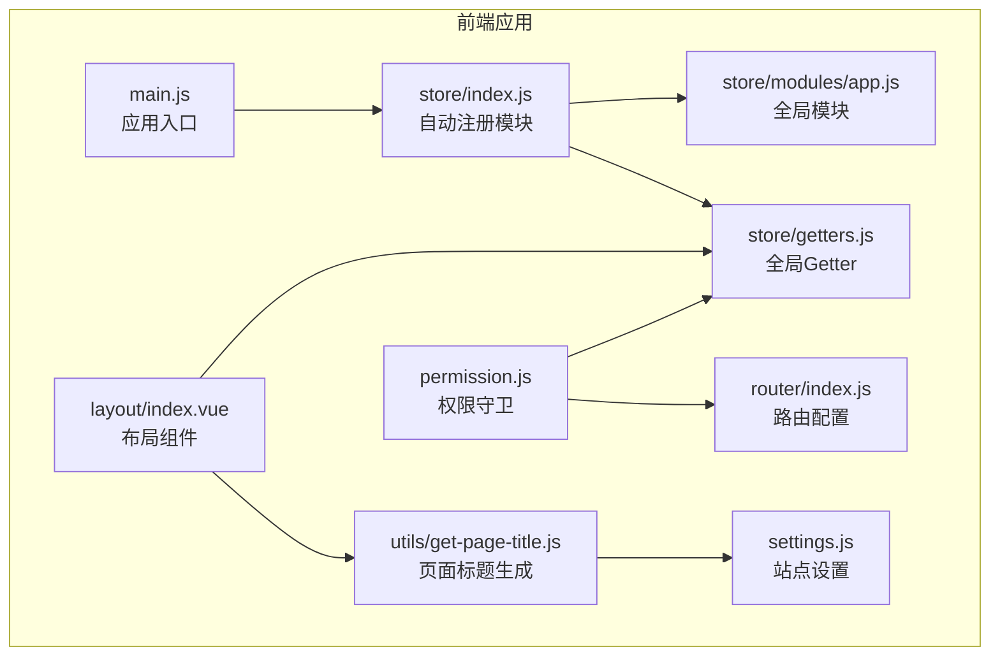
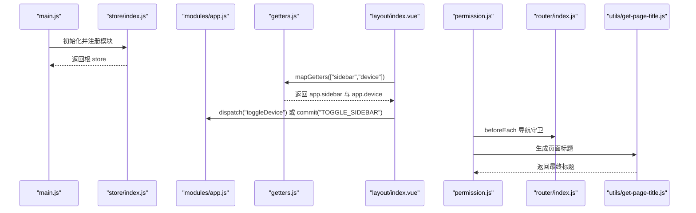
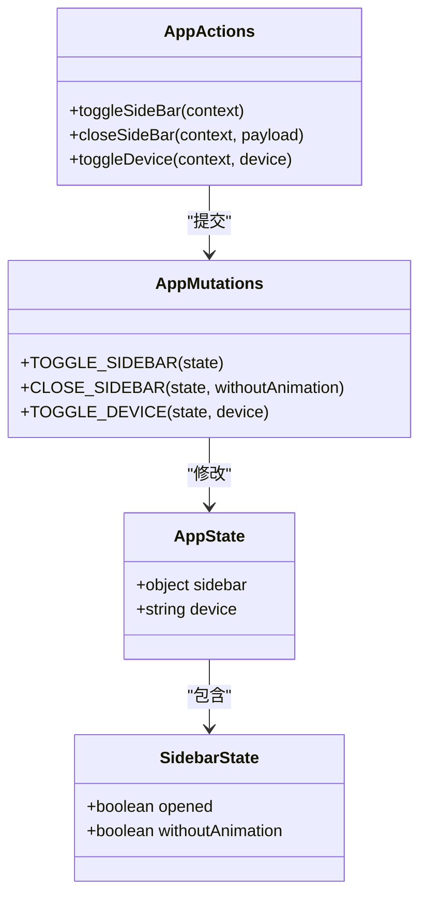
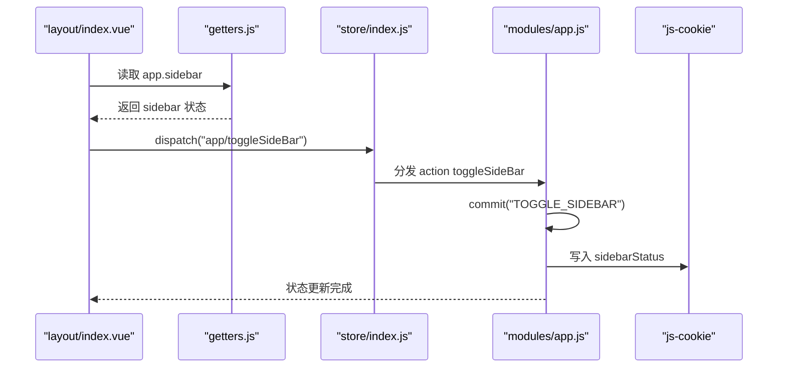
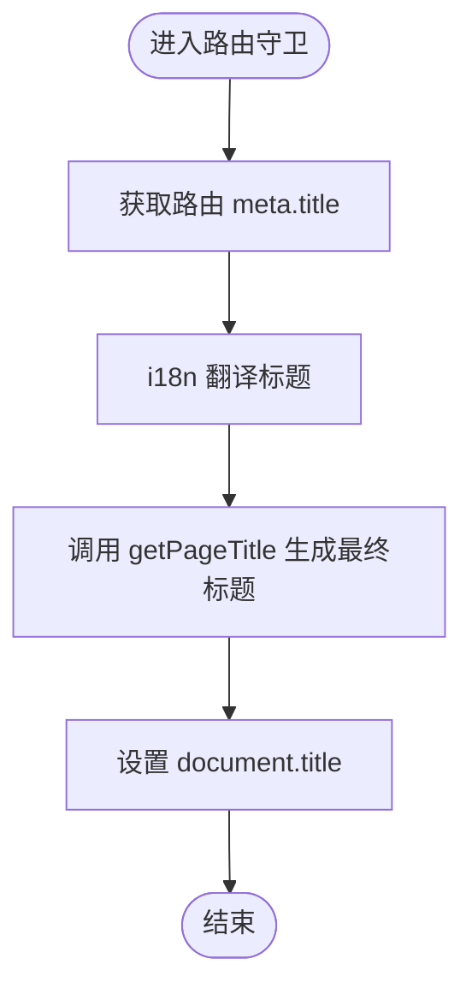

# 应用全局模块

<cite>
**本文引用的文件**
- [app.js](file://SpeedRunners.UI/src/store/modules/app.js)
- [index.js（Vuex Store）](file://SpeedRunners.UI/src/store/index.js)
- [getters.js](file://SpeedRunners.UI/src/store/getters.js)
- [main.js](file://SpeedRunners.UI/src/main.js)
- [layout/index.vue](file://SpeedRunners.UI/src/layout/index.vue)
- [permission.js](file://SpeedRunners.UI/src/permission.js)
- [router/index.js](file://SpeedRunners.UI/src/router/index.js)
- [get-page-title.js](file://SpeedRunners.UI/src/utils/get-page-title.js)
- [settings.js](file://SpeedRunners.UI/src/settings.js)
</cite>

## 目录
1. [简介](#简介)
2. [项目结构](#项目结构)
3. [核心组件](#核心组件)
4. [架构总览](#架构总览)
5. [详细组件分析](#详细组件分析)
6. [依赖分析](#依赖分析)
7. [性能考虑](#性能考虑)
8. [故障排查指南](#故障排查指南)
9. [结论](#结论)
10. [附录](#附录)

## 简介
本章节面向 SpeedRunnersLab 前端应用的“应用全局模块”，聚焦于 store/modules/app.js 的设计目的与功能边界，系统阐述其状态集中管理职责、核心状态字段、mutations 与 actions 的实现细节、与其它模块的交互关系以及数据共享机制。同时结合路由、布局、权限控制与页面标题生成等模块，给出状态使用的最佳实践与注意事项。

## 项目结构
应用采用 Vue + Vuex 架构，全局模块位于 store/modules/app.js，通过 store/index.js 自动注册所有模块，并通过 getters.js 提供统一的派生状态访问入口。页面标题由 utils/get-page-title.js 结合 settings.js 中的默认站点标题生成，路由配置在 router/index.js 中定义，权限流程在 permission.js 中串联路由守卫与用户信息获取。

图表来源
- [main.js](file://SpeedRunners.UI/src/main.js#L1-L30)
- [index.js（Vuex Store）](file://SpeedRunners.UI/src/store/index.js#L1-L25)
- [app.js](file://SpeedRunners.UI/src/store/modules/app.js#L1-L48)
- [getters.js](file://SpeedRunners.UI/src/store/getters.js#L1-L11)
- [layout/index.vue](file://SpeedRunners.UI/src/layout/index.vue#L1-L355)
- [router/index.js](file://SpeedRunners.UI/src/router/index.js#L1-L133)
- [permission.js](file://SpeedRunners.UI/src/permission.js#L1-L69)
- [get-page-title.js](file://SpeedRunners.UI/src/utils/get-page-title.js#L1-L11)
- [settings.js](file://SpeedRunners.UI/src/settings.js#L1-L16)

章节来源
- [main.js](file://SpeedRunners.UI/src/main.js#L1-L30)
- [index.js（Vuex Store）](file://SpeedRunners.UI/src/store/index.js#L1-L25)

## 核心组件
本节聚焦 app.js 模块，说明其职责、状态字段、变更方法与异步处理策略，并指出其与其它模块的耦合点与协作方式。

- 设计目的与范围
  - 职责：集中管理应用级 UI 状态与设备信息，提供切换侧边栏、关闭侧边栏、切换设备类型等动作接口。
  - 作用域：仅包含与界面行为和设备相关的状态，不涉及业务数据或用户信息持久化。
- 核心状态字段
  - sidebar.opened：布尔值，表示侧边栏是否展开；初始值从 Cookie 读取，若无则默认展开。
  - sidebar.withoutAnimation：布尔值，用于控制侧边栏切换动画行为。
  - device：字符串，当前设备类型（如 desktop），用于响应式布局与交互适配。
- Mutations 实现
  - TOGGLE_SIDEBAR：切换 sidebar.opened 并同步写入 Cookie；重置 withoutAnimation。
  - CLOSE_SIDEBAR：强制关闭侧边栏并可选禁用动画；同时写入 Cookie。
  - TOGGLE_DEVICE：更新 device 字段。
- Actions 实现
  - toggleSideBar：提交 TOGGLE_SIDEBAR。
  - closeSideBar：提交 CLOSE_SIDEBAR，支持传入 withoutAnimation。
  - toggleDevice：提交 TOGGLE_DEVICE，支持传入目标设备类型。
- 与其它模块的交互
  - 与 store/index.js：通过命名空间 namespaced: true 与自动注册机制配合，被统一注入到根 store。
  - 与 getters.js：通过 getters 暴露 sidebar 与 device，供布局与组件计算属性使用。
  - 与 layout/index.vue：布局组件通过 mapGetters 获取 app.sidebar 与 app.device，驱动 UI 行为。
  - 与 permission.js：权限守卫在路由跳转时可能间接影响 UI 状态（例如主题、语言切换触发的标题更新）。
  - 与 utils/get-page-title.js：页面标题生成依赖 settings.js 默认标题，与 app 模块无直接耦合，但共同参与页面元信息渲染。

章节来源
- [app.js](file://SpeedRunners.UI/src/store/modules/app.js#L1-L48)
- [getters.js](file://SpeedRunners.UI/src/store/getters.js#L1-L11)
- [layout/index.vue](file://SpeedRunners.UI/src/layout/index.vue#L260-L335)
- [permission.js](file://SpeedRunners.UI/src/permission.js#L1-L69)
- [get-page-title.js](file://SpeedRunners.UI/src/utils/get-page-title.js#L1-L11)
- [settings.js](file://SpeedRunners.UI/src/settings.js#L1-L16)

## 架构总览
下图展示了 app 模块在前端应用中的角色与交互路径：从入口初始化到布局消费状态，再到权限守卫与页面标题生成的协同。

图表来源
- [main.js](file://SpeedRunners.UI/src/main.js#L1-L30)
- [index.js（Vuex Store）](file://SpeedRunners.UI/src/store/index.js#L1-L25)
- [app.js](file://SpeedRunners.UI/src/store/modules/app.js#L1-L48)
- [getters.js](file://SpeedRunners.UI/src/store/getters.js#L1-L11)
- [layout/index.vue](file://SpeedRunners.UI/src/layout/index.vue#L260-L335)
- [permission.js](file://SpeedRunners.UI/src/permission.js#L1-L69)
- [router/index.js](file://SpeedRunners.UI/src/router/index.js#L1-L133)
- [get-page-title.js](file://SpeedRunners.UI/src/utils/get-page-title.js#L1-L11)

## 详细组件分析

### app.js 模块类图
该模块采用标准 Vuex 结构：state 定义状态树，mutations 描述同步变更，actions 描述异步与复合逻辑，最终通过导出 namespaced 模块供全局使用。

图表来源
- [app.js](file://SpeedRunners.UI/src/store/modules/app.js#L1-L48)

章节来源
- [app.js](file://SpeedRunners.UI/src/store/modules/app.js#L1-L48)

### 侧边栏切换序列图
演示从布局组件发起切换请求到状态持久化的完整流程。

图表来源
- [layout/index.vue](file://SpeedRunners.UI/src/layout/index.vue#L260-L335)
- [getters.js](file://SpeedRunners.UI/src/store/getters.js#L1-L11)
- [index.js（Vuex Store）](file://SpeedRunners.UI/src/store/index.js#L1-L25)
- [app.js](file://SpeedRunners.UI/src/store/modules/app.js#L1-L48)

章节来源
- [layout/index.vue](file://SpeedRunners.UI/src/layout/index.vue#L260-L335)
- [app.js](file://SpeedRunners.UI/src/store/modules/app.js#L1-L48)

### 页面标题生成流程图
页面标题由 settings.js 提供默认标题，结合 i18n 与路由 meta.title 生成最终标题，权限守卫在导航时负责设置 document.title。

图表来源
- [permission.js](file://SpeedRunners.UI/src/permission.js#L13-L18)
- [get-page-title.js](file://SpeedRunners.UI/src/utils/get-page-title.js#L1-L11)
- [settings.js](file://SpeedRunners.UI/src/settings.js#L1-L16)

章节来源
- [permission.js](file://SpeedRunners.UI/src/permission.js#L1-L69)
- [get-page-title.js](file://SpeedRunners.UI/src/utils/get-page-title.js#L1-L11)
- [settings.js](file://SpeedRunners.UI/src/settings.js#L1-L16)

## 依赖分析
- 模块内聚与耦合
  - app.js 与 cookies 的耦合：通过 js-cookie 同步 UI 状态到本地存储，降低刷新后状态丢失风险。
  - app.js 与 getters 的耦合：通过 getters 暴露 sidebar 与 device，供布局组件与其它模块读取。
  - app.js 与 store/index.js 的耦合：通过自动注册机制注入根 store，namespaced 保证命名隔离。
- 外部依赖与集成点
  - 与 layout/index.vue 的集成：布局组件通过 mapGetters 计算属性消费 app.sidebar 与 app.device。
  - 与 permission.js 的集成：权限守卫在导航时设置页面标题，间接影响用户体验一致性。
  - 与 router/index.js 的集成：路由配置决定页面标题与面包屑显示的基础元信息。
- 潜在循环依赖
  - 当前结构中不存在循环依赖：app.js 不依赖 layout 或 permission，布局与权限仅依赖 getters。
- 接口契约
  - app 模块对外暴露 namespaced 的模块接口，mutations 与 actions 保持单一职责，便于测试与维护。

章节来源
- [app.js](file://SpeedRunners.UI/src/store/modules/app.js#L1-L48)
- [getters.js](file://SpeedRunners.UI/src/store/getters.js#L1-L11)
- [index.js（Vuex Store）](file://SpeedRunners.UI/src/store/index.js#L1-L25)
- [layout/index.vue](file://SpeedRunners.UI/src/layout/index.vue#L260-L335)
- [permission.js](file://SpeedRunners.UI/src/permission.js#L1-L69)
- [router/index.js](file://SpeedRunners.UI/src/router/index.js#L1-L133)

## 性能考虑
- 状态粒度
  - app 模块仅包含 UI 与设备相关状态，避免将业务数据放入此处，有助于减少不必要的响应式开销。
- 持久化策略
  - 侧边栏状态通过 Cookie 持久化，减少每次刷新的计算成本；建议对频繁读写的键值进行最小化写入。
- 渲染优化
  - 通过 getters 将派生状态集中管理，避免在组件中重复计算；布局组件使用计算属性读取 app.sidebar 与 app.device，确保按需更新。
- 异步处理
  - app 模块的 actions 为轻量级包装，不引入复杂异步逻辑；如需扩展，建议将副作用抽离至独立模块并通过 actions 触发。

## 故障排查指南
- 侧边栏状态不同步
  - 现象：切换侧边栏后刷新页面状态恢复默认。
  - 排查：确认 Cookie 是否被禁用或跨域限制；检查 mutations 中 TOGGLE_SIDEBAR/CLOSE_SIDEBAR 是否正确写入 sidebarStatus。
  - 参考
    - [app.js](file://SpeedRunners.UI/src/store/modules/app.js#L11-L29)
- 页面标题未更新
  - 现象：切换语言或进入新路由后标题未变化。
  - 排查：确认 permission.js 中是否在 beforeEach 阶段设置了 document.title；检查 getPageTitle 与 settings.js 的组合逻辑。
  - 参考
    - [permission.js](file://SpeedRunners.UI/src/permission.js#L13-L18)
    - [get-page-title.js](file://SpeedRunners.UI/src/utils/get-page-title.js#L1-L11)
    - [settings.js](file://SpeedRunners.UI/src/settings.js#L1-L16)
- 设备类型未生效
  - 现象：移动端与桌面端样式未按预期切换。
  - 排查：确认是否调用了 toggleDevice；检查布局组件是否基于 app.device 进行条件渲染。
  - 参考
    - [app.js](file://SpeedRunners.UI/src/store/modules/app.js#L26-L28)
    - [layout/index.vue](file://SpeedRunners.UI/src/layout/index.vue#L260-L335)

章节来源
- [app.js](file://SpeedRunners.UI/src/store/modules/app.js#L1-L48)
- [permission.js](file://SpeedRunners.UI/src/permission.js#L1-L69)
- [get-page-title.js](file://SpeedRunners.UI/src/utils/get-page-title.js#L1-L11)
- [settings.js](file://SpeedRunners.UI/src/settings.js#L1-L16)
- [layout/index.vue](file://SpeedRunners.UI/src/layout/index.vue#L260-L335)

## 结论
app.js 全局模块以简洁的职责边界实现了应用级 UI 状态的集中管理，通过 mutations 与 actions 明确区分同步与异步操作，并借助 getters 与自动注册机制与布局、权限、路由等模块形成松耦合协作。建议在扩展时遵循单一职责原则，避免将业务数据混入全局模块，确保状态树清晰、可维护性强。

## 附录
- 最佳实践
  - 将 UI 状态与业务数据分离，保持全局模块的轻量化。
  - 使用 namespaced 命名空间避免状态键冲突。
  - 对需要持久化的 UI 状态（如侧边栏）采用 Cookie 或本地存储同步。
  - 在权限守卫中统一设置页面标题，确保国际化与多语言一致。
- 注意事项
  - mutations 必须为纯函数，避免副作用；异步逻辑放入 actions。
  - 严格控制 Cookie 写入频率，避免频繁 I/O 影响性能。
  - 组件中通过 getters 读取状态，避免直接访问深层嵌套对象导致的性能问题。