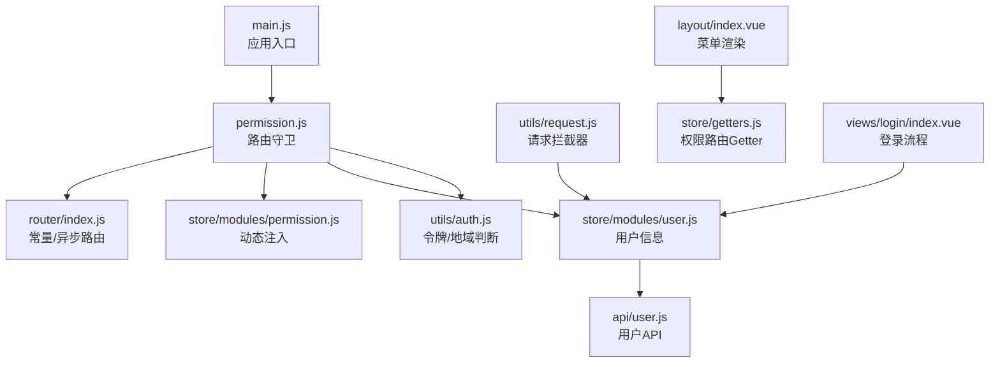
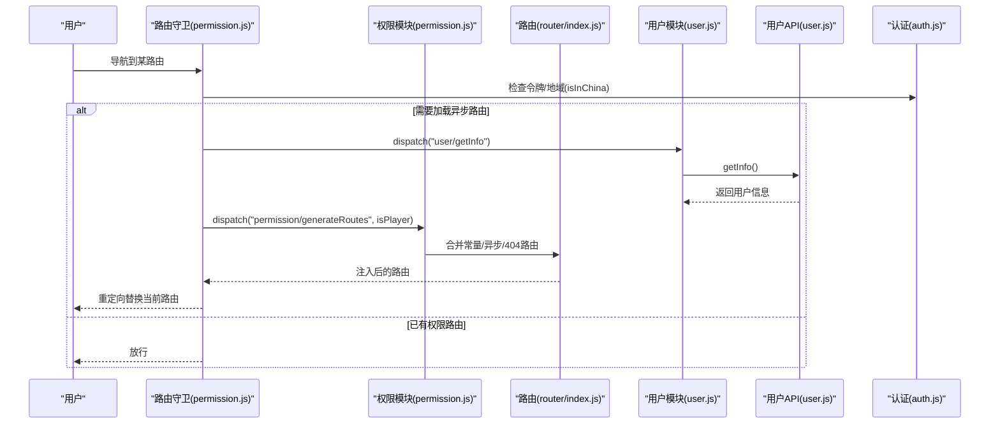
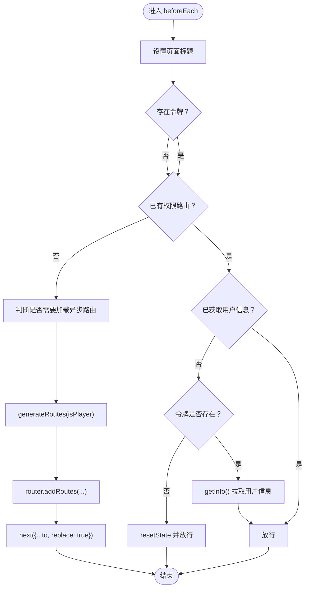
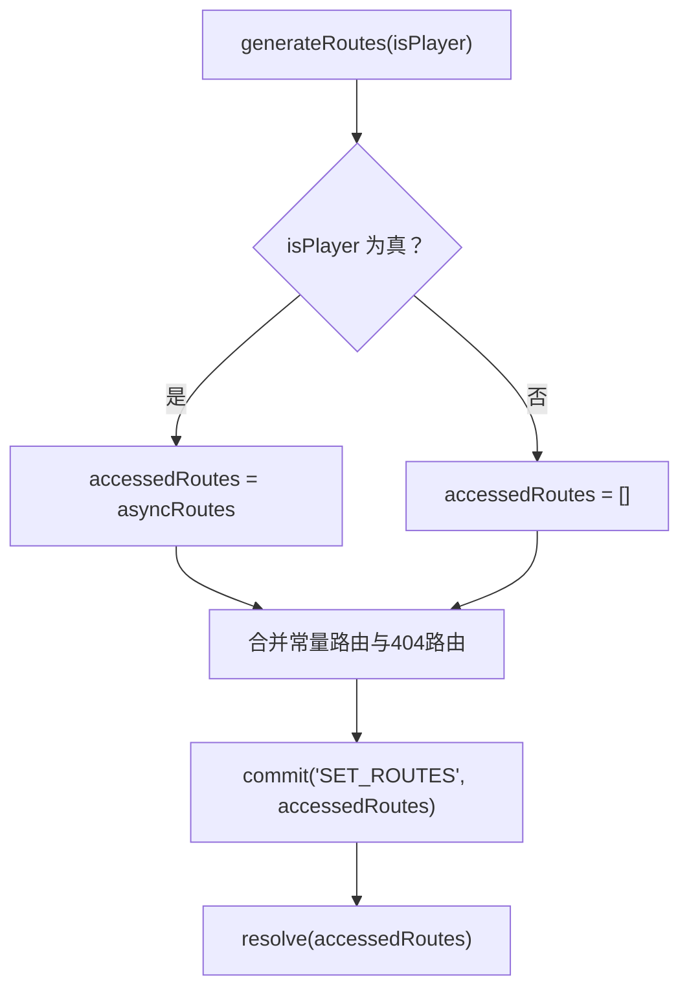
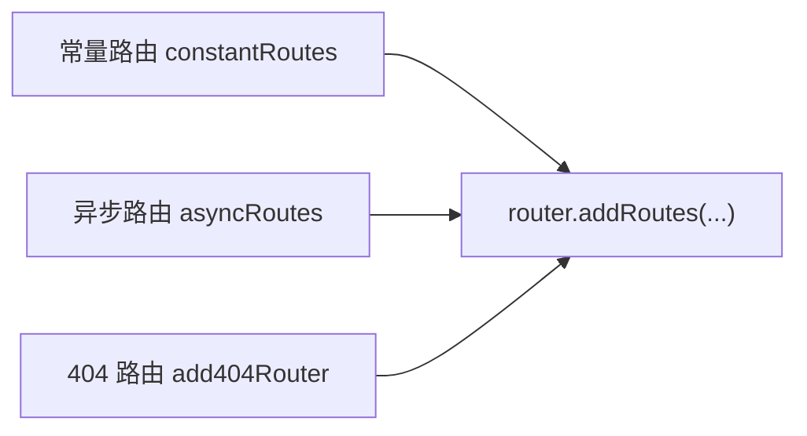
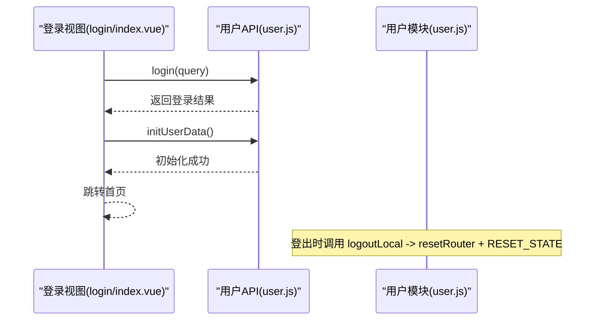
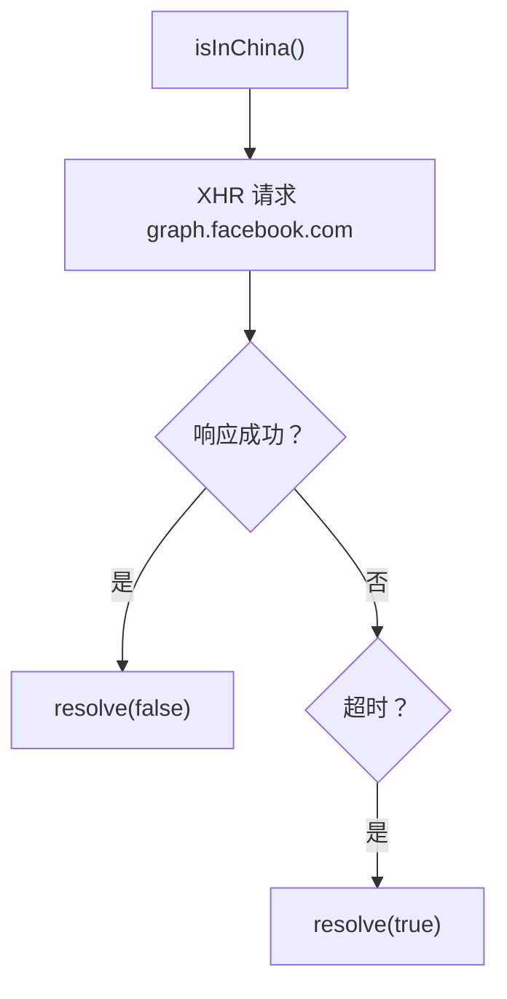
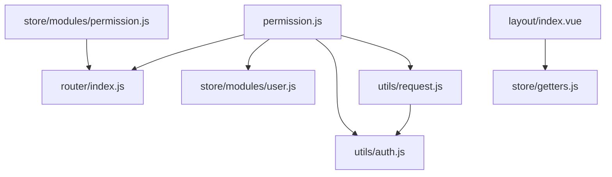

# 权限控制模块

<cite>
**本文引用的文件**
- [permission.js](file://SpeedRunners.UI/src/permission.js)
- [permission.js（store/modules）](file://SpeedRunners.UI/src/store/modules/permission.js)
- [router/index.js](file://SpeedRunners.UI/src/router/index.js)
- [user.js（store/modules）](file://SpeedRunners.UI/src/store/modules/user.js)
- [auth.js](file://SpeedRunners.UI/src/utils/auth.js)
- [user.js（api）](file://SpeedRunners.UI/src/api/user.js)
- [main.js](file://SpeedRunners.UI/src/main.js)
- [layout/index.vue](file://SpeedRunners.UI/src/layout/index.vue)
- [login/index.vue](file://SpeedRunners.UI/src/views/login/index.vue)
- [request.js](file://SpeedRunners.UI/src/utils/request.js)
- [getters.js](file://SpeedRunners.UI/src/store/getters.js)
- [zh.json](file://SpeedRunners.UI/src/i18n/lang/zh.json)
- [index.js（i18n）](file://SpeedRunners.UI/src/i18n/index.js)
</cite>

## 目录
1. [简介](#简介)
2. [项目结构](#项目结构)
3. [核心组件](#核心组件)
4. [架构总览](#架构总览)
5. [详细组件分析](#详细组件分析)
6. [依赖关系分析](#依赖关系分析)
7. [性能考量](#性能考量)
8. [故障排查指南](#故障排查指南)
9. [结论](#结论)
10. [附录](#附录)

## 简介
本文件围绕 SpeedRunnersLab 前端权限控制模块展开，重点解析 permission.js 在路由权限、菜单权限与按钮权限上的统一管理方式；梳理权限数据的获取、缓存与更新机制；阐明动态路由生成的实现原理与权限判断逻辑；说明权限状态的持久化与恢复策略；介绍权限控制与路由守卫的集成方式，并给出扩展方法与安全建议。

## 项目结构
权限控制模块主要分布在以下文件中：
- 路由守卫与导航进度：permission.js
- 权限状态与动态路由注入：store/modules/permission.js
- 路由定义与常量/异步路由：router/index.js
- 用户信息与登出重置：store/modules/user.js 与 api/user.js
- 认证令牌与地域判断：utils/auth.js
- 请求拦截器与令牌同步：utils/request.js
- 布局与菜单渲染：layout/index.vue
- 登录流程与跳转：views/login/index.vue
- 全局状态导出：store/getters.js
- 国际化与菜单标题：i18n 与 zh.json

**图表来源**
- [main.js](file://SpeedRunners.UI/src/main.js#L1-L30)
- [permission.js](file://SpeedRunners.UI/src/permission.js#L1-L69)
- [router/index.js](file://SpeedRunners.UI/src/router/index.js#L1-L133)
- [permission.js（store/modules）](file://SpeedRunners.UI/src/store/modules/permission.js#L1-L42)
- [user.js（store/modules）](file://SpeedRunners.UI/src/store/modules/user.js#L1-L88)
- [user.js（api）](file://SpeedRunners.UI/src/api/user.js#L1-L77)
- [auth.js](file://SpeedRunners.UI/src/utils/auth.js#L1-L45)
- [request.js](file://SpeedRunners.UI/src/utils/request.js#L1-L82)
- [layout/index.vue](file://SpeedRunners.UI/src/layout/index.vue#L1-L355)
- [getters.js](file://SpeedRunners.UI/src/store/getters.js#L1-L11)
- [login/index.vue](file://SpeedRunners.UI/src/views/login/index.vue#L1-L97)

**章节来源**
- [main.js](file://SpeedRunners.UI/src/main.js#L1-L30)
- [permission.js](file://SpeedRunners.UI/src/permission.js#L1-L69)
- [router/index.js](file://SpeedRunners.UI/src/router/index.js#L1-L133)

## 核心组件
- 路由守卫与导航控制：负责在每次路由切换前判断令牌、加载权限路由、拉取用户信息并处理异常。
- 权限 Store 模块：负责将异步路由与常量路由合并，生成可渲染的权限路由树，并提供给布局组件使用。
- 路由定义：区分常量路由与异步路由，异步路由作为“按钮级/页面级”权限的载体。
- 用户 Store 与 API：封装用户信息获取、登出与状态重置，配合守卫完成登录态校验。
- 认证工具：提供令牌读写、移除与地域判断，用于决定是否加载异步路由。
- 请求拦截器：在响应中同步服务端返回的新令牌，确保后续请求携带最新令牌。
- 布局与菜单：通过 Getter 获取权限路由，按 meta 标签渲染菜单与面包屑标题。

**章节来源**
- [permission.js](file://SpeedRunners.UI/src/permission.js#L13-L60)
- [permission.js（store/modules）](file://SpeedRunners.UI/src/store/modules/permission.js#L21-L34)
- [router/index.js](file://SpeedRunners.UI/src/router/index.js#L33-L116)
- [user.js（store/modules）](file://SpeedRunners.UI/src/store/modules/user.js#L37-L80)
- [user.js（api）](file://SpeedRunners.UI/src/api/user.js#L3-L8)
- [auth.js](file://SpeedRunners.UI/src/utils/auth.js#L6-L16)
- [request.js](file://SpeedRunners.UI/src/utils/request.js#L44-L50)
- [layout/index.vue](file://SpeedRunners.UI/src/layout/index.vue#L282-L294)

## 架构总览
权限控制采用“路由守卫 + Vuex 权限模块 + 路由定义”的分层设计：
- 路由守卫在导航前执行，依据令牌与地域判断是否需要加载异步路由。
- 权限模块负责将异步路由与常量路由合并，形成最终可渲染路由树。
- 布局组件基于 Getter 渲染菜单与标题，实现菜单权限与按钮权限的统一呈现。
- 用户信息在首次登录后拉取，后续通过请求拦截器维持令牌一致性。

**图表来源**
- [permission.js](file://SpeedRunners.UI/src/permission.js#L13-L60)
- [permission.js（store/modules）](file://SpeedRunners.UI/src/store/modules/permission.js#L21-L34)
- [router/index.js](file://SpeedRunners.UI/src/router/index.js#L33-L116)
- [user.js（store/modules）](file://SpeedRunners.UI/src/store/modules/user.js#L37-L60)
- [user.js（api）](file://SpeedRunners.UI/src/api/user.js#L3-L8)
- [auth.js](file://SpeedRunners.UI/src/utils/auth.js#L25-L44)

## 详细组件分析

### 路由守卫与导航控制（permission.js）
- 导航进度与标题：使用 NProgress 展示加载进度，结合 i18n 与 getPageTitle 设置页面标题。
- 令牌与地域判断：优先从 Cookie 读取令牌；通过 isInChina 判断是否需要加载异步路由（墙外或已登录用户）。
- 权限路由生成：调用 store.dispatch("permission/generateRoutes", isPlayer) 生成可访问路由集合。
- 动态路由注入：router.addRoutes(accessRoutes) 注入异步路由；使用 replace: true 避免历史记录。
- 用户信息拉取：若已登录但未获取用户信息，则调用 store.dispatch("user/getInfo")；异常时重置用户状态并提示错误。
- 登出与重置：用户登出时调用 resetRouter 与 RESET_STATE，确保路由与状态清空。

**图表来源**
- [permission.js](file://SpeedRunners.UI/src/permission.js#L13-L60)
- [user.js（store/modules）](file://SpeedRunners.UI/src/store/modules/user.js#L75-L80)

**章节来源**
- [permission.js](file://SpeedRunners.UI/src/permission.js#L13-L60)

### 权限模块（store/modules/permission.js）
- 状态结构：routes 存放最终路由树，addRoutes 存放注入的异步路由。
- 路由合并逻辑：将常量路由与异步路由合并；特殊处理根路径“/”下的侧边栏与顶部导航合并；最后追加 404 路由。
- 动态生成：根据 isPlayer 参数决定是否包含异步路由；resolve 返回可注入的路由集合。

**图表来源**
- [permission.js（store/modules）](file://SpeedRunners.UI/src/store/modules/permission.js#L21-L34)
- [router/index.js](file://SpeedRunners.UI/src/router/index.js#L33-L116)

**章节来源**
- [permission.js（store/modules）](file://SpeedRunners.UI/src/store/modules/permission.js#L1-L42)

### 路由定义（router/index.js）
- 常量路由：无需权限即可访问的基础页面（如 404、首页、登录、日志等）。
- 异步路由：按需加载的页面（如广场），作为“按钮级/页面级”权限的承载。
- 404 路由：必须置于末尾，确保兜底。
- 路由重置：resetRouter 通过替换 matcher 实现路由重置，便于登出后清理。

**图表来源**
- [router/index.js](file://SpeedRunners.UI/src/router/index.js#L33-L116)

**章节来源**
- [router/index.js](file://SpeedRunners.UI/src/router/index.js#L33-L116)

### 用户模块与 API（store/modules/user.js 与 api/user.js）
- 用户信息获取：getInfo 拉取用户基础信息并提交到用户状态；失败时抛出错误。
- 登出与重置：logoutLocal 调用后重置路由与用户状态；resetState 清空用户信息。
- 登录流程：views/login/index.vue 调用 login 并在成功后初始化用户数据，随后跳转首页。

**图表来源**
- [login/index.vue](file://SpeedRunners.UI/src/views/login/index.vue#L70-L94)
- [user.js（api）](file://SpeedRunners.UI/src/api/user.js#L10-L16)
- [user.js（store/modules）](file://SpeedRunners.UI/src/store/modules/user.js#L62-L80)

**章节来源**
- [user.js（store/modules）](file://SpeedRunners.UI/src/store/modules/user.js#L37-L80)
- [user.js（api）](file://SpeedRunners.UI/src/api/user.js#L3-L8)
- [login/index.vue](file://SpeedRunners.UI/src/views/login/index.vue#L70-L94)

### 认证与地域判断（utils/auth.js）
- 令牌管理：getToken/setToken/removeToken 通过 js-cookie 持久化。
- 登录跳转：goLoginURL 生成 Steam OpenID 登录地址。
- 地域判断：isInChina 通过跨域请求 Facebook Graph 接口判断网络环境，超时视为墙内。

**图表来源**
- [auth.js](file://SpeedRunners.UI/src/utils/auth.js#L25-L44)

**章节来源**
- [auth.js](file://SpeedRunners.UI/src/utils/auth.js#L1-L45)

### 请求拦截器与令牌同步（utils/request.js）
- 请求头注入：自动附加 locale 与 srlab-token。
- 响应处理：当响应包含 token 时更新 Cookie；当 code 非 666 或特定错误码时触发登出流程并刷新页面。

**章节来源**
- [request.js](file://SpeedRunners.UI/src/utils/request.js#L14-L80)

### 布局与菜单渲染（layout/index.vue）
- 菜单来源：通过 Getter permission_routes 获取权限路由树；根路径“/”下 children 分为顶部导航与侧边栏两类。
- 标题与图标：通过 i18n 的 routes.* 键与 meta.icon 渲染标题与图标。
- 登录与登出：顶部抽屉根据用户信息显示登录/登出入口；登出后跳转首页并提示。

**章节来源**
- [layout/index.vue](file://SpeedRunners.UI/src/layout/index.vue#L282-L294)
- [getters.js](file://SpeedRunners.UI/src/store/getters.js#L1-L11)
- [zh.json](file://SpeedRunners.UI/src/i18n/lang/zh.json#L32-L41)

### 国际化与菜单标题（i18n 与 zh.json）
- 菜单标题：layout 与路由 meta.title 通过 i18n 的 routes.* 键映射中文标题。
- 语言记忆：i18n 初始化时从浏览器语言推断默认语言，并写入 localStorage 以持久化。

**章节来源**
- [layout/index.vue](file://SpeedRunners.UI/src/layout/index.vue#L59-L62)
- [index.js（i18n）](file://SpeedRunners.UI/src/i18n/index.js#L1-L35)
- [zh.json](file://SpeedRunners.UI/src/i18n/lang/zh.json#L32-L41)

## 依赖关系分析
- permission.js 依赖 router、store、i18n、NProgress、auth 与 getPageTitle。
- permission.js（store/modules）依赖 router 的常量/异步/404 路由。
- user.js（store/modules）依赖 api/user.js 与 router 的 resetRouter。
- layout/index.vue 依赖 store/getters.js 的 permission_routes。
- request.js 依赖 utils/auth.js 的令牌读写。

**图表来源**
- [permission.js](file://SpeedRunners.UI/src/permission.js#L1-L10)
- [permission.js（store/modules）](file://SpeedRunners.UI/src/store/modules/permission.js#L1)
- [router/index.js](file://SpeedRunners.UI/src/router/index.js#L1-L133)
- [user.js（store/modules）](file://SpeedRunners.UI/src/store/modules/user.js#L1-L3)
- [auth.js](file://SpeedRunners.UI/src/utils/auth.js#L1-L2)
- [request.js](file://SpeedRunners.UI/src/utils/request.js#L1-L5)
- [layout/index.vue](file://SpeedRunners.UI/src/layout/index.vue#L282-L287)
- [getters.js](file://SpeedRunners.UI/src/store/getters.js#L9)

**章节来源**
- [permission.js](file://SpeedRunners.UI/src/permission.js#L1-L10)
- [permission.js（store/modules）](file://SpeedRunners.UI/src/store/modules/permission.js#L1)
- [router/index.js](file://SpeedRunners.UI/src/router/index.js#L1-L133)
- [user.js（store/modules）](file://SpeedRunners.UI/src/store/modules/user.js#L1-L3)
- [auth.js](file://SpeedRunners.UI/src/utils/auth.js#L1-L2)
- [request.js](file://SpeedRunners.UI/src/utils/request.js#L1-L5)
- [layout/index.vue](file://SpeedRunners.UI/src/layout/index.vue#L282-L287)
- [getters.js](file://SpeedRunners.UI/src/store/getters.js#L1-L11)

## 性能考量
- 路由注入时机：仅在首次进入且未加载权限路由时注入，避免重复注入带来的性能损耗。
- 地域判断：isInChina 使用短超时请求，避免阻塞主流程；建议在必要时加入缓存策略（如短期缓存判断结果）。
- 请求拦截器：统一处理令牌与错误，减少业务代码中的重复逻辑。
- 菜单渲染：通过 Getter 直接获取权限路由树，避免重复计算。

[本节为通用指导，不涉及具体文件分析]

## 故障排查指南
- 无法进入页面或反复跳转登录
  - 检查令牌是否过期或被服务端清除（响应拦截器会检测 token 为空并移除本地令牌）。
  - 确认 isInChina 的网络判断是否超时导致误判为墙内。
- 登出后仍可访问受限页面
  - 确认 logoutLocal 是否调用了 resetRouter 与 RESET_STATE。
- 用户信息未更新
  - 确认 getInfo 是否成功返回；失败时守卫会重置用户状态并提示错误。
- 菜单不显示或标题异常
  - 检查 i18n 的 routes.* 键是否与 meta.title 对应；确认 layout 通过 Getter 获取到权限路由树。

**章节来源**
- [request.js](file://SpeedRunners.UI/src/utils/request.js#L44-L70)
- [auth.js](file://SpeedRunners.UI/src/utils/auth.js#L25-L44)
- [user.js（store/modules）](file://SpeedRunners.UI/src/store/modules/user.js#L62-L80)
- [layout/index.vue](file://SpeedRunners.UI/src/layout/index.vue#L282-L294)

## 结论
该权限控制模块以路由守卫为核心，结合 Vuex 权限模块与路由定义，实现了对路由、菜单与按钮权限的统一管理。通过令牌与地域判断决定是否加载异步路由，借助请求拦截器维持令牌一致性，并在布局中以 meta 标签驱动菜单渲染。整体设计清晰、职责分离明确，具备良好的可扩展性与可维护性。

[本节为总结性内容，不涉及具体文件分析]

## 附录
- 扩展建议
  - 将角色/权限模型引入前端：在 generateRoutes 中根据用户角色过滤异步路由，实现更细粒度的权限控制。
  - 缓存策略：对 isInChina 的判断结果进行短期缓存，减少跨域请求次数。
  - 菜单权限细化：在 layout 中增加对 meta.roles 的校验，实现按钮级权限隐藏。
  - 安全加固：在请求拦截器中增加签名/时间戳校验，防止令牌重放攻击。
- 参考实现位置
  - 路由守卫与权限注入：[permission.js](file://SpeedRunners.UI/src/permission.js#L13-L60)
  - 权限路由合并：[permission.js（store/modules）](file://SpeedRunners.UI/src/store/modules/permission.js#L21-L34)
  - 路由定义与重置：[router/index.js](file://SpeedRunners.UI/src/router/index.js#L33-L131)
  - 用户信息与登出：[user.js（store/modules）](file://SpeedRunners.UI/src/store/modules/user.js#L37-L80)
  - 认证与地域判断：[auth.js](file://SpeedRunners.UI/src/utils/auth.js#L6-L44)
  - 请求拦截器与令牌同步：[request.js](file://SpeedRunners.UI/src/utils/request.js#L14-L80)
  - 布局与菜单渲染：[layout/index.vue](file://SpeedRunners.UI/src/layout/index.vue#L282-L294)
  - 国际化与标题映射：[index.js（i18n）](file://SpeedRunners.UI/src/i18n/index.js#L1-L35)、[zh.json](file://SpeedRunners.UI/src/i18n/lang/zh.json#L32-L41)