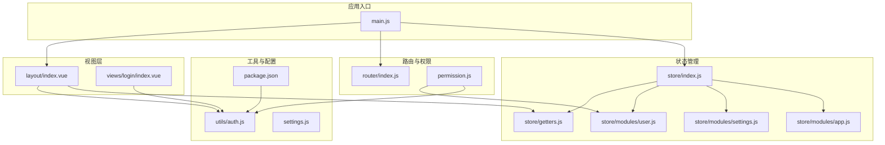
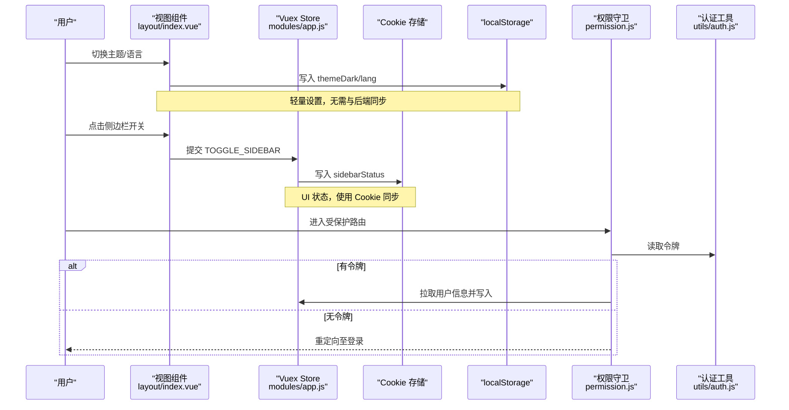
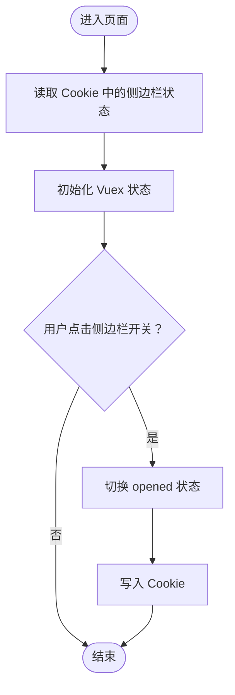
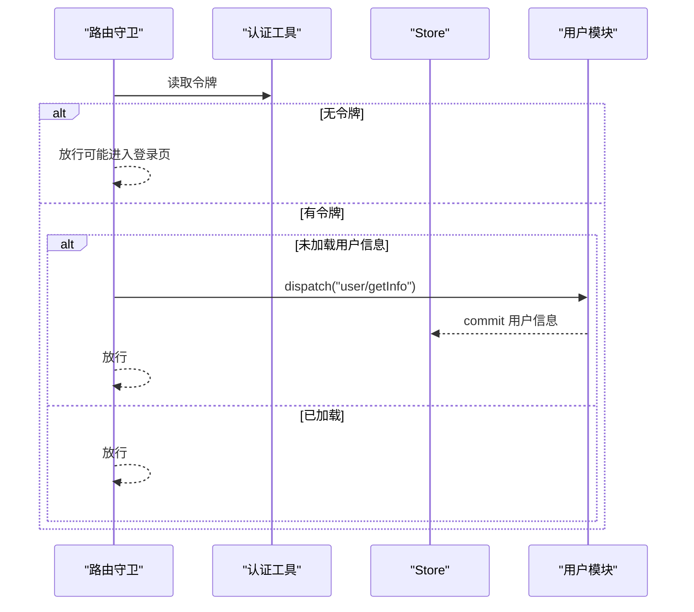
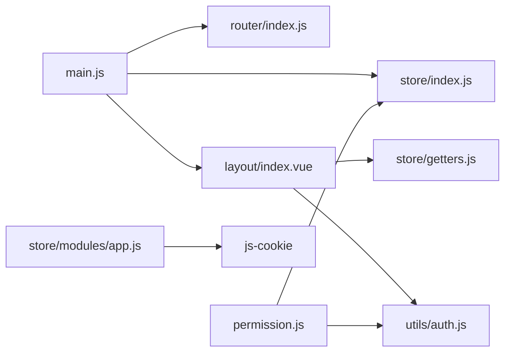

# 状态持久化

<cite>
**本文引用的文件**
- [store/index.js](file://SpeedRunners.UI/src/store/index.js)
- [store/modules/app.js](file://SpeedRunners.UI/src/store/modules/app.js)
- [store/modules/settings.js](file://SpeedRunners.UI/src/store/modules/settings.js)
- [store/modules/user.js](file://SpeedRunners.UI/src/store/modules/user.js)
- [store/getters.js](file://SpeedRunners.UI/src/store/getters.js)
- [utils/auth.js](file://SpeedRunners.UI/src/utils/auth.js)
- [permission.js](file://SpeedRunners.UI/src/permission.js)
- [router/index.js](file://SpeedRunners.UI/src/router/index.js)
- [layout/index.vue](file://SpeedRunners.UI/src/layout/index.vue)
- [views/login/index.vue](file://SpeedRunners.UI/src/views/login/index.vue)
- [api/user.js](file://SpeedRunners.UI/src/api/user.js)
- [settings.js](file://SpeedRunners.UI/src/settings.js)
- [main.js](file://SpeedRunners.UI/src/main.js)
- [package.json](file://SpeedRunners.UI/package.json)
</cite>

## 目录
1. [引言](#引言)
2. [项目结构](#项目结构)
3. [核心组件](#核心组件)
4. [架构总览](#架构总览)
5. [详细组件分析](#详细组件分析)
6. [依赖分析](#依赖分析)
7. [性能考量](#性能考量)
8. [故障排查指南](#故障排查指南)
9. [结论](#结论)
10. [附录](#附录)

## 引言
本文件系统性梳理 SpeedRunnersLab 前端（Vue 2 + Vuex）的状态持久化机制，聚焦于以下目标：
- 明确哪些状态需要持久化、如何实现选择性持久化、持久化的时机与策略
- 解释状态恢复的实现机制与数据格式转换
- 阐述持久化状态的安全考虑与敏感信息保护
- 介绍状态同步与冲突解决机制
- 提供持久化性能优化与存储容量管理建议

当前代码库中，Vuex 状态与浏览器存储的集成主要体现在：
- 使用 Cookie 持久化侧边栏开关等轻量 UI 状态
- 使用 localStorage 持久化主题与语言偏好等轻量设置
- 使用 Cookie 持久化令牌，配合后端完成鉴权与会话管理

## 项目结构
前端项目采用模块化组织，状态管理通过 Vuex Store 统一管理，路由与权限控制在独立模块中实现，工具函数负责认证与网络请求。

图表来源
- [main.js](file://SpeedRunners.UI/src/main.js#L1-L30)
- [store/index.js](file://SpeedRunners.UI/src/store/index.js#L1-L25)
- [store/modules/app.js](file://SpeedRunners.UI/src/store/modules/app.js#L1-L48)
- [store/modules/settings.js](file://SpeedRunners.UI/src/store/modules/settings.js#L1-L30)
- [store/modules/user.js](file://SpeedRunners.UI/src/store/modules/user.js#L1-L88)
- [store/getters.js](file://SpeedRunners.UI/src/store/getters.js#L1-L11)
- [utils/auth.js](file://SpeedRunners.UI/src/utils/auth.js#L1-L45)
- [router/index.js](file://SpeedRunners.UI/src/router/index.js#L1-L133)
- [permission.js](file://SpeedRunners.UI/src/permission.js#L1-L69)
- [layout/index.vue](file://SpeedRunners.UI/src/layout/index.vue#L1-L355)
- [views/login/index.vue](file://SpeedRunners.UI/src/views/login/index.vue#L1-L97)
- [settings.js](file://SpeedRunners.UI/src/settings.js#L1-L16)
- [package.json](file://SpeedRunners.UI/package.json#L1-L76)

章节来源
- [main.js](file://SpeedRunners.UI/src/main.js#L1-L30)
- [store/index.js](file://SpeedRunners.UI/src/store/index.js#L1-L25)
- [package.json](file://SpeedRunners.UI/package.json#L1-L76)

## 核心组件
- Vuex Store：集中式状态容器，自动加载 modules 目录下的模块，提供 getters 访问器
- 应用模块（app）：维护侧边栏状态与设备类型，使用 Cookie 同步侧边栏开关
- 设置模块（settings）：维护界面设置项（如固定头部、侧边栏 Logo），当前未见持久化逻辑
- 用户模块（user）：维护用户信息（Steam ID、昵称、头像、段位类型、参与次数），当前未见持久化逻辑
- 权限与路由：基于令牌生成动态路由，首次进入时拉取用户信息并写入 store
- 认证工具：封装令牌读取/写入/删除，提供 Steam 登录跳转 URL
- 视图层：主题切换与语言切换分别写入 localStorage；布局组件消费 getters

章节来源
- [store/index.js](file://SpeedRunners.UI/src/store/index.js#L1-L25)
- [store/modules/app.js](file://SpeedRunners.UI/src/store/modules/app.js#L1-L48)
- [store/modules/settings.js](file://SpeedRunners.UI/src/store/modules/settings.js#L1-L30)
- [store/modules/user.js](file://SpeedRunners.UI/src/store/modules/user.js#L1-L88)
- [store/getters.js](file://SpeedRunners.UI/src/store/getters.js#L1-L11)
- [utils/auth.js](file://SpeedRunners.UI/src/utils/auth.js#L1-L45)
- [permission.js](file://SpeedRunners.UI/src/permission.js#L1-L69)
- [layout/index.vue](file://SpeedRunners.UI/src/layout/index.vue#L296-L310)

## 架构总览
下图展示从用户交互到状态持久化的整体流程，包括 Cookie 与 localStorage 的使用边界。

图表来源
- [layout/index.vue](file://SpeedRunners.UI/src/layout/index.vue#L296-L310)
- [store/modules/app.js](file://SpeedRunners.UI/src/store/modules/app.js#L11-L29)
- [utils/auth.js](file://SpeedRunners.UI/src/utils/auth.js#L6-L16)
- [permission.js](file://SpeedRunners.UI/src/permission.js#L13-L60)

## 详细组件分析

### Vuex Store 与模块加载
- 自动加载 modules 下的所有模块，统一注册命名空间，便于按模块访问状态
- getters 提供便捷访问器，减少组件直接依赖深层路径

章节来源
- [store/index.js](file://SpeedRunners.UI/src/store/index.js#L8-L23)
- [store/getters.js](file://SpeedRunners.UI/src/store/getters.js#L1-L11)

### 应用模块（app）
- 状态：侧边栏开关、是否动画、设备类型
- 侧边栏开关使用 Cookie 持久化，页面加载时从 Cookie 读取初始值
- 提供切换侧边栏与关闭侧边栏的 mutations，并在切换时写回 Cookie

图表来源
- [store/modules/app.js](file://SpeedRunners.UI/src/store/modules/app.js#L3-L29)

章节来源
- [store/modules/app.js](file://SpeedRunners.UI/src/store/modules/app.js#L1-L48)

### 设置模块（settings）
- 状态：是否显示设置面板、是否固定头部、侧边栏 Logo
- 当前未见持久化逻辑，建议仅用于运行时 UI 控制

章节来源
- [store/modules/settings.js](file://SpeedRunners.UI/src/store/modules/settings.js#L1-L30)
- [settings.js](file://SpeedRunners.UI/src/settings.js#L1-L16)

### 用户模块（user）
- 状态：Steam ID、昵称、头像、段位类型、参与次数
- 通过 actions 拉取用户信息并写入状态；退出登录时重置状态
- 当前未见持久化逻辑，建议结合业务需求决定是否持久化

章节来源
- [store/modules/user.js](file://SpeedRunners.UI/src/store/modules/user.js#L1-L88)
- [api/user.js](file://SpeedRunners.UI/src/api/user.js#L3-L8)

### 权限与路由（permission.js）
- 在路由前置守卫中读取令牌，若存在且未加载过用户信息，则拉取用户信息写入 store
- 若无令牌但已有用户信息，触发重置状态，确保安全
- 与布局组件联动，动态注入可访问路由

图表来源
- [permission.js](file://SpeedRunners.UI/src/permission.js#L13-L60)
- [store/modules/user.js](file://SpeedRunners.UI/src/store/modules/user.js#L38-L60)

章节来源
- [permission.js](file://SpeedRunners.UI/src/permission.js#L1-L69)
- [store/modules/user.js](file://SpeedRunners.UI/src/store/modules/user.js#L1-L88)

### 认证工具（utils/auth.js）
- 令牌键名与过期时间常量定义
- 提供获取、设置、移除令牌方法
- 提供 Steam 登录跳转 URL 生成逻辑

章节来源
- [utils/auth.js](file://SpeedRunners.UI/src/utils/auth.js#L1-L45)

### 视图层（layout/index.vue）
- 主题切换：写入 localStorage 键值，用于下次启动时恢复
- 语言切换：写入 localStorage 键值，更新 i18n 语言
- 退出登录：调用用户模块的本地登出 action，重置路由与状态

章节来源
- [layout/index.vue](file://SpeedRunners.UI/src/layout/index.vue#L296-L317)

### 登录视图（views/login/index.vue）
- 处理登录流程，登录成功后初始化用户数据并跳转首页
- 与权限守卫配合，确保登录后能正确拉取用户信息

章节来源
- [views/login/index.vue](file://SpeedRunners.UI/src/views/login/index.vue#L66-L97)

## 依赖分析
- 依赖关系
  - main.js 引入并挂载 store、router、i18n、vuetify
  - layout/index.vue 通过 mapGetters 消费 store
  - permission.js 依赖 utils/auth.js 与 store
  - store/modules/app.js 依赖 js-cookie
  - layout/index.vue 依赖 utils/auth.js 与 localStorage
- 外部依赖
  - js-cookie：Cookie 读写
  - vuex：状态管理
  - vue-router：路由与导航

图表来源
- [main.js](file://SpeedRunners.UI/src/main.js#L1-L30)
- [layout/index.vue](file://SpeedRunners.UI/src/layout/index.vue#L264-L264)
- [permission.js](file://SpeedRunners.UI/src/permission.js#L7-L7)
- [store/modules/app.js](file://SpeedRunners.UI/src/store/modules/app.js#L1-L1)

章节来源
- [package.json](file://SpeedRunners.UI/package.json#L19-L32)
- [main.js](file://SpeedRunners.UI/src/main.js#L1-L30)

## 性能考量
- Cookie 与 localStorage 的选择
  - Cookie：适合与服务端共享的轻量状态（如侧边栏开关），具备过期与作用域属性
  - localStorage：适合纯前端偏好设置（如主题、语言），容量较大，不随请求发送
- 读写频率
  - 侧边栏开关频繁切换，使用 Cookie 可避免重复序列化开销
  - 主题/语言切换为低频操作，localStorage 即可满足
- 序列化与反序列化
  - 尽量避免对复杂对象进行频繁序列化，必要时进行浅拷贝与浅比较
- 存储容量管理
  - localStorage 容量有限，建议仅存放轻量键值，避免大对象
  - 对于需要跨会话保留的用户数据，优先通过后端 API 持久化，前端仅缓存必要字段

## 故障排查指南
- 侧边栏状态不同步
  - 检查 Cookie 是否被禁用或被清理
  - 确认 app 模块的 mutations 是否正确写入 Cookie
- 语言或主题未生效
  - 检查 localStorage 中对应键是否存在
  - 确认视图组件在 mounted 或 created 生命周期中读取了 localStorage 并更新了状态
- 登录后仍提示未登录
  - 检查权限守卫是否正确读取令牌
  - 确认用户信息拉取成功并写入 store
- 令牌过期或失效
  - 检查令牌过期时间与刷新策略
  - 确保在无令牌时重置用户状态，防止脏数据

章节来源
- [store/modules/app.js](file://SpeedRunners.UI/src/store/modules/app.js#L11-L29)
- [layout/index.vue](file://SpeedRunners.UI/src/layout/index.vue#L296-L310)
- [permission.js](file://SpeedRunners.UI/src/permission.js#L13-L60)
- [utils/auth.js](file://SpeedRunners.UI/src/utils/auth.js#L6-L16)

## 结论
当前项目的状态持久化策略清晰且分层明确：
- UI 状态（侧边栏）使用 Cookie 持久化，保证跨页面一致性
- 偏好设置（主题、语言）使用 localStorage 持久化，提升用户体验
- 认证令牌使用 Cookie 持久化，配合后端实现安全会话
- 用户核心数据通过 API 拉取，避免在前端过度持久化敏感信息

建议后续扩展：
- 对用户模块增加选择性持久化（如最近一次登录的用户标识），并在登录时恢复
- 对复杂查询参数或筛选条件使用 localStorage 缓存，减少重复请求
- 对 Cookie 与 localStorage 的键名进行版本化管理，避免升级导致的数据不兼容

## 附录

### 需要持久化的状态清单与策略
- 侧边栏开关：Cookie（已实现）
- 主题与语言：localStorage（已实现）
- 用户信息：后端 API 拉取（建议在登录后缓存必要字段）
- 令牌：Cookie（已实现）

章节来源
- [store/modules/app.js](file://SpeedRunners.UI/src/store/modules/app.js#L1-L48)
- [layout/index.vue](file://SpeedRunners.UI/src/layout/index.vue#L296-L310)
- [utils/auth.js](file://SpeedRunners.UI/src/utils/auth.js#L1-L45)
- [store/modules/user.js](file://SpeedRunners.UI/src/store/modules/user.js#L1-L88)