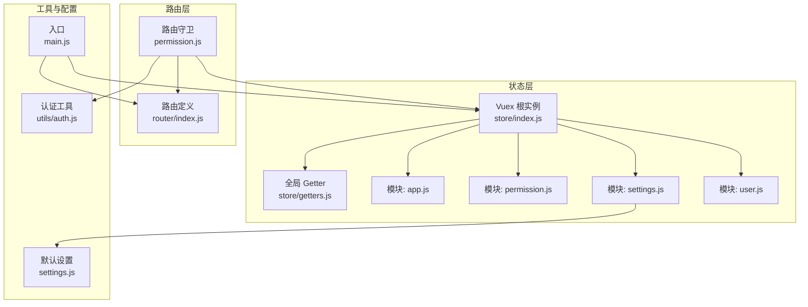
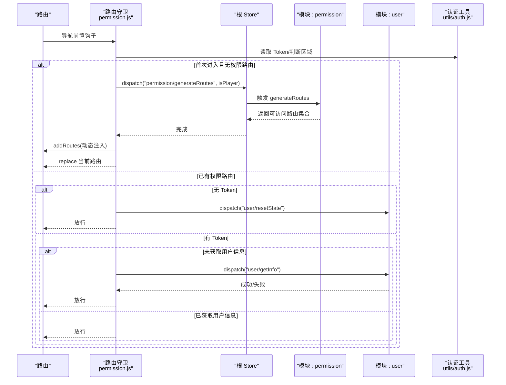
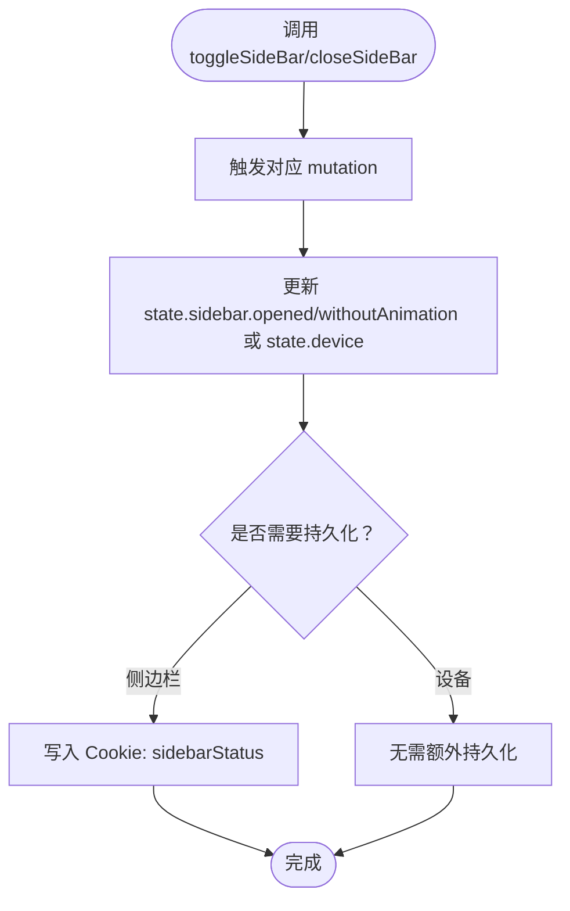
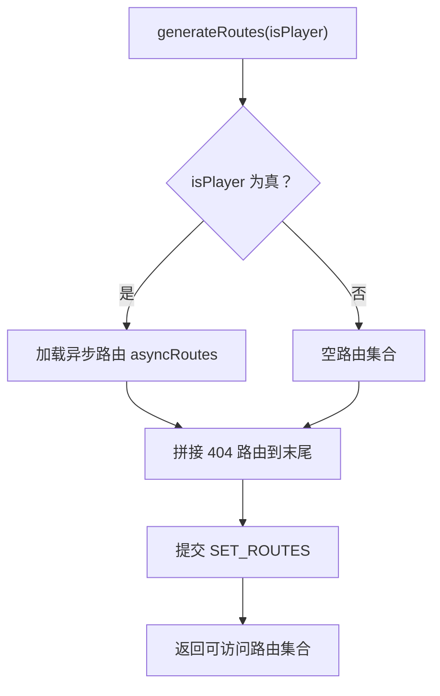
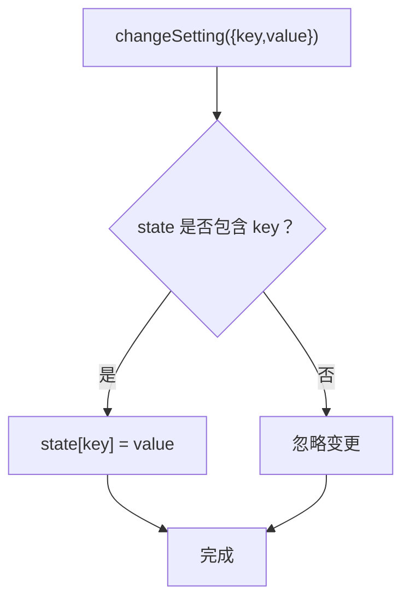
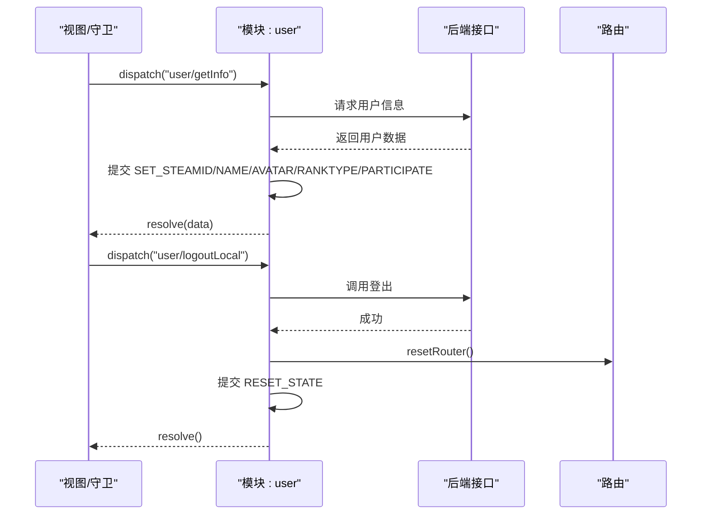
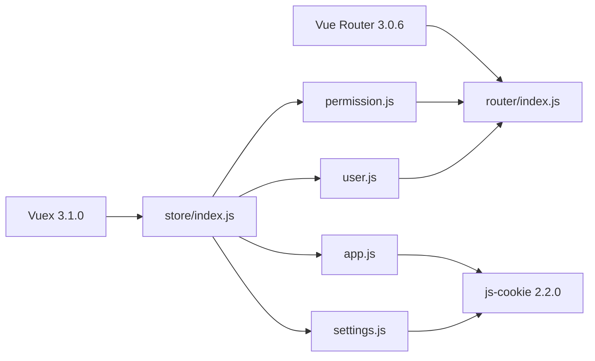

# 状态管理

<cite>
**本文引用的文件**
- [store/index.js](file://SpeedRunners.UI/src/store/index.js)
- [store/getters.js](file://SpeedRunners.UI/src/store/getters.js)
- [store/modules/app.js](file://SpeedRunners.UI/src/store/modules/app.js)
- [store/modules/permission.js](file://SpeedRunners.UI/src/store/modules/permission.js)
- [store/modules/settings.js](file://SpeedRunners.UI/src/store/modules/settings.js)
- [store/modules/user.js](file://SpeedRunners.UI/src/store/modules/user.js)
- [router/index.js](file://SpeedRunners.UI/src/router/index.js)
- [permission.js](file://SpeedRunners.UI/src/permission.js)
- [utils/auth.js](file://SpeedRunners.UI/src/utils/auth.js)
- [settings.js](file://SpeedRunners.UI/src/settings.js)
- [main.js](file://SpeedRunners.UI/src/main.js)
- [package.json](file://SpeedRunners.UI/package.json)
</cite>

## 目录
1. [简介](#简介)
2. [项目结构](#项目结构)
3. [核心组件](#核心组件)
4. [架构总览](#架构总览)
5. [详细组件分析](#详细组件分析)
6. [依赖分析](#依赖分析)
7. [性能考虑](#性能考虑)
8. [故障排查指南](#故障排查指南)
9. [结论](#结论)
10. [附录](#附录)

## 简介
本文件系统性梳理 SpeedRunnersLab 前端基于 Vuex 3.1.0 的状态管理模式，覆盖 store 整体架构与模块化组织、各模块职责与设计原则（state、mutations、actions、getters）、状态持久化策略（Cookie 与本地设置）、权限控制机制（路由守卫、菜单生成、按钮级权限）、最佳实践与性能优化、以及调试与监控方法。目标是帮助开发者快速理解并高效维护状态层。

## 项目结构
- 状态管理位于 src/store，采用自动注册模块的方式，通过 require.context 扫描 modules 目录下的子模块，并统一注入到根 store。
- 根 store 暴露 getters，供视图层按需读取。
- 权限控制逻辑集中在 src/permission.js 中，结合路由守卫与用户信息获取，动态注入可访问路由。
- 设置项默认值来自 src/settings.js，用于初始化界面设置模块。

图表来源
- [store/index.js](file://SpeedRunners.UI/src/store/index.js#L1-L25)
- [store/getters.js](file://SpeedRunners.UI/src/store/getters.js#L1-L11)
- [store/modules/app.js](file://SpeedRunners.UI/src/store/modules/app.js#L1-L48)
- [store/modules/permission.js](file://SpeedRunners.UI/src/store/modules/permission.js#L1-L42)
- [store/modules/settings.js](file://SpeedRunners.UI/src/store/modules/settings.js#L1-L30)
- [store/modules/user.js](file://SpeedRunners.UI/src/store/modules/user.js#L1-L88)
- [router/index.js](file://SpeedRunners.UI/src/router/index.js#L1-L133)
- [permission.js](file://SpeedRunners.UI/src/permission.js#L1-L69)
- [utils/auth.js](file://SpeedRunners.UI/src/utils/auth.js#L1-L45)
- [settings.js](file://SpeedRunners.UI/src/settings.js#L1-L16)
- [main.js](file://SpeedRunners.UI/src/main.js#L1-L30)

章节来源
- [store/index.js](file://SpeedRunners.UI/src/store/index.js#L1-L25)
- [main.js](file://SpeedRunners.UI/src/main.js#L1-L30)

## 核心组件
- 根 store：自动扫描 modules 并注入，统一挂载 getters。
- 模块 app：管理侧边栏开关、设备类型等全局 UI 状态。
- 模块 permission：根据角色生成可访问路由集合，合并常量路由与导航条目。
- 模块 settings：管理界面设置项（如固定头部、侧边栏 Logo）。
- 模块 user：管理用户信息（Steam ID、昵称、头像、段位类型、参与次数），提供登录信息拉取与登出重置。
- 全局 getters：集中暴露常用派生状态，便于视图层读取。

章节来源
- [store/index.js](file://SpeedRunners.UI/src/store/index.js#L1-L25)
- [store/getters.js](file://SpeedRunners.UI/src/store/getters.js#L1-L11)
- [store/modules/app.js](file://SpeedRunners.UI/src/store/modules/app.js#L1-L48)
- [store/modules/permission.js](file://SpeedRunners.UI/src/store/modules/permission.js#L1-L42)
- [store/modules/settings.js](file://SpeedRunners.UI/src/store/modules/settings.js#L1-L30)
- [store/modules/user.js](file://SpeedRunners.UI/src/store/modules/user.js#L1-L88)

## 架构总览
下图展示从路由守卫到状态更新、再到路由注入的整体流程，体现“按需加载路由”的权限控制闭环。

图表来源
- [permission.js](file://SpeedRunners.UI/src/permission.js#L13-L60)
- [store/modules/permission.js](file://SpeedRunners.UI/src/store/modules/permission.js#L21-L35)
- [store/modules/user.js](file://SpeedRunners.UI/src/store/modules/user.js#L37-L81)
- [utils/auth.js](file://SpeedRunners.UI/src/utils/auth.js#L1-L45)
- [router/index.js](file://SpeedRunners.UI/src/router/index.js#L118-L133)

## 详细组件分析

### 模块 app：应用全局状态
- 职责：维护侧边栏展开/收起状态、设备类型；通过 Cookie 持久化侧边栏状态。
- 关键点：
  - 初始化时从 Cookie 读取侧边栏状态，决定默认展开与否。
  - 提供切换侧边栏、关闭侧边栏、切换设备类型的动作。
  - mutation 更新 state 后同步写入 Cookie，确保刷新后状态一致。
- 设计原则：
  - 纯函数式更新（仅通过 mutation 修改 state）。
  - 使用 Cookie 实现轻量持久化，避免引入复杂序列化。

图表来源
- [store/modules/app.js](file://SpeedRunners.UI/src/store/modules/app.js#L11-L29)

章节来源
- [store/modules/app.js](file://SpeedRunners.UI/src/store/modules/app.js#L1-L48)

### 模块 permission：权限控制
- 职责：根据用户角色生成可访问路由集合，合并常量路由与导航条目，注入 404 路由至末尾。
- 关键点：
  - generateRoutes 接收 isPlayer 标识，决定是否加载异步路由。
  - SET_ROUTES 将新增路由与常量路由合并，若根路径存在导航子项则合并到根 children。
  - 最终将 routes 与 addRoutes 写回 state，供视图层与路由系统使用。
- 设计原则：
  - 命名空间隔离，避免与其他模块冲突。
  - Promise 化 action，便于路由守卫等待生成完成。

图表来源
- [store/modules/permission.js](file://SpeedRunners.UI/src/store/modules/permission.js#L21-L35)
- [router/index.js](file://SpeedRunners.UI/src/router/index.js#L96-L116)

章节来源
- [store/modules/permission.js](file://SpeedRunners.UI/src/store/modules/permission.js#L1-L42)
- [router/index.js](file://SpeedRunners.UI/src/router/index.js#L1-L133)

### 模块 settings：界面设置
- 职责：管理界面设置项（是否显示设置面板、固定头部、侧边栏 Logo）。
- 关键点：
  - 默认值来源于 settings.js，保证初始一致性。
  - CHANGE_SETTING 仅对合法键进行赋值，避免误写。
  - 通过 actions.changeSetting 统一入口修改设置。
- 设计原则：
  - 以配置为中心，避免硬编码。
  - 通过命名空间隔离模块状态。

图表来源
- [store/modules/settings.js](file://SpeedRunners.UI/src/store/modules/settings.js#L11-L17)
- [settings.js](file://SpeedRunners.UI/src/settings.js#L1-L16)

章节来源
- [store/modules/settings.js](file://SpeedRunners.UI/src/store/modules/settings.js#L1-L30)
- [settings.js](file://SpeedRunners.UI/src/settings.js#L1-L16)

### 模块 user：用户状态
- 职责：管理用户信息（Steam ID、昵称、头像、段位类型、参与次数），提供获取信息与登出重置。
- 关键点：
  - getInfo：调用后端接口，成功后批量提交多个 SET_* mutation 更新用户信息。
  - logoutLocal：调用登出接口，重置路由、提交 RESET_STATE。
  - resetState：将用户状态还原为默认值。
- 设计原则：
  - 异步操作 Promise 化，便于上层等待与错误处理。
  - 严格命名空间，避免与其它模块键冲突。

图表来源
- [store/modules/user.js](file://SpeedRunners.UI/src/store/modules/user.js#L37-L81)
- [router/index.js](file://SpeedRunners.UI/src/router/index.js#L128-L131)

章节来源
- [store/modules/user.js](file://SpeedRunners.UI/src/store/modules/user.js#L1-L88)

### Getter 设计与使用规范
- 暴露常用派生状态，如侧边栏状态、设备类型、用户关键字段、权限路由集合。
- 视图层通过 getters 读取，避免直接访问深层 state，提升可维护性。
- 建议：
  - 保持 getter 纯函数特性，不修改 state。
  - 对复杂计算尽量缓存结果，必要时配合 computed 使用。

章节来源
- [store/getters.js](file://SpeedRunners.UI/src/store/getters.js#L1-L11)

### 状态持久化方案
- Cookie 持久化：
  - app 模块：侧边栏状态通过 Cookie 持久化，刷新后恢复。
  - 认证 Token：通过 utils/auth.js 管理 srlab-token，设置过期时间。
- 本地设置：
  - settings 模块默认值来自 settings.js，确保初始状态一致。
- 注意事项：
  - Cookie 仅适合轻量数据；大体量状态建议服务端持久化或本地 IndexedDB。
  - 避免在 mutation 中直接写入 Cookie，应通过模块内部逻辑统一处理。

章节来源
- [store/modules/app.js](file://SpeedRunners.UI/src/store/modules/app.js#L1-L48)
- [utils/auth.js](file://SpeedRunners.UI/src/utils/auth.js#L1-L45)
- [store/modules/settings.js](file://SpeedRunners.UI/src/store/modules/settings.js#L1-L30)
- [settings.js](file://SpeedRunners.UI/src/settings.js#L1-L16)

### 权限控制机制
- 路由守卫：
  - 首次进入时根据 Token 与区域判断决定是否加载异步路由。
  - 未登录时尝试拉取用户信息，失败则重置状态并提示错误。
- 菜单生成：
  - permission 模块将导航子项合并到根路由 children，形成侧边栏菜单。
- 按钮级权限：
  - 当前代码未见显式的按钮级权限指令或组件封装；可在视图层基于 getters.permission_routes 或用户角色字段进行条件渲染。

章节来源
- [permission.js](file://SpeedRunners.UI/src/permission.js#L13-L60)
- [store/modules/permission.js](file://SpeedRunners.UI/src/store/modules/permission.js#L8-L19)
- [router/index.js](file://SpeedRunners.UI/src/router/index.js#L33-L94)

## 依赖分析
- 版本与依赖：
  - Vue 2.6.10、Vue Router 3.0.6、Vuex 3.1.0、js-cookie 2.2.0。
  - 通过 package.json 可知项目使用了 NProgress、Vuetify、axios 等生态库。
- 模块耦合：
  - permission 依赖 router 的常量与异步路由定义。
  - permission 与 user 通过路由守卫协作，形成“先生成路由，再拉取用户信息”的顺序。
  - app 与 settings 与外部持久化工具（Cookie）耦合，但模块内部封装良好。

图表来源
- [package.json](file://SpeedRunners.UI/package.json#L15-L32)
- [store/index.js](file://SpeedRunners.UI/src/store/index.js#L1-L25)
- [router/index.js](file://SpeedRunners.UI/src/router/index.js#L1-L133)

章节来源
- [package.json](file://SpeedRunners.UI/package.json#L1-L76)

## 性能考虑
- 模块拆分与命名空间：降低耦合，避免不必要的响应式开销。
- 路由按需加载：仅在首次进入时生成路由，减少初始包体积。
- Getter 复用：复用 getters 计算结果，避免重复计算。
- 异步操作批量化：user 模块一次性提交多个 mutation，减少多次渲染抖动。
- Cookie 写入频率控制：app 模块在侧边栏切换时写入 Cookie，建议在高频交互场景下考虑节流。

## 故障排查指南
- 登录状态异常：
  - 检查 utils/auth.js 中 Token 读取与设置逻辑，确认 Cookie 是否正确写入。
  - 在 permission.js 中确认路由守卫是否正确调用 user/getInfo。
- 路由无法跳转或 404：
  - 确认 permission/generateRoutes 是否已执行并注入路由。
  - 检查 add404Router 是否位于数组末尾。
- 侧边栏状态不同步：
  - 检查 app 模块的 mutation 是否写入 Cookie，以及 Cookie 键名是否一致。
- 用户信息未更新：
  - 确认 getInfo 成功回调中是否提交了所有 SET_* mutation。
  - 若后端返回数据为空，需在 action 中抛出明确错误并重置状态。

章节来源
- [utils/auth.js](file://SpeedRunners.UI/src/utils/auth.js#L1-L45)
- [permission.js](file://SpeedRunners.UI/src/permission.js#L13-L60)
- [store/modules/permission.js](file://SpeedRunners.UI/src/store/modules/permission.js#L21-L35)
- [store/modules/app.js](file://SpeedRunners.UI/src/store/modules/app.js#L11-L29)
- [store/modules/user.js](file://SpeedRunners.UI/src/store/modules/user.js#L37-L81)

## 结论
该状态管理方案以 Vuex 3.1.0 为核心，采用模块化与自动注册机制，清晰分离 app、permission、settings、user 四大职责域。配合路由守卫与 Cookie 持久化，实现了“按需加载路由 + 轻量状态持久化”的权限控制闭环。建议后续在按钮级权限、复杂计算缓存、以及大型状态的持久化策略方面进一步完善，以提升可维护性与性能。

## 附录
- 最佳实践清单
  - 所有状态变更必须通过 mutation，禁止在组件中直接修改 state。
  - 异步操作统一 Promise 化，便于上层等待与错误处理。
  - 命名空间统一使用模块名，避免键冲突。
  - Getter 仅做派生计算，不修改状态。
  - 轻量数据用 Cookie，大体量数据走服务端或本地存储。
- 调试与监控
  - 使用 Vue DevTools 查看 Vuex 面板，观察 state、mutations、actions 的调用链。
  - 在 permission.js 中增加日志输出，定位路由注入时机与结果。
  - 对高频 mutation（如侧边栏切换）进行节流，避免频繁写入 Cookie。