# 用户状态模块

<cite>
**本文引用的文件**
- [user.js（前端用户状态模块）](file://SpeedRunners.UI/src/store/modules/user.js)
- [user.js（前端用户API封装）](file://SpeedRunners.UI/src/api/user.js)
- [auth.js（前端认证工具）](file://SpeedRunners.UI/src/utils/auth.js)
- [request.js（前端HTTP请求拦截器）](file://SpeedRunners.UI/src/utils/request.js)
- [permission.js（前端路由守卫）](file://SpeedRunners.UI/src/permission.js)
- [router/index.js（前端路由配置）](file://SpeedRunners.UI/src/router/index.js)
- [store/index.js（前端Vuex Store入口）](file://SpeedRunners.UI/src/store/index.js)
- [store/getters.js（前端Store Getter）](file://SpeedRunners.UI/src/store/getters.js)
- [store/modules/permission.js（前端权限模块）](file://SpeedRunners.UI/src/store/modules/permission.js)
- [login/index.vue（前端登录视图）](file://SpeedRunners.UI/src/views/login/index.vue)
- [UserController.cs（后端用户控制器）](file://SpeedRunners.API/SpeedRunners/Controllers/UserController.cs)
- [UserBLL.cs（后端用户业务逻辑）](file://SpeedRunners.API/SpeedRunners.BLL/UserBLL.cs)
- [UserDAL.cs（后端用户数据访问）](file://SpeedRunners.API/SpeedRunners.DAL/UserDAL.cs)
- [MAccessToken.cs（后端访问令牌模型）](file://SpeedRunners.API/SpeedRunners.Model/User/MAccessToken.cs)
- [MRankInfo.cs（后端用户信息模型）](file://SpeedRunners.API/SpeedRunners.Model/Rank/MRankInfo.cs)
- [AdminHelper.cs（后端管理员辅助类）](file://SpeedRunners.API/SpeedRunners.Utils/AdminHelper.cs)
- [ResponseFilter.cs（后端响应过滤器）](file://SpeedRunners.API/SpeedRunners/Filter/ResponseFilter.cs)
- [mod/index.vue（前端MOD管理界面）](file://SpeedRunners.UI/src/views/mod/index.vue)
</cite>

## 更新摘要
**变更内容**
- 新增isAdmin状态属性和getter，提供管理员权限检查功能
- 更新用户状态模块以支持管理员状态管理
- MOD管理界面使用isAdmin替代硬编码Steam ID检查
- 后端UserBLL在用户信息获取时设置IsAdmin属性
- 新增AdminHelper类用于管理员ID配置和验证

## 目录
1. [简介](#简介)
2. [项目结构](#项目结构)
3. [核心组件](#核心组件)
4. [架构总览](#架构总览)
5. [详细组件分析](#详细组件分析)
6. [依赖关系分析](#依赖关系分析)
7. [性能考虑](#性能考虑)
8. [故障排除指南](#故障排除指南)
9. [结论](#结论)

## 简介
本文件面向 SpeedRunnersLab 的用户状态模块，系统性梳理前端用户状态管理与后端认证授权的协作机制。重点覆盖以下方面：
- 前端用户状态：登录状态、用户信息、权限角色等核心数据的管理与持久化
- 认证流程：从登录到状态更新的完整流转与错误处理
- Token 策略：存储、刷新与失效处理
- 用户信息：获取、缓存与同步机制
- 管理员权限：isAdmin状态属性和权限检查机制
- 与 API 的集成：请求拦截、响应处理与错误恢复
- 安全性与性能优化最佳实践

## 项目结构
用户状态模块由前端 Store、API 封装、认证工具与路由守卫组成，并与后端控制器、业务层、数据层协同工作。

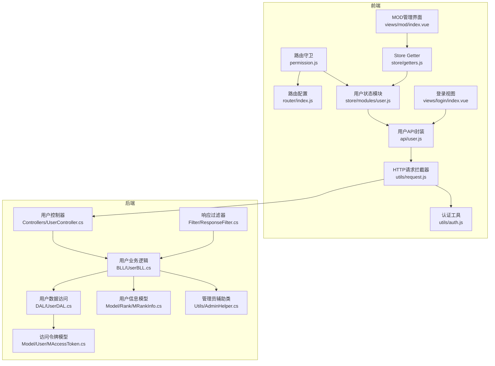

**图表来源**
- [user.js（前端用户状态模块）:1-93](file://SpeedRunners.UI/src/store/modules/user.js#L1-L93)
- [user.js（前端用户API封装）:1-77](file://SpeedRunners.UI/src/api/user.js#L1-L77)
- [auth.js（前端认证工具）:1-45](file://SpeedRunners.UI/src/utils/auth.js#L1-L45)
- [request.js（前端HTTP请求拦截器）:1-82](file://SpeedRunners.UI/src/utils/request.js#L1-L82)
- [permission.js（前端路由守卫）:1-69](file://SpeedRunners.UI/src/permission.js#L1-L69)
- [router/index.js（前端路由配置）:1-133](file://SpeedRunners.UI/src/router/index.js#L1-L133)
- [store/getters.js（前端Store Getter）:1-12](file://SpeedRunners.UI/src/store/getters.js#L1-L12)
- [login/index.vue（前端登录视图）:1-97](file://SpeedRunners.UI/src/views/login/index.vue#L1-L97)
- [UserController.cs（后端用户控制器）:1-62](file://SpeedRunners.API/SpeedRunners/Controllers/UserController.cs#L1-L62)
- [UserBLL.cs（后端用户业务逻辑）:1-172](file://SpeedRunners.API/SpeedRunners.BLL/UserBLL.cs#L1-L172)
- [UserDAL.cs（后端用户数据访问）:1-84](file://SpeedRunners.API/SpeedRunners.DAL/UserDAL.cs#L1-L84)
- [MAccessToken.cs（后端访问令牌模型）:1-16](file://SpeedRunners.API/SpeedRunners.Model/User/MAccessToken.cs#L1-L16)
- [MRankInfo.cs（后端用户信息模型）:1-41](file://SpeedRunners.API/SpeedRunners.Model/Rank/MRankInfo.cs#L1-L41)
- [AdminHelper.cs（后端管理员辅助类）:1-38](file://SpeedRunners.API/SpeedRunners.Utils/AdminHelper.cs#L1-L38)
- [ResponseFilter.cs（后端响应过滤器）:41-113](file://SpeedRunners.API/SpeedRunners/Filter/ResponseFilter.cs#L41-L113)
- [mod/index.vue（前端MOD管理界面）:140-150](file://SpeedRunners.UI/src/views/mod/index.vue#L140-L150)

**章节来源**
- [user.js（前端用户状态模块）:1-93](file://SpeedRunners.UI/src/store/modules/user.js#L1-L93)
- [user.js（前端用户API封装）:1-77](file://SpeedRunners.UI/src/api/user.js#L1-L77)
- [auth.js（前端认证工具）:1-45](file://SpeedRunners.UI/src/utils/auth.js#L1-L45)
- [request.js（前端HTTP请求拦截器）:1-82](file://SpeedRunners.UI/src/utils/request.js#L1-L82)
- [permission.js（前端路由守卫）:1-69](file://SpeedRunners.UI/src/permission.js#L1-L69)
- [router/index.js（前端路由配置）:1-133](file://SpeedRunners.UI/src/router/index.js#L1-L133)
- [store/getters.js（前端Store Getter）:1-12](file://SpeedRunners.UI/src/store/getters.js#L1-L12)
- [login/index.vue（前端登录视图）:1-97](file://SpeedRunners.UI/src/views/login/index.vue#L1-L97)
- [UserController.cs（后端用户控制器）:1-62](file://SpeedRunners.API/SpeedRunners/Controllers/UserController.cs#L1-L62)
- [UserBLL.cs（后端用户业务逻辑）:1-172](file://SpeedRunners.API/SpeedRunners.BLL/UserBLL.cs#L1-L172)
- [UserDAL.cs（后端用户数据访问）:1-84](file://SpeedRunners.API/SpeedRunners.DAL/UserDAL.cs#L1-L84)
- [MAccessToken.cs（后端访问令牌模型）:1-16](file://SpeedRunners.API/SpeedRunners.Model/User/MAccessToken.cs#L1-L16)
- [MRankInfo.cs（后端用户信息模型）:1-41](file://SpeedRunners.API/SpeedRunners.Model/Rank/MRankInfo.cs#L1-L41)
- [AdminHelper.cs（后端管理员辅助类）:1-38](file://SpeedRunners.API/SpeedRunners.Utils/AdminHelper.cs#L1-L38)
- [ResponseFilter.cs（后端响应过滤器）:41-113](file://SpeedRunners.API/SpeedRunners/Filter/ResponseFilter.cs#L41-L113)
- [mod/index.vue（前端MOD管理界面）:140-150](file://SpeedRunners.UI/src/views/mod/index.vue#L140-L150)

## 核心组件
- 前端用户状态模块：负责用户核心字段（Steam ID、昵称、头像、段位类型、参与次数、管理员状态）的状态维护与重置；提供获取用户信息与本地登出动作。
- 前端用户API封装：封装用户相关接口（登录、获取信息、隐私设置、状态设置、登出等），统一通过请求工具发起网络调用。
- 前端认证工具：基于 Cookie 存储 Token，提供获取、设置、移除 Token 以及跳转 Steam 登录页的能力；包含区域检测逻辑。
- 前端请求拦截器：全局注入 Token 头部；在响应层解析后端返回的 Token 并更新本地存储；对特定错误码触发重新登录流程。
- 前端路由守卫：在首次进入时按区域与登录状态动态加载权限路由；在每次导航时校验用户信息是否已拉取。
- 前端MOD管理界面：使用isAdmin状态属性替代硬编码Steam ID检查，实现更灵活的管理员权限控制。
- 后端用户控制器：提供登录、获取信息、隐私设置、状态设置、登出等接口；配合特性鉴权。
- 后端业务逻辑：实现登录验证、Token 刷新、访问令牌更新与删除、用户信息聚合、管理员权限检查等。
- 后端数据访问：提供访问令牌的增删改查操作。
- 后端管理员辅助类：管理管理员ID配置，提供IsAdmin方法进行权限验证。
- 后端响应过滤器：统一刷新返回 Token，确保前端始终持有最新有效 Token。

**章节来源**
- [user.js（前端用户状态模块）:1-93](file://SpeedRunners.UI/src/store/modules/user.js#L1-L93)
- [user.js（前端用户API封装）:1-77](file://SpeedRunners.UI/src/api/user.js#L1-L77)
- [auth.js（前端认证工具）:1-45](file://SpeedRunners.UI/src/utils/auth.js#L1-L45)
- [request.js（前端HTTP请求拦截器）:1-82](file://SpeedRunners.UI/src/utils/request.js#L1-L82)
- [permission.js（前端路由守卫）:1-69](file://SpeedRunners.UI/src/permission.js#L1-L69)
- [mod/index.vue（前端MOD管理界面）:140-150](file://SpeedRunners.UI/src/views/mod/index.vue#L140-L150)
- [UserController.cs（后端用户控制器）:1-62](file://SpeedRunners.API/SpeedRunners/Controllers/UserController.cs#L1-L62)
- [UserBLL.cs（后端用户业务逻辑）:1-172](file://SpeedRunners.API/SpeedRunners.BLL/UserBLL.cs#L1-L172)
- [UserDAL.cs（后端用户数据访问）:1-84](file://SpeedRunners.API/SpeedRunners.DAL/UserDAL.cs#L1-L84)
- [AdminHelper.cs（后端管理员辅助类）:1-38](file://SpeedRunners.API/SpeedRunners.Utils/AdminHelper.cs#L1-L38)
- [ResponseFilter.cs（后端响应过滤器）:41-113](file://SpeedRunners.API/SpeedRunners/Filter/ResponseFilter.cs#L41-L113)

## 架构总览
用户状态模块采用"前端状态 + 后端认证"的分层设计。前端通过 Store 管理用户状态，通过 API 封装调用后端接口；后端通过控制器接收请求，业务层执行登录验证与 Token 刷新，数据层持久化访问令牌；响应过滤器统一处理 Token 返回，确保前后端一致。

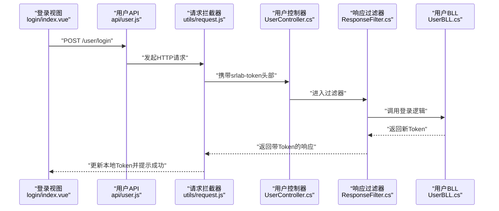

**图表来源**
- [login/index.vue（前端登录视图）:70-81](file://SpeedRunners.UI/src/views/login/index.vue#L70-L81)
- [user.js（前端用户API封装）:10-16](file://SpeedRunners.UI/src/api/user.js#L10-L16)
- [request.js（前端HTTP请求拦截器）:14-30](file://SpeedRunners.UI/src/utils/request.js#L14-L30)
- [UserController.cs（后端用户控制器）:42-47](file://SpeedRunners.API/SpeedRunners/Controllers/UserController.cs#L42-L47)
- [ResponseFilter.cs（后端响应过滤器）:57-83](file://SpeedRunners.API/SpeedRunners/Filter/ResponseFilter.cs#L57-L83)
- [UserBLL.cs（后端用户业务逻辑）:60-93](file://SpeedRunners.API/SpeedRunners.BLL/UserBLL.cs#L60-L93)

## 详细组件分析

### 前端用户状态模块（Vuex）
- 默认状态：包含 Steam ID、昵称、头像、段位类型、参与次数、管理员状态等字段。
- 变更器（Mutations）：提供重置状态、设置各字段的能力，包括新增的SET_ISADMIN。
- 动作（Actions）：
  - 获取用户信息：调用后端接口，将返回数据映射到状态字段，包括isAdmin状态。
  - 本地登出：调用后端登出接口，重置路由与用户状态。
  - 重置状态：仅清空用户状态，不涉及后端交互。

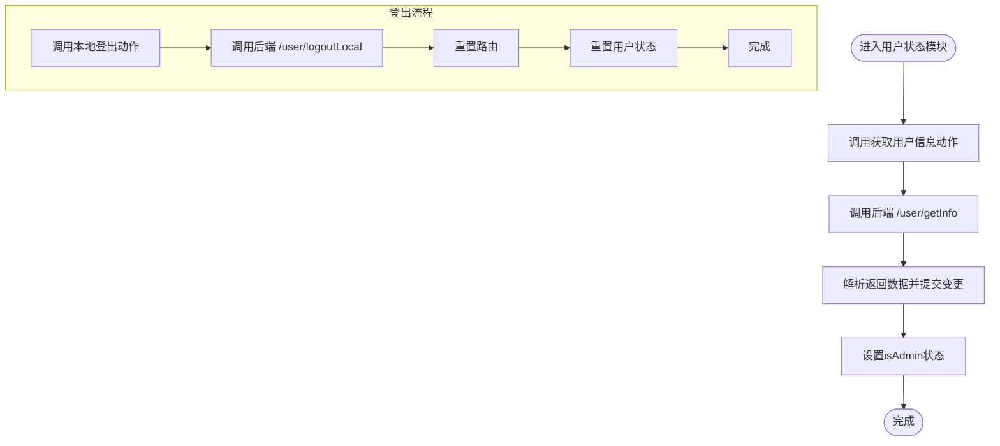

**图表来源**
- [user.js（前端用户状态模块）:37-81](file://SpeedRunners.UI/src/store/modules/user.js#L37-L81)

**章节来源**
- [user.js（前端用户状态模块）:1-93](file://SpeedRunners.UI/src/store/modules/user.js#L1-L93)

### 前端用户API封装
- 接口清单：登录、获取用户信息、登出其他设备、本地登出、隐私设置查询、状态设置、段位类型设置、周游玩时间可见性设置、请求排行数据设置、展示加分设置。
- 统一通过请求工具发起，自动携带 Token 头部。

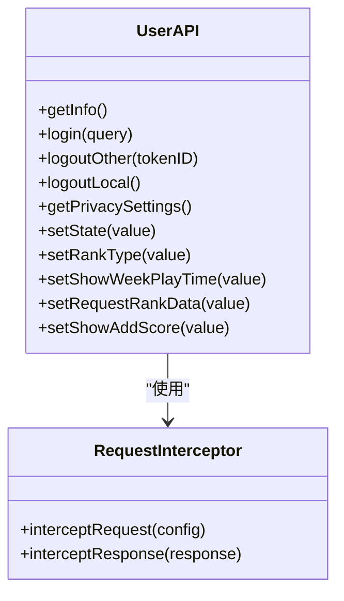

**图表来源**
- [user.js（前端用户API封装）:1-77](file://SpeedRunners.UI/src/api/user.js#L1-L77)
- [request.js（前端HTTP请求拦截器）:14-80](file://SpeedRunners.UI/src/utils/request.js#L14-L80)

**章节来源**
- [user.js（前端用户API封装）:1-77](file://SpeedRunners.UI/src/api/user.js#L1-L77)

### 前端认证工具与Token策略
- Token 键名与过期时间：使用 Cookie 存储 Token，设置较长有效期。
- Token 注入：请求拦截器在请求头添加 Token。
- Token 更新：响应拦截器根据后端返回更新本地 Token。
- 登录跳转：提供跳转至 Steam OpenID 登录页的方法。
- 区域检测：通过外部服务探测网络环境，决定是否走墙外逻辑。

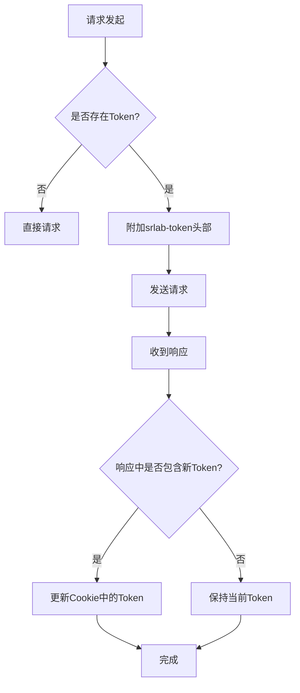

**图表来源**
- [auth.js（前端认证工具）:3-16](file://SpeedRunners.UI/src/utils/auth.js#L3-L16)
- [request.js（前端HTTP请求拦截器）:14-50](file://SpeedRunners.UI/src/utils/request.js#L14-L50)

**章节来源**
- [auth.js（前端认证工具）:1-45](file://SpeedRunners.UI/src/utils/auth.js#L1-L45)
- [request.js（前端HTTP请求拦截器）:1-82](file://SpeedRunners.UI/src/utils/request.js#L1-L82)

### 前端路由守卫与权限加载
- 首次进入：根据是否存在 Token 或区域判断加载异步路由。
- 导航守卫：若未登录且无用户信息，则尝试拉取用户信息；失败则重置状态并提示错误。
- 路由重置：登出时重置路由匹配器，避免残留权限路由。

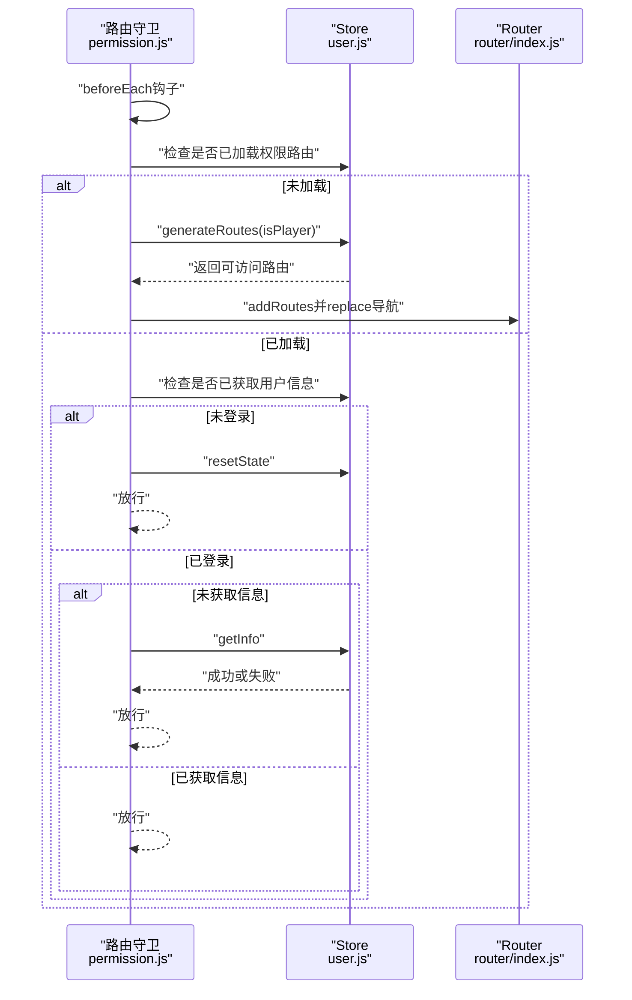

**图表来源**
- [permission.js（前端路由守卫）:13-60](file://SpeedRunners.UI/src/permission.js#L13-L60)
- [router/index.js（前端路由配置）:118-131](file://SpeedRunners.UI/src/router/index.js#L118-L131)
- [user.js（前端用户状态模块）:37-81](file://SpeedRunners.UI/src/store/modules/user.js#L37-L81)

**章节来源**
- [permission.js（前端路由守卫）:1-69](file://SpeedRunners.UI/src/permission.js#L1-L69)
- [router/index.js（前端路由配置）:1-133](file://SpeedRunners.UI/src/router/index.js#L1-L133)

### 前端MOD管理界面与管理员权限
- 管理员权限检查：使用isAdmin状态属性替代硬编码Steam ID检查，实现更灵活的权限控制。
- 权限逻辑：当用户是管理员或MOD作者时，显示删除按钮等管理功能。
- Getter集成：通过mapGetters获取isAdmin、name、steamId等状态属性。

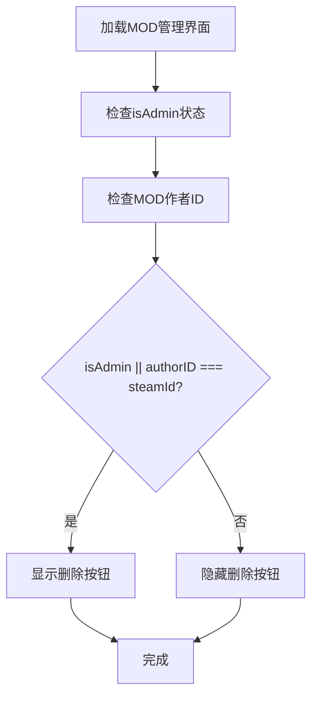

**图表来源**
- [mod/index.vue（前端MOD管理界面）:140-150](file://SpeedRunners.UI/src/views/mod/index.vue#L140-L150)
- [store/getters.js（前端Store Getter）:9-9](file://SpeedRunners.UI/src/store/getters.js#L9-L9)

**章节来源**
- [mod/index.vue（前端MOD管理界面）:140-150](file://SpeedRunners.UI/src/views/mod/index.vue#L140-L150)
- [store/getters.js（前端Store Getter）:1-12](file://SpeedRunners.UI/src/store/getters.js#L1-L12)

### 后端认证与Token刷新
- 登录流程：通过 Steam OpenID 验证，生成唯一 Token 并持久化。
- Token 刷新：响应过滤器根据配置的刷新周期判断是否生成新 Token；若过期则更新数据库并返回新 Token。
- 访问令牌模型：包含 TokenID、平台ID、浏览器、Token、登录时间、ExToken 等字段。
- 登出策略：支持按 TokenID 删除其他设备登录，支持本地登出清理当前会话。

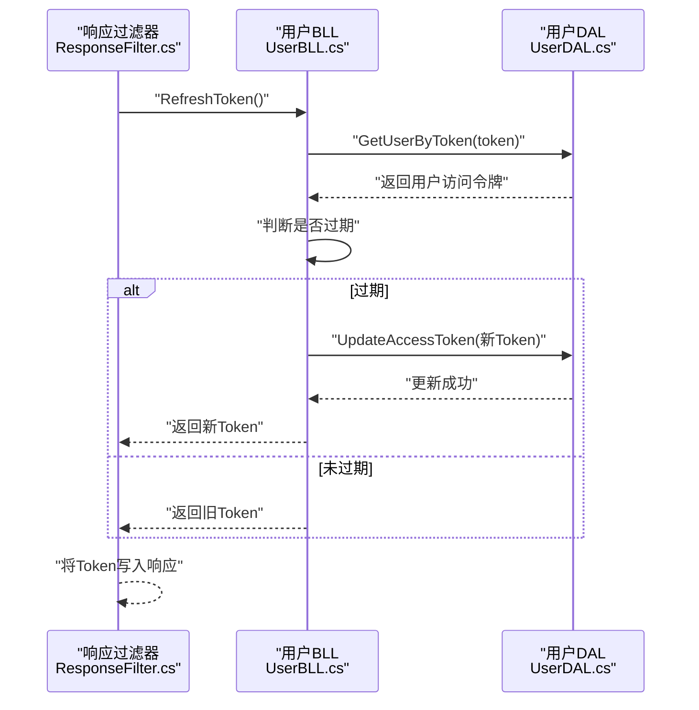

**图表来源**
- [ResponseFilter.cs（后端响应过滤器）:88-111](file://SpeedRunners.API/SpeedRunners/Filter/ResponseFilter.cs#L88-L111)
- [UserBLL.cs（后端用户业务逻辑）:95-119](file://SpeedRunners.API/SpeedRunners.BLL/UserBLL.cs#L95-L119)
- [UserDAL.cs（后端用户数据访问）:58-82](file://SpeedRunners.API/SpeedRunners.DAL/UserDAL.cs#L58-L82)
- [MAccessToken.cs（后端访问令牌模型）:7-16](file://SpeedRunners.API/SpeedRunners.Model/User/MAccessToken.cs#L7-L16)

**章节来源**
- [ResponseFilter.cs（后端响应过滤器）:41-113](file://SpeedRunners.API/SpeedRunners/Filter/ResponseFilter.cs#L41-L113)
- [UserBLL.cs（后端用户业务逻辑）:60-151](file://SpeedRunners.API/SpeedRunners.BLL/UserBLL.cs#L60-L151)
- [UserDAL.cs（后端用户数据访问）:58-84](file://SpeedRunners.API/SpeedRunners.DAL/UserDAL.cs#L58-L84)
- [MAccessToken.cs（后端访问令牌模型）:1-16](file://SpeedRunners.API/SpeedRunners.Model/User/MAccessToken.cs#L1-L16)

### 后端管理员权限管理
- 管理员ID配置：通过appsettings.json中的AdminPlatformIDs配置管理员Steam ID列表。
- 管理员辅助类：AdminHelper类提供IsAdmin方法进行权限验证，支持大小写不敏感比较。
- 用户信息集成：UserBLL在获取用户信息时调用AdminHelper.IsAdmin设置MRankInfo.IsAdmin属性。

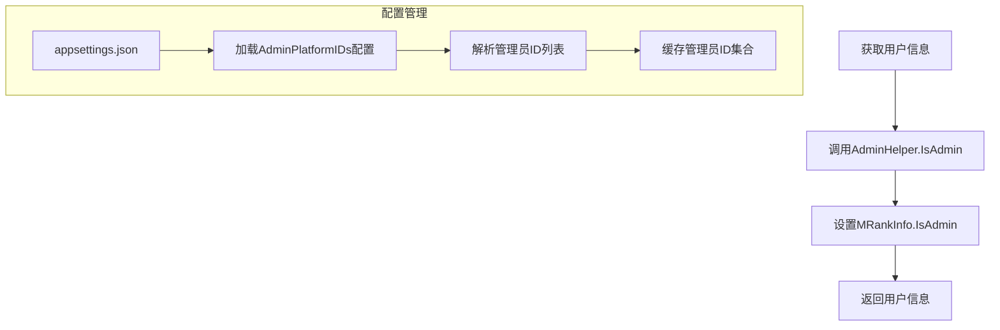

**图表来源**
- [UserBLL.cs（后端用户业务逻辑）:69-77](file://SpeedRunners.API/SpeedRunners.BLL/UserBLL.cs#L69-L77)
- [AdminHelper.cs（后端管理员辅助类）:1-38](file://SpeedRunners.API/SpeedRunners.Utils/AdminHelper.cs#L1-L38)
- [MRankInfo.cs（后端用户信息模型）:35-38](file://SpeedRunners.API/SpeedRunners.Model/Rank/MRankInfo.cs#L35-L38)
- [appsettings.json（后端配置文件）:19-20](file://SpeedRunners.API/SpeedRunners/appsettings.json#L19-L20)

**章节来源**
- [UserBLL.cs（后端用户业务逻辑）:69-77](file://SpeedRunners.API/SpeedRunners.BLL/UserBLL.cs#L69-L77)
- [AdminHelper.cs（后端管理员辅助类）:1-38](file://SpeedRunners.API/SpeedRunners.Utils/AdminHelper.cs#L1-L38)
- [MRankInfo.cs（后端用户信息模型）:35-38](file://SpeedRunners.API/SpeedRunners.Model/Rank/MRankInfo.cs#L35-L38)
- [appsettings.json（后端配置文件）:19-20](file://SpeedRunners.API/SpeedRunners/appsettings.json#L19-L20)

### 前端登录视图与初始化流程
- 登录步骤：显示验证进度，成功后初始化用户数据，最后自动跳转首页。
- 与 Store 协作：登录成功后触发用户信息拉取与路由权限加载。

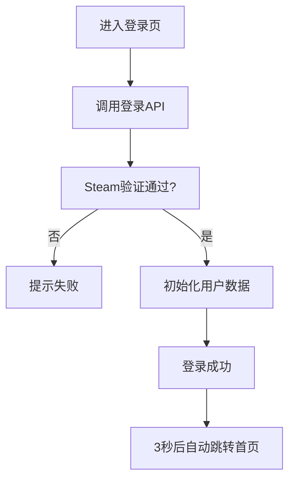

**图表来源**
- [login/index.vue（前端登录视图）:66-94](file://SpeedRunners.UI/src/views/login/index.vue#L66-L94)

**章节来源**
- [login/index.vue（前端登录视图）:1-97](file://SpeedRunners.UI/src/views/login/index.vue#L1-L97)

## 依赖关系分析
- 前端 Store 与 API：用户状态模块依赖用户 API 封装；Getter 提供便捷访问isAdmin状态。
- 前端请求拦截器与认证工具：请求拦截器依赖认证工具读取/更新 Token；认证工具依赖 Cookie。
- 前端路由守卫：依赖 Store 的用户状态与路由配置；在导航前进行权限与用户信息校验。
- 前端MOD管理界面：依赖Store的isAdmin getter进行权限控制。
- 后端控制器与业务层：控制器依赖业务层；业务层依赖数据层与配置。
- 后端管理员辅助类：被UserBLL调用进行管理员权限检查。
- 后端响应过滤器：贯穿所有受保护接口，统一处理 Token 刷新与返回。

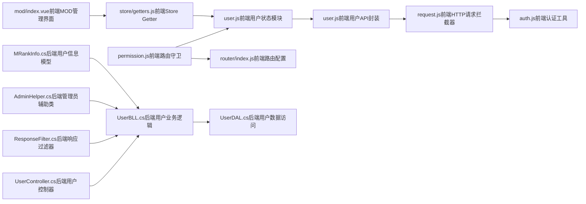

**图表来源**
- [user.js（前端用户状态模块）:1-93](file://SpeedRunners.UI/src/store/modules/user.js#L1-L93)
- [user.js（前端用户API封装）:1-77](file://SpeedRunners.UI/src/api/user.js#L1-L77)
- [request.js（前端HTTP请求拦截器）:1-82](file://SpeedRunners.UI/src/utils/request.js#L1-L82)
- [auth.js（前端认证工具）:1-45](file://SpeedRunners.UI/src/utils/auth.js#L1-L45)
- [permission.js（前端路由守卫）:1-69](file://SpeedRunners.UI/src/permission.js#L1-L69)
- [router/index.js（前端路由配置）:1-133](file://SpeedRunners.UI/src/router/index.js#L1-L133)
- [UserController.cs（后端用户控制器）:1-62](file://SpeedRunners.API/SpeedRunners/Controllers/UserController.cs#L1-L62)
- [UserBLL.cs（后端用户业务逻辑）:1-172](file://SpeedRunners.API/SpeedRunners.BLL/UserBLL.cs#L1-L172)
- [UserDAL.cs（后端用户数据访问）:1-84](file://SpeedRunners.API/SpeedRunners.DAL/UserDAL.cs#L1-L84)
- [ResponseFilter.cs（后端响应过滤器）:41-113](file://SpeedRunners.API/SpeedRunners/Filter/ResponseFilter.cs#L41-L113)
- [mod/index.vue（前端MOD管理界面）:140-150](file://SpeedRunners.UI/src/views/mod/index.vue#L140-L150)
- [store/getters.js（前端Store Getter）:1-12](file://SpeedRunners.UI/src/store/getters.js#L1-L12)
- [AdminHelper.cs（后端管理员辅助类）:1-38](file://SpeedRunners.API/SpeedRunners.Utils/AdminHelper.cs#L1-L38)
- [MRankInfo.cs（后端用户信息模型）:1-41](file://SpeedRunners.API/SpeedRunners.Model/Rank/MRankInfo.cs#L1-L41)

**章节来源**
- [store/index.js（前端Vuex Store入口）:1-25](file://SpeedRunners.UI/src/store/index.js#L1-L25)
- [store/getters.js（前端Store Getter）:1-12](file://SpeedRunners.UI/src/store/getters.js#L1-L12)

## 性能考虑
- 请求超时与并发：请求拦截器设置合理超时时间，避免阻塞；建议在高频接口上启用去抖与节流。
- Token 刷新频率：后端根据配置周期刷新 Token，减少频繁生成带来的数据库压力。
- 路由懒加载：前端路由采用动态导入，降低首屏体积。
- 缓存策略：前端未实现用户信息缓存，建议在用户信息稳定场景下增加短期缓存，结合版本号控制失效。
- 国际化与区域检测：区域检测仅用于路由加载判断，避免在主流程中引入额外延迟。
- 管理员权限缓存：后端AdminHelper缓存管理员ID集合，避免重复解析配置。

## 故障排除指南
- 登录失败：检查 Steam OpenID 验证结果与后端日志；确认前端登录 API 是否正确返回 Token。
- Token 失效：响应拦截器在检测到 Token 为空时会清除本地存储；此时应触发重新登录流程。
- 权限错误：后端登出其他设备时可能因权限不足或低权限导致失败；前端应提示用户并引导重新登录。
- 路由无法加载：首次进入时若未加载权限路由，守卫会尝试生成；若失败请检查 isPlayer 判定与区域检测逻辑。
- 数据不同步：用户信息拉取失败时会重置状态；建议在调用失败时提供重试按钮与错误提示。
- 管理员权限问题：检查appsettings.json中的AdminPlatformIDs配置是否正确；确认AdminHelper.IsAdmin方法是否正常工作。

**章节来源**
- [request.js（前端HTTP请求拦截器）:44-74](file://SpeedRunners.UI/src/utils/request.js#L44-L74)
- [permission.js（前端路由守卫）:45-57](file://SpeedRunners.UI/src/permission.js#L45-L57)
- [UserBLL.cs（后端用户业务逻辑）:121-141](file://SpeedRunners.API/SpeedRunners.BLL/UserBLL.cs#L121-L141)
- [AdminHelper.cs（后端管理员辅助类）:1-38](file://SpeedRunners.API/SpeedRunners.Utils/AdminHelper.cs#L1-L38)

## 结论
用户状态模块通过前端 Store 与 API 封装实现用户信息与登录状态的集中管理，借助请求拦截器与认证工具完成 Token 的注入与刷新；后端通过控制器、业务层与数据层提供登录验证、Token 刷新与登出能力。新增的isAdmin状态属性和getter提供了灵活的管理员权限控制机制，MOD管理界面使用该机制替代了硬编码的Steam ID检查，提升了系统的可维护性和安全性。整体架构清晰、职责分离明确，具备良好的扩展性与可维护性。建议在后续迭代中引入用户信息缓存与更细粒度的错误处理，进一步提升用户体验与系统稳定性。