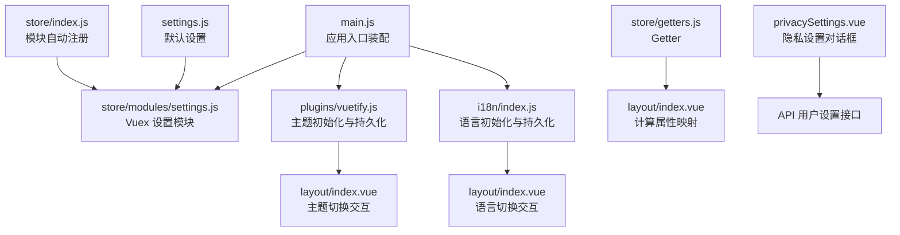
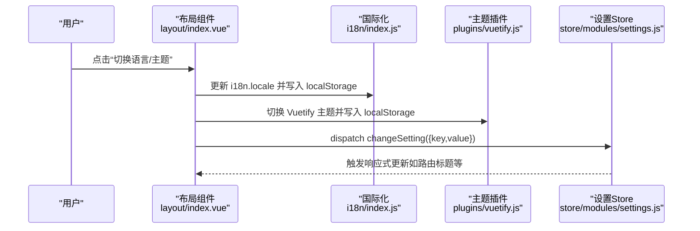
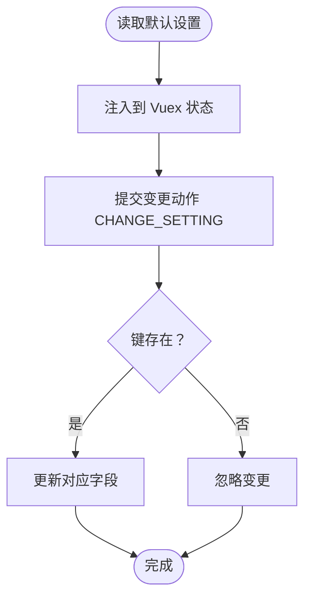
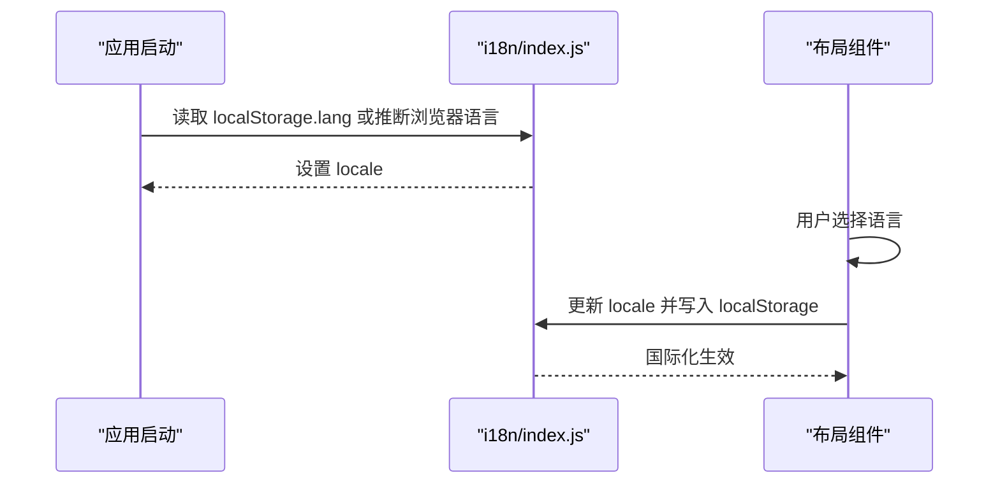
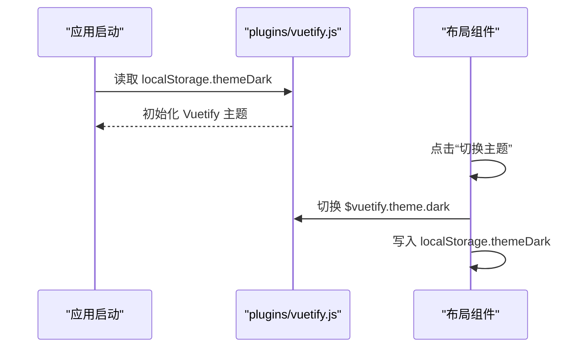
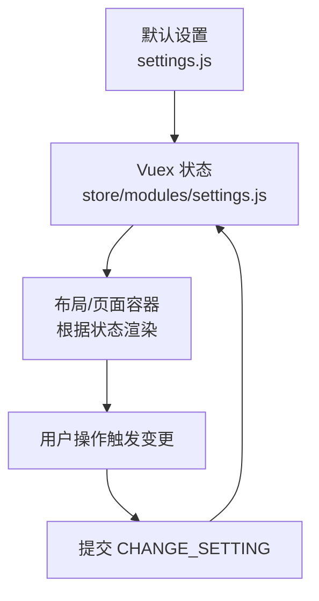
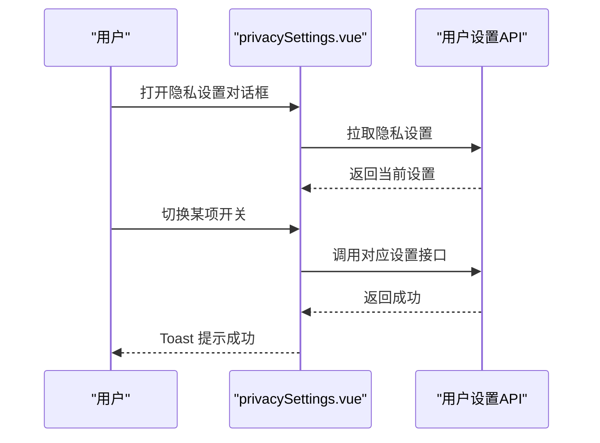
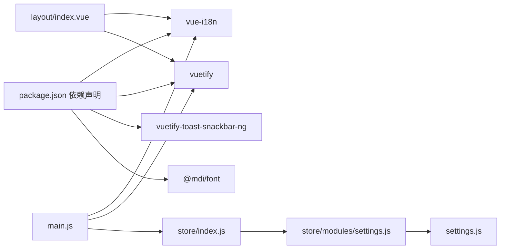

# 界面设置模块

<cite>
**本文引用的文件**
- [settings.js](file://SpeedRunners.UI/src/settings.js)
- [settings.js（Vuex 模块）](file://SpeedRunners.UI/src/store/modules/settings.js)
- [i18n/index.js](file://SpeedRunners.UI/src/i18n/index.js)
- [vuetify.js](file://SpeedRunners.UI/src/plugins/vuetify.js)
- [main.js](file://SpeedRunners.UI/src/main.js)
- [layout/index.vue](file://SpeedRunners.UI/src/layout/index.vue)
- [privacySettings.vue](file://SpeedRunners.UI/src/views/other/privacySettings.vue)
- [store/index.js](file://SpeedRunners.UI/src/store/index.js)
- [store/getters.js](file://SpeedRunners.UI/src/store/getters.js)
- [zh.json](file://SpeedRunners.UI/src/i18n/lang/zh.json)
- [en.json](file://SpeedRunners.UI/src/i18n/lang/en.json)
- [package.json](file://SpeedRunners.UI/package.json)
</cite>

## 目录
1. [简介](#简介)
2. [项目结构](#项目结构)
3. [核心组件](#核心组件)
4. [架构总览](#架构总览)
5. [详细组件分析](#详细组件分析)
6. [依赖关系分析](#依赖关系分析)
7. [性能考量](#性能考量)
8. [故障排查指南](#故障排查指南)
9. [结论](#结论)
10. [附录](#附录)

## 简介
本文件系统性梳理 SpeedRunners.UI 中的界面设置模块，聚焦 settings.js 对用户界面配置的管理能力，涵盖主题切换、布局设置、语言选择等关键功能；明确各项设置的状态定义与默认值；解释持久化存储与跨会话保持策略；阐述设置与组件的绑定与响应式更新机制；给出设置项的验证与回滚建议，并提供扩展与体验优化思路。

## 项目结构
界面设置涉及的核心文件分布如下：
- 默认设置与全局常量：settings.js
- Vuex 设置模块：store/modules/settings.js
- 国际化与语言持久化：i18n/index.js 及语言包
- 主题持久化与 Vuetify 初始化：plugins/vuetify.js
- 应用入口与插件装配：main.js
- 布局与交互：layout/index.vue
- 隐私设置对话框（与用户偏好联动）：views/other/privacySettings.vue
- Store 自动注册与 Getter：store/index.js、store/getters.js
- 依赖声明：package.json

图表来源
- [settings.js](file://SpeedRunners.UI/src/settings.js#L1-L16)
- [settings.js（Vuex 模块）](file://SpeedRunners.UI/src/store/modules/settings.js#L1-L30)
- [i18n/index.js](file://SpeedRunners.UI/src/i18n/index.js#L1-L35)
- [vuetify.js](file://SpeedRunners.UI/src/plugins/vuetify.js#L1-L33)
- [main.js](file://SpeedRunners.UI/src/main.js#L1-L30)
- [layout/index.vue](file://SpeedRunners.UI/src/layout/index.vue#L1-L355)
- [privacySettings.vue](file://SpeedRunners.UI/src/views/other/privacySettings.vue#L1-L169)
- [store/index.js](file://SpeedRunners.UI/src/store/index.js#L1-L25)
- [store/getters.js](file://SpeedRunners.UI/src/store/getters.js#L1-L11)

章节来源
- [settings.js](file://SpeedRunners.UI/src/settings.js#L1-L16)
- [settings.js（Vuex 模块）](file://SpeedRunners.UI/src/store/modules/settings.js#L1-L30)
- [i18n/index.js](file://SpeedRunners.UI/src/i18n/index.js#L1-L35)
- [vuetify.js](file://SpeedRunners.UI/src/plugins/vuetify.js#L1-L33)
- [main.js](file://SpeedRunners.UI/src/main.js#L1-L30)
- [layout/index.vue](file://SpeedRunners.UI/src/layout/index.vue#L1-L355)
- [store/index.js](file://SpeedRunners.UI/src/store/index.js#L1-L25)
- [store/getters.js](file://SpeedRunners.UI/src/store/getters.js#L1-L11)

## 核心组件
- 默认设置源（settings.js）
  - 提供标题、固定头部、侧边栏 Logo 等基础界面参数的默认值。
- Vuex 设置模块（store/modules/settings.js）
  - 将默认设置注入状态，提供统一变更入口（commit 变更键值），实现设置的集中管理与响应式更新。
- 国际化与语言持久化（i18n/index.js）
  - 基于浏览器语言与本地存储决定初始语言，确保刷新后语言不丢失。
- 主题持久化（plugins/vuetify.js）
  - 在 Vuetify 初始化时读取本地存储的主题偏好，实现深色/浅色主题的持久化。
- 布局与交互（layout/index.vue）
  - 提供语言切换与主题切换的交互入口，调用 i18n 与 Vuetify API 更新状态并写入本地存储。
- 隐私设置对话框（privacySettings.vue）
  - 展示与用户隐私相关的设置项，通过 API 写回服务端，实现用户偏好的持久化。

章节来源
- [settings.js](file://SpeedRunners.UI/src/settings.js#L1-L16)
- [settings.js（Vuex 模块）](file://SpeedRunners.UI/src/store/modules/settings.js#L1-L30)
- [i18n/index.js](file://SpeedRunners.UI/src/i18n/index.js#L1-L35)
- [vuetify.js](file://SpeedRunners.UI/src/plugins/vuetify.js#L1-L33)
- [layout/index.vue](file://SpeedRunners.UI/src/layout/index.vue#L295-L333)
- [privacySettings.vue](file://SpeedRunners.UI/src/views/other/privacySettings.vue#L1-L169)

## 架构总览
界面设置模块采用“默认配置 + Vuex 状态 + 插件初始化 + 组件交互”的分层设计：
- 默认配置层：集中定义设置项与默认值。
- 状态管理层：通过 Vuex 模块统一管理设置状态，提供变更动作。
- 插件初始化层：在应用启动时读取本地存储，应用主题与语言偏好。
- 交互层：布局组件提供切换入口，写入本地存储并触发响应式更新。

图表来源
- [layout/index.vue](file://SpeedRunners.UI/src/layout/index.vue#L295-L333)
- [i18n/index.js](file://SpeedRunners.UI/src/i18n/index.js#L1-L35)
- [vuetify.js](file://SpeedRunners.UI/src/plugins/vuetify.js#L1-L33)
- [settings.js（Vuex 模块）](file://SpeedRunners.UI/src/store/modules/settings.js#L19-L29)

## 详细组件分析

### 默认设置与状态定义
- 默认设置（settings.js）
  - 字段：标题、固定头部、侧边栏 Logo。
  - 作用：作为全局默认值，供其他模块读取与初始化。
- Vuex 设置模块（store/modules/settings.js）
  - 状态：showSettings、fixedHeader、sidebarLogo。
  - 变更：通过提交 CHANGE_SETTING 动作，仅当 key 存在于 state 时才更新，具备基础校验。
  - 命名空间：namespaced: true，避免与其他模块冲突。

图表来源
- [settings.js](file://SpeedRunners.UI/src/settings.js#L1-L16)
- [settings.js（Vuex 模块）](file://SpeedRunners.UI/src/store/modules/settings.js#L11-L16)

章节来源
- [settings.js](file://SpeedRunners.UI/src/settings.js#L1-L16)
- [settings.js（Vuex 模块）](file://SpeedRunners.UI/src/store/modules/settings.js#L1-L30)

### 语言选择与持久化
- 初始化逻辑
  - 优先读取 localStorage 中的语言键；若不存在，则根据浏览器语言推断 zh 或 en，并写入 localStorage。
- 切换逻辑
  - 布局组件提供语言菜单，切换时更新 i18n.locale 并写入 localStorage，同时更新页面标题。
- 语言包
  - 中文与英文语言包分别位于 i18n/lang/zh.json 与 en.json，包含布局、路由、通用、隐私等多处文案。

图表来源
- [i18n/index.js](file://SpeedRunners.UI/src/i18n/index.js#L8-L20)
- [layout/index.vue](file://SpeedRunners.UI/src/layout/index.vue#L305-L310)
- [zh.json](file://SpeedRunners.UI/src/i18n/lang/zh.json#L24-L41)
- [en.json](file://SpeedRunners.UI/src/i18n/lang/en.json#L24-L41)

章节来源
- [i18n/index.js](file://SpeedRunners.UI/src/i18n/index.js#L1-L35)
- [layout/index.vue](file://SpeedRunners.UI/src/layout/index.vue#L305-L310)
- [zh.json](file://SpeedRunners.UI/src/i18n/lang/zh.json#L1-L220)
- [en.json](file://SpeedRunners.UI/src/i18n/lang/en.json#L1-L220)

### 主题切换与持久化
- 初始化逻辑
  - Vuetify 插件在初始化时读取 localStorage 中的主题偏好，若未设置则默认启用深色主题。
- 切换逻辑
  - 布局组件提供主题按钮，切换 Vuetify 主题并写入 localStorage，实现跨会话保持。
- 依赖
  - 使用 vuetify 与 vuetify-toast-snackbar-ng，图标库为 @mdi/font。

图表来源
- [vuetify.js](file://SpeedRunners.UI/src/plugins/vuetify.js#L6-L33)
- [layout/index.vue](file://SpeedRunners.UI/src/layout/index.vue#L296-L299)

章节来源
- [vuetify.js](file://SpeedRunners.UI/src/plugins/vuetify.js#L1-L33)
- [layout/index.vue](file://SpeedRunners.UI/src/layout/index.vue#L295-L300)

### 布局设置（固定头部、侧边栏 Logo）
- 默认值来源
  - settings.js 定义 fixedHeader 与 sidebarLogo 的布尔默认值。
- Vuex 状态
  - settings.js（Vuex 模块）将默认值注入 state，并通过 CHANGE_SETTING 动作实现更新。
- 组件绑定
  - 布局组件与页面容器可基于这些状态控制 UI 行为（例如工具栏固定、Logo 显示等）。

图表来源
- [settings.js](file://SpeedRunners.UI/src/settings.js#L3-L15)
- [settings.js（Vuex 模块）](file://SpeedRunners.UI/src/store/modules/settings.js#L5-L9)
- [settings.js（Vuex 模块）](file://SpeedRunners.UI/src/store/modules/settings.js#L11-L16)

章节来源
- [settings.js](file://SpeedRunners.UI/src/settings.js#L1-L16)
- [settings.js（Vuex 模块）](file://SpeedRunners.UI/src/store/modules/settings.js#L1-L30)

### 隐私设置与用户偏好联动
- 组件职责
  - privacySettings.vue 提供隐私设置对话框，包含多项开关（如公开状态、公开时长、允许获取天梯分等），通过 API 写回服务端。
- 数据流
  - 打开对话框时拉取用户设置；每次变更后调用对应 API 并提示成功。
- 与界面设置的关系
  - 隐私设置属于用户偏好范畴，与主题、语言一样，均通过本地存储或服务端持久化，影响界面展示与数据可见性。

图表来源
- [privacySettings.vue](file://SpeedRunners.UI/src/views/other/privacySettings.vue#L159-L167)

章节来源
- [privacySettings.vue](file://SpeedRunners.UI/src/views/other/privacySettings.vue#L1-L169)

### 设置项的验证与回滚机制
- 键名校验
  - Vuex 变更动作在提交前检查 key 是否存在于 state，避免非法字段写入。
- 类型约束
  - 默认设置为布尔与字符串类型，建议在业务层补充类型校验与范围限制（如枚举值）。
- 回滚建议
  - 在变更动作中增加“旧值缓存”，失败时回滚；或提供“重置为默认值”动作，便于快速恢复。

章节来源
- [settings.js（Vuex 模块）](file://SpeedRunners.UI/src/store/modules/settings.js#L11-L16)

### 设置与组件的绑定与响应式更新
- 绑定方式
  - 布局组件通过计算属性映射 store/getters.js 中的用户信息与路由权限，结合本地存储实现主题与语言切换。
- 响应式更新
  - i18n 与 Vuetify 的实例在 main.js 中装配，切换后即时生效；Vuex 状态变更通过组件计算属性与侦听器驱动 DOM 更新。

章节来源
- [store/getters.js](file://SpeedRunners.UI/src/store/getters.js#L1-L11)
- [layout/index.vue](file://SpeedRunners.UI/src/layout/index.vue#L281-L294)
- [main.js](file://SpeedRunners.UI/src/main.js#L1-L30)

## 依赖关系分析
- 外部依赖
  - vue-i18n、vuetify、vuetify-toast-snackbar-ng、@mdi/font 等。
- 内部依赖
  - settings.js 为默认配置源；store/modules/settings.js 依赖默认设置；i18n 与 vuetify 插件在 main.js 中装配；layout/index.vue 作为交互入口。

图表来源
- [package.json](file://SpeedRunners.UI/package.json#L15-L32)
- [main.js](file://SpeedRunners.UI/src/main.js#L1-L30)
- [store/index.js](file://SpeedRunners.UI/src/store/index.js#L1-L25)
- [settings.js（Vuex 模块）](file://SpeedRunners.UI/src/store/modules/settings.js#L1-L30)
- [settings.js](file://SpeedRunners.UI/src/settings.js#L1-L16)
- [layout/index.vue](file://SpeedRunners.UI/src/layout/index.vue#L1-L355)

章节来源
- [package.json](file://SpeedRunners.UI/package.json#L1-L76)
- [main.js](file://SpeedRunners.UI/src/main.js#L1-L30)
- [store/index.js](file://SpeedRunners.UI/src/store/index.js#L1-L25)
- [settings.js（Vuex 模块）](file://SpeedRunners.UI/src/store/modules/settings.js#L1-L30)
- [settings.js](file://SpeedRunners.UI/src/settings.js#L1-L16)
- [layout/index.vue](file://SpeedRunners.UI/src/layout/index.vue#L1-L355)

## 性能考量
- 本地存储读写
  - 语言与主题切换均使用 localStorage，读写开销极低，适合频繁切换场景。
- 国际化与主题初始化
  - 在应用启动阶段一次性读取并初始化，避免重复 IO。
- Vuex 变更
  - 仅在必要时提交变更动作，减少不必要的响应式更新。

## 故障排查指南
- 语言未生效或刷新后复位
  - 检查 i18n/index.js 是否正确读取 localStorage.lang 并设置 locale；确认浏览器允许本地存储。
- 主题切换无效
  - 检查 plugins/vuetify.js 是否正确读取 localStorage.themeDark；确认 Vuetify 实例已装配。
- 设置项变更未生效
  - 确认 Vuex 动作是否提交了合法键名；检查组件是否正确映射状态与计算属性。
- 隐私设置未保存
  - 检查 privacySettings.vue 的 API 调用链路与返回状态；确认服务端接口可用。

章节来源
- [i18n/index.js](file://SpeedRunners.UI/src/i18n/index.js#L1-L35)
- [vuetify.js](file://SpeedRunners.UI/src/plugins/vuetify.js#L1-L33)
- [settings.js（Vuex 模块）](file://SpeedRunners.UI/src/store/modules/settings.js#L11-L16)
- [privacySettings.vue](file://SpeedRunners.UI/src/views/other/privacySettings.vue#L134-L158)

## 结论
界面设置模块以默认配置为核心，结合 Vuex 状态管理、插件初始化与组件交互，实现了主题、语言与布局设置的统一管理与持久化。通过本地存储与服务端 API 的配合，既保证了用户体验的一致性，也为后续扩展提供了清晰的边界与路径。

## 附录
- 设置项默认值一览
  - 标题：来自 settings.js 的字符串默认值。
  - 固定头部：布尔默认值，用于控制工具栏行为。
  - 侧边栏 Logo：布尔默认值，用于控制侧边栏图标显示。
- 扩展建议
  - 引入设置 Schema 校验，统一类型与取值范围。
  - 增加“重置为默认值”动作，便于回滚。
  - 将布局设置纳入服务端用户偏好，实现多设备同步。
  - 为设置项增加“最近使用”与“批量导入/导出”能力，提升高级用户效率。