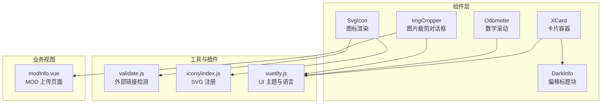
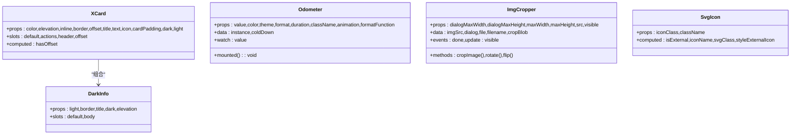
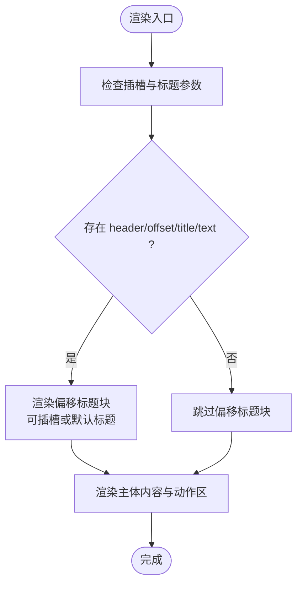
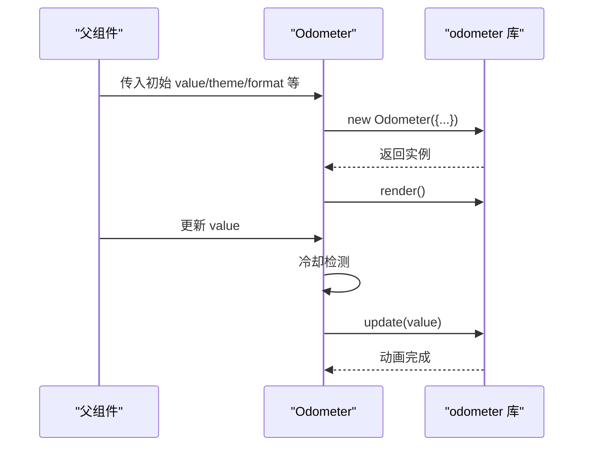
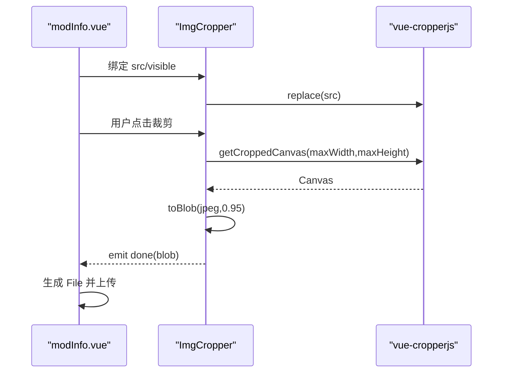
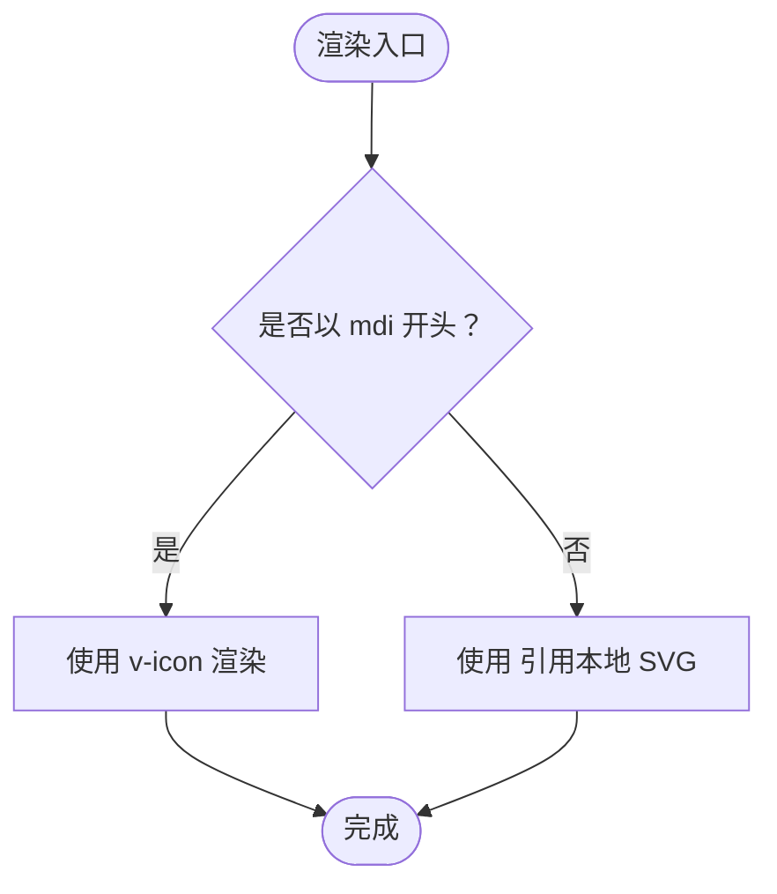
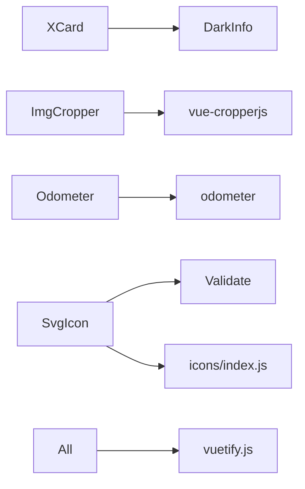

# 业务组件

<cite>
**本文引用的文件**
- [XCard/index.vue](file://SpeedRunners.UI/src/components/XCard/index.vue)
- [XCard/DarkInfo.vue](file://SpeedRunners.UI/src/components/XCard/DarkInfo.vue)
- [Odometer/index.vue](file://SpeedRunners.UI/src/components/Odometer/index.vue)
- [ImgCropper/index.vue](file://SpeedRunners.UI/src/components/ImgCropper/index.vue)
- [SvgIcon/index.vue](file://SpeedRunners.UI/src/components/SvgIcon/index.vue)
- [validate.js](file://SpeedRunners.UI/src/utils/validate.js)
- [icons/index.js](file://SpeedRunners.UI/src/icons/index.js)
- [vuetify.js](file://SpeedRunners.UI/src/plugins/vuetify.js)
- [package.json](file://SpeedRunners.UI/package.json)
- [modInfo.vue](file://SpeedRunners.UI/src/views/mod/modInfo.vue)
- [zh.json](file://SpeedRunners.UI/src/i18n/lang/zh.json)
</cite>

## 目录
1. [简介](#简介)
2. [项目结构](#项目结构)
3. [核心组件](#核心组件)
4. [架构总览](#架构总览)
5. [详细组件分析](#详细组件分析)
6. [依赖关系分析](#依赖关系分析)
7. [性能考量](#性能考量)
8. [故障排查指南](#故障排查指南)
9. [结论](#结论)
10. [附录](#附录)

## 简介
本文件系统化梳理 SpeedRunnersLab 前端业务组件库，重点覆盖以下可复用组件：
- 卡片组件：XCard 及其子组件 DarkInfo，用于统一承载内容、标题与操作区，支持偏移标题、响应式内边距与明暗主题适配。
- 数字滚动组件：Odometer，基于 odometer 库实现带主题与动画的数字滚动展示。
- 图片裁剪组件：ImgCropper，基于 vue-cropperjs 提供拖拽、旋转、翻转与裁剪导出能力，并通过事件回调输出 Blob。
- 图标组件：SvgIcon，统一封装 SVG 与 Material Design 图标渲染，支持外部图标与本地 SVG sprite。

文档将从功能特性、API 接口、使用方法、配置项、事件与插槽、样式定制、封装原则与复用策略、测试与调试、最佳实践与性能优化等方面展开。

## 项目结构
业务组件集中于前端工程 SpeedRunners.UI 的 components 目录，配合工具函数、图标注册与 UI 框架插件共同构成组件体系。

图表来源
- [XCard/index.vue](file://SpeedRunners.UI/src/components/XCard/index.vue#L1-L102)
- [XCard/DarkInfo.vue](file://SpeedRunners.UI/src/components/XCard/DarkInfo.vue#L1-L76)
- [Odometer/index.vue](file://SpeedRunners.UI/src/components/Odometer/index.vue#L1-L72)
- [ImgCropper/index.vue](file://SpeedRunners.UI/src/components/ImgCropper/index.vue#L1-L157)
- [SvgIcon/index.vue](file://SpeedRunners.UI/src/components/SvgIcon/index.vue#L1-L66)
- [validate.js](file://SpeedRunners.UI/src/utils/validate.js#L1-L20)
- [icons/index.js](file://SpeedRunners.UI/src/icons/index.js#L1-L9)
- [vuetify.js](file://SpeedRunners.UI/src/plugins/vuetify.js#L1-L33)
- [modInfo.vue](file://SpeedRunners.UI/src/views/mod/modInfo.vue#L160-L176)

章节来源
- [XCard/index.vue](file://SpeedRunners.UI/src/components/XCard/index.vue#L1-L102)
- [Odometer/index.vue](file://SpeedRunners.UI/src/components/Odometer/index.vue#L1-L72)
- [ImgCropper/index.vue](file://SpeedRunners.UI/src/components/ImgCropper/index.vue#L1-L157)
- [SvgIcon/index.vue](file://SpeedRunners.UI/src/components/SvgIcon/index.vue#L1-L66)
- [validate.js](file://SpeedRunners.UI/src/utils/validate.js#L1-L20)
- [icons/index.js](file://SpeedRunners.UI/src/icons/index.js#L1-L9)
- [vuetify.js](file://SpeedRunners.UI/src/plugins/vuetify.js#L1-L33)

## 核心组件
本节对四个业务组件进行概览式说明，包含职责、关键属性与行为。

- XCard
  - 职责：统一卡片容器，支持标题/副标题偏移、动作区分隔线、响应式内边距、明暗主题适配。
  - 关键属性：color、elevation、inline、border、offset、title、text、icon、cardPadding、dark、light。
  - 插槽：默认插槽承载主体内容；actions 插槽承载操作区；header/offset 插槽用于自定义偏移标题区域。
  - 行为：根据是否存在 header/offset/title/text 决定是否显示偏移标题块；透传原生属性与事件监听器。

- DarkInfo
  - 职责：作为 XCard 的偏移标题块，提供明/暗主题与边框样式的统一展示。
  - 关键属性：light、border、title、dark、elevation。
  - 插槽：默认插槽承载标题文本；body 插槽承载标题块下方内容。

- Odometer
  - 职责：数字滚动展示，支持主题、格式、动画与颜色定制。
  - 关键属性：value、color、theme、format、duration、className、animation、formatFunction。
  - 行为：mounted 初始化实例并渲染；watch 监听 value 变化触发 update；内置冷却机制避免频繁更新。

- ImgCropper
  - 职责：弹窗式图片裁剪，支持旋转、翻转、限制最大宽高、导出 Blob。
  - 关键属性：dialogMaxWidth、dialogMaxHeight、maxWidth、maxHeight、src、visible。
  - 事件：done（导出 Blob）、update:visible（控制可见性双向绑定）。
  - 方法：cropImage（导出裁剪后的 Blob）、rotate（旋转）、flip（水平/垂直翻转）。

- SvgIcon
  - 职责：统一渲染图标，支持 Material Design 与本地 SVG sprite。
  - 关键属性：iconClass（必填）、className。
  - 行为：内部判断是否外部链接；当以 mdi 开头时直接使用 v-icon 渲染，否则使用 <use> 引用本地 SVG。

章节来源
- [XCard/index.vue](file://SpeedRunners.UI/src/components/XCard/index.vue#L1-L102)
- [XCard/DarkInfo.vue](file://SpeedRunners.UI/src/components/XCard/DarkInfo.vue#L1-L76)
- [Odometer/index.vue](file://SpeedRunners.UI/src/components/Odometer/index.vue#L1-L72)
- [ImgCropper/index.vue](file://SpeedRunners.UI/src/components/ImgCropper/index.vue#L1-L157)
- [SvgIcon/index.vue](file://SpeedRunners.UI/src/components/SvgIcon/index.vue#L1-L66)

## 架构总览
组件间协作关系如下：

图表来源
- [XCard/index.vue](file://SpeedRunners.UI/src/components/XCard/index.vue#L35-L39)
- [XCard/DarkInfo.vue](file://SpeedRunners.UI/src/components/XCard/DarkInfo.vue#L17-L39)
- [Odometer/index.vue](file://SpeedRunners.UI/src/components/Odometer/index.vue#L14-L29)
- [ImgCropper/index.vue](file://SpeedRunners.UI/src/components/ImgCropper/index.vue#L67-L93)
- [SvgIcon/index.vue](file://SpeedRunners.UI/src/components/SvgIcon/index.vue#L13-L48)

## 详细组件分析

### XCard 组件
- 功能特性
  - 支持标题/副标题偏移块，自动根据插槽与 props 判定是否显示。
  - 响应式内边距：在 md 及以上断点使用默认内边距，在小屏使用更紧凑的 pa-1。
  - 明暗主题适配：通过 dark/light 控制背景与边框样式。
  - 透传原生属性与事件：inheritAttrs 与 v-bind/v-on 使组件具备良好的可扩展性。
- API 接口
  - 属性
    - color: 字符串，默认 primary
    - elevation: 数字或字符串，默认 3
    - inline: 布尔，默认 false
    - border: 字符串，默认 bottom
    - offset: 数字或字符串，默认 24
    - title: 字符串，默认 undefined
    - text: 字符串，默认 undefined
    - icon: 字符串，默认 undefined
    - cardPadding: 字符串，默认函数（根据断点返回空或 pa-1）
    - dark: 布尔，默认 false
    - light: 布尔，默认 true
  - 插槽
    - default：卡片主体内容
    - actions：底部操作区
    - header/offset：自定义偏移标题区域
- 使用方法与配置
  - 在需要展示标题与操作区的卡片中引入 XCard，结合 DarkInfo 或自定义 header/offset 插槽。
  - 通过 cardPadding 自定义不同屏幕尺寸下的内边距。
- 样式定制
  - 通过 color/elevation/dark/light/border 等属性影响外观。
  - 可结合 Vuetify 主题变量与 SCSS 覆盖实现深度定制。

图表来源
- [XCard/index.vue](file://SpeedRunners.UI/src/components/XCard/index.vue#L8-L31)
- [XCard/index.vue](file://SpeedRunners.UI/src/components/XCard/index.vue#L94-L100)

章节来源
- [XCard/index.vue](file://SpeedRunners.UI/src/components/XCard/index.vue#L1-L102)
- [XCard/DarkInfo.vue](file://SpeedRunners.UI/src/components/XCard/DarkInfo.vue#L1-L76)

### Odometer 组件
- 功能特性
  - 数字滚动动画：支持多种主题与动画风格。
  - 格式化与颜色：支持自定义格式、颜色与格式化函数。
  - 冷却机制：避免短时间内多次 update 导致的抖动。
- API 接口
  - 属性
    - value: 数字，默认 0
    - color: 字符串，默认 white
    - theme: 字符串，默认 minimal
    - format: 字符串，默认 (,ddd)
    - duration: 数字，默认 1000
    - className: 字符串，默认 odometer
    - animation: 字符串，默认空
    - formatFunction: 函数，默认返回原值
  - 数据
    - instance: Odometer 实例
    - coldDown: 布尔，冷却状态
- 使用方法与配置
  - 在需要数字滚动展示的场景使用，如统计、计数、评分等。
  - 通过 watch 监听 value 变化自动更新。
- 样式定制
  - 通过 className 与主题 CSS 文件进行样式覆盖。
  - 可调整 transition 持续时间以匹配业务节奏。

图表来源
- [Odometer/index.vue](file://SpeedRunners.UI/src/components/Odometer/index.vue#L50-L61)
- [Odometer/index.vue](file://SpeedRunners.UI/src/components/Odometer/index.vue#L30-L49)

章节来源
- [Odometer/index.vue](file://SpeedRunners.UI/src/components/Odometer/index.vue#L1-L72)

### ImgCropper 组件
- 功能特性
  - 弹窗式裁剪：支持最大宽高限制、最小容器尺寸、背景网格、可旋转。
  - 操作丰富：裁剪、旋转（左右）、翻转（水平/垂直）。
  - 输出标准：导出 JPEG Blob，便于上传或预览。
- API 接口
  - 属性
    - dialogMaxWidth: 字符串，默认 600px
    - dialogMaxHeight: 字符串，默认 0.8vh
    - maxWidth: 数字，默认 1920
    - maxHeight: 数字，默认 1200
    - src: 字符串，默认空
    - visible: 布尔，默认 false
  - 事件
    - done(blob): 裁剪完成，输出 Blob
    - update:visible(visible): 双向绑定可见性
  - 方法
    - cropImage(): 导出裁剪后的 Blob
    - rotate(dir): 旋转（'r'/'l'）
    - flip(vert): 翻转（true/false）
- 使用方法与配置
  - 在 MOD 上传等场景中，先选择图片，打开弹窗进行裁剪与编辑，完成后接收 Blob 并上传。
  - 结合业务视图 modInfo.vue 中的文件选择与上传流程。
- 样式定制
  - 可通过 max-width/max-height 与弹窗尺寸控制视觉体验。
  - 图标间距可通过 scoped 样式微调。

图表来源
- [ImgCropper/index.vue](file://SpeedRunners.UI/src/components/ImgCropper/index.vue#L100-L129)
- [ImgCropper/index.vue](file://SpeedRunners.UI/src/components/ImgCropper/index.vue#L130-L148)
- [modInfo.vue](file://SpeedRunners.UI/src/views/mod/modInfo.vue#L160-L176)

章节来源
- [ImgCropper/index.vue](file://SpeedRunners.UI/src/components/ImgCropper/index.vue#L1-L157)
- [modInfo.vue](file://SpeedRunners.UI/src/views/mod/modInfo.vue#L160-L176)

### SvgIcon 组件
- 功能特性
  - 统一图标渲染：支持 Material Design 图标与本地 SVG sprite。
  - 外链检测：通过工具函数识别外部链接，采用 mask 方案渲染。
- API 接口
  - 属性
    - iconClass: 字符串，必填
    - className: 字符串，默认空
  - 计算属性
    - isExternal: 布尔，是否外链
    - iconName: 字符串，图标引用路径或 MDI 名称
    - svgClass: 字符串，SVG 类名拼接
    - styleExternalIcon: 对象，mask 样式
- 使用方法与配置
  - 在全局注册后，通过 <svg-icon icon-class="..."/> 使用。
  - 本地 SVG 通过 icons/index.js 批量注册至 sprite。
- 样式定制
  - 通过 className 与 SCSS 覆盖默认尺寸与对齐方式。

图表来源
- [SvgIcon/index.vue](file://SpeedRunners.UI/src/components/SvgIcon/index.vue#L3-L6)
- [SvgIcon/index.vue](file://SpeedRunners.UI/src/components/SvgIcon/index.vue#L25-L48)
- [validate.js](file://SpeedRunners.UI/src/utils/validate.js#L9-L11)
- [icons/index.js](file://SpeedRunners.UI/src/icons/index.js#L1-L9)

章节来源
- [SvgIcon/index.vue](file://SpeedRunners.UI/src/components/SvgIcon/index.vue#L1-L66)
- [validate.js](file://SpeedRunners.UI/src/utils/validate.js#L1-L20)
- [icons/index.js](file://SpeedRunners.UI/src/icons/index.js#L1-L9)

## 依赖关系分析
- 组件依赖
  - XCard 依赖 DarkInfo 子组件。
  - ImgCropper 依赖 vue-cropperjs 与 cropperjs 样式。
  - Odometer 依赖 odometer 库与多主题 CSS。
  - SvgIcon 依赖 validate 工具与 icons/index.js 注册的 SVG sprite。
- UI 框架与主题
  - Vuetify 插件提供主题、语言与图标字体配置，组件普遍使用其样式与主题变量。
- 外部依赖
  - package.json 中声明了各组件所需的第三方库版本。

图表来源
- [XCard/index.vue](file://SpeedRunners.UI/src/components/XCard/index.vue#L35-L39)
- [ImgCropper/index.vue](file://SpeedRunners.UI/src/components/ImgCropper/index.vue#L64-L65)
- [Odometer/index.vue](file://SpeedRunners.UI/src/components/Odometer/index.vue#L6-L13)
- [SvgIcon/index.vue](file://SpeedRunners.UI/src/components/SvgIcon/index.vue#L11-L11)
- [icons/index.js](file://SpeedRunners.UI/src/icons/index.js#L1-L9)
- [vuetify.js](file://SpeedRunners.UI/src/plugins/vuetify.js#L1-L33)
- [package.json](file://SpeedRunners.UI/package.json#L15-L32)

章节来源
- [package.json](file://SpeedRunners.UI/package.json#L15-L32)
- [vuetify.js](file://SpeedRunners.UI/src/plugins/vuetify.js#L1-L33)

## 性能考量
- 图片裁剪
  - 限制最大宽高与导出质量，避免大图传输与内存占用过高。
  - 在多次旋转/翻转后及时释放临时 URL，防止内存泄漏。
- 数字滚动
  - 合理设置 duration 与 format，减少不必要的重绘。
  - 使用冷却机制避免高频更新导致的卡顿。
- 图标渲染
  - 优先使用本地 SVG sprite，减少请求次数。
  - 外链图标采用 mask 渲染，注意跨域与缓存策略。
- 卡片布局
  - 响应式内边距在小屏下提升可读性，但需避免过度嵌套导致的层级过深。

## 故障排查指南
- 图片裁剪不可用
  - 检查 src 是否为空，确认已调用 replace 并等待资源加载。
  - 确认 visible 与 dialog 的双向绑定是否生效。
- 裁剪导出为空
  - 确认 getCroppedCanvas 的参数与 toBlob 的格式/质量设置。
  - 检查浏览器兼容性与安全策略（如跨域）。
- 数字滚动不更新
  - 确认 value 是否变化且未处于冷却状态。
  - 检查实例是否已初始化与渲染。
- 图标不显示
  - 检查 iconClass 是否正确（MDI 前缀或 sprite 键名）。
  - 确认 icons/index.js 已执行并注册 SVG。
- 国际化文案
  - 检查 i18n 语言包中对应键值是否存在，如 components.cropper.title/crop。

章节来源
- [ImgCropper/index.vue](file://SpeedRunners.UI/src/components/ImgCropper/index.vue#L100-L129)
- [Odometer/index.vue](file://SpeedRunners.UI/src/components/Odometer/index.vue#L30-L49)
- [SvgIcon/index.vue](file://SpeedRunners.UI/src/components/SvgIcon/index.vue#L25-L48)
- [zh.json](file://SpeedRunners.UI/src/i18n/lang/zh.json#L192-L196)

## 结论
上述业务组件围绕统一的 UI 规范与可复用性设计，形成卡片、数字滚动、图片裁剪与图标渲染的闭环。通过属性驱动、插槽扩展与事件回调，组件在保持通用性的同时满足特定业务场景需求。建议在新业务中优先复用现有组件，并遵循统一的主题与国际化策略，以降低维护成本并提升一致性。

## 附录
- 测试与调试
  - 单元测试：利用 Jest 与 @vue/test-utils 编写组件快照与交互测试。
  - 调试技巧：使用 Vue Devtools 观察组件 props、data 与事件流；在 ImgCropper 中打印 getCroppedCanvas 的尺寸与 toBlob 的二进制数据。
- 最佳实践
  - 组件命名与目录结构保持一致，属性命名语义化。
  - 事件命名采用 update:xxx 与 done 等约定俗成的语义化命名。
  - 在业务视图中仅做数据与流程编排，避免在组件内耦合业务逻辑。
- 性能优化
  - 图片裁剪与导出前进行压缩与尺寸限制。
  - 数字滚动与图标渲染避免不必要的重复实例化与样式重排。