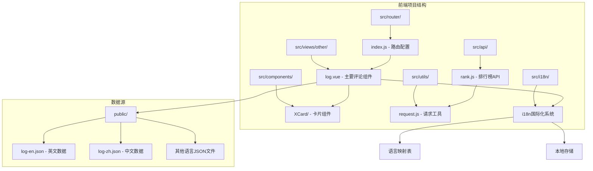
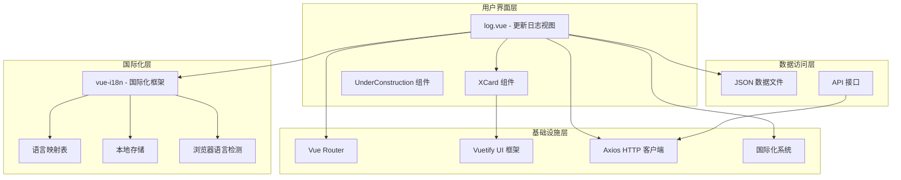
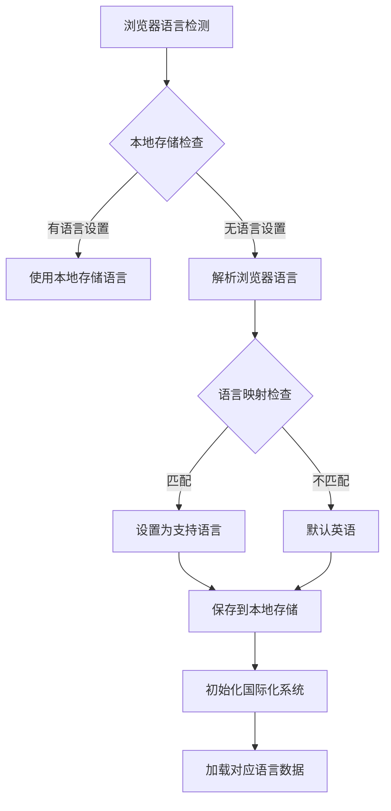
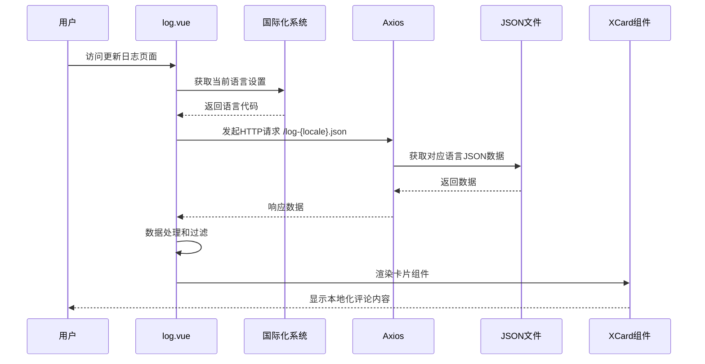
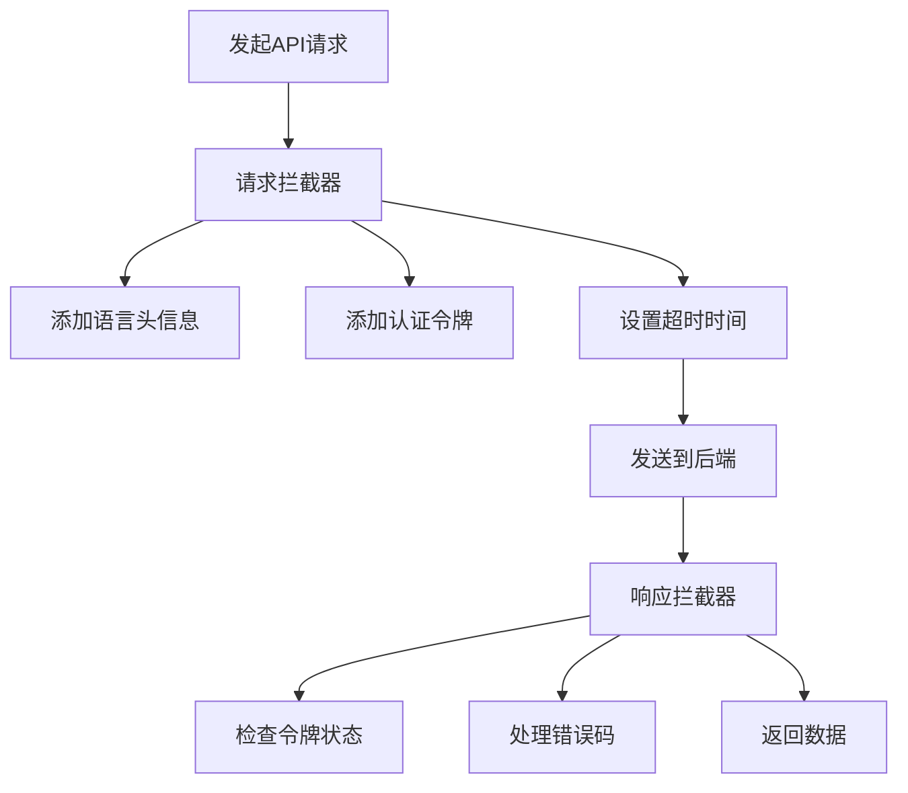
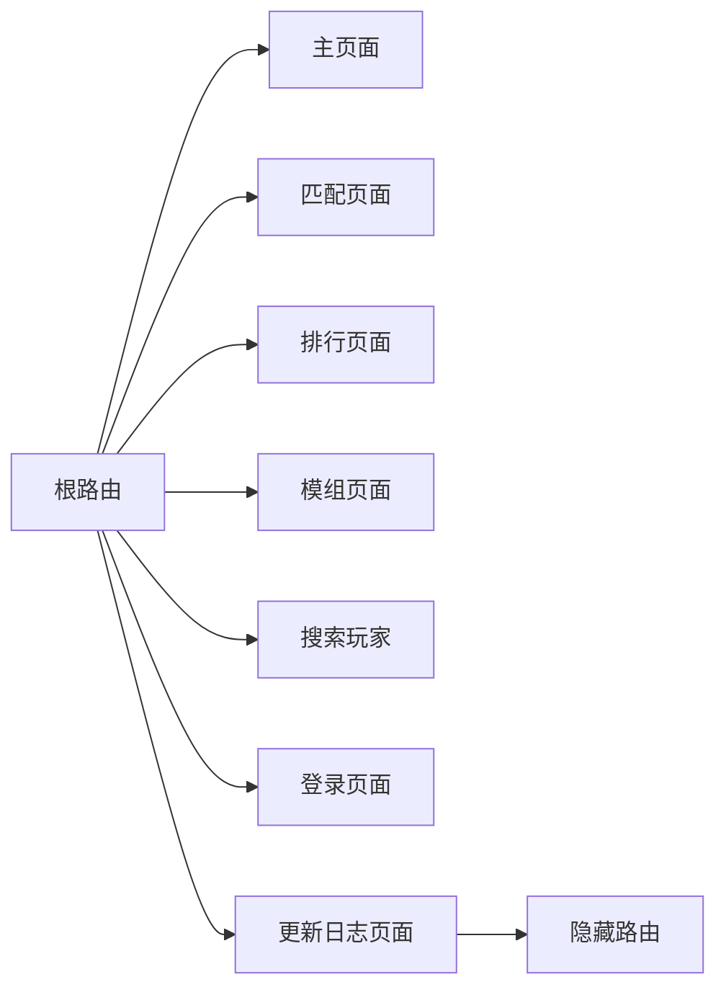
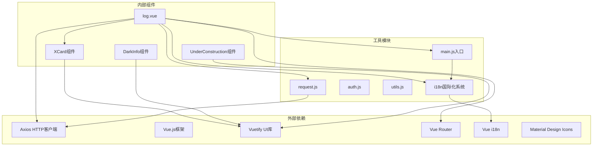
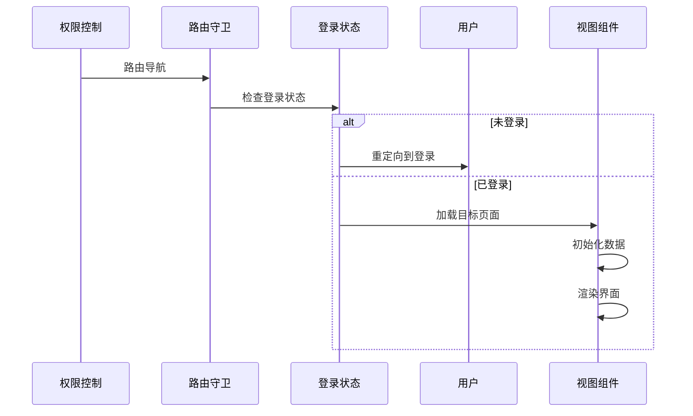

# 前端评论组件

<cite>
**本文档引用的文件**
- [log.vue](file://SpeedRunners.UI/src/views/other/log.vue)
- [index.vue](file://SpeedRunners.UI/src/components/XCard/index.vue)
- [DarkInfo.vue](file://SpeedRunners.UI/src/components/XCard/DarkInfo.vue)
- [index.vue](file://SpeedRunners.UI/src/components/UnderConstruction/index.vue)
- [log-en.json](file://SpeedRunners.UI/public/log-en.json)
- [log-zh.json](file://SpeedRunners.UI/public/log-zh.json)
- [index.js](file://SpeedRunners.UI/src/i18n/index.js)
- [main.js](file://SpeedRunners.UI/src/main.js)
- [rank.js](file://SpeedRunners.UI/src/api/rank.js)
- [user.js](file://SpeedRunners.UI/src/api/user.js)
- [request.js](file://SpeedRunners.UI/src/utils/request.js)
- [index.js](file://SpeedRunners.UI/src/router/index.js)
- [permission.js](file://SpeedRunners.UI/src/permission.js)
- [index.vue](file://SpeedRunners.UI/src/layout/index.vue)
</cite>

## 更新摘要
**所做更改**
- 更新了国际化支持部分，反映了新增的多语言评论系统
- 增强了评论组件的本地化功能说明
- 添加了国际化语言映射和自动检测机制的详细说明
- 更新了评论系统的多语言数据源结构

## 目录
1. [简介](#简介)
2. [项目结构](#项目结构)
3. [核心组件](#核心组件)
4. [架构概览](#架构概览)
5. [详细组件分析](#详细组件分析)
6. [依赖关系分析](#依赖关系分析)
7. [性能考虑](#性能考虑)
8. [故障排除指南](#故障排除指南)
9. [结论](#结论)

## 简介

SpeedRunnersLab 项目中的前端评论组件主要体现在"更新日志"功能中。该项目使用 Vue.js + Vuetify 构建，评论功能通过 JSON 数据驱动的方式实现，主要用于展示项目的发展历程、版本更新和功能变更。

该评论系统具有以下特点：
- 基于 JSON 文件的数据源
- 支持多语言显示（中文/英文，现已扩展至19种语言）
- 使用 Material Design 图标
- 响应式设计
- 与用户认证系统集成
- **新增**：智能语言检测和自动切换机制

**更新** 新增了完整的国际化支持，包括19种语言的本地化功能和智能语言检测机制。

## 项目结构

前端评论组件位于 SpeedRunners.UI 项目中，采用模块化组织方式：

**图表来源**
- [log.vue:1-180](file://SpeedRunners.UI/src/views/other/log.vue#L1-L180)
- [index.vue:1-102](file://SpeedRunners.UI/src/components/XCard/index.vue#L1-L102)
- [index.js:1-110](file://SpeedRunners.UI/src/i18n/index.js#L1-L110)

**章节来源**
- [log.vue:1-180](file://SpeedRunners.UI/src/views/other/log.vue#L1-L180)
- [index.vue:1-102](file://SpeedRunners.UI/src/components/XCard/index.vue#L1-L102)
- [index.js:1-110](file://SpeedRunners.UI/src/i18n/index.js#L1-L110)

## 核心组件

### 更新日志视图组件

更新日志组件是评论系统的核心，负责展示项目的历史版本信息和变更记录。

**主要功能特性：**
- 动态加载 JSON 数据文件（根据语言自动选择）
- 多语言支持（19种语言）
- 版本分类显示（里程碑、特性、修复等）
- 图标和颜色标识系统
- 响应式布局设计
- **新增**：智能语言检测和切换

**数据加载机制：**
组件通过 `$i18n.locale` 动态生成数据文件名，如 `/log-${this.$i18n.locale}.json`，确保加载对应语言的数据。

**章节来源**
- [log.vue:85-93](file://SpeedRunners.UI/src/views/other/log.vue#L85-L93)
- [log-en.json:1-384](file://SpeedRunners.UI/public/log-en.json#L1-L384)
- [log-zh.json:1-384](file://SpeedRunners.UI/public/log-zh.json#L1-L384)

### XCard 卡片组件

XCard 是一个通用的卡片容器组件，为评论内容提供统一的视觉样式。

**核心属性：**
- `color`: 卡片主题颜色
- `elevation`: 阴影层级
- `offset`: 标题偏移量
- `title/text`: 标题文本
- `icon`: 左侧图标
- `dark/light`: 明暗主题模式

**章节来源**
- [index.vue:34-102](file://SpeedRunners.UI/src/components/XCard/index.vue#L34-L102)
- [DarkInfo.vue:1-76](file://SpeedRunners.UI/src/components/XCard/DarkInfo.vue#L1-L76)

## 架构概览

前端评论系统的整体架构采用分层设计，集成了完整的国际化支持：

**图表来源**
- [log.vue:85-93](file://SpeedRunners.UI/src/views/other/log.vue#L85-L93)
- [index.js:25-78](file://SpeedRunners.UI/src/i18n/index.js#L25-L78)
- [main.js:9-29](file://SpeedRunners.UI/src/main.js#L9-L29)

## 详细组件分析

### 国际化系统详细分析

#### 语言检测和映射机制

**图表来源**
- [index.js:70-78](file://SpeedRunners.UI/src/i18n/index.js#L70-L78)

#### 支持的语言列表

国际化系统支持以下19种语言：

| 语言代码 | 语言名称 | 浏览器代码示例 |
|----------|----------|----------------|
| zh | 中文简体 | zh, zh-cn, zh-tw, zh-hk |
| en | 英语 | en, en-us, en-gb |
| ru | 俄语 | ru |
| pt-br | 巴西葡萄牙语 | pt, pt-br |
| ja | 日语 | ja |
| ko | 韩语 | ko, ko-kr |
| fr | 法语 | fr, fr-fr |
| it | 意大利语 | it, it-it |
| de | 德语 | de, de-de, de-at |
| es-es | 西班牙语（西班牙） | es, es-es |
| cs | 捷克语 | cs, cs-cz |
| ro | 罗马尼亚语 | ro, ro-ro |
| nl | 荷兰语 | nl, nl-nl |
| hu | 匈牙利语 | hu, hu-hu |
| el | 希腊语 | el, el-gr |
| no | 挪威语 | no, nb, nn |
| tr | 土耳其语 | tr, tr-tr |
| uk | 乌克兰语 | uk, uk-ua |
| pl | 波兰语 | pl, pl-pl |

**章节来源**
- [index.js:25-68](file://SpeedRunners.UI/src/i18n/index.js#L25-L68)

### 更新日志组件详细分析

#### 数据加载流程

**图表来源**
- [log.vue:85-93](file://SpeedRunners.UI/src/views/other/log.vue#L85-L93)
- [index.js:81-85](file://SpeedRunners.UI/src/i18n/index.js#L81-L85)

#### 版本分类系统

组件实现了完整的版本分类体系：

| 类型 | 描述 | 图标 | 颜色 |
|------|------|------|------|
| milestone | 里程碑 | mdi-rocket | 红色 |
| feature | 新特性 | mdi-lightbulb-on | 蓝色 |
| fix | 修复问题 | mdi-bug | 绿色 |
| beautify | 美化改进 | mdi-flower | 紫色 |
| architecture | 架构调整 | mdi-cloud | 橙色 |
| other | 其他 | mdi-wrench | 灰色 |

**章节来源**
- [log.vue:98-172](file://SpeedRunners.UI/src/views/other/log.vue#L98-L172)

### API 集成分析

#### 请求拦截器机制

**图表来源**
- [request.js:14-80](file://SpeedRunners.UI/src/utils/request.js#L14-L80)

**章节来源**
- [request.js:1-82](file://SpeedRunners.UI/src/utils/request.js#L1-L82)
- [rank.js:1-64](file://SpeedRunners.UI/src/api/rank.js#L1-L64)
- [user.js:1-77](file://SpeedRunners.UI/src/api/user.js#L1-L77)

### 路由和导航集成

更新日志页面通过路由系统集成到主应用中：

**图表来源**
- [index.js:33-94](file://SpeedRunners.UI/src/router/index.js#L33-L94)

**章节来源**
- [index.js:74-78](file://SpeedRunners.UI/src/router/index.js#L74-L78)

## 依赖关系分析

### 组件依赖图

**图表来源**
- [log.vue:74-84](file://SpeedRunners.UI/src/views/other/log.vue#L74-L84)
- [index.vue:35-40](file://SpeedRunners.UI/src/components/XCard/index.vue#L35-L40)
- [index.js:1-110](file://SpeedRunners.UI/src/i18n/index.js#L1-L110)
- [main.js:9-29](file://SpeedRunners.UI/src/main.js#L9-L29)

### 数据流分析

**图表来源**
- [permission.js:13-60](file://SpeedRunners.UI/src/permission.js#L13-L60)

**章节来源**
- [permission.js:1-69](file://SpeedRunners.UI/src/permission.js#L1-L69)
- [main.js:1-30](file://SpeedRunners.UI/src/main.js#L1-L30)

## 性能考虑

### 数据加载优化

1. **缓存策略**：通过时间戳参数避免浏览器缓存
2. **按需加载**：仅在访问更新日志页面时加载数据
3. **异步处理**：使用 Promise 处理异步数据请求
4. ****：智能语言检测减少不必要的语言切换

### 组件渲染优化

1. **响应式设计**：适配不同屏幕尺寸
2. **懒加载**：路由级别的组件懒加载
3. **条件渲染**：根据用户状态动态显示内容
4. **国际化缓存**：语言设置持久化存储

## 故障排除指南

### 常见问题及解决方案

#### 数据加载失败

**症状**：更新日志页面空白或显示错误

**可能原因**：
- JSON 文件路径错误
- 网络连接问题
- CORS 跨域限制
- **新增**：语言文件缺失或命名不规范

**解决步骤**：
1. 检查 JSON 文件是否存在
2. 验证文件路径和命名（log-{language}.json）
3. 查看浏览器开发者工具网络面板
4. 确认服务器配置
5. **新增**：验证对应语言的数据文件完整性

#### 国际化显示问题

**症状**：更新日志显示乱码或不正确

**解决方法**：
1. 确认浏览器语言设置
2. 检查 JSON 文件编码格式（UTF-8）
3. 验证 i18n 配置
4. **新增**：检查语言映射表是否包含对应语言
5. **新增**：确认本地存储的语言设置

#### 组件样式异常

**症状**：卡片组件显示不符合预期

**排查要点**：
1. 检查 Vuetify 版本兼容性
2. 验证 SCSS 样式导入
3. 确认主题配置
4. **新增**：检查 Material Design 图标加载

**章节来源**
- [log.vue:86-92](file://SpeedRunners.UI/src/views/other/log.vue#L86-L92)
- [request.js:75-79](file://SpeedRunners.UI/src/utils/request.js#L75-L79)
- [index.js:81-108](file://SpeedRunners.UI/src/i18n/index.js#L81-L108)

## 结论

SpeedRunnersLab 项目的前端评论组件展现了良好的模块化设计和用户体验。通过 JSON 数据驱动的方式，实现了灵活的内容管理和多语言支持。组件架构清晰，依赖关系明确，为后续的功能扩展奠定了坚实基础。

**主要优势包括**：
- 简洁高效的代码结构
- **大幅增强**：完善的国际化支持（19种语言）
- 智能语言检测和自动切换机制
- 良好的性能表现
- 易于维护和扩展

**新增功能亮点**：
- **完整的19种语言支持**
- **智能浏览器语言检测**
- **本地存储语言偏好**
- **动态数据文件加载**
- **响应式国际化设计**

**建议的改进建议**：
1. 添加数据验证和错误处理
2. 实现增量更新机制
3. 增加内容搜索功能
4. 优化移动端用户体验
5. **新增**：扩展更多语言支持选项
6. **新增**：提供手动语言切换界面