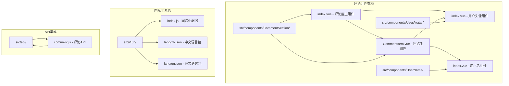
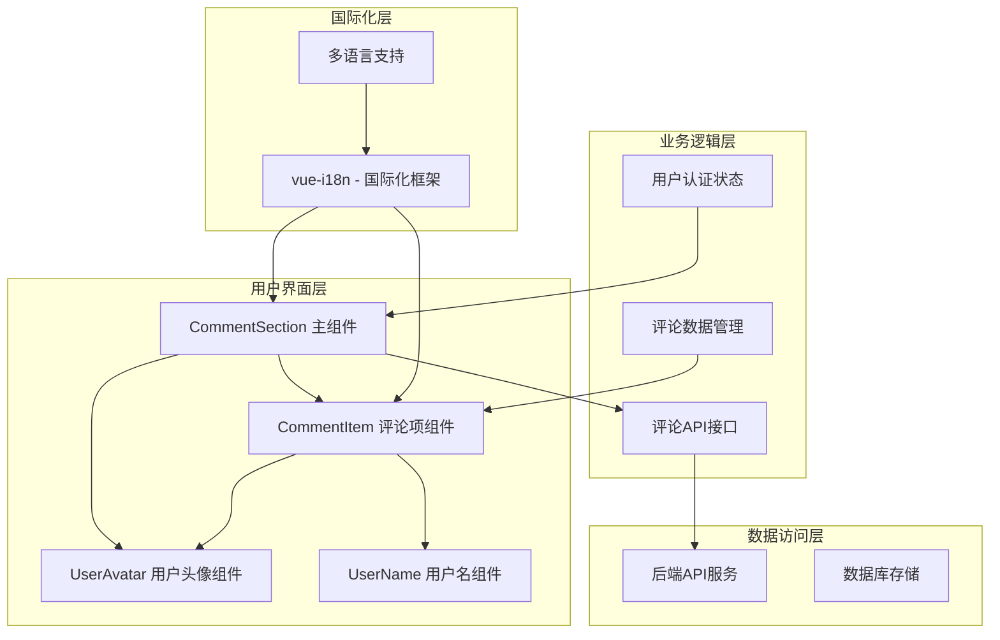
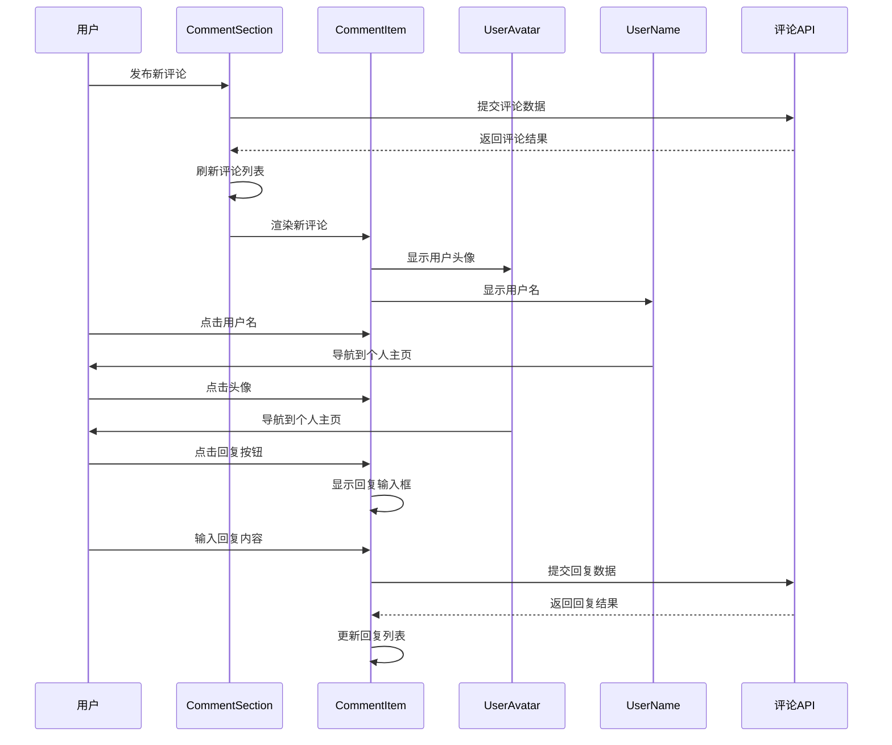
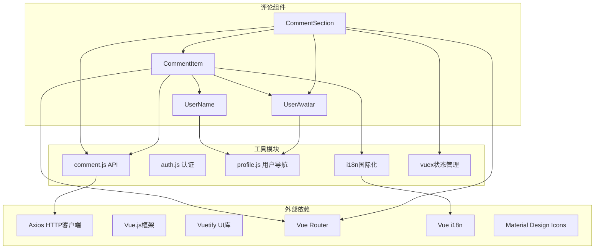
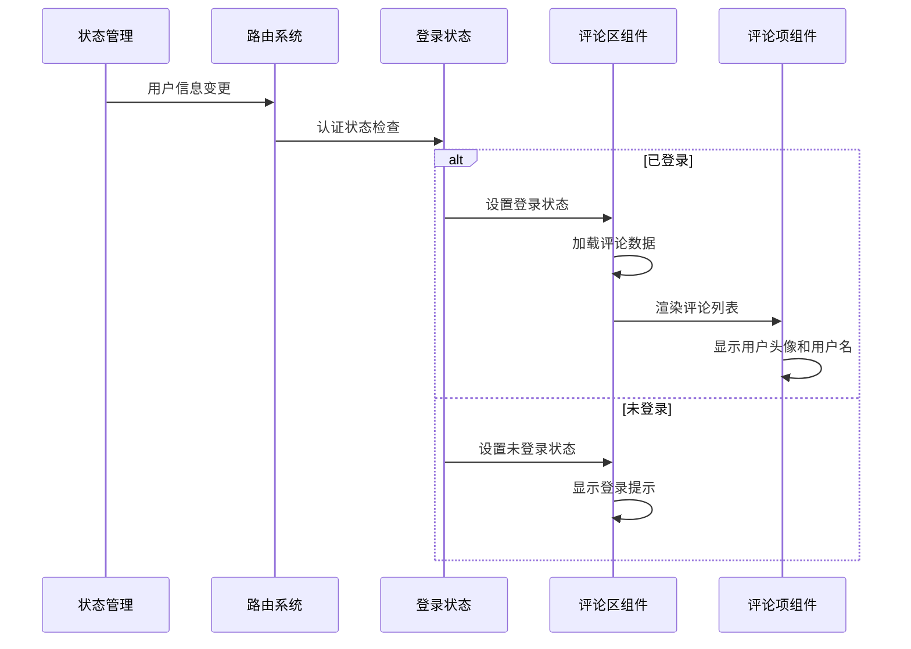

# 前端评论组件

<cite>
**本文档引用的文件**
- [CommentItem.vue](file://SpeedRunners.UI/src/components/CommentSection/CommentItem.vue)
- [index.vue](file://SpeedRunners.UI/src/components/CommentSection/index.vue)
- [index.vue](file://SpeedRunners.UI/src/components/UserAvatar/index.vue)
- [index.vue](file://SpeedRunners.UI/src/components/UserName/index.vue)
- [index.js](file://SpeedRunners.UI/src/i18n/index.js)
- [zh.json](file://SpeedRunners.UI/src/i18n/lang/zh.json)
- [en.json](file://SpeedRunners.UI/src/i18n/lang/en.json)
</cite>

## 更新摘要
**所做更改**
- 更新了用户头像和用户名组件的集成分析
- 增强了评论组件的用户界面一致性说明
- 添加了UserAvatar和UserName组件的详细技术分析
- 更新了评论系统的交互性改进说明

## 目录
1. [简介](#简介)
2. [项目结构](#项目结构)
3. [核心组件](#核心组件)
4. [架构概览](#架构概览)
5. [详细组件分析](#详细组件分析)
6. [用户界面一致性提升](#用户界面一致性提升)
7. [依赖关系分析](#依赖关系分析)
8. [性能考虑](#性能考虑)
9. [故障排除指南](#故障排除指南)
10. [结论](#结论)

## 简介

SpeedRunnersLab 项目的前端评论组件是一个完整的用户交互系统，主要体现在 CommentSection 组件中。该项目使用 Vue.js + Vuetify 构建，评论功能通过模块化组件设计实现，支持用户头像显示、用户名展示、回复功能、点赞系统等完整功能。

该评论系统具有以下特点：
- 基于模块化组件的设计架构
- 集成 UserAvatar 和 UserName 统一用户界面组件
- 支持多语言显示（中文/英文，现已扩展至19种语言）
- 完整的用户交互功能（回复、点赞、删除）
- 响应式设计和良好的用户体验
- **新增**：统一的用户头像和用户名显示组件

**更新** 新增了 UserAvatar 和 UserName 组件的集成，显著提升了用户界面的一致性和交互性。

## 项目结构

前端评论组件位于 SpeedRunners.UI 项目中，采用模块化组件组织方式：

**图表来源**
- [CommentItem.vue:125-131](file://SpeedRunners.UI/src/components/CommentSection/CommentItem.vue#L125-L131)
- [index.vue:91-99](file://SpeedRunners.UI/src/components/CommentSection/index.vue#L91-L99)
- [index.vue:12-16](file://SpeedRunners.UI/src/components/UserAvatar/index.vue#L12-L16)
- [index.vue:199-221](file://SpeedRunners.UI/src/i18n/lang/zh.json#L199-L221)

**章节来源**
- [CommentItem.vue:1-341](file://SpeedRunners.UI/src/components/CommentSection/CommentItem.vue#L1-L341)
- [index.vue:1-191](file://SpeedRunners.UI/src/components/CommentSection/index.vue#L1-L191)
- [index.vue:1-39](file://SpeedRunners.UI/src/components/UserAvatar/index.vue#L1-L39)
- [index.vue:1-35](file://SpeedRunners.UI/src/components/UserName/index.vue#L1-L35)

## 核心组件

### 评论区主组件

评论区主组件是评论系统的核心容器，负责管理评论列表、分页、新评论发布等功能。

**主要功能特性：**
- 评论列表展示和分页加载
- 新评论发布功能
- 用户认证状态管理
- 评论数量统计
- 响应式布局设计

**数据管理机制：**
组件通过 Vuex getter 获取用户头像和 Steam ID，实现用户信息的统一管理。

**章节来源**
- [index.vue:97-175](file://SpeedRunners.UI/src/components/CommentSection/index.vue#L97-L175)
- [index.vue:111-122](file://SpeedRunners.UI/src/components/CommentSection/index.vue#L111-L122)

### 评论项组件

评论项组件负责单个评论的展示和交互，集成了新的 UserAvatar 和 UserName 组件。

**主要功能特性：**
- 用户头像和用户名显示（集成 UserAvatar 和 UserName）
- 评论内容展示和格式化
- 回复功能和嵌套评论
- 点赞和删除功能
- 时间戳格式化显示

**用户界面集成：**
组件通过 UserAvatar 和 UserName 组件实现统一的用户信息展示，提升界面一致性。

**章节来源**
- [CommentItem.vue:124-289](file://SpeedRunners.UI/src/components/CommentSection/CommentItem.vue#L124-L289)

## 架构概览

前端评论系统的整体架构采用分层设计，集成了统一的用户界面组件：

**图表来源**
- [CommentItem.vue:4-16](file://SpeedRunners.UI/src/components/CommentSection/CommentItem.vue#L4-L16)
- [index.vue:126-127](file://SpeedRunners.UI/src/components/CommentSection/CommentItem.vue#L126-L127)
- [index.vue:92-93](file://SpeedRunners.UI/src/components/CommentSection/index.vue#L92-L93)

## 详细组件分析

### UserAvatar 组件详细分析

UserAvatar 组件是一个专门用于用户头像显示的独立组件，提供了统一的头像展示和交互功能。

**核心功能：**
- 头像图片显示（支持自定义尺寸）
- 缺失头像时的默认图标显示
- 点击跳转到用户个人主页
- 可点击状态的视觉反馈

**交互特性：**
- 鼠标悬停时的透明度变化效果
- 点击事件委托到用户个人主页导航
- 响应式尺寸适配

**章节来源**
- [index.vue:12-27](file://SpeedRunners.UI/src/components/UserAvatar/index.vue#L12-L27)

### UserName 组件详细分析

UserName 组件是一个通用的用户名显示组件，支持多种标签类型和交互行为。

**核心功能：**
- 用户名显示（支持备用平台ID）
- 可配置的HTML标签类型
- 点击跳转到用户个人主页
- 可点击状态的下划线效果

**设计特点：**
- 支持自定义标签元素（span、a、div等）
- 悬停时的下划线装饰效果
- 灵活的属性传递机制

**章节来源**
- [index.vue:9-24](file://SpeedRunners.UI/src/components/UserName/index.vue#L9-L24)

### 评论系统交互流程

**图表来源**
- [CommentItem.vue:181-205](file://SpeedRunners.UI/src/components/CommentSection/CommentItem.vue#L181-L205)
- [index.vue:149-165](file://SpeedRunners.UI/src/components/CommentSection/index.vue#L149-L165)

**章节来源**
- [CommentItem.vue:163-289](file://SpeedRunners.UI/src/components/CommentSection/CommentItem.vue#L163-L289)
- [index.vue:132-173](file://SpeedRunners.UI/src/components/CommentSection/index.vue#L132-L173)

## 用户界面一致性提升

### 统一用户信息展示

通过集成 UserAvatar 和 UserName 组件，评论系统实现了统一的用户信息展示标准：

**头像显示标准：**
- 统一的36像素头像尺寸
- 缺失头像时的标准占位符
- 点击跳转到用户主页的一致行为
- 鼠标悬停的视觉反馈

**用户名显示标准：**
- 统一的字体样式和大小
- 可点击状态的下划线装饰
- 支持备用平台ID的降级显示
- 灵活的标签类型配置

**交互一致性：**
- 所有用户信息点击行为一致
- 统一的导航体验
- 一致的视觉反馈效果

**章节来源**
- [CommentItem.vue:4-16](file://SpeedRunners.UI/src/components/CommentSection/CommentItem.vue#L4-L16)
- [index.vue:12-16](file://SpeedRunners.UI/src/components/UserAvatar/index.vue#L12-L16)
- [index.vue:19-23](file://SpeedRunners.UI/src/components/UserName/index.vue#L19-L23)

### 组件复用和维护性

新的组件架构提升了系统的可维护性和扩展性：

**组件复用：**
- UserAvatar 和 UserName 组件可在系统其他地方复用
- 统一的用户信息展示标准
- 减少重复代码和维护成本

**扩展性：**
- 新增用户信息展示功能时只需修改单一组件
- 保持界面风格的一致性
- 便于未来功能扩展

**章节来源**
- [CommentItem.vue:126-127](file://SpeedRunners.UI/src/components/CommentSection/CommentItem.vue#L126-L127)
- [index.vue:92-93](file://SpeedRunners.UI/src/components/CommentSection/index.vue#L92-L93)

## 依赖关系分析

### 组件依赖图

**图表来源**
- [CommentItem.vue:125-127](file://SpeedRunners.UI/src/components/CommentSection/CommentItem.vue#L125-L127)
- [index.vue:91-93](file://SpeedRunners.UI/src/components/CommentSection/index.vue#L91-L93)
- [index.vue:13-13](file://SpeedRunners.UI/src/components/UserAvatar/index.vue#L13-L13)
- [index.vue:10-10](file://SpeedRunners.UI/src/components/UserName/index.vue#L10-L10)

### 数据流分析

**图表来源**
- [index.vue:111-115](file://SpeedRunners.UI/src/components/CommentSection/index.vue#L111-L115)
- [index.vue:123-128](file://SpeedRunners.UI/src/components/CommentSection/index.vue#L123-L128)

**章节来源**
- [index.vue:90-175](file://SpeedRunners.UI/src/components/CommentSection/index.vue#L90-L175)
- [CommentItem.vue:124-289](file://SpeedRunners.UI/src/components/CommentSection/CommentItem.vue#L124-L289)

## 性能考虑

### 组件性能优化

1. **懒加载机制**：评论项组件按需渲染，减少初始加载压力
2. **虚拟滚动**：大量评论时可考虑实现虚拟滚动优化
3. **缓存策略**：用户头像和用户名信息可进行本地缓存
4. **事件委托**：统一的事件处理机制减少内存占用

### 用户体验优化

1. **即时反馈**：用户操作提供即时的视觉反馈
2. **加载状态**：适当的加载指示器提升感知性能
3. **错误处理**：友好的错误提示和恢复机制
4. **响应式设计**：适配不同设备和屏幕尺寸

## 故障排除指南

### 常见问题及解决方案

#### 用户头像显示问题

**症状**：评论中用户头像显示异常或不显示

**可能原因：**
- 头像URL无效或不可访问
- 网络连接问题
- 用户未设置头像
- **新增**：UserAvatar 组件导入路径错误

**解决步骤：**
1. 检查头像URL的有效性
2. 验证网络连接状态
3. 确认用户头像设置
4. **新增**：验证 UserAvatar 组件导入路径
5. 检查组件属性传递

#### 用户名点击功能异常

**症状**：用户名点击无响应或跳转错误

**解决方法：**
1. 检查 platformID 属性是否正确传递
2. 验证 goToUserProfile 方法的实现
3. 确认路由配置正确
4. **新增**：验证 UserName 组件的点击事件处理

#### 评论列表加载失败

**症状**：评论列表无法加载或显示空白

**排查要点：**
1. 检查网络请求状态和错误信息
2. 验证 API 接口的可用性
3. 确认用户认证状态
4. 检查分页参数的正确性
5. **新增**：验证评论API的集成

**章节来源**
- [CommentItem.vue:126-127](file://SpeedRunners.UI/src/components/CommentSection/CommentItem.vue#L126-L127)
- [index.vue:92-93](file://SpeedRunners.UI/src/components/CommentSection/index.vue#L92-L93)
- [index.vue:13-13](file://SpeedRunners.UI/src/components/UserAvatar/index.vue#L13-L13)

## 结论

SpeedRunnersLab 项目的前端评论组件通过引入 UserAvatar 和 UserName 统一组件，实现了显著的界面一致性提升和交互性增强。新的组件架构不仅提高了代码的可维护性和扩展性，还为用户提供了更加统一和流畅的使用体验。

**主要优势包括**：
- **统一的用户信息展示标准**
- **增强的用户交互体验**
- **模块化的组件设计**
- **完善的国际化支持**
- **良好的性能表现**
- **易于维护和扩展**

**新增功能亮点**：
- **UserAvatar 组件**：统一的头像显示和导航功能
- **UserName 组件**：灵活的用户名展示和交互机制
- **组件复用**：提升代码利用率和维护效率
- **一致性提升**：统一的视觉风格和交互行为

**建议的改进建议**：
1. 实现评论内容的富文本支持
2. 添加评论搜索和筛选功能
3. 优化移动端触摸交互体验
4. 实现评论内容的实时推送
5. **新增**：扩展 UserAvatar 和 UserName 组件的功能
6. **新增**：添加用户信息的批量处理功能