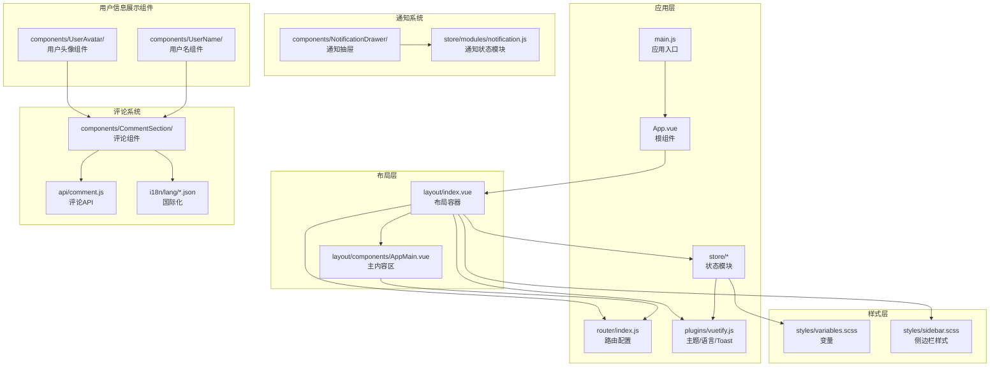
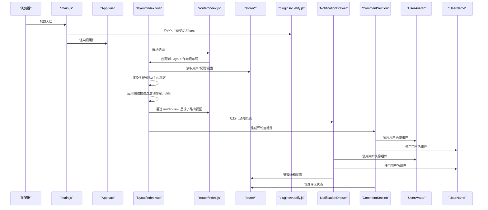
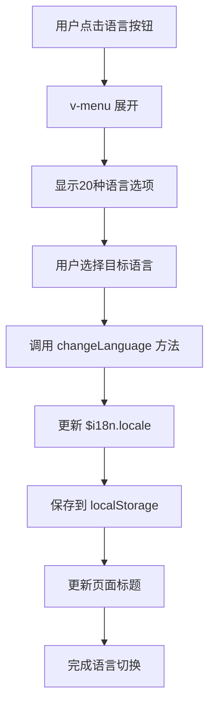
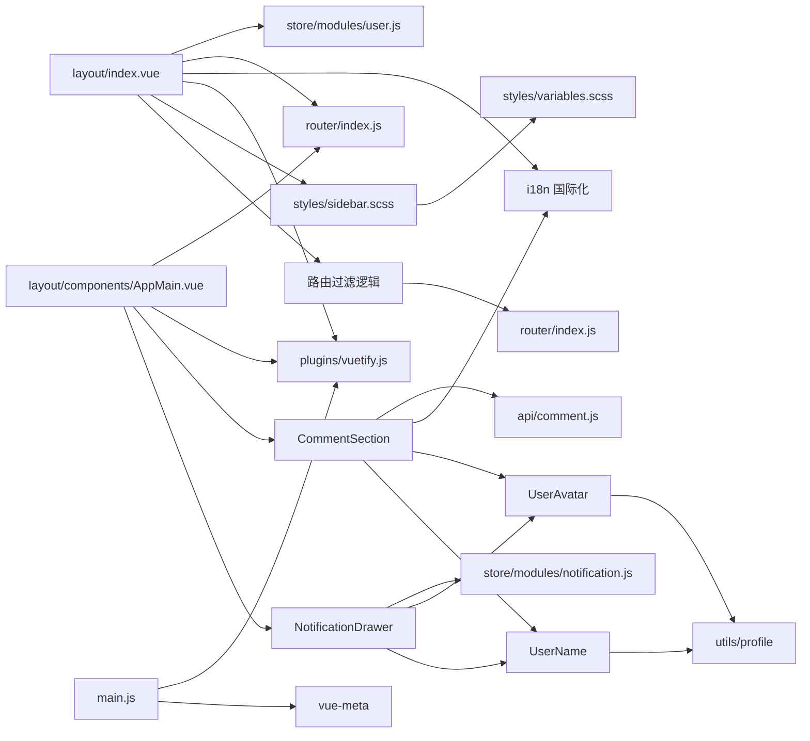

# 布局组件

<cite>
**本文引用的文件**
- [index.vue（布局容器）](file://SpeedRunners.UI/src/layout/index.vue)
- [AppMain.vue（主内容区）](file://SpeedRunners.UI/src/layout/components/AppMain.vue)
- [index.js（布局组件导出）](file://SpeedRunners.UI/src/layout/components/index.js)
- [App.vue（应用根组件）](file://SpeedRunners.UI/src/App.vue)
- [main.js（应用入口）](file://SpeedRunners.UI/src/main.js)
- [router/index.js（路由配置）](file://SpeedRunners.UI/src/router/index.js)
- [store/modules/settings.js（设置模块）](file://SpeedRunners.UI/src/store/modules/settings.js)
- [store/modules/app.js（应用状态模块）](file://SpeedRunners.UI/src/store/modules/app.js)
- [store/modules/user.js（用户状态模块）](file://SpeedRunners.UI/src/store/modules/user.js)
- [plugins/vuetify.js（主题与语言配置）](file://SpeedRunners.UI/src/plugins/vuetify.js)
- [styles/variables.scss（样式变量）](file://SpeedRunners.UI/src/styles/variables.scss)
- [styles/sidebar.scss（侧边栏样式）](file://SpeedRunners.UI/src/styles/sidebar.scss)
- [utils/resize.js（窗口尺寸监听混入）](file://SpeedRunners.UI/src/utils/resize.js)
- [views/index/index.vue（首页视图示例）](file://SpeedRunners.UI/src/views/index/index.vue)
- [views/match/index.vue（比赛视图示例）](file://SpeedRunners.UI/src/views/match/index.vue)
- [settings.js（全局设置）](file://SpeedRunners.UI/src/settings.js)
- [CommentSection/index.vue（评论区组件）](file://SpeedRunners.UI/src/components/CommentSection/index.vue)
- [CommentSection/CommentItem.vue（评论项组件）](file://SpeedRunners.UI/src/components/CommentSection/CommentItem.vue)
- [UserAvatar/index.vue（用户头像组件）](file://SpeedRunners.UI/src/components/UserAvatar/index.vue)
- [UserName/index.vue（用户名组件）](file://SpeedRunners.UI/src/components/UserName/index.vue)
- [NotificationDrawer/index.vue（通知抽屉）](file://SpeedRunners.UI/src/components/NotificationDrawer/index.vue)
- [notification.js（通知状态模块）](file://SpeedRunners.UI/src/store/modules/notification.js)
- [zh.json（中文国际化）](file://SpeedRunners.UI/src/i18n/lang/zh.json)
- [en.json（英文国际化）](file://SpeedRunners.UI/src/i18n/lang/en.json)
- [comment.js（评论API）](file://SpeedRunners.UI/src/api/comment.js)
</cite>

## 更新摘要
**所做更改**
- 新增UserAvatar和UserName组件章节，详细介绍新的用户信息展示组件
- 更新用户信息展示章节，说明从原始头像和用户名显示到新组件的迁移
- 增强组件一致性章节，说明新组件在各视图中的统一使用
- 更新依赖关系分析，包含UserAvatar和UserName组件的依赖关系
- **更新**：改进侧边栏导航过滤逻辑，排除 profile 路由，优化用户导航体验

## 目录
1. [简介](#简介)
2. [项目结构](#项目结构)
3. [核心组件](#核心组件)
4. [架构总览](#架构总览)
5. [组件详解](#组件详解)
6. [UserAvatar用户头像组件](#uservatar用户头像组件)
7. [UserName用户名组件](#username用户名组件)
8. [用户信息展示一致性](#用户信息展示一致性)
9. [语言选择下拉菜单](#语言选择下拉菜单)
10. [滚动条样式定制](#滚动条样式定制)
11. [响应式设计优化](#响应式设计优化)
12. [通知抽屉系统](#通知抽屉系统)
13. [评论系统集成](#评论系统集成)
14. [侧边栏导航优化](#侧边栏导航优化)
15. [依赖关系分析](#依赖关系分析)
16. [性能考量](#性能考量)
17. [故障排查指南](#故障排查指南)
18. [结论](#结论)
19. [附录](#附录)

## 简介
本文件面向 SpeedRunnersLab 前端布局组件，系统性梳理基于 Vue.js + Vuetify 的布局体系：从整体布局框架到组件化结构，从头部导航、侧边栏、主要内容区的组织方式，到响应式设计与移动端适配、路由集成与页面切换动画、主题定制与样式覆盖、通知系统与评论集成、用户信息展示组件的统一化、侧边栏导航优化、以及最佳实践与性能优化建议。特别关注近期新增的语言选择下拉菜单、滚动条样式定制、响应式设计优化和UserAvatar/UserName用户信息展示组件等增强功能，以及侧边栏导航过滤逻辑的改进。

## 项目结构
布局系统位于前端工程的 src/layout 目录，采用"容器组件 + 主内容区 + 导航/侧边栏"的分层设计，并通过路由与状态管理进行联动。关键文件如下：



**图表来源**
- [index.vue（布局容器）:1-556](file://SpeedRunners.UI/src/layout/index.vue#L1-L556)
- [AppMain.vue（主内容区）:1-139](file://SpeedRunners.UI/src/layout/components/AppMain.vue#L1-L139)
- [App.vue（应用根组件）:1-31](file://SpeedRunners.UI/src/App.vue#L1-L31)
- [main.js（应用入口）:1-30](file://SpeedRunners.UI/src/main.js#L1-L30)
- [router/index.js（路由配置）:1-139](file://SpeedRunners.UI/src/router/index.js#L1-L139)
- [plugins/vuetify.js（主题与语言配置）:1-33](file://SpeedRunners.UI/src/plugins/vuetify.js#L1-L33)
- [styles/variables.scss（样式变量）:1-26](file://SpeedRunners.UI/src/styles/variables.scss#L1-L26)
- [styles/sidebar.scss（侧边栏样式）:1-84](file://SpeedRunners.UI/src/styles/sidebar.scss#L1-L84)
- [NotificationDrawer/index.vue（通知抽屉）:1-325](file://SpeedRunners.UI/src/components/NotificationDrawer/index.vue#L1-L325)
- [notification.js（通知状态模块）:1-138](file://SpeedRunners.UI/src/store/modules/notification.js#L1-L138)
- [CommentSection/index.vue（评论区组件）:1-195](file://SpeedRunners.UI/src/components/CommentSection/index.vue#L1-L195)
- [comment.js（评论API）:1-17](file://SpeedRunners.UI/src/api/comment.js#L1-L17)
- [UserAvatar/index.vue（用户头像组件）:1-39](file://SpeedRunners.UI/src/components/UserAvatar/index.vue#L1-L39)
- [UserName/index.vue（用户名组件）:1-35](file://SpeedRunners.UI/src/components/UserName/index.vue#L1-L35)

**章节来源**
- [index.vue（布局容器）:1-556](file://SpeedRunners.UI/src/layout/index.vue#L1-L556)
- [AppMain.vue（主内容区）:1-139](file://SpeedRunners.UI/src/layout/components/AppMain.vue#L1-L139)
- [App.vue（应用根组件）:1-31](file://SpeedRunners.UI/src/App.vue#L1-L31)
- [main.js（应用入口）:1-30](file://SpeedRunners.UI/src/main.js#L1-L30)
- [router/index.js（路由配置）:1-139](file://SpeedRunners.UI/src/router/index.js#L1-L139)
- [plugins/vuetify.js（主题与语言配置）:1-33](file://SpeedRunners.UI/src/plugins/vuetify.js#L1-L33)
- [styles/variables.scss（样式变量）:1-26](file://SpeedRunners.UI/src/styles/variables.scss#L1-L26)
- [styles/sidebar.scss（侧边栏样式）:1-84](file://SpeedRunners.UI/src/styles/sidebar.scss#L1-L84)

## 核心组件
- 布局容器（index.vue）
  - 负责顶部工具栏、侧边抽屉、底部页脚、回到顶部按钮等全局 UI 结构。
  - 通过计算属性动态生成导航标签与侧边菜单项，结合权限路由过滤显示。
  - 提供主题切换、语言切换、登录/登出、回到顶部等交互逻辑。
  - 新增语言选择下拉菜单，支持20种语言的快速切换。
  - **新增**：用户信息展示区域，支持登录用户的头像和用户名显示。
  - **更新**：改进侧边栏导航过滤逻辑，排除 profile 路由，优化用户导航体验。
- 主内容区（AppMain.vue）
  - 使用过渡动画包裹 router-view，实现页面切换时的平滑过渡。
  - 集成评论区组件，支持登录用户和非登录用户的差异化显示策略。
  - 实现响应式布局，支持大屏、中屏和小屏的自适应显示。
- 通知抽屉（NotificationDrawer）
  - 提供消息通知的抽屉式展示界面，支持回复和点赞两类通知。
  - 实现标签页切换、消息列表滚动和未读状态管理。
  - 支持消息标记已读、分页加载和实时轮询更新。
- **新增**：UserAvatar用户头像组件
  - 提供统一的用户头像展示组件，支持点击跳转到个人资料页面。
  - 支持自定义头像URL、占位图标和点击交互。
  - 与UserName组件配合使用，提供一致的用户信息展示体验。
- **新增**：UserName用户名组件
  - 提供统一的用户名展示组件，支持点击跳转到个人资料页面。
  - 支持自定义标签类型、显示名称和点击交互。
  - 与UserAvatar组件配合使用，提供一致的用户信息展示体验。
- 应用入口与根组件
  - main.js 注入 i18n、router、store、vuetify、Meta 等插件。
  - App.vue 定义 SEO 元信息，统一描述与关键词。
- 路由与状态
  - router/index.js 定义常量路由与异步路由，将 Layout 作为根布局。
  - store/modules/app.js 控制侧边栏开关与设备类型；store/modules/user.js 维护用户信息；store/modules/settings.js 提供设置项读取。
- 评论系统
  - CommentSection 提供完整的评论功能，包括发表、回复、点赞、删除等。
  - 支持登录状态检测和权限控制，实现简化的显示策略。
  - **新增**：集成UserAvatar和UserName组件，提供统一的用户信息展示。
- **更新**：侧边栏导航优化
  - 通过改进的过滤逻辑排除 profile 路由，防止重复访问点
  - 优化用户导航体验，避免侧边栏中出现重复的个人主页链接

**章节来源**
- [index.vue（布局容器）:1-556](file://SpeedRunners.UI/src/layout/index.vue#L1-L556)
- [AppMain.vue（主内容区）:1-139](file://SpeedRunners.UI/src/layout/components/AppMain.vue#L1-L139)
- [NotificationDrawer/index.vue（通知抽屉）:1-325](file://SpeedRunners.UI/src/components/NotificationDrawer/index.vue#L1-L325)
- [UserAvatar/index.vue（用户头像组件）:1-39](file://SpeedRunners.UI/src/components/UserAvatar/index.vue#L1-L39)
- [UserName/index.vue（用户名组件）:1-35](file://SpeedRunners.UI/src/components/UserName/index.vue#L1-L35)
- [App.vue（应用根组件）:1-31](file://SpeedRunners.UI/src/App.vue#L1-L31)
- [main.js（应用入口）:1-30](file://SpeedRunners.UI/src/main.js#L1-L30)
- [router/index.js（路由配置）:1-139](file://SpeedRunners.UI/src/router/index.js#L1-L139)
- [store/modules/app.js（应用状态模块）:1-48](file://SpeedRunners.UI/src/store/modules/app.js#L1-L48)
- [store/modules/user.js（用户状态模块）:1-88](file://SpeedRunners.UI/src/store/modules/user.js#L1-L88)
- [store/modules/settings.js（设置模块）:1-30](file://SpeedRunners.UI/src/store/modules/settings.js#L1-L30)
- [CommentSection/index.vue（评论区组件）:1-195](file://SpeedRunners.UI/src/components/CommentSection/index.vue#L1-L195)

## 架构总览
布局系统围绕"容器 + 内容 + 导航 + 通知 + 评论 + 用户信息组件 + 导航优化"七层展开，配合路由守卫与状态管理实现权限控制、主题切换与国际化。下图展示从入口到布局再到内容区的关键调用链路：



**图表来源**
- [main.js（应用入口）:1-30](file://SpeedRunners.UI/src/main.js#L1-L30)
- [App.vue（应用根组件）:1-31](file://SpeedRunners.UI/src/App.vue#L1-L31)
- [router/index.js（路由配置）:1-139](file://SpeedRunners.UI/src/router/index.js#L1-L139)
- [index.vue（布局容器）:1-556](file://SpeedRunners.UI/src/layout/index.vue#L1-L556)
- [plugins/vuetify.js（主题与语言配置）:1-33](file://SpeedRunners.UI/src/plugins/vuetify.js#L1-L33)
- [NotificationDrawer/index.vue（通知抽屉）:1-325](file://SpeedRunners.UI/src/components/NotificationDrawer/index.vue#L1-L325)
- [CommentSection/index.vue（评论区组件）:1-195](file://SpeedRunners.UI/src/components/CommentSection/index.vue#L1-L195)
- [UserAvatar/index.vue（用户头像组件）:1-39](file://SpeedRunners.UI/src/components/UserAvatar/index.vue#L1-L39)
- [UserName/index.vue（用户名组件）:1-35](file://SpeedRunners.UI/src/components/UserName/index.vue#L1-L35)

## 组件详解

### 布局容器（layout/index.vue）
- 头部导航
  - 左侧图标按钮用于打开右侧抽屉；标题区域放置品牌图片；右侧提供主题切换与语言选择。
  - 扩展区域使用标签页展示导航路由，标题与图标来自路由元信息与国际化。
  - 新增消息通知按钮，支持回复和点赞两类通知的快速查看。
- 侧边抽屉
  - **更新**：根据用户登录状态显示UserAvatar和UserName组件，提供统一的用户信息展示。
  - 登录状态下显示用户头像和昵称，支持点击跳转到个人资料页面。
  - 未登录状态下提供Steam登录按钮。
  - 列表项按权限路由过滤后渲染，支持隐私设置入口。
  - 登录状态下提供登出按钮。
  - **更新**：改进侧边栏导航过滤逻辑，排除 profile 路由，防止重复访问点。
- 主内容区
  - 通过 AppMain 组件承载 router-view，并使用过渡动画实现页面切换。
- 底部页脚
  - 社交链接与版权信息，包含复制邮箱的交互提示。
- 滚动行为
  - 回到顶部按钮在滚动超过阈值时显示，点击使用 Vuetify 提供的滚动到顶部功能。

**章节来源**
- [index.vue（布局容器）:1-556](file://SpeedRunners.UI/src/layout/index.vue#L1-L556)

### 主内容区（layout/components/AppMain.vue）
- 页面切换动画
  - 使用纵向滚动过渡，mode="out-in" 实现进入/离开的有序切换。
- 路由键控
  - 以 route.path 作为 key，确保路径变化时强制重新渲染，避免缓存导致的状态错乱。
- 评论区集成
  - 动态显示评论区，支持登录用户和非登录用户的差异化策略。
  - 实现响应式布局，支持大屏、中屏和小屏的自适应显示。
- 背景样式
  - 根据主题动态设置背景色；默认叠加背景图并启用固定定位与混合模式，增强层次感。

**章节来源**
- [AppMain.vue（主内容区）:1-139](file://SpeedRunners.UI/src/layout/components/AppMain.vue#L1-L139)

### 路由与布局集成
- 根布局绑定
  - 根路由 "/" 指向 Layout，其 children 定义各页面视图。
- 权限路由
  - 通过计算属性从权限路由中筛选可见/隐藏的导航项，实现"头部导航"与"侧边菜单"的差异化展示。
- 页面标题
  - 切换语言时更新 document.title，提升 SEO 体验。

**章节来源**
- [router/index.js（路由配置）:1-139](file://SpeedRunners.UI/src/router/index.js#L1-L139)
- [index.vue（布局容器）:417-422](file://SpeedRunners.UI/src/layout/index.vue#L417-L422)
- [index.vue（布局容器）:465-466](file://SpeedRunners.UI/src/layout/index.vue#L465-L466)

### 响应式设计与移动端适配
- 移动端抽屉
  - 侧边抽屉采用临时抽屉与"右侧"开关，适合移动端手势操作。
- 侧边栏样式
  - 通过 SCSS 变量定义侧栏宽度与颜色；在移动端类名下重置 margin-left 并使用 transform 隐藏。
- 尺寸变更监听
  - utils/resize.js 提供窗口尺寸变更的防抖监听，用于图表等组件的自适应重绘。
- 设备类型
  - store/modules/app.js 维护 device 字段，便于在布局中做条件渲染或样式调整。
- 评论区响应式
  - 大屏：评论区固定宽度380px，与主内容区并排显示
  - 中屏：保持并排布局，调整间距
  - 小屏：评论区垂直堆叠，宽度自适应

**章节来源**
- [index.vue（布局容器）:149-203](file://SpeedRunners.UI/src/layout/index.vue#L149-L203)
- [styles/sidebar.scss（侧边栏样式）:1-84](file://SpeedRunners.UI/src/styles/sidebar.scss#L1-L84)
- [utils/resize.js（窗口尺寸监听混入）:1-55](file://SpeedRunners.UI/src/utils/resize.js#L1-L55)
- [store/modules/app.js（应用状态模块）:1-48](file://SpeedRunners.UI/src/store/modules/app.js#L1-L48)
- [AppMain.vue（主内容区）:108-134](file://SpeedRunners.UI/src/layout/components/AppMain.vue#L108-L134)

### 主题定制与样式覆盖
- 主题初始化
  - plugins/vuetify.js 从本地存储读取主题偏好，默认深色；通过 $vuetify.theme.dark 控制全局主题。
- 样式变量
  - styles/variables.scss 定义菜单文本、背景、悬停等颜色与侧栏宽度；:export 导出给 JS 使用。
- 侧边栏样式
  - styles/sidebar.scss 统一管理侧栏宽度、过渡、移动端隐藏逻辑与动画禁用场景。
- 设置模块
  - store/modules/settings.js 读取全局设置（如是否固定头部、侧栏 Logo），为布局提供可配置项。

**章节来源**
- [plugins/vuetify.js（主题与语言配置）:1-33](file://SpeedRunners.UI/src/plugins/vuetify.js#L1-L33)
- [styles/variables.scss（样式变量）:1-26](file://SpeedRunners.UI/src/styles/variables.scss#L1-L26)
- [styles/sidebar.scss（侧边栏样式）:1-84](file://SpeedRunners.UI/src/styles/sidebar.scss#L1-L84)
- [store/modules/settings.js（设置模块）:1-30](file://SpeedRunners.UI/src/store/modules/settings.js#L1-L30)
- [settings.js（全局设置）:1-16](file://SpeedRunners.UI/src/settings.js#L1-L16)

### 与路由系统的集成细节
- 页面切换动画
  - AppMain.vue 使用过渡组件包裹 router-view，mode="out-in" 确保同一路径参数变化时也能正确过渡。
- 路由键控
  - 以 route.path 作为 key，避免 keep-alive 缓存导致的页面状态错乱。
- 视图示例
  - views/index/index.vue 展示了在布局内嵌套的复杂卡片与图表布局，体现主内容区的承载能力。

**章节来源**
- [AppMain.vue（主内容区）:5-7](file://SpeedRunners.UI/src/layout/components/AppMain.vue#L5-L7)
- [views/index/index.vue（首页视图示例）:1-84](file://SpeedRunners.UI/src/views/index/index.vue#L1-L84)

### 用户状态与权限联动
- 用户信息
  - store/modules/user.js 提供获取用户信息与登出接口，登出时重置路由并清空状态。
- 权限路由
  - index.vue 通过计算属性从权限路由中筛选导航项，实现"可见/隐藏"的差异化菜单。
- 登录流程
  - 未登录时侧边抽屉提供跳转至 Steam 登录的入口；登录成功后显示头像与昵称。

**章节来源**
- [store/modules/user.js（用户状态模块）:1-88](file://SpeedRunners.UI/src/store/modules/user.js#L1-L88)
- [index.vue（布局容器）:417-422](file://SpeedRunners.UI/src/layout/index.vue#L417-L422)
- [index.vue（布局容器）:167-171](file://SpeedRunners.UI/src/layout/index.vue#L167-L171)

## UserAvatar用户头像组件

### 组件概述
UserAvatar是SpeedRunnersLab中的用户头像展示组件，提供统一的用户头像显示和交互功能。

### 核心特性
- **头像显示**：支持自定义头像URL，如果不存在则显示占位图标
- **点击交互**：支持点击跳转到用户个人资料页面
- **尺寸控制**：支持多种尺寸设置，从36px到可配置大小
- **可点击状态**：当提供platformID时显示为可点击状态，带有悬停效果

### 技术实现
- 使用Vuetify的v-avatar组件作为基础容器
- 通过v-img显示用户头像，v-icon显示占位图标
- 支持props传入platformID、avatarUrl和size参数
- 集成goToUserProfile工具函数实现页面跳转

### 使用示例
```vue
<UserAvatar
  :platform-id="item.platformID"
  :avatar-url="item.avatarM"
  :size="35"
/>
```

**章节来源**
- [UserAvatar/index.vue（用户头像组件）:1-39](file://SpeedRunners.UI/src/components/UserAvatar/index.vue#L1-L39)

## UserName用户名组件

### 组件概述
UserName是SpeedRunnersLab中的用户名展示组件，提供统一的用户名显示和交互功能。

### 核心特性
- **灵活标签**：支持自定义HTML标签类型（span、a、div等）
- **显示优先级**：优先显示personaName，不存在时回退到platformID
- **点击交互**：支持点击跳转到用户个人资料页面
- **样式控制**：可点击状态下显示下划线效果

### 技术实现
- 使用Vue的component动态标签渲染
- 支持props传入platformID、personaName和tag参数
- 集成goToUserProfile工具函数实现页面跳转
- 提供clickable类名控制样式状态

### 使用示例
```vue
<UserName
  :platform-id="item.platformID"
  :persona-name="item.personaName"
/>
```

**章节来源**
- [UserName/index.vue（用户名组件）:1-35](file://SpeedRunners.UI/src/components/UserName/index.vue#L1-L35)

## 用户信息展示一致性

### 组件统一化
SpeedRunnersLab现已实现用户信息展示的组件化统一，所有视图中的用户信息都使用UserAvatar和UserName组件，确保一致的用户体验。

### 使用范围
- **比赛视图（match/index.vue）**：在参赛者列表中使用UserAvatar和UserName组件展示用户信息
- **评论系统**：在评论项中使用UserAvatar和UserName组件展示评论作者信息
- **通知抽屉**：在通知列表中使用UserAvatar和UserName组件展示相关用户信息
- **搜索玩家**：在搜索结果中使用UserAvatar和UserName组件展示玩家信息

### 组件优势
- **一致性**：所有用户信息展示使用相同的组件，确保UI风格统一
- **可维护性**：组件化设计便于统一修改样式和交互逻辑
- **可扩展性**：支持自定义尺寸、标签类型等参数，适应不同场景需求
- **交互统一**：所有用户信息都支持点击跳转到个人资料页面

### 实现效果
- 统一的头像显示样式和尺寸
- 统一的用户名显示逻辑和点击行为
- 一致的悬停效果和交互反馈
- 支持不同场景下的灵活配置

**章节来源**
- [views/match/index.vue（比赛视图示例）:60-73](file://SpeedRunners.UI/src/views/match/index.vue#L60-L73)
- [CommentSection/CommentItem.vue（评论项组件）:1-30](file://SpeedRunners.UI/src/components/CommentSection/CommentItem.vue#L1-L30)
- [NotificationDrawer/index.vue（通知抽屉）:70-85](file://SpeedRunners.UI/src/components/NotificationDrawer/index.vue#L70-L85)

## 语言选择下拉菜单

### 功能概述
新增的语言选择下拉菜单为用户提供便捷的多语言切换功能，支持20种语言的快速选择和切换。

### 技术实现
- 下拉菜单结构
  - 使用 Vuetify 的 v-menu 组件实现下拉效果
  - 支持鼠标悬停自动展开和点击展开两种交互方式
  - 列表高度限制为400px，超出部分自动滚动
- 语言列表配置
  - languages 计算属性定义完整的语言列表，包含语言代码和显示标签
  - 支持简体中文、英语、俄语、葡萄牙语、日语、韩语、法语、意大利语、德语、西班牙语、捷克语、罗马尼亚语、荷兰语、匈牙利语、希腊语、挪威语、土耳其语、乌克兰语、波兰语等20种语言
- 切换逻辑
  - changeLanguage 方法更新 i18n.locale 和本地存储
  - 自动更新页面标题以反映当前语言环境



**图表来源**
- [index.vue（布局容器）:110-138](file://SpeedRunners.UI/src/layout/index.vue#L110-L138)
- [index.vue（布局容器）:384-404](file://SpeedRunners.UI/src/layout/index.vue#L384-L404)
- [index.vue（布局容器）:462-466](file://SpeedRunners.UI/src/layout/index.vue#L462-L466)

### 国际化支持
- 多语言配置
  - 支持简体中文、英语、俄语、葡萄牙语、日语、韩语、法语、意大利语、德语、西班牙语、捷克语、罗马尼亚语、荷兰语、匈牙利语、希腊语、挪威语、土耳其语、乌克兰语、波兰语等20种语言
  - 每种语言都有对应的国际化文件支持
- 动态切换
  - 切换语言时自动更新所有组件的显示文本
  - 保持用户界面的一致性和本地化体验

**章节来源**
- [index.vue（布局容器）:110-138](file://SpeedRunners.UI/src/layout/index.vue#L110-L138)
- [index.vue（布局容器）:384-404](file://SpeedRunners.UI/src/layout/index.vue#L384-L404)
- [index.vue（布局容器）:462-466](file://SpeedRunners.UI/src/layout/index.vue#L462-L466)

## 滚动条样式定制

### 设计目标
针对语言选择下拉菜单的滚动条进行专门的样式定制，提升用户体验和界面美观度。

### 样式实现
- Webkit浏览器滚动条
  - 宽度设置为4px，保持简洁不突兀
  - 轨道背景透明，减少视觉干扰
  - 滚动条手柄使用半透明白色背景，悬停时增加透明度
  - 平滑的颜色过渡效果，提升交互体验
- Firefox浏览器滚动条
  - 使用thin宽度设置，与Webkit版本保持一致
  - 滚动条颜色与手柄颜色协调统一

### 技术细节
- 作用域限定
  - 仅对语言选择下拉菜单内的滚动条进行样式定制
  - 使用深度选择器确保样式不会影响其他组件
- 响应式适配
  - 滚动条样式在不同主题下自动适配
  - 暗色主题和亮色主题下都保持良好的可读性

**章节来源**
- [index.vue（布局容器）:502-527](file://SpeedRunners.UI/src/layout/index.vue#L502-L527)

## 响应式设计优化

### 评论区布局策略
AppMain.vue 实现了多层次的响应式布局，根据不同屏幕尺寸提供最优的用户体验。

### 大屏布局（1920px及以上）
- 评论区固定宽度380px，与主内容区并排显示
- 主内容区占据剩余空间，保持居中布局
- padding-left 根据屏幕宽度动态计算，确保视觉平衡

### 中屏布局（1600px - 1919px）
- 保持并排布局，但调整padding-left为16px
- 评论区相对主内容区略微向右偏移
- 适中的间距确保两个区域的独立性

### 小屏布局（1200px及以下）
- 评论区垂直堆叠在主内容区下方
- 评论区宽度自适应，最大宽度900px
- 主内容区宽度100%，充分利用可用空间

### 媒体查询实现
- 使用CSS媒体查询实现断点控制
- 针对不同断点提供专门的样式规则
- 确保在各种设备上的良好显示效果

**章节来源**
- [AppMain.vue（主内容区）:108-134](file://SpeedRunners.UI/src/layout/components/AppMain.vue#L108-L134)

## 通知抽屉系统

### 系统架构
通知抽屉是一个完整的消息管理系统，提供丰富的通知展示和交互功能。

### 核心功能
- 标签页管理
  - 回复我标签页：显示评论回复通知
  - 收到的点赞标签页：显示点赞通知
  - 支持未读消息数量显示和一键标记已读
- 消息列表
  - 支持分页加载，每页20条消息
  - 实时滚动显示新消息
  - 支持消息点击跳转到相关内容
- 状态管理
  - 30秒自动轮询更新未读消息数
  - 支持手动刷新和状态同步

### 技术实现
- 数据流
  - 通过Vuex模块管理通知状态
  - 支持本地状态更新和远程API同步
- 用户体验
  - 暗色和亮色主题下的未读消息高亮显示
  - 平滑的抽屉式展开和收起动画
  - 支持键盘快捷键操作

**章节来源**
- [NotificationDrawer/index.vue（通知抽屉）:1-325](file://SpeedRunners.UI/src/components/NotificationDrawer/index.vue#L1-L325)
- [notification.js（通知状态模块）:1-138](file://SpeedRunners.UI/src/store/modules/notification.js#L1-L138)

## 评论系统集成

### 集成架构
评论系统与主内容区深度集成，提供无缝的用户体验。

### 显示策略
- 登录用户
  - 始终显示完整的评论区，包含发表评论、回复、点赞等功能
  - 实时显示未读消息数量
  - 支持所有评论操作功能
- 非登录用户
  - 仅在确认不在中国时显示评论区
  - 显示简化的界面，仅支持查看评论
  - 提示用户登录后可享受完整功能

### 响应式集成
- 评论区作为AppMain的子组件动态加载
- 根据屏幕尺寸自动调整布局位置
- 支持评论区的独立滚动和内容更新

### 性能优化
- 评论列表分页加载，避免一次性渲染大量数据
- 使用keep-alive缓存提高切换性能
- 智能的显示隐藏逻辑，减少DOM节点数量

**章节来源**
- [AppMain.vue（主内容区）:35-42](file://SpeedRunners.UI/src/layout/components/AppMain.vue#L35-L42)
- [CommentSection/index.vue（评论区组件）:1-195](file://SpeedRunners.UI/src/components/CommentSection/index.vue#L1-L195)

## 侧边栏导航优化

### 优化概述
为改善用户体验，侧边栏导航系统进行了重要优化，排除了 profile 路由在侧边栏中的显示，防止重复访问点。

### 技术实现
- 过滤逻辑改进
  - 在 sideBars 计算属性中添加 `x.meta && x.meta.title !== "profile"` 条件
  - 确保 profile 路由不会出现在侧边栏导航中
  - 保留其他路由的正常显示逻辑
- 导航一致性
  - 通过头部导航仍可访问 profile 页面
  - 用户可通过个人资料链接或侧边栏中的个人资料入口访问
  - 避免侧边栏中出现重复的个人主页链接

### 用户体验提升
- **减少冗余**：避免侧边栏中出现重复的个人主页链接
- **清晰导航**：保持侧边栏导航的简洁性，突出主要功能入口
- **统一访问**：用户仍可通过多种方式访问个人资料页面
- **更好的组织**：将个人资料相关的功能整合到更合适的位置

### 实现效果
- 侧边栏导航更加简洁明了
- 用户不再需要在多个位置寻找个人资料入口
- 导航逻辑更加直观和一致
- 提升了整体的用户体验

**章节来源**
- [index.vue（布局容器）:421-423](file://SpeedRunners.UI/src/layout/index.vue#L421-L423)
- [router/index.js（路由配置）:79-84](file://SpeedRunners.UI/src/router/index.js#L79-L84)
- [zh.json（中文国际化）:46](file://SpeedRunners.UI/src/i18n/lang/zh.json#L46)
- [en.json（英文国际化）:46](file://SpeedRunners.UI/src/i18n/lang/en.json#L46)

## 依赖关系分析
- 组件耦合
  - layout/index.vue 依赖 store（用户/权限/设置）、router（权限路由）、i18n（语言）、vuetify（主题/Toast）。
  - AppMain.vue 依赖评论组件、通知抽屉、路由与主题，职责清晰，耦合度低。
  - NotificationDrawer 依赖通知状态模块和用户状态。
  - CommentSection 依赖评论API、用户状态和国际化。
  - **新增**：UserAvatar和UserName组件被评论系统、通知抽屉、比赛视图等多个组件依赖。
  - **更新**：侧边栏导航过滤逻辑依赖路由配置和国际化配置。
- 外部依赖
  - Vuetify 提供 UI 组件与主题系统；vue-meta 提供 SEO 元信息注入。
  - Axios 提供 HTTP 请求功能，支持评论和通知相关的 API 调用。
- 样式依赖
  - SCSS 变量与侧边栏样式被布局与移动端样式共同使用，形成集中式主题与布局规范。



**图表来源**
- [index.vue（布局容器）:1-556](file://SpeedRunners.UI/src/layout/index.vue#L1-L556)
- [AppMain.vue（主内容区）:1-139](file://SpeedRunners.UI/src/layout/components/AppMain.vue#L1-L139)
- [main.js（应用入口）:1-30](file://SpeedRunners.UI/src/main.js#L1-L30)
- [router/index.js（路由配置）:1-139](file://SpeedRunners.UI/src/router/index.js#L1-L139)
- [store/modules/user.js（用户状态模块）:1-88](file://SpeedRunners.UI/src/store/modules/user.js#L1-L88)
- [plugins/vuetify.js（主题与语言配置）:1-33](file://SpeedRunners.UI/src/plugins/vuetify.js#L1-L33)
- [NotificationDrawer/index.vue（通知抽屉）:1-325](file://SpeedRunners.UI/src/components/NotificationDrawer/index.vue#L1-L325)
- [notification.js（通知状态模块）:1-138](file://SpeedRunners.UI/src/store/modules/notification.js#L1-L138)
- [CommentSection/index.vue（评论区组件）:1-195](file://SpeedRunners.UI/src/components/CommentSection/index.vue#L1-L195)
- [comment.js（评论API）:1-17](file://SpeedRunners.UI/src/api/comment.js#L1-L17)
- [UserAvatar/index.vue（用户头像组件）:1-39](file://SpeedRunners.UI/src/components/UserAvatar/index.vue#L1-L39)
- [UserName/index.vue（用户名组件）:1-35](file://SpeedRunners.UI/src/components/UserName/index.vue#L1-L35)
- [styles/sidebar.scss（侧边栏样式）:1-84](file://SpeedRunners.UI/src/styles/sidebar.scss#L1-L84)
- [styles/variables.scss（样式变量）:1-26](file://SpeedRunners.UI/src/styles/variables.scss#L1-L26)

## 性能考量
- 过渡动画
  - AppMain.vue 使用轻量过渡组件，避免复杂动画造成卡顿；若页面内容较多，建议对重型组件使用懒加载与 keep-alive 合理缓存策略。
- 图片与背景
  - 主内容区背景图为固定定位并混合模式叠加，注意大图带来的内存占用；可在移动端或低端设备上考虑降级策略。
- 尺寸监听
  - utils/resize.js 对窗口 resize 事件进行防抖处理，减少频繁重绘；图表组件需在 activated/deactivated 生命周期中正确注册/销毁监听。
- 主题切换
  - 主题切换仅修改全局变量，不触发整页重绘；建议避免在主题切换时频繁更改大量样式变量。
- 语言切换
  - 语言切换通过本地存储和i18n模块实现，性能开销极小。
- 通知系统
  - 30秒轮询机制平衡了实时性和性能，避免过于频繁的请求。
- 评论系统
  - 分页加载和智能显示策略减少了DOM节点数量，提升了页面响应速度。
- **新增**：UserAvatar和UserName组件
  - 组件体积小，性能开销极低
  - 支持props传参，避免不必要的DOM操作
  - 统一的点击处理逻辑，减少重复代码
- **更新**：侧边栏导航优化
  - 过滤逻辑简单高效，性能开销微乎其微
  - 避免了重复渲染profile路由，提升侧边栏渲染效率

## 故障排查指南
- 页面切换无动画或闪烁
  - 检查 AppMain.vue 的过渡组件与 key 是否正确设置；确认同一路径不同参数时是否需要强制刷新。
- 侧边栏宽度异常或移动端抽屉无法隐藏
  - 检查 styles/sidebar.scss 中的变量与类名是否被覆盖；确认移动端类名与隐藏逻辑是否生效。
- 主题切换无效
  - 检查 plugins/vuetify.js 中的主题初始化逻辑与本地存储键值；确认 index.vue 中的主题切换方法是否被调用。
- 语言切换后标题未更新
  - 检查 index.vue 中的语言切换逻辑是否调用了更新 document.title 的函数。
- 登录状态不一致
  - 检查 store/modules/user.js 的登录/登出流程与路由重置逻辑；确认权限路由筛选是否正确。
- 通知系统异常
  - 检查 notification.js 中的轮询定时器是否正常工作；确认API调用是否返回正确的数据格式。
- 评论显示异常
  - 检查 isInChina 判断逻辑是否正确；确认评论API调用是否正常。
- 滚动条样式不生效
  - 检查SCSS编译是否正确；确认样式作用域是否正确应用到目标元素。
- **新增**：UserAvatar组件问题
  - 检查avatarUrl参数是否正确传递；确认v-img组件是否能正常加载头像。
  - 检查platformID参数是否正确设置；确认点击跳转功能是否正常。
- **新增**：UserName组件问题
  - 检查personaName参数是否正确传递；确认显示逻辑是否正常。
  - 检查tag参数是否正确设置；确认标签类型是否符合预期。
- **更新**：侧边栏导航问题
  - 检查 sideBars 计算属性的过滤逻辑是否正确执行
  - 确认 profile 路由的 meta.title 配置是否正确
  - 验证国际化配置中 profile 标题是否正确设置

**章节来源**
- [AppMain.vue（主内容区）:5-7](file://SpeedRunners.UI/src/layout/components/AppMain.vue#L5-L7)
- [styles/sidebar.scss（侧边栏样式）:1-84](file://SpeedRunners.UI/src/styles/sidebar.scss#L1-L84)
- [plugins/vuetify.js（主题与语言配置）:1-33](file://SpeedRunners.UI/src/plugins/vuetify.js#L1-L33)
- [index.vue（布局容器）:465-466](file://SpeedRunners.UI/src/layout/index.vue#L465-L466)
- [store/modules/user.js（用户状态模块）:1-88](file://SpeedRunners.UI/src/store/modules/user.js#L1-L88)
- [NotificationDrawer/index.vue（通知抽屉）:1-325](file://SpeedRunners.UI/src/components/NotificationDrawer/index.vue#L1-L325)
- [notification.js（通知状态模块）:1-138](file://SpeedRunners.UI/src/store/modules/notification.js#L1-L138)
- [CommentSection/index.vue（评论区组件）:1-195](file://SpeedRunners.UI/src/components/CommentSection/index.vue#L1-L195)
- [UserAvatar/index.vue（用户头像组件）:1-39](file://SpeedRunners.UI/src/components/UserAvatar/index.vue#L1-L39)
- [UserName/index.vue（用户名组件）:1-35](file://SpeedRunners.UI/src/components/UserName/index.vue#L1-L35)
- [index.vue（布局容器）:421-423](file://SpeedRunners.UI/src/layout/index.vue#L421-L423)

## 结论
该布局系统以容器组件为核心，通过清晰的职责划分与路由/状态联动，实现了头部导航、侧边抽屉、主内容区与页脚的完整结构。配合 Vuetify 的主题与国际化能力，以及 SCSS 变量与移动端样式，形成了可维护、可扩展且具备良好用户体验的前端布局基座。

**最新增强功能**：新增的语言选择下拉菜单、滚动条样式定制、响应式设计优化和UserAvatar/UserName用户信息展示组件显著提升了系统的国际化支持、用户体验和组件一致性。通知抽屉系统的完整实现和评论系统的深度集成，进一步完善了平台的社交功能。**更新**：侧边栏导航过滤逻辑的改进有效排除了 profile 路由，优化了用户导航体验，防止重复访问点。这些改进体现了以用户为中心的设计理念，为后续的功能扩展奠定了良好的基础。

## 附录
- 最佳实践
  - 将布局相关样式集中在 styles/sidebar.scss 与 variables.scss，避免散落样式污染。
  - 在布局容器中统一处理国际化与主题切换，避免在子组件重复实现。
  - 对重型视图组件采用懒加载与合理的 keep-alive 策略，平衡性能与体验。
  - 通知系统采用轮询机制与本地状态管理相结合的方式，确保实时性和性能的平衡。
  - 评论系统通过分页加载和智能显示策略，提升大数据量场景下的性能表现。
  - **新增**：统一使用UserAvatar和UserName组件展示用户信息，确保UI一致性。
  - **新增**：组件化设计便于统一维护和扩展，建议在新功能中继续采用这种模式。
  - **更新**：在侧边栏导航中避免重复显示个人资料链接，保持导航简洁性。
- 开发建议
  - 新增导航项时，优先在权限路由中配置 meta 信息与图标，自动同步到头部与侧边。
  - 移动端交互建议：抽屉使用临时模式，避免遮挡主内容；提供回到顶部按钮提升可访问性。
  - 语言切换建议：保持本地存储与i18n状态的同步，确保用户偏好的一致性。
  - 通知系统建议：合理设置轮询间隔，避免过于频繁的请求影响性能。
  - 评论系统建议：在保持现有显示策略的基础上，可以考虑添加更多用户友好的交互功能。
  - **新增**：UserAvatar组件建议：在需要显示用户头像的场景中统一使用此组件。
  - **新增**：UserName组件建议：在需要显示用户名的场景中统一使用此组件。
  - **新增**：组件使用建议：确保正确传递props参数，特别是platformID和avatarUrl等关键属性。
  - **更新**：侧边栏导航建议：在添加新路由时，考虑是否需要在侧边栏中显示，避免重复和冗余。