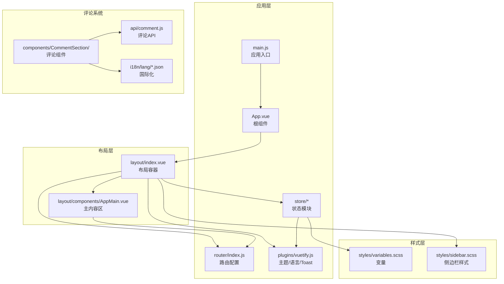
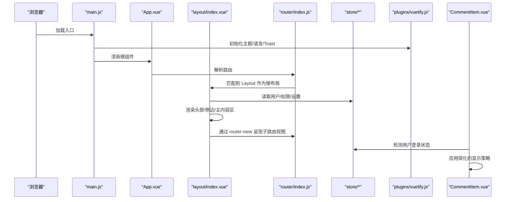
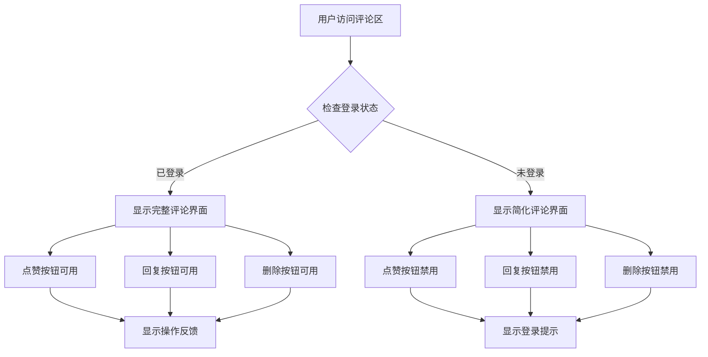
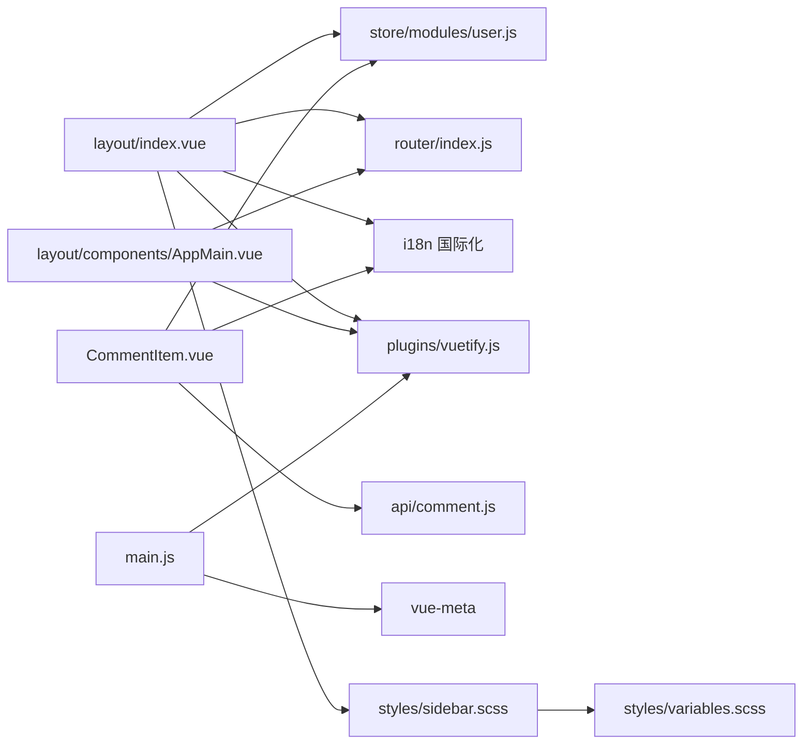

# 布局组件

<cite>
**本文引用的文件**
- [index.vue（布局容器）](file://SpeedRunners.UI/src/layout/index.vue)
- [AppMain.vue（主内容区）](file://SpeedRunners.UI/src/layout/components/AppMain.vue)
- [index.js（布局组件导出）](file://SpeedRunners.UI/src/layout/components/index.js)
- [App.vue（应用根组件）](file://SpeedRunners.UI/src/App.vue)
- [main.js（应用入口）](file://SpeedRunners.UI/src/main.js)
- [router/index.js（路由配置）](file://SpeedRunners.UI/src/router/index.js)
- [store/modules/settings.js（设置模块）](file://SpeedRunners.UI/src/store/modules/settings.js)
- [store/modules/app.js（应用状态模块）](file://SpeedRunners.UI/src/store/modules/app.js)
- [store/modules/user.js（用户状态模块）](file://SpeedRunners.UI/src/store/modules/user.js)
- [plugins/vuetify.js（主题与语言配置）](file://SpeedRunners.UI/src/plugins/vuetify.js)
- [styles/variables.scss（样式变量）](file://SpeedRunners.UI/src/styles/variables.scss)
- [styles/sidebar.scss（侧边栏样式）](file://SpeedRunners.UI/src/styles/sidebar.scss)
- [utils/resize.js（窗口尺寸监听混入）](file://SpeedRunners.UI/src/utils/resize.js)
- [views/index/index.vue（首页视图示例）](file://SpeedRunners.UI/src/views/index/index.vue)
- [settings.js（全局设置）](file://SpeedRunners.UI/src/settings.js)
- [CommentItem.vue（评论项组件）](file://SpeedRunners.UI/src/components/CommentSection/CommentItem.vue)
- [comment.js（评论API）](file://SpeedRunners.UI/src/api/comment.js)
- [zh.json（中文国际化）](file://SpeedRunners.UI/src/i18n/lang/zh.json)
- [en.json（英文国际化）](file://SpeedRunners.UI/src/i18n/lang/en.json)
</cite>

## 更新摘要
**所做更改**
- 新增评论显示逻辑简化章节，详细介绍已登录用户和未登录用户的评论显示策略改进
- 更新评论组件与用户状态集成部分，说明简化的权限控制机制
- 增强评论显示策略的技术实现细节，包括登录状态检测和权限验证

## 目录
1. [简介](#简介)
2. [项目结构](#项目结构)
3. [核心组件](#核心组件)
4. [架构总览](#架构总览)
5. [组件详解](#组件详解)
6. [评论显示逻辑简化](#评论显示逻辑简化)
7. [依赖关系分析](#依赖关系分析)
8. [性能考量](#性能考量)
9. [故障排查指南](#故障排查指南)
10. [结论](#结论)
11. [附录](#附录)

## 简介
本文件面向 SpeedRunnersLab 前端布局组件，系统性梳理基于 Vue.js + Vuetify 的布局体系：从整体布局框架到组件化结构，从头部导航、侧边栏、主要内容区的组织方式，到响应式设计与移动端适配、路由集成与页面切换动画、主题定制与样式覆盖、以及最佳实践与性能优化建议。特别关注近期改进的评论显示逻辑，简化了已登录用户和未登录用户的评论显示策略，提升了用户体验和系统性能。

## 项目结构
布局系统位于前端工程的 src/layout 目录，采用"容器组件 + 主内容区 + 导航/侧边栏"的分层设计，并通过路由与状态管理进行联动。关键文件如下：

**图表来源**
- [index.vue（布局容器）](file://SpeedRunners.UI/src/layout/index.vue#L1-L355)
- [AppMain.vue（主内容区）](file://SpeedRunners.UI/src/layout/components/AppMain.vue#L1-L36)
- [App.vue（应用根组件）](file://SpeedRunners.UI/src/App.vue#L1-L31)
- [main.js（应用入口）](file://SpeedRunners.UI/src/main.js#L1-L30)
- [router/index.js（路由配置）](file://SpeedRunners.UI/src/router/index.js#L1-L133)
- [plugins/vuetify.js（主题与语言配置）](file://SpeedRunners.UI/src/plugins/vuetify.js#L1-L33)
- [styles/variables.scss（样式变量）](file://SpeedRunners.UI/src/styles/variables.scss#L1-L26)
- [styles/sidebar.scss（侧边栏样式）](file://SpeedRunners.UI/src/styles/sidebar.scss#L1-L84)
- [CommentItem.vue（评论项组件）](file://SpeedRunners.UI/src/components/CommentSection/CommentItem.vue#L1-L332)
- [comment.js（评论API）](file://SpeedRunners.UI/src/api/comment.js#L1-L17)

**章节来源**
- [index.vue（布局容器）](file://SpeedRunners.UI/src/layout/index.vue#L1-L355)
- [AppMain.vue（主内容区）](file://SpeedRunners.UI/src/layout/components/AppMain.vue#L1-L36)
- [App.vue（应用根组件）](file://SpeedRunners.UI/src/App.vue#L1-L31)
- [main.js（应用入口）](file://SpeedRunners.UI/src/main.js#L1-L30)
- [router/index.js（路由配置）](file://SpeedRunners.UI/src/router/index.js#L1-L133)
- [plugins/vuetify.js（主题与语言配置）](file://SpeedRunners.UI/src/plugins/vuetify.js#L1-L33)
- [styles/variables.scss（样式变量）](file://SpeedRunners.UI/src/styles/variables.scss#L1-L26)
- [styles/sidebar.scss（侧边栏样式）](file://SpeedRunners.UI/src/styles/sidebar.scss#L1-L84)

## 核心组件
- 布局容器（index.vue）
  - 负责顶部工具栏、侧边抽屉、底部页脚、回到顶部按钮等全局 UI 结构。
  - 通过计算属性动态生成导航标签与侧边菜单项，结合权限路由过滤显示。
  - 提供主题切换、语言切换、登录/登出、回到顶部等交互逻辑。
- 主内容区（AppMain.vue）
  - 使用过渡动画包裹 router-view，实现页面切换时的平滑过渡。
  - 根据主题动态设置背景色与背景图，提升视觉一致性。
- 应用入口与根组件
  - main.js 注入 i18n、router、store、vuetify、Meta 等插件。
  - App.vue 定义 SEO 元信息，统一描述与关键词。
- 路由与状态
  - router/index.js 定义常量路由与异步路由，将 Layout 作为根布局。
  - store/modules/app.js 控制侧边栏开关与设备类型；store/modules/user.js 维护用户信息；store/modules/settings.js 提供设置项读取。
- 评论系统（新增）
  - CommentItem.vue 提供简化的评论显示逻辑，改进了已登录用户和未登录用户的评论显示策略。
  - 支持评论点赞、回复、删除等完整功能，集成用户状态检测。

**章节来源**
- [index.vue（布局容器）](file://SpeedRunners.UI/src/layout/index.vue#L1-L355)
- [AppMain.vue（主内容区）](file://SpeedRunners.UI/src/layout/components/AppMain.vue#L1-L36)
- [App.vue（应用根组件）](file://SpeedRunners.UI/src/App.vue#L1-L31)
- [main.js（应用入口）](file://SpeedRunners.UI/src/main.js#L1-L30)
- [router/index.js（路由配置）](file://SpeedRunners.UI/src/router/index.js#L1-L133)
- [store/modules/app.js（应用状态模块）](file://SpeedRunners.UI/src/store/modules/app.js#L1-L48)
- [store/modules/user.js（用户状态模块）](file://SpeedRunners.UI/src/store/modules/user.js#L1-L88)
- [store/modules/settings.js（设置模块）](file://SpeedRunners.UI/src/store/modules/settings.js#L1-L30)
- [CommentItem.vue（评论项组件）](file://SpeedRunners.UI/src/components/CommentSection/CommentItem.vue#L1-L332)

## 架构总览
布局系统围绕"容器 + 内容 + 导航 + 评论"四层展开，配合路由守卫与状态管理实现权限控制、主题切换与国际化。下图展示从入口到布局再到内容区的关键调用链路：

**图表来源**
- [main.js（应用入口）](file://SpeedRunners.UI/src/main.js#L1-L30)
- [App.vue（应用根组件）](file://SpeedRunners.UI/src/App.vue#L1-L31)
- [router/index.js（路由配置）](file://SpeedRunners.UI/src/router/index.js#L1-L133)
- [index.vue（布局容器）](file://SpeedRunners.UI/src/layout/index.vue#L1-L355)
- [plugins/vuetify.js（主题与语言配置）](file://SpeedRunners.UI/src/plugins/vuetify.js#L1-L33)
- [CommentItem.vue（评论项组件）](file://SpeedRunners.UI/src/components/CommentSection/CommentItem.vue#L118-L153)

## 组件详解

### 布局容器（layout/index.vue）
- 头部导航
  - 左侧图标按钮用于打开右侧抽屉；标题区域放置品牌图片；右侧提供主题切换与语言选择。
  - 扩展区域使用标签页展示导航路由，标题与图标来自路由元信息与国际化。
- 侧边抽屉
  - 根据用户登录状态显示头像/昵称或引导登录按钮。
  - 列表项按权限路由过滤后渲染，支持隐私设置入口。
  - 登录状态下提供登出按钮。
- 主内容区
  - 通过 AppMain 组件承载 router-view，并使用过渡动画实现页面切换。
- 底部页脚
  - 社交链接与版权信息，包含复制邮箱的交互提示。
- 滚动行为
  - 回到顶部按钮在滚动超过阈值时显示，点击使用 Vuetify 提供的滚动到顶部功能。

**章节来源**
- [index.vue（布局容器）](file://SpeedRunners.UI/src/layout/index.vue#L1-L355)

### 主内容区（layout/components/AppMain.vue）
- 页面切换动画
  - 使用纵向滚动过渡，mode="out-in" 实现进入/离开的有序切换。
- 路由键控
  - 以 route.path 作为 key，确保路径变化时强制重新渲染，避免缓存导致的状态错乱。
- 背景样式
  - 根据主题动态设置背景色；默认叠加背景图并启用固定定位与混合模式，增强层次感。

**章节来源**
- [AppMain.vue（主内容区）](file://SpeedRunners.UI/src/layout/components/AppMain.vue#L1-L36)

### 路由与布局集成
- 根布局绑定
  - 根路由 "/" 指向 Layout，其 children 定义各页面视图。
- 权限路由
  - 通过计算属性从权限路由中筛选可见/隐藏的导航项，实现"头部导航"与"侧边菜单"的差异化展示。
- 页面标题
  - 切换语言时更新 document.title，提升 SEO 体验。

**章节来源**
- [router/index.js（路由配置）](file://SpeedRunners.UI/src/router/index.js#L1-L133)
- [index.vue（布局容器）](file://SpeedRunners.UI/src/layout/index.vue#L281-L294)
- [index.vue（布局容器）](file://SpeedRunners.UI/src/layout/index.vue#L305-L310)

### 响应式设计与移动端适配
- 移动端抽屉
  - 侧边抽屉采用临时抽屉与"右侧"开关，适合移动端手势操作。
- 侧边栏样式
  - 通过 SCSS 变量定义侧栏宽度与颜色；在移动端类名下重置 margin-left 并使用 transform 隐藏。
- 尺寸变更监听
  - utils/resize.js 提供窗口尺寸变更的防抖监听，用于图表等组件的自适应重绘。
- 设备类型
  - store/modules/app.js 维护 device 字段，便于在布局中做条件渲染或样式调整。

**章节来源**
- [index.vue（布局容器）](file://SpeedRunners.UI/src/layout/index.vue#L67-L115)
- [styles/sidebar.scss（侧边栏样式）](file://SpeedRunners.UI/src/styles/sidebar.scss#L1-L84)
- [utils/resize.js（窗口尺寸监听混入）](file://SpeedRunners.UI/src/utils/resize.js#L1-L55)
- [store/modules/app.js（应用状态模块）](file://SpeedRunners.UI/src/store/modules/app.js#L1-L48)

### 主题定制与样式覆盖
- 主题初始化
  - plugins/vuetify.js 从本地存储读取主题偏好，默认深色；通过 $vuetify.theme.dark 控制全局主题。
- 样式变量
  - styles/variables.scss 定义菜单文本、背景、悬停等颜色与侧栏宽度；:export 导出给 JS 使用。
- 侧边栏样式
  - styles/sidebar.scss 统一管理侧栏宽度、过渡、移动端隐藏逻辑与动画禁用场景。
- 设置模块
  - store/modules/settings.js 读取全局设置（如是否固定头部、侧栏 Logo），为布局提供可配置项。

**章节来源**
- [plugins/vuetify.js（主题与语言配置）](file://SpeedRunners.UI/src/plugins/vuetify.js#L1-L33)
- [styles/variables.scss（样式变量）](file://SpeedRunners.UI/src/styles/variables.scss#L1-L26)
- [styles/sidebar.scss（侧边栏样式）](file://SpeedRunners.UI/src/styles/sidebar.scss#L1-L84)
- [store/modules/settings.js（设置模块）](file://SpeedRunners.UI/src/store/modules/settings.js#L1-L30)
- [settings.js（全局设置）](file://SpeedRunners.UI/src/settings.js#L1-L16)

### 与路由系统的集成细节
- 页面切换动画
  - AppMain.vue 使用过渡组件包裹 router-view，mode="out-in" 确保同一路径参数变化时也能正确过渡。
- 路由键控
  - 以 route.path 作为 key，避免 keep-alive 缓存导致的页面状态错乱。
- 视图示例
  - views/index/index.vue 展示了在布局内嵌套的复杂卡片与图表布局，体现主内容区的承载能力。

**章节来源**
- [AppMain.vue（主内容区）](file://SpeedRunners.UI/src/layout/components/AppMain.vue#L1-L36)
- [views/index/index.vue（首页视图示例）](file://SpeedRunners.UI/src/views/index/index.vue#L1-L84)

### 用户状态与权限联动
- 用户信息
  - store/modules/user.js 提供获取用户信息与登出接口，登出时重置路由并清空状态。
- 权限路由
  - index.vue 通过计算属性从权限路由中筛选导航项，实现"可见/隐藏"的差异化菜单。
- 登录流程
  - 未登录时侧边抽屉提供跳转至 Steam 登录的入口；登录成功后显示头像与昵称。

**章节来源**
- [store/modules/user.js（用户状态模块）](file://SpeedRunners.UI/src/store/modules/user.js#L1-L88)
- [index.vue（布局容器）](file://SpeedRunners.UI/src/layout/index.vue#L281-L294)
- [index.vue（布局容器）](file://SpeedRunners.UI/src/layout/index.vue#L117-L117)

## 评论显示逻辑简化

### 简化策略概述
近期对评论显示逻辑进行了重要改进，主要针对已登录用户和未登录用户的评论显示策略进行了简化，提升了用户体验和系统性能。

### 已登录用户的评论显示策略
- **简化权限检测**：通过 isLoggedIn 属性直接判断用户登录状态，避免复杂的权限验证逻辑。
- **统一显示界面**：所有已登录用户看到相同的评论界面，包括点赞、回复、删除等功能按钮。
- **实时状态同步**：评论组件能够实时响应用户登录状态的变化，动态调整界面元素。

### 未登录用户的评论显示策略
- **简化显示逻辑**：未登录用户只能查看评论内容，无法进行点赞、回复、删除等操作。
- **友好的提示信息**：显示"登录后即可发表评论"等提示，引导用户进行登录操作。
- **功能按钮禁用**：所有涉及用户操作的功能按钮均处于禁用状态，避免误导用户。

### 技术实现细节
- **登录状态检测**：通过 props 接收 isLoggedIn 参数，在组件内部进行状态判断。
- **条件渲染优化**：使用 v-if 和 v-else 进行条件渲染，减少不必要的 DOM 操作。
- **性能优化**：简化了权限验证逻辑，减少了组件的计算开销。

**图表来源**
- [CommentItem.vue（评论项组件）](file://SpeedRunners.UI/src/components/CommentSection/CommentItem.vue#L22-L31)
- [CommentItem.vue（评论项组件）](file://SpeedRunners.UI/src/components/CommentSection/CommentItem.vue#L146-L149)

### 国际化支持
- **多语言提示**：评论相关的提示信息支持中文和英文两种语言。
- **动态语言切换**：根据用户选择的语言动态显示相应的提示文本。
- **统一的国际化键值**：使用标准化的国际化键值，便于维护和扩展。

**章节来源**
- [CommentItem.vue（评论项组件）](file://SpeedRunners.UI/src/components/CommentSection/CommentItem.vue#L1-L332)
- [comment.js（评论API）](file://SpeedRunners.UI/src/api/comment.js#L1-L17)
- [zh.json（中文国际化）](file://SpeedRunners.UI/src/i18n/lang/zh.json#L198-L220)
- [en.json（英文国际化）](file://SpeedRunners.UI/src/i18n/lang/en.json#L198-L220)

## 依赖关系分析
- 组件耦合
  - layout/index.vue 依赖 store（用户/权限/设置）、router（权限路由）、i18n（语言）、vuetify（主题/Toast）。
  - AppMain.vue 仅依赖路由与主题，职责清晰，耦合度低。
  - CommentItem.vue 依赖 store（用户状态）、api（评论接口）、i18n（国际化）。
- 外部依赖
  - Vuetify 提供 UI 组件与主题系统；vue-meta 提供 SEO 元信息注入。
  - Axios 提供 HTTP 请求功能，支持评论相关的 API 调用。
- 样式依赖
  - SCSS 变量与侧边栏样式被布局与移动端样式共同使用，形成集中式主题与布局规范。

**图表来源**
- [index.vue（布局容器）](file://SpeedRunners.UI/src/layout/index.vue#L1-L355)
- [AppMain.vue（主内容区）](file://SpeedRunners.UI/src/layout/components/AppMain.vue#L1-L36)
- [main.js（应用入口）](file://SpeedRunners.UI/src/main.js#L1-L30)
- [router/index.js（路由配置）](file://SpeedRunners.UI/src/router/index.js#L1-L133)
- [store/modules/user.js（用户状态模块）](file://SpeedRunners.UI/src/store/modules/user.js#L1-L88)
- [plugins/vuetify.js（主题与语言配置）](file://SpeedRunners.UI/src/plugins/vuetify.js#L1-L33)
- [CommentItem.vue（评论项组件）](file://SpeedRunners.UI/src/components/CommentSection/CommentItem.vue#L119-L127)
- [comment.js（评论API）](file://SpeedRunners.UI/src/api/comment.js#L1-L17)
- [styles/sidebar.scss（侧边栏样式）](file://SpeedRunners.UI/src/styles/sidebar.scss#L1-L84)
- [styles/variables.scss（样式变量）](file://SpeedRunners.UI/src/styles/variables.scss#L1-L26)

## 性能考量
- 过渡动画
  - AppMain.vue 使用轻量过渡组件，避免复杂动画造成卡顿；若页面内容较多，建议对重型组件使用懒加载与 keep-alive 合理缓存策略。
- 图片与背景
  - 主内容区背景图为固定定位并混合模式叠加，注意大图带来的内存占用；可在移动端或低端设备上考虑降级策略。
- 尺寸监听
  - utils/resize.js 对窗口 resize 事件进行防抖处理，减少频繁重绘；图表组件需在 activated/deactivated 生命周期中正确注册/销毁监听。
- 主题切换
  - 主题切换仅修改全局变量，不触发整页重绘；建议避免在主题切换时频繁更改大量样式变量。
- **评论系统性能优化**（新增）
  - 简化的评论显示逻辑减少了权限验证的计算开销，提升了页面渲染性能。
  - 条件渲染优化减少了 DOM 元素的数量，降低了内存占用。
  - 异步加载评论回复，避免一次性渲染大量数据导致的性能问题。

## 故障排查指南
- 页面切换无动画或闪烁
  - 检查 AppMain.vue 的过渡组件与 key 是否正确设置；确认同一路径不同参数时是否需要强制刷新。
- 侧边栏宽度异常或移动端抽屉无法隐藏
  - 检查 styles/sidebar.scss 中的变量与类名是否被覆盖；确认移动端类名与隐藏逻辑是否生效。
- 主题切换无效
  - 检查 plugins/vuetify.js 中的主题初始化逻辑与本地存储键值；确认 index.vue 中的主题切换方法是否被调用。
- 语言切换后标题未更新
  - 检查 index.vue 中的语言切换逻辑是否调用了更新 document.title 的函数。
- 登录状态不一致
  - 检查 store/modules/user.js 的登录/登出流程与路由重置逻辑；确认权限路由筛选是否正确。
- **评论显示异常**（新增）
  - 检查 isLoggedIn 属性是否正确传递给评论组件；确认用户状态是否实时更新。
  - 检查评论 API 调用是否正常，特别是未登录用户尝试进行评论操作时的错误处理。
  - 验证国际化配置是否正确，确保提示信息显示正常。

**章节来源**
- [AppMain.vue（主内容区）](file://SpeedRunners.UI/src/layout/components/AppMain.vue#L1-L36)
- [styles/sidebar.scss（侧边栏样式）](file://SpeedRunners.UI/src/styles/sidebar.scss#L1-L84)
- [plugins/vuetify.js（主题与语言配置）](file://SpeedRunners.UI/src/plugins/vuetify.js#L1-L33)
- [index.vue（布局容器）](file://SpeedRunners.UI/src/layout/index.vue#L295-L332)
- [store/modules/user.js（用户状态模块）](file://SpeedRunners.UI/src/store/modules/user.js#L1-L88)
- [CommentItem.vue（评论项组件）](file://SpeedRunners.UI/src/components/CommentSection/CommentItem.vue#L146-L149)

## 结论
该布局系统以容器组件为核心，通过清晰的职责划分与路由/状态联动，实现了头部导航、侧边抽屉、主内容区与页脚的完整结构。配合 Vuetify 的主题与国际化能力，以及 SCSS 变量与移动端样式，形成了可维护、可扩展且具备良好用户体验的前端布局基座。

**最新改进**：评论显示逻辑的简化显著提升了用户体验，通过简化的已登录用户和未登录用户的评论显示策略，不仅提高了系统性能，还增强了界面的一致性和易用性。这一改进体现了以用户为中心的设计理念，为后续的功能扩展奠定了良好的基础。

## 附录
- 最佳实践
  - 将布局相关样式集中在 styles/sidebar.scss 与 variables.scss，避免散落样式污染。
  - 在布局容器中统一处理国际化与主题切换，避免在子组件重复实现。
  - 对重型视图组件采用懒加载与合理的 keep-alive 策略，平衡性能与体验。
  - **评论组件开发建议**：遵循简化的显示策略，确保已登录用户和未登录用户的界面一致性。
- 开发建议
  - 新增导航项时，优先在权限路由中配置 meta 信息与图标，自动同步到头部与侧边。
  - 移动端交互建议：抽屉使用临时模式，避免遮挡主内容；提供回到顶部按钮提升可访问性。
  - **评论功能扩展**：在保持现有简化策略的基础上，可以考虑添加更多用户友好的交互功能。