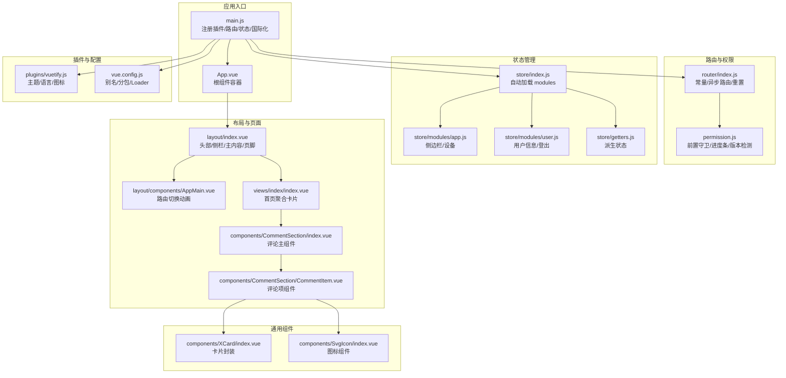
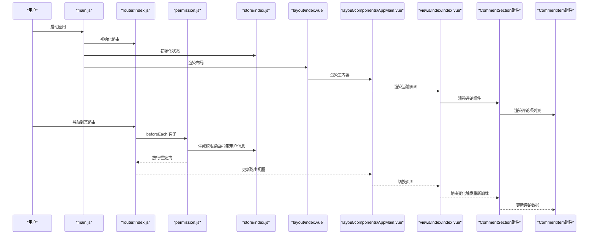
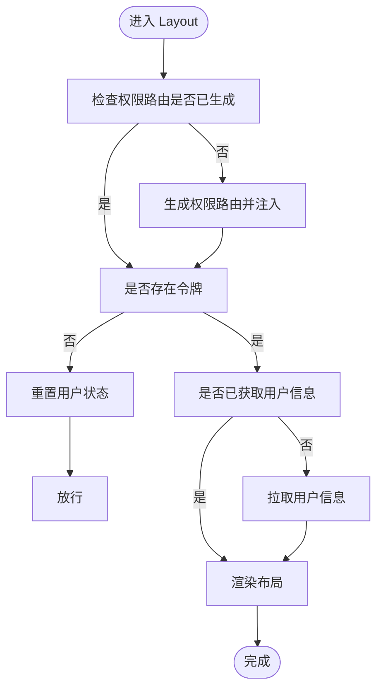
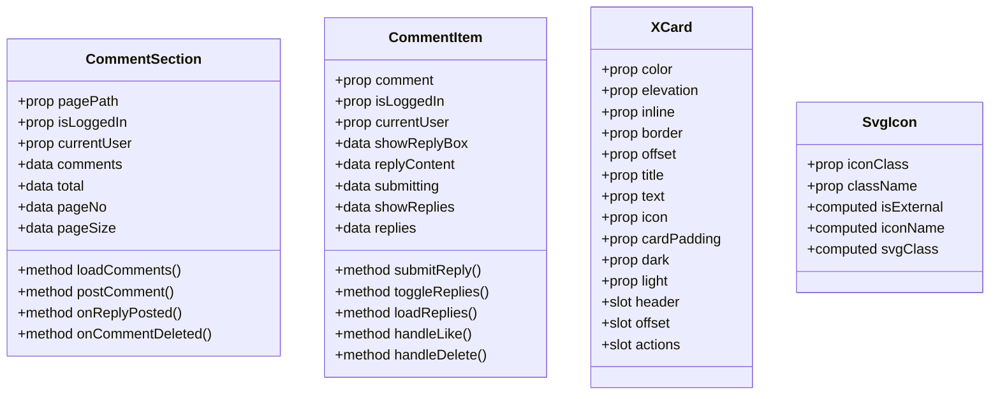
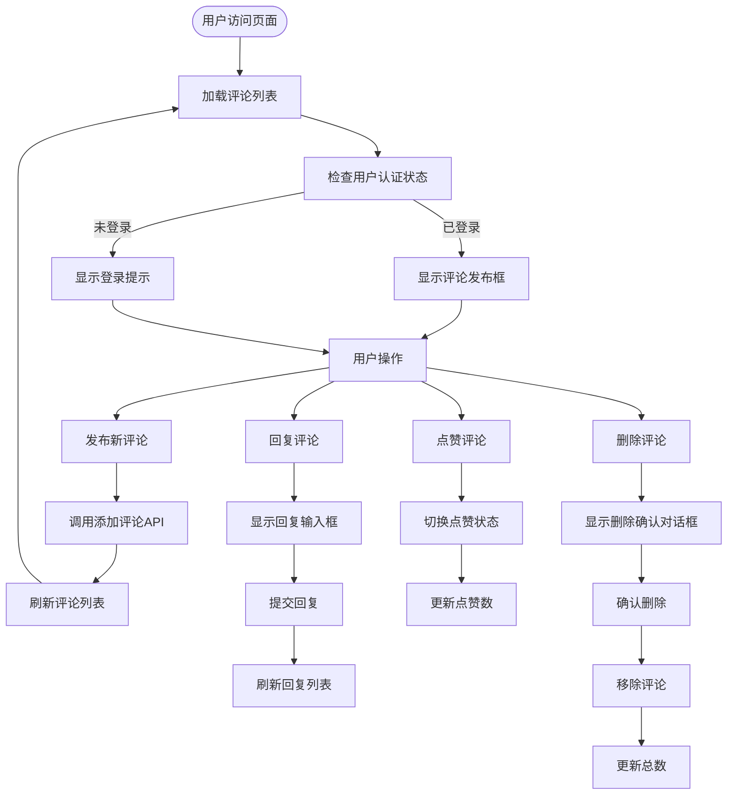
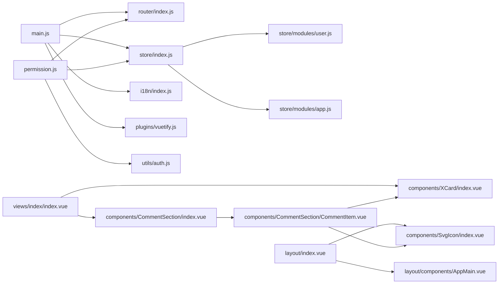

# 组件架构

<cite>
**本文引用的文件**
- [package.json](file://SpeedRunners.UI/package.json)
- [main.js](file://SpeedRunners.UI/src/main.js)
- [App.vue](file://SpeedRunners.UI/src/App.vue)
- [vue.config.js](file://SpeedRunners.UI/vue.config.js)
- [router/index.js](file://SpeedRunners.UI/src/router/index.js)
- [store/index.js](file://SpeedRunners.UI/src/store/index.js)
- [layout/index.vue](file://SpeedRunners.UI/src/layout/index.vue)
- [layout/components/AppMain.vue](file://SpeedRunners.UI/src/layout/components/AppMain.vue)
- [plugins/vuetify.js](file://SpeedRunners.UI/src/plugins/vuetify.js)
- [store/modules/app.js](file://SpeedRunners.UI/src/store/modules/app.js)
- [store/modules/user.js](file://SpeedRunners.UI/src/store/modules/user.js)
- [store/getters.js](file://SpeedRunners.UI/src/store/getters.js)
- [views/index/index.vue](file://SpeedRunners.UI/src/views/index/index.vue)
- [components/XCard/index.vue](file://SpeedRunners.UI/src/components/XCard/index.vue)
- [components/SvgIcon/index.vue](file://SpeedRunners.UI/src/components/SvgIcon/index.vue)
- [components/CommentSection/index.vue](file://SpeedRunners.UI/src/components/CommentSection/index.vue)
- [components/CommentSection/CommentItem.vue](file://SpeedRunners.UI/src/components/CommentSection/CommentItem.vue)
- [utils/auth.js](file://SpeedRunners.UI/src/utils/auth.js)
- [i18n/index.js](file://SpeedRunners.UI/src/i18n/index.js)
- [permission.js](file://SpeedRunners.UI/src/permission.js)
</cite>

## 更新摘要
**变更内容**
- 新增评论组件（CommentSection）的详细说明，包括组件层次结构和交互流程
- 补充评论组件的 API 接口说明和状态管理集成
- 更新组件架构图以包含评论组件的完整交互链路

## 目录
1. [引言](#引言)
2. [项目结构](#项目结构)
3. [核心组件](#核心组件)
4. [架构总览](#架构总览)
5. [组件详解](#组件详解)
6. [依赖关系分析](#依赖关系分析)
7. [性能考量](#性能考量)
8. [故障排查指南](#故障排查指南)
9. [结论](#结论)
10. [附录](#附录)

## 引言
本文件系统性梳理 SpeedRunnersLab 前端（Vue.js 2.x + Vuetify）的组件化架构与工程实践，围绕页面组件（views）、可复用组件（components）、布局组件（layout）展开，重点阐释生命周期管理、props 传递、事件处理、插槽使用；说明路由与权限控制、Vuex 状态管理、国际化与主题切换；并总结模块化组织、导入导出规范、UI 库使用与定制化配置，以及组件开发最佳实践与性能优化建议。

**更新** 新增评论组件（CommentSection）的完整架构说明，包括父子组件通信机制、API 接口集成和状态管理流程。

## 项目结构
前端位于 SpeedRunners.UI，采用 Vue CLI 3.x 工程化组织，核心目录与职责如下：
- src/api：接口封装（axios 封装于 utils/request.js）
- src/assets：静态资源（图片、Logo 等）
- src/components：通用可复用组件（如 XCard、SvgIcon、Odometer、ImgCropper、UnderConstruction、**CommentSection**）
- src/layout：布局组件（含 AppMain、侧边栏、顶部导航、页脚）
- src/router：路由定义（常量路由、异步路由、404 回退）
- src/store：状态管理（modules/app、modules/user、getters）
- src/utils：工具函数（鉴权、请求、尺寸监听、校验、版本号）
- src/views：页面组件（首页、排行、匹配、MOD、搜索玩家、登录、隐私设置等）
- src/i18n：国际化（中/英）
- src/plugins：插件（Vuetify 配置）
- public：入口 HTML 与静态资源
- 构建配置：vue.config.js（别名、SVG 处理、分包、运行时优化）

**图表来源**
- [main.js](file://SpeedRunners.UI/src/main.js#L1-L30)
- [App.vue](file://SpeedRunners.UI/src/App.vue#L1-L31)
- [router/index.js](file://SpeedRunners.UI/src/router/index.js#L1-L133)
- [permission.js](file://SpeedRunners.UI/src/permission.js#L1-L69)
- [store/index.js](file://SpeedRunners.UI/src/store/index.js#L1-L25)
- [store/modules/app.js](file://SpeedRunners.UI/src/store/modules/app.js#L1-L48)
- [store/modules/user.js](file://SpeedRunners.UI/src/store/modules/user.js#L1-L88)
- [store/getters.js](file://SpeedRunners.UI/src/store/getters.js#L1-L11)
- [layout/index.vue](file://SpeedRunners.UI/src/layout/index.vue#L1-L355)
- [layout/components/AppMain.vue](file://SpeedRunners.UI/src/layout/components/AppMain.vue#L1-L36)
- [views/index/index.vue](file://SpeedRunners.UI/src/views/index/index.vue#L1-L84)
- [components/XCard/index.vue](file://SpeedRunners.UI/src/components/XCard/index.vue#L1-L102)
- [components/SvgIcon/index.vue](file://SpeedRunners.UI/src/components/SvgIcon/index.vue#L1-L66)
- [components/CommentSection/index.vue](file://SpeedRunners.UI/src/components/CommentSection/index.vue#L1-L196)
- [components/CommentSection/CommentItem.vue](file://SpeedRunners.UI/src/components/CommentSection/CommentItem.vue#L1-L333)
- [plugins/vuetify.js](file://SpeedRunners.UI/src/plugins/vuetify.js#L1-L33)
- [vue.config.js](file://SpeedRunners.UI/vue.config.js#L1-L129)

**章节来源**
- [package.json](file://SpeedRunners.UI/package.json#L1-L76)
- [vue.config.js](file://SpeedRunners.UI/vue.config.js#L1-L129)

## 核心组件
- 根实例与插件装配：在入口文件中注册路由、状态、国际化、Meta SEO、图标、权限守卫与 Vuetify 插件，统一注入全局样式与字体。
- 根组件 App：包裹 v-app，承载全局 meta 信息与路由出口。
- 布局 Layout：提供头部导航、侧边栏、主内容区、页脚与回到顶部按钮，内部通过 AppMain 实现路由切换过渡。
- 页面组件 Views：按功能划分（首页、排行、匹配、MOD、搜索玩家、登录、隐私设置等），通过懒加载与路由 meta 控制展示与权限。
- 通用组件 Components：如 XCard 卡片封装、SvgIcon 图标组件，支持透传属性与事件、具名插槽，便于复用。**新增评论组件 CommentSection，提供完整的评论系统功能**。
- 状态管理 Store：模块化 app（侧边栏/设备）与 user（用户信息/登出），通过 getters 暴露派生状态。
- 路由 Router：常量路由用于公共访问，异步路由按权限动态注入，404 放置于末尾。
- 权限守卫 Permission：在进入路由前加载权限路由、拉取用户信息、控制页面标题与进度条。
- 国际化 I18n：根据浏览器语言与本地存储选择语言，持久化切换结果。
- Vuetify 插件：按需引入组件与图标，配置语言、主题与 Toast 提示。

**更新** 新增评论组件的组件分类说明，包括评论主组件和评论项组件的职责分工。

**章节来源**
- [main.js](file://SpeedRunners.UI/src/main.js#L1-L30)
- [App.vue](file://SpeedRunners.UI/src/App.vue#L1-L31)
- [layout/index.vue](file://SpeedRunners.UI/src/layout/index.vue#L1-L355)
- [layout/components/AppMain.vue](file://SpeedRunners.UI/src/layout/components/AppMain.vue#L1-L36)
- [router/index.js](file://SpeedRunners.UI/src/router/index.js#L1-L133)
- [store/index.js](file://SpeedRunners.UI/src/store/index.js#L1-L25)
- [store/modules/app.js](file://SpeedRunners.UI/src/store/modules/app.js#L1-L48)
- [store/modules/user.js](file://SpeedRunners.UI/src/store/modules/user.js#L1-L88)
- [store/getters.js](file://SpeedRunners.UI/src/store/getters.js#L1-L11)
- [components/XCard/index.vue](file://SpeedRunners.UI/src/components/XCard/index.vue#L1-L102)
- [components/SvgIcon/index.vue](file://SpeedRunners.UI/src/components/SvgIcon/index.vue#L1-L66)
- [components/CommentSection/index.vue](file://SpeedRunners.UI/src/components/CommentSection/index.vue#L1-L196)
- [components/CommentSection/CommentItem.vue](file://SpeedRunners.UI/src/components/CommentSection/CommentItem.vue#L1-L333)
- [i18n/index.js](file://SpeedRunners.UI/src/i18n/index.js#L1-L35)
- [permission.js](file://SpeedRunners.UI/src/permission.js#L1-L69)
- [plugins/vuetify.js](file://SpeedRunners.UI/src/plugins/vuetify.js#L1-L33)

## 架构总览
下图展示从入口到页面渲染、权限与状态管理的关键交互路径，**新增评论组件的完整交互链路**：

**图表来源**
- [main.js](file://SpeedRunners.UI/src/main.js#L1-L30)
- [router/index.js](file://SpeedRunners.UI/src/router/index.js#L1-L133)
- [permission.js](file://SpeedRunners.UI/src/permission.js#L1-L69)
- [store/index.js](file://SpeedRunners.UI/src/store/index.js#L1-L25)
- [layout/index.vue](file://SpeedRunners.UI/src/layout/index.vue#L1-L355)
- [layout/components/AppMain.vue](file://SpeedRunners.UI/src/layout/components/AppMain.vue#L1-L36)
- [views/index/index.vue](file://SpeedRunners.UI/src/views/index/index.vue#L1-L84)
- [components/CommentSection/index.vue](file://SpeedRunners.UI/src/components/CommentSection/index.vue#L1-L196)
- [components/CommentSection/CommentItem.vue](file://SpeedRunners.UI/src/components/CommentSection/CommentItem.vue#L1-L333)

## 组件详解

### 布局组件（Layout）设计模式
- 结构化布局：顶部应用栏（含 Logo、主题切换、语言菜单、主导航标签）、右侧抽屉式侧栏（头像/名称/登录/退出/隐私设置）、主内容区（AppMain 路由切换过渡）、页脚社交链接与版权信息。
- 主题与语言：通过 Vuetify 主题开关与 i18n 切换，持久化至本地存储；页面标题随路由 meta 动态更新。
- 权限路由：根据当前用户角色与区域判断，动态注入异步路由，控制侧栏与标签显示。
- 交互细节：回到顶部按钮随滚动显隐，点击平滑滚动至顶部；侧栏抽屉支持临时定位与裁剪。

**图表来源**
- [layout/index.vue](file://SpeedRunners.UI/src/layout/index.vue#L1-L355)
- [permission.js](file://SpeedRunners.UI/src/permission.js#L1-L69)
- [store/modules/user.js](file://SpeedRunners.UI/src/store/modules/user.js#L1-L88)

**章节来源**
- [layout/index.vue](file://SpeedRunners.UI/src/layout/index.vue#L1-L355)
- [layout/components/AppMain.vue](file://SpeedRunners.UI/src/layout/components/AppMain.vue#L1-L36)
- [store/getters.js](file://SpeedRunners.UI/src/store/getters.js#L1-L11)
- [utils/auth.js](file://SpeedRunners.UI/src/utils/auth.js#L1-L45)
- [i18n/index.js](file://SpeedRunners.UI/src/i18n/index.js#L1-L35)

### 页面组件（Views）与生命周期
- 首页 index：在挂载阶段发起在线人数与玩家列表的异步请求，渲染仪表盘式布局与图表组件。
- 生命周期要点：mounted 中进行数据拉取；配合 keep-alive 可结合路由 key 控制缓存行为（见 AppMain）。
- 组件组合：首页聚合多个子组件（图表、赞助商、玩家头像流等），体现"页面即组件组合"的思想。
- **评论组件集成**：页面可通过引入 CommentSection 组件实现评论功能，支持分页加载和实时更新。

**更新** 新增页面组件对评论组件的集成说明。

**章节来源**
- [views/index/index.vue](file://SpeedRunners.UI/src/views/index/index.vue#L1-L84)
- [layout/components/AppMain.vue](file://SpeedRunners.UI/src/layout/components/AppMain.vue#L1-L36)
- [components/CommentSection/index.vue](file://SpeedRunners.UI/src/components/CommentSection/index.vue#L1-L196)

### 通用组件（Components）
- XCard：卡片封装，支持透传属性与事件、具名插槽（header/offset/actions）、偏移标题与边框样式、断点自适应内边距。
- SvgIcon：统一图标入口，支持 Material Design Icons 与 SVG Sprite，自动识别外部链接图标。
- **CommentSection：评论系统主组件，提供完整的评论发布、展示、分页和管理功能**。
- **CommentItem：评论项组件，支持回复、点赞、删除、嵌套回复等交互**。
- 设计原则：遵循 Vue 2 属性透传与事件转发，保持最小耦合与高可复用性。

**更新** 新增评论组件的详细说明。

**图表来源**
- [components/CommentSection/index.vue](file://SpeedRunners.UI/src/components/CommentSection/index.vue#L1-L196)
- [components/CommentSection/CommentItem.vue](file://SpeedRunners.UI/src/components/CommentSection/CommentItem.vue#L1-L333)
- [components/XCard/index.vue](file://SpeedRunners.UI/src/components/XCard/index.vue#L1-L102)
- [components/SvgIcon/index.vue](file://SpeedRunners.UI/src/components/SvgIcon/index.vue#L1-L66)

**章节来源**
- [components/XCard/index.vue](file://SpeedRunners.UI/src/components/XCard/index.vue#L1-L102)
- [components/SvgIcon/index.vue](file://SpeedRunners.UI/src/components/SvgIcon/index.vue#L1-L66)
- [components/CommentSection/index.vue](file://SpeedRunners.UI/src/components/CommentSection/index.vue#L1-L196)
- [components/CommentSection/CommentItem.vue](file://SpeedRunners.UI/src/components/CommentSection/CommentItem.vue#L1-L333)

### 评论组件架构与交互流程

#### 组件层次结构
- **CommentSection（主组件）**
  - 负责评论系统的整体管理
  - 处理评论列表的分页加载
  - 管理新评论的提交流程
  - 维护评论总数和页面状态
  - 集成 Vuex 获取用户认证状态

- **CommentItem（子组件）**
  - 渲染单个评论项的完整 UI
  - 处理评论的回复、点赞、删除操作
  - 支持嵌套回复的递归渲染
  - 管理回复输入框的状态
  - 处理评论的权限控制

#### 交互流程

**图表来源**
- [components/CommentSection/index.vue](file://SpeedRunners.UI/src/components/CommentSection/index.vue#L136-L178)
- [components/CommentSection/CommentItem.vue](file://SpeedRunners.UI/src/components/CommentSection/CommentItem.vue#L172-L278)

#### 组件间通信机制
- **父子通信**：CommentSection 通过 props 向 CommentItem 传递评论数据、用户认证状态和当前用户信息
- **事件通信**：子组件通过 $emit 触发 reply-posted 和 comment-deleted 事件，父组件监听并处理
- **权限控制**：通过 currentUser 和 platformID 比较实现评论删除权限验证
- **状态同步**：通过事件机制实现实时的评论数量更新和列表刷新

**更新** 新增评论组件的完整架构说明和交互流程图。

**章节来源**
- [components/CommentSection/index.vue](file://SpeedRunners.UI/src/components/CommentSection/index.vue#L1-L196)
- [components/CommentSection/CommentItem.vue](file://SpeedRunners.UI/src/components/CommentSection/CommentItem.vue#L1-L333)

### 组件间通信机制
- 父子通信：Props 传递（如 XCard 的 color/elevation 等）、事件触发（$emit）、插槽分发（header/offset/actions）。**新增评论组件的父子通信机制，包括权限传递和事件回调**。
- 兄弟组件通信：通过共享父组件状态或 Vuex 模块进行解耦。
- 跨层级通信：通过 Vuex（用户信息、侧边栏状态）与全局事件总线（如 toast）实现。
- 路由级通信：通过路由参数与查询字符串（如登录页 props 注入）传递轻量数据。

**更新** 在组件间通信机制中补充评论组件的通信说明。

**章节来源**
- [components/XCard/index.vue](file://SpeedRunners.UI/src/components/XCard/index.vue#L1-L102)
- [components/CommentSection/index.vue](file://SpeedRunners.UI/src/components/CommentSection/index.vue#L1-L196)
- [components/CommentSection/CommentItem.vue](file://SpeedRunners.UI/src/components/CommentSection/CommentItem.vue#L1-L333)
- [store/modules/user.js](file://SpeedRunners.UI/src/store/modules/user.js#L1-L88)
- [store/modules/app.js](file://SpeedRunners.UI/src/store/modules/app.js#L1-L48)
- [router/index.js](file://SpeedRunners.UI/src/router/index.js#L1-L133)

### 模块化组织与导入导出规范
- 自动加载模块：store/index.js 使用 require.context 自动注册 modules 下的命名模块。
- 路由模块化：constantRoutes/asyncRoutes 明确区分公共与权限路由，支持动态注入与重置。
- 组件导出：通用组件以单文件组件形式直接导出，页面组件通过路由懒加载按需加载。
- 工具函数：鉴权、请求、校验、尺寸监听等集中于 utils，避免重复造轮子。
- **评论组件模块化**：CommentSection 作为独立组件模块，提供完整的评论功能封装。

**更新** 新增评论组件的模块化组织说明。

**章节来源**
- [store/index.js](file://SpeedRunners.UI/src/store/index.js#L1-L25)
- [router/index.js](file://SpeedRunners.UI/src/router/index.js#L1-L133)
- [utils/auth.js](file://SpeedRunners.UI/src/utils/auth.js#L1-L45)
- [components/CommentSection/index.vue](file://SpeedRunners.UI/src/components/CommentSection/index.vue#L1-L196)

### Vuetify UI 组件库使用与定制
- 按需引入：仅引入 Snackbar、Button、Icon 等组件，减少打包体积。
- 主题与语言：初始化时读取本地存储的主题偏好，设置语言为简体中文，图标使用 MDI。
- 组件使用：在布局与页面中广泛使用 App Bar、Navigation Drawer、Card、List、Tabs、Tooltip、Btn、Icon、Snackbar 等。
- 定制化：通过 SCSS 变量与全局样式覆盖实现视觉一致性。
- **评论组件的 UI 实现**：使用 Vuetify 的 Card、Avatar、Textarea、Pagination、Dialog 等组件构建完整的评论界面。

**更新** 新增评论组件中 Vuetify 组件的使用说明。

**章节来源**
- [plugins/vuetify.js](file://SpeedRunners.UI/src/plugins/vuetify.js#L1-L33)
- [layout/index.vue](file://SpeedRunners.UI/src/layout/index.vue#L1-L355)
- [layout/components/AppMain.vue](file://SpeedRunners.UI/src/layout/components/AppMain.vue#L1-L36)
- [components/CommentSection/index.vue](file://SpeedRunners.UI/src/components/CommentSection/index.vue#L1-L196)
- [components/CommentSection/CommentItem.vue](file://SpeedRunners.UI/src/components/CommentSection/CommentItem.vue#L1-L333)

## 依赖关系分析
- 入口依赖：main.js 依赖路由、状态、国际化、Meta、图标、权限与 Vuetify。
- 路由依赖：router/index.js 依赖 layout 作为根布局，按需懒加载各页面组件。
- 权限依赖：permission.js 依赖路由、状态、国际化、NProgress、鉴权工具与页面标题工具。
- 状态依赖：store/index.js 自动加载 modules；modules 之间通过 getters 解耦。
- 布局依赖：layout/index.vue 依赖 AppMain、PrivacySettings、SvgIcon、Auth 工具与 Vuex getters。
- 页面依赖：views/index/index.vue 依赖图表组件、Odometer、Api 工具与 i18n。
- **评论组件依赖**：CommentSection 依赖 Vuex 获取用户状态，依赖 API 模块进行数据交互，依赖 CommentItem 进行子组件渲染。

**更新** 新增评论组件的依赖关系分析。

**图表来源**
- [main.js](file://SpeedRunners.UI/src/main.js#L1-L30)
- [router/index.js](file://SpeedRunners.UI/src/router/index.js#L1-L133)
- [store/index.js](file://SpeedRunners.UI/src/store/index.js#L1-L25)
- [permission.js](file://SpeedRunners.UI/src/permission.js#L1-L69)
- [utils/auth.js](file://SpeedRunners.UI/src/utils/auth.js#L1-L45)
- [store/modules/user.js](file://SpeedRunners.UI/src/store/modules/user.js#L1-L88)
- [store/modules/app.js](file://SpeedRunners.UI/src/store/modules/app.js#L1-L48)
- [layout/index.vue](file://SpeedRunners.UI/src/layout/index.vue#L1-L355)
- [layout/components/AppMain.vue](file://SpeedRunners.UI/src/layout/components/AppMain.vue#L1-L36)
- [components/SvgIcon/index.vue](file://SpeedRunners.UI/src/components/SvgIcon/index.vue#L1-L66)
- [views/index/index.vue](file://SpeedRunners.UI/src/views/index/index.vue#L1-L84)
- [components/XCard/index.vue](file://SpeedRunners.UI/src/components/XCard/index.vue#L1-L102)
- [components/CommentSection/index.vue](file://SpeedRunners.UI/src/components/CommentSection/index.vue#L1-L196)
- [components/CommentSection/CommentItem.vue](file://SpeedRunners.UI/src/components/CommentSection/CommentItem.vue#L1-L333)

**章节来源**
- [main.js](file://SpeedRunners.UI/src/main.js#L1-L30)
- [store/index.js](file://SpeedRunners.UI/src/store/index.js#L1-L25)
- [router/index.js](file://SpeedRunners.UI/src/router/index.js#L1-L133)
- [permission.js](file://SpeedRunners.UI/src/permission.js#L1-L69)
- [components/CommentSection/index.vue](file://SpeedRunners.UI/src/components/CommentSection/index.vue#L1-L196)
- [components/CommentSection/CommentItem.vue](file://SpeedRunners.UI/src/components/CommentSection/CommentItem.vue#L1-L333)

## 性能考量
- 代码分割与懒加载：路由按需加载页面组件，减少首屏体积。
- 分包策略：通过 splitChunks 将第三方库与公共组件拆分，提升缓存命中率。
- 运行时优化：开启生产环境 SourceMap 关闭与预加载/Prefetch 移除，保留必要的运行时 chunk。
- 图标与资源：SVG Sprite 加载，Material Icons 直接使用，避免额外请求。
- 组件渲染：AppMain 使用过渡动画与 key 控制，避免不必要的重复渲染。
- 状态与权限：权限路由仅在首次进入时生成，用户信息拉取失败快速回退，避免阻塞。
- **评论组件性能优化**：支持分页加载、无限滚动、懒加载回复、条件渲染等优化策略。

**更新** 新增评论组件的性能优化考虑。

**章节来源**
- [vue.config.js](file://SpeedRunners.UI/vue.config.js#L1-L129)
- [layout/components/AppMain.vue](file://SpeedRunners.UI/src/layout/components/AppMain.vue#L1-L36)
- [router/index.js](file://SpeedRunners.UI/src/router/index.js#L1-L133)
- [permission.js](file://SpeedRunners.UI/src/permission.js#L1-L69)
- [components/CommentSection/index.vue](file://SpeedRunners.UI/src/components/CommentSection/index.vue#L1-L196)
- [components/CommentSection/CommentItem.vue](file://SpeedRunners.UI/src/components/CommentSection/CommentItem.vue#L1-L333)

## 故障排查指南
- 登录与鉴权
  - 检查 Cookie 中令牌是否存在，确认 goLoginURL 生成的 Steam OpenID URL 是否正确。
  - 若用户被墙，isInChina 逻辑通过跨域请求判断，确保网络可达。
- 权限路由未生效
  - 确认 permission.js 中是否成功生成并注入异步路由，检查 hasRoles 判断与 replace 导航。
- 用户信息拉取失败
  - 查看 getInfo 请求是否抛错，确认 resetState 是否被调用并清除本地状态。
- 主题与语言不持久
  - 检查 localStorage 中 themeDark 与 lang 键值，确认 Vuetify 与 i18n 初始化逻辑。
- 图标显示异常
  - 确认 SvgIcon 的 iconClass 前缀（mdi 或 SVG Symbol），检查 SVG Sprite 配置。
- 页面标题与 SEO
  - 检查 App.vue 的 metaInfo 与 permission.js 中的页面标题设置。
- **评论组件故障排查**
  - 检查评论 API 接口是否正常响应，确认 pagePath 参数正确传递
  - 验证用户认证状态，确保 isLoggedIn 和 currentUser 数据正确
  - 检查评论权限控制逻辑，确认删除权限判断
  - 排查分页加载问题，验证 pageNo 和 pageSize 参数

**更新** 新增评论组件的故障排查指南。

**章节来源**
- [utils/auth.js](file://SpeedRunners.UI/src/utils/auth.js#L1-L45)
- [permission.js](file://SpeedRunners.UI/src/permission.js#L1-L69)
- [store/modules/user.js](file://SpeedRunners.UI/src/store/modules/user.js#L1-L88)
- [plugins/vuetify.js](file://SpeedRunners.UI/src/plugins/vuetify.js#L1-L33)
- [i18n/index.js](file://SpeedRunners.UI/src/i18n/index.js#L1-L35)
- [components/SvgIcon/index.vue](file://SpeedRunners.UI/src/components/SvgIcon/index.vue#L1-L66)
- [App.vue](file://SpeedRunners.UI/src/App.vue#L1-L31)
- [components/CommentSection/index.vue](file://SpeedRunners.UI/src/components/CommentSection/index.vue#L1-L196)
- [components/CommentSection/CommentItem.vue](file://SpeedRunners.UI/src/components/CommentSection/CommentItem.vue#L1-L333)

## 结论
本项目以 Vue 2.x + Vuetify 为基础，构建了清晰的页面组件与通用组件体系，配合模块化的路由与状态管理、完善的权限与国际化机制，实现了良好的可维护性与扩展性。通过合理的分包策略与组件复用，兼顾了性能与开发效率。

**更新** 新增评论组件的完整架构说明，包括组件层次结构、交互流程和性能优化策略，进一步增强了系统的功能完整性与用户体验。

后续可在组件文档化、单元测试覆盖率与构建产物分析方面进一步完善。

## 附录
- 开发与构建
  - 开发：yarn dev
  - 预览：yarn preview
  - 生产构建：yarn build:prod
  - 静态资源：public 与 src/assets 区分管理
- 依赖与版本
  - Vue 2.6.10、Vue Router 3.0.6、Vuex 3.1.0、Vuetify ~2.3.11、axios、echarts、js-cookie、nprogress、odometer、qiniu-js、vue-i18n、vue-meta 等
- **评论组件 API 接口**
  - getCommentList：获取评论列表，支持分页和父级评论筛选
  - addComment：添加新评论，支持顶级评论和回复评论
  - deleteComment：删除评论，支持权限验证
  - toggleLike：切换评论点赞状态

**更新** 新增评论组件的 API 接口说明。

**章节来源**
- [package.json](file://SpeedRunners.UI/package.json#L1-L76)
- [vue.config.js](file://SpeedRunners.UI/vue.config.js#L1-L129)
- [components/CommentSection/index.vue](file://SpeedRunners.UI/src/components/CommentSection/index.vue#L89-L93)
- [components/CommentSection/CommentItem.vue](file://SpeedRunners.UI/src/components/CommentSection/CommentItem.vue#L119)